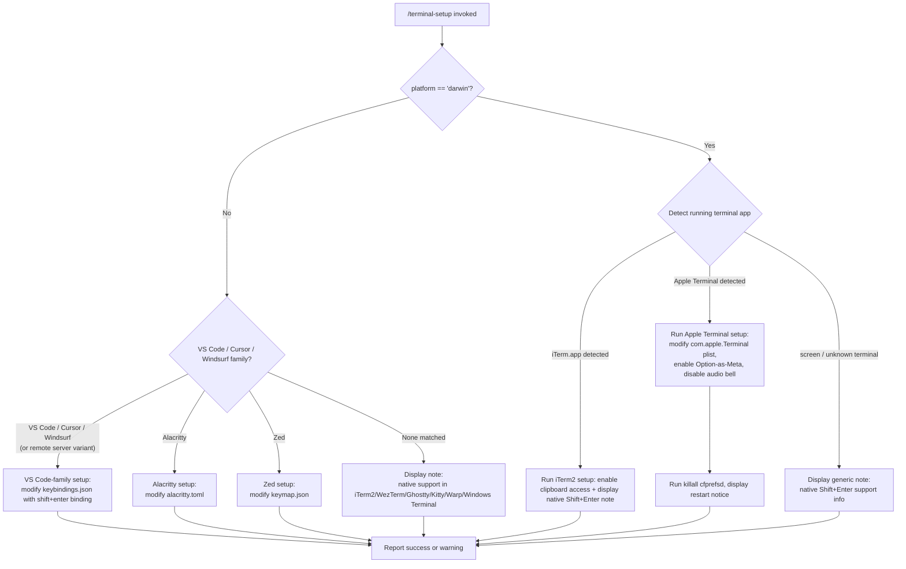

# `/terminal-setup`

> Analysis basis: CC v2.1.153 bundle.js (AST extraction + Claude interpretation)
> Minimum version: v2.1.153

---

## Overview

`/terminal-setup` installs a `Shift+Enter` key binding for entering newlines in the current terminal emulator, without submitting the prompt. It detects the active terminal environment (iTerm2, VS Code, Cursor, Windsurf, Alacritty, Zed, Apple Terminal, and others), then modifies the appropriate configuration file or system preference for that terminal. On platforms or terminal types where the binding is already native or cannot be configured, the command displays an informational note instead.

---

## Registration

| Field | Value |
|---|---|
| type | `local-jsx` |
| name | `terminal-setup` |
| description | Install Shift+Enter key binding for newlines |
| loc_byte | 12037842 |
| loc_byte_end | 12038474 |
| loc_line | 8981 |
| module_id | `Itq` |
| load_inline | `true` |
| arbor_handler.name | `BD7` |
| arbor_handler.fqn | `claude-2.1.153::BD7` |
| arbor_handler.kind | `AsyncFunction` |
| arbor_handler.resolution_path | `module_id` |
| arbor_handler.n_hits | 1 |

Analysis basis: CC v2.1.153 bundle.js:+12037842

---

## Input Branching

The command has 6+ distinct dispatch paths based on detected terminal type and platform. A Mermaid flowchart is used.



Analysis basis: CC v2.1.153 bundle.js:+3952061 (main handler `BD7`), +3950124 (platform check), +3950141–3950298 (terminal literals)

---

## Behavioral Spec

### Top-level Handler (`BD7`)

```
async function terminalSetupHandler(context):
    currentPlatform = os.platform()              // bundle.js:+3952061

    if currentPlatform == "darwin":
        runningTerminal = detectTerminalApp()    // SVH → rHH.platform, +3950124

        if runningTerminal contains "iTerm.app":
            await runIterm2Setup()               // Ntq, +3952258
        else if runningTerminal contains "screen":
            displayNote(nativeSupportMessage)    // +3952212, +3952635
        else:
            // Apple Terminal or fallback
            await runAppleTerminalSetup()        // eq8 → gD7, +3953532

    else:
        // Non-macOS: detect VS Code-family or other editors
        terminalEnv = detectVSCodeFamily()       // eq8 dispatch, +3953532
        await runCrossPlatformSetup(terminalEnv)

    display(dimmedSummary)                       // j6.dim, +3952903
```

Analysis basis: CC v2.1.153 bundle.js:+3952061

---

### Terminal Detection (`SVH` → platform check, `ej_`)

```
function detectVSCodeServerPresence(homedir):
    // Checks for .vscode-server, .cursor-server, .windsurf-server
    // under the user home directory                   // +3949712, +3949742, +3949772
    return matchedVariant   // "vscode" | "cursor" | "windsurf" | null

function detectTerminalFromEnv():
    platform = os.platform()                    // +3950124
    terminalProgram = env.TERM_PROGRAM          // checked against known values
    // Known Apple Terminal identifier: "Apple_Terminal"   // +3950165
    // Known editor terminals: "vscode", "cursor", "windsurf", "alacritty", "zed"
    //                         // +3950197, +3950221, +3950245, +3950271, +3950298
    return detectedTerminal
```

Analysis basis: CC v2.1.153 bundle.js:+3950124, +3950165–3950298

---

### iTerm2 Setup (`Ntq`)

```
async function iterm2Setup():
    domain = "com.googlecode.iterm2"            // +3951118
    key    = "AllowClipboardAccess"             // +3951142

    currentValue = runDefaults("read", domain, key)   // E8 → shell exec, +3951096

    if currentValue.trim() already truthy:
        display("iTerm2 clipboard access already enabled")   // +3951217
        return

    result = runDefaults("write", domain, key, "-bool", "YES")   // +3951305, +3951360
    if result failed:
        display(warning, "Couldn't update iTerm2 clipboard setting.")  // +3951411
    else:
        display(success, "Enabled \"Applications in terminal may access clipboard\" in iTerm2")
        // +3951502
        display(note, "Restart iTerm2 for this to take effect. Undo: defaults write ...")
        // +3951585

    display(note, "Note: You can already use backslash + return to add newlines.")
    // +3953055
    display(note, "Note: iTerm2, WezTerm, Ghostty, Kitty, Warp, and Windows Terminal support Shift+Enter natively.")
    // +3953390
```

Analysis basis: CC v2.1.153 bundle.js:+3951053 (`Ntq`), +3951118–3951585

---

### Apple Terminal Setup (`gD7`)

This is the most complex sub-routine; it modifies the macOS Terminal.app preferences plist using `defaults` and `PlistBuddy`.

```
async function appleTerminalSetup():
    prefsPath = path.join(homedir(),
        "Library", "Preferences", "com.apple.Terminal.plist")
    // +3946261, +3946271, +3946285

    // Step 1: Create a backup of the plist (Ptq)
    backupResult = await createPlistBackup(prefsPath)   // Ptq, +3958318
    if backupResult failed:
        throw Error("Failed to create backup of Terminal.app preferences, bailing out")
        // +3958336

    // Step 2: Read default profile name
    defaultProfile = runDefaults("read", "com.apple.Terminal",
                                 "Default Window Settings")
    // "defaults", "export", "com.apple.Terminal"  // +3946384, +3946396, +3946405
    // "read", "Default Window Settings"           // +3958446, +3958474
    if defaultProfile.trim() is empty:
        throw Error("Failed to read default Terminal.app profile")  // +3958534

    // Step 3: Read startup profile name
    startupProfile = runDefaults("read", "com.apple.Terminal",
                                 "Startup Window Settings")   // +3958651
    if startupProfile.trim() is empty:
        throw Error("Failed to read startup Terminal.app profile")  // +3958711

    // Step 4: For each profile (Ztq, Etq):
    //   Use /usr/libexec/PlistBuddy -c to set:
    //     "Option as Meta key" = true
    //     Audio bell disabled (visual bell enabled)
    //   Path: /usr/libexec/PlistBuddy             // +3957563, "-c" // +3957590
    profilesModified = []
    for profile in [defaultProfile, startupProfile]:
        ok = await plistBuddyModifyProfile(prefsPath, profile)
        // Ztq (default profile modifier), +3958791
        // Etq (startup profile modifier), +3958806
        if ok:
            profilesModified.push(profile)

    if profilesModified is empty:
        throw Error("Failed to enable Option as Meta key or disable audio bell for any Terminal.app profile")
        // +3958921

    // Step 5: Flush cfprefsd
    runCommand("killall", "cfprefsd")           // +3959020, +3959031

    // Step 6: Display results
    display(success, "Configured Terminal.app settings:")   // +3959073
    display("- Enabled \"Use Option as Meta key\"")         // +3959140
    display("- Switched to visual bell")                    // +3959202
    display(dimmed, "Shift+Return will now enter a newline.")   // +3959247
    display(dimmed, "Option+Enter will now enter a newline.")   // +3959296
    display(dimmed, "You must restart Terminal.app for changes to take effect.")  // +3959381
```

Analysis basis: CC v2.1.153 bundle.js:+3950384 (`eq8`→`gD7`), +3958318–3959381

---

### Plist Backup Helper (`Ptq`)

```
async function createPlistBackup(prefsPath):
    // McH: compute path: homedir() + "Library/Preferences/com.apple.Terminal.plist"
    // +3946238, +3946247
    stat the plist file                            // ij_.stat, +3946461
    if stat fails: return error

    // E8: run shell command: "defaults export com.apple.Terminal <tmpfile>"
    // +3946381, literals: "defaults", "export", "com.apple.Terminal"  // +3946384–3946405
    exportResult = await runShellCommand("defaults", "export", "com.apple.Terminal", backupPath)
    // uD7: write backup using K8 (config write helper)   // +3946553
    if failed:
        return { status: "failed" }              // +3946877
    return { status: "no_backup" | "restored" } // +3946668, +3946954
```

Analysis basis: CC v2.1.153 bundle.js:+3946340 (`Ptq`), +3946238–3946578

---

### Backup Apply / Restore Helper (`aq8`)

```
async function applyOrRestoreBackup(backupPath, prefsPath):
    // mD7: create b6 (config record)
    // LcH → K8: write config
    stat(backupPath)                              // ij_.stat, +3946731
    // E8: run "defaults import com.apple.Terminal <backupPath>"
    // "import" literal                          // +3946820
    importResult = await runShellCommand("defaults", "import", "com.apple.Terminal", backupPath)
    if importResult failed:
        log error via yH                         // +3946982
        throw Error(...)                         // +3946985
    return result
```

Analysis basis: CC v2.1.153 bundle.js:+3959560 (`aq8`), +3946642–3946985

---

### VS Code-Family Setup (`tj_` — macOS/Linux, `sj_` — macOS variant)

```
async function vscodeKeybindingSetup(variant):
    // variant: "vscode" | "cursor" | "windsurf"
    // LJ_: compute config directory
    //   win32  → AppData/Roaming/<App>/User        // +3954163, +3954179, +3954189, +3954201
    //   darwin → Application Support/<App>/User    // +3954253
    //   linux  → .config/<App>/User               // +3954293

    configDir   = resolveConfigDir(variant)        // LJ_, +3956208
    keybindPath = path.join(configDir, "keybindings.json")   // +3956227

    // Create directory if missing
    fs.mkdir(configDir, { recursive: true })        // sG.mkdir, +3956257

    // Read existing keybindings (or default to "[]")
    raw = await fs.readFile(keybindPath, "utf-8")
             ?? "[]"                               // +3956290, +3956341

    // Parse JSON via dB6
    bindings = parseJsonWithComments(raw)          // dB6, +3956358

    // Check if shift+enter binding already present
    existing = bindings.find(entry =>
        entry.key == "shift+enter" &&              // +3956676
        entry.command == "workbench.action.terminal.sendSequence" &&   // +3956698
        entry.when == "terminalFocus"              // +3956765
    )

    if existing found:
        // Already configured; no change needed
        return alreadyConfiguredResult

    // Create backup of existing file             // $D6.randomBytes, +3956408; sG.copyFile, +3956471
    backupPath = keybindPath + "." + randomHex()
    fs.copyFile(keybindPath, backupPath)

    // Insert new binding object:
    //   { key: "shift+enter",
    //     command: "workbench.action.terminal.sendSequence",
    //     args: { text: "\x1b\r" },              // ESC+CR sequence, +3956750
    //     when: "terminalFocus" }
    newBindings = insertBinding(bindings, newEntry)   // fNA / MNA, +3957154
    await fs.writeFile(keybindPath, JSON.stringify(newBindings, null, 2))
    // sG.writeFile, +3957176

    display(success, "Installed <Variant> Shift+Enter key binding")
    if variant != "vscode":
        display(warning, "VSCode" warning note)    // +3955541, +3955574
    return successResult
```

Analysis basis: CC v2.1.153 bundle.js:+3950418 (`tj_`), +3950443 (`sj_`), +3956227–3957425

---

### Alacritty Setup (`QD7`)

```
async function alacrittySetup():
    candidates = buildAlacrittyConfigPaths()     // A.push, rHH.homedir, rHH.platform
                                                 // +3959996, +3960003, +3960064, +3960122
    // Typical candidate: ~/.config/alacritty/alacritty.toml  // +3960025

    configPath = candidates.find(p => fs.exists(p))
    if not found:
        throw Error("No valid config path found for Alacritty")   // +3960388

    raw = await fs.readFile(configPath, "utf-8")   // sG.readFile, +3960275

    // Check if already configured
    if raw.includes('mods = "Shift"') &&           // +3960456
       raw.includes('key = "Return"'):             // +3960486
        display("Alacritty Shift+Enter key binding already configured")  // +3960529
        return

    // Create backup                               // $D6.randomBytes, +3960628; sG.copyFile, +3960691
    backupPath = configPath + "." + randomHex()
    fs.copyFile(configPath, backupPath)
    if backup fails:
        throw Error("Error backing up existing Alacritty config. Bailing out.")  // +3960739

    // Ensure [keyboard] section exists; inject binding TOML fragment
    // mkdir parent if needed                       // sG.mkdir, +3960887; wR.dirname, +3960896
    newContent = injectAlacrittyBinding(raw)
    await fs.writeFile(configPath, newContent)     // sG.writeFile, +3961057

    display(success, "Installed Alacritty Shift+Enter key binding")   // +3961113
    display(note, "You may need to restart Alacritty for changes to take effect")  // +3961183
```

Analysis basis: CC v2.1.153 bundle.js:+3950631 (`QD7`), +3959996–3961408

---

### Zed Setup (`dD7`)

```
async function zedSetup():
    keymapPath = path.join(homedir(), ".config", "zed", "keymap.json")
    // wR.join, rHH.homedir  // +3961492, +3961500
    fs.mkdir(parent(keymapPath), { recursive: true })   // sG.mkdir, +3961568

    raw = await fs.readFile(keymapPath, "utf-8")        // sG.readFile, +3961623
           ?? "[]"

    parsed = JSON.parse(raw)                            // U6, +3962099

    // Check if "shift-enter" already present          // +3961709
    if parsed.some(entry => entry includes "shift-enter"):
        display("Zed Shift+Enter key binding already configured")   // +3961749
        return

    // Backup existing keymap                          // $D6.randomBytes, +3961842; sG.copyFile, +3961905
    backupPath = keymapPath + "." + randomHex()
    fs.copyFile(keymapPath, backupPath)
    if fails:
        throw Error("Error backing up existing Zed keymap. Bailing out.")   // +3961953

    // Build new entry:
    //   { context: "Terminal",                        // +3962162
    //     bindings: { "shift-enter": "terminal::SendText" with payload } }
    //   "terminal::SendText"                          // +3962198
    if not Array.isArray(parsed):
        parsed = []
    parsed.push(newEntry)                              // L.push, +3962146
    await fs.writeFile(keymapPath, JSON.stringify(parsed, null, 2))   // sG.writeFile, +3962238, RH +3962253

    display(success, "Installed Zed Shift+Enter key binding")   // +3962309
    // on error:
    throw Error("Failed to install Zed Shift+Enter key binding")   // +3962518
```

Analysis basis: CC v2.1.153 bundle.js:+3950662 (`dD7`), +3961492–3962518

---

### Shell Command Runner (`E8`)

```
async function runShellCommand(args[]):
    // G_: spawn subprocess; collects stdout/stderr
    // Limits: 10 parallel  // +1048413
    //         1,000,000 byte output cap  // +1048935
    //         1 retry     // +1049058
    // On error level "error": log via an.logError  // +1049362
    spawn(args)
    await completion
    return { stdout, stderr, exitCode }
```

Analysis basis: CC v2.1.153 bundle.js:+1048468 (`E8`→`G_`)

---

### JSON-with-Comments Parser (`dB6`)

```
function parseJsonWithComments(raw):
    // QB6: strip // and /* */ comments from raw string
    // Pb: handle leading BOM or whitespace       // +1094026, +1094049
    // N: standard JSON parse                     // +1094320
    // String: coerce result if needed            // +1094377
    return parsedObject
```

Analysis basis: CC v2.1.153 bundle.js:+3956358 (`dB6`), +1094293–1094377

---

### Keybinding JSON Modifier (`fNA` / `MNA`)

```
function insertKeybinding(existingBindings, newEntry):
    // tvA: AST-based JSON insertion              // +1088739–1089630
    // di8: fallback insertion via string slice   // +1091932–1092124
    // Validates array structure (Array.isArray)  // +1096133
    // Returns modified JSON string
    return updatedJsonString
```

Analysis basis: CC v2.1.153 bundle.js:+3957154 (`fNA`), +1096073–1096480

---

## State & Side Effects

| Item | Detail |
|---|---|
| Telemetry | `tengu_config_auth_loss_prevented` (+3201484), `tengu_bg_spare_enable` (+15385533), `tengu_bg_low_mem_mb` (+12668289), `tengu_bg_spare_spawn` (+15385893), `tengu_config_lock_contention` (+3204155), `tengu_config_stale_write` (+3204291), `tengu_config_parse_error` (+3206730), `tengu_feature_ok` (+965124) |
| File writes | `keybindings.json` (VS Code/Cursor/Windsurf), `alacritty.toml` (Alacritty), `keymap.json` (Zed), `com.apple.Terminal.plist` via `defaults`/`PlistBuddy` (Apple Terminal) |
| File backups | Each config write is preceded by a `copyFile` to a randomised `.backup.<hex>` path |
| Process spawns | `defaults`, `/usr/libexec/PlistBuddy`, `killall cfprefsd` (macOS only) via shell command runner (`E8`) |
| appState changes | None directly observed; config-lock telemetry (`tengu_config_lock_contention`) may be emitted on concurrent writes |
| Sound | None |
| Hook registration | None (local-jsx; no persistent hook) |

---

## Version History

| Version | Change |
|---|---|
| v2.1.153 | Initial analysis |

---

## Common Mistakes

1. **Running on non-macOS without a supported editor** — The command only configures Apple Terminal and iTerm2 on macOS. On Linux/Windows without a recognised editor (VS Code, Cursor, Windsurf, Alacritty, Zed) it will only print the native-support note and make no changes.
2. **Not restarting the terminal after setup** — Apple Terminal requires a restart for plist changes to take effect. The command prints this warning but users often miss it.
3. **Running inside a remote VS Code server session** — The `.vscode-server`, `.cursor-server`, or `.windsurf-server` detection (`ej_`) checks the home directory. Inside a remote session the config path may differ from what the user expects; keybindings are written to the remote machine's home.
4. **Alacritty TOML format assumption** — The binding injection assumes the `alacritty.toml` (not the legacy `alacritty.yml`) format. If the user has an older YAML config the injection may produce a malformed file (the backup will allow manual recovery).
5. **Concurrent Claude instances** — The config-write path uses a file lock; if another Claude instance holds it, `tengu_config_lock_contention` is emitted and the write is skipped silently.

---

## Appendix — Identifier Mapping

> For bundle debugging only. Identifiers change across versions.

| Identifier | Role |
|---|---|
| `BD7` | Main async handler for `/terminal-setup` (Arbor-resolved entry point) |
| `SVH` | Detects running terminal application name via `rHH.platform` |
| `eq8` | Cross-platform terminal setup dispatcher |
| `gD7` | Apple Terminal full setup routine |
| `Ptq` | Apple Terminal plist backup creator |
| `McH` | Constructs path to `com.apple.Terminal.plist` via `Xtq.join` + `Jtq.homedir` |
| `E8` | Shell command runner (spawns subprocesses, collects output) |
| `G_` | Low-level subprocess spawn helper |
| `S6` | Secondary shell helper (used within `E8`) |
| `uD7` | Writes backup data using config writer `K8` |
| `K8` | Config write helper (global config persistence) |
| `yH` | Async log / error reporter |
| `l_` | Error wrapper / normaliser |
| `xH` | String coercion utility |
| `_1` | Internal queue/flow helper |
| `GH4` | Circular buffer shift/push for log queue |
| `Ztq` | PlistBuddy modifier for default Terminal.app profile |
| `Etq` | PlistBuddy modifier for startup Terminal.app profile |
| `LcH` | Config-write dispatcher wrapping `K8` |
| `EA` | ANSI/styled output renderer (handles foreground/background colours) |
| `xzH` | Chalk-style colour tag parser (maps colour names to `j6.*` methods) |
| `SQ` | Fallback styled output helper |
| `Ntq` | iTerm2 setup routine (clipboard access + notes) |
| `sq8` | Supporting helper invoked from `BD7` |
| `tj_` | VS Code-family keybinding setup (primary path) |
| `sj_` | VS Code-family keybinding setup (macOS-specific variant) |
| `ej_` | Remote server detection (`.vscode-server`, `.cursor-server`, `.windsurf-server`) |
| `LJ_` | Resolves editor config directory per platform |
| `dB6` | JSON-with-comments parser |
| `Pb` | BOM/whitespace strip helper for JSON strings |
| `_9` | File-error classifier (ENOENT, EACCES, EPERM, etc.) |
| `zx` | Hyperlink/URL renderer for terminal output |
| `pP` | Hyperlink capability detector |
| `hD` | Terminal type identifier helper |
| `fNA` | Keybinding JSON insert (append mode) |
| `MNA` | Keybinding JSON insert (modify/merge mode) |
| `Qi8` | JSON AST insertion orchestrator |
| `tvA` | JSON AST node inserter |
| `di8` | JSON AST slice-based fallback inserter |
| `gB6` | JSON substring extractor for AST operations |
| `QD7` | Alacritty config setup routine |
| `dD7` | Zed keymap setup routine |
| `U6` | Safe `JSON.parse` wrapper |
| `KcH` | Onboarding / first-run orchestrator (called from `eq8`) |
| `XO` | App state updater (`zQH`, `b6`, `v9`) |
| `Dtq` | Onboarding check dispatcher |
| `nj_` | CLAUDE.md workspace detection helper |
| `wB6` | Workspace context helper |
| `hz` | Project config read/write helper |
| `pO_` | Config file persistence (lock, stat, copy, backup rotation) |
| `r3q` | Config object builder / `Object.assign` wrapper |
| `EzH` | Config file reader with parse and schema validation |
| `Wz6` | Config cache manager |
| `UO_` | Directory path builder for config backups |
| `c76` | Atomic file writer (temp file + rename + fchmod + fsync) |
| `fQH` | Config field accessor |
| `$QH` | Timestamp-stamped config snapshot helper |
| `mO_` | Project config save helper (dirname + backup + `c76`) |
| `SH` | Feature-flag checker (`tengu_feature_ok`) |
| `KJ_` | Keybinding file read helper (shared by `tj_`/`sj_`) |
| `FD7` | File descriptor helper for keybinding path resolution |
| `qJ_` | Config accessor variant (reads `b6`) |
| `_J_` | Config accessor variant B |
| `AJ_` | Config accessor variant C |
| `HJ_` | Config accessor variant D |
| `aq8` | Backup apply / plist restore helper |
| `mD7` | Config record factory used by `aq8` |
| `b6` | Config record constructor / session state builder |
| `D` | Background spawn manager / session record list |
| `T6` | Background process entry factory |
| `wHH` | Process handle string formatter |
| `O88` | Background process deduplication helper |
| `Ar1` | Session dispose / cleanup handler |
| `wk8` | Background spare process allocator |
| `wLA` | Background PTY host spawner (Bun.spawn) |
| `Y1` | Background process label helper |
| `QI1` | Spare process path builder |
| `dI1` | Alternate spare process path builder |
| `Zl` | Spare process socket path builder |
| `fm5` | PTY host file path helper |
| `qm5` | PTY host argument builder |
| `Ch` | PTY host stdio helper |
| `c` | Generic config/state accessor |
| `Wz` | Logger / write-to-stderr helper |
| `J8` | Promise / async utility |
| `N` | HTTP/IPC request sender (used for telemetry and config sync) |
| `chK` | HTTP request builder |
| `H` | Randomised retry / backoff timer |
| `RH` | `JSON.stringify` wrapper |
| `j4` | Log-line formatter |
| `ixH` | Non-obvious output helper |
| `ihK` | IPC message writer with `Buffer.byteLength` framing |
| `Dz6` | Background process status enum |
| `wz6` | Background process type enum |
| `V` | Platform capability flags |
| `P` | SDK connection manager |
| `E` | Byte-slice utility |