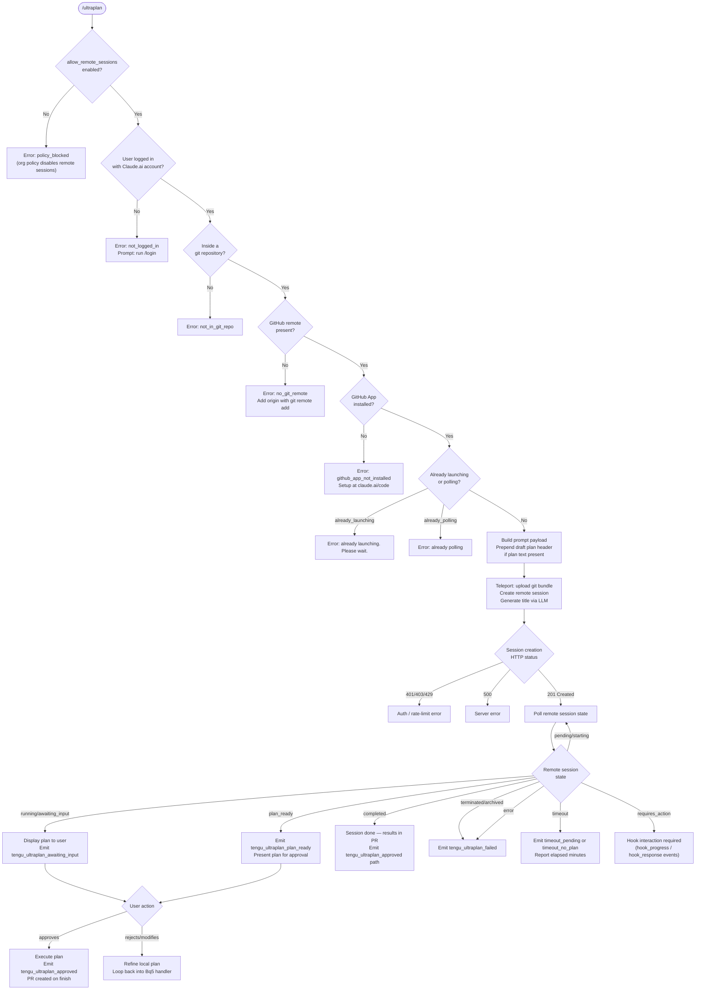

# `/ultraplan`

> Analysis basis: CC v2.1.153 bundle.js (AST extraction + Claude interpretation)
> Minimum version: v2.1.153

---

## Overview

`/ultraplan` launches a remote Claude Code web session that drafts an actionable plan in the cloud based on a user-supplied prompt. The plan is presented for interactive review and approval in the browser before any execution takes place, with results delivered back as a pull request. The command performs a series of eligibility checks (authentication, git repository, GitHub remote, organization policy) before initiating the remote teleport workflow.

---

## Registration

| Field | Value |
|---|---|
| type | `local-jsx` |
| name | `ultraplan` |
| description | `" ... · Claude Code on the web drafts a plan you can edit and approve. See ..."` |
| argumentHint | `<prompt>` |
| load_inline | `true` |
| load_ident | `Fq5` |
| loc_byte | `11892795` |
| loc_byte_end | `11893039` |
| loc_line | `8763` |
| arbor_handler.name | `Fq5` |
| arbor_handler.kind | `AsyncFunction` |
| arbor_handler.fqn | `claude-2.1.153::Fq5` |
| arbor_handler.resolution_path | `load_ident` |
| arbor_handler.n_hits | `1` |

Analysis basis: CC v2.1.153 bundle.js:+11892795

---

## Input Branching

The command exhibits more than three distinct input/state branches across pre-flight checks and session lifecycle transitions, so a Mermaid flowchart is used.



Analysis basis: CC v2.1.153 bundle.js:+11890939, +11888202, +11888454, +11875893

---

## Behavioral Spec

### 1. Handler Entry — `ultraplanHandler` (`Fq5`)

The top-level async handler is resolved via the `load_ident` path (no separate module; inlined as `Promise.resolve({call: Fq5})`).

```
async function ultraplanHandler(context):
    prompt = context.userInput          // raw CLI argument
    appState = getAppState()

    // 1. Check org policy
    if not appState.allow_remote_sessions:
        return earlyExit("policy_blocked")

    // 2. Expand prompt tokens (resolvePromptTokens)
    resolvedPrompt = resolvePromptTokens(prompt)   // calls g08 -> F08 -> pg_

    // 3. Telemetry: record invocation source ("slash")
    recordSource("slash")               // literal at +11891085

    // 4. Run eligibility checks (X9)
    eligibilityResult = checkRemoteEligibility(appState)
    if eligibilityResult.error:
        return renderError(eligibilityResult)

    // 5. Launch ultraplan session (YI6 -> Bq5 -> nc)
    sessionResult = await launchUltraplanSession(resolvedPrompt, context)

    // 6. Persist or clear orphaned session reference (b6 -> EzH)
    updateConfigState(sessionResult)

    // 7. Archive orphaned sessions if applicable
    archiveOrphanedSession(sessionResult)    // +11890624

    // 8. Update app state
    setAppState(newState)
```

Analysis basis: CC v2.1.153 bundle.js:+11890939, +11891085, +11891274, +11891429, +11891492

---

### 2. Prompt Token Resolution — `resolvePromptTokens` (`g08` → `F08` → `pg_`)

Normalises the raw user input before it reaches the remote session.

```
function resolvePromptTokens(rawInput):
    // pg_: strip leading index (offset 0 check)
    tokens = rawInput.startsWith(...)      // +9647653
    // collect token list, apply regex gi match  // literal "gi" at +9648051
    matches = rawInput.matchAll(regex_gi)
    
    // check for "ultraplan" keyword presence in prompt body  // literal at +9648403
    hasKeyword = tokens.some(t => t === "ultraplan")
    
    // build expanded token array (f.push)
    expandedTokens.push(resolvedToken)     // +9648331

    // g08: slice prompt, apply replacement pattern "$1$2"   // literal at +9648729
    sliced = rawInput.slice(...)           // +9648632
    result = sliced.replace(pattern, "$1$2")  // +9648703

    // truncate to max segment count = 5   // literal at +9648752
    return result.slice(0, 5)
```

Analysis basis: CC v2.1.153 bundle.js:+9647653, +9648051, +9648331, +9648403, +9648632, +9648703, +9648729, +9648752

---

### 3. Remote Eligibility Check — `checkRemoteEligibility` (`X9`)

Validates the preconditions for a remote session before any network call is made.

```
function checkRemoteEligibility(appState):
    // Check feature flag: allow_remote_sessions   // literal at +11890960
    if not appState["allow_remote_sessions"]:
        return {error: "policy_blocked", message: "Remote sessions are disabled..."}  // +8859042

    // Tier check: firstParty / enterprise / team  // literals at +4095652, +4095925, +4095960
    if userTier not in ["firstParty", "enterprise", "team"]:
        return {error: "not_logged_in",
                message: "Please run /login and sign in with your Claude.ai account (not Console)."}
                // +8858531

    // Check allow_product_feedback setting       // literal at +4096201
    // Read config file (ID6: readFileSync utf-8) // +4096010, +4096033

    // Check git repository presence
    if not insideGitRepo():
        return {error: "not_in_git_repo"}         // literal at +8858610

    // Check GitHub remote URL
    gitRemoteUrl = git("config", "--get", "remote.origin.url")  // literals +1062051, +1062059
    if not gitRemoteUrl:
        return {error: "no_git_remote",
                message: "Background tasks require a GitHub remote. Add one with `git remote add origin REPO_URL`."}
                // +8858770

    // Check GitHub App installation (UyH)
    if not githubAppInstalled():
        return {error: "github_app_not_installed"}  // +8858865

    // mj7.has(): check seen-set membership to avoid duplicate launches  // +4096170
    if alreadySeen(sessionId):
        return {error: "duplicate"}

    return {ok: true}
```

Analysis basis: CC v2.1.153 bundle.js:+11890960, +8858531, +8858610, +8858770, +8858865, +4096170, +1062051, +1062059

---

### 4. Launch Ultraplan Session — `launchUltraplanSession` (`YI6`)

Orchestrates the state guard, teleport initiation, and polling loop.

```
async function launchUltraplanSession(prompt, context):
    // Guard: detect already_polling or already_launching   // literals at +11888454, +11888472
    if stateFlags.alreadyPolling:
        return {error: "already_polling"}
    if stateFlags.alreadyLaunching:
        return {error: "already_launching",
                message: "ultraplan: already launching. Please wait for the session to start."}
                // +11887066

    // Usage hint when prompt absent
    if prompt is empty:
        emitHint('Usage: /ultraplan <prompt>, or include "ultraplan" anywhere in your prompt')
        // literals at +11888518, +11888584

    // Set launching flag via trackPendingOp (L)   // +11888391
    trackPendingOp(() => {
        stateFlags.alreadyLaunching = true
    })

    // Initiate teleport (ON8 -> $N8 -> T6)
    teleportResult = await initiateRemoteSession(prompt)   // +11888607

    // Start polling loop (Bq5)
    return await pollAndHandleSession(teleportResult, prompt, context)  // +11888721
```

Analysis basis: CC v2.1.153 bundle.js:+11888454, +11888472, +11887066, +11888518, +11888391, +11888607, +11888721

---

### 5. Remote Session Creation — `createRemoteSession` (`nc`)

Calls the Anthropic remote-sessions API to start a cloud Ultraplan environment.

```
async function createRemoteSession(prompt, orgUuid, accessToken):
    // Policy check: org may disable remote sessions  // +8789688
    if orgPolicy.remote_sessions_disabled:
        throw Error("Remote sessions are disabled by your organization's policy.")

    // Retrieve access token; fail fast if missing    // +8789796
    if not accessToken:
        throw Error("No access token found for remote session creation")

    // Resolve org UUID                               // +8790106
    if not orgUuid:
        throw Error("Unable to get organization UUID for remote session creation")

    // Determine git bundle upload mode (kp_ -> teleport_git_bundle_upload)
    bundleMode = determineBundleMode()    // telemetry: tengu_teleport_bundle_mode at +8790855

    // Build request headers with beta flag
    headers = {
        "Content-Type": "application/json",           // +3149525, +3149540
        "anthropic-version": "2023-06-01",            // +3149559, +3149579
        "anthropic-beta": "ccr-byoc-2025-07-29",      // +8790428, +8790445
        "x-organization-uuid": orgUuid,               // +8790467
    }

    // Upload git bundle (kp_)
    // Seed refs: refs/seed/stash, refs/seed/root     // +8775308, +8775326
    // Strategies: head, fallback_head, squashed, fallback_squashed  // +8777156..+8777273
    bundleResult = await uploadGitBundle(bundleMode)   // telemetry: tengu_ccr_bundle_upload

    // Generate session title via LLM (mWL)
    // Template: "claude/task" with max 75 chars       // +8778495, +8778501
    // Schema fields: title, branch                    // +8778725, +8778733
    titleResult = await generateTitle(prompt)          // telemetry: tengu_teleport_generate_title

    // Generate UUID for this task (kq1 -> hp_.randomUUID)   // +8789280
    taskId = randomUUID()

    // POST session creation request
    // Expected success status: 201                    // +8791779
    response = await httpClient.post(endpoint, payload, headers)

    // Error mapping:
    //   401/403/429 → auth/rate errors               // +8791848, +8791852, +8791856
    //   500         → server error                   // +8791743
    //   409         → conflict / duplicate           // +8797972
    //   !sessionId  → "Server returned a malformed session response (no session id)"  // +8792204

    // Auto-create default cloud environment if none available (btH)
    // Env defaults: python 3.11, node 20, /home/user  // +8744424..+8744470
    //   teleport_default_environment_create telemetry // +8743961

    return sessionResult
```

Analysis basis: CC v2.1.153 bundle.js:+8789688, +8789796, +8790106, +8790445, +8790467, +8791779, +8792204, +8778495, +8775308

---

### 6. Git Bundle Upload — `uploadGitBundle` (`kp_`)

Packages the local repository and uploads it as the session seed.

```
async function uploadGitBundle(mode):
    // Abort if not in git repo
    if not isGitRepo():
        throw {code: "empty_repo", message: "Not in a git repository"}  // +8775236, +8775268

    // Clean up stale seed refs
    git("update-ref", "-d", "refs/seed/stash")    // +8775359, +8775372, +8775308
    git("update-ref", "-d", "refs/seed/root")     // +8775326

    // Check for any refs
    refCount = git("for-each-ref", "--count=1", "refs/")  // +8775410, +8775425, +8775437
    if refCount == 0:
        throw {code: "empty_repo", message: "Repository has no commits yet"}  // +8775614

    // Create stash bundle
    git("stash", "create")                        // +8775692, +8775700

    // Verify HEAD
    git("rev-parse", "--verify", "HEAD")          // +8776044, +8776056, +8776067

    // Write bundle file: ccr-seed.bundle / _source_seed.bundle  // +8776495, +8776506, +8776798
    bundlePath = writeBundleFile("ccr-seed.bundle")

    // Upload via HTTP (status 200 expected)       // +8776020
    uploadResult = await httpClient.put(uploadUrl, bundleData)

    if uploadResult.status != 200:
        return {status: "upload_failed"}           // +8776943

    // Strategies in priority order: head, fallback_head, squashed, fallback_squashed
    // +8777156, +8777195, +8777230, +8777273
    return {status: "success", strategy: chosen}   // +8777092

    // Cleanup: UtH.unlink(bundlePath)             // +8777431
```

Analysis basis: CC v2.1.153 bundle.js:+8775236, +8775308, +8775410, +8776020, +8776495, +8776798, +8776943, +8777092, +8777431

---

### 7. Session Poll Loop — `pollAndHandleSession` (`Bq5`)

Drives the interactive plan review cycle after session creation.

```
async function pollAndHandleSession(session, prompt, context):
    // Register task notification hook              // literal "task-notification" at +11889219
    registerHook("task-notification")

    // Run bg_remote_eligibility_check (M91)        // literal at +8856665
    eligibility = await checkBgRemoteEligibility()

    // Verify not byoc tier                         // literal "byoc" at +8856968
    // Ensure github.com remote (not GHES optimistic)  // +8857256

    // Build draft plan header (xq5)
    // Prepend "Here is a draft plan to refine:"    // literal at +11884184
    // Plan body assembled via bq5 -> Sq5

    // Launch local workflow (Lw -> W_)             // "cli" source at +11889822
    localWorkflow = spawnLocalWorkflow(planText)

    // Emit tengu_ultraplan_launched                // +11889909

    // Open browser session (ayH -> NtH -> Is.open)  // +12901851
    // Generate random session id (ZI -> NHK.randomBytes, 8 bytes)  // +12902933, +12902949

    // Begin polling loop (uq5 -> zU1)
    // Timeout: 5400 seconds max                   // literal at +11883877
    //   Poll interval: 1000 ms base               // +8865100
    //   Max poll duration: 1800000 ms (30 min)    // +8865107
    timeout_seconds = 5400                          // +11883877
    startTime = Date.now()

    while elapsed < timeout_seconds * 1000:
        taskState = await pollSessionState(session.id)  // z91

        switch taskState.status:
            case "pending", "starting":
                await sleep(pollInterval)
                // Emit tengu_ultraplan_timeout_seconds periodically
                continue

            case "running", "needs_input":
                // Emit tengu_ultraplan_awaiting_input   // +11884487
                presentPlanToUser(taskState.plan)
                userDecision = await awaitUserInput()

                if userDecision == "approve":
                    // Emit tengu_ultraplan_approved     // +11884963
                    submitApproval(session.id)
                    break

                else:  // refine
                    // Label: "Refine local plan"        // +11889362
                    refinePlan(userDecision)

            case "plan_ready":
                // Emit tengu_ultraplan_plan_ready       // +11884555
                presentFinalPlan(taskState.plan)

            case "completed", "approved":
                // "Results will land as a pull request when the remote session finishes."
                // literal at +11885449
                displayCompletionMessage()
                return {ok: true}

            case "terminated", "archived", "error":
                // Emit tengu_ultraplan_failed           // +11885836
                // "Remote Ultraplan session failed. Wait for the user's next instructions."
                // +11886243
                displayFailureMessage()
                return {ok: false, error: taskState.error}

            case "requires_action":
                handleHookInteraction(taskState)  // hook_progress / hook_response  // +8866297, +8866326

        // Timeout branch
        if elapsed >= timeout_seconds * 1000:
            if no plan received:
                return {error: "timeout_no_plan"}  // +11876264
            else:
                return {error: "timeout_pending"}  // +11876246
            // Report elapsed in minutes            // literals "minute"/"minutes" +11876038, +11876047

    // Unexpected error path
    // Emit code "unexpected_error"                 // +11890318
    // Message: "Ultraplan hit an unexpected error during launch. Wait for the user's next instructions."
    // +11890476
```

Analysis basis: CC v2.1.153 bundle.js:+11889219, +11884184, +11889909, +11883877, +8865100, +8865107, +11884487, +11884963, +11885449, +11885836, +11876264, +11876246, +11890318, +11890476

---

### 8. Session State Poller — `pollSessionState` (`z91`)

Inner loop that retrieves live session data from the remote API.

```
async function pollSessionState(sessionId):
    // Fetch session detail via GET (n_.get)
    // Retry on network error (network_or_unknown)   // +11875127
    // Max retry message: "Lost connection to the remote session after repeated retries"  // +11875201

    response = await httpClient.get(sessionEndpoint(sessionId))

    // Check for extract_marker_missing              // literal at +11875461
    if response.markerMissing:
        log("extract_marker_missing")

    // Parse remote-workflow events                  // literal "remote-workflow" at +8865760
    // Hook events: hook_started, hook_progress, hook_response  // +8866817, +8866297, +8866326

    // Terminal states: completed, archived, terminated
    // Result type: "result" field                   // +8866114

    // Session exceeded 30 minutes guard:
    // "remote session exceeded 30 minutes"          // +8867749
    if elapsed > 1800000:
        return {status: "timeout", message: "remote session exceeded 30 minutes"}

    // No review output guard:
    // "no review output — orchestrator may have exited early"  // +8867786
    if resultEmpty:
        return {status: "error", message: "no review output..."}

    return parsedState
```

Analysis basis: CC v2.1.153 bundle.js:+11875127, +11875201, +8865760, +8866114, +8867749, +8867786

---

### 9. GitHub App Installation Check — `checkGithubAppInstalled` (`UyH`)

Pre-flight check called inside eligibility validation.

```
async function checkGithubAppInstalled(accessToken, orgUuid):
    if not accessToken:
        // "checkGithubAppInstalled: No access token found, assuming app not installed"
        log(+8745255)
        return false

    if not orgUuid:
        // "checkGithubAppInstalled: No org UUID found, assuming app not installed"
        log(+8745368)
        return false

    // GET installation check endpoint (n_.get)
    response = await httpClient.get(checkEndpoint)

    // HTTP 400 → not installed                     // +8746026
    if response.status == 400:
        return false

    // Log result: "is" or "is not"                 // +8745766, +8745771
    return response.data.installed
```

Analysis basis: CC v2.1.153 bundle.js:+8745255, +8745368, +8746026, +8745766

---

### 10. Config State Persistence — `persistConfigState` (`b6` → `EzH`)

Reads and writes the Claude Code config file to track session references.

```
function persistConfigState(sessionData):
    // Guard: config must be accessible before use  // +3206099
    // Read config file via readFileSync             // +3206155
    config = readFileSync(configPath, "utf-8")      // encoding literal +4096033

    // Parse JSON (U6 -> JSON.parse)                // +183848
    parsed = JSON.parse(config)

    // Backup management (UUq -> UO_)
    // Backup dir: "backups" subdir                 // +3205667
    // Skip files starting with specific prefixes (f.startsWith)  // +3205775
    manageBackups(configDir)

    // Write updated config with session reference
    // Copy with copyFileSync + mkdirSync            // +3207238, +3206909
    // Emit tengu_config_parse_error on JSON error   // telemetry at +3206730

    // File watcher registration (jq7 -> T88.watchFile)  // +3202487
    // Unwatch on completion (T88.unwatchFile)       // +3202817
    registerConfigWatcher(configPath)
```

Analysis basis: CC v2.1.153 bundle.js:+3206099, +3206155, +3206329, +3205667, +3207238, +3206909, +3206730

---

## State & Side Effects

| Item | Detail |
|---|---|
| Telemetry: `tengu_ultraplan_create_failed` | Fired when session creation fails (bundle.js:+11888239) |
| Telemetry: `tengu_ultraplan_prompt_identifier` | Records how the prompt was identified (bundle.js:+11884010) |
| Telemetry: `tengu_ultraplan_launched` | Fired on successful remote session launch (bundle.js:+11889909) |
| Telemetry: `tengu_ultraplan_timeout_seconds` | Reports timeout elapsed seconds (bundle.js:+11883877) |
| Telemetry: `tengu_ultraplan_awaiting_input` | Fired when remote session waits for user approval (bundle.js:+11884487) |
| Telemetry: `tengu_ultraplan_plan_ready` | Fired when remote session produces a plan (bundle.js:+11884555) |
| Telemetry: `tengu_ultraplan_approved` | Fired when user approves the plan (bundle.js:+11884963) |
| Telemetry: `tengu_ultraplan_failed` | Fired when remote session fails or is terminated (bundle.js:+11885836) |
| Telemetry: `tengu_ccr_bundle_seed_enabled` | Fired when bundle seed upload is enabled (bundle.js:+8857060) |
| Telemetry: `tengu_ccr_bundle_upload` | Fired on git bundle upload attempt (bundle.js:+8775500) |
| Telemetry: `tengu_teleport_bundle_mode` | Records which bundle upload mode was chosen (bundle.js:+8790855) |
| Telemetry: `tengu_ccr_session_link` | Records session link for tracking (bundle.js:+8785256) |
| Telemetry: `tengu_teleport_source_decision` | Records repository source decision (bundle.js:+8795928) |
| Telemetry: `tengu_config_parse_error` | Fired when config JSON parse fails (bundle.js:+3206730) |
| Telemetry: `tengu_bg_dispatch_sigkill_escalate` | Escalation when background process must be killed (bundle.js:+15386200) |
| Telemetry: `tengu_feature_bad` / `tengu_feature_ok` | Feature gate pass/fail signals (bundle.js:+965182, +965124) |
| Telemetry: `tengu_bg_low_mem_mb` | Low memory condition in background dispatcher (bundle.js:+12668289) |
| Telemetry: `tengu_bg_dispatch_low_mem` | Background dispatch suppressed due to low memory (bundle.js:+15386779) |
| Telemetry: `tengu_bg_spare_enable` | Spare worker enabled (bundle.js:+15387474) |
| Telemetry: `tengu_bg_sendclaim_failed` | Claim send to spare worker failed (bundle.js:+15366922) |
| Telemetry: `tengu_bg_spare_claim` | Spare worker claim recorded (bundle.js:+15387595) |
| Telemetry: `tengu_bg_spare_spawn` | Spare worker spawned (bundle.js:+15385893) |
| Telemetry: `tengu_bg_spare_claim_fail` | Spare worker claim failed (bundle.js:+15387858) |
| Hook registration | `task-notification` hook registered during session poll (bundle.js:+11889219) |
| Config file watcher | `watchFile` registered on Claude config; unwatched on completion (bundle.js:+3202487, +3202817) |
| appState changes | `allow_remote_sessions` read at entry (bundle.js:+11890960); `setAppState` called on exit (bundle.js:+11891492) |
| Browser open | Remote session URL opened via `Is.open` (bundle.js:+12901851) |
| Git side effects | Stash refs created and deleted (`refs/seed/stash`, `refs/seed/root`); bundle file written and unlinked (bundle.js:+8775308, +8777431) |
| Sound | <!-- TODO: not found in depth-2 traversal; needs --depth 4 --> |
| Session timeout | Hard ceiling: 5400 seconds total wait (bundle.js:+11883877); remote session 30-minute guard (bundle.js:+8865107) |

---

## Version History

| Version | Change |
|---|---|
| v2.1.153 | Initial analysis |

---

## Common Mistakes

1. **Using an API key instead of a Claude.ai account login.** The error message `not_logged_in` is emitted and the command instructs the user to run `/login` with their Claude.ai account, not a Console API key (bundle.js:+8858531).
2. **Running in a directory without a git repository.** The `not_in_git_repo` error fires immediately after the auth check. The directory must be a valid git repo (bundle.js:+8858610).
3. **Missing GitHub remote.** Even in a git repo, the command requires `remote.origin.url` to be set to a GitHub remote. The error `no_git_remote` guides users to `git remote add origin REPO_URL` (bundle.js:+8858770).
4. **Invoking `/ultraplan` twice rapidly.** A second invocation while the session is still initialising returns `already_launching` with a message to wait (bundle.js:+11887066).
5. **Working in an organisation that has remote sessions disabled by policy.** The `policy_blocked` error means an org admin must enable remote sessions; no workaround exists at the CLI level (bundle.js:+8859042).
6. **Repository with no commits.** Even if git is present, an empty repository (no refs) causes `empty_repo`/`Repository has no commits yet` and the upload is refused (bundle.js:+8775614).
7. **Omitting the prompt argument.** Without a prompt, the command emits only a usage hint and exits without launching a session (bundle.js:+11888518).

---

## Appendix — Identifier Mapping

> For bundle debugging only. Identifiers change across versions.

| Identifier | Role |
|---|---|
| `Fq5` | Top-level async handler for `/ultraplan` (main entry point) |
| `g08` | Prompt token resolution dispatcher |
| `F08` | Token resolution sub-routine (mid-layer) |
| `pg_` | Prompt token parser / expander (regex match, `startsWith`, `matchAll`) |
| `X9` | Remote eligibility checker |
| `bH9` | Eligibility sub-router |
| `kD6` | Config/tier read orchestrator |
| `TR` | Auth tier classification function |
| `ID6` | Config file reader (readFileSync) |
| `T4H` | Tier membership tester (includes check) |
| `_1` | String normaliser helper |
| `fZA` | String conversion wrapper |
| `xH` | String coercion utility (calls `String`) |
| `JKH` | Secondary string coercion helper |
| `iLH` | Intermediate launch helper |
| `YI6` | Launch orchestrator (state guard + teleport initiation) |
| `c` | Generic context/state accessor |
| `L` | Pending-operation tracker (add/delete/finally) |
| `WU1` | Wait-until helper |
| `ON8` | Remote session initiation dispatcher |
| `$N8` | Session initiator (calls `T6`) |
| `T6` | Core React/state subscription dispatcher |
| `Rq5` | Polling result handler |
| `Bq5` | Poll-and-handle session loop |
| `iJH` | Bg remote eligibility check dispatcher |
| `M91` | Background remote eligibility checker |
| `xq5` | Draft plan text assembler |
| `bq5` | Plan section builder |
| `nc` | Remote session creation function (main API caller) |
| `S6` | App-state reader |
| `JO` | OAuth/auth flow helper |
| `Cp_` | Dequeue / dispatch helper |
| `yH` | Log-error dispatcher |
| `hb` | Error boundary helper |
| `bq` | Environment URL resolver |
| `OX` | HTTP client builder |
| `kp_` | Git bundle upload orchestrator (`teleport_git_bundle_upload`) |
| `y6` | Feature flag reader |
| `N` | Message/label formatter |
| `SS` | Git remote URL resolver (`remote.origin.url`) |
| `kq1` | Task event queue builder |
| `RH` | JSON serialiser wrapper |
| `Iq1` | Session link recorder (`tengu_ccr_session_link`) |
| `Za` | Environment list fetcher (`teleport_environments_list`) |
| `btH` | Default environment creator (`teleport_default_environment_create`) |
| `EH` | String-to-error converter |
| `mWL` | Session title generator via LLM (`teleport_generate_title`) |
| `eb` | React/state subscription helper |
| `UyH` | GitHub App installation checker |
| `ev` | Default branch resolver (`symbolic-ref`) |
| `F9` | Final result packager |
| `l_` | Error instance builder |
| `AP` | Abort/cancel checker |
| `YY` | Unknown state fallback handler |
| `Lw` | Local workflow spawner |
| `W_` | Workflow module loader |
| `aW_` | Workflow URL builder (local/staging/prod) |
| `pq5` | Boolean flag setter for session state |
| `ayH` | Remote agent session opener / browser launcher |
| `ZI` | Random session ID generator (randomBytes) |
| `NtH` | Session open helper (Is.open) |
| `D2` | Timestamp + session metadata builder |
| `J0L` | Session log entry formatter |
| `z91` | Remote session state poller |
| `vh` | Task-card UI renderer |
| `xkL` | Task-started event handler |
| `CkL` | Task-updated event handler |
| `_` | Utility/lodash-style library |
| `Rg_` | UI refresh trigger |
| `ukL` | Local workflow state tracker |
| `mkL` | Metadata key builder |
| `c_H` | User-typed event handler |
| `uq5` | Polling state machine (main poll iteration) |
| `zU1` | Poll iteration body (ingests remote events) |
| `hq5` | Timeout threshold reader |
| `Uq5` | Session state updater |
| `gT6` | Session file cleanup (unlink) |
| `K` | Column/padding formatter |
| `xu` | Plan submission (POST approval) |
| `H9` | Hook registration helper (q3A.register) |
| `mq5` | Mid-session metadata emitter |
| `b6` | Config state persistence dispatcher |
| `B6` | Config path resolver |
| `CO_` | Config object constructor |
| `EzH` | Config file read/write handler |
| `U6` | JSON.parse wrapper |
| `Pb` | Path prefix stripper |
| `J8` | Structured logger |
| `UUq` | Backup directory manager |
| `UO_` | Backup path joiner |
| `$` | Collection query helper |
| `w` | Background process lifecycle manager |
| `R` | Process kill/restart helper |
| `uH` | Feature-bad telemetry reporter |
| `SH` | Feature-ok telemetry reporter |
| `wk8` | Low-memory check (macOS freemem) |
| `TD6` | Saved-tasks file reader |
| `B` | Background session registry |
| `jLA` | Spare worker claim/connect dispatcher |
| `ZLA` | Spare worker lifecycle manager |
| `D` | Spare worker spawn controller |
| `S` | Active session disposer |
| `jq7` | Config file watcher registrar |
| `si` | Config watcher callback |
| `R86` | Final eligibility result packager |