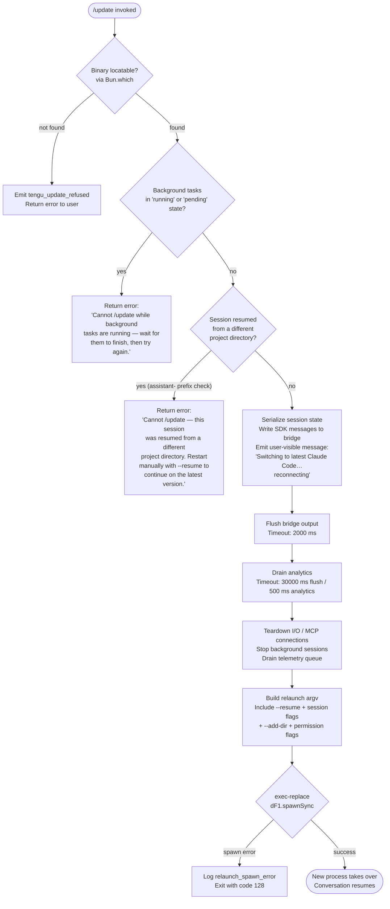

# `/update`

> Analysis basis: CC v2.1.153 bundle.js (AST extraction + Claude interpretation)
> Minimum version: v2.1.153

---

## Overview

The `/update` command performs an in-place upgrade of the Claude Code CLI to its latest version while preserving the current conversation session. It orchestrates a full teardown-and-relaunch sequence: flushing in-flight I/O, draining analytics, serializing session state, then exec-replacing the running process with the newly installed binary. The conversation continues seamlessly after reconnection.

---

## Registration

| Field | Value |
|---|---|
| type | `local` |
| name | `update` |
| description | `Switch to the latest version (conversation continues)` |
| loc_byte | `12329770` |
| loc_byte_end | `12329972` |
| loc_line | `9234` |
| supportsNonInteractive | `false` |
| isHidden | `true` |
| module_id | `Gn1` |
| load_inline | `true` |
| arbor_handler.name | `BL5` |
| arbor_handler.fqn | `claude-2.1.153::BL5` |
| arbor_handler.kind | `AsyncFunction` |
| arbor_handler.resolution_path | `module_id` |
| arbor_handler.n_hits | `0` |

Analysis basis: CC v2.1.153 bundle.js:+12329770

---

## Input Branching

The command has five distinct guard branches before the relaunch sequence begins, plus additional sub-branches during teardown — a Mermaid flowchart is required.



---

## Behavioral Spec

### 1. Binary Discovery

Before any update logic runs, the handler calls a resolver function (mapped from `mvA`) that invokes `Bun.which("claude")` to confirm the binary is reachable on `PATH`.

```
function discoverBinary():
    path = Bun.which("claude")
    if path is null:
        emit telemetry: tengu_update_refused
        return Err("binary not found")
    return Ok(path)
```

Analysis basis: CC v2.1.153 bundle.js:+12327576, +12327579, +1061403

### 2. Version Directory Resolution

A helper (mapped from `Wh` → `h28` / `K_H` / `L_H`) resolves the versioned installation paths under the user's home directory.

```
function resolveVersionPaths(homeDir):
    versionsDir = path.join(homeDir, ".local", "share", "versions")
    binDir = path.join(homeDir, ".local", "share", "bin")
    return { versionsDir, binDir }
```

Key path segments found: `".local"`, `"share"`, `"versions"`, `"bin"`.

Analysis basis: CC v2.1.153 bundle.js:+9033520, +7736788, +7736797, +7736868

### 3. Background-Task Guard

The handler reads background-task state via `Object.values` and checks for tasks whose status is `"running"` or `"pending"`. If any are found, the command is rejected.

```
function checkBackgroundTasks(appState):
    tasks = Object.values(appState.backgroundTasks)
    blocked = tasks.filter(t => t.status == "running" || t.status == "pending")
    if blocked.length > 0:
        return Err("Cannot /update while background tasks are running — wait for them to finish, then try again.")
    return Ok()
```

Error string literal: `"Cannot /update while background tasks are running — wait for them to finish, then try again."` (bundle.js:+12328040)

Analysis basis: CC v2.1.153 bundle.js:+12327899, +12327937, +12327959, +12328040

### 4. Project-Directory Mismatch Guard

The handler inspects the session ID prefix for the `"assistant-"` marker to detect whether the session was resumed from a different working directory.

```
function checkProjectDirectoryMatch(sessionId, currentDir):
    if sessionId.startsWith("assistant-") and currentDir != originalSessionDir:
        return Err("Cannot /update — this session was resumed from a different project directory. Restart manually with --resume to continue on the latest version.")
    return Ok()
```

Error string literal: `"Cannot /update — this session was resumed from a different project directory…"` (bundle.js:+12328281)

Analysis basis: CC v2.1.153 bundle.js:+12328147, +12328582, +12328281

### 5. Session State Serialization & Bridge Write

After all guards pass, the handler generates a fresh UUID (via `wI8.randomUUID`, function `Pn1`), serializes pending SDK messages, and writes them to the bridge output stream so they survive the exec-replace.

```
function serializeAndBridgeSession(state, outputStream):
    resumeId = crypto.randomUUID()
    messages = collectSdkMessages(state)
    outputStream.writeSdkMessages(messages)
    notifyUser("Switching to latest Claude Code… reconnecting")
```

User-visible string: `"Switching to latest Claude Code… reconnecting"` (bundle.js:+12328792)

Analysis basis: CC v2.1.153 bundle.js:+12328768, +12328788, +12328792, +12326649

### 6. Flush & Drain Sequence

The teardown proceeds in three timed phases:

```
function flushAndDrain(bridge, analyticsClient):
    # Phase 1: bridge flush with 2000 ms deadline
    await withTimeout(bridge.flush(), 2000, "bridge flush")

    # Phase 2: analytics teardown with 500 ms race + 30000 ms outer limit
    await withTimeout(
        Promise.race([analyticsClient.teardown(), delay(500)]),
        30000, "analytics flush timeout"
    )

    # Phase 3: cleanup timeout guard
    scheduleHardTimeout("cleanup timeout")
```

Timeouts (all as facts):
- Bridge flush deadline: **2000 ms** (bundle.js:+12328872)
- Analytics teardown race inner: **500 ms** (bundle.js:+5318270)
- Outer flush guard: **30000 ms** (bundle.js:+12056794)

Analysis basis: CC v2.1.153 bundle.js:+12328862, +12328872, +12328913, +12056786, +12056794

### 7. Relaunch Argument Construction

A helper (mapped from `bN8`) assembles the argv array for the replacement process, reconstructing the original CLI invocation and appending session-continuity flags.

```
function buildRelaunchArgv(originalArgv, sessionId, addedDirs, permissionMode, effortLevel):
    args = Array.from(originalArgv)
    args.push("--resume", sessionId)
    for dir in addedDirs:
        args.push("--add-dir", dir)
    if permissionMode:
        args.push("--permission-mode", permissionMode)
    if effortLevel:
        args.push("--effort", effortLevel)
    if dangerouslySkipPermissions:
        args.push("--allow-dangerously-skip-permissions")
    return args
```

CLI flags forwarded: `--resume`, `--add-dir`, `--permission-mode`, `--effort`, `--allow-dangerously-skip-permissions`.

Analysis basis: CC v2.1.153 bundle.js:+12056727, +12058251, +12058389, +12058531, +12058548, +12329094

### 8. Exec-Replace via spawnSync

The final step clears process signal handlers, re-registers minimal `beforeExit` / `exit` listeners, then calls `dF1.spawnSync` with `stdio: "inherit"` to exec-replace the running process.

```
function execReplace(binaryPath, argv, env):
    process.removeAllListeners()
    process.on("SIGINT", noOp)
    process.on("SIGHUP", noOp)
    result = dF1.spawnSync(binaryPath, argv, { stdio: "inherit", env })
    if result.error:
        logError("relaunch_spawn_error")
        writeErrorState("relaunch_spawn_error")
        process.exit(128)
    # On success the new process has taken over; this point is unreachable.
```

Exit code on spawn failure: **128** (bundle.js:+12057715)

Analysis basis: CC v2.1.153 bundle.js:+12057267, +12057286, +12057296, +12057326, +12057353, +12057388, +12057442, +12057483, +12057575, +12057602, +12057667, +12057715

### 9. Hook Draining (tHA / kT)

Before exec-replace, the handler drains any registered lifecycle hooks (mapped from `tHA` → `h4` → `H9` / `q3A.register`; `kT` → `h4`; `TxH` → `q3A.drain`). The last-prompt entry is appended to the hook queue under the key `"last-prompt"`.

```
function drainHooks(hookQueue):
    hookQueue.appendEntry("last-prompt", currentPromptSnapshot)
    await q3A.drain()
```

Analysis basis: CC v2.1.153 bundle.js:+12328500, +12832183, +12832269, +12832289, +12056845, +58493

### 10. Conversation-State Passthrough (T_ / P$)

The command reads `allowed_tools`, `disallowed_tools`, `avoid_prompts`, `effort`, and `model` from app state (via `T_` → `H.getAppState` and `P$` → `H.getAppState`) and serialises them into the relaunch argv so the resumed session inherits the same tool permissions and model settings.

```
function captureSessionPolicy(appState):
    return {
        allowedTools:    appState.allowed_tools,
        disallowedTools: appState.disallowed_tools,
        avoidPrompts:    appState.avoid_prompts,
        effort:          appState.effort,
        model:           appState.model,
    }
```

Analysis basis: CC v2.1.153 bundle.js:+12329098, +12329104, +10638465, +10638573, +10638628, +10638689, +10638791, +10638804

---

## State & Side Effects

| Item | Detail |
|---|---|
| Telemetry: `tengu_update_refused` | Fired when the binary cannot be located or a guard condition blocks the update (bundle.js:+12327676) |
| Telemetry: `tengu_scroll_summary` | Fired during the terminal scroll/render teardown phase (bundle.js:+5317981) |
| Telemetry: `tengu_amber_creek` | Fired during fullscreen/flicker-detection path (bundle.js:+3371527) |
| Telemetry: `tengu_pewter_brook` | Fired during fullscreen/flicker-detection path (bundle.js:+3371435) |
| Telemetry: `tengu_bg_dispatch_sigkill_escalate` | Fired if a background session requires SIGKILL escalation during teardown (bundle.js:+15386200) |
| Telemetry: `tengu_feature_bad` / `tengu_feature_ok` | Feature-flag health checks during teardown (bundle.js:+965182, +965124) |
| Telemetry: `tengu_bg_low_mem_mb` | Fired if memory pressure is detected during teardown (bundle.js:+12668289) |
| Telemetry: `tengu_bg_dispatch_low_mem` | Background dispatcher low-memory event (bundle.js:+15386779) |
| Telemetry: `tengu_bg_spare_enable` / `tengu_bg_spare_claim` / `tengu_bg_spare_spawn` / `tengu_bg_spare_claim_fail` | Background spare-worker lifecycle events during teardown (bundle.js:+15387474, +15387595, +15385893, +15387858) |
| Telemetry: `tengu_bg_sendclaim_failed` | Background session claim failure during shutdown (bundle.js:+15366922) |
| Telemetry: `tengu_daemon_control` | Daemon stop / stop-failed events (bundle.js:+15422336) |
| Telemetry: `tengu_config_parse_error` | Config file parse error encountered during teardown (bundle.js:+3206730) |
| appState changes | `_.getAppState` / `_.setAppState` called to read and mutate session state before relaunch (bundle.js:+12328528, +12328682) |
| Bridge I/O | `O.writeSdkMessages`, `O.flush`, `O.teardown` drain the output stream (bundle.js:+12328768, +12328862, +12328913) |
| Hook registration | `q3A.register` / `q3A.drain` flush lifecycle hooks; `_.appendEntry` writes last-prompt snapshot (bundle.js:+58450, +58493, +12832269) |
| Process signal handlers | `process.removeAllListeners()` then minimal SIGINT/SIGHUP no-ops re-registered before exec (bundle.js:+12057296, +12057326) |
| Exec-replace | `dF1.spawnSync` replaces the running process; on error exits with code **128** (bundle.js:+12057353, +12057715) |
| Error state file | `LP` writes an error-state marker file (via `lxH.writeFileSync`) on spawn failure (bundle.js:+12057575, +190501) |
| Sound | None detected in depth-2 traversal |

---

## Version History

| Version | Change |
|---|---|
| v2.1.153 | Initial analysis |

---

## Common Mistakes

1. **Running `/update` with active background tasks** — the command hard-blocks and returns the "background tasks are running" error. Wait for all background tasks to reach a terminal state before retrying.
2. **Running `/update` in a `--resume`-d session from a different directory** — the project-directory mismatch guard will reject the command with an error asking you to restart manually with `--resume`.
3. **Expecting `/update` in non-interactive mode** — `supportsNonInteractive: false` means the command cannot be triggered programmatically or from piped input; it must be issued interactively.
4. **Assuming the command is visible in `/help`** — `isHidden: true` means `/update` does not appear in the slash-command list; it must be typed explicitly.
5. **Interrupting the flush window** — the bridge flush has only a 2000 ms window. Sending SIGINT during this window may leave session state partially written, causing the resumed session to start fresh rather than continue.
6. **Stale binary on PATH** — if the package manager has not yet written the new binary when `/update` is invoked, `Bun.which("claude")` may resolve the old binary and the "update" will actually relaunch the same version.

---

## Appendix — Identifier Mapping

> For bundle debugging only. Identifiers change across versions.

| Identifier | Role |
|---|---|
| `BL5` | Main async handler for `/update` (arbor_handler; AsyncFunction) |
| `jI8` | Entry-point wrapper called by BL5; delegates to binary-discovery and version-path helpers |
| `L$` | Binary-discovery wrapper; calls `mvA` → `Bun.which` |
| `mvA` | `Bun.which` invocation for the `"claude"` binary |
| `Wh` | Version-path resolver; orchestrates `h28`, `K_H`, `L_H` |
| `h28` | Builds the versioned-install directory path |
| `yf` | Array.isArray guard used inside path builder |
| `K_H` | Resolves `~/.local/share` base via `Pw8` (homedir) |
| `Pw8` | Calls `zc9.homedir()` to obtain user home directory |
| `L_H` | Resolves `~/.local/share/bin` path |
| `N9` | Reads/checks background-task state; emits `tengu_update_refused` |
| `DOH` | Inner guard helper called by `N9` |
| `c` | Generic utility used across multiple call sites |
| `Hj` | Constructs text-type message for user-facing status output |
| `y6` | Renders a message component (calls `Fv`) |
| `Fv` | Low-level render/output primitive |
| `FI` | File-system or path utility used during relaunch prep |
| `xe_` | Builds relaunch environment / working-directory context |
| `O_` | Inner helper of `xe_`; calls `Fv` |
| `aK` | Secondary inner helper of `xe_`; calls `Fv` |
| `BAH` | Session-metadata accessor |
| `Gs` | Hook/attachment set membership check (uses `jD5.has`) |
| `Bk8` | Hook registry lookup |
| `tHA` | Hook-drain orchestrator; appends `"last-prompt"` entry |
| `h4` | Hook executor (calls `H9`) |
| `H9` | Calls `q3A.register` to register hooks |
| `_` | App-state / store accessor object (`_.getAppState`, `_.setAppState`, `_.appendEntry`) |
| `yH` | Subprocess / process-execution utility |
| `l_` | Error-string helper |
| `xH` | String coercion helper |
| `_1` | Delegates to `fZA` for output formatting |
| `fZA` | Output formatter; calls `xH` |
| `GH4` | Queue rotation helper (`cU6.shift` / `cU6.push`) |
| `VT` | App-state mutation helper |
| `O` | Bridge output stream object (`writeSdkMessages`, `flush`, `teardown`) |
| `N8` | Inner bridge implementation |
| `Pn1` | UUID generator; calls `wI8.randomUUID` |
| `gL` | Timeout-race utility (`setTimeout` / `Promise.race` / `clearTimeout`) |
| `vYH` | String conversion helper for relaunch args |
| `cPH` | Full teardown-and-exec-replace orchestrator |
| `TX6` | Interval-clear helper; calls `CE_` |
| `CE_` | Calls `clearInterval` |
| `pNH` | Terminal/UI unmount helper |
| `H` | Ink or terminal render host object (`H.unmount`, `H.replaceAll`) |
| `$R` | Post-unmount cleanup helper |
| `lA8` | Terminal output writer (`Sr.writeSync`); handles escape sequences |
| `qVH` | Terminal-capability detector (ghostty, iTerm2 version checks) |
| `eEH` | Secondary terminal helper |
| `X0` | Tmux/screen escape-sequence replacer |
| `D58` | Scroll/animation teardown orchestrator |
| `KZ` | Scroll cleanup helper |
| `Kj9` | Secondary scroll helper |
| `qj9` | Timing/progress calculator (`Date.now`, `Math.max`, `Math.round`) |
| `_j9` | Inner timing helper |
| `$q` | Fullscreen/flicker-detection dispatcher |
| `Y3H` | Local-agent check (`FrK.has`) |
| `qY_` | Fullscreen helper |
| `Yr` | Fullscreen transition helper |
| `N` | Terminal-mode normalizer (`toUpperCase`, `trim`, etc.) |
| `AY_` | Windows/platform detection helper |
| `o_` | Platform-specific fullscreen helper |
| `s17` | Fullscreen sub-path helper |
| `T6` | Render/display state machine |
| `kT` | Secondary hook-drain entry (calls `h4`) |
| `TxH` | Calls `q3A.drain` to flush hook queue |
| `w58` | Multi-process cleanup orchestrator (`Promise.race`, `Promise.all`) |
| `r8` | Worker/child-process teardown helper |
| `K` | Process-list formatter (`L.map`, `M.padEnd`) |
| `q` | File-unlink helper (`VTK.unlinkSync`) |
| `L` | Promise-tracking set (`q.add`, `M.finally`, `q.delete`) |
| `gF1` | Exec-replace implementation (`f.execve`, `process.chdir`, `require`, `M.dlopen`) |
| `M` | Native module / dynamic-library handle |
| `A` | Connection/socket map |
| `$` | Active-promise registry |
| `Ar1` | Promise tracker entry creator |
| `w` | Background-session dispatcher/monitor |
| `R` | Background-session process record |
| `uH` | Bad-feature telemetry reporter |
| `SH` | Good-feature telemetry reporter |
| `wk8` | Low-memory monitor helper |
| `TD6` | Config file reader (`BP.readFile`) |
| `B` | MCP client filter helper |
| `jLA` | MCP connection manager |
| `ZLA` | Background session lifecycle manager |
| `D` | Spare-worker spawn decision helper |
| `J8` | Generic error/status helper |
| `S` | Disposable resource wrapper |
| `f` | Exec-via-execve facade |
| `YSH` | MCP server initializer |
| `EWK` | MCP update applier (`H.applyMcpUpdate`) |
| `Qb5` | MCP client reconciliation helper |
| `z` | Daemon control object (`SH`, `uH`, `Dy`, `wm`) |
| `Dy` | Daemon-stop dispatcher |
| `wm` | Daemon-stop race (`Promise.race`, `process.exit`) |
| `EH` | String error helper |
| `LP` | Error-state file writer (`lxH.writeFileSync`) |
| `bN8` | Relaunch argv builder (`Array.from`, flag assembly) |
| `q96` | Session-flag serializer |
| `b6` | Config-file watcher/backup helper |
| `B6` | Config path resolver |
| `CO_` | Config directory helper |
| `EzH` | Config read/migrate/backup implementation |
| `U6` | JSON parser wrapper |
| `Pb` | String prefix stripper (`startsWith` / `slice`) |
| `UUq` | Config backup enumerator |
| `UO_` | Backup path constructor |
| `jq7` | File-watch setup helper (`T88.watchFile`) |
| `si` | Watch callback helper |
| `T_` | Session-policy reader (`allowed_tools`, `disallowed_tools`, etc.) |
| `pZ8` | Policy sub-reader (calls `sA`) |
| `sA` | App-state field accessor |
| `UZ8` | Secondary policy reader |
| `P$` | Model/effort policy reader |