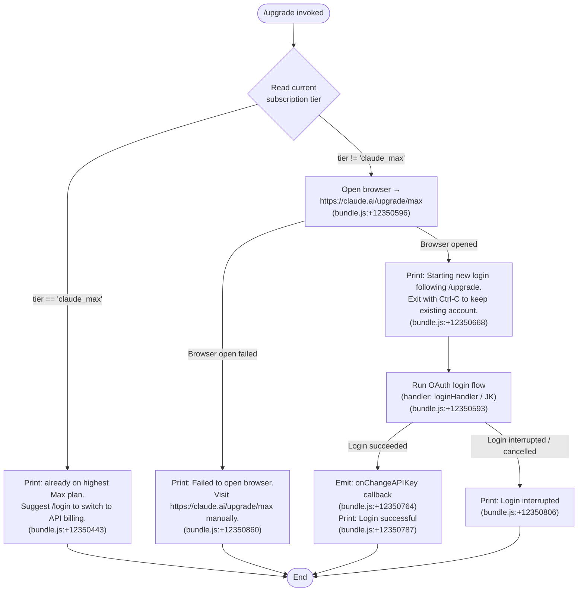

# `/upgrade`

> Analysis basis: CC v2.1.153 bundle.js (AST extraction + Claude interpretation)
> Minimum version: v2.1.153

---

## Overview

The `/upgrade` command guides the user through upgrading their Claude account to the **Max subscription plan**, which provides higher rate limits and increased access to Opus models. When invoked, the command checks the user's current subscription tier, detects whether they are already on the highest Max plan, and — if not — opens the browser to `https://claude.ai/upgrade/max` and then initiates a fresh OAuth login flow to record the upgraded credentials.

---

## Registration

| Field | Value |
|---|---|
| type | `local-jsx` |
| name | `upgrade` |
| description | `Upgrade to Max for higher rate limits and more Opus` |
| loc_byte | `12351067` |
| loc_byte_end | `12351327` |
| loc_line | `9235` |
| module_id | `O6A` |
| load_inline | `true` |
| arbor_handler.name | `uI6` |
| arbor_handler.fqn | `claude-2.1.153::uI6` |
| arbor_handler.kind | `AsyncFunction` |
| arbor_handler.resolution_path | `module_id` |
| arbor_handler.n_hits | `0` |

Analysis basis: CC v2.1.153 bundle.js:+12351067

---

## Input Branching

Four distinct paths exist based on the current subscription state and the outcome of the browser/login flow. A Mermaid flowchart is used below.



---

## Behavioral Spec

### 1. Handler Entry Point (`upgradeCommandHandler` / `uI6`)

The Arbor-resolved handler is the `AsyncFunction` identified as `uI6` (FQN: `claude-2.1.153::uI6`), reached via the `module_id` resolution path through module `O6A`.

Analysis basis: CC v2.1.153 bundle.js:+12350113

```
async function upgradeCommandHandler(context):
    currentTier = readSubscriptionProfile(context)   // calls profileFetch (ze/GA)

    if currentTier == "claude_max":
        print("You are already on the highest Max subscription plan. ...")
        return

    browserOpened = openUpgradeBrowser("https://claude.ai/upgrade/max")
    if not browserOpened:
        print("Failed to open browser. Please visit https://claude.ai/upgrade/max to upgrade.")
        return

    print("Starting new login following /upgrade. Exit with Ctrl-C to use existing account.")

    result = await runOAuthLoginFlow()   // calls loginHandler (JK)

    if result.success:
        triggerOnChangeAPIKey()
        print("Login successful")
    else:
        print("Login interrupted")
```

Analysis basis: CC v2.1.153 bundle.js:+12350113 – +12350870

---

### 2. Subscription Tier Check

The handler calls a profile-fetch helper (`profileFetch` / `ze`) that performs an authenticated HTTP GET with a 10 000 ms timeout and Content-Type `application/json`.

Analysis basis: CC v2.1.153 bundle.js:+12350285

```
async function profileFetch(authToken):
    response = httpGet(profileEndpoint,
                       headers={"Content-Type": "application/json"},
                       timeout=10000)   // 10 000 ms (bundle.js:+2049280)

    on success:
        emit telemetry "oauth_profile_fetch"   // (bundle.js:+2049296)
        return response.subscriptionTier

    on auth error (401/403):
        emit telemetry "oauth_profile_token_failed"   // (bundle.js:+2049363)
        return null

    on network error:
        log error level "error"   // (bundle.js:+2049463)
        return null
```

The tier value `"claude_max"` is the sentinel for the highest Max plan.
Analysis basis: CC v2.1.153 bundle.js:+12350342

An additional sub-tier literal `"default_claude_max_20x"` exists in the bundle, suggesting a named variant of the Max plan.
Analysis basis: CC v2.1.153 bundle.js:+12350224

---

### 3. OAuth Profile Fetch Internals (`oauthTokenBuilder` / `bq`)

Inside the profile-fetch call chain, the OAuth base URL is resolved through an environment-aware routing helper (`oauthBaseUrlBuilder` / `bq`) that consults the `CLAUDE_CODE_CUSTOM_OAUTH_URL` environment variable and validates it against an allowlist of approved endpoints.

Analysis basis: CC v2.1.153 bundle.js:+950233 – +950429

```
function buildOAuthBaseUrl(env):
    customUrl = env.CLAUDE_CODE_CUSTOM_OAUTH_URL
    if customUrl is set:
        if customUrl not in approvedEndpoints:
            throw Error("CLAUDE_CODE_CUSTOM_OAUTH_URL is not an approved endpoint.")
        return customUrl   // suffix "-custom-oauth"

    env_name = detectEnvironment()   // "prod" | "local" | "staging"
    switch env_name:
        "local":    return "http://localhost:8000"   // (bundle.js:+949364)
        "staging":  return "http://localhost:4000"   // (bundle.js:+949451)
        default:    return production endpoint       // "prod" (bundle.js:+949090)
```

---

### 4. Browser Opener (`openBrowser` / `JK` → `hD`)

The browser-open helper dispatches based on the operating system.

Analysis basis: CC v2.1.153 bundle.js:+12350593

```
function openBrowser(url):
    validate url scheme is "http:" or "https:"   // (bundle.js:+6578807, +6578829)
    switch process.platform:
        "darwin":  exec "open", [url]            // (bundle.js:+6579290)
        "win32":   exec "rundll32", ["url,OpenURL", url]  // (bundle.js:+6579216)
        other:     exec "xdg-open", [url]        // (bundle.js:+6579297)
    return success/failure
```

---

### 5. OAuth Login Flow (`loginHandler` / `JK` → deeper chain)

After the browser is opened the handler awaits a full OAuth login sequence. This involves:

1. Spawning an HTTP listener (or reading a file-descriptor) for the OAuth callback.
2. Exchanging the authorization code for tokens.
3. Persisting the token via the `ANTHROPIC_API_KEY` or `CLAUDE_CODE_OAUTH_TOKEN_FILE_DESCRIPTOR` path.
4. Calling `onChangeAPIKey` on the app-state context once a valid API key is confirmed.

Analysis basis: CC v2.1.153 bundle.js:+12350593, +12350764

```
async function runOAuthLoginFlow():
    tokenSource = detectTokenSource()
    // checks ANTHROPIC_API_KEY (bundle.js:+2942830)
    // checks CLAUDE_CODE_OAUTH_TOKEN_FILE_DESCRIPTOR (bundle.js:+2063765)
    // checks CLAUDE_CODE_API_KEY_FILE_DESCRIPTOR (bundle.js:+2063908)
    // checks apiKeyHelper (bundle.js:+2942924)

    if no valid source found:
        throw Error("ANTHROPIC_API_KEY, CLAUDE_CODE_OAUTH_TOKEN, or WIF env vars ...")
        // full literal at bundle.js:+2943258

    credentials = await exchangeAuthorizationCode(tokenSource)
    persist(credentials)
    return { success: true, credentials }
```

---

### 6. Already-on-Max Early Exit

When the profile fetch confirms the user is already on `claude_max`, the command prints an informational message and returns immediately without opening the browser or triggering a login.

Message (paraphrased, ≤30 char citation): `"You are already on the high…"` — full string at bundle.js:+12350443.

Analysis basis: CC v2.1.153 bundle.js:+12350443

---

### 7. API Key / Auth Provider Detection (`authConfigReader` / `m$`)

The authentication configuration reader checks several provider types in order:

Analysis basis: CC v2.1.153 bundle.js:+2941016

```
function readAuthConfig(env, settings):
    if env.ANTHROPIC_API_KEY is set:
        return { kind: "apiKey", value: env.ANTHROPIC_API_KEY }

    if settings.apiKeyHelper is set and != "none":
        return { kind: "apiKeyHelper", value: settings.apiKeyHelper }

    fdKey = readFileFD("CLAUDE_CODE_API_KEY_FILE_DESCRIPTOR")   // (bundle.js:+2063908)
    if fdKey:
        return { kind: "apiKey", value: fdKey }

    oauthFD = readFileFD("CLAUDE_CODE_OAUTH_TOKEN_FILE_DESCRIPTOR")  // (bundle.js:+2063765)
    if oauthFD:
        return { kind: "oauth", value: oauthFD }

    // Check provider type: bedrock / foundry / anthropicAws / mantle / vertex / firstParty
    // (bundle.js:+2042433 – +2042650)
    providerType = detectCloudProvider(env)
    if providerType is a known cloud provider:
        return { kind: providerType }

    throw Error("ANTHROPIC_API_KEY, CLAUDE_CODE_OAUTH_TOKEN, or WIF env vars required")
```

Supported provider type literals: `"bedrock"`, `"foundry"`, `"anthropicAws"`, `"mantle"`, `"vertex"`, `"firstParty"`.
Analysis basis: CC v2.1.153 bundle.js:+2042433 – +2042650

---

## State & Side Effects

| Item | Detail |
|---|---|
| Telemetry — `tengu_feature_ok` | Emitted on successful feature gate check (bundle.js:+965124) |
| Telemetry — `tengu_feature_sad` | Emitted when feature gate check fails (bundle.js:+965259) |
| Telemetry — `tengu_bg_spare_enable` | Emitted when background spare process is enabled (bundle.js:+15385533) |
| Telemetry — `tengu_bg_spare_spawn` | Emitted when a background spare process is spawned (bundle.js:+15385893) |
| Telemetry — `oauth_profile_fetch` | Emitted on successful OAuth profile HTTP response (bundle.js:+2049296) |
| Telemetry — `oauth_profile_token_failed` | Emitted when OAuth token is rejected (401/403) during profile fetch (bundle.js:+2049363) |
| Browser launch | Opens `https://claude.ai/upgrade/max` via OS-native open command (bundle.js:+12350596) |
| `onChangeAPIKey` callback | Triggered on the app-state context after successful login (bundle.js:+12350764) |
| `setTimeout` | A timeout is registered during the login flow (bundle.js:+12350428) |
| Log file writes | Auth-helper output is appended via `Zk.appendFile` (bundle.js:+202979); log rotation is managed by `cOA`/`nhK` helpers |
| Hook registration — `q3A.register` | Registered inside the logging subsystem helper `H9` (bundle.js:+58450) |
| appState changes | Subscription tier cached from profile fetch; API key updated after login |
| Sound | <!-- TODO: not found in depth-2 traversal; needs --depth 4 --> |

---

## Version History

| Version | Change |
|---|---|
| v2.1.153 | Initial analysis |

---

## Common Mistakes

1. **Running `/upgrade` when already on Max.** The command detects `claude_max` tier and exits early with a message suggesting `/login` instead. No browser is opened.
2. **Network-blocked environments.** If the browser cannot open `https://claude.ai/upgrade/max`, the command prints a manual-visit message and stops — no login is attempted.
3. **Custom OAuth URL not allowlisted.** Setting `CLAUDE_CODE_CUSTOM_OAUTH_URL` to a non-approved value causes an immediate error before any network call is made (bundle.js:+950429).
4. **Using `/upgrade` with cloud-provider credentials.** The auth-config reader recognises provider types such as `bedrock`, `vertex`, and `anthropicAws`. Those users cannot obtain a Max subscription through this flow and should use API-key billing instead.
5. **Interrupting the login step with Ctrl-C.** The message "Login interrupted" is printed; the existing session is preserved and no credentials are changed.
6. **Expecting instant effect.** After `Login successful` is printed the `onChangeAPIKey` callback fires, but in-flight requests still use the old session until the app-state propagates the new key.

---

## Appendix — Identifier Mapping

> For bundle debugging only. Identifiers change across versions.

| Identifier | Role |
|---|---|
| `uI6` | Main upgrade command handler (`AsyncFunction`); Arbor FQN `claude-2.1.153::uI6` |
| `GA` | Profile data fetch dispatcher; called first by `uI6` |
| `Hw` | Auth configuration orchestrator; coordinates provider detection sub-calls |
| `UK` | Utility: key/value reader helper |
| `xH` | Low-level string / buffer utility |
| `RP` | Auth-provider routing helper; dispatches to `GgH`, `Pi`, `IN`, `xH` |
| `Oi6` | Auth sub-handler, first branch inside `RP` |
| `GgH` | Provider-type formatter / mapper |
| `Pi` | OAuth token file-descriptor reader orchestrator |
| `IN` | Flag-settings reader (`flagSettings` literal at bundle.js:+2943841) |
| `FO` | Cloud-provider type detector (checks bedrock / foundry / anthropicAws / mantle / vertex / firstParty) |
| `IA` | Individual cloud-provider string matcher |
| `cJ` | Credential cache / state accessor |
| `m$` | Auth-config reader; selects among API key, helper, FD, OAuth, or cloud provider |
| `wO6` | API-key helper invoker (`apiKeyHelper` path) |
| `DxH` | VS Code environment detector (`claude-vscode` literal at bundle.js:+50331) |
| `yM6` | OAuth token FD reader |
| `b6` | Telemetry / event recorder; calls `Date.now`, `jq7` |
| `lS` | History slice helper (last 20 entries, bundle.js:+2065574) |
| `JO6` | Provider-type secondary mapper |
| `yb` | Array membership check utility |
| `H` | Global constant / config bag; also holds random/timeout helpers |
| `ze` | OAuth profile fetch function; performs HTTP GET with 10 000 ms timeout |
| `bq` | OAuth base-URL builder; validates custom OAuth URL |
| `eGA` | Environment name detector (`prod`/`local`/`staging`) |
| `zeK` | OAuth endpoint path builder |
| `_` | Generic string / env utility |
| `SH` | Feature-gate OK emitter (`tengu_feature_ok`) |
| `c` | Core feature-gate check |
| `e6` | Feature-gate SAD emitter (`tengu_feature_sad`) |
| `YY` | Session / context reader |
| `N` | Log writer coordinator; calls `ixH`, `ihK`, `j4`, etc. |
| `chK` | Log directory initialiser |
| `L3A` | Log file path builder |
| `RH` | JSON-stringify wrapper for log payloads |
| `j4` | Log entry formatter; redacts sensitive values (`[REDACTED]`) |
| `pOA` | Log field mapper |
| `q` | File unlink helper (`VTK.unlinkSync`) |
| `A` | Path / string normaliser (`M.toLowerCase`, 40-char limit at bundle.js:+15412234) |
| `ixH` | Log-write dispatcher |
| `NOA` | Raw write-to-handle helper (`H.write`) |
| `ihK` | Append-log-file orchestrator; manages mkdir, appendFile, rotate |
| `GxH` | Buffered writer with `setTimeout`/`setImmediate` flush loop |
| `xfH` | Log line assembler |
| `B6` | Shared state / registry object |
| `E16` | Log file existence / size checker |
| `lOA` | Log file path joiner |
| `cOA` | Log file rotation helper (stat → rename → unlink; `.txt` suffix at bundle.js:+202624) |
| `nhK` | Log chunk appender; mirrors `ihK` for continuation writes |
| `H9` | Hook registration entry point (`q3A.register`) |
| `yH` | Network request dispatcher with retry logic |
| `l_` | Error-to-string converter |
| `_1` | Request queue processor |
| `fZA` | Individual HTTP request executor |
| `GH4` | Request queue manager (shift/push cycle) |
| `JK` | Browser-open and OAuth login orchestrator |
| `$c7` | URL scheme validator (`http:`/`https:`) |
| `hD` | OS-specific browser launcher (darwin/win32/linux) |
| `E8` | Login flow entry point |
| `G_` | Agent / conversation runner invoked during login |
| `jGH` | Core agent execution loop |
| `D` | Background spare process manager (`tengu_bg_spare_*`) |
| `r84` | String-coercion helper used in agent loop |
| `Wz` | Tool executor |
| `J8` | File-system error code handler (`EISDIR`, `errno`) |
| `S6` | Async-local-storage session accessor |
| `aU6` | Store reader (`oU6.getStore`) |
| `O_` | Fallback / default context provider |

---

Note: index built via Arbor fallback; some signals (telemetry, literals) may be missing — see arbor-fallback.js.