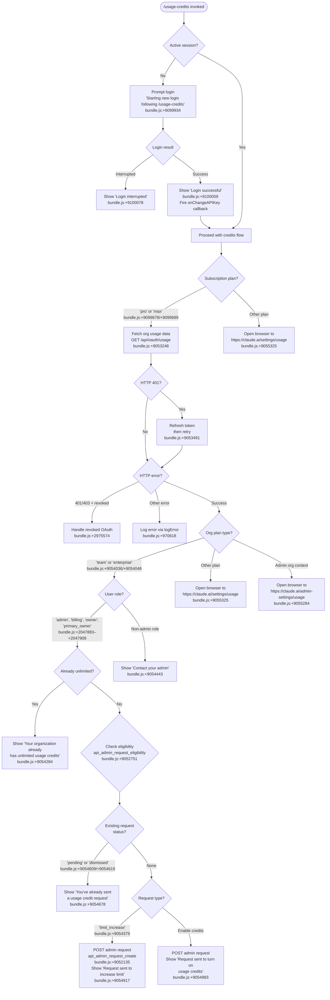

# `/usage-credits`

> Analysis basis: CC v2.1.153 bundle.js (AST extraction + Claude interpretation)
> Minimum version: v2.1.153

---

## Overview

`/usage-credits` allows users to configure usage credits when they reach a usage limit on their Anthropic account. It inspects the user's current subscription and organizational role, then either notifies the user that unlimited credits are already active, sends an admin request to increase or enable credits, or opens a browser to the relevant settings URL. For users without an active session, it initiates a fresh login flow before proceeding.

---

## Registration

| Field | Value |
|---|---|
| type | `local-jsx` |
| name | `usage-credits` |
| description | `Configure usage credits to keep working when you hit a limit` |
| loc_byte | `9101246` |
| loc_byte_end | `9101456` |
| loc_line | `4024` |
| module_id | `fB_` |
| load_inline | `true` |
| arbor_handler.name | `XZ6` |
| arbor_handler.fqn | `claude-2.1.153::XZ6` |
| arbor_handler.kind | `AsyncFunction` |
| arbor_handler.resolution_path | `module_id` |
| arbor_handler.n_hits | `0` |

Analysis basis: CC v2.1.153 bundle.js:+9101246

---

## Input Branching

The command involves 6+ distinct branches based on subscription type, organizational role, existing request state, and session validity. A Mermaid flowchart is used below.



---

## Behavioral Spec

### Handler Entry Point — `usageCreditsHandler` (`XZ6`)

The handler is an `AsyncFunction` resolved via `module_id → fB_`.

```
async function usageCreditsHandler(context):
    plan = getCurrentSubscriptionPlan(context)
    // plan values observed: "pro", "max" (bundle.js:+9099678, +9099689)

    if plan not in ["pro", "max"]:
        openBrowser("https://claude.ai/settings/usage")  // bundle.js:+9055325
        return

    session = getActiveSession(context)
    if session is null or invalid:
        displayMessage("Starting new login following /usage-credits. Exit with Ctrl-C to use existing account.")
        // bundle.js:+9099934
        result = await runLoginFlow(context)
        if result == INTERRUPTED:
            displayMessage("Login interrupted")  // bundle.js:+9100078
            return
        displayMessage("Login successful")  // bundle.js:+9100059
        triggerOnChangeAPIKey(context)  // bundle.js:+9100036

    fetchAndProcessOrgUsage(context)
```

Analysis basis: CC v2.1.153 bundle.js:+9099667

---

### Org Usage Fetch — `orgUsageFetcher` (`C28`)

```
async function orgUsageFetcher(context):
    // Calls apiUsageFetch (Y1) which hits GET /api/oauth/usage
    // Timeout: 5000ms (bundle.js:+9053276)
    // Content-Type: application/json (bundle.js:+9053290, +9053305)
    // Auth mode: "no-auth" token forwarded separately (bundle.js:+9053390)

    try:
        response = await apiUsageFetch(
            endpoint = "/api/oauth/usage",
            timeout = 5000,
            headers = { "Content-Type": "application/json" }
        )
    catch HTTP 401:
        refreshToken()
        retry()
        log(" (401→refresh→retry succeeded)")  // bundle.js:+9053491
    catch AxiosError where status in [401, 403] and message contains "revoked":
        handleRevokedOAuth()  // bundle.js:+2975574
        return
    catch error:
        if isAxiosError(error) and status >= 500:  // bundle.js:+9053694
            extractErrorDetail(error, field="detail")  // bundle.js:+9053900
        logError(error)
        return

    dispatchCreditsDecision(context, response)
```

Analysis basis: CC v2.1.153 bundle.js:+9054025

---

### Credits Decision Logic — `dispatchCreditsDecision` (`C28` sub-flow)

```
function dispatchCreditsDecision(context, usageData):
    orgPlan = usageData.orgPlan  // "team" or "enterprise" (bundle.js:+9054036, +9054048)
    userRole = usageData.userRole

    if orgPlan in ["team", "enterprise"]:
        if userRole in ["admin", "billing", "owner", "primary_owner"]:
            // bundle.js:+2047883, +2047891, +2047901, +2047909
            if usageData.hasUnlimitedCredits:
                showMessage("Your organization already has unlimited usage credits. No request needed.")
                // bundle.js:+9054284
                return

            eligibility = fetchEligibility("api_admin_request_eligibility")
            // bundle.js:+9052751, teleport-org param: bundle.js:+9052899

            existingRequests = fetchAdminRequests("api_admin_request_list")
            // bundle.js:+9052400, filter by statuses param (bundle.js:+9052503)

            if any request in existingRequests with status "pending" or "dismissed":
                // bundle.js:+9054609, +9054619
                showMessage("You've already sent a usage credit request to your admin.")
                // bundle.js:+9054678
                return

            requestType = determineRequestType(eligibility)
            if requestType == "limit_increase":  // bundle.js:+9054379
                postAdminRequest(
                    endpoint = "/api/oauth/organizations/:orgUUID/admin_requests",
                    // bundle.js:+9052192
                    type = "limit_increase"
                )
                showMessage("Request sent to your admin to increase your usage credit limit.")
                // bundle.js:+9054917
            else:
                postAdminRequest(endpoint = "/api/oauth/organizations/:orgUUID/admin_requests")
                showMessage("Request sent to your admin to turn on usage credits.")
                // bundle.js:+9054983

        else:  // non-admin role
            showMessage("Contact your admin to manage usage credit settings.")
            // bundle.js:+9054443

        if isAdminOrgContext(context):
            openBrowser("https://claude.ai/admin-settings/usage")
            // bundle.js:+9055284
        else:
            openBrowser("https://claude.ai/settings/usage")
            // bundle.js:+9055325

    else:
        openBrowser("https://claude.ai/settings/usage")  // bundle.js:+9055325
```

Analysis basis: CC v2.1.153 bundle.js:+9054065

---

### API Request Helpers

#### `apiUsageFetch` (`Y1` / `LXH` sub-call)

```
async function apiUsageFetch(endpoint, timeout, headers):
    // GET /api/oauth/usage (bundle.js:+9053248)
    // timeout = 5000ms (bundle.js:+9053276)
    // On 401: trigger token refresh and retry once
    // response field "message" carries error text (bundle.js:+9054268)
    return httpGet(endpoint, { timeout, headers })
```

Analysis basis: CC v2.1.153 bundle.js:+9053081

#### `adminRequestCreate` (`aK1`)

```
async function adminRequestCreate(orgUUID, requestBody):
    // POST /api/oauth/organizations/:orgUUID/admin_requests
    // bundle.js:+9052192
    response = await httpPost(
        url = interpolate("/api/oauth/organizations/:orgUUID/admin_requests", { orgUUID }),
        body = requestBody
    )
    if error:
        throw Error  // bundle.js:+9052283
    return response
```

Analysis basis: CC v2.1.153 bundle.js:+9052132

#### `adminRequestList` (`sK1`)

```
async function adminRequestList(orgUUID, statuses):
    // GET with statuses filter (bundle.js:+9052503)
    // Appends statuses param to request (bundle.js:+9052494)
    response = await httpGet(
        endpoint = "api_admin_request_list",
        params = { statuses }
    )
    if error:
        throw Error  // bundle.js:+9052633
    return response
```

Analysis basis: CC v2.1.153 bundle.js:+9052397

#### `adminRequestEligibility` (`tK1`)

```
async function adminRequestEligibility(orgUUID):
    // Checks "api_admin_request_eligibility" (bundle.js:+9052751)
    // Uses "teleport-org" param (bundle.js:+9052899)
    response = await httpGet(endpoint = "api_admin_request_eligibility")
    if error:
        throw Error  // bundle.js:+9052931
    return response
```

Analysis basis: CC v2.1.153 bundle.js:+9052748

---

### Browser Launch — `openBrowserUrl` (`JK`)

```
function openBrowserUrl(url):
    // Validates url starts with "http:" or "https:" (bundle.js:+6578807, +6578829)
    if not validHttpUrl(url):
        throw Error  // bundle.js:+6578757

    platform = process.platform
    if platform == "darwin":  // bundle.js:+6579116
        spawn("open", [url])  // bundle.js:+6579290
    elif platform == "win32":  // bundle.js:+6579132
        spawn("rundll32", ["url,OpenURL", url])
        // bundle.js:+6579216, +6579228
    else:  // Linux/other
        spawn("xdg-open", [url])  // bundle.js:+6579297

    status = "browser-opened"  // bundle.js:+9055392
```

Analysis basis: CC v2.1.153 bundle.js:+9055442

---

### Login Flow — `loginFlow` (`YzH`)

```
async function loginFlow(context):
    // Detects current subscription type (bundle.js:+2959729, +2959756, +2959794, +2959820)
    // subscription types: "stripe_subscription", "stripe_subscription_contracted",
    //                     "apple_subscription", "google_play_subscription"
    sessionData = acquireSession(context)
    if sessionData.isAdmin:
        routeToAdminFlow(sessionData)
    else:
        routeToUserFlow(sessionData)
```

Analysis basis: CC v2.1.153 bundle.js:+9099751

---

### Auth Provider Detection — `authProviderClassifier` (`IA`)

```
function authProviderClassifier(config):
    provider = config.provider
    switch provider:
        case "bedrock":     // bundle.js:+2042433
            return bedrockHandler()
        case "foundry":     // bundle.js:+2042483
            return foundryHandler()
        case "anthropicAws":  // bundle.js:+2042539
            return anthropicAwsHandler()
        case "mantle":      // bundle.js:+2042593
            return mantleHandler()
        case "vertex":      // bundle.js:+2042641
            return vertexHandler()
        case "firstParty":  // bundle.js:+2042650
            return firstPartyHandler()
```

Analysis basis: CC v2.1.153 bundle.js:+2042710

---

### API Key / OAuth Token Resolution — `authSessionBuilder` (`m$`)

```
function authSessionBuilder(env, config):
    apiKey = env["ANTHROPIC_API_KEY"]  // bundle.js:+2942830
    apiKeyHelper = config["apiKeyHelper"]  // bundle.js:+2942924

    if apiKey is null and apiKeyHelper == "none":  // bundle.js:+2942963
        oauthToken = readFileDescriptor(
            env["CLAUDE_CODE_OAUTH_TOKEN_FILE_DESCRIPTOR"]  // bundle.js:+2063765
        )
        if oauthToken is null:
            apiKeyFile = readFileDescriptor(
                env["CLAUDE_CODE_API_KEY_FILE_DESCRIPTOR"]  // bundle.js:+2063908
            )

    if all auth sources missing:
        throw Error(
            "ANTHROPIC_API_KEY, CLAUDE_CODE_OAUTH_TOKEN, or WIF env vars " +
            "(ANTHROPIC_FEDERATION_RULE_ID + ANTHROPIC_ORGANIZATION_ID) required"
        )  // bundle.js:+2943258

    flagSettings = buildFlagSettings(config)  // bundle.js:+2943841
    return sessionObject
```

Analysis basis: CC v2.1.153 bundle.js:+2941016

---

### Error Handling — `httpErrorHandler` (`dG`)

```
function httpErrorHandler(error):
    if isAxiosError(error):
        status = error.response.status
        if status == 401:  // bundle.js:+2975480
            // Attempt token refresh
        elif status == 403:  // bundle.js:+2975508
            if error message contains "OAuth token has been revoked":
                // bundle.js:+2975574
                handleRevokedToken()
        else:
            logErrorDetail(error)
    deduplicateError(error)  // via Pp / Ff_ map (bundle.js:+2954646)
```

Analysis basis: CC v2.1.153 bundle.js:+9053153

---

### Network Request Wrapper — `httpRequestWrapper` (`N`)

```
function httpRequestWrapper(method, url, options):
    // Sanitizes sensitive headers: redacts to "[REDACTED]" (bundle.js:+195779)
    // Log level: "debug" (bundle.js:+203654)
    // Timeout handling: 1000ms check interval (bundle.js:+203485), max 100 retries (bundle.js:+203504)
    // Normalizes method to uppercase (bundle.js:+203780)
    // Strips trailing whitespace from URL (bundle.js:+203803)
    sanitizedHeaders = redactSensitiveHeaders(options.headers)
    return executeRequest(method.toUpperCase(), url.trim(), sanitizedHeaders, options)
```

Analysis basis: CC v2.1.153 bundle.js:+9054122

---

### Experiment / Feature Flag — `growthbookExperimentLogger` (`XO_`)

```
async function growthbookExperimentLogger(experimentId, variant):
    // Only active in "production" environment (bundle.js:+3177248)
    // Emits "GrowthbookExperimentEvent" (bundle.js:+3177394)
    // Event name: "growthbook_experiment" (bundle.js:+3177821)
    // Uses randomBytes(32).toString("hex") for session ID (bundle.js:+3209639, +3209652)
    // Emits via ai.emit (bundle.js:+3177775)
    // Targets api.anthropic.com (bundle.js:+3182655)
    if environment != "production":
        return
    sessionId = crypto.randomBytes(32).toString("hex")
    emit("growthbook_experiment", { experimentId, variant, sessionId })
```

Analysis basis: CC v2.1.153 bundle.js:+3183856

---

## State & Side Effects

| Item | Detail |
|---|---|
| Telemetry | `tengu_ember_latch` (bundle.js:+9099714); `tengu_feature_ok` (bundle.js:+965124); `tengu_feature_bad` (bundle.js:+965182) |
| Hook registration | `_.onChangeAPIKey` callback invoked after successful login (bundle.js:+9100036) |
| appState changes | Subscription plan checked (`"pro"`, `"max"`); session/token state updated on login |
| Browser launch | Opens `https://claude.ai/settings/usage` or `https://claude.ai/admin-settings/usage` depending on role/plan; status string `"browser-opened"` set (bundle.js:+9055392) |
| Network I/O | GET `/api/oauth/usage` with 5000ms timeout; POST `/api/oauth/organizations/:orgUUID/admin_requests` |
| Token handling | Automatic 401 → token refresh → retry cycle (bundle.js:+9053491) |
| Error logging | `an.logError` called on unhandled errors (bundle.js:+970618) |
| Experiment tracking | `growthbook_experiment` event emitted in production (bundle.js:+3177821) |
| Crypto | `crypto.randomBytes(32).toString("hex")` for experiment session IDs (bundle.js:+3209639) |

---

## Version History

| Version | Change |
|---|---|
| v2.1.153 | Initial analysis |

---

## Common Mistakes

1. **Running `/usage-credits` on a non-pro/max plan**: The command short-circuits immediately for plans other than `"pro"` or `"max"` (bundle.js:+9099678, +9099689) and opens the browser settings page rather than making any API calls.
2. **Expecting admin actions from a non-admin role**: Only users with roles `admin`, `billing`, `owner`, or `primary_owner` (bundle.js:+2047883–+2047909) can send admin credit requests. Other users see a prompt to contact their admin.
3. **Duplicate credit requests**: If a pending or dismissed request already exists, the command will not create a new one and will instead display the "already sent" message (bundle.js:+9054678).
4. **Missing environment credentials**: If `ANTHROPIC_API_KEY`, `CLAUDE_CODE_OAUTH_TOKEN`, and WIF env vars are all absent, the auth builder throws a descriptive error (bundle.js:+2943258) before any network call is made.
5. **Revoked OAuth token**: A 403 response with a "revoked" message body causes the command to halt the credit flow and trigger token revocation handling rather than retrying (bundle.js:+2975574).
6. **Login interruption**: Pressing Ctrl-C during the re-login prompt (for unauthenticated users) cancels the command entirely and prints "Login interrupted" (bundle.js:+9100078) without attempting any credit-related calls.

---

## Appendix — Identifier Mapping

> For bundle debugging only. Identifiers change across versions.

| Identifier | Role |
|---|---|
| `XZ6` | `usageCreditsHandler` — async main handler for `/usage-credits` |
| `A1` | `sessionContextBuilder` — builds session/context object |
| `U__` | `sessionContextUtil1` — utility called during session build |
| `p__` | `sessionContextUtil2` — utility called during session build |
| `Hw` | `authConfigAssembler` — assembles auth configuration |
| `UK` | `envVarReader` — reads environment variables |
| `xH` | `objectAssign` — object property assignment helper |
| `RP` | `oauthTokenReader` — reads and validates OAuth token |
| `Oi6` | `oauthTokenParser` — parses OAuth token fields |
| `GgH` | `tokenFieldExtractor` — extracts fields from token |
| `Pi` | `oauthFileDescriptorReader` — reads OAuth token from file descriptor |
| `IN` | `flagSettingsReader` — reads flag/feature settings |
| `FO` | `providerDetector` — detects auth provider type |
| `IA` | `authProviderClassifier` — classifies auth provider (bedrock/vertex/etc.) |
| `cJ` | `credentialValidator` — validates credentials |
| `m$` | `authSessionBuilder` — builds full auth session with key/token resolution |
| `wO6` | `apiKeyHelperReader` — reads apiKeyHelper config value |
| `DxH` | `vscodeDetector` — detects `claude-vscode` environment |
| `yM6` | `apiKeyFileDescriptorReader` — reads API key from file descriptor |
| `b6` | `timestampedEventEmitter` — emits events with timestamps |
| `lS` | `historySliceTrimmer` — trims history array (max 20 items, bundle.js:+2065574) |
| `JO6` | `tokenFieldMerger` — merges token fields |
| `XZ` | `existingSessionGetter` — retrieves existing session |
| `T6` | `growthbookFeatureFlagEvaluator` — evaluates Growthbook feature flags |
| `Dz6` | `featureFlagInitializer` — initializes feature flags |
| `wz6` | `featureFlagFetcher` — fetches feature flag state |
| `wHH` | `featureFlagCacheChecker` — checks feature flag cache |
| `tb` | `featureFlagNetworkFetcher` — fetches flags from network |
| `qR` | `featureFlagResponseParser` — parses flag response |
| `O88` | `growthbookExperimentEvaluator` — evaluates experiments via Growthbook |
| `XO_` | `growthbookExperimentLogger` — logs experiment events |
| `TEH` | `experimentVariantResolver` — resolves experiment variant |
| `up` | `experimentSessionIdGenerator` — generates random session IDs for experiments |
| `RH` | `jsonStringifyWrapper` — wraps JSON.stringify |
| `FA7` | `experimentEventFormatter` — formats experiment events |
| `ZO_` | `growthbookAttributeBuilder` — builds Growthbook user attributes |
| `uIq` | `userAttributeBuilder` — builds user attributes |
| `o_` | `userProfileFetcher` — fetches user profile |
| `vUq` | `orgAttributeBuilder` — builds org-level attributes |
| `Y3H` | `featureFlagKeyChecker` — checks if flag key is known |
| `YzH` | `loginFlowDispatcher` — dispatches login flow |
| `d7` | `loginSessionInitializer` — initializes login session |
| `GA` | `subscriptionTypeRouter` — routes based on subscription type |
| `yb` | `subscriptionTypeChecker` — checks subscription type array membership |
| `H` | `mathRandomTimer` — uses Math.random and setTimeout for timing |
| `_1` | `networkConfigBuilder` — builds network configuration |
| `fZA` | `networkConfigAssigner` — assigns network config properties |
| `C28` | `orgUsageFetcher` — main org usage fetch and decision orchestrator |
| `kb` | `roleChecker` — checks user role against allowed admin roles |
| `LXH` | `usageApiRequestExecutor` — executes usage API requests with auth |
| `Y1` | `apiUsageFetch` — fetches `/api/oauth/usage` |
| `_` | `requestHeaderBuilder` — builds request headers |
| `SH` | `requestHeaderHelper1` — header helper |
| `uH` | `requestHeaderHelper2` — header helper |
| `eE` | `subscriptionArrayValidator` — validates subscription array |
| `dG` | `httpErrorHandler` — handles HTTP errors including 401/403 |
| `Pp` | `requestDeduplicator` — deduplicates in-flight requests via map |
| `N` | `httpRequestWrapper` — wraps HTTP requests with logging/sanitization |
| `chK` | `requestExecutor` — executes HTTP requests |
| `j4` | `urlSanitizer` — sanitizes/redacts URL fields |
| `ixH` | `requestLogFormatter` — formats request log entries |
| `ihK` | `fileBasedRequestLogger` — logs requests to file |
| `tK1` | `adminRequestEligibilityFetcher` — fetches admin request eligibility |
| `sK1` | `adminRequestListFetcher` — fetches list of admin requests |
| `A` | `formDataBuilder` — builds form data / appends params |
| `M` | `httpClientInstance` — underlying HTTP client (close/open) |
| `aK1` | `adminRequestCreator` — POSTs new admin request |
| `H41` | `axiosErrorClassifier` — classifies Axios errors |
| `YY` | `usageResponseParser` — parses usage API response |
| `EH` | `stringCoercer` — coerces values to string |
| `yH` | `logErrorAndNotify` — logs error and pushes to notification queue |
| `l_` | `errorStringifier` — converts errors to strings |
| `GH4` | `notificationQueueManager` — manages notification queue (shift/push) |
| `JK` | `browserLauncher` — launches browser for URL |
| `$c7` | `urlProtocolValidator` — validates http:/https: protocol |
| `hD` | `browserOpenStatusSetter` — sets browser-opened status |
| `E8` | `processSpawner` — spawns child process for browser open |
| `G_` | `childProcessManager` — manages spawned child process lifecycle |
| `S6` | `spawnOptionsBuilder` — builds options for process spawn |