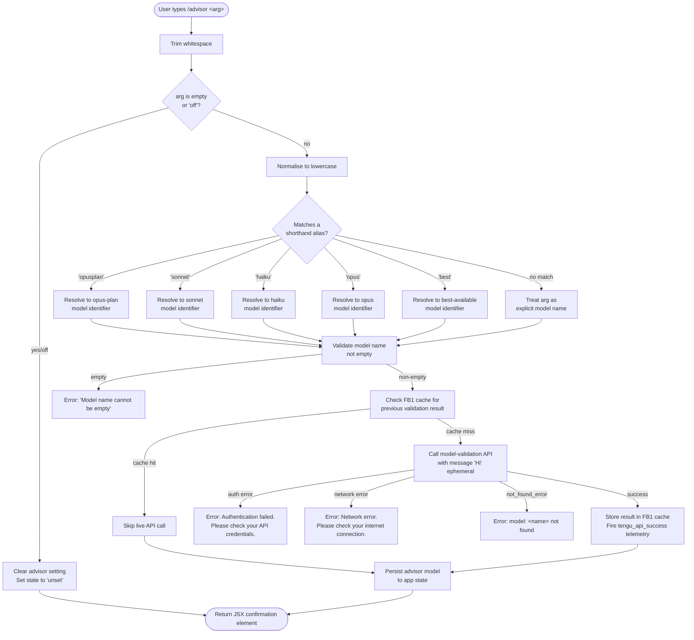

# `/advisor`

> Analysis basis: CC v2.1.150 bundle.js (AST extraction + Claude interpretation)
> Minimum version: v2.1.150

---

## Overview

The `/advisor` command configures the **Advisor Tool**, which causes Claude Code to consult a stronger or differently-configured model at key decision points during a task. It accepts a model shorthand or explicit model name, validates the target model against the API, and persists the selection (or clears it) into application state. When set, the advisor model is injected into long-running agentic workflows as a side-channel oracle.

---

## Registration

| Field | Value |
|---|---|
| type | `local-jsx` |
| name | `advisor` |
| description | `Configure the Advisor Tool to consult a stronger model for guidance at key moments during a task` |
| argumentHint | *(null — no argument hint displayed)* |
| module\_id | `lB1` |

Analysis basis: CC v2.1.150 bundle.js:+12248553

---

## Input Branching

The command handler (`advisorCommandHandler`) trims the raw argument string, normalises it to lowercase, and routes through several distinct paths depending on the value supplied.



Analysis basis: CC v2.1.150 bundle.js:+12248009, +12248085, +12248096, +12240535, +12240554, +12240656, +12240751

---

## Behavioral Spec

### 1. Argument Normalisation

```
function normaliseAdvisorArgument(rawArg):
    trimmed = rawArg.trim()                    // bundle.js:+12248009
    if trimmed == "" or trimmed == "off":      // bundle.js:+12248085, +12248096
        return CLEAR_SIGNAL
    return trimmed.toLowerCase()               // bundle.js:+15286807
```

- The sentinel value `"off"` explicitly disables the advisor and sets the stored state to `"unset"`.
- An empty argument is treated identically to `"off"` — the advisor is cleared.

Analysis basis: CC v2.1.150 bundle.js:+12248085, +12248096

### 2. Shorthand Alias Resolution

```
function resolveModelAlias(normalisedArg):
    aliasMap = {
        "opusplan" : resolveOpusPlanModel(),   // bundle.js:+2180463
        "sonnet"   : resolveSonnetModel(),     // bundle.js:+2180504
        "haiku"    : resolveHaikuModel(),      // bundle.js:+2180543
        "opus"     : resolveOpusModel(),       // bundle.js:+2180582
        "best"     : resolveBestModel(),       // bundle.js:+2180619
    }
    if normalisedArg in aliasMap:
        return aliasMap[normalisedArg]
    else:
        return normalisedArg   // pass-through as explicit model name
```

Known model strings surfaced in the implementation include `"opus-4-7"`, `"opus-4-6"`, and `"sonnet-4-6"`.
Analysis basis: CC v2.1.150 bundle.js:+5277201, +5277225, +5277249

### 3. Model Name Validation (Empty Guard)

```
function guardEmptyModelName(resolvedName):
    if resolvedName == "" or resolvedName is null:
        raise UserError("Model name cannot be empty")  // bundle.js:+12240412
    return resolvedName
```

Analysis basis: CC v2.1.150 bundle.js:+12240412

### 4. Model Availability Check (Live Validation)

The command sends a minimal probe message to the Anthropic API to confirm the resolved model name is accessible before committing the selection. Results are cached in a module-level `Map` (`validationCache`) so repeated `/advisor` calls for the same model name skip the network round-trip.

```
function validateModelWithAPI(modelName, validationCache):
    if validationCache.has(modelName):         // bundle.js:+12240656
        return CACHED_OK

    payload = buildValidationRequest(
        model    = modelName,
        purpose  = "model_validation",         // bundle.js:+12240751
        role     = "user",                     // bundle.js:+12240786
        content  = "Hi",                       // bundle.js:+12240820
        cacheControl = "ephemeral"             // bundle.js:+12240845
    )

    response = callAdvisorQueryPath(payload)   // Gx → globalThis.fetch, bundle.js:+13038857

    if response indicates auth failure:
        raise UserError("Authentication failed. Please check your API credentials.")
                                               // bundle.js:+12241111
    if response indicates network failure:
        raise UserError("Network error. Please check your internet connection.")
                                               // bundle.js:+12241213
    if response.error.type == "not_found_error":  // bundle.js:+12241332
        raise UserError("model: " + modelName + " not found")  // bundle.js:+12241414

    validationCache.set(modelName, true)       // bundle.js:+12240864
    emitTelemetry("tengu_api_success")         // bundle.js:+13040255
    return OK
```

- Maximum response tokens for the probe request: **1024** (Analysis basis: CC v2.1.150 bundle.js:+13038620)
- The probe is tagged internally as a `"side_query"` request type. (Analysis basis: CC v2.1.150 bundle.js:+13038804)
- Performance timing is recorded with `performance.now()` and `Date.now()`. (Analysis basis: CC v2.1.150 bundle.js:+13039847, +13040227)
- Timing arithmetic uses `Math.max` and `Math.round` to derive elapsed milliseconds. (Analysis basis: CC v2.1.150 bundle.js:+13040529, +13040540)

### 5. Provider Routing

The model resolution layer recognises three first-party provider routing modes:

| Routing mode | String constant |
|---|---|
| Direct Anthropic API | `"firstParty"` |
| Anthropic via AWS Bedrock | `"anthropicAws"` |
| API Gateway | `"gateway"` |

Analysis basis: CC v2.1.150 bundle.js:+2036195, +2036213, +2036233

### 6. Advisor-Model Inclusion Check

Before inserting the advisor model into a task, the implementation checks whether the advisor model name starts with `"anthropic."` (Bedrock-style prefix) or is already included in the active model list, to avoid duplicate injection.

```
function shouldIncludeAdvisorModel(modelName, activeModels):
    if modelName.startsWith("anthropic."):    // bundle.js:+2174609
        ...handle bedrock-prefixed name...
    if activeModels.includes(modelName):      // bundle.js:+2174624
        return false
    return true
```

Analysis basis: CC v2.1.150 bundle.js:+2174596, +2174609, +2174624

### 7. Side-Query Dispatch (Advisor Invocation at Runtime)

When the advisor is triggered during a task, the runtime dispatcher (`advisorQueryDispatcher`) builds a context-aware payload and fires it as a side query. Key behaviours observed in the call graph:

```
function advisorQueryDispatcher(context):
    prepareRequest(context)               // Kp, bundle.js:+13038772
    headers = buildHeaders()              // X,  bundle.js:+13038853
    rawResponse = globalThis.fetch(...)   // bundle.js:+13038857
    parsedStream = parseResponseStream()  // Lp,  bundle.js:+13038889

    if Array.isArray(rawResponse):        // bundle.js:+13039459
        limit = Math.min(...)             // bundle.js:+13039612
        ...truncate or sample response...

    tokenUsage = {
        cacheWindow: "1h",                // bundle.js:+13039654
        status: "enabled" | "disabled"   // bundle.js:+13039549, +13039588
    }

    elapsed = Math.round(
                Math.max(performance.now() - startTime, 0)
              )                           // bundle.js:+13040529, +13040540

    emitTelemetry("tengu_api_success", { elapsed })  // bundle.js:+13040255
```

- The response is mapped through a message-transformation step (`wa1`) before being returned to the primary task context. (Analysis basis: CC v2.1.150 bundle.js:+13039733)
- A build-metadata object embedding version `"2.1.150"`, build timestamp `"2026-05-23T01:22:49Z"`, commit `"28d4819e0f0a51840356d175c2a710f0c83db5b4"`, docs URL `"https://code.claude.com/docs/en/overview"`, and issues URL `"https://github.com/anthropics/claude-code/issues"` is included in the request headers or user-agent payload. (Analysis basis: CC v2.1.150 bundle.js:+13039162, +13039251, +13039282, +13039111, +13039189)

### 8. Random Jitter on Retry

The retry helper used within the advisor path introduces jitter via `Math.random()` scaled to a `[1, 2]` range before applying `setTimeout`, consistent with exponential-backoff-with-jitter patterns.

```
function retryWithJitter(attemptFn):
    jitterFactor = 1 + Math.random()   // range [1,2], bundle.js:+13290153, +13290155
    delay = baseDelay * jitterFactor
    setTimeout(attemptFn, delay)       // bundle.js:+13290192
```

Analysis basis: CC v2.1.150 bundle.js:+13290153, +13290155, +13290192

### 9. JSX Output Construction

The command returns a JSX element built with `createElement`. The confirmation display joins resolved model identifiers with `", "` as a separator.

```
function buildConfirmationElement(resolvedModels):
    label = resolvedModels.join(", ")  // bundle.js:+12248320, +12248329
    return createElement(...)          // bundle.js:+12248045
```

Analysis basis: CC v2.1.150 bundle.js:+12248045, +12248320, +12248329

### 10. Advisor-Enabled Model List Filtering (`iw6`)

A separate utility checks whether a given model name should be treated as advisor-capable. It normalises the name to lowercase, then tests for inclusion in a known list of advisor-eligible model identifiers containing at least `"opus-4-7"`, `"opus-4-6"`, and `"sonnet-4-6"`.

```
function isAdvisorEligibleModel(modelName):
    normalised = modelName.toLowerCase()    // bundle.js:+5277167
    return eligibleList.includes(normalised) // bundle.js:+5277190
    // eligibleList contains at minimum:
    //   "opus-4-7"    (bundle.js:+5277201)
    //   "opus-4-6"    (bundle.js:+5277225)
    //   "sonnet-4-6"  (bundle.js:+5277249)
```

Analysis basis: CC v2.1.150 bundle.js:+5277167, +5277190, +5277201, +5277225, +5277249

---

## State & Side Effects

| Item | Detail |
|---|---|
| Telemetry | `tengu_api_success` — fired after a successful model-validation probe (bundle.js:+13040255) |
| Validation cache | Module-level `Map` (`FB1`) keyed by resolved model name; populated on first successful validation, read on subsequent calls (bundle.js:+12240656, +12240864) |
| App state changes | Advisor model stored as a string in application state on success; set to `"unset"` when cleared (bundle.js:+12248096) |
| Network I/O | One `globalThis.fetch` call to the Anthropic messages API per uncached model name, tagged `"side_query"` (bundle.js:+13038804, +13038857) |
| Hook registration | <!-- TODO: not found in depth-2 traversal; needs --depth 4 --> |
| Sound | <!-- TODO: not found in depth-2 traversal; needs --depth 4 --> |
| Performance timing | `performance.now()` and `Date.now()` captured around the probe fetch; elapsed time included in telemetry payload (bundle.js:+13039847, +13040227) |

---

## Version History

| Version | Change |
|---|---|
| v2.1.150 | Initial analysis — command registered as `local-jsx`, model validation cache introduced, `tengu_api_success` telemetry confirmed, eligible model list includes `opus-4-7`, `opus-4-6`, `sonnet-4-6` |

---

## Common Mistakes

1. **Passing a raw Bedrock model ARN without the `anthropic.` prefix** — the provider-routing check uses `startsWith("anthropic.")` to detect Bedrock-style names; a malformed ARN will be sent to the direct Anthropic endpoint and fail with a `not_found_error`.
2. **Expecting `/advisor` alone (no argument) to show current status** — an empty argument is treated the same as `/advisor off` and *clears* the advisor setting, not displays it.
3. **Using `/advisor off` when the advisor was never set** — this is a no-op but sets state to `"unset"` regardless; no error is raised.
4. **Assuming the validation probe is free** — every first-use of a new model name makes a live API call (tagged `"side_query"`, max 1024 tokens) and will consume quota and incur latency before the advisor is confirmed active.
5. **Reusing a cached model name after an API key rotation** — the validation cache (`FB1`) persists for the process lifetime; if credentials change, the cache will return a stale success for a name that may now be inaccessible.
6. **Supplying an alias in mixed case** — alias matching occurs after `toLowerCase()`; however, supplying a mixed-case explicit model name (not an alias) will be passed through as-is, and the API may reject it if it is case-sensitive.
7. **Expecting shorthand `"best"` to be stable across versions** — `"best"` resolves via a runtime lookup; the underlying model it maps to can change without a version bump to the `/advisor` command itself.

---

## Appendix — Identifier Mapping

> For bundle debugging only. Identifiers change across versions.

| Identifier | Role |
|---|---|
| `t85` | Top-level advisor command handler (entry point for `/advisor`) |
| `A` | Normalised argument string variable / general-purpose intermediate value |
| `M` | Dialog/state manager that handles close operations for advisor UI |
| `nq` | Model alias resolver — maps shorthand names to canonical model identifiers |
| `H` | Raw argument or model name string variable; also used as retry-attempt context |
| `_` | Secondary string variable used for lowercase normalisation and includes checks |
| `bW` | Model registry lookup helper |
| `GqH` | Availability/inclusion guard — checks whether a model name is already in the active set |
| `cv` | Model configuration builder (composes provider routing + model fields) |
| `UpH` | Haiku model configuration constructor |
| `GZ` | Opus model configuration constructor |
| `D79` | Wrapper that delegates to `GZ` (opus configuration) |
| `Z3` | Provider-routing resolver — selects `firstParty`, `anthropicAws`, or `gateway` |
| `Fl6` | Eligible-model inclusion checker (tests against a known list) |
| `BpH` | Model-metadata helper |
| `rZ8` | Model validation orchestrator — cache check, API probe, error handling |
| `Xg` | Full advisor model pipeline (normalise → alias → validate → include check) |
| `Gx` | Side-query dispatcher — builds and fires the advisor fetch request |
| `F85` | Response parser / error classifier for validation API response |
| `iw6` | Advisor-eligibility filter — checks if a model name is in the advisor-capable list |