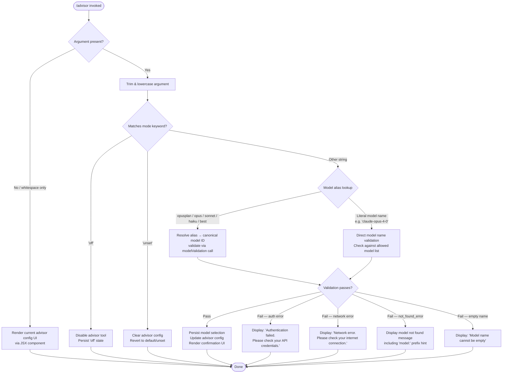

# `/advisor`

> Analysis basis: CC v2.1.154 bundle.js (AST extraction + Claude interpretation)
> Minimum version: v2.1.154

---

## Overview

The `/advisor` command configures the **Advisor Tool** — a subsystem that allows Claude Code to consult a stronger model (the "advisor") for guidance at key decision points during task execution. The command renders a JSX-based configuration UI, resolves and validates the target model name, and persists the selection so that subsequent agentic steps may delegate to the advisor model when appropriate.

---

## Registration

| Field | Value |
|---|---|
| type | `local-jsx` |
| name | `advisor` |
| description | `Configure the Advisor Tool to consult a stronger model for guidance at key moments during a task` |
| loc_byte | `12346559` |
| loc_byte_end | `12346846` |
| loc_line | `9237` |
| argumentHint | `null` |
| isHidden | `null` |
| module_id | `Ji1` |
| load_inline | `true` |
| arbor_handler.name | `gf5` |
| arbor_handler.fqn | `claude-2.1.154::gf5` |
| arbor_handler.kind | `AsyncFunction` |
| arbor_handler.resolution_path | `module_id` |
| arbor_handler.n_hits | `1` |

Analysis basis: CC v2.1.154 bundle.js:+12346559

---

## Input Branching

The command handler exhibits at least four distinct paths based on the argument string provided by the user (empty/omitted, a mode keyword, a model alias, and a fully qualified model name). A Mermaid flowchart is used.



Analysis basis: CC v2.1.154 bundle.js:+12346015, +12346091, +12346102, +12338274

---

## Behavioral Spec

### 1. Command Entry Point — Handler Dispatch

The Arbor-resolved handler is `gf5` (an `AsyncFunction`, resolved via `module_id` path from module `Ji1`).

```
async function advisorCommandHandler(inputArg, context):
    trimmedArg = inputArg.trim()                        // bundle.js:+12346015

    if trimmedArg is empty:
        return renderCurrentAdvisorConfigUI(context)   // createElement path

    normalizedArg = trimmedArg                          // passed downstream

    uiElement = createElement(AdvisorConfigComponent, props)
                                                        // bundle.js:+12346051
    resolvedModel = await resolveAdvisorModel(normalizedArg, context)
                                                        // bundle.js:+12346169
    advisorConfig = await buildAdvisorConfig(resolvedModel, context)
                                                        // bundle.js:+12346183
    modelList = joinModelList(advisorConfig)            // bundle.js:+12346326
    return renderResult(uiElement, modelList)
```

Analysis basis: CC v2.1.154 bundle.js:+12346015, +12346051, +12346169, +12346183, +12346326

---

### 2. Mode Keyword and Alias Resolution (`resolveAdvisorModel` — identifier `e9`)

This function maps human-friendly alias strings to canonical model identifiers, and handles the special `"off"` / `"unset"` mode keywords.

```
function resolveAdvisorModel(rawArg, context):
    trimmed = rawArg.trim()                             // bundle.js:+2189788
    lower   = trimmed.toLowerCase()                    // bundle.js:+2189799

    // Normalize punctuation / separators in the arg
    normalized = rawArg.replace(separatorPattern, "")  // bundle.js:+2189827

    // Check for special mode tokens
    if lower == "off":                                  // bundle.js:+12346091
        return { mode: "off" }

    if lower == "unset":                               // bundle.js:+12346102
        return { mode: "unset" }

    // Alias table (evaluated in order):
    //   "opusplan"  → plan-mode opus model            // bundle.js:+2189884
    //   "[1m]"      → 1-million-token context model   // bundle.js:+2189910
    //   "sonnet"    → latest sonnet model             // bundle.js:+2189925
    //   "haiku"     → latest haiku model              // bundle.js:+2189964
    //   "opus"      → latest opus model               // bundle.js:+2190003
    //   "best"      → highest-capability model        // bundle.js:+2190040
    canonicalId = aliasLookup(lower)                   // bundle.js:+2189817 (j0 → S1H → xH)

    if canonicalId found:
        return { modelId: canonicalId }

    // Fall through: treat the raw string as a literal model name
    sanitized = normalized.replace(escapePattern, "")  // bundle.js:+2190130
    return { modelId: sanitized }
```

Analysis basis: CC v2.1.154 bundle.js:+2189788, +2189799, +2189817, +2189827, +2189863, +2189884, +2189902, +2189925, +2189964, +2190003, +2190040, +2190054, +2190072, +2190086, +2190130

---

### 3. Model Name Validation (`buildAdvisorConfig` — identifier `lk8`)

After alias resolution, the resolved model identifier is validated by sending a lightweight test request. Empty names are rejected immediately; non-empty names go through a provider-aware validation pipeline.

```
async function buildAdvisorConfig(resolved, context):
    if resolved.mode == "off" or resolved.mode == "unset":
        persistAdvisorMode(resolved.mode, context)
        return { success: true, mode: resolved.mode }

    modelId = resolved.modelId
    if modelId.trim() == "":
        return { error: "Model name cannot be empty" }   // bundle.js:+12338274

    lower = modelId.toLowerCase()                        // bundle.js:+12338397

    // Check whether model ID is in the known allowed-models set
    if not allowedModelSet.has(lower):                   // bundle.js:+12338518
        // Attempt remote validation via advisor inference pipeline
        validationResult = await validateModelRemotely(modelId, context)
                                                         // bundle.js:+12338563 (zu)
    else:
        validationResult = { ok: true }

    if validationResult.ok:
        persistAdvisorModel(modelId, context)            // bundle.js:+12338726
        cacheModelValidationResult(modelId, context)     // bundle.js:+12338767 (Sf5)
        return { success: true, modelId: modelId }
    else:
        return mapValidationError(validationResult)
```

Known validation error codes mapped to user-facing messages:
- Auth failure → `"Authentication failed. Please check your API credentials."` (bundle.js:+12338973)
- Network failure → `"Network error. Please check your internet connection."` (bundle.js:+12339075)
- `not_found_error` type → model-not-found message with `"model:"` prefix hint (bundle.js:+12339194, +12339276)

Analysis basis: CC v2.1.154 bundle.js:+12338237, +12338274, +12338397, +12338416, +12338518, +12338563, +12338726, +12338767

---

### 4. Provider Detection and Model Capability Check (`providerAwareModelCheck` — identifier `SX6`)

Before persisting, the system checks whether the resolved model is compatible with the active provider (Bedrock, Vertex, Anthropic first-party, etc.).

```
function providerAwareModelCheck(modelId, providerContext):
    lower = modelId.toLowerCase()                       // bundle.js:+5320876
    if allowedProviderModels.includes(lower):           // bundle.js:+5320899
        return true
    return false
```

Supported provider literals resolved from the call graph:
- `"bedrock"` (bundle.js:+2044343)
- `"foundry"` (bundle.js:+2044393)
- `"anthropicAws"` (bundle.js:+2044449)
- `"mantle"` (bundle.js:+2044503)
- `"vertex"` (bundle.js:+2044551)
- `"firstParty"` (bundle.js:+2044560)
- `"gateway"` (bundle.js:+2045032)

Analysis basis: CC v2.1.154 bundle.js:+5320876, +5320899, +2044343

---

### 5. Model Alias Table — Known Canonical Model IDs

The following canonical model IDs appear in the alias/validation chain:

| Alias / Literal | Canonical ID | Bundle offset |
|---|---|---|
| `opusplan` | <!-- TODO: not found in depth-2 traversal; needs --depth 4 --> | +2189884 |
| `sonnet` | `claude-sonnet-4-0` / `claude-sonnet-4-5` / `claude-sonnet-4-6` | +2189925, +2934151 |
| `haiku` | `claude-haiku-4-5` | +2189964, +2934465 |
| `opus` | `claude-opus-4-0` / `claude-opus-4-1` etc. | +2190003, +2934128 |
| `best` | <!-- TODO: not found in depth-2 traversal; needs --depth 4 --> | +2190040 |
| (literal) | `claude-opus-4-5` | +2934344 |
| (literal) | `claude-opus-4-6` | +2934367 |
| (literal) | `claude-sonnet-4-5` | +2934415 |
| (literal) | `claude-sonnet-4-6` | +2934440 |

Named version aliases resolved via `Rf5` (model alias normalizer):

| Alias string | Normalized form | Bundle offset |
|---|---|---|
| `opus-4-8` / `opus_4_8` | <!-- TODO: not found in depth-2 traversal --> | +12339543, +12339567 |
| `opus-4-7` / `opus_4_7` | <!-- TODO: not found in depth-2 traversal --> | +12339612, +12339636 |
| `opus-4-6` / `opus_4_6` | <!-- TODO: not found in depth-2 traversal --> | +12339681, +12339705 |
| `opus-4-5` / `opus_4_5` | <!-- TODO: not found in depth-2 traversal --> | +12339750, +12339774 |
| `sonnet-4-6` / `sonnet_4_6` | <!-- TODO: not found in depth-2 traversal --> | +12339819, +12339845 |
| `sonnet-4-5` / `sonnet_4_5` | <!-- TODO: not found in depth-2 traversal --> | +12339894, +12339920 |

Analysis basis: CC v2.1.154 bundle.js:+12338822 (Rf5 — model alias normalizer)

---

### 6. Remote Validation Pipeline (`validateModelRemotely` — identifier `zu`)

When the model ID is not in the local allowed-set cache, a side-query API call validates the model. This path reuses the core API infrastructure.

```
async function validateModelRemotely(modelId, context):
    // Build a minimal side-query request tagged as "side_query"  // bundle.js:+13150048
    requestPayload = buildSideQueryPayload(modelId)

    // Compute a deterministic hash for deduplication
    payloadHash = sha256(requestPayload)[0:4].[0:7]              // bundle.js:+13104814, +13104829

    // Check in-flight / cached results
    if cachedResult = lookupCache(payloadHash):
        return cachedResult

    // Execute the API call with optional Bedrock/Vertex routing
    response = await executeApiCall(requestPayload, context)     // bundle.js:+13150101

    // Apply cache-control (1h TTL seen in telemetry context)    // bundle.js:+13111202
    cacheResult(payloadHash, response, ttl="1h")                 // bundle.js:+13150898

    recordTelemetry("tengu_api_success", metrics)                // bundle.js:+13151499

    return response
```

The remote call may encounter model-specific restrictions:
- Application inference profile prefix check: `"application-inference-profile"` (bundle.js:+2187876)
- Claude 3 legacy prefix: `"claude-3-"` (bundle.js:+2934110)
- Bedrock HIPAA flag: `"hipaa"` (bundle.js:+2935059)

Analysis basis: CC v2.1.154 bundle.js:+13150016, +13150048, +13150101, +13150133, +13150142, +13150154, +13150200, +13150209, +13151268, +13151358, +13151471, +13151484, +13151499

---

## State & Side Effects

| Item | Detail |
|---|---|
| Telemetry — `tengu_api_success` | Fired when the remote model validation call completes successfully (bundle.js:+13151499) |
| Telemetry — `tengu_prompt_cache_1h_config` | Fired when the 1-hour prompt-cache configuration is applied to the side-query (bundle.js:+13111202) |
| Telemetry — `tengu_bg_dispatch_sigkill_escalate` | Fired by background session subsystem if escalation is needed during validation dispatch (bundle.js:+15478604) |
| Telemetry — `tengu_bg_dispatch_low_mem` | Fired when background dispatch detects low available memory (bundle.js:+15479183) |
| Telemetry — `tengu_bg_spare_enable` | Fires when a spare background session slot is enabled (bundle.js:+15479878) |
| Telemetry — `tengu_bg_spare_claim` | Fires on successful spare slot claim (bundle.js:+15479999) |
| Telemetry — `tengu_bg_spare_claim_fail` | Fires on spare slot claim failure (bundle.js:+15480262) |
| Telemetry — `tengu_bg_proto_mismatch` | Fires on background protocol version mismatch (bundle.js:+15466937) |
| Telemetry — `tengu_bg_dispatch_stale_drop` | Fires when a stale background dispatch is dropped (bundle.js:+15468176) |
| Telemetry — `tengu_bg_attach_legacy_autorespawn` | Fires when a legacy attach triggers automatic respawn (bundle.js:+15470252) |
| Telemetry — `tengu_bg_attach` | Fires on background session attach (bundle.js:+15470663) |
| Telemetry — `tengu_bg_attach_stall_gave_up` | Fires when attach stall wait is exhausted (bundle.js:+15471580) |
| Telemetry — `tengu_bg_attach_stall_respawn` | Fires when a stall triggers a respawn (bundle.js:+15471849) |
| Telemetry — `tengu_bg_attach_kick` | Fires when a competing session is kicked during attach (bundle.js:+15472766) |
| appState changes | Advisor model ID and mode (`"off"` / `"unset"` / model string) are persisted to app state via `zi1.set` (bundle.js:+12338726) |
| Validation cache | Model validation results cached in `zi1` Map keyed by model identifier; pre-existence checked via `zi1.has` (bundle.js:+12338518, +12338726) |
| API side-query | A `"side_query"`-typed lightweight API call is issued for unknown model IDs; uses `sha256` hash for deduplication (bundle.js:+13150048, +13104814) |
| Hook registration | `<!-- TODO: not found in depth-2 traversal; needs --depth 4 -->` |
| Sound | `<!-- TODO: not found in depth-2 traversal; needs --depth 4 -->` |

---

## Version History

| Version | Change |
|---|---|
| v2.1.154 | Initial analysis |

---

## Common Mistakes

1. **Passing an unsupported alias**: Strings not in the alias table (`opusplan`, `sonnet`, `haiku`, `opus`, `best`) are treated as literal model names and sent to the remote validation endpoint. A typo will result in a `not_found_error` response rather than silent fallback.
2. **Omitting the argument when expecting a change**: Invoking `/advisor` with no argument renders the current configuration UI rather than resetting or enabling anything — supply `off` or `unset` explicitly to change state.
3. **Using underscore-style aliases in the wrong context**: Aliases like `opus_4_8` (underscore form) are normalized by the alias resolver (`Rf5`), but the hyphen form (`opus-4-8`) is also accepted. Either form should work, but mixing them unpredictably in scripts may cause confusion.
4. **Expecting instant effect when validation is slow**: The command performs an async remote model validation call when the model is not cached. The UI render and state persistence only complete after the remote call resolves; do not assume the advisor is configured until the confirmation UI appears.
5. **Using provider-incompatible model IDs**: Models not supported on the active provider (Bedrock, Vertex, etc.) will fail provider-compatibility checks even if the model ID string is valid. The error message may reference the provider context rather than the model name directly.

---

## Appendix — Identifier Mapping

> For bundle debugging only. Identifiers change across versions.

| Identifier | Role |
|---|---|
| `gf5` | Main advisor command handler (AsyncFunction, Arbor-resolved entry point) |
| `e9` | Model alias resolver — maps alias strings and mode keywords to canonical model IDs |
| `lk8` | Advisor config builder — validates model name, manages allowed-model cache, persists config |
| `WQ` | Model list / provider config builder — enumerates available models and MCP connections |
| `zu` | Remote model validation pipeline — executes side-query API call for unknown models |
| `HU` | Core API request executor — handles auth headers, OAuth, retries, streaming |
| `SX6` | Provider-aware model check — validates model ID against active provider's allowed list |
| `Rf5` | Model alias normalizer — converts underscore/hyphen variant aliases to canonical forms |
| `Sf5` | Validation result cacher — persists successful model validation to cache |
| `vSH` | MCP server config enumerator — iterates MCP server entries for connection metadata |
| `JGK` | MCP connection result applier — applies connection results and handles orphaned slots |
| `Gm5` | MCP client manager — filters, connects, and maps MCP server clients |
| `A` | Generic output/stream handler (context-dependent) |
| `f` | File/stream close handler |
| `q` | Temp file / Set operations context |
| `L` | Set-based cleanup / connection lifecycle manager |
| `H` | Generic context/state parameter (heavily polymorphic) |
| `j0` | Alias-to-ID lookup dispatcher |
| `S1H` | Alias resolution step (wraps xH string conversion) |
| `xH` | String coercion / type normalizer |
| `y1H` | Allowed-model set membership check |
| `hN` | Model capability / provider feature resolver |
| `Bf` | Provider type discriminator |
| `GA` | Provider info extractor |
| `M5` | Model-to-provider mapper |
| `JxH` | Provider-model join helper |
| `GR4` | Model-provider record builder |
| `H1q` | Object entry iterator for model config |
| `Gi6` | Provider client finder / model list resolver |
| `pBH` | Provider-aware model filter |
| `EZ` | Model record composer (Bf + M5 + GA) |
| `L$q` | Model composition wrapper |
| `ar6` | Allowed-provider-list membership check |
| `UBH` | Provider string normalizer |
| `N` | Model/config normalization utility (trim, uppercase, include checks) |
| `Ti6` | Object-entries iterator for model/tool config |
| `i_` | Utility: key-value pair processor |
| `mBH` | Blocked-model list membership check |
| `K$q` | Model index locator (indexOf) |
| `sx4` | Inclusion + alias + resolver chain for model lookup |
| `tx4` | Prefix-aware model selector |
| `q$q` | Model-string prefix checker (startsWith) |
| `MEH` | Model eligibility resolver (O9 + Hw + eS chain) |
| `O9` | Application-inference-profile and include-check resolver |
| `eS` | Provider group membership resolver |
| `Hw` | Provider category lookup (Pi6 / PR4 / GA / Xi6) |
| `LP5` | Cache lookup for side-query results |
| `oqA` | SHA-256 hash generator for deduplication |
| `er6` | API response processor (GA + sr6 + N chain) |
| `sr6` | Async store getter for request context |
| `l88` | Result logger / GA wrapper |
| `ykH` | Prompt-cache configurator (1h TTL, thread-name checks) |
| `EA` | Request sender (TY + HR + Uq) |
| `am8` | Cache annotation helper |
| `E6` | Deduplication guard (hzH / Iz6 / $U set management) |
| `sm8` | Suffix/prefix model name matcher |
| `SZ` | HIPAA-flag and feature-set resolver |
| `I3_` | Feature-set GA wrapper |
| `fEH` | Feature-set xH normalizer |
| `NP` | Model-name replacement / sanitizer |
| `GH8` | Temperature + O9 + include-check resolver |
| `EP` | Map-over-messages utility |
| `gYH` | Message formatter and random-ID generator |
| `RH` | JSON serializer wrapper |
| `KU` | Cryptographic random bytes generator for IDs |
| `b7` | TY + b6 composite caller |
| `kMH` | Metrics/timing helper |
| `c` | Generic closure / callback |
| `$J6` | Kf9 + MJ6 composite caller |
| `Kf9` | ak7 + hH composite helper |
| `MJ6` | Secondary metric recorder |
| `Hc` | ok7 + F6H + hH agent context resolver |
| `ok7` | Agent-prefix decoder (builtin/custom/main) |
| `F6H` | Thread-name prefix check (startsWith "repl_main_thread") |
| `hH` | Error logger (F_ / xH / q1 / D84 / Li.logError chain) |
| `W96` | <!-- TODO: not found in depth-2 traversal; needs --depth 4 --> |
| `nV6` | <!-- TODO: not found in depth-2 traversal; needs --depth 4 --> |
| `Vb8` | <!-- TODO: not found in depth-2 traversal; needs --depth 4 --> |
| `i_K` | <!-- TODO: not found in depth-2 traversal; needs --depth 4 --> |