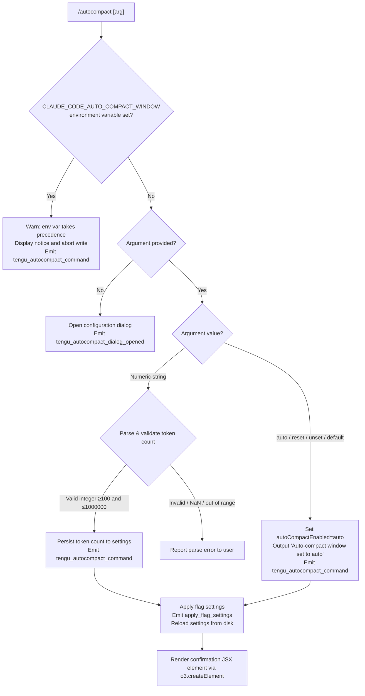

# `/autocompact`

> Analysis basis: CC v2.1.154 bundle.js (AST extraction + Claude interpretation)
> Minimum version: v2.1.154

---

## Overview

`/autocompact` configures the auto-compact window size for Claude Code sessions. It accepts either the special keyword `auto` (for automatic sizing) or a numeric token count, validates the input against environment overrides and allowed ranges, then persists the setting and optionally surfaces a configuration dialog. When the environment variable `CLAUDE_CODE_AUTO_COMPACT_WINDOW` is set, it takes full precedence and the command warns rather than modifies the value.

---

## Registration

| Field | Value |
|---|---|
| type | `local-jsx` |
| name | `autocompact` |
| description | `Configure the auto-compact window size` |
| argumentHint | `[auto\|<tokens>]` |
| isHidden | `false` |
| module_id | `yv1` |
| load_inline | `true` |
| loc_byte | `10785641` |
| loc_byte_end | `10785890` |
| loc_line | `7740` |
| arbor_handler.name | `bnL` |
| arbor_handler.fqn | `claude-2.1.154::bnL` |
| arbor_handler.kind | `AsyncFunction` |
| arbor_handler.resolution_path | `module_id` |
| arbor_handler.n_hits | `1` |

Analysis basis: CC v2.1.154 bundle.js:+10785641

---

## Input Branching

The command has four or more distinct input branches (no argument, `auto`/reset keywords, numeric token value, and env-var override guard), requiring a Mermaid flowchart.



Analysis basis: CC v2.1.154 bundle.js:+10780039, +10780073, +10780175, +10780892, +9958212, +9958317, +9958353, +9959066

---

## Behavioral Spec

### 1. Top-level Handler (`bnL`)

The async handler `bnL` is the Arbor-resolved entry point (resolution path: `module_id` → `yv1`). It delegates immediately to the argument-processing function `HN6`, passes the context object `H` and the React-like factory `c`, and then calls `o3.createElement` to produce a JSX result node (type `"dialog"`) for display.

```
async function autocompactHandler(appContext, arg, reactFactory):
    telemetry("tengu_autocompact_dialog_opened")   // when no arg → dialog path
    result = await processAutocompactArg(appContext, arg)
    return reactFactory.createElement("dialog", result)
```

Analysis basis: CC v2.1.154 bundle.js:+10785327, +10785343, +10785360, +10785415

---

### 2. Argument Processing (`HN6`)

This function trims whitespace from the raw argument, then branches on content:

```
async function processAutocompactArg(appContext, rawArg):
    arg = rawArg.trim()

    // Check environment variable override first
    if CLAUDE_CODE_AUTO_COMPACT_WINDOW is set in environment:
        telemetry("tengu_autocompact_command")
        return warn("CLAUDE_CODE_AUTO_COMPACT_WINDOW is set and takes precedence. Unset it to change this setting.")

    // No argument: open interactive dialog
    if arg is empty:
        telemetry("tengu_autocompact_dialog_opened")
        return openConfigDialog(appContext)

    // Reset keywords: restore automatic mode
    if arg in ["reset", "unset", "default"]:
        parsedValue = "auto"
    else:
        parsedValue = parseTokenValue(arg)   // see §3

    if parsedValue == "auto":
        persistSetting("autoCompactEnabled", "auto")
        telemetry("tengu_autocompact_command")
        return message("Auto-compact window set to auto")

    if parsedValue is error:
        return reportParseError(parsedValue.reason)

    // Numeric path
    persistSetting("autoCompactEnabled", parsedValue)
    emitFlagSettings("apply_flag_settings", parsedValue)
    telemetry("tengu_autocompact_command")
    reloadSettingsFromDisk(appContext)
    return successMessage(parsedValue)
```

Analysis basis: CC v2.1.154 bundle.js:+10780175, +10780204, +10780217, +10780230, +10780247, +10780415, +10780511, +10780615, +10780676, +10780678, +10780732, +10780876, +10780892

---

### 3. Token Value Parser (`Oc_`)

The `parseTokenValue` function (identifier `Oc_`) is shared with the broader compact-window infrastructure. It accepts a string and applies the following rules:

```
function parseTokenValue(raw):
    s = raw.trim()

    if s == "auto":
        return "auto"

    // Accept suffixes: allow e.g. "200k" → 200000
    if s ends with "k" or "K":
        numeric = parseFloat(s without suffix)
        if Number.isFinite(numeric):
            return Math.round(numeric * 1000)

    // Plain integer
    n = parseInt(s, 10)
    if not Number.isFinite(n):
        return error("not a number")

    // Range guard: minimum 100, maximum 1 000 000
    if n < 100 or n > 1000000:
        return error("out of range [100, 1000000]")

    return Math.round(n)
```

Minimum token count: **100** (bundle.js:+9958353)
Maximum token count: **1 000 000** (bundle.js:+9958997)

Analysis basis: CC v2.1.154 bundle.js:+9958182, +9958212, +9958241, +9958259, +9958317, +9958333, +9958353, +9958379, +9958426

---

### 4. Environment Variable Override (`r6H`)

Before applying any user-supplied value, the handler checks for `CLAUDE_CODE_AUTO_COMPACT_WINDOW` via the environment reader `r6H`. If the variable is present and resolves to a valid integer, it short-circuits further writes and emits a warning to the user.

```
function checkEnvOverride():
    raw = process.env["CLAUDE_CODE_AUTO_COMPACT_WINDOW"]
    if raw is undefined or null:
        return null          // no override active

    n = parseInt(raw)
    if isNaN(n):
        return { status: "invalid" }
    if n is capped by system limits:
        return { status: "capped", value: clampedValue }
    return { status: "valid", value: n }
```

Analysis basis: CC v2.1.154 bundle.js:+9958786, +4917393, +4917411, +4917378, +4917453, +4917583

---

### 5. Settings Persistence (`Wl` → `DV` → `j0` / `gp` / `be` / `DH8`)

After validation, the handler writes the new value through the layered settings system. The call chain is:

```
function persistCompactWindow(value, settingsLayer):
    // Determine target layer: "userSettings" | "projectSettings" | "localSettings"
    layer = resolveSettingsLayer(settingsLayer)
    writeSettingKey(layer, "autoCompactEnabled", value)
    // Priority order: policySettings > flagSettings > userSettings > projectSettings > localSettings
    recomputeEffectiveSettings()
```

The persistence call flow is: `Wl` → `DV` → token-range helpers (`j0`, `gp`, `be`, `DH8`), clamping between `Math.max(0, value)` and `Math.min(1000000, value)`.

Intermediate radix constant: base **10** for `parseInt` (bundle.js:+2928950)
Lower clamp: **0** (bundle.js:+2928970)
Upper clamp: **1 000 000** (bundle.js:+2928997)

Analysis basis: CC v2.1.154 bundle.js:+9958717, +2928815, +2928898, +2928958, +2928984, +2929028, +2929048, +2929071

---

### 6. Flag-Settings Emission (`U_` → `EJ1`)

After a successful write, the handler emits the `apply_flag_settings` event and triggers a settings reload sequence:

```
function applyAndReload(newValue):
    emit("apply_flag_settings", { autoCompactEnabled: newValue })
    // Source priority re-evaluated: env > settings > experiment
    reloadSettingsFromDisk()     // calls vp → Bo8 → zyA
    invalidateCaches()           // calls Xz: clears lR6 and Hu8
```

The source priority labels present in the bundle are: `"env"` (bundle.js:+9958978), `"settings"` (bundle.js:+9959048), `"experiment"` (bundle.js:+9959135).

Analysis basis: CC v2.1.154 bundle.js:+9959066, +9958529, +9958544, +9958594, +1227757, +26612, +26624

---

### 7. Model-Affinity Table (referenced by `_w` / `O9`)

The token-window computation references a hard-coded model name list used to determine default compact window sizes. These model identifiers are reached via the `O9` → `_w` path and are used when `"auto"` mode resolves the actual window at runtime:

| Model prefix | loc_byte |
|---|---|
| `claude-opus-4-8` | 2186851 |
| `claude-opus-4-7` | 2186908 |
| `claude-opus-4-6` | 2186965 |
| `claude-opus-4-5` | 2187022 |
| `claude-opus-4-1` | 2187079 |
| `claude-opus-4-0` | 2187168 |
| `claude-sonnet-4-6` | 2187200 |
| `claude-sonnet-4-5` | 2187261 |
| `claude-sonnet-4-0` | 2187356 |
| `claude-haiku-4-5` | 2187390 |
| `claude-3-7-sonnet` | 2187449 |
| `claude-3-5-sonnet` | 2187510 |
| `claude-3-5-haiku` | 2187571 |
| `claude-3-opus` | 2187630 |
| `claude-3-sonnet` | 2187683 |
| `claude-3-haiku` | 2187740 |

Analysis basis: CC v2.1.154 bundle.js:+2186824, +2187833, +2187856

---

## State & Side Effects

| Item | Detail |
|---|---|
| Telemetry: `tengu_autocompact_dialog_opened` | Fired when no argument is supplied and the interactive dialog is opened (bundle.js:+10785362) |
| Telemetry: `tengu_autocompact_command` | Fired on every non-dialog path: env-override warn, `auto` reset, and numeric set (bundle.js:+10780678) |
| Telemetry: `tengu_amber_redwood2` | Fired inside the settings-source resolution path `EJ1` (bundle.js:+9958597) |
| Telemetry: `tengu_feature_ok` | Fired by context helper `c` on success path (bundle.js:+965176) |
| Telemetry: `tengu_feature_sad` | Fired by context helper `t6` on soft-failure path (bundle.js:+965311) |
| Telemetry: `tengu_feature_bad` | Fired by context helper `uH` on hard-failure path (bundle.js:+965234) |
| Settings write | Writes `autoCompactEnabled` key to the active settings layer (user/project/local) via `U_` → `tB6` |
| Cache invalidation | Clears `lR6` and `Hu8` caches via `Xz` after settings write (bundle.js:+26612, +26624) |
| Event emission | Emits `apply_flag_settings` event via `kpH.emit` (bundle.js:+1228143) |
| Timestamp recording | `mr8` sets a `Date.now()` timestamp in `LF6` map on settings write (bundle.js:+1099381, +1099391) |
| JSX output | Returns a `"dialog"` element via `o3.createElement` for terminal rendering (bundle.js:+10785415) |
| env override guard | If `CLAUDE_CODE_AUTO_COMPACT_WINDOW` is set, no write occurs; user sees precedence warning (bundle.js:+10780073) |

---

## Version History

| Version | Change |
|---|---|
| v2.1.154 | Initial analysis |

---

## Common Mistakes

1. **Setting the value while `CLAUDE_CODE_AUTO_COMPACT_WINDOW` is set**: The command will not write the new value; instead it prints a warning that the environment variable takes precedence. Unset the variable first.
2. **Providing a value below 100 tokens**: Values under 100 are rejected by the parser (`Oc_`). Use `auto` for automatic sizing or provide a value in `[100, 1000000]`.
3. **Expecting immediate effect without settings reload**: The command triggers a full settings reload and cache invalidation — the new window size applies to the next compaction cycle, not the current turn.
4. **Confusing `reset`/`unset`/`default` with explicit `auto`**: All three reset keywords are aliased to `"auto"` internally and produce the same `"Auto-compact window set to auto"` confirmation.
5. **Using fractional values without the `k` suffix**: `parseFloat` with the `k` suffix (e.g., `200k`) is supported; plain decimals may be silently rounded or rejected depending on the parse path.

---

## Appendix — Identifier Mapping

> For bundle debugging only. Identifiers change across versions.

| Identifier | Role |
|---|---|
| `bnL` | Top-level async handler for `/autocompact` (Arbor-resolved entry point) |
| `HN6` | Argument-processing dispatcher: env check, keyword branch, numeric branch |
| `Wl` | Compact-window persistence orchestrator |
| `O9` | Model-name lookup / context resolver |
| `Ti6` | Object.entries iterator helper used inside model lookup |
| `_w` | Model string normalizer (toLowerCase, includes, replace) |
| `Hp8` | Helper called during model resolution |
| `NP` | String replace utility (H.replace wrapper) |
| `DV` | Settings-layer write coordinator |
| `xH` | String coercion helper |
| `j0` | Token-range lower-bound validator (calls `S1H`) |
| `gp` | Token-range validator with model-prefix check (`"claude-3-"`) |
| `be` | Token-range write helper with `firstParty`/`anthropicAws`/`mantle` tier checks |
| `DH8` | Numeric settings writer with `Number.isFinite` guard |
| `sW` | Settings source selector |
| `r6H` | Environment variable reader for `CLAUDE_CODE_AUTO_COMPACT_WINDOW` |
| `N` | Log/notification dispatcher (debug, info, warn levels) |
| `EJ1` | Settings-source priority resolver (`env` > `settings` > `experiment`) |
| `JT` | Settings field accessor (`autoCompactEnabled`) |
| `S_` | Settings source fallback handler |
| `E6` | Feature-flag / experiment reader |
| `Oc_` | Token-value string parser (`auto`, `k`-suffix, plain integer) |
| `U_` | Settings file writer (reads/writes `.claude/settings.json`) |
| `wO` | Settings file loader |
| `K$H` | Settings path builder (joins `.claude/settings.json`) |
| `ig` | Settings object merger / deserializer |
| `B6` | Base settings reader |
| `Uo8` | Settings directory scanner |
| `zyA` | Settings key enumerator (Object.keys) |
| `ng` | Settings section parser |
| `MyA` | SDK inline settings handler |
| `zP` | Project-settings path resolver |
| `Mi` | File reader with slice/replaceAll (4096-byte buffer) |
| `P8` | ENOENT / error-code handler |
| `J8` | Error-code constant provider (`"ENOENT"`) |
| `mr8` | Timestamp recorder (`LF6.set`, `Date.now`) |
| `mGH` | Settings-load completion emitter |
| `nF6` | Path resolver (`PN.resolve`, `PN.dirname`) |
| `$L6` | Atomic file writer (temp + rename, fchmod, fsync) |
| `q` | Filesystem namespace (lstatSync, renameSync, unlinkSync, etc.) |
| `O` | Stat result wrapper (`isSymbolicLink`) |
| `f` | File handle wrapper |
| `RH` | JSON serializer (`JSON.stringify`) |
| `Xz` | Cache invalidator (clears `lR6` and `Hu8`) |
| `tB6` | Gitignore/settings file appender |
| `C6` | Settings base constructor |
| `Tr8` | Settings section transformer |
| `A` | Path suffix helper (`endsWith`, `toLowerCase`) |
| `sB6` | Git check-ignore runner |
| `Pq4` | Global gitignore path resolver |
| `oNA` | Git ls-files tracker |
| `aNA` | Gitignore append helper |
| `hb` | Settings path helper (`.claude` directory join) |
| `$_` | Observable/reactive store wrapper |
| `ov` | Store subscription helper |
| `yH` | Feature-ok telemetry emitter (`tengu_feature_ok`) |
| `c` | Feature context object |
| `t6` | Feature-sad telemetry emitter (`tengu_feature_sad`) |
| `uH` | Feature-bad telemetry emitter (`tengu_feature_bad`) |
| `vp` | Settings-load-from-disk initiator |
| `gE` | Load trigger helper |
| `T9` | Memory-usage sampler (`process.memoryUsage`) |
| `Bo8` | Full settings reload orchestrator |
| `nR6` | Post-reload notifier |
| `hH` | Error queue manager (shift/push on `LB6`, `QmH`) |
| `F_` | Error formatter (`Error`, `String`) |
| `q1` | Essential-traffic classifier |
| `D84` | Error-log ring buffer manager |
| `i_` | Settings-watcher initializer (calls `vp`) |
| `s1` | Number formatter (en-US locale, compact notation) |
| `YK` | Number format wrapper |
| `cRK` | Locale format helper |