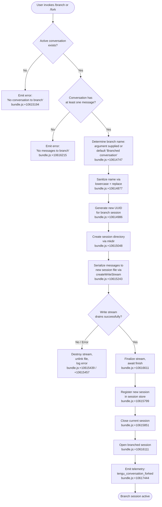

# `/branch`

> Analysis basis: CC v2.1.150 bundle.js (AST extraction + Claude interpretation)
> Minimum version: v2.1.150

---

## Overview

The `/branch` command (also aliased as `/fork`) creates a new, independent conversation session that is a copy of the current conversation up to the point at which the command is invoked. It serializes the current conversation's messages into a new session file and then opens that new session, allowing the user to explore an alternative path without modifying the original conversation. The default title assigned to the new branch is `"Branched conversation"`.

---

## Registration

| Field | Value |
|---|---|
| type | `local-jsx` |
| name | `branch` |
| description | Create a branch of the current conversation at this point |
| argumentHint | `[name]` |
| aliases | `["fork"]` |
| module_id | `Md_` |

Analysis basis: CC v2.1.150 bundle.js:+12099775

---

## Input Branching

The command handler performs several validation steps before creating the branch. The flowchart below captures the main decision paths.



---

## Behavioral Spec

### 1. Name Resolution

When the user supplies an optional `[name]` argument, the raw argument string is used as the branch title; otherwise the default title `"Branched conversation"` is substituted.

Analysis basis: CC v2.1.150 bundle.js:+10614747

```
function resolveBranchName(rawArgument):
    if rawArgument is non-empty:
        title = rawArgument
    else:
        title = "Branched conversation"
    sanitized = sanitizeName(title)
    return sanitized
```

Analysis basis: CC v2.1.150 bundle.js:+10614747, +10614877

### 2. Name Sanitization

The resolved title is normalized by converting it to lowercase and applying a regular-expression replacement to produce a filesystem-safe identifier.

Analysis basis: CC v2.1.150 bundle.js:+10614877, +15286807

```
function sanitizeName(title):
    lower = title.toLowerCase()
    safe  = lower.replace(UNSAFE_CHARS_PATTERN, REPLACEMENT)
    return safe
```

The truncation threshold observed in the call vicinity is **40** characters.
Analysis basis: CC v2.1.150 bundle.js:+15286881

### 3. Session File Serialization

A unique session identifier is generated with `crypto.randomUUID()`. The target directory is created if it does not exist. Messages from the current conversation are written into the new session file through a writable stream. Each message is encoded as UTF-8 JSON, one record per line (NDJSON-style), using a buffer size of **448** bytes per chunk.

Analysis basis: CC v2.1.150 bundle.js:+10614986, +10615048, +10615079, +10615130, +10615243

```
function createBranchSessionFile(messages, branchName):
    sessionId  = crypto.randomUUID()
    targetDir  = buildSessionPath(sessionId)
    mkdir(targetDir, recursive = true)

    writeStream = createWriteStream(targetDir + "/messages.jsonl", encoding = "utf8")

    for message in messages:
        chunk = JSON.stringify(message) + "\n"
        writeStream.write(chunk)

    writeStream.end()
    await streamFinished(writeStream)

    return sessionId
```

Analysis basis: CC v2.1.150 bundle.js:+10615048, +10615097, +10615130, +10615243, +10616611

### 4. Message Filtering by Type

Only messages whose `type` field equals `"text"` are included in the branch payload at the point of serialization.

Analysis basis: CC v2.1.150 bundle.js:+10614820

```
function filterMessages(allMessages):
    return allMessages.filter(m => m.type === "text")
```

### 5. Content-Replacement Handling

During serialization the command applies a `"content-replacement"` pass over the message array before writing, normalizing any assistant-side content edits before they are frozen into the branch.

Analysis basis: CC v2.1.150 bundle.js:+10615674

```
function applyContentReplacement(messages):
    for message in messages:
        if message has pending content-replacement:
            apply replacement inline
    return messages
```

### 6. Progress Reporting

While the write is in progress a `"progress"` status update is emitted to the UI layer so the user receives visual feedback during potentially long serialization of large conversations.

Analysis basis: CC v2.1.150 bundle.js:+10616133

```
function emitProgress(statusEmitter):
    statusEmitter.emit("progress", { stage: "branch-write" })
```

### 7. Error Handling

Two named error conditions are recognized:

| Condition | Message | Source |
|---|---|---|
| No active conversation | `"No conversation to branch"` | bundle.js:+10615194 |
| Conversation has zero messages | `"No messages to branch"` | bundle.js:+10616215 |
| Generic fallback | `"Unknown error occurred"` | bundle.js:+10618113 |
| File not found during read | `ENOENT` guard | bundle.js:+173271 |

On a write-stream error the stream is destroyed and the partially written session file is deleted via `unlink` before the error is surfaced to the user.

Analysis basis: CC v2.1.150 bundle.js:+10615439, +10615457, +10615188, +10616215, +10618113

```
function handleWriteError(writeStream, targetFilePath, error):
    writeStream.destroy()
    unlink(targetFilePath)
    throw error
```

### 8. Session Registration and Transition

After the file is successfully written, the new session is registered in the in-memory session map (`w.set`). The current session's UI components are torn down (`Y.close`, `$.destroy`), and the new branch session is opened. The session store is then updated to track the branch as the active session.

Analysis basis: CC v2.1.150 bundle.js:+10615799, +10615851, +10615861, +10616111

```
function transitionToNewBranch(sessionStore, currentSession, newSessionId):
    sessionStore.set(newSessionId, newBranchDescriptor)
    currentSession.close()
    currentSession.destroy()
    openSession(newSessionId)
```

### 9. Title Metadata Handling

The title type recorded in the new session metadata is `"auto"` when no explicit name is provided by the user, and `"custom-title"` when the user supplies a name argument.

Analysis basis: CC v2.1.150 bundle.js:+10617398, +12783269

```
function buildTitleMetadata(userSuppliedName):
    if userSuppliedName is non-empty:
        return { titleType: "custom-title", title: userSuppliedName }
    else:
        return { titleType: "auto", title: "Branched conversation" }
```

### 10. Fork Telemetry Emission

Immediately after the new session is opened, a `tengu_conversation_forked` telemetry event is emitted. The event is tagged with `"fork"` as the action kind.

Analysis basis: CC v2.1.150 bundle.js:+10617444, +10617965

```
function emitForkTelemetry(telemetryClient, sessionId):
    telemetryClient.emit("tengu_conversation_forked", {
        action : "fork",
        sessionId: sessionId
    })
```

---

## State & Side Effects

| Item | Detail |
|---|---|
| Telemetry — primary | `tengu_conversation_forked` (bundle.js:+10617444) |
| Telemetry — background daemon (indirect) | `tengu_bg_dispatch_sigkill_escalate`, `tengu_bg_dispatch_low_mem`, `tengu_bg_spare_enable`, `tengu_bg_spare_claim`, `tengu_bg_spare_claim_fail`, `tengu_daemon_yield`, `tengu_bg_low_mem_mb`, `tengu_bg_spare_spawn`, `tengu_daemon_config_reload`, `tengu_daemon_control`, `tengu_bg_proto_mismatch`, `tengu_bg_dispatch_stale_drop`, `tengu_bg_attach_legacy_autorespawn`, `tengu_bg_attach`, `tengu_bg_attach_stall_gave_up`, `tengu_bg_attach_stall_respawn`, `tengu_bg_attach_kick`, `tengu_session_renamed`, `tengu_agent_name_set` |
| Session file created | New NDJSON session file written under the CC sessions directory |
| Session directory created | `mkdir` called recursively for the new session path (bundle.js:+10615048) |
| appState changes | Active session pointer switched from source session to new branch session; source session closed and destroyed |
| Session store mutation | `sessionStore.set(newSessionId, descriptor)` called (bundle.js:+10615799) |
| Write stream lifecycle | Created → written → ended → finished; on error: destroyed + file unlinked |
| Sound | <!-- TODO: not found in depth-2 traversal; needs --depth 4 --> |

---

## Version History

| Version | Change |
|---|---|
| v2.1.150 | Initial analysis |

---

## Common Mistakes

1. **Invoking `/branch` with no active conversation.** If no conversation session is loaded, the command immediately exits with `"No conversation to branch"` and does nothing. Start a conversation first.

2. **Invoking `/branch` on an empty conversation.** If the conversation has been started but contains zero messages (e.g., the user typed `/branch` as their very first input), the command exits with `"No messages to branch"`. At least one exchange must exist.

3. **Assuming the original conversation is modified.** The branch is a snapshot copy; the source conversation remains open and unmodified in a separate session. The UI switches to the new branch, but the source is still accessible via session history.

4. **Expecting the branch name to be case-preserving.** The supplied name argument is lowercased and sanitized before being used as a filesystem identifier. Display titles may be rendered differently from the sanitized form.

5. **Using `/branch` inside a non-interactive or piped invocation.** The command is registered as `local-jsx`, meaning it requires an interactive terminal session. It will not function correctly when Claude Code is driven programmatically without a TTY.

6. **Confusing `/branch` with `/fork`.** Both aliases are fully equivalent; `"fork"` is simply a registered alias for the same command handler. There is no behavioral difference.

---

## Appendix — Identifier Mapping

> For bundle debugging only. Identifiers change across versions.

| Identifier | Role |
|---|---|
| `eP1` | Branch name sanitizer / argument processor |
| `H21` | Core branch-session file writer (main async routine) |
| `S6` | Session path builder utility |
| `Dv` | Low-level filesystem path helper |
| `j_` | Session descriptor constructor |
| `BV` | Session metadata assembler |
| `YI` | Session index updater |
| `VM` | Message-array serializer (formats messages for NDJSON output) |
| `j8` | ENOENT error classifier |
| `K8` | Generic error wrapper |
| `RH` | Error log dispatcher |
| `c_` | Error object normalizer |
| `mH` | String coercion helper |
| `G1` | Error queue manager |
| `xiK` | Rotating error buffer (shift/push queue) |
| `O` | Active write stream handle |
| `k8` | Background session label constant holder |
| `H` | Retry / jitter timer helper |
| `J` | Session teardown orchestrator |
| `w` | In-memory session store map |
| `g6` | JSON line parser |
| `j` | Worker process registry |
| `y` | Transient worker process handle |
| `TR` | Content-replacement transformer |
| `D` | Background daemon dispatcher |
| `V6` | Daemon job registry lookup |
| `$` | Current session UI component handle |
| `Kv8` | Platform-aware memory-check wrapper |
| `kqA` | Background spare-session spawner |
| `c` | Generic async continuation / callback helper |
| `Dz` | Daemon state logger |
| `N` | Shell command argument normalizer |
| `Y` | Session lifecycle controller (open/close/update) |
| `tXH` | Session config writer |
| `q` | Persistent socket / IPC write handle |
| `Ic1` | Session column-width calculator |
| `G` | Keyboard/input event interceptor |
| `Z` | Daemon watcher / heartbeat controller |
| `_XK` | Heartbeat interval scheduler |
| `V` | Session start coordinator |
| `W` | Notification / skill-update broadcaster |
| `z` | Active notification set |
| `czH` | Config-change event emitter |
| `tQH` | Skill availability checker |
| `vyH` | Notification visibility helper |
| `bo` | Notification payload builder |
| `L` | Async task queue (add / finally / delete) |
| `XyH` | Display-cache invalidator |
| `X` | IPC socket message reader |
| `zM` | IPC framing / end-of-message handler |
| `Ok5` | IPC message dispatcher / protocol handler |
| `EH` | Buffer-to-string decoder |
| `CH` | JSON serializer wrapper |
| `pxL` | Top-level branch command entry point (JSX component) |
| `_21` | Branch orchestrator (coordinates name resolution, file write, session switch) |
| `gO` | Session store initializer |
| `mxL` | Message index builder (parseInt / K.add / K.has) |
| `cy` | Custom-title metadata emitter |
| `GLH` | Agent-name metadata emitter |
| `Cq` | ISO timestamp slicer / formatter |