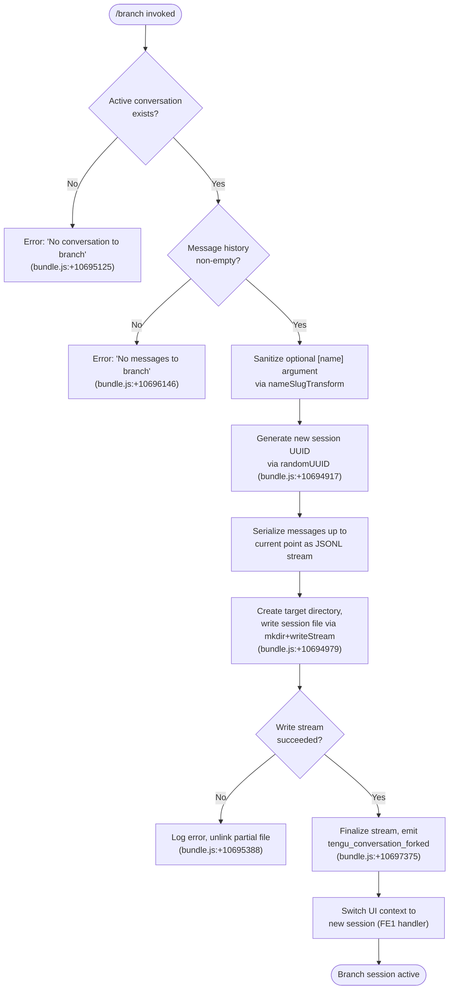

# `/branch`

> Analysis basis: CC v2.1.154 bundle.js (AST extraction + Claude interpretation)
> Minimum version: v2.1.154

---

## Overview

The `/branch` command (also accessible as `/fork`) creates a divergent copy of the current conversation, forking the message history at the current point into a new independent session. It serializes the conversation messages up to the current position, writes them into a fresh session context, and switches the UI to that new session — allowing the user to explore alternative directions without disturbing the original thread.

---

## Registration

| Field | Value |
|---|---|
| type | `local-jsx` |
| name | `branch` |
| description | `Create a branch of the current conversation at this point` |
| argumentHint | `[name]` |
| aliases | `["fork"]` |
| module_id | `vr_` |
| load_inline | `true` |
| loc_byte | `12192121` |
| loc_byte_end | `12192315` |
| loc_line | `9093` |
| arbor_handler.name | `qlL` |
| arbor_handler.fqn | `claude-2.1.154::qlL` |
| arbor_handler.kind | `AsyncFunction` |
| arbor_handler.resolution_path | `module_id` |
| arbor_handler.n_hits | `0` |

Analysis basis: CC v2.1.154 bundle.js:+12192121

---

## Input Branching

The command has four distinct outcomes depending on conversation state and the message payload, requiring a flowchart representation.



---

## Behavioral Spec

### Top-level handler: `qlL` (AsyncFunction)

The Arbor-resolved handler `qlL` is the async entry point for the `/branch` command. It delegates immediately to `FE1`, which carries out the full fork workflow.

Analysis basis: CC v2.1.154 bundle.js:+10698160

```
async function branchCommandHandler(args, appContext):
    return await forkConversation(args, appContext)
```

### Conversation forking: `FE1`

`FE1` is the primary implementation function, orchestrating session UUID generation, message serialization, file I/O, and UI transition.

Analysis basis: CC v2.1.154 bundle.js:+10697071 – +10697904

```
async function forkConversation(args, appContext):
    sessionConfig  = getSessionConfig(appContext)          // k6
    branchTitle    = args.trim() || "Branched conversation" // literal: bundle.js:+10694678

    if not sessionConfig:
        throw Error("No conversation to branch")           // bundle.js:+10695125

    messages = collectMessages(appContext)                  // UE1 + $.find
    if messages is empty:
        throw Error("No messages to branch")               // bundle.js:+10696146

    newSessionId = crypto.randomUUID()                     // uE1.randomUUID, bundle.js:+10694917
    targetPath   = buildSessionFilePath(newSessionId)      // vO + $_ + Vv

    // Serialize messages as JSONL (100 entries per flush, literal bundle.js:+10694845)
    await writeSessionStream(messages, targetPath)         // BE1

    // Emit fork event
    emitTelemetry("tengu_conversation_forked")            // bundle.js:+10697375

    // Switch active session in UI to the new branch
    switchToSession(newSessionId, branchTitle, "fork")    // bundle.js:+10697896
```

### Message collection: `UE1`

`UE1` finds the current conversation messages and applies a content-replacement filter before they are written to the branch file.

Analysis basis: CC v2.1.154 bundle.js:+10694730

```
function collectAndFilterMessages(conversationState):
    rawMessages = _.find(conversationState)               // bundle.js:+10694730
    // Apply content-replacement pass (literal "content-replacement", bundle.js:+10695605)
    filtered = rawMessages.map(msg =>
        sanitizeContentReplacement(msg)                  // A.replace, bundle.js:+10694808
    )
    return filtered
```

### Session file writer: `BE1`

`BE1` performs the actual disk I/O to persist the branched session. It creates the target directory, opens a write stream (encoding: `utf8`, literal bundle.js:+10695061), pipes the JSONL data, and cleans up on failure.

Analysis basis: CC v2.1.154 bundle.js:+10694917 – +10696556

```
async function writeSessionToDisk(messages, targetPath, sessionId):
    await fs.mkdir(dirname(targetPath), { recursive: true })  // TE8.mkdir, bundle.js:+10694979

    readStream  = fs.createReadStream(sourceFile)             // GE8.createReadStream, bundle.js:+10695028
    writeStream = fs.createWriteStream(targetPath)            // GE8.createWriteStream, bundle.js:+10695174

    // Buffer size hint: 448 bytes (bundle.js:+10695010)
    // Write stream internal buffer: 384 bytes (bundle.js:+10695220)

    lineReader = readline.createInterface(readStream)         // mE1.createInterface, bundle.js:+10695268

    for each line in lineReader:
        parsed = safeJsonParse(line)                          // m6, bundle.js:+10695572
        if parsed is valid message:
            writeStream.write(JSON.stringify(parsed) + "\n") // O.write, bundle.js:+10695457

    // On error: unlink partial file
    on error:
        logError(err)                                         // hH, bundle.js:+10695160
        await fs.unlink(targetPath)                           // TE8.unlink, bundle.js:+10695388

    await stream.finished(writeStream)                        // pE1.finished, bundle.js:+10696556
    writeStream.end()                                         // O.end, bundle.js:+10696542
```

### Title and slug generation: `AlL`

`AlL` processes the optional `[name]` argument into a safe session title. If no argument is supplied, a default title is used. It also sanitizes reserved characters.

Analysis basis: CC v2.1.154 bundle.js:+10696748 – +10696996

```
function buildBranchTitle(rawArg, existingTitles):
    if rawArg is empty:
        return "Branched conversation"    // bundle.js:+10694678

    // Escape special chars (IS helper, bundle.js:+10696849)
    safe = escapeSpecialChars(rawArg)    // IS, H.replace, bundle.js:+192258

    // Deduplicate against existing session titles
    // Track used indices in a Set, increment parseInt counter
    // (K.add, parseInt, K.has — bundle.js:+10696943, +10696949, +10696996)
    return deduplicateTitle(safe, existingTitles)
```

### Session switch: `FE1` post-write path

After successful disk write, `FE1` invokes the session router to switch the active conversation context to the newly created branch.

Analysis basis: CC v2.1.154 bundle.js:+10697342 – +10697904

```
function switchToNewBranch(newSessionId, title, mode):
    // mode = "fork" (literal bundle.js:+10697896)
    // mode = "auto" also accepted (literal bundle.js:+10697329)

    // Emit rename event for the originating session (dh path)
    // telemetry: tengu_session_renamed (bundle.js:+12891664)
    renameOriginalSession(currentSessionId, "custom-title")  // dh, bundle.js:+10697342

    // Register new session entry (b5H path)
    // telemetry: tengu_agent_name_set (bundle.js:+12894693)
    registerBranchSession(newSessionId, title)               // b5H, bundle.js:+10697360

    // Persist configuration
    persistSessionConfig(newSessionId)                       // ZQ → kM6, bundle.js:+12894674

    // Activate session in UI
    activateSession(newSessionId)                            // c, bundle.js:+10697373
```

### Progress signaling

During the copy loop, `BE1` emits a `"progress"` marker (literal bundle.js:+10696064) and pushes status chunks via `W.push` (bundle.js:+10696022) so the UI can display copy progress to the user.

```
function emitCopyProgress(bytesWritten, total):
    progressChunk = { type: "progress", written: bytesWritten, total: total }
    progressChannel.push(progressChunk)    // W.push → OL, bundle.js:+10696022
```

---

## State & Side Effects

| Item | Detail |
|---|---|
| Telemetry | `tengu_conversation_forked` (bundle.js:+10697375) — fires on every successful fork |
| Telemetry | `tengu_session_renamed` (bundle.js:+12891664) — fires when the source session receives a custom title |
| Telemetry | `tengu_agent_name_set` (bundle.js:+12894693) — fires when the branch session is registered with a name |
| File system | Creates a new JSONL session file in the sessions directory under a fresh UUID filename |
| File system | Creates intermediate directories as needed via `fs.mkdir` (bundle.js:+10694979) |
| File system | On write failure: partial session file is deleted via `fs.unlink` (bundle.js:+10695388) |
| appState changes | Active session ID switches to the new branch session after successful write |
| appState changes | Original session may receive a `custom-title` tag via the rename path |
| UI | Progress indicator is fed via the `W` channel during message copy (bundle.js:+10696022) |
| Error messages | `"No conversation to branch"` — shown when no session is active (bundle.js:+10695125) |
| Error messages | `"No messages to branch"` — shown when the active session has no messages (bundle.js:+10696146) |
| Error messages | `"Unknown error occurred"` — generic fallback (bundle.js:+10698044) |
| Sound | <!-- TODO: not found in depth-2 traversal; needs --depth 4 --> |

---

## Version History

| Version | Change |
|---|---|
| v2.1.154 | Initial analysis |

---

## Common Mistakes

1. **Invoking `/branch` before any messages exist** — The command requires at least one message in the active conversation. Running it immediately after starting a fresh session produces the `"No messages to branch"` error.
2. **Expecting the original session to be unmodified** — The source session may receive a `custom-title` rename as a side effect of the fork operation; callers should not assume the original session metadata is frozen.
3. **Using `/fork` and `/branch` interchangeably in scripts** — Both aliases resolve to the same handler, but tooling that inspects command names by exact string should account for both values.
4. **Assuming the branch retains live tool state** — Only the serialized JSONL message history is copied; in-flight tool leases, MCP connections, and background worker associations belong to the original session and are not transferred.
5. **Providing a name with characters reserved by the session store** — Special characters in the `[name]` argument are sanitized by `AlL`; the stored title may differ from the raw input.

---

## Appendix — Identifier Mapping

> For bundle debugging only. Identifiers change across versions.

| Identifier | Role |
|---|---|
| `qlL` | Top-level async handler for `/branch` (Arbor-resolved entry point) |
| `FE1` | Primary fork-conversation orchestrator |
| `BE1` | Session file writer (disk I/O, JSONL streaming) |
| `UE1` | Message collector and content-replacement filter |
| `AlL` | Branch title builder and deduplicator |
| `FE1` → `dh` | Source-session rename helper (emits `tengu_session_renamed`) |
| `FE1` → `b5H` | Branch-session registration helper (emits `tengu_agent_name_set`) |
| `FE1` → `K9` | String index/slice utility used in session path construction |
| `ZQ` | Session config persistence wrapper |
| `kM6` | Low-level config read/write (JSON file on disk) |
| `Sl` | Completion/autocomplete suggestions helper (worktree detection) |
| `BRH` | Git worktree list parser |
| `u6K` | File-system search and path resolver for completions |
| `PCH` | Buffer builder for completion payloads |
| `IS` | Special-character escaper for display strings |
| `V3` | Session path builder helper |
| `U4` | Session directory resolver |
| `_9` | Module registry accessor |
| `vO` | Session store path resolver |
| `$_` | App state accessor |
| `Vv` | Session metadata formatter |
| `rf` | Session roster entry builder |
| `WS` | App store writer |
| `k6` | Base session config reader |
| `ov` | Observable/store primitive |
| `ak` | Session state merger |
| `W` | Progress chunk channel |
| `OL` | Progress chunk consumer/renderer |
| `VC` | Session duplicate-check helper |
| `hH` | Structured error logger |
| `F_` | Error code classifier |
| `xH` | String coercion utility |
| `q1` | Telemetry queue flusher |
| `zEA` | Telemetry string normalizer |
| `D84` | Telemetry ring-buffer manager |
| `P8` | Promise utility (settle/reflect) |
| `J8` | Core async scheduler |
| `m6` | Safe JSON parser |
| `RH` | JSON stringifier wrapper |
| `ZH` | String coercion wrapper |
| `bM` | Async batch helper |
| `PN6` | Session path joiner |
| `Ea_` | Session directory ensurer |
| `n6` | Platform path utility |
| `N5A` | Background session lifecycle manager |
| `W5A` | Daemon claim/spawn coordinator |
| `L9A` | Session roster file writer |
| `mU5` | Daemon claim timeout enforcer |
| `uU5` | Daemon claim-frame builder |
| `P5A` | Background spare process spawner |
| `lU5` | Daemon IPC protocol handler |
| `EEK` | Daemon request timeout scheduler |
| `QO` | Background service context accessor |
| `SzH` | Background service E6 state reader |
| `E6` | App event bus / state container |
| `lX_` | Pins file path builder |
| `FD6` | Pinned-file manifest reader |
| `yX7` | Pinned-directory recursive reader |
| `eI8` | macOS memory pressure reader |
| `B` | Agent filter / MCP message filter |
| `pH` | Agent roster filter |
| `cH` | Orphaned-permission checker |
| `Lj` | Session active-state helper |
| `Af` | Session hash/path generator |
| `Q66` | Session heartbeat poller |
| `d5H` | Session path joiner variant A |
| `lh` | Session path joiner variant B |
| `OF` | Session path joiner variant C |
| `Y` | Session UI controller |
| `D` | Background worker dispatcher |
| `$` | Background worker state object |
| `j` | Active worker set |
| `y` | Worker kill helper |
| `X` | Daemon pipe frame reader |
| `xf` | Daemon pipe frame writer |
| `nU5` | Daemon handshake frame builder |
| `M` | MCP connection manager |
| `vSH` | MCP server connector |
| `JGK` | MCP connection result applier |
| `Gm5` | MCP retry/reconnect coordinator |
| `Z5A` | Daemon request ID tracker |
| `Q8` | Promise timeout with abort |
| `P` | UI repaint scheduler |
| `Vb8` | Terminal repaint primitive |
| `$0` | Project path resolver |
| `MN` | Projects directory path builder |
| `Zz` | Path segment normalizer |
| `F3` | Real-path normalizer |
| `b3H` | JSONL file line reader |
| `dU5` | Daemon stall metric recorder |
| `p` | Write-timeout flusher |
| `b` | Stall-detection interval helper |
| `V` | Daemon phase tracker |
| `hAH` | Heartbeat acknowledgement handler |
| `cU5` | Daemon context loader |
| `k` | Away-summary scheduler |
| `VW8` | Feature-flag state reader |
| `aC5` | Away-summary model caller |
| `zJK` | Rate-limit guard for away summary |
| `Q58` | Away-summary request builder |
| `oG1` | Request UUID generator |
| `g` | Message history accessor |
| `o` | Voice toggle-mode context |
| `Q` | Voice session setTimeout wrapper |
| `r` | Voice permission checker |
| `x` | Daemon idle-exit timer |
| `a` | Voice focus-mode context |
| `G` | UI panel state accessor |
| `l` | Voice session lifecycle manager |
| `HH` | Voice recording session handler |
| `d` | Voice stream data handler |
| `gh8` | Voice stream data primitive |
| `vS6` | Daemon stream write helper |
| `_3` | Message type discriminator |
| `yfH` | Session log file appender |
| `B6` | Session log path builder |
| `K9` | String index/slice helper |
| `dh` | Session rename orchestrator |
| `b5H` | Branch session name registrar |
| `Sl` | Autocomplete suggestion builder |
| `BRH` | Git worktree parser |
| `u6K` | File path search resolver |
| `PCH` | Completion buffer builder |
| `IS` | Display string escaper |
| `_` | General lodash/utility namespace (context-dependent) |

---

Note: index built via Arbor fallback; some signals (telemetry, literals) may be missing — see arbor-fallback.js.