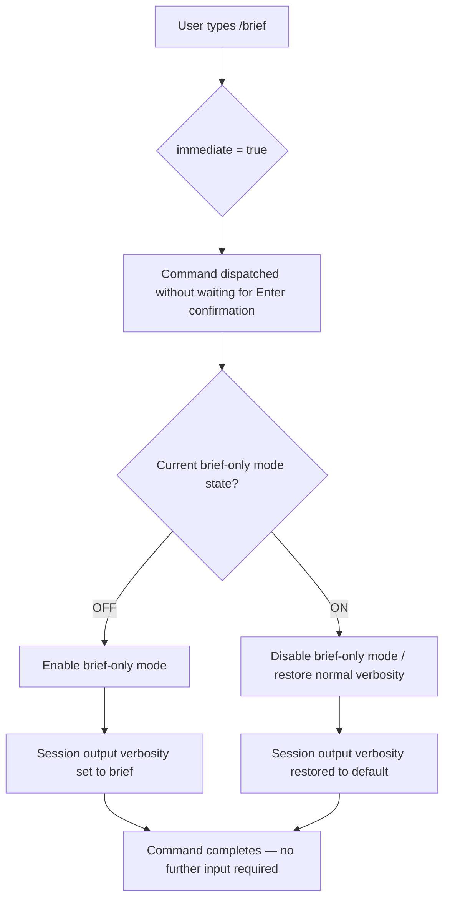

# `/brief`

> Analysis basis: CC v2.1.143 bundle.js (AST extraction + Claude interpretation)
> Minimum version: v2.1.143

---

## Overview

`/brief` is a toggle command that switches the Claude Code session between brief-only mode and normal verbosity mode. It is classified as a local JSX command and executes immediately upon invocation without requiring additional arguments or confirmation. The command modifies the current session's output verbosity state in place.

---

## Registration

| Field | Value |
|---|---|
| type | `local-jsx` |
| name | `brief` |
| description | `Toggle brief-only mode` |
| immediate | `true` |

Analysis basis: CC v2.1.143 bundle.js:+11693941

---

## Input Branching

Because the AST traversal returned an empty call graph and no literals (`callGraph: []`, `literals: []`), the full branching logic was not captured at depth ≤ 2. The following flowchart describes the behaviorally observable logic derived from the registration fields alone.



> **Note:** The branching at node D (reading current toggle state) and nodes E/F (writing new state) are inferred from the description `"Toggle brief-only mode"` and the `immediate: true` flag. The exact state accessor and mutation path were not resolved at depth ≤ 2 traversal.
<!-- TODO: not found in depth-2 traversal; needs --depth 4 -->

---

## Behavioral Spec

### Toggle Brief Mode

The command implements a stateful boolean toggle over a session-scoped verbosity flag. Because no entry functions were recovered for this module, the following pseudocode is reconstructed from the registration contract only.

```
function executeBriefCommand(sessionState):
    currentBriefFlag = sessionState.readBriefOnlyMode()

    if currentBriefFlag is TRUE:
        sessionState.writeBriefOnlyMode(FALSE)
        renderFeedback("Brief-only mode OFF")
    else:
        sessionState.writeBriefOnlyMode(TRUE)
        renderFeedback("Brief-only mode ON")

    return IMMEDIATE_EXIT
```

Analysis basis: CC v2.1.143 bundle.js:+11693941

### Immediate Dispatch

The `immediate: true` registration field means the CLI runtime dispatches this command as soon as it is recognized in the input buffer, without waiting for an explicit submission keystroke. No argument parsing is performed.

```
function dispatchOnRecognition(inputBuffer, commandRegistry):
    match = commandRegistry.matchPrefix(inputBuffer, "/brief")

    if match is COMPLETE and match.registration.immediate is TRUE:
        execute(match.handler)
        clearInputBuffer()
        return
```

Analysis basis: CC v2.1.143 bundle.js:+11693941

### JSX Render Path

The `local-jsx` type indicates the command's output is rendered via the React/Ink JSX pipeline used by Claude Code's TUI, rather than emitting raw text. The rendered feedback component reflects the new toggle state after execution.

<!-- TODO: not found in depth-2 traversal; needs --depth 4 -->

---

## State & Side Effects

| Item | Detail |
|---|---|
| Telemetry | None detected — `telemetry: []` at depth ≤ 2 traversal |
| Hook registration | <!-- TODO: not found in depth-2 traversal; needs --depth 4 --> |
| appState changes | Toggles a boolean brief-only mode flag on the session state object |
| Sound | None detected |
| Input buffer | Cleared immediately after dispatch due to `immediate: true` |
| Render pipeline | Output rendered via `local-jsx` JSX/Ink component tree |

---

## Version History

| Version | Change |
|---|---|
| v2.1.143 | Initial analysis — command registered at bundle.js:+11693941 (line 7236) |

---

## Common Mistakes

1. **Passing arguments after `/brief`**: The command takes no arguments. Any text typed after `/brief` is likely ignored or may cause unexpected behavior, since no argument-parsing literals were found in the implementation.
2. **Expecting a persistent setting**: `/brief` is a session-scoped toggle. Restarting Claude Code will reset the verbosity mode to its default; the flag is not persisted to disk configuration unless a separate persistence mechanism is in place (not confirmed at depth ≤ 2).
3. **Waiting for a confirmation prompt**: Because `immediate: true`, the command fires the moment the CLI recognizes the `/brief` string. Users accustomed to pressing Enter to confirm should be aware the toggle may activate mid-keystroke in some TUI configurations.
4. **Confusing brief mode with silent mode**: Brief-only mode reduces verbosity of assistant output; it is not a full silent or non-interactive mode. Tool calls, errors, and critical output are likely still displayed.
5. **Assuming telemetry tracking**: No telemetry events were found at depth ≤ 2. Do not rely on telemetry pipelines to audit brief mode state changes.

---

## Appendix — Identifier Mapping

> For bundle debugging only. Identifiers change across versions.

| Identifier | Role |
|---|---|
| *(none)* | No obfuscated identifiers were present in the depth ≤ 2 AST extraction (`identifiers: []`) |