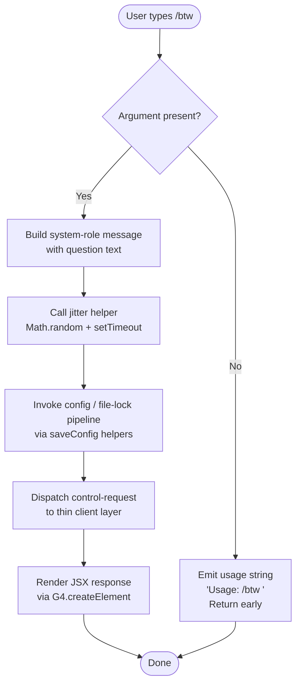

```
---
type: feature-spec
feature: "btw"
cc_version: "2.1.154"
updated: "2026-06-02"
tags: ["btw", "commands", "slash-commands"]
source: "bundle-analysis"
bundle_verified: true
analysis_basis: "CC v2.1.154 bundle.js (AST extraction + Claude interpretation)"
author: "ryujaeuk <ryujaeuk@gmail.com>"
repository: "https://github.com/MyLittleLuckyDog/cc-gnothi"
license: "AGPL-3.0-only"
---

# `/btw`

> Analysis basis: CC v2.1.154 bundle.js (AST extraction + Claude interpretation)
> Minimum version: v2.1.154

---

## Overview

`/btw` ("by the way") lets the user inject a quick side question into Claude Code without replacing or discarding the current conversation context. The command dispatches the question immediately as a `control-request` to the thin-client layer, where it is rendered as a `system`-role message before being forwarded to the agent. Because `immediate: true` is set, no confirmation step is required — the question is sent as soon as the user submits it.

---

## Registration

| Field | Value |
|---|---|
| type | `local-jsx` |
| name | `btw` |
| description | Ask a quick side question without interrupting the main conversation |
| argumentHint | `<question>` |
| immediate | `true` |
| thinClientDispatch | `control-request` |
| module_id | `dE1` |
| load_inline | `true` |
| loc_byte | `10703956` |
| loc_byte_end | `10704195` |
| loc_line | `7589` |
| arbor_handler.name | `DlL` |
| arbor_handler.fqn | `claude-2.1.154::DlL` |
| arbor_handler.kind | `AsyncFunction` |
| arbor_handler.resolution_path | `module_id` |
| arbor_handler.n_hits | `0` |

Analysis basis: CC v2.1.154 bundle.js:+10703956

---

## Input Branching

The handler has two distinct branches based on argument presence, making a flowchart the clearest representation.



Analysis basis: CC v2.1.154 bundle.js:+10703551 (usage literal), +10703592 (system role), +10703661 (JSX render)

---

## Behavioral Spec

### 1. Argument validation

When the user invokes `/btw` without any trailing text the handler immediately returns a usage hint string — `"Usage: /btw <your question>"` — and performs no further work.

```
async function btwHandler(args, context):
    question = args.trim()
    if question is empty:
        return usageString  // "Usage: /btw <your question>"
    proceed to buildMessage(question, context)
```

Analysis basis: CC v2.1.154 bundle.js:+10703553

### 2. Message construction

The question text is wrapped in a `system`-role message object before dispatch. This keeps the side question out of the primary assistant-turn history and signals to the agent layer that the content is meta-level rather than a first-class user turn.

```
function buildMessage(question, context):
    return {
        role: "system",
        content: question
    }
```

Analysis basis: CC v2.1.154 bundle.js:+10703592

### 3. Jitter delay

Before writing any state, a small random delay is applied via the `jitterDelay` helper (bundle identifier `H`). The helper draws a uniform random number, multiplies it by a small constant, and calls `setTimeout`. The constants `1` and `2` appear at the call site, suggesting the jitter window is in the range [1 × base, 2 × base] milliseconds.

```
async function jitterDelay(minFactor, maxFactor):
    factor = minFactor + Math.random() * (maxFactor - minFactor)
    await setTimeout(factor * BASE_MS)
```

Analysis basis: CC v2.1.154 bundle.js:+13408198, +13408200, +13408237

### 4. Config / file-lock pipeline (saveConfig)

The dispatch path calls the `saveConfigWithLock` helper (bundle identifier `O8`) which in turn coordinates a file-backed advisory lock mechanism (bundle identifier `hz_`). Key behaviours within this pipeline:

- **Lock directory creation** — `mkdirSync` is called to ensure the lock directory exists before attempting to write (`L.mkdirSync`, bundle.js:+3207941).
- **Stale-lock detection** — if `statSync` succeeds on the lock file but its age exceeds a threshold, the lock is considered stale and a `tengu_config_lock_contention` event is emitted (bundle.js:+3208214). A warning literal `"Lock acquisition took longer than expected - another Claude instance may be running"` is logged at level `"error"` (bundle.js:+3208125).
- **Re-read before write** — prior to persisting, the saved config is re-read and compared to the in-memory cache. If authentication data that exists in the cache is absent from the re-read result, the write is aborted and `tengu_config_auth_loss_prevented` is emitted (bundle.js:+3208693). This implements the guard described in GH #3117.
- **Backup rotation** — up to `5` backup copies are maintained (bundle.js:+3209144) in a sub-directory named `"backups"` (bundle.js:+3209726). Files are rotated using `copyFileSync` and `unlinkSync`.
- **Stale write guard** — if the on-disk config diverges from what was loaded at session start, a `tengu_config_stale_write` event is emitted and the write is skipped (bundle.js:+3208350).
- **Config parse error** — if reading the config file yields invalid JSON, `tengu_config_parse_error` is emitted (bundle.js:+3210789).
- **Lock timeout** — the lock wait loop runs with a 60 000 ms ceiling (bundle.js:+3208895).

```
async function saveConfigWithLock(newConfig):
    await acquireFileLock(lockPath):
        if lockExists and lockAge > threshold:
            emit("tengu_config_lock_contention")
            log("error", LOCK_CONTENTION_MSG)
        mkdir(lockDir)
        waitLoop(timeout=60000ms):
            try acquire
    reRead = readConfigFromDisk()
    if cacheHasAuth and reReadMissingAuth:
        emit("tengu_config_auth_loss_prevented")
        throw Error(AUTH_LOSS_MSG)
    if diskConfigStaleDiverged:
        emit("tengu_config_stale_write")
        return
    rotateBackups(maxKeep=5)
    atomicWrite(newConfig)
    releaseLock()
```

Analysis basis: CC v2.1.154 bundle.js:+3205150, +3208125, +3208214, +3208350, +3208503, +3208693, +3208895, +3209118, +3209144

### 5. Background session / thin-client dispatch

After config state is settled, the handler dispatches the control message to the thin-client layer using the `thinClientDispatch: "control-request"` channel. Within the background dispatch helper (bundle identifier `w`) several safety checks run:

- **SIGKILL escalation** — if a background process does not stop within 30 s the helper sends `SIGKILL` after a 15 s grace period and emits `tengu_bg_dispatch_sigkill_escalate` (bundle.js:+15478559, +15478570, +15478604, +15478652).
- **Low-memory guard** — free memory is sampled via `os.freemem()`. If below 1 024 × threshold MiB, `tengu_bg_dispatch_low_mem` is emitted and the operation may be deferred (bundle.js:+15479013, +15479077, +15479183).
- **Spare session management** — events `tengu_bg_spare_enable`, `tengu_bg_spare_claim`, and `tengu_bg_spare_claim_fail` track pre-warmed spare session lifecycle (bundle.js:+15479878, +15479999, +15480262).

```
async function dispatchControlRequest(message):
    checkMemory():
        if freeMem < LOW_MEM_THRESHOLD:
            emit("tengu_bg_dispatch_low_mem")
    spareSession = tryClaimSpare():
        emit("tengu_bg_spare_claim") on success
        emit("tengu_bg_spare_claim_fail") on failure
    session = spareSession ?? spawnNewSession()
    session.send(message, role="system")
```

Analysis basis: CC v2.1.154 bundle.js:+15478559, +15479029, +15479077, +15479878, +15479999, +15480262

### 6. JSX rendering

The final user-visible response is rendered through React (bundle identifier `G4.createElement`) confirming the side question was dispatched. The handler is an `AsyncFunction`, so the returned JSX element is resolved from the resulting Promise.

```
async function btwHandlerMain(args, context):
    ...
    return G4.createElement(ResponseComponent, { question, status })
```

Analysis basis: CC v2.1.154 bundle.js:+10703661

---

## State & Side Effects

| Item | Detail |
|---|---|
| Telemetry | `tengu_config_lock_contention` (bundle.js:+3208214); `tengu_config_stale_write` (bundle.js:+3208350); `tengu_config_parse_error` (bundle.js:+3210789); `tengu_bg_dispatch_sigkill_escalate` (bundle.js:+15478604); `tengu_bg_dispatch_low_mem` (bundle.js:+15479183); `tengu_bg_spare_enable` (bundle.js:+15479878); `tengu_bg_spare_claim` (bundle.js:+15479999); `tengu_bg_spare_claim_fail` (bundle.js:+15480262); `tengu_config_auth_loss_prevented` (bundle.js:+3208693) |
| Thin-client dispatch | Sends a `control-request` message; does NOT replace the ongoing conversation turn |
| Config file writes | May write/update `~/.claude.json` via atomic rename + fsync pipeline |
| Backup files | Rotates config backups in a `backups/` sub-directory; retains up to 5 copies (bundle.js:+3209144) |
| File locking | Advisory lock via `mkdirSync` / `statSync`; 60 000 ms timeout (bundle.js:+3208895) |
| Background process | May spawn or claim a spare background session via `CF.spawn` (bundle.js:+15480321) |
| Sound | <!-- TODO: not found in depth-2 traversal; needs --depth 4 --> |
| appState changes | <!-- TODO: not found in depth-2 traversal; needs --depth 4 --> |

---

## Version History

| Version | Change |
|---|---|
| v2.1.154 | Initial analysis |

---

## Common Mistakes

1. **Invoking `/btw` without an argument** — the command will respond with the usage hint `"Usage: /btw <your question>"` and do nothing else. Always include the question text directly after `/btw`.
2. **Expecting the side question to become a user turn** — because `thinClientDispatch` is `"control-request"` and the message role is `"system"`, the question is injected as a control signal, not as a visible user message in the conversation transcript.
3. **Assuming instantaneous dispatch** — the `immediate: true` flag bypasses the confirmation dialog, but the handler still applies a jitter delay and may wait up to 60 s to acquire the config file lock if another Claude instance is running concurrently.
4. **Conflating `/btw` with a new conversation** — `/btw` is explicitly designed *not* to interrupt the main conversation; it does not reset context, turn history, or session state.
5. **Ignoring lock-contention warnings** — if the log line `"Lock acquisition took longer than expected"` appears, a second Claude Code instance may be writing config simultaneously; running two instances against the same config directory is unsupported.

---

## Appendix — Identifier Mapping

> For bundle debugging only. Identifiers change across versions.

| Identifier | Role |
|---|---|
| `DlL` | Main `/btw` command handler (AsyncFunction; arbor_handler) |
| `H` | Jitter delay helper (Math.random + setTimeout) |
| `O8` | Save-config-with-lock orchestrator |
| `hz_` | File-lock acquisition and config-write pipeline |
| `_` | Filesystem utility (readdirStringSync, statSync shim) |
| `B6` | Path / filesystem base utility |
| `L` | Filesystem wrapper (mkdirSync, statSync, readdirStringSync, copyFileSync, unlinkSync) |
| `q` | Secondary filesystem wrapper (readFileSync, statSync, mkdirSync, readdirStringSync, copyFileSync, unlinkSync, renameSync, readlinkSync, lstatSync) |
| `f` | File-handle / finally cleanup helper |
| `o$q` | Config object builder / assign helper |
| `k1_` | Config key resolver |
| `N` | Message / conversation context builder |
| `URK` | Message formatting utility |
| `RH` | JSON serialisation helper (JSON.stringify wrapper) |
| `v4` | String / UUID manipulation utility |
| `HuH` | Header or metadata builder |
| `gRK` | File-write atomic helper (Buffer.byteLength, mkdirSync, rename pipeline) |
| `c` | Generic continuation / callback helper |
| `J8` | Error / exception builder |
| `bzH` | Config file reader and backup-rotation handler |
| `m6` | Safe JSON.parse wrapper |
| `kb` | String prefix-strip utility (startsWith / slice) |
| `UBq` | Backup directory entry lister |
| `Sz_` | Backup path composer (fD.join) |
| `w` | Background-session / process dispatch manager |
| `uz6` | Auth-loss guard / stale-write sentinel |
| `A` | Case-normalisation helper (toLowerCase) |
| `V` | Versioned-path / prefix filter helper (startsWith) |
| `P` | MCP / SDK transport manager (Promise.all, spawn) |
| `Vb8` | Transport type detector |
| `hH` | MCP hook / error logger |
| `F_` | Error wrapper (Error + String coercion) |
| `E` | Slice / window helper |
| `$L6` | Atomic file-write with symlink resolution and random-byte temp name |
| `O` | Symbolic-link / stat helper (isSymbolicLink) |
| `P8` | Error-code inspector |
| `jQH` | Session-ID or metadata tag helper |
| `pBq` | Object-entries iterator helper |
| `JQH` | Timestamp helper (Date.now wrapper) |
| `yz_` | Config path resolver ($L6 + dirname + B6) |
```