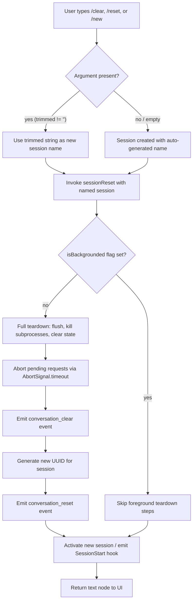

# `/clear`

> Analysis basis: CC v2.1.150 bundle.js (AST extraction + Claude interpretation)
> Minimum version: v2.1.150

---

## Overview

The `/clear` command terminates the current conversation session and starts a fresh one with an empty context window. The previous session is serialized to disk and remains fully resumable via `/resume`. Internally, the command triggers a complete session teardown sequence — flushing pending I/O, killing any background subprocesses, resetting application state — before constructing and activating a new session identified by a fresh UUID.

---

## Registration

| Field | Value |
|---|---|
| type | `local` |
| name | `clear` |
| description | `Start a new session with empty context; previous session stays on disk (resumable with /resume)` |
| argumentHint | `[name]` |
| aliases | `reset`, `new` |
| supportsNonInteractive | `true` |
| thinClientDispatch | `post-text` |
| module_id | `d21` |

Analysis basis: CC v2.1.150 bundle.js:+10665211

---

## Input Branching

The entry point (function `commandHandler`) trims the raw argument string before passing it downstream. A zero-length argument after trimming is treated as "no name provided".



Analysis basis: CC v2.1.150 bundle.js:+10665037 (trim), +10665052 (zero literal), +10663421 (isBackgrounded key), +10663353 (conversation_clear), +10664436 (conversation_reset), +10664475 (randomUUID)

---

## Behavioral Spec

### 1. Command Entry and Argument Parsing

```
function commandHandler(rawArgs, appContext):
    trimmedName = rawArgs.trim()          // strips leading/trailing whitespace
    if trimmedName == "":
        sessionName = null
    else:
        sessionName = trimmedName
    return sessionReset(sessionName, appContext)
```

Analysis basis: CC v2.1.150 bundle.js:+10665037

---

### 2. Session Reset Orchestrator

The core reset function (`sessionReset`) coordinates the full teardown-and-reinitialize sequence.

```
async function sessionReset(sessionName, appContext):
    // Step 1: compute context window position (parseInt, base-10, clamped)
    tokenCount = parseContextSize(appContext.contextSizeHint)

    // Step 2: emit SessionEnd lifecycle event to hook system
    emitSessionEndEvent()

    // Step 3: create AbortSignal with timeout for pending operations
    signal = AbortSignal.timeout(timeoutMs)

    // Step 4: emit tengu_cache_eviction_hint telemetry
    emitTelemetry("tengu_cache_eviction_hint", { event: "conversation_clear" })

    // Step 5: check isBackgrounded flag in appState
    backgrounded = appState.get("isBackgrounded")

    // Step 6: iterate Object.values of active tool handlers; enqueue each for shutdown
    for handler of Object.values(activeToolHandlers):
        enqueueForShutdown(handler)    // calls pendingOpsTracker

    // Step 7: kill or retire active subprocess pool entries
    shutdownSubprocessPool()

    // Step 8: add new session record to session registry
    sessionRegistry.add(newSessionRecord)

    // Step 9: push teardown record
    teardownLog.push(teardownRecord)

    // Step 10: clear the internal state map
    internalStateMap.clear()

    // Step 11: iterate Object.keys of stateCache; for each running entry, stop it
    for key of Object.keys(stateCache):
        if stateCache[key].status == "running":
            stop(stateCache[key])

    // Step 12: iterate Object.entries of timerMap; clearTimeout each
    for [id, timer] of Object.entries(timerMap):
        clearTimeout(timer)

    // Step 13: flush the log writer, delete cached log entry
    flushAndEvictLog()

    // Step 14: resolve working directory (absolute path)
    workDir = resolveWorkingDirectory(appContext.cwd)

    // Step 15: generate new session UUID
    newSessionId = crypto.randomUUID()

    // Step 16: emit conversation_reset event with new session ID
    emitEvent("conversation_reset", { sessionId: newSessionId })

    // Step 17: initialize new session context (model, tokens, config)
    newSession = buildSessionContext(newSessionId, sessionName, tokenCount)

    // Step 18: update symlink pointing "latest" -> new session directory
    updateLatestSymlink(newSession)

    // Step 19: emit SessionStart hook event
    emitHook("SessionStart", newSession)

    // Step 20: initialize shell working directory
    setShellCwd(workDir)

    // Step 21: return text node for UI display
    return { type: "text", content: sessionSummaryText(newSession) }
```

Analysis basis: CC v2.1.150 bundle.js:+10663214 (sessionReset body), +10663274 (AbortSignal.timeout), +10663318 (tengu_cache_eviction_hint), +10663353 (conversation_clear), +10663421 (isBackgrounded), +10663484 (Object.values), +10663513 (subprocess pool), +10663536 (session registry), +10663553 (teardown log), +10663634 (internalStateMap.clear), +10663659 (Object.keys), +10663773 (Object.entries), +10663934 (clearTimeout), +10664035 (flushAndEvictLog), +10664475 (randomUUID), +10664436 (conversation_reset), +10665139 (text type literal)

---

### 3. Context Size Parser

```
function parseContextSize(hint):
    parsed   = parseInt(hint, 10)          // radix 10
    if not Number.isFinite(parsed):
        return defaultContextSize          // falls back via rY / Hm helpers
    clamped  = Math.max(minTokens, Math.min(maxTokens, parsed * 1000))
    return clamped
```

Multiplier constant: **1000** (bundle.js:+12880389); radix: **10** (bundle.js:+12880213).

Analysis basis: CC v2.1.150 bundle.js:+12880202 (parseInt), +12880224 (Number.isFinite), +12880389 (1000 multiplier), +12880420 (Math.max), +12880433 (Math.min)

---

### 4. SessionEnd Hook Emission

Before any state mutation the command emits a `"SessionEnd"` lifecycle event so registered hook plugins receive a graceful notification.

```
function emitSessionEndEvent():
    hookPayload = buildPayload("SessionEnd")
    broadcastToHooks(hookPayload)
    sessionRegistry.get(currentSessionId).stop()
    sessionRegistry.delete(currentSessionId)
```

Literal `"SessionEnd"` confirmed at bundle.js:+12870874.

Analysis basis: CC v2.1.150 bundle.js:+12870847 (b7 helper), +12870905 (YW helper), +12871102 (S6), +12871107 (OkH)

---

### 5. Subprocess Pool Shutdown

```
function shutdownSubprocessPool():
    for entry of processMap.values():
        entry.retireIfSettled()         // graceful retire attempt

    // if process does not exit within grace period, escalate
    if not exitedWithin(graceSeconds=30):
        if still alive after seconds=15:
            process.kill("SIGKILL")     // hard kill
            emitTelemetry("tengu_bg_dispatch_sigkill_escalate")
            setTimeout(100)             // brief delay post-kill

    // low memory guard
    freeBytes = os.freemem()
    if freeBytes < threshold:
        emitTelemetry("tengu_bg_dispatch_low_mem")
```

Grace period: **30 s** (bundle.js:+15260826); escalation threshold: **15 s** (bundle.js:+15260837); SIGKILL literal (bundle.js:+15260919); post-kill delay: **100 ms** (bundle.js:+15260943).

Analysis basis: CC v2.1.150 bundle.js:+15261571 (A.values / processMap), +15261582 (retireIfSettled), +15260912 (C.kill), +15260930 (setTimeout), +15261280 (mqA.freemem)

---

### 6. Log Flush and Cache Eviction

```
function flushAndEvictLog():
    logWriter = logWriterFactory()          // nv8
    cachedEntry = logCache.get(sessionKey)
    if cachedEntry exists:
        logWriter.flush(cachedEntry)
    logCache.delete(sessionKey)
```

Analysis basis: CC v2.1.150 bundle.js:+12837860 (nv8), +12837881 (cv8.get), +12837903 (_.flush), +12837913 (cv8.delete)

---

### 7. Working Directory Resolution

```
function resolveWorkingDirectory(cwdInput):
    if not path.isAbsolute(cwdInput):
        cwdInput = path.resolve(cwdInput)
    validated = validateDirectory(cwdInput)    // Q6 helper
    if not validated:
        throw Error("invalid cwd")
    setShellCwd(validated)
    emitTelemetry("tengu_shell_set_cwd")
    return validated
```

Analysis basis: CC v2.1.150 bundle.js:+8007153 (UY8.isAbsolute), +8007173 (UY8.resolve), +8007188 (Q6), +8007255 (Error), +8007308 (tengu_shell_set_cwd)

---

### 8. New Session Initialization

```
function buildSessionContext(sessionId, sessionName, tokenCount):
    session = {
        id:        sessionId,             // crypto.randomUUID()
        name:      sessionName ?? autoName(),
        tokenBudget: tokenCount,
    }
    emitEvent("conversation_reset", session)
    return session
```

Analysis basis: CC v2.1.150 bundle.js:+10664475 (F21.randomUUID), +10664493 (QS8 / ay6.emit), +10664436 (conversation_reset)

---

### 9. Spare Background Session Management

After the new foreground session is established the daemon may opportunistically pre-spawn a spare background session.

```
function manageSpareSession():
    if spareEnabled:
        emitTelemetry("tengu_bg_spare_enable")
        try:
            claim = claimSpare()
            if claim succeeded:
                emitTelemetry("tengu_bg_spare_claim")
                activateSpare(claim)
                storeInProcessMap(claim)       // A.set
                recordTimestamp(Date.now())
            else:
                emitTelemetry("tengu_bg_spare_claim_fail")
        catch:
            pass
    if shouldSpawn:
        emitTelemetry("tengu_bg_spare_spawn")
        child = childProcess.spawn(...)
        child.dispose on cleanup
```

Analysis basis: CC v2.1.150 bundle.js:+15262145 (tengu_bg_spare_enable), +15262266 (tengu_bg_spare_claim), +15262529 (tengu_bg_spare_claim_fail), +15260564 (tengu_bg_spare_spawn), +15262228 (A.set), +15262297 (Date.now), +15262588 (bB.spawn)

---

### 10. Session Rename Side-Effect

When a non-empty name argument is provided the session rename path executes:

```
function applySessionName(session, name):
    session.customTitle = name             // "custom-title" key
    session.role = "user"
    broadcastStateUpdate(session)
    emitEvent("AN6", "session_renamed")
    emitTelemetry("tengu_session_renamed")
```

Literal `"custom-title"` (bundle.js:+12783269); literal `"user"` (bundle.js:+12783231).

Analysis basis: CC v2.1.150 bundle.js:+12783248 (BV), +12783257 (w5H), +12783316 (S6), +12783348 (AN6.emit), +12783361 (tengu_session_renamed)

---

### 11. Plugin Hook Loading (SessionStart)

```
function loadAndFireSessionStartHooks(session):
    if allowManagedHooksOnly and no managed plugins:
        log("Skipping plugin hooks - allowManagedHooksOnly is enabled and no managed plugins")
        return

    hooks = loadPluginHooks()             // emits tengu: "load_plugin_hooks"
    for hook of hooks:
        try:
            cloneOrFetch(hook)
            hook.run("SessionStart", session)
        catch NetworkError (ETIMEDOUT, ENOTFOUND):
            reportError("network", "Check your internet connection...")
        catch PermissionError (EACCES, EPERM):
            reportError("permission", "Check file permissions on ~/.claude/plugins/")
        catch ConfigError (Invalid/parse/JSON/schema):
            reportError("config", "Check your plugin settings in .claude/settings.json")
```

Literal `"SessionStart"` (bundle.js:+8648694); literal `"load_plugin_hooks"` (bundle.js:+8647438); literal `"hook_additional_context"` (bundle.js:+8648649).

Analysis basis: CC v2.1.150 bundle.js:+8647279 (K4), +8647315 (rY), +8647321 (KEH), +8647334 (N / skip message), +8647438 (load_plugin_hooks), +8647531 (z.includes), +8647596 (ETIMEDOUT), +8647621 (ENOTFOUND), +8647772 (EACCES), +8647794 (EPERM)

---

### 12. Daemon Config Reload

On the supervisor side, after the session list changes, daemon configuration is reloaded:

```
function supervisorConfigReload():
    supervisor.stop()
    supervisor.updateConfig(newConfig)
    supervisor.start()
    emitTelemetry("tengu_daemon_config_reload")
```

Analysis basis: CC v2.1.150 bundle.js:+15275132 (G.stop), +15275261 (Z.updateConfig), +15275279 (Z.start), +15275657 (tengu_daemon_config_reload)

---

## State & Side Effects

| Item | Detail |
|---|---|
| **Telemetry: tengu_cache_eviction_hint** | Fired immediately on invocation with `event: "conversation_clear"` (bundle.js:+10663318) |
| **Telemetry: tengu_bg_dispatch_sigkill_escalate** | Fired when a background process does not exit within 30 s grace and must be hard-killed (bundle.js:+15260871) |
| **Telemetry: tengu_bg_dispatch_low_mem** | Fired when `os.freemem()` falls below threshold during subprocess teardown (bundle.js:+15261450) |
| **Telemetry: tengu_bg_spare_enable** | Fired when the spare-session pre-spawn feature is active (bundle.js:+15262145) |
| **Telemetry: tengu_bg_spare_claim** | Fired when a spare session is successfully claimed for the new session slot (bundle.js:+15262266) |
| **Telemetry: tengu_bg_spare_claim_fail** | Fired when spare claim fails (bundle.js:+15262529) |
| **Telemetry: tengu_bg_spare_spawn** | Fired when a new spare background session process is spawned (bundle.js:+15260564) |
| **Telemetry: tengu_daemon_config_reload** | Fired after supervisor config is updated post-session-change (bundle.js:+15275657) |
| **Telemetry: tengu_shell_set_cwd** | Fired after working directory is resolved and set (bundle.js:+8007308) |
| **Telemetry: tengu_session_renamed** | Fired when a non-empty `[name]` argument was supplied (bundle.js:+12783361) |
| **Hook: SessionEnd** | Broadcast to all registered plugins before teardown begins (bundle.js:+12870874) |
| **Hook: SessionStart** | Broadcast to all registered plugins after new session is fully initialized (bundle.js:+8648694) |
| **appState changes** | `isBackgrounded` key read (bundle.js:+10663421); `internalStateMap` cleared (bundle.js:+10663634); session UUID regenerated (bundle.js:+10664475); `conversation_reset` event emitted (bundle.js:+10664436) |
| **Disk** | Previous session written/retained on disk; new session directory created; `latest` symlink updated via `fs.symlink` / `fs.unlink` (bundle.js:+12838665, +12838724) |
| **Subprocess pool** | All active background subprocesses retired or SIGKILL-escalated; spare session may be pre-spawned via `childProcess.spawn` (bundle.js:+15262588) |
| **Log writer** | Pending log buffer flushed and evicted from cache before session drop (bundle.js:+12837903) |
| **Timers** | All active `setTimeout` handles cancelled via `clearTimeout` (bundle.js:+10663934) |
| **Sound** | <!-- TODO: not found in depth-2 traversal; needs --depth 4 --> |

---

## Version History

| Version | Change |
|---|---|
| v2.1.150 | Initial analysis |

---

## Common Mistakes

1. **Expecting context to survive `/clear`** — The entire in-memory conversation context is discarded. Use `/resume` to return to a prior session; the on-disk record is preserved.
2. **Confusing `/clear` with `/reset` or `/new`** — These are registered aliases for the exact same command handler; there is no behavioral difference between them (bundle.js:+10665211).
3. **Passing an argument expecting it to set a permanent project name** — The `[name]` argument sets only the `custom-title` of the *new* session; it does not affect the previous session or any global project setting.
4. **Assuming `/clear` in non-interactive mode is identical to interactive** — `supportsNonInteractive: true` means the command runs headlessly, but the `thinClientDispatch: "post-text"` value indicates the result is delivered as a text node rather than updating an interactive UI; callers should handle the text response accordingly (bundle.js:+10665211, +10665139).
5. **Expecting background processes to terminate instantly** — The shutdown sequence allows a **30-second** grace window before escalating to SIGKILL with a further **15-second** wait, meaning the full teardown can take up to ~45 seconds in the worst case (bundle.js:+15260826, +15260837).
6. **Assuming a spare session is always available immediately** — The spare pre-spawn is opportunistic; if `tengu_bg_spare_claim_fail` fires, the new session is created without a warm spare and may have a higher initialization latency.

---

## Appendix — Identifier Mapping

> For bundle debugging only. Identifiers change across versions.

| Identifier | Role |
|---|---|
| `RuL` | Command handler entry point (argument trim + dispatch) |
| `H` | Random delay / setTimeout utility (used in spare session timing) |
| `oE6` | Session reset orchestrator (main teardown + reinitialize body) |
| `sE6` | Context size parser (parseInt / clamp to token range) |
| `YhH` | SessionEnd event emitter / hook broadcaster |
| `t_6` | AbortSignal timeout wrapper |
| `c` | Generic error/log sink (shared utility) |
| `L` | Pending-operation tracker (q.add / M.finally / q.delete) |
| `w` | Subprocess pool manager (kill, retire, spawn spare) |
| `VX` | Session registry entry constructor |
| `Y` | Session record lifecycle manager (start/stop/updateConfig) |
| `D` | Teardown record builder / recursive teardown dispatcher |
| `rw` | State cache runner / "running" status checker |
| `bd_` | New session context builder (collects sub-feature constructors) |
| `Hw` | Working directory resolver (isAbsolute / path.resolve) |
| `j_` | Internal state store accessor (wraps Dv) |
| `_` | Internal state map object (_.clear / _.flush) |
| `VZH` | State key enumerator / Object.keys consumer |
| `M` | Connection/channel closer (A.close / q.close) |
| `xN` | Timer map iterator for clearTimeout sweep |
| `RH` | Error reporter / logError dispatcher |
| `fO` | Log flush and cache eviction function |
| `GlH` | UI notification dispatcher (mOq helper) |
| `Q21` | Session metadata writer (XMH helper) |
| `gO` | Model/config initializer for new session |
| `S6` | Shared state accessor (wraps Dv) |
| `YI` | Session activation signal emitter |
| `VM` | Path joiner / session directory path builder |
| `aE6` | Session token-budget applicator |
| `QS8` | UUID emitter (mAH.randomUUID + ay6.emit) |
| `Vc` | Conversation history initializer |
| `cy` | Session rename handler (custom-title + tengu_session_renamed) |
| `fyH` | Latest-symlink updater (symlink / unlink) |
| `kE` | Subagents directory path builder |
| `tM` | Tool-state reset helper |
| `yf` | Feature-flag reader for new session |
| `Yu` | Worktree-state event emitter |
| `G_H` | Isolation-latch initializer |
| `xU` | Plugin hook loader (SessionStart, load_plugin_hooks) |