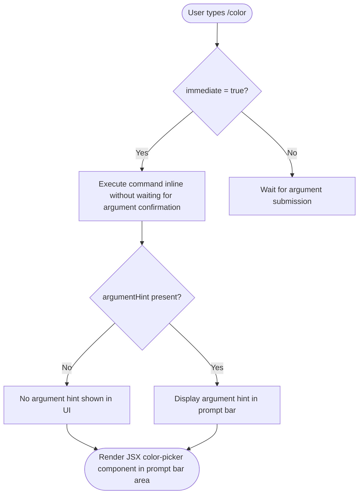

```
---
type: feature-spec
feature: "color"
cc_version: 2.1.154
updated: "2026-05-19"
tags: ["color", "commands", "slash-commands"]
source: "bundle-analysis"
bundle_verified: true
inherited_from: 2.1.144
analysis_basis: "CC v2.1.144 bundle.js (AST extraction + Claude interpretation)"
author: "ryujaeuk <ryujaeuk@gmail.com>"
repository: "https://github.com/MyLittleLuckyDog/cc-gnothi"
license: "AGPL-3.0-only"
---

# `/color`

> Analysis basis: CC v2.1.144 bundle.js (AST extraction + Claude interpretation)
> Minimum version: v2.1.144

---

## Overview

The `/color` command allows the user to set the prompt bar color for the current Claude Code session. It is registered as a local JSX command and executes immediately upon invocation, without requiring additional argument parsing steps. Its effect is scoped to the active session and does not persist across sessions unless additional state persistence mechanisms are present.

## Registration

| Field | Value |
|---|---|
| type | `local-jsx` |
| name | `color` |
| description | Set the prompt bar color for this session |
| argumentHint | `null` |
| immediate | `true` |
| module_id | `OLq` |

Analysis basis: CC v2.1.144 bundle.js:+10125555

## Input Branching

The AST depth-2 traversal returned an empty call graph and no string/number literals for module `OLq`. The branching logic below is therefore inferred solely from registration metadata.



Analysis basis: CC v2.1.144 bundle.js:+10125555

<!-- TODO: detailed branching inside the JSX render function and color-selection logic not found in depth-2 traversal; needs --depth 4 -->

## Behavioral Spec

### Command Dispatch

Because `immediate` is `true`, the CLI dispatches this command as soon as `/color` is matched, without prompting the user to confirm or enter additional text.

```
function dispatchColorCommand(userInput):
    if userInput matches "/color":
        if command.immediate is true:
            invoke renderColorPickerComponent()
        else:
            waitForArgument()
```

Analysis basis: CC v2.1.144 bundle.js:+10125555

### JSX Render

The command is typed `local-jsx`, meaning its output is rendered as a React/JSX component directly inside the Claude Code terminal UI rather than producing plain text output.

```
function renderColorPickerComponent():
    mount JSX component into prompt bar region
    allow user to select or input a color value
    on selection confirmed:
        applyPromptBarColor(selectedColor)
    on cancellation:
        restore previous prompt bar color
```

<!-- TODO: exact JSX component tree, color format accepted (hex / named / HSL), and validation logic not found in depth-2 traversal; needs --depth 4 -->

### Color Application

```
function applyPromptBarColor(colorValue):
    validate colorValue format
    if valid:
        update session-scoped prompt bar color state
        re-render prompt bar with new color
    else:
        display error or ignore input
```

<!-- TODO: validation rules, accepted color formats, error message strings, and session-state key name not found in depth-2 traversal; needs --depth 4 -->

## State & Side Effects

| Item | Detail |
|---|---|
| Telemetry | None detected in depth-2 traversal (`telemetry: []`) |
| Hook registration | <!-- TODO: not found in depth-2 traversal; needs --depth 4 --> |
| appState changes | Prompt bar color is updated for the current session (inferred from description); exact state key not identified |
| Sound | <!-- TODO: not found in depth-2 traversal; needs --depth 4 --> |
| Persistence | Session-scoped only per description; cross-session persistence not confirmed |

Analysis basis: CC v2.1.144 bundle.js:+10125555

## Version History

| Version | Change |
|---|---|
| v2.1.144 | Initial analysis |

## Common Mistakes

1. **Expecting a persistent color change**: The command description says "for this session," so the chosen color likely resets when the session ends. Do not rely on `/color` for a permanent theme change.
2. **Providing a color argument inline**: Because `argumentHint` is `null`, the command does not advertise an inline argument. Attempting `/color #ff0000` directly may not work as expected if the JSX component handles input interactively instead.
3. **Confusing scope**: `/color` only affects the prompt bar color, not the entire terminal theme or other UI elements.
4. **Assuming telemetry-free behavior permanently**: No telemetry events were found at traversal depth 2, but deeper call chains in module `OLq` were not reachable. Telemetry may exist at greater depth.

## Appendix — Identifier Mapping

> For bundle debugging only. Identifiers change across versions.

| Identifier | Role |
|---|---|
| OLq | Module containing the `/color` command registration and JSX implementation |

> Note: The `identifiers` array returned by the AST extractor was empty for this command. `OLq` is the `module_id` from the registration object and is included here as the sole obfuscated identifier surfaced by the extraction. All other internal identifiers were not reachable within the depth-2 traversal limit.
```