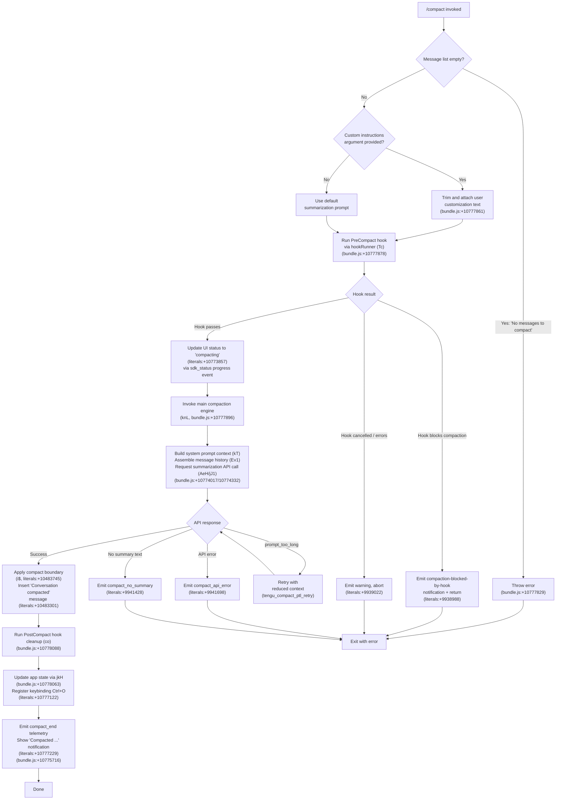

# `/compact`

> Analysis basis: CC v2.1.154 bundle.js (AST extraction + Claude interpretation)
> Minimum version: v2.1.154

---

## Overview

`/compact` frees up context window space by summarizing the current conversation into a compact representation, replacing the full message history with a condensed summary. The command optionally accepts custom summarization instructions as an argument, allowing the user to guide what content the summary should emphasize. It supports both interactive (REPL) and non-interactive invocations.

---

## Registration

| Field | Value |
|---|---|
| type | `local` |
| name | `compact` |
| description | `Free up context by summarizing the conversation so far` |
| argumentHint | `<optional custom summarization instructions>` |
| supportsNonInteractive | `true` |
| thinClientDispatch | `post-text` |
| module_id | `Vv1` |
| load_inline | `true` |
| loc_byte | `10778767` |
| loc_byte_end | `10779080` |
| **arbor_handler.name** | `NnL` |
| **arbor_handler.fqn** | `claude-2.1.154::NnL` |
| **arbor_handler.kind** | `AsyncFunction` |
| **arbor_handler.resolution_path** | `module_id` |
| **arbor_handler.n_hits** | `0` |
| `arbor_handler.name` | `NnL` |
| `arbor_handler.kind` | `AsyncFunction` |
| `arbor_handler.resolution_path` | `module_id` |
| `arbor_handler.fqn` | `claude-2.1.154::NnL` |
| `arbor_handler.n_hits` | `0` |

Analysis basis: CC v2.1.154 bundle.js:+10778767

---

## Input Branching

The handler has 4+ distinct branches (empty conversation guard, optional custom instructions, cancellation/hook-blocked paths, and normal summary path), so a Mermaid flowchart is used.



---

## Behavioral Spec

### 1. Guard: Empty Message List

Before any summarization work begins, the handler checks whether there are any messages to compact. If the conversation is empty, it throws immediately with the message `"No messages to compact"`.

```
function compactHandler(userArg, context):
    if messageList is empty:
        throw Error("No messages to compact")
```

Analysis basis: CC v2.1.154 bundle.js:+10777823 (Error constructor call), +10777829 (literal "No messages to compact")

---

### 2. Custom Instructions Handling

If the user supplies a text argument after `/compact`, the argument is trimmed and forwarded as custom summarization guidance. This text influences what the summary agent is instructed to emphasize or preserve.

```
function handleCustomInstructions(rawArg):
    trimmed = rawArg.trim()
    if trimmed is non-empty:
        attachToSummarizationPrompt(trimmed)
```

Analysis basis: CC v2.1.154 bundle.js:+10777861 (`H.trim` call in `NnL`)

---

### 3. PreCompact Hook Execution (hookRunner)

The hook orchestrator (`Tc`) is invoked with event type `"PreCompact"` before any summarization. If the hook returns a block decision, compaction is suppressed and a `"compaction-blocked-by-hook"` notification is emitted. Cancelled or errored hooks produce a warning but do not hard-crash the command.

```
function runPreCompactHook(context):
    result = hookRunner(event="PreCompact", context)
    if result.decision == "block":
        emitNotification(type="compaction-blocked-by-hook",
                         message="compaction blocked by PreCompact hook")
        return BLOCKED
    if result.cancelled:
        emitWarning(...)
        return CANCELLED
    return ALLOWED
```

Analysis basis: CC v2.1.154 bundle.js:+10777878 (call to `Tc`); literals `"compaction-blocked-by-hook"` at +9938988, `"compaction blocked by PreCompact hook"` at +9939022.

---

### 4. Progress Status Update

When the hook permits compaction, a progress event with status `"compacting"` is emitted over the `"compact_progress"` channel so the UI can display a spinner or status indicator.

```
function emitCompactingStatus():
    emitProgress(channel="compact_progress",
                 phase="sdk_status",
                 value="compacting")
```

Analysis basis: CC v2.1.154 bundle.js (literals `"compact_progress"` at +10773741, `"sdk_status"` at +10773837, `"compacting"` at +10773857).

---

### 5. Main Compaction Engine (compactionCore / `knL`)

The core compaction function (`knL`, resolved via Arbor as a callee of `NnL`) performs the following major steps:

```
async function compactionCore(options):
    startTime = performance.now()

    // 5a. Build context snapshot
    systemPrompt  = buildSystemPrompt(kT)          // includes env, memory, instructions
    messageSlice  = buildMessageSlice(Ev1)          // full conversation up to compaction point

    // 5b. Summarization API request
    summary = await requestSummary(                 // calls jJ1 / AeH
        messages   = messageSlice,
        systemPrompt = systemPrompt,
        customInstructions = options.customInstructions
    )

    // 5c. Error cases
    if summary is null or empty:
        emit("compact_no_summary")
        throw Error("Failed to generate conversation summary...")

    // 5d. Apply compact boundary
    applyBoundary(
        boundary  = "compact_boundary",             // literal at +10483745
        summary   = summary,
        label     = "Conversation compacted"        // literal at +10483301
    )

    // 5e. Post-compact cleanup
    runPostCompactCleanup(co)
    updateAppState(jkH)

    emit("compact_end")
```

Analysis basis: CC v2.1.154 bundle.js:+10774017 (`knL→Ev1`), +10774332 (`knL→InL`), +10774469 (`knL→mN_`), +10774672 (`knL→hH`), +10775225 (`knL→co`), +10775250 (`knL→jkH`), +10775452 (`knL→Zv1`).

---

### 6. Summarization Request and Retry Logic (`jJ1` / `AeH`)

The summarization sub-component sends the assembled message slice to the API. Tool use is denied during the compaction agent turn (`"deny"` + `"Tool use is not allowed during compaction"`). On a `prompt_too_long` error, the message slice is reduced and the request is retried (tracked by `tengu_compact_ptl_retry`). On success the raw summary text is extracted; on non-recoverable API errors, `tengu_compact_api_error` is emitted and the error propagates.

```
async function requestSummary(messages, systemPrompt, customInstructions):
    attempt = 0
    while true:
        try:
            response = await apiCall(messages, systemPrompt, customInstructions,
                                     toolUsePolicy="deny")
            summaryText = extractText(response)
            if summaryText is empty:
                emit("compact_no_summary")
                throw Error("Failed to generate conversation summary...")
            return summaryText
        catch PromptTooLong:
            emit("tengu_compact_ptl_retry")
            messages = reduceMessages(messages)
        catch APIError:
            emit("tengu_compact_api_error")
            throw
```

Analysis basis: CC v2.1.154 bundle.js:+9950533 (literal "Tool use is not allowed during compaction"), +9941048 (literal `"compact_prompt_too_long"`), +9941428 (literal `"compact_no_summary"`), +9941698 (literal `"compact_api_error"`).

---

### 7. Compact Boundary Application (`i$` / boundary inserter)

After a successful summary is produced, a boundary marker of type `"compact_boundary"` is inserted into the message array. Messages before the boundary are replaced with the summary assistant message. The numeric sentinel values `1` and `0` control the slice indices used in `H.slice`.

```
function applyCompactBoundary(messages, summaryText):
    boundaryMarker = {
        type: "system",
        subtype: "compact_boundary"
    }
    compactedMessages = [
        { role: "assistant", content: summaryText },
        boundaryMarker
    ]
    replaceMessageHistory(compactedMessages)
    // Emits internal message: "Conversation compacted"
```

Analysis basis: CC v2.1.154 bundle.js:+10483745 (literal `"compact_boundary"`), +10483723 (literal `"system"`), +10483799/+10483804 (numeric literals `1`, `0` controlling slice), +10483301 (literal `"Conversation compacted"`).

---

### 8. Post-Compact Cleanup (`co`)

After the boundary is applied, a cleanup routine resets ephemeral state: in-flight request abort tokens, pending sub-agent state, the reactive-compact loop counters, cache structures, and the autonomous-loop delivery counter. The `PostCompact` hook type is then dispatched.

```
function postCompactCleanup():
    abortPendingRequests()
    clearCacheStructures()          // Hv9, sf8
    resetAutonomousLoopDelivered()  // wl7.resetAutonomousLoopDelivered
    clearReactiveSets()             // aV9, HjH
    emit("post_compact_cleanup")
    dispatchPostCompactHook()
```

Analysis basis: CC v2.1.154 bundle.js:+10778088 (`NnL→co`), +6549219 (literal `"post_compact_cleanup"`), +6549293 (`co→Hv9`), +6549325 (`co→wl7.resetAutonomousLoopDelivered`).

---

### 9. App State Update and Keybinding Registration (`jkH` / `Zv1`)

After cleanup, application state is written via a `setState` call, and the transcript-toggle keybinding `Ctrl+O` (action `"app:toggleTranscript"`, scope `"Global"`) is registered or refreshed. A summary notification showing `"Compacted …"` is displayed to the user.

```
function postCompactStateUpdate(summaryInfo):
    setState(YP6, compactMetadata)             // via jkH
    registerKeybinding(
        action = "app:toggleTranscript",
        scope  = "Global",
        keys   = "ctrl+o"
    )
    showNotification("Compacted " + summaryInfo)
```

Analysis basis: CC v2.1.154 bundle.js:+10778063 (`NnL→jkH`), +10778160 (`NnL→Zv1`); literals `"app:toggleTranscript"` at +10777090, `"Global"` at +10777113, `"ctrl+o"` at +10777122, `"Compacted "` at +10777229, `"compactMetadata"` at +10775172.

---

### 10. Failure Paths and User-Facing Error Messages

| Failure Condition | User-Facing Message | Telemetry Event |
|---|---|---|
| Conversation could not be reduced below context limit | `"Compaction failed · conversation could not be reduced below the context limit"` | `tengu_compact_failed` |
| Attached media exceeds size limits | `"Compaction failed · attached media exceeds size limits"` | `tengu_compact_failed` |
| Unknown error | `"unknown error"` | `tengu_compact_failed` |
| Compaction cancelled (e.g. user abort) | `"Compaction canceled."` | — |
| Reactive compaction failed | `"reactive compaction failed"` | `tengu_reactive_compact_failed` |

Analysis basis: CC v2.1.154 bundle.js (literals at +10774840, +10774963, +10775088, +10778368, +10775508; telemetry `tengu_compact_failed` at +9954131).

---

## State & Side Effects

| Item | Detail |
|---|---|
| Telemetry — primary | `tengu_compact` (+9943001) — main compaction event |
| Telemetry — blocked | `tengu_compact_cache_prefix` (+9940616), `tengu_compact_ptl_retry` (loc +9941088), `tengu_compact_failed` (+9954131), `tengu_compact_no_summary` (implied by literal +9941428) |
| Telemetry — success | `tengu_reactive_compact_succeeded` (+6555342), `tengu_compact_cache_sharing_success` (+9951410) |
| Telemetry — fallback | `tengu_compact_cache_sharing_fallback` (+9952040), `tengu_reactive_compact_failed` (+6552961), `tengu_reactive_compact_attempt` (+6518889) |
| Telemetry — cleanup events | `tengu_post_compact_file_restore_success` (+9954613), `tengu_post_compact_file_restore_error` (+9954655) |
| Telemetry — precomputed | `tengu_precomputed_compact_consumed` (+6532157), `tengu_precomputed_compact_discarded` (+6532776) |
| Hook registration | Fires `PreCompact` hook before summarization; fires `PostCompact` hook after boundary application |
| appState changes | `compactMetadata` written via `jkH` → `YP6.setState`; conversation message array replaced with summary + boundary |
| Keybinding | `Ctrl+O` → `app:toggleTranscript` registered/refreshed in `"Global"` scope (bundle.js:+10777090) |
| Context window | Full prior message history is replaced; only the summary and the `compact_boundary` sentinel remain before new turns |
| Sound | None detected in depth-2 traversal |
| Reactive compact side-path | A background reactive compact path (`mN_` / `gf8`) operates on the same compaction logic; it reuses `ic7` for the summarization loop and emits distinct telemetry (`tengu_reactive_compact_*`) |

---

## Version History

| Version | Change |
|---|---|
| v2.1.154 | Initial analysis |

---

## Common Mistakes

1. **Running `/compact` in an empty session**: The command throws `"No messages to compact"` immediately if there is nothing to summarize; start a conversation first.
2. **Expecting tools to execute during compaction**: Tool use is blocked with `"deny"` during the compaction agent turn — tool calls in the summary prompt will be rejected.
3. **Passing very long custom instructions**: The argument is passed directly into the summarization prompt; excessively long instructions contribute to prompt length and may trigger a `prompt_too_long` retry cycle.
4. **Interrupting a PreCompact hook**: If a registered `PreCompact` hook blocks or cancels, the compaction silently aborts with a warning notification rather than an error dialog; check hook configurations if `/compact` appears to do nothing.
5. **Assuming `/compact` clears files or tool caches**: The command only replaces the in-memory conversation history. File system state, MCP connections, and permission grants are unaffected.
6. **Context after compaction is always identical**: If attached media exceeded size limits, compaction fails entirely; no partial summary is written.

---

## Appendix — Identifier Mapping

> For bundle debugging only. Identifiers change across versions.

| Identifier | Role |
|---|---|
| `NnL` | Main `/compact` command async handler (Arbor-resolved entry point) |
| `knL` | Core compaction orchestrator (manages full compact lifecycle) |
| `InL` | Summarization API caller / streaming response processor |
| `AeH` | Compaction request builder and result handler |
| `jJ1` | Inner summarization loop (sends messages to model, handles retries) |
| `Ev1` | Message slice builder (assembles conversation history for summarization) |
| `kT` | System-prompt context assembler (environment, memory, instructions) |
| `i$` | Compact boundary applicator (inserts `compact_boundary` sentinel) |
| `FZ8` | Slice helper called by boundary applicator |
| `Wj` | Low-level message array utility used by boundary applicator |
| `Tc` | Hook runner (dispatches `PreCompact` / `PostCompact` hook events) |
| `S_` | Hook system dependency used by `Tc` |
| `E6` | Hook context or config accessor |
| `co` | Post-compact cleanup routine |
| `jkH` | App-state writer (calls `YP6.setState` with compact metadata) |
| `Zv1` | Keybinding registration and notification display post-compact |
| `RrH` | Model selector helper used by `Zv1` |
| `ZX` | Keybinding registry accessed by `Zv1` |
| `mN_` | Reactive (background) compact orchestrator |
| `gf8` | Reactive compact message grouper and summarizer |
| `ic7` | Per-group summarization driver within reactive compact |
| `ef8` | Compaction turn executor (used by both manual and reactive paths) |
| `Jl7` | Context assembly for full-session compaction (collects tool/plan state) |
| `LjH` | System-prompt formatter used inside `ef8` |
| `yf8` | Token accounting / message metric calculator |
| `hf8` | Rounding helper for token metrics |
| `pc7` | Per-message token counter |
| `qT` | Model selection and effort-level helper |
| `v3` | App-state accessor (reads current state for compaction decisions) |
| `VY` | Token/usage value extractor |
| `Lu` | Path/string sanitizer used for log redaction |
| `dM8` | Post-compaction metrics recorder |
| `vkH` | Status setter (updates UI with `H.setStatus`) |
| `wc_` | Post-compact state writer helper |
| `az6` | Memory and CLAUDE.md loader for system prompt |
| `QxL` | System-prompt normalization pipeline entry |
| `Ic_` | System-prompt message normalizer (handles all `stype` variants) |
| `Zc` | PreCompact hook dispatcher (separate from general hook runner) |
| `D7` | Model parameter builder called within `Zc` |
| `dW` | Hook executor (spawns hook processes, handles HTTP/MCP hooks) |
| `Kh8` | Shell-based hook process spawner |
| `hH` | Log / event emitter utility |
| `uH` | App-context accessor utility |
| `MGH` | MCP server output utility |
| `ZH` | String conversion utility |
| `Eq` | Unique-ID generator (uses `DD1.randomUUID`) |
| `rf` | Role/format mapper for API message construction |
| `y0` | Environment/context-type classifier |
| `n_K` | Full query engine (used during compaction API call) |
| `ceH` | Query wrapper that calls into `n_K` |
| `Vc_` | Message preparation helper for query |
| `jT` | Message normalizer for API format |
| `G8H` | Tool-result appender |
| `DV6` | Conversation deduplicator / formatter |
| `I7H` | Role case normaliser |
| `ehH` | Assistant-message existence checker |
| `Tc_` | System-message builder for mid-conversation injection |
| `xxL` | Message fragment reassembler |
| `JN_` | Message array flattener |
| `AxL` | Message filter (removes disallowed types) |
| `qxL` | Message mapper/serializer for API |
| `Ac_` | Recursive content-block normalizer |
| `OJ1` | Unicode-safe string slicer |
| `YJ1` | Message window slicer (limits messages sent to compaction API) |
| `CcH` | Content-type detector (image vs text vs other) |
| `C4H` | Array-type checker for content blocks |
| `IP_` | Token-count extractor from API response |
| `rN` | Prefix checker utility |
| `LB` | Array-is-array guard |
| `wJ1` | Summary text post-processor |
| `Kk` | Cache-key manager for compact result caching |
| `sv` | Cache storage helper |
| `cE7` | Cache read/write accessor |
| `iDH` | Metrics recorder (token counts, timing) |
| `Y4` | OTEL metrics emitter |
| `qNH` | OTEL span builder |
| `bP6` | Tracing span wrapper for compaction |
| `d7H` | Trace attribute setter |
| `Hv` | Trace context propagator |
| `qh` | Active trace accessor |
| `AeH` | (see above — compaction request builder) |
| `liH` | Pre-summarization state snapshot |
| `Ff8` | Summary text trimmer |
| `Z8` | Session/turn UUID generator |
| `X` | Low-level stream reader (PTY/socket) |
| `lU5` | PTY/daemon session handler |
| `u0` | Turn executor (dispatches one model turn) |
| `K08` | App-state mutation for turn results |
| `Kh` | Random-bytes generator (session key) |
| `au` | Turn lifecycle manager |
| `C7H` | In-progress tool-use tracker |
| `jG1` | Stream-event classifier |
| `HAH` | Historical turn fetcher |
| `JSH` | First-party / third-party hook classifier |
| `pN_` | System-prompt string assembler |
| `KB` | Plugin/hook loader and session-start handler |
| `S7H` | Hook session-start event dispatcher |
| `PkH` | Hook session-start result applier |
| `WkH` | Hook session-start notification pusher |
| `KM8` | Plan-state file restorer for post-compact |
| `_M8` | Tool-state restorer for post-compact |
| `LM8` | App-state-based plan restorer |
| `AM8` | Auxiliary plan-state restorer |
| `qM8` | Tool-queue restorer |
| `Jl7` | (see above — context assembler) |
| `hqA` | Hook-list filter |
| `SqA` | Hook configuration parser |
| `NqA` | MCP tool hook dispatcher |
| `vqA` | HTTP hook dispatcher |
| `qh8` | Hook output parser (JSON / plain-text) |
| `o8K` | HTTP hook response parser |
| `MAH` | Hook metric aggregator |
| `Hh8` | Hook result merger |
| `_v` | AbortController/timeout manager |
| `zfH` | Shell hook environment builder |
| `WyH` | Hook watcher registration |
| `hfH` | Hook filter by event type |
| `GK` | Generic logger |
| `rR` | Log formatter |
| `G_` | Module initializer (sets `__esModule`, binds references) |
| `XD` | System-prompt override reader |
| `Kc_` | Cache-read helper for compact context |
| `VN_` | Pre-computed compact cache fetcher |
| `df8` | Cache store accessor |
| `aiH` | Pre-computed compact result applier |
| `cf8` | Pre-computed compact context builder |
| `vN_` | Message boundary finder (locates `findIndex` split point) |
| `nf8` | Post-compact metrics logger |
| `nvH` | Model-name prefix checker |
| `F6H` | Model-name `startsWith` helper |
| `Dj` | Abort/interrupt signal dispatcher |
| `o6H` | Hook-name set membership checker |
| `tL9` | Interrupt reason classifier |
| `jo` | Abort reason emitter |
| `ij6` | Object-from-entries builder |
| `HvH` | Header/context hash utility |
| `Pc` | API client initializer |
| `XV9` | API client configuration reader |
| `qP6` | Persisted request cache manager |
| `If8` | Cache key builder (`H.startsWith`) |
| `YkH` | Cache write-to-disk handler |
| `wxH` | Cache warm-up trigger |
| `_rH` | Request deduplication cache manager |
| `U4` | Deduplication key resolver |
| `A` | Stream/array helper (single-char, context-dependent) |
| `XP6` | UUID generator wrapper (`Zv.randomUUID`) |
| `bxL` | Array type guard for tool results |
| `CxL` | Tool-result content accessor |
| `R7H` | Response token logger |
| `QV9` | Token-window calculator (`Math.max / Math.floor`) |
| `w` | Background session manager / process supervisor |
| `j` | Secondary process manager |
| `rc7` | Retry-compact with token-window recalculation |
| `t6` | App-context provider (wraps `c`) |
| `hV` | Model effort-level mapper (`"high"`) |
| `$W` | Model API parameter builder |
| `Vv` | Model API call assembler |
| `C6` | Conversation-ID manager |
| `dqA` | App-state diff writer |
| `IG8` | Tool-result value extractor |
| `i_` | Async-iterable adapter |
| `Xk` | Context-window-size calculator |
| `aJ5` | Code-style reminder injector |
| `sJ5` | Output-style system-prompt builder |
| `iqA` | Compact-mode system-prompt injector |
| `vX5` | Compact-mode branch router |
| `$X5` | Schedule/routine prompt section builder |
| `JX5` | Environment info (detailed) prompt builder |
| `jX5` | Environment info (simple) prompt builder |
| `HX5` | Language instruction prompt builder |
| `_X5` | Output-style prompt builder |
| `PX5` | Background-session prompt builder |
| `WX5` | Scratchpad prompt builder |
| `TX5` | Brief-mode prompt builder |
| `VX5` | Focus-mode prompt builder |
| `YX5` | Agent-memory system-prompt injector |
| `eJ5` | File-reading instruction builder |
| `cV9` | Computed prompt cache manager |
| `zX5` | Reproduce/verify workflow prompt builder |
| `AX5` | GrowthBook feature-flag prompt builder |
| `qX5` | System section prompt builder |
| `KX5` | Verified-vs-assumed section builder |
| `LX5` | Compact-mode branch re-entry router |
| `fX5` | Tool-use restriction prompt builder |
| `OX5` | Tone/style prompt builder |
| `BFq` | Memory prompt combiner |
| `GzH` | Cloud-provider (AWS Bedrock) context builder |
| `Z_` | Allowed/disallowed tools extractor from app state |
| `jE8` | Allowed-tools list reader |
| `JE8` | Disallowed-tools list reader |
| `su` | Agent memory loader |
| `wT8` | App-context string formatter |
| `VW8` | GrowthBook state reader |
| `aC5` | Away-summary scheduler |
| `Q58` | Away-summary generator |
| `oG1` | Session UUID minter |
| `Sn` | Notification dispatcher |
| `KxL` | Compact-result cache writer |
| `ZJ` | Session-state cleanup on compact |
| `DV6` | (see above) |
| `mWH` | Message window size constant reader |
| `Tc_` | (see above) |
| `xxL` | (see above) |
| `YV6` | Content block type discriminator |
| `Ac_` | (see above) |
| `OJ1` | (see above) |
| `ceH` | (see above) |
| `Vc_` | (see above) |
| `n_K` | (see above — full query engine) |
| `Q` | EventEmitter used in hook process lifecycle |
| `nV6` | Stream-result normalizer |
| `Vb8` | Generator result wrapper |
| `E2H` | Output-stream writer |
| `Lt1` | Output-column formatter |
| `T` | Key-event handler |
| `E` | Spinner/progress component |
| `QEK` | Heartbeat manager |
| `LB` | (see above) |
| `YJ1` | (see above) |
| `rN` | (see above) |
| `x` | Write-stream with timeout |
| `S` | Stream state manager |
| `z` | Daemon session controller |
| `vy` | Session state publisher |
| `km` | Process exit arbiter |
| `b` | Timer handle |
| `WS` | Model output-token counter accessor |
| `ov` | Token usage accumulator |
| `$_` | Token tracking helper |
| `gQ` | Context type string builder |
| `v1` | String converter utility |
| `Oj6` | REPL context fetcher |
| `zP6` | Completion-text scrubber |
| `nc7` | Regex-based text cleaner |
| `Jo` | Tool-abort context builder |
| `wc_` | App-state post-compact writer |