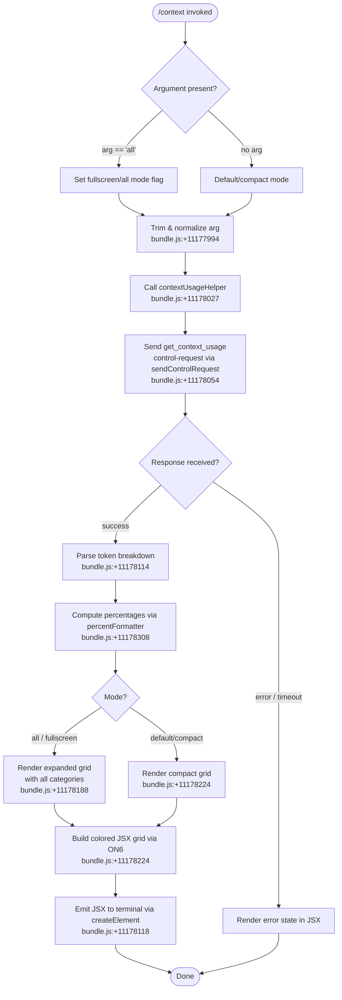

# `/context`

> Analysis basis: CC v2.1.154 bundle.js (AST extraction + Claude interpretation)
> Minimum version: v2.1.154

---

## Overview

The `/context` command visualizes the current session's context window usage as a color-coded grid rendered in the terminal. It issues a `control-request` to the running agent process, collects token-count breakdowns across context categories (system prompt, tools, messages, memory files, etc.), and renders each category as a labeled row of colored cells proportional to its share of the context window.

---

## Registration

| Field | Value |
|---|---|
| type | `local-jsx` |
| name | `context` |
| description | `Visualize current context usage as a colored grid` |
| argumentHint | `[all]` |
| thinClientDispatch | `control-request` |
| module_id | `LI1` |
| load_inline | `true` |
| loc_byte | `11179294` |
| loc_byte_end | `11179520` |
| loc_line | `7791` |
| arbor_handler.name | `yaL` |
| arbor_handler.fqn | `claude-2.1.154::yaL` |
| arbor_handler.kind | `AsyncFunction` |
| arbor_handler.resolution_path | `module_id` |
| arbor_handler.n_hits | `0` |

Analysis basis: CC v2.1.154 bundle.js:+11179294

---

## Input Branching

The command supports two distinct input paths based on the presence of the `all` argument, and then branches further on the control-request response. Three or more distinct paths exist, so a Mermaid flowchart is used.



---

## Behavioral Spec

### Handler Entry — `contextHandler` (`yaL`)

The main handler is the async function `yaL`, resolved by Arbor via `module_id` path.

```
async function contextHandler(args, sessionContext):
    rawArg = args.trim()                          // bundle.js:+11177994
    mode = contextUsageHelper(rawArg)             // bundle.js:+11178027
    // mode is "all" if rawArg == "all", else "default"

    response = await sessionContext.sendControlRequest(
        type = "get_context_usage"                // bundle.js:+11178084
    )                                             // bundle.js:+11178054

    dataEvent = await awaitDataEvent(response)   // bundle.js:+11178114
    // listens for "data" event on the control channel

    tokenBreakdown = parseContextResponse(dataEvent)
    categories = buildCategoryList(tokenBreakdown)   // bundle.js:+11178224
    percentages = computePercentages(categories)     // bundle.js:+11178308

    grid = renderContextGrid(categories, percentages, mode)
                                                  // bundle.js:+11178397
    return createElement(grid)                    // bundle.js:+11178118
```

Analysis basis: CC v2.1.154 bundle.js:+11177988

---

### Mode Resolver — `contextUsageHelper` (`W3`)

```
function contextUsageHelper(rawArg):
    normalized = rawArg.trim().toLowerCase()
    if normalized == "all":                       // literal: "all" bundle.js:+11178019
        return { mode: "fullscreen", showAll: true }
    else:
        return { mode: "default", showAll: false }
```

Analysis basis: CC v2.1.154 bundle.js:+11178027

---

### Control Request Dispatch

The command uses `thinClientDispatch: "control-request"` and sends a `get_context_usage` request literal to the agent process.

```
controlRequest = {
    type: "get_context_usage"                   // bundle.js:+11178084
}
response = session.sendControlRequest(controlRequest)
// Waits for "data" event on the response stream
// bundle.js:+11178054
```

The response handler (`haH`) listens on the `"data"` event of the returned emitter, converts the buffer to string, then passes it to the JSX rendering pipeline.

Analysis basis: CC v2.1.154 bundle.js:+11178114

---

### Category Builder — `categoryListBuilder` (`ON6`)

`ON6` processes the token breakdown response and builds a list of displayable context categories:

```
function categoryListBuilder(response):
    categories = []

    // Filter and locate each named category
    freeSpace     = response.filter(c => c.label == "Free space")      // bundle.js:+11176127
    autocompact   = response.filter(c => c.label == "Autocompact buffer") // bundle.js:+11176150
    systemPrompt  = response.find(c => c.type == "system")             // bundle.js:+11178201
    projectSettings = find "projectSettings"                           // bundle.js:+11177076
    userSettings    = find "userSettings"                              // bundle.js:+11177116
    localSettings   = find "localSettings"                             // bundle.js:+11177150
    flagSettings    = find category type "Flag"                        // bundle.js:+11177203
    policySettings  = find category type "Policy"                      // bundle.js:+11177239
    pluginSettings  = find category type "Plugin"                      // bundle.js:+11177258 / "plugin" bundle.js:+11177269
    builtIn         = find category type "built-in" / "Built-in"       // bundle.js:+11177288 / bundle.js:+11177301
    mcpCategory     = find category type "mcp" / "MCP"                 // bundle.js:+11177599 / bundle.js:+11177611
    messages        = find category type "Messages"                    // bundle.js:+9973257

    // Percent formatter rounds to nearest integer; appends ".0" suffix
    // when value < 20 shows "< 20" label                              // bundle.js:+209569
    // compact number format uses "en-US" locale, "compact" notation   // bundle.js:+211557

    return categories
```

Labels visible in the rendered grid (from literals):

| Label String | Source byte |
|---|---|
| `"Free space"` | 11176127 |
| `"Autocompact buffer"` | 11176150 |
| `"Project"` | 11177096 |
| `"User"` | 11177133 |
| `"Local"` | 11177168 |
| `"Flag"` | 11177203 |
| `"Policy"` | 11177239 |
| `"Plugin"` | 11177269 |
| `"Built-in"` | 11177301 |
| `"MCP"` | 1097611 |
| `"Memory files"` | 9972693 |
| `"Skills"` | 9972755 |
| `"System prompt"` | 9972229 |
| `"System tools"` | 9972310 |
| `"MCP tools"` | 9972375 |
| `"Messages"` | 9973257 |
| `"Custom agents"` | 9972626 |

Analysis basis: CC v2.1.154 bundle.js:+11176051

---

### Percentage Formatter — `percentFormatter` (`Rt`)

```
function percentFormatter(value, total):
    pct = Math.round((value / total) * 100)    // bundle.js:+209589
    if pct < 20:
        return "< 20"                          // bundle.js:+209569
    formatted = pct.toLocaleString("en-US",
        { notation: "compact" })               // bundle.js:+211557
    return formatted + ".0"                    // bundle.js:+209531
```

Analysis basis: CC v2.1.154 bundle.js:+209586

---

### Context Breakdown Threshold — `compactBoundary` (`i$`)

Before rendering, the handler checks for an auto-compact boundary marker:

```
function checkCompactBoundary(contextSlice):
    marker = "compact_boundary"               // bundle.js:+10483745
    idx = contextSlice.findIndex(marker)
    if idx >= 0:
        return contextSlice.slice(idx)        // bundle.js:+10483898
    return contextSlice
```

Analysis basis: CC v2.1.154 bundle.js:+11177950

---

### Grid Renderer — `contextGridRenderer` (`XT8`)

The grid renderer is a substantial JSX component. It assembles one colored row per context category, sized proportionally to token count. Color categories observed from literals:

| Color token | Meaning |
|---|---|
| `"promptBorder"` | System prompt row border |
| `"inactive"` | Inactive / zero-usage cell |
| `"cyan_FOR_SUBAGENTS_ONLY"` | MCP tools used only in sub-agents |
| `"permission"` | Permission-gated tool cells |
| `"warning"` | Near-limit warning cells |
| `"purple_FOR_SUBAGENTS_ONLY"` | Messages in sub-agent context |

The renderer uses `Math.round`, `Math.floor`, `Math.max`, `Math.min` to size cells, and applies an 80-character-wide default grid width:

- Default grid width: **80 characters** (bundle.js:+11178430)
- Row padding uses two-space separator: `"  "` (bundle.js:+15502368)

The `fAH` sub-function constrains total displayed width using `Math.min` against the terminal's reported column count.

Analysis basis: CC v2.1.154 bundle.js:+9971271

---

### System Prompt Assembly (`su` / `kT`)

The context command's response handler also traverses the full system prompt assembly pipeline (called `su` → `kT`) to count tokens across all injected prompt sections. Key section labels and env-info blocks are included in the breakdown:

- Static environment info (`env_info_static`, bundle.js:+13084654)
- Simple environment info (`env_info_simple`, bundle.js:+13084691)
- Language section (`language`, bundle.js:+13084729)
- Output style (`output_style`, bundle.js:+13084764)
- Background session (`bg-session`, bundle.js:+13084794)
- Scratchpad (`scratchpad`, bundle.js:+13084821)
- Context management (`context_management`, bundle.js:+13084848)
- Brief mode (`brief`, bundle.js:+13084887)
- Memory files are loaded and counted via `az6` → `WK7.buildCombinedMemoryPrompt` (bundle.js:+3299093)

Analysis basis: CC v2.1.154 bundle.js:+13084167

---

## State & Side Effects

| Item | Detail |
|---|---|
| Telemetry | `tengu_amber_creek` (bundle.js:+3378328), `tengu_pewter_brook` (bundle.js:+3378236), `tengu_marlin_porch` (bundle.js:+3744880), `tengu_amber_redwood2` (bundle.js:+9958597), `tengu_sparrow_ledger` (bundle.js:+13084035), `tengu_heron_brook` (bundle.js:+13066643), `tengu_moth_copse` (bundle.js:+3298321), `tengu_memdir_loaded` (bundle.js:+3294085), `tengu_chair_sermon` (bundle.js:+10447441) |
| Control request | Sends `get_context_usage` via `sendControlRequest`; dispatched on `thinClientDispatch: "control-request"` channel (bundle.js:+11178054) |
| appState changes | None observed — read-only visualization; no mutations to session state detected in depth-2 traversal |
| Hook registration | `_9` registers via `f$A.register` (bundle.js:+58450) — likely a settings/disk hook wired during session init, not specific to `/context` |
| Sound | None detected |
| JSX output | Renders via `zN6.createElement` (bundle.js:+11178118) and `P_H.createElement` (bundle.js:+7722055); output goes to terminal inline display |
| MCP state read | `su` pipeline reads active MCP tool lists and connection state to compute MCP token contribution |
| Memory files read | `az6` loads memory directory contents for token accounting (bundle.js:+3298463) |

---

## Version History

| Version | Change |
|---|---|
| v2.1.154 | Initial analysis |

---

## Common Mistakes

1. **Passing an unrecognized argument**: Only `all` is a recognized argument value (literal: `"all"`, bundle.js:+11178019). Any other value is silently treated as the default compact view — there is no error message.
2. **Expecting real-time updates**: `/context` is a one-shot snapshot command. It sends a single `get_context_usage` control request and renders the current state; it does not poll or auto-refresh.
3. **Confusing token counts with model context limits**: The grid shows token usage relative to the current model's context window. The model-specific context limit (e.g., 64 000, 128 000, 1 000 000 tokens) is resolved at render time; the grid proportions will differ across models.
4. **Running in thin-client / remote environments**: The command uses `thinClientDispatch: "control-request"`, which requires the local agent process to be running and reachable. In headless or pipe-only contexts the control channel may not be available, causing the command to hang or return an error state.
5. **Interpreting "< 20" percentage label**: Values below 20% are displayed as the string `"< 20"` rather than a numeric percentage (bundle.js:+209569). This is intentional display rounding, not an error.

---

## Appendix — Identifier Mapping

> For bundle debugging only. Identifiers change across versions.

| Identifier | Role |
|---|---|
| `yaL` | Main async handler for `/context` command (Arbor-resolved) |
| `fq` | Full-screen / mode-detection helper; checks terminal environment |
| `Z3H` | Checks a Set (`baK`) for membership — likely active-session guard |
| `oY_` | Terminal color support detector (checks `yes`/`on` strings) |
| `v1` | String conversion helper (color capability) |
| `xH` | String coercion / normalization utility |
| `Tr` | Terminal fullscreen readiness checker |
| `r47` | Fullscreen condition evaluator (iTerm/tmux detection) |
| `i47` | Terminal prefix checker (`H.startsWith`) |
| `N` | Logger / event emitter wrapper (debug level) |
| `URK` | Settings retrieval from disk |
| `$$A` | Settings layer combiner (`UyK` + `ByK`) |
| `H` | Random/timer utilities (Math.random, setTimeout) |
| `RH` | JSON.stringify wrapper |
| `v4` | Path/string extraction utility |
| `FzA` | Map over config array (`CRK.map`) |
| `HuH` | Write helper for output stream (`yzA`) |
| `gRK` | Log rotation / append-file subsystem |
| `kxH` | Batch join/flush utility (clearTimeout, setTimeout, setImmediate) |
| `cMH` | Combined memory-header builder |
| `B6` | Base path resolver |
| `B16` | Journal / log entry builder (`J8`) |
| `rzA` | Path join helper (joins with `X0H.join`) |
| `izA` | File stat/rename/unlink utility |
| `FRK` | File append-and-rotate handler |
| `_9` | Hook registrar (`f$A.register`) |
| `rY_` | Boolean flag normalizer for session state |
| `i_` | Async context / store accessor |
| `vp` | Settings load orchestrator |
| `gE` | Settings parse helper |
| `T9` | Dedup guard using `LYA` Set, memory usage sampler |
| `Bo8` | Settings-load-from-disk core (reads policy + flag settings) |
| `ig` | Settings layer aggregator (many sub-loaders) |
| `nR6` | Post-load settings notification |
| `o47` | Event/telemetry emitter for context command |
| `E6` | Telemetry event dispatcher |
| `hz6` | Telemetry property builder |
| `Sz6` | Telemetry schema validator |
| `Mx` | Telemetry serializer |
| `y88` | Dedup-and-queue telemetry events |
| `b6` | Telemetry flush/send |
| `W3` | Mode helper — parses `"all"` argument |
| `aWH` | Argument normalizer used by `W3` |
| `K` | Control request sender (pad/map helpers) |
| `L` | Request lifecycle manager (add/delete/finally) |
| `f` | Channel close handler |
| `haH` | Data-event listener for control response |
| `vU` | JSX rendering coordinator |
| `oj_` | JSX element factory wrapper (`Yaq.createElement`) |
| `M4H` | Context-display outer container component |
| `CdH` | Context display inner cell/row renderer |
| `ON6` | Category list builder from token breakdown |
| `s1` | Number formatter (locale-aware) |
| `YK` | Token count formatter |
| `cRK` | Compact number format config |
| `JpH` | Category filter/sort helper |
| `Rt` | Percentage formatter (`Math.round`, `< 20` label) |
| `ZH` | String coercion for display values |
| `IaL` | Compact-boundary slice coordinator |
| `i$` | Compact-boundary finder (`compact_boundary` marker) |
| `FZ8` | Marker search helper (`Wj`) |
| `Wj` | String search primitive |
| `XT8` | Full grid renderer JSX component |
| `VZ` | System prompt section assembler |
| `Ce` | Prompt section builder (av, _9H, JA, WQ) |
| `av` | Anthropic-endpoint resolver |
| `_9H` | Prompt header builder |
| `WQ` | Prompt body parser and assembler |
| `EZ` | Model capability resolver |
| `Bf` | First-party API provider checker |
| `M5` | Model metadata lookup |
| `GA` | Provider-type string resolver |
| `hN` | Provider label builder |
| `JT` | Token window size resolver |
| `g4` | Auto-compact config reader |
| `tE` | Tool-dedup Set manager |
| `h8` | Tool-load coordinator |
| `Wl` | Auto-compact window resolver |
| `O9` | Model string parser / normalizer |
| `Ti6` | Tool entry iterator |
| `_w` | Model name lowercaser/replacer |
| `NP` | Model name replacer |
| `DV` | Context window size lookup |
| `j0` | Context size table lookup (S1H) |
| `gp` | Model string→window-size mapper |
| `be` | Legacy model window-size fallback |
| `DH8` | Window-size numeric parser |
| `sW` | Auto-compact window sentinel |
| `r6H` | Env-var integer parser |
| `EJ1` | Effective window resolver (env/settings/experiment) |
| `Oc_` | Token-count string parser (parseFloat/parseInt/Math.round) |
| `kT` | Full system prompt assembler (main) |
| `dqA` | System prompt header builder |
| `C6` | Async-local-storage store accessor |
| `YB6` | Store getter wrapper |
| `$_` | Promise/observable primitive |
| `IG8` | MCP tool lister |
| `Xk` | Tool schema builder |
| `aJ5` | Coding-style injection section |
| `sJ5` | Memory section builder |
| `iqA` | Tool-description injector |
| `vX5` | Tool-description variant |
| `$X5` | SDK/tool-type classifier |
| `zg` | Tool-feature flag checker |
| `SX` | SDK type resolver |
| `MX5` | Disabled-feature sentinel |
| `mE_` | Feature-disabled stub |
| `sZ` | Feature-flag reader (`a79`) |
| `OL` | Context-limit gating helper |
| `ZF` | Brief-mode section builder |
| `tB` | Token block flattener |
| `az6` | Memory-directory loader + prompt builder |
| `z4` | File reader for memory files |
| `dKH` | Memory directory mkdir helper |
| `Yr` | File-type classifier (isFile/isDirectory) |
| `yH` | Path canonicalizer |
| `Lw` | Memory-load telemetry emitter |
| `SFq` | Memory path joiner |
| `hFq` | Memory formatter (private) |
| `yFq` | Memory formatter (team) |
| `LY_` | Memory section finalizer |
| `c` | Low-level file/path primitive |
| `JX5` | Language/locale section builder |
| `_D` | Language normalizer |
| `cqA` | Model-locale descriptor builder |
| `jX5` | Environment info section builder |
| `nqA` | OS/platform info collector |
| `sM` | Shell detector |
| `lqA` | Shell-type describer |
| `HX5` | Worktree section builder |
| `_X5` | Additional-working-dirs section |
| `PX5` | Git worktree detector |
| `hu_` | Worktree path resolver |
| `WX5` | Scratchpad section builder |
| `OqH` | Scratchpad path resolver |
| `y2H` | Temp-dir path builder |
| `TX5` | Brief-mode toggle checker |
| `VX5` | Focus/context-management section builder |
| `YX5` | Feature-flag section builder |
| `eJ5` | Coding-conventions trimmer |
| `cV9` | MCP resource/tool loader |
| `SMH` | MCP state accessor |
| `im8` | MCP resource formatter |
| `zX5` | Placeholder section (<!-- TODO: not found in depth-2 traversal; needs --depth 4 -->) |
| `AX5` | Placeholder section (<!-- TODO: not found in depth-2 traversal; needs --depth 4 -->) |
| `qX5` | Tool-search section builder |
| `tJ5` | Tool-search prompt text |
| `KX5` | Context-efficiency section |
| `LX5` | Context-efficiency tool-injector |
| `fX5` | Custom-agent section builder |
| `y0` | Agent-type descriptor |
| `OX5` | Token-summary flattener |
| `BFq` | Memory-section re-builder (for token count) |
| `UFq` | Unified memory section factory |
| `GzH` | Tone-and-style section builder |
| `SZ` | Style-section label resolver |
| `R5` | Style string builder |
| `su` | Full context assembly entry (system prompt + all sections) |
| `GK` | Context-assembly cache key builder |
| `rR` | Context-assembly cache lookup |
| `fZ` | Cache hit handler |
| `d_` | Cache miss handler |
| `G_` | Module export wrapper (ES module interop) |
| `MR6` | Module bind helper |
| `M` | MCP server manager |
| `vSH` | MCP server connection handler |
| `JGK` | MCP connection result applier |
| `$` | MCP server registry |
| `Gm5` | MCP reconciler |
| `XD` | Context assembly extra sections |
| `JxL` | Tool-list compiler (all tools → token count) |
| `jxL` | Tool-name extractor |
| `WT8` | Per-server tool compiler |
| `XX5` | Server-tool section builder |
| `FFq` | Server memory+tool section combiner |
| `z_K` | Tool-name sanitizer |
| `NH6` | Tool token estimator |
| `PSH` | Built-in tool token counter |
| `hH` | Error logger |
| `NJ1` | MCP tool token counter |
| `XxL` | AutoMem tool section builder |
| `aj6` | AutoMem filter |
| `PxL` | Conversation message compiler |
| `QXH` | Message batch token counter |
| `GT8` | Per-message token counter |
| `z` | Daemon stop handler |
| `uH` | Path helper (c wrapper) |
| `vy` | Stream frame builder |
| `km` | Daemon shutdown orchestrator |
| `G` | Global server registry |
| `nV6` | Server state normalizer |
| `Vb8` | Server registry entry |
| `X` | IPC connection handler |
| `J` | Connection write queue |
| `w` | Worker process manager |
| `xf` | IPC write flusher |
| `lU5` | IPC protocol message dispatcher |
| `TxL` | Tool token aggregate builder |
| `Vf` | Rounding helper (`Math.round`) |
| `O` | Worker pool |
| `k8` | Worker pool entry |
| `D` | Daemon lifecycle manager |
| `eI8` | Low-memory event emitter |
| `P5A` | Spare worker spawner |
| `Wz` | Daemon watchdog |
| `J8` | Journal/log writer |
| `ZxL` | Memory-file token compiler |
| `WxL` | Tool-prompt section aggregator (with deferred tools) |
| `dE_` | Deferred-tool checker |
| `Y8H` | Deferred-tool filter |
| `vJ1` | Versioned tool-list accessor |
| `WK` | Tool registry lookup (eBq/HFq) |
| `NxL` | Full context-token breakdown builder (master) |
| `ExL` | Row token formatter |
| `VxL` | Category token-width calculator |
| `vxL` | Cell-width calculator variant |
| `jT` | Conversation history assembler |
| `EgL` | Message block extractor |
| `$i_` | Thinking-block filter |
| `ygL` | Tool-use block classifier |
| `IgL` | Content-block type router |
| `hgL` | Array content inspector |
| `h` | Rate-limiter / token-bucket |
| `mZ8` | Trailing-thinking filter |
| `ggL` | UUID generator wrapper |
| `Z8` | Message ID generator |
| `ST` | Message serializer |
| `Ag_` | Agent-listing delta injector |
| `pZ8` | Message batch packer |
| `Jk` | Tool-search optimizer |
| `wi_` | Tool-reference rewriter (removed refs) |
| `VgL` | Tool-result reference rewriter |
| `E` | Event emitter base |
| `V` | Renderer / repaint manager |
| `vgL` | Content-type checker |
| `FgL` | MCP-tool name prefixer (`mcp__`) |
| `y4` | Tool schema validator |
| `KT1` | Tool-call tracker |
| `RgL` | Message reducer |
| `BG1` | Token push accumulator |
| `Ic_` | Full message token serializer |
| `QgL` | Tool-description joiner |
| `T` | Key event handler |
| `SgL` | Token batch finalizer |
| `sT6` | Orphaned-thinking filter |
| `agL` | Trailing-thinking block filter |
| `aT6` | Whitespace-only assistant message filter |
| `sgL` | Empty-content fixer |
| `CgL` | Conversation slicer |
| `UG1` | Message history window builder |
| `FG1` | Message finalizer |
| `kgL` | Tool-result slicer |
| `GxL` | MCP-tool token analyzer |
| `cE_` | MCP deferred-tool checker |
| `uG` | MCP tool-name normalizer |
| `e9` | Model string parser for MCP context |
| `MV6` | MCP tool token estimator |
| `nd_` | Token-width normalizer |
| `F_` | Error/string constructor |
| `fAH` | Grid width constrainer |
| `h7H` | Output-token limit resolver |
| `PzH` | Model output-token-limit table |
| `_H` | Row accumulator for grid |
| `Q` | File read/unlink queue |
| `DN6` | File read queuer |
| `rI1` | File unlink queuer |
| `r` | Write/flush coordinator |
| `d` | gh8 write primitive |
| `O78` | Usage-tracking flag checker |
| `o6H` | HnH Set membership checker |
| `Tc` | Compact-mode cell renderer |
| `iH` | Bridge/IPC session manager |
| `fH` | MCP connection handler |
| `KH` | MCP abort controller registry |
| `L8` | MCP debug logger |
| `NV6` | MCP notification processor |
| `GZK` | MCP elicitation queue |
| `kV6` | MCP elicitation handler |
| `ac` | MCP notification dispatcher |
| `y` | MCP write-stream queue |
| `k6` | Observable/promise primitive |
| `I8` | Log file appender |
| `cA4` | Log path builder |
| `B` | MCP filter pipeline |
| `pH` | Permission filter |
| `cH` | Orphaned-permission handler |
| `h6` | MCP server state builder |
| `v8H` | Tool capability descriptor |
| `mH` | MCP server tool-list merger |
| `AH` | MCP server connection state manager |
| `$6` | MCP plugin/server initializer |
| `w2H` | Plugin refresh orchestrator |
| `wCH` | Plugin change detector |
| `pX` | Plugin queue manager |
| `DH` | Voice-mode session manager |
| `ci1` | Bridge REPL message parser |
| `tk8` | Message type router |
| `m6` | JSON parse wrapper |
| `fM5` | Control-request forwarder |
| `MM5` | Control-response dispatcher |
| `K8A` | Session UUID tracker |
| `BH` | Message size limiter |
| `x` | Write throttle / rate limiter |
| `vH` | Message write handler |
| `li1` | Bridge REPL write handler |
| `Y` | MCP renderer / config manager |
| `j` | Worker kill utility |
| `k` | Away-summary rate limiter |
| `y6` | Plugin channel router |
| `xq` | Plugin frame header |
| `J4` | Plugin session frame |
| `c9` | Plugin server frame |
| `vq` | Plugin client frame |
| `UA` | Fatal error handler (process.exit) |
| `OH` | Observable history list |
| `PH` | Telemetry prompt handler |
| `K6` | MCP startup initializer |
| `LpH` | Log-path + timestamp helper |
| `c38` | Config checksum |
| `OZK` | Plugin/MCP reconciler (headless) |
| `oU` | URL string normalizer |
| `mG8` | Tool-capability merger |
| `bXH` | Tool-cache clearer |
| `AE` | Plugin auth state checker |
| `UD9` | Plugin zip-cache validator |
| `BD9` | Plugin zip-cache error handler |
| `qm` | Plugin tool-schema builder |
| `rC8` | Plugin install/update orchestrator |
| `QD9` | Plugin reconcile-result handler |
| `MZK` | Plugin slot matcher |
| `Rh8` | Plugin install-state checker |
| `wI` | Millisecond rounder |
| `FH` | Session frame cache (Map) |
| `ap_` | RH-based hash function |

---

Note: index built via Arbor fallback; some signals (telemetry, literals) may be missing — see arbor-fallback.js.