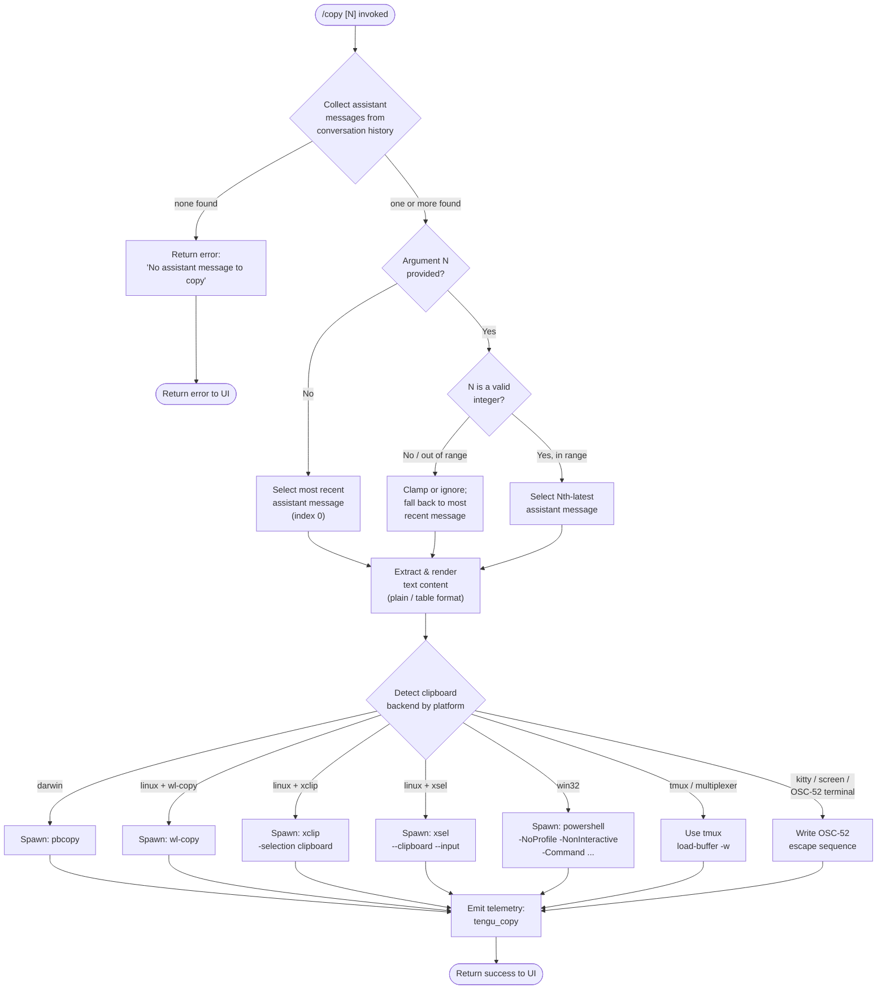

# `/copy`

> Analysis basis: CC v2.1.154 bundle.js (AST extraction + Claude interpretation)
> Minimum version: v2.1.154

---

## Overview

The `/copy` command copies Claude's most recent assistant response to the system clipboard. An optional integer argument `N` selects the Nth-latest assistant message instead of the most recent one. The command extracts text content from conversation history, renders it into a plain or table format, and delegates the actual clipboard write to a platform-specific helper that handles macOS (`pbcopy`), Linux (`wl-copy`, `xclip`, `xsel`), Windows (`powershell`), tmux, and terminal-multiplexer environments.

---

## Registration

| Field | Value |
|---|---|
| type | `local-jsx` |
| name | `copy` |
| description | `Copy Claude's last response to clipboard (or /copy N for the Nth-latest)` |
| module_id | `oV1` |
| load_inline | `true` |
| loc_byte | `10756772` |
| loc_byte_end | `10756958` |
| loc_line | `7661` |
| arbor_handler.name | `DnL` |
| arbor_handler.fqn | `claude-2.1.154::DnL` |
| arbor_handler.kind | `AsyncFunction` |
| arbor_handler.resolution_path | `module_id` |
| arbor_handler.n_hits | `0` |

Analysis basis: CC v2.1.154 bundle.js:+10756772

---

## Input Branching

The handler has four meaningful branches depending on (a) whether any assistant messages exist, (b) whether the optional index argument is present and valid, (c) which index is finally selected, and (d) which platform/clipboard backend is active. This warrants a Mermaid flowchart.



Analysis basis: CC v2.1.154 bundle.js:+10755957 (handler entry `DnL`), +10756067 (integer check), +10756311 (message-selection branch), +3370475 (platform dispatch)

---

## Behavioral Spec

### 1. Handler Entry and Message Collection

```
async function copyCommandHandler(args, appState):
    assistantMessages = collectAssistantMessages(appState.messages)
    // collectAssistantMessages filters conversation for role=="assistant"
    // and content blocks of type=="text"

    if assistantMessages is empty:
        return userError("No assistant message to copy")

    rawArg = args.trim()
    if rawArg is not empty:
        n = Number(rawArg)
        if Number.isInteger(n) AND n >= 1 AND n <= assistantMessages.length:
            targetIndex = assistantMessages.length - n   // Nth-latest = count from end
        else:
            targetIndex = assistantMessages.length - 1  // most recent fallback
    else:
        targetIndex = assistantMessages.length - 1      // default: most recent
```

Analysis basis: CC v2.1.154 bundle.js:+10755957 (`nV1` — assistant message filter), +10756067 (`Number` coercion), +10756081 (`Number.isInteger` guard), +10755998 (error string "No assistant message to copy")

### 2. Content Extraction and Format Rendering

```
function extractAndRenderMessage(message):
    textBlocks = filterTextBlocks(message.content)
    // DK: filters content array keeping only blocks where type=="text"

    if message can be represented as a table:
        rendered = renderAsTable(textBlocks)
        // renderAsTable (cV1 / lV1): tokenizes via markdown lexer (oM.lexer),
        // detects pipe-separated rows, normalises column widths using
        // stringWidth measurements (Bun.stringWidth via s6),
        // pads cells with spaces, aligns columns "left" | "center" | "right",
        // and joins rows with " | " separator
        format = "table"
    else:
        rendered = renderAsPlaintext(textBlocks)
        // renderAsPlaintext (iV1): strips markdown syntax via H.replace,
        // returns plain string
        format = "plaintext"

    return { text: rendered, format }
```

Analysis basis: CC v2.1.154 bundle.js:+10751043 (`cV1` — table renderer), +10751556 (`oM.lexer` — markdown tokeniser), +10751669 (literal `"table"`), +10752070 (`iV1` — plaintext renderer), +10752110 (literal `"plaintext"`), +10455544 (`DK` — text-block filter), +10455567 (literal `"text"`), +10751905 (literal `"assistant"`), +10751086 (pipe-separator `"\\|"`), +10751245 (column-join literal `" | "`), +10751280–10751362 (alignment literals `"center"`, `"right"`, `"left"`)

### 3. Clipboard Write Dispatch (Platform Detection)

```
async function writeToClipboard(text):
    platform = process.platform
    termEnv   = detectTerminalEnvironment()  // checks $TERM, $TMUX, etc.

    if termEnv == "iTerm2" OR uses OSC-52-capable terminal:
        writeOSC52EscapeSequence(text, encoding="base64")
        // encodes text as base64, emits ESC ] 52 ; c ; <b64> BEL
        return

    if termEnv includes "screen":
        writeOSC52WithDoubleEscape(text)   // ESC ESC prefix variant
        return

    if termEnv includes "kitty":
        writeKittyClipboard(text)
        return

    if termEnv includes "tmux":
        spawnProcess("tmux", ["load-buffer", "-w", tempFile])
        return

    if platform == "darwin":
        spawnProcess("pbcopy", [])

    else if platform == "linux":
        if commandExists("wl-copy"):
            spawnProcess("wl-copy", [])
        else if commandExists("xclip"):
            spawnProcess("xclip", ["-selection", "clipboard"])
        else if commandExists("xsel"):
            spawnProcess("xsel", ["--clipboard", "--input"])

    else if platform == "win32":
        spawnProcess("powershell", [
            "-NoProfile", "-NonInteractive", "-Command", "<pipe-command>"
        ])

    // All paths: pipe `text` (utf-8 encoded) to the spawned process stdin
    // Temp files written under CLAUDE_CODE_TMPDIR or /tmp (EX / rV1 helpers)
```

Analysis basis: CC v2.1.154 bundle.js:+3370475 (`xZ` — clipboard dispatch), +3370693 (literal `"pbcopy"`), +3370719 (literal `"linux"`), +3370758 (literal `"wl-copy"`), +3370804 (literal `"xclip"`), +3370825 (literal `"-selection"`), +3370838 (literal `"clipboard"`), +3370870 (literal `"xsel"`), +3370889 (literal `"--clipboard"`), +3370903 (literal `"--input"`), +3371170 (literal `"win32"`), +3371182 (literal `"powershell"`), +3371196–3371227 (PowerShell flags), +3370271 (literal `"iTerm2"`), +3370343 (literal `"tmux"`), +3370281 (literal `"load-buffer"`), +3370315 (literal `"-w"`), +3369751 (literal `"screen"`), +3369866 (literal `"kitty"`), +3370444 (literal `"utf8"`), +3370461 (literal `"base64"`), +3369994 (double-escape sequence `"\x1b\x1b"`), +3946453 (literal `"/tmp"`), +10752179 (`rV1` — temp-file writer), +10752213 (`bE8.mkdir`), +10752256 (`bE8.writeFile`)

### 4. Telemetry Emission

```
function emitCopyTelemetry(result):
    emitEvent("tengu_copy", {
        format: result.format,      // "table" or "plaintext"
        // additional fields: <!-- TODO: not found in depth-2 traversal; needs --depth 4 -->
    })
```

Analysis basis: CC v2.1.154 bundle.js:+10756376 (`tengu_copy` event)

---

## State & Side Effects

| Item | Detail |
|---|---|
| Telemetry | `tengu_copy` (emitted on every successful copy; loc +10756376) |
| Clipboard write | Writes rendered text to system clipboard via platform-specific subprocess or OSC-52 escape sequence |
| Temp files | May create a temporary file under `CLAUDE_CODE_TMPDIR` or `/tmp` for tmux `load-buffer` path; file is cleaned up after the subprocess exits |
| appState changes | None — read-only access to `messages` array |
| Sound | None detected |
| Hook registration | None detected |
| Error output | Surfaces `"No assistant message to copy"` as a user-visible error when conversation contains no assistant turn |

---

## Version History

| Version | Change |
|---|---|
| v2.1.154 | Initial analysis |

---

## Common Mistakes

1. **Passing a non-integer or out-of-range N** — `/copy 0` or `/copy abc` will silently fall back to the most recent message rather than raising an error, which may be surprising.
2. **Running in a headless or SSH environment without X11/Wayland** — the Linux path attempts `wl-copy`, `xclip`, and `xsel` in order; if none is installed the clipboard write silently fails. Use `xclip` or `xsel` packages, or rely on the OSC-52 path if your terminal supports it.
3. **tmux without `load-buffer` support** — older tmux versions may not support the `-w` flag; the copy will fail with no user-visible message.
4. **Expecting rich formatting** — `/copy` renders either plain text or a pipe-table; markdown emphasis, code fences, and other decorations are stripped in plaintext mode.
5. **Counting direction** — `/copy 1` means the *most recent* assistant message; `/copy 2` means the second-most-recent. Passing a value larger than the number of assistant messages falls back to the most recent.

---

## Appendix — Identifier Mapping

> For bundle debugging only. Identifiers change across versions.

| Identifier | Role |
|---|---|
| `DnL` | Main async handler for `/copy` (arbor-resolved entry point) |
| `nV1` | Filters conversation messages to assistant-role entries |
| `DK` | Filters content blocks to `type=="text"` items |
| `lV1` | Table-format renderer (detects and lays out pipe-table rows) |
| `cV1` | Core table column-width and alignment logic |
| `iV1` | Plaintext renderer (strips markdown via `H.replace`) |
| `fnL` | Markdown lexer wrapper used by table renderer |
| `NjH` | Markdown syntax replacement helper used by plaintext renderer |
| `oM` | Markdown lexer module (wraps `avH.parse`) |
| `Ho_` | Clipboard write orchestrator (dispatches to `xZ` and helpers) |
| `xZ` | Platform/terminal detection and clipboard-backend selector |
| `dY_` | Low-level clipboard data writer |
| `xD` | Subprocess stdin pipe writer |
| `F47` | macOS `pbcopy` spawn helper |
| `V8` | Generic subprocess spawner (`W_`, `C6` sub-helpers) |
| `p47` | Duplicate-path pbcopy variant |
| `kQq` | Raw clipboard write helper (shared by several paths) |
| `V0` | OSC-52 escape-sequence builder (`H.replaceAll` for base64 encoding) |
| `DJ` | Screen/multiplexer double-escape writer (`m47` → `H.join`) |
| `m47` | Inner escape-sequence builder for `screen` path |
| `a4` | Index-of helper used in argument parsing |
| `rV1` | Temp-file writer for tmux `load-buffer` path |
| `EX` | Temp-directory setup (`pVH.mkdirSync`, `Cj7` chmod guard) |
| `Cj7` | Directory-permission validator |
| `kd` | Temp-file path builder |
| `MnL` | Map helper over message list |
| `bo1` | Message metadata accessor |
| `Si` | Single-message text extractor |
| `C1H` | Content-block text joiner (uses `_.trim`, limit 1000) |
| `MI6` | Message field joiner (`Co1.join`) |
| `RH` | JSON serialiser wrapper (`JSON.stringify`) |
| `s6` | String-width measurer (`Bun.stringWidth`) |
| `k8` | Session-state accessor for stopped/background-session literals |
| `vSH` | MCP server manager (reachable via `$.map` branch of call graph; not directly part of copy logic) |
| `O8` | Global-config save helper |
| `b6` | Config-file watcher/accessor |
| `bzH` | Config file reader (`q.readFileSync`) |
| `m6` | JSON parser wrapper (`JSON.parse`) |
| `kb` | String prefix stripper (`H.startsWith` / `H.slice`) |
| `UBq` | Backup-directory file resolver |
| `Sz_` | Path joiner for config backups |
| `hH` | Error logger (`Li.logError`) |
| `uH` | Feature-ok telemetry emitter |
| `yH` | Feature-bad telemetry emitter |
| `eI8` | Memory-pressure helper |
| `FD6` | File-read + JSON-parse pipeline |
| `E6` | Config-change broadcaster |
| `W5A` | Background-session IPC connect helper |
| `N5A` | Background-session lifecycle manager |
| `B` | Settled-session retirement checker |
| `w` | Background-worker dispatch loop |
| `R` | Worker kill helper |
| `j` | Worker value iterator |
| `y` | Worker stdin writer |

---

Note: index built via Arbor fallback; some signals (telemetry, literals) may be missing — see arbor-fallback.js.