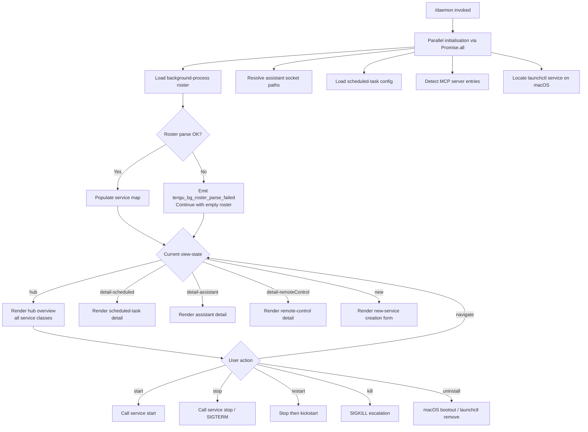

# `/daemon`

> Analysis basis: CC v2.1.150 bundle.js (AST extraction + Claude interpretation)
> Minimum version: v2.1.150

---

## Overview

The `/daemon` command manages Claude Code's background service layer, providing a unified control surface for three categories of persistent services: AI assistant sessions, scheduled tasks, and remote-control endpoints. It executes immediately on invocation (`immediate: true`) and renders an interactive JSX-based UI that reflects live service state, allows lifecycle operations (start, stop, restart, kill), and surfaces telemetry for each service class.

---

## Registration

| Field | Value |
|---|---|
| type | `local-jsx` |
| name | `daemon` |
| description | `Manage background services: assistants, scheduled tasks, and remote control` |
| immediate | `true` |
| module_id | `qt_` |

Analysis basis: CC v2.1.150 bundle.js:+12543547

---

## Input Branching

The command's top-level dispatcher (`F15`) resolves its initial state by running several parallel async operations, then mounts a live JSX interface. Branching at the UI level is driven by a view-state string that selects among a hub overview and three detail views.



Analysis basis: CC v2.1.150 bundle.js:+12542503, +12542835, +12533128, +12533286, +12533407, +12533226

---

## Behavioral Spec

### Top-level Initialisation

```
async function daemonCommandEntry(context):
    results = await Promise.all([
        loadBackgroundRoster(),           // _t_
        resolveSocketDirectory(),         // es_
        loadScheduledConfig(context),     // nc1 → YeH
    ])
    
    renderInterface = mountJsxUI(results) // f.render
    await renderInterface.unmount()       // f.unmount on exit
```

Analysis basis: CC v2.1.150 bundle.js:+12542503, +12542841, +12543070, +12542920, +12543134

---

### Background Roster Loading

```
async function loadBackgroundRoster():
    sessionList = await listActiveSessions()    // Bc1
    pidEntries  = await readPidFiles()          // Rc1
    processMap  = buildProcessMap(sessionList, pidEntries)  // T0
    assistants  = await loadAssistantEntries()  // AQ1
    scheduledEntries = await loadScheduledFile() // yd1
    rosterData  = await parseRosterFile()        // jB
    serviceIndex = buildServiceIndex(rosterData) // kc
    return Object.keys(serviceIndex)
```

Analysis basis: CC v2.1.150 bundle.js:+12531818, +12531848, +12531861, +12531887, +12531914, +12531936, +12531958, +12531976, +12532089

---

### Roster File Parsing

```
async function parseRosterFile(path):
    raw = await filesystem.readFile(path)        // IeH.readFile
    try:
        parsed = JSON.parse(raw)
        validate schema fields
        return parsed
    catch ParseError:
        emit telemetry("tengu_bg_roster_parse_failed")
        logError(error)
        return []
    
    // Additional validation: test against expected format regex
    // ELH.test applied to string-coerced content
```

Analysis basis: CC v2.1.150 bundle.js:+11144810, +11144891, +11145305, +11145321

---

### Scheduled Task File Reader

```
async function loadScheduledFile(filePath):
    content = await filesystem.readFile(filePath, "utf8")
    parsed  = parseScheduledEntries(content)    // kd1
    resolvedEntries = resolveEntryPaths(parsed) // Nq
    if processMustStop:
        process.kill(pid, signal)
    return resolvedEntries
```

- Encoding: `"utf8"` (Analysis basis: CC v2.1.150 bundle.js:+12421388)

---

### PID File Resolver

```
async function readPidFiles():
    baseDir  = os.homedir()
    entries  = filesystem.readdirSync(baseDir)
    filtered = entries.filter(matchesPidPattern)    // SR
    mapped   = _.map(filtered, resolvePidEntry)     // Rc1 → _.map
    
    for each entry:
        basename = path.basename(entry)             // M5H.basename
        if entry.type == "same-dir":                // literal "same-dir"
            resolveRelative(entry)
    
    return mapped
```

- Directory resolution strategy literal: `"same-dir"` (Analysis basis: CC v2.1.150 bundle.js:+12520201)

---

### Process Lifecycle Controller

```
function processLifecycleControl(pid, action):
    switch action:
        case "start":
            spawnProcess(pid)               // bB.spawn
        case "stop":
            sendSignal(pid, "SIGTERM")
            waitForExit(timeoutMs)
        case "restart":
            sendSignal(pid, "SIGTERM")
            pollForExit(interval=200ms, maxAttempts=50)
            if not exitedWithin(10s):
                abort("daemon did not exit within 10s of SIGTERM; restart aborted before kickstart")
            kickstart(pid)
        case "kill":
            sendSignal(pid, "SIGKILL")
            emit telemetry("tengu_daemon_control")
```

- Stop signal: `SIGTERM` (Analysis basis: CC v2.1.150 bundle.js:+11137666)
- Kill signal: `SIGKILL` (Analysis basis: CC v2.1.150 bundle.js:+15260919)
- Restart poll interval: 200 ms (Analysis basis: CC v2.1.150 bundle.js:+11137778)
- Restart max poll cycles: 50 (Analysis basis: CC v2.1.150 bundle.js:+11137917)
- Timeout abort message: `"daemon did not exit within 10s of SIGTERM; restart aborted before kickstart"` (Analysis basis: CC v2.1.150 bundle.js:+11137946)

---

### macOS launchctl Integration

```
function launchctlServiceControl(action, serviceLabel):
    if platform != "darwin":
        if action == "uninstall":
            throw Error("service uninstall not available on darwin")
        return

    launchAgentsPath = path.join(os.homedir(), "Library", "LaunchAgents")

    switch action:
        case "start":
            exec("launchctl", "kickstart", serviceLabel)
        case "stop":
            exec("launchctl", "stop", serviceLabel)
        case "kill":
            exec("launchctl", "kill", "SIGTERM", serviceLabel)
        case "restart":
            exec("launchctl", "stop", serviceLabel)
            poll until stopped (timeout=10s, interval=200ms, maxCycles=50)
            exec("launchctl", "kickstart", serviceLabel)
        case "uninstall":
            exec("launchctl", "bootout", serviceLabel)
        case "status":
            exec("launchctl", "print", serviceLabel, timeout=5000ms)

    emit telemetry("tengu_daemon_control")
```

- Platform guard: `"darwin"` (Analysis basis: CC v2.1.150 bundle.js:+11138272)
- launchctl binary literal: `"launchctl"` (Analysis basis: CC v2.1.150 bundle.js:+11138703)
- Status subcommand: `"print"` (Analysis basis: CC v2.1.150 bundle.js:+11138716)
- Status timeout: 5000 ms (Analysis basis: CC v2.1.150 bundle.js:+11138750)
- LaunchAgents sub-path: `"Library/LaunchAgents"` (Analysis basis: CC v2.1.150 bundle.js:+11135488, +11135498)
- Uninstall subcommand: `"bootout"` (Analysis basis: CC v2.1.150 bundle.js:+11137261)
- Kickstart subcommand: `"kickstart"` (Analysis basis: CC v2.1.150 bundle.js:+11137624)

---

### Socket Directory Resolution

```
async function resolveSocketDirectory():
    configDir = path.join(os.homedir(), ...)    // kc1.homedir + L5H.join
    
    try:
        stat = await filesystem.stat(configDir) // Nv6.stat
        if stat fails:
            throw { code: "ENOENT" }
    catch error:
        if error.code == "ENOENT":
            log("debug", ...)
            return null
        log("error", ...)                       // literal "error"
        return null

    assistantSocket = path.join(configDir, "assistant")  // literal "assistant"
    codeSocket      = path.join(configDir, "code")       // literal "code"
    return { assistantSocket, codeSocket }
```

- Socket type `"assistant"`: Analysis basis: CC v2.1.150 bundle.js:+12516205
- Socket type `"code"`: Analysis basis: CC v2.1.150 bundle.js:+12516198
- Error code `"ENOENT"`: Analysis basis: CC v2.1.150 bundle.js:+173271
- Log level `"debug"`: Analysis basis: CC v2.1.150 bundle.js:+202680
- Log level `"error"`: Analysis basis: CC v2.1.150 bundle.js:+12516330

---

### MCP Server Connection Manager

```
async function manageMcpConnections(serverConfig):
    entries = Object.entries(serverConfig)
    
    for each [name, config] in entries:
        if config.status == "disabled":
            skip
        
        transportType = config.transport   // "stdio" | "sse" | "http" | "sse-ide" | "ws-ide"
        
        if transportType == "claudeai-proxy":
            handleProxyTransport(config)
        
        if config.auth == "needs-auth":
            log("Skipping connection (cached needs-auth)")
            markStatus("needs-auth")
            continue
        
        connectionResult = await connectToServer(name, config)
        
        if connectionResult.ok:
            markStatus("connected")
        else:
            markStatus("failed")
    
    // MCP update reconciliation
    applyMcpUpdate(currentState, newState)   // H.applyMcpUpdate
    
    if allRemoteServersRecovered:
        log("[MCP] Retry: all remote servers recovered, stopping")
        stopRetryLoop()
```

- Transport types: `"stdio"`, `"sse"`, `"http"`, `"sse-ide"`, `"ws-ide"` (Analysis basis: CC v2.1.150 bundle.js:+10090807, +10090841, +10090873, +10090906, +10090942)
- Proxy transport: `"claudeai-proxy"` (Analysis basis: CC v2.1.150 bundle.js:+10091214)
- Auth-skip message: `"Skipping connection (cached needs-auth)"` (Analysis basis: CC v2.1.150 bundle.js:+10091400)
- Recovery log: `"[MCP] Retry: all remote servers recovered, stopping"` (Analysis basis: CC v2.1.150 bundle.js:+14981566)

---

### Background Session Dispatcher

```
function backgroundSessionDispatcher(sessionMap):
    MAX_GRACE_SECONDS = 30      // seconds before SIGKILL escalation
    KILL_CHECK_INTERVAL = 15    // polling interval seconds
    SPAWN_RETRY_LIMIT = 100
    MEMORY_THRESHOLD_KB = 1024  // free-memory floor in KB

    for each session in sessionMap.values():
        
        if session.status == "stopped":
            checkBackgroundSession()
        
        freeMem = os.freemem() / 1024
        if freeMem < MEMORY_THRESHOLD_KB:
            emit telemetry("tengu_bg_dispatch_low_mem")
            deferSpawn()
            continue
        
        if session.needsSigkill:
            emit telemetry("tengu_bg_dispatch_sigkill_escalate")
            process.kill(session.pid, "SIGKILL")
            continue
        
        if session.isSpare:
            emit telemetry("tengu_bg_spare_enable")
            claimedSession = tryClaimSpare(session)
            
            if claimedSession.ok:
                emit telemetry("tengu_bg_spare_claim")
            else:
                emit telemetry("tengu_bg_spare_claim_fail")
                handleClaimFailure(session)
        
        if session.retryCount > SPAWN_RETRY_LIMIT:
            emit telemetry with tag "dup_retry_exhausted"
            reportError(
                "report the issue at https://github.com/anthropics/claude-code/issues"
            )
        
        newProcess = childProcess.spawn(executablePath, args)
        sessionMap.set(session.id, newProcess)
        emit telemetry("tengu_bg_session_create")
        
        session.dispose()
```

- SIGKILL grace period: 30 s (Analysis basis: CC v2.1.150 bundle.js:+15260826)
- Kill check interval: 15 s (Analysis basis: CC v2.1.150 bundle.js:+15260837)
- Spawn retry ceiling: 100 (Analysis basis: CC v2.1.150 bundle.js:+15260943)
- Memory floor: 1024 KB (Analysis basis: CC v2.1.150 bundle.js:+15261344)
- Issue URL: `"https://github.com/anthropics/claude-code/issues"` (Analysis basis: CC v2.1.150 bundle.js:+15261996)
- Session create event: `"tengu_bg_session_create"` (Analysis basis: CC v2.1.150 bundle.js:+15261181)

---

### Supervisor & Config-Reload Loop

```
function supervisorConfigReloadLoop(supervisorHandle):
    // Supervisor writes to an output stream (q.write)
    // Heartbeat key: "heartbeat"
    // Supervisor label: "supervisor"

    supervisorHandle.write(currentConfig)
    
    on configChange:
        scheduler.stop()
        scheduler.updateConfig(newConfig)
        scheduler.start()
        emit telemetry("tengu_daemon_config_reload")
    
    on stop:
        scheduler.stop()
        deleteTimerEntry()              // M.delete
```

- Heartbeat literal: `"heartbeat"` (Analysis basis: CC v2.1.150 bundle.js:+15274086)
- Supervisor label: `"supervisor"` (Analysis basis: CC v2.1.150 bundle.js:+15274864)
- Config reload event: `"tengu_daemon_config_reload"` (Analysis basis: CC v2.1.150 bundle.js:+15275657)

---

### Remote Control Startup Handler

```
function remoteControlAtStartupHandler(event):
    event.preventDefault()
    activateRemoteControlFlag("remoteControlAtStartup")   // literal key
    navigateToView("detail-remoteControl")
    scheduleJitterDelay()                                  // H: Math.random * 2 + setTimeout
```

- Flag key: `"remoteControlAtStartup"` (Analysis basis: CC v2.1.150 bundle.js:+13469621)
- View label: `"detail-remoteControl"` (Analysis basis: CC v2.1.150 bundle.js:+12533407)
- Jitter base multiplier: `2` (Analysis basis: CC v2.1.150 bundle.js:+13290153)

---

### Scheduled Task Model Selector

```
function resolveScheduledModel(modelHint):
    if modelHint.startsWith("anthropic."):
        return modelHint                    // pass-through
    
    switch modelHint:
        case "opusplan":
            return planningOpusModel
        case "opus":
            return "claude-opus-4-6"
        case "opus[1m]":
            return "claude-opus-4-6[1m]"
        default:
            return "Custom model"
```

- Namespace prefix: `"anthropic."` (Analysis basis: CC v2.1.150 bundle.js:+10742163)
- Opus model ID: `"claude-opus-4-6"` (Analysis basis: CC v2.1.150 bundle.js:+10742646)
- Extended-context variant: `"claude-opus-4-6[1m]"` (Analysis basis: CC v2.1.150 bundle.js:+10742711)
- Custom fallback label: `"Custom model"` (Analysis basis: CC v2.1.150 bundle.js:+10742248)

---

### Hub View Service Classes

The hub view (`"hub"`) aggregates three top-level service class sections:

| Key | Display Name |
|---|---|
| `scheduled` | `Scheduled` |
| `remoteControl` | `Remote Control` |
| *(implicit)* | `Claude Daemon` |

Analysis basis: CC v2.1.150 bundle.js:+12532635, +12532661, +12534055, +12534376, +12534661

---

### View Navigation State Machine

```
type ViewState =
    | "hub"
    | "detail-scheduled"
    | "detail-assistant"
    | "detail-remoteControl"
    | "new"

function navigate(currentView, action):
    switch action.type:
        case SELECT_SERVICE:
            return "detail-" + action.serviceClass
        case CREATE_NEW:
            return "new"
        case BACK:
            return "hub"
        default:
            return currentView
```

- View key literals: `"hub"`, `"detail-scheduled"`, `"detail-assistant"`, `"detail-remoteControl"`, `"new"` (Analysis basis: CC v2.1.150 bundle.js:+12532635, +12533128, +12533286, +12533407, +12533226)

---

### Session List Aggregator (Bc1)

```
async function aggregateSessionList():
    results = await Promise.all([
        enumerateSessions(),         // f66
        readSessionRegistry(),       // RH
        resolveSessionPids(),        // T0
    ])
    
    mergedList = mergeSessionResults(results, index=1)
    return mergedList
```

- Merge offset literal: `1` (Analysis basis: CC v2.1.150 bundle.js:+12526605)

---

### Socket Cleanup on Exit

```
function cleanupSocketOnExit(socketPath):
    try:
        filesystem.unlinkSync(socketPath)   // hJK.unlinkSync
    catch:
        // ignore ENOENT
```

Analysis basis: CC v2.1.150 bundle.js:+15239542

---

### Permission Panel

The hub view exposes a `"permission"` sub-panel for each service entry.

- Permission panel key: `"permission"` (Analysis basis: CC v2.1.150 bundle.js:+12534759)

---

### Display Padding Utility

```
function formatStatusRow(entries):
    lines = entries.map(entry =>
        entry.label.padEnd(columnWidth, " ")    // M.padEnd with "  " fill
    )
    return lines.join("\n")
```

- Padding fill literal: `"  "` (two spaces) (Analysis basis: CC v2.1.150 bundle.js:+15284910)

---

### Jitter Delay Helper

```
function jitteredDelay(baseFactor):
    // baseFactor = 2
    jitter = Math.random() * baseFactor   // yields [0, 2)
    return new Promise(resolve => setTimeout(resolve, jitter))
```

Analysis basis: CC v2.1.150 bundle.js:+13290155, +13290192, +13290153

---

## State & Side Effects

| Item | Detail |
|---|---|
| Telemetry: `tengu_bg_roster_parse_failed` | Fired when the background-process roster file cannot be parsed (Analysis basis: +11144891) |
| Telemetry: `tengu_daemon_control` | Fired on every lifecycle control action (start/stop/restart/kill) (Analysis basis: +15296981) |
| Telemetry: `tengu_bg_dispatch_sigkill_escalate` | Fired when a session is force-killed with SIGKILL after grace period expires (Analysis basis: +15260871) |
| Telemetry: `tengu_bg_dispatch_low_mem` | Fired when free memory drops below 1024 KB and a spawn is deferred (Analysis basis: +15261450) |
| Telemetry: `tengu_bg_spare_enable` | Fired when a spare session slot is activated (Analysis basis: +15262145) |
| Telemetry: `tengu_bg_spare_claim` | Fired when a spare session is successfully claimed (Analysis basis: +15262266) |
| Telemetry: `tengu_bg_spare_claim_fail` | Fired when a spare session claim fails (Analysis basis: +15262529) |
| Telemetry: `tengu_bg_session_create` | Fired when a new background session process is spawned (Analysis basis: +15261181) |
| Telemetry: `tengu_daemon_config_reload` | Fired when the supervisor applies a live config reload (Analysis basis: +15275657) |
| Hook registration | `remoteControlAtStartup` key registered on startup via event handler `G` (Analysis basis: +13469621) |
| appState changes | View-state field cycles through `"hub"`, `"detail-*"`, and `"new"` values; timestamp recorded via `Date.now` at mount (Analysis basis: +12532557) |
| Socket cleanup | `unlinkSync` called on socket path at process exit (Analysis basis: +15239542) |
| Process signals | `process.kill` used for both SIGTERM (graceful) and SIGKILL (forced) scenarios (Analysis basis: +12331691, +12421568, +15260912) |
| MCP state | `H.applyMcpUpdate` reconciles MCP server connection state; `A.cleanup` run on teardown (Analysis basis: +14980996, +14981125) |
| Sound | <!-- TODO: not found in depth-2 traversal; needs --depth 4 --> |
| Spawn side effect | `bB.spawn` creates a new child process for background session (Analysis basis: +15262588) |

---

## Version History

| Version | Change |
|---|---|
| v2.1.150 | Initial analysis. Command registered as `local-jsx`, `immediate: true`, module `qt_`. Covers assistants, scheduled tasks, remote control, MCP management, macOS launchctl integration, and background session dispatcher. |

---

## Common Mistakes

1. **Invoking `/daemon` outside a project context**: The socket-resolution step looks for paths relative to `os.homedir()`; if the home directory is unavailable or the config directory does not exist, all socket lookups silently return `null` and no services will be listed.

2. **Expecting `uninstall` to work on non-macOS platforms**: The `uninstall` subcommand is guarded by a `"darwin"` platform check. On Linux or Windows the call throws `"service uninstall not available on darwin"` — this error message is misleading on non-darwin hosts; it indicates the feature is darwin-only, not that it failed on darwin.

3. **Restarting when SIGTERM is slow**: The restart path polls for exit over 50 cycles at 200 ms each (~10 s total). If the daemon process does not exit within that window, the restart is aborted before `kickstart` is called, leaving the service neither fully stopped nor restarted. Monitor the log for the abort message and retry manually.

4. **Assuming spare sessions are always available**: The spare-session claim path can fail (`tengu_bg_spare_claim_fail`). Callers must handle the failure branch; the dispatcher will not automatically fall back to a fresh spawn in the same tick.

5. **Assuming MCP connections are synchronous**: All MCP server connections are resolved via `Promise.all` and individual entries may land in `"needs-auth"` or `"failed"` state without blocking the rest of the UI render. Check per-entry status rather than assuming global readiness.

6. **Ignoring memory pressure**: When `os.freemem()` falls below 1024 KB, spawns are deferred and `tengu_bg_dispatch_low_mem` is emitted. If the system is memory-constrained, background sessions will not start until pressure is relieved.

---

## Appendix — Identifier Mapping

> For bundle debugging only. Identifiers change across versions.

| Identifier | Role |
|---|---|
| `F15` | Top-level daemon command entry function |
| `_t_` | Background roster loader / orchestrator |
| `HXH` | Roster list helper (depth-2 leaf) |
| `Bc1` | Session list aggregator |
| `Rc1` | PID file resolver |
| `T0` | Process lifecycle controller (kill/signal dispatch) |
| `AQ1` | Assistant entry loader |
| `yd1` | Scheduled task file reader |
| `jB` | Roster file parser (JSON + schema validation) |
| `kc` | Service index builder |
| `es_` | Socket directory resolver |
| `j_` | Config directory path helper |
| `Vm6` | Config value accessor |
| `j8` | Logging utility (structured log emitter) |
| `N` | Log-level router (debug/error/etc.) |
| `EH` | Error-to-string converter |
| `K` | Display row formatter / map utility |
| `L` | Async task tracker (add/delete/finally) |
| `M` | Server/connection handle (close/padEnd) |
| `H` | Jitter delay helper (Math.random + setTimeout) |
| `_` | General collection utility |
| `f` | JSX render host (render / unmount) |
| `UyH` | MCP server connection manager |
| `gDK` | MCP update reconciler (applyMcpUpdate / cleanup) |
| `$` | Hub-state accessor (HQ1 delegate) |
| `lv5` | MCP entry filter and connection dispatcher |
| `nc1` | Scheduled-task config loader (wraps YeH) |
| `YeH` | Scheduled-task model/config resolver |
| `C15` | Parallel init coordinator (Promise.all over _t_, es_, nc1) |
| `At_` | React component: daemon UI root |
| `R9` | Clock context consumer (useContext) |
| `XK` | External-store subscription hook |
| `q` | Socket cleanup handle (unlinkSync) |
| `z` | Daemon stop helper (bH/uH/Rk/pu) |
| `O` | App-state reader (k8 delegate) |
| `k8` | App-state store accessor |
| `T` | HE6/wh8 composite utility |
| `HE6` | Shared event/hook emitter |
| `wh8` | Shared watch/state hook |
| `J` | Process killer wrapper (delegates to w) |
| `w` | Background session dispatcher (spawn, SIGKILL, memory check) |
| `P` | MCP connection failure handler |
| `RH` | Error reporter / log aggregator |
| `c_` | Error normaliser (Error/String coercion) |
| `VeH` | macOS launchctl service controller |
| `ec_` | LaunchAgents path resolver |
| `E8` | launchctl exec wrapper |
| `uG8` | launchctl output parser ($E1 delegate) |
| `ZZ6` | Restart orchestrator (wraps Hl_) |
| `Hl_` | Restart poll loop (uG8/E8/setTimeout) |
| `Y` | Supervisor config-reload loop handler |
| `tXH` | Supervisor session resolver (A1/K8/ts_/EH/Nq) |
| `Ic1` | Column-width calculator (Object.keys / Math.max / wz) |
| `G` | Remote-control startup event handler |
| `Z` | Scheduler handle (stop / updateConfig / start) |
| `_XK` | Heartbeat registration helper (Je delegate) |
| `V` | View-state push target |
| `c` | Generic cleanup / finaliser |