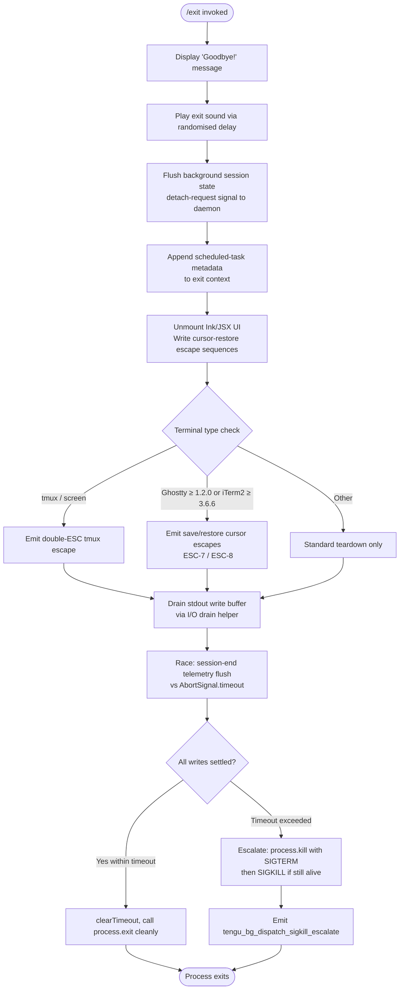

# `/exit`

> Analysis basis: CC v2.1.154 bundle.js (AST extraction + Claude interpretation)
> Minimum version: v2.1.154

---

## Overview

The `/exit` command (also invocable as `/quit`) terminates the Claude Code CLI session. When invoked, it triggers an immediate, multi-phase shutdown sequence: it flushes in-flight I/O, unmounts the UI, serialises session-end telemetry, cleans up background daemon state, and finally calls `process.exit`. The command is marked `immediate: true`, meaning it bypasses the normal command-input pipeline and fires directly.

---

## Registration

| Field | Value |
|---|---|
| type | `local-jsx` |
| name | `exit` |
| description | `null` |
| aliases | `["quit"]` |
| immediate | `true` |
| module_id | `pi1` |
| load_inline | `true` |
| loc_byte | `12360183` |
| loc_byte_end | `12360379` |
| loc_line | `9240` |
| arbor_handler.name | `qM5` |
| arbor_handler.fqn | `claude-2.1.154::qM5` |
| arbor_handler.kind | `AsyncFunction` |
| arbor_handler.resolution_path | `module_id` |
| arbor_handler.n_hits | `1` |

Analysis basis: CC v2.1.154 bundle.js:+12360183

---

## Input Branching

The shutdown sequence has more than three distinct execution paths (normal teardown, timeout escalation, low-memory guard, spare-process claims, and hard-kill fallback), so a Mermaid flowchart is used.



Analysis basis: CC v2.1.154 bundle.js:+12359432 – +12359615

---

## Behavioral Spec

### Top-level Exit Handler (`qM5`)

The Arbor-resolved handler for `/exit` is the async function `qM5` (FQN `claude-2.1.154::qM5`, resolution path: `module_id`).

```
async function exitCommandHandler(context):
    // 1. Greeting / farewell display
    displayFarewellMessage("Goodbye!")          // literal @ bundle.js:+12359396
    scheduleExitSound()                         // randomised delay helper

    // 2. Background-session detachment
    sendDetachRequest(daemonSession)             // "detach-request" @ +10763513
    flushDaemonSessionState()                   // writes JSON via stream writer

    // 3. Append scheduled-task context
    appendScheduledTaskMetadata(context)         // "scheduled task" @ +10757025

    // 4. JSX / Ink UI teardown
    renderFarewellJSXComponent()                // A8A.createElement call @ +12359509
    unmountInkApp()                             // AM5 → O2 @ +12359387

    // 5. Graceful process shutdown sequence
    initiateGracefulShutdown()                  // tq @ +12359615
```

Analysis basis: CC v2.1.154 bundle.js:+12359432

---

### Farewell Sound Scheduler (`soundScheduler` / `H`)

```
function scheduleExitSound():
    delay = Math.random() * 2 + 1     // range [1, 3) seconds
                                       // constants 2, 1 @ +13408198, +13408214
    setTimeout(playExitAudio, delay)
```

Analysis basis: CC v2.1.154 bundle.js:+13408200

---

### Background Session Flush (`backgroundSessionFlusher` / `m5H`)

```
function flushBackgroundSession(session):
    sessionData = buildSessionRecord(session)    // Mo6 @ +10763479
    validateAndCoerceRecord(sessionData)         // Av1 → KPH, k8 @ +10763498
    writeDetachSignal(stream, "detach-request")  // Ds → Ys.write @ +10763513
    serializeToJSON(sessionData)                 // RH → JSON.stringify @ +10592169
    notifyHeadlessAgent(session)                 // hAH @ +10763559
```

Analysis basis: CC v2.1.154 bundle.js:+10763479

---

### Scheduled-Task Context Appender (`scheduledTaskAppender` / `xE8`)

```
function appendScheduledTaskMetadata(exitContext):
    label = "scheduled task"                     // literal @ +10757025
    resolveCurrentTaskQueue()                    // GG → ov @ +10757006
    pushTaskEntry(taskQueue)                     // H.push @ +10757011
    parseScheduleExpression(expression)          // jnL @ +10757052
    truncateDisplayString(label)                 // y9 @ +10757067
```

The schedule-expression parser (`jnL`) handles cron-like strings, resolving "Every minute" and "Every hour" labels (literals at +4782263 and +4782480), with field width 5 for minute columns (literal `5` at +4782179) and base-10 `parseInt` with radix `10` (literal at +4782333).

Analysis basis: CC v2.1.154 bundle.js:+10757006

---

### Graceful Shutdown Sequence (`gracefulShutdown` / `tq`)

```
async function initiateGracefulShutdown():
    await Promise.resolve()                      // yield microtask queue

    // Phase 1: Write final terminal output
    writeShutdownOutput(stdout)                  // rNH @ +5329665
    restoreTerminalCursor()                      // Yq8 → Fr.writeSync @ +3716827
    emitTerminalEscapes()                        // ESC-7 / ESC-8 @ +3716981, +3716992

    // Phase 2: Emit scrollback summary
    flushScrollSummary()                         // VV_ @ +5329671
    // includes path sanitisation: replace "\\" and "\"" literals @ +5327840, +5327863
    // dims trailing metadata via dim ANSI helper

    // Phase 3: Hard exit helper (vV_)
    clearTimeout(pendingTimer)
    pid = getActiveRendererPid()                 // O7.get @ +5328081
    process.exit(0)                              // vV_ → process.exit @ +5328129
    // fallback if still running:
    process.kill(pid, "SIGTERM")                 // @ +5328154
    // sentinel: throw Error("unreachable")      // literal @ +5328202

    // Phase 4: I/O drain
    drainStdoutBuffer()                          // IxH → f$A.drain @ +58493

    // Phase 5: Race session-end flush vs timeout
    maxWait = Math.max(5000, 3500)               // literals @ +5329694, +5329701
    result = await Promise.race([
        flushSessionEndTelemetry(),              // Y @ +5329868
        AbortSignal.timeout(maxWait)             // @ +5329956
    ])

    clearTimeout(shutdownTimer)                  // @ +5329891

    // Phase 6: Cache-eviction hint emission
    emitCacheEvictionHint()                      // X96 @ +5330017
                                                 // telemetry: tengu_cache_eviction_hint

    // Phase 7: Final write confirmation
    stdout.writeSync(finalByte)                  // uwH.writeSync @ +5330134
```

The `session_end` literal at +5330065 is emitted as part of the telemetry payload during Phase 5.

Analysis basis: CC v2.1.154 bundle.js:+5329597

---

### Session-End Telemetry Writer (`sessionEndWriter` / `Y`)

```
function flushSessionEndTelemetry():
    buildSessionEndRecord()                      // E2H @ +15492274
    write("session_end", sessionRecord)          // q.write @ +15492291
    // includes supervisor label @ +15492299
    reportSessionStats()                         // Lt1 @ +15492493
    stopHeartbeat()                              // T.stop @ +15492567
    stopStatusWatcher()                          // E.stop @ +15492687
    updateDaemonConfig()                         // E.updateConfig @ +15492696
    restartDaemonIfConfigChanged()               // E.start @ +15492714
    emitHeartbeatDone()                          // QEK → hHH, "heartbeat" @ +15491520
    startNewDaemonCycle()                        // V.start @ +15492872
    reloadConfig()                               // c @ +15493090
    // telemetry: tengu_daemon_config_reload @ +15493092
```

Analysis basis: CC v2.1.154 bundle.js:+15492274

---

### Terminal-Escape Restoration Helper (`terminalRestorer` / `Yq8`)

When the terminal is identified as Ghostty (≥ 1.2.0) or iTerm2 (≥ 3.6.6), cursor save/restore escapes `ESC 7` / `ESC 8` are emitted via `Fr.writeSync`. For tmux/screen environments the multiplexer-specific double-ESC sequence is emitted via the `V0` helper (literals "tmux", "screen" at +3369948 and +3370021).

Analysis basis: CC v2.1.154 bundle.js:+3716827

---

### Background Dispatch Kill Escalation (`bgProcessKiller` / `w`)

```
function killBackgroundWorker(workerEntry):
    pid = processMap.get(workerEntry)            // A.get @ +15478486
    escalationTimer = setTimeout(sendSIGKILL, 100)
    // 100 ms grace period, literal @ +15478676
    worker.kill("SIGKILL")                       // R.kill @ +15478645
    // telemetry: tengu_bg_dispatch_sigkill_escalate @ +15478604
    if freemem() < LOW_MEM_THRESHOLD:
        // telemetry: tengu_bg_dispatch_low_mem @ +15479183
        evictLowPriorityWorkers()
    attemptSpareProcessClaim()
    // telemetry: tengu_bg_spare_claim @ +15479999
    // telemetry: tengu_bg_spare_claim_fail @ +15480262
```

SIGKILL grace period: 100 ms (bundle.js:+15478676).
SIGTERM is also sent (`j` → `y.kill`, "SIGTERM" @ +15480497).

Analysis basis: CC v2.1.154 bundle.js:+15478486

---

### Prompt-Input Exit Event

The literal `"prompt_input_exit"` at +12359620 is emitted immediately after the JSX farewell component is rendered, recording the entry point for analytics purposes.

Analysis basis: CC v2.1.154 bundle.js:+12359620

---

## State & Side Effects

| Item | Detail |
|---|---|
| Telemetry: `tengu_bg_dispatch_sigkill_escalate` | Fired when a background worker process requires SIGKILL escalation (bundle.js:+15478604) |
| Telemetry: `tengu_bg_dispatch_low_mem` | Fired when free memory is below threshold during background worker teardown (bundle.js:+15479183) |
| Telemetry: `tengu_bg_spare_enable` | Fired when spare-process pool is enabled (bundle.js:+15479878) |
| Telemetry: `tengu_bg_spare_claim` | Fired when a spare process slot is successfully claimed (bundle.js:+15479999) |
| Telemetry: `tengu_bg_spare_claim_fail` | Fired when the spare process claim fails (bundle.js:+15480262) |
| Telemetry: `tengu_bg_spare_spawn` | Fired when a new spare process is spawned (bundle.js:+15478297) |
| Telemetry: `tengu_daemon_config_reload` | Fired when daemon config is reloaded at session end (bundle.js:+15493092) |
| Telemetry: `tengu_startup_perf` | Startup profiling report emitted if profiling was enabled (bundle.js:+214276) |
| Telemetry: `tengu_scroll_summary` | Scrollback summary flushed on exit (bundle.js:+5328997) |
| Telemetry: `tengu_amber_creek` | Fullscreen-mode signal emitted during environment detection (bundle.js:+3378328) |
| Telemetry: `tengu_pewter_brook` | Alternate fullscreen-mode signal (bundle.js:+3378236) |
| Telemetry: `tengu_cache_eviction_hint` | Cache eviction advisory emitted just before final stdout write (bundle.js:+5330030) |
| UI teardown | Ink JSX component unmounted; cursor-restore escape sequences written to terminal |
| Daemon / background session | Detach-request signal sent (`"detach-request"` @ +10763513); JSON-serialised state flushed via stream |
| Scheduled tasks | Task queue metadata appended to exit context before teardown |
| Heartbeat | Heartbeat supervisor stopped (`T.stop` @ +15492567); heartbeat event emitted (`"heartbeat"` @ +15491520) |
| Timer cleanup | All `setTimeout` handles cleared via `clearTimeout` before `process.exit` |
| Process termination | `process.exit(0)` called; fallback `process.kill(pid, "SIGTERM")` then SIGKILL after 100 ms grace |
| I/O | stdout drained via `f$A.drain` before exit; final `uwH.writeSync` confirms buffer flush |
| Sound | Exit audio scheduled with randomised delay in range [1, 3) seconds |

---

## Version History

| Version | Change |
|---|---|
| v2.1.154 | Initial analysis |

---

## Common Mistakes

1. **Using `/exit` mid-agent-turn**: Because `immediate: true` bypasses the normal input pipeline, invoking `/exit` while the agent is streaming a response will interrupt that response without waiting for it to complete. Prefer waiting for the agent to finish before exiting if a full response is needed.
2. **Expecting instant termination on slow terminals**: The shutdown sequence races I/O flushes against a timeout (max of 5000 ms and 3500 ms, bundle.js:+5329694). On slow or pipe-buffered terminals, there is a brief but observable delay before the process actually exits.
3. **Conflating `/quit` with a separate command**: `/quit` is a registered alias for `/exit` (bundle.js:+12360183) and is functionally identical — it executes the same handler.
4. **Assuming background daemons are immediately dead**: The SIGKILL escalation path has a 100 ms grace period (bundle.js:+15478676). Background workers may still be shutting down for up to 100 ms after the CLI exits.
5. **Missing telemetry in offline environments**: Several `tengu_*` events require network reachability. If the telemetry endpoint is unavailable the flush is raced against the abort timeout and dropped silently.

---

## Appendix — Identifier Mapping

> For bundle debugging only. Identifiers change across versions.

| Identifier | Role |
|---|---|
| `qM5` | Main exit command handler (AsyncFunction; Arbor FQN `claude-2.1.154::qM5`) |
| `V9` | Process-mode resolver (distinguishes `"bg"`, `"daemon"`, `"daemon-worker"`) |
| `VOH` | Process-mode branch executor |
| `H` | Exit sound scheduler (uses `Math.random` + `setTimeout`) |
| `m5H` | Background session state flusher |
| `Mo6` | Session record builder |
| `Av1` | Session record validator/coercer |
| `KPH` | Coercion sub-helper |
| `k8` | Coercion field writer |
| `Ds` | Stream writer for detach signal |
| `RH` | JSON serialiser wrapper (`JSON.stringify`) |
| `hAH` | Headless-agent notifier |
| `sM` | Pre-shutdown state snapshot helper |
| `xE8` | Scheduled-task metadata appender |
| `GG` | Task-queue resolver |
| `ov` | Observable/event-emitter primitive |
| `jnL` | Schedule-expression parser (cron-like, "Every minute" / "Every hour") |
| `UV` | Cron-field tokeniser (uses `parseInt`, `K.match`, `w.toString`) |
| `K` | Day-of-week/field formatter (`L.map`, `f.padEnd`) |
| `w` | Background worker kill/spawn manager |
| `L` | Async task-set manager (`q.add`, `f.finally`, `q.delete`) |
| `j` | Worker process group killer (`A.values`, `y.kill`) |
| `D` | Worker lifecycle teardown helper |
| `$` | Socket/file cleanup helper (`bo1`) |
| `J` | UTC date/time calculation helper |
| `fk` | Schedule-string normaliser (`H.trim`, `fv7`, `A.push`) |
| `fv7` | Schedule-field tokeniser (`H.split`, `parseInt`, `K.add`, `Array.from`) |
| `A` | String-lowercasing collection helper |
| `FlH` | Date arithmetic helper (sets minutes/hours/month/date on Date objects) |
| `_` | Generic iterable / date operand |
| `O` | Date target object for arithmetic (`k8` background-session type) |
| `f` | File-handle closer (`A.close`, `q.close`) |
| `q` | File-system unlink / abort-signal helper |
| `iq` | Duration formatter (`Math.floor`, `Math.round`) |
| `y9` | Display-string truncator (`H.indexOf`, `H.substring`, `s6`, `Tq`) |
| `s6` | Terminal string-width measurer (`Bun.stringWidth`) |
| `Tq` | ANSI-aware string slicer (`s6`, `zY`) |
| `zY` | ANSI escape stripper |
| `AM5` | JSX farewell component factory |
| `tq` | Graceful shutdown orchestrator (main shutdown sequence) |
| `rNH` | Final terminal output writer (cursor restore, unmount) |
| `GR` | Post-unmount cleanup helper |
| `Yq8` | Terminal-escape restoration helper (ESC-7 / ESC-8 for Ghostty/iTerm2) |
| `DVH` | Terminal-type detector (Ghostty, iTerm2 version checks) |
| `MVH` | Multiplexer-mode detector |
| `V0` | tmux/screen double-ESC escape emitter |
| `xH` | String coercion helper (`String()`) |
| `VV_` | Scrollback summary flusher / path sanitiser |
| `fZ` | Session-path resolver |
| `Mb` | Metadata formatter |
| `k6` | Event emitter primitive |
| `BX6` | Working-directory stat helper (`q.statSync`) |
| `WS` | Observable helper A |
| `$_` | Observable helper B |
| `B6` | Directory-existence checker |
| `V3` | Conversation-log path builder |
| `U4` | Log-entry serialiser |
| `ZJ9` | Dim-text ANSI wrapper |
| `vV_` | Hard-exit executor (`process.exit`, `process.kill`) |
| `IxH` | stdout drain helper (`f$A.drain`) |
| `Y` | Session-end telemetry writer |
| `E2H` | Session-end record builder |
| `o9` | AsyncLocalStorage store reader (`Fj7.getStore`) |
| `J8` | Session ID resolver |
| `S_A` | Stats aggregation helper |
| `ZH` | String-coercion wrapper |
| `Lt1` | Session statistics reporter (`Object.keys`, `Math.max`, `oY`) |
| `T` | Heartbeat/input supervisor (stop/start lifecycle) |
| `b` | Key-event handler (preventDefault) |
| `Z0` | Remote-control-at-startup config accessor |
| `E` | Status/config watcher (stop/updateConfig/start) |
| `QEK` | Heartbeat-done emitter |
| `hHH` | Heartbeat-done signal handler |
| `V` | New-daemon-cycle starter |
| `c` | Config-reload trigger |
| `AK6` | Startup-performance profiler |
| `rU8` | Performance-mark recorder |
| `Kp` | `perf_hooks` module loader |
| `zYA` | Profiling-report writer |
| `wYA` | Report-path builder (`lb6.join`, `l8`, `k6`) |
| `j0H` | Atomic-file writer (`openSync`, `writeFileSync`, `fsyncSync`, `closeSync`) |
| `fYA` | Profiling-entry formatter |
| `N` | Log-level / environment-flag resolver |
| `u58` | Session-scroll-summary builder |
| `TJ9` | Scroll-summary field formatter |
| `GJ9` | Timing-stats aggregator (`Date.now`, `Math.max`, `Math.round`, `Object.assign`) |
| `PJ9` | Timing-stats sub-helper |
| `fq` | Fullscreen / terminal-mode environment resolver |
| `Z3H` | Terminal-capability cache checker (`baK.has`) |
| `oY_` | Fullscreen enable path |
| `Tr` | iTerm2 CC integration mode detector |
| `rY_` | Fullscreen-disable boolean resolver |
| `i_` | Visibility/focus event subscriber |
| `o47` | `tengu_amber_creek` event emitter path |
| `E6` | Event-bus dispatcher (hz6, Sz6, Mx, y88) |
| `X96` | Cache-eviction hint builder |
| `m58` | Parallel promise orchestrator (`Promise.all`, `Promise.race`) |
| `Q8` | Timeout-abort wrapper (`setTimeout`, `clearTimeout`, `L.unref`) |

---

Note: index built via Arbor fallback; some signals (telemetry, literals) may be missing — see arbor-fallback.js.