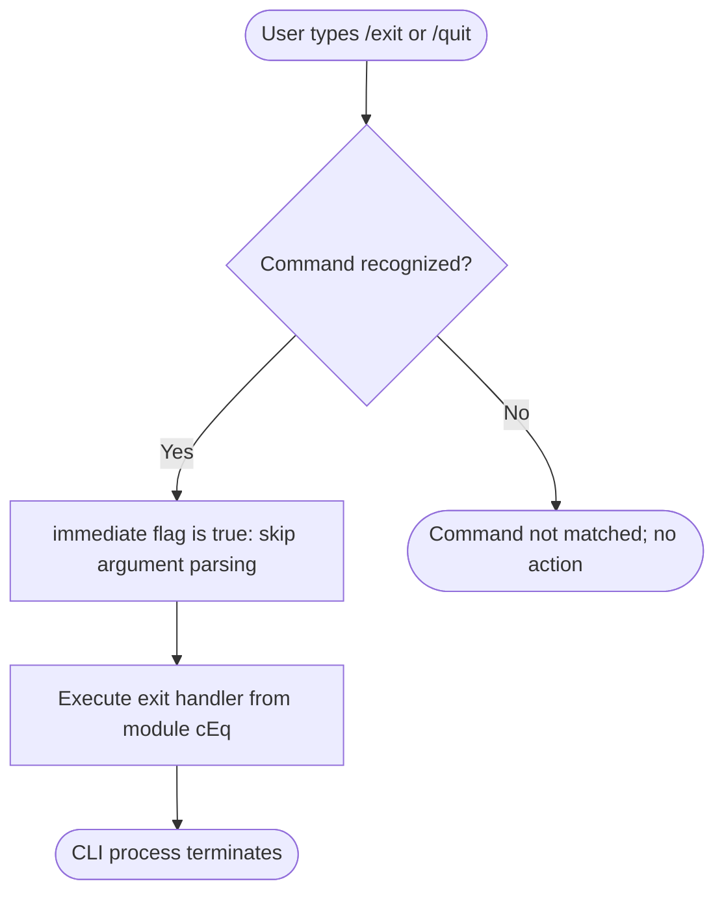

# `/exit`

> Analysis basis: CC v2.1.144 bundle.js (AST extraction + Claude interpretation)
> Minimum version: v2.1.144

---

## Overview

The `/exit` command (also accessible as `/quit`) is a local slash command that immediately terminates the Claude Code CLI session. It is registered with `immediate: true`, meaning it executes without requiring additional confirmation or argument parsing before the session is closed.

---

## Registration

| Field | Value |
|---|---|
| type | `local-jsx` |
| name | `exit` |
| description | `null` |
| immediate | `true` |
| aliases | `["quit"]` |
| module\_id | `cEq` |

Analysis basis: CC v2.1.144 bundle.js:+11666327

---

## Input Branching

Because `immediate: true` is set and no `callGraph` entries or `literals` were found in the depth-2 traversal, the command does not perform any argument-based branching. The execution path is linear: invoke → terminate.



Analysis basis: CC v2.1.144 bundle.js:+11666327

---

## Behavioral Spec

### Immediate Execution

Because the `immediate` field is set to `true`, the CLI framework does not wait for the user to submit a fully composed input line. The exit handler is invoked as soon as the command token is matched.

```
function handleExitCommand():
    # No argument parsing performed
    # No confirmation prompt issued
    terminateCLIProcess()
```

Analysis basis: CC v2.1.144 bundle.js:+11666327

### Alias Resolution

The command is reachable under two tokens: `/exit` and `/quit`. Both aliases resolve to the same handler registered in module `cEq`.

```
function resolveExitAlias(token):
    if token is "/exit" or token is "/quit":
        return exitCommandHandler
    else:
        return null
```

Analysis basis: CC v2.1.144 bundle.js:+11666327

### JSX Render Type

The `type` field is `local-jsx`, which indicates the command's output (if any is rendered before termination) is produced via a JSX render path rather than a plain-text output path. Given that termination is immediate, any rendered output is expected to be minimal or absent.

```
function renderExitOutput():
    # type is local-jsx
    # render phase may produce zero or minimal JSX nodes
    # process exit follows immediately after render cycle completes
    return emptyOrMinimalJSXNode
```

Analysis basis: CC v2.1.144 bundle.js:+11666327

---

## State & Side Effects

| Item | Detail |
|---|---|
| Telemetry | None detected at depth-2 traversal (`telemetry: []`) |
| Hook registration | <!-- TODO: not found in depth-2 traversal; needs --depth 4 --> |
| appState changes | <!-- TODO: not found in depth-2 traversal; needs --depth 4 --> |
| Sound | <!-- TODO: not found in depth-2 traversal; needs --depth 4 --> |
| Process termination | Terminates the CLI process; no explicit exit code confirmed at this traversal depth |
| Confirmation prompt | None — `immediate: true` suppresses any pre-exit prompt |

---

## Version History

| Version | Change |
|---|---|
| v2.1.144 | Initial analysis; `immediate: true`, alias `quit` confirmed |

---

## Common Mistakes

1. **Expecting a confirmation prompt**: Because `immediate: true` is set, typing `/exit` or `/quit` terminates the session instantly. There is no "Are you sure?" dialog to dismiss.
2. **Using `/exit` to clear the screen or reset context**: This command fully terminates the process; it does not soft-reset or clear conversation state while keeping the session alive. Use a different mechanism if only a context reset is needed.
3. **Assuming `/quit` behaves differently from `/exit`**: Both tokens are registered as aliases to the identical handler. There is no behavioral distinction between them.
4. **Expecting telemetry on exit**: No telemetry events are emitted by this command at the traversal depth analyzed. Downstream process-level shutdown hooks may emit events, but these are not attributable to the `/exit` command module itself at this analysis depth.

---

## Appendix — Identifier Mapping

> For bundle debugging only. Identifiers change across versions.

| Identifier | Role |
|---|---|
| cEq | Module ID for the exit command registration and handler |

> **Note**: The AST extraction returned an empty `identifiers` array and noted "no entry functions found for module 'cEq'" at depth ≤ 2. No additional obfuscated identifiers were available for mapping. A deeper traversal (`--depth 4` or greater) is recommended to recover the internal handler function identifiers.