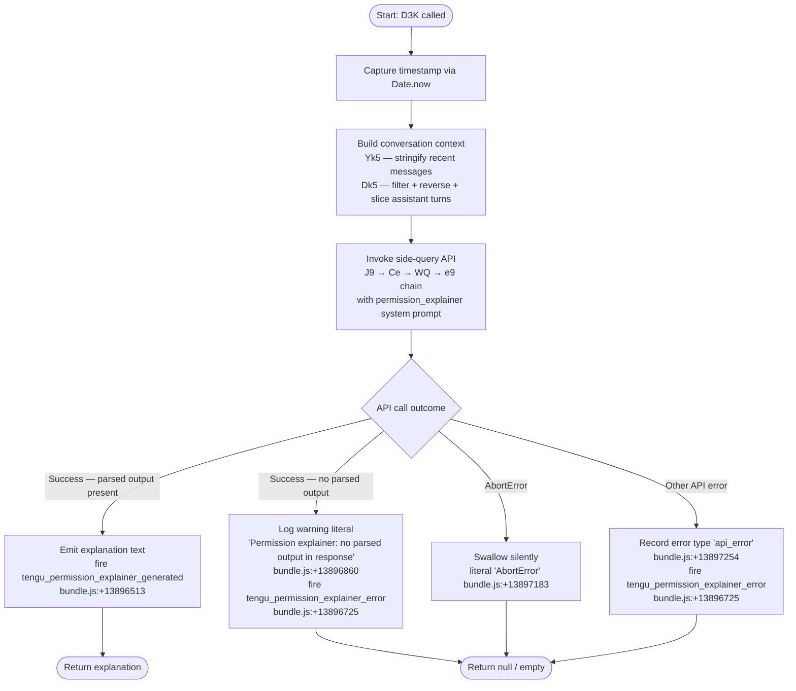

# `/explain_command`

> Analysis basis: CC v2.1.154 bundle.js (AST extraction + Claude interpretation)
> Minimum version: v2.1.154

---

## Overview

`/explain_command` is an internal tool-type slash command that invokes the **permission explainer** subsystem: given a pending or recent tool-use permission request, it generates a human-readable explanation of what the command does and why it requires the permissions it is asking for. The handler (`D3K`) fires a side-query API call, parses the model's structured response, and emits the explanation text back to the caller, recording success or error via telemetry.

---

## Registration

| Field | Value |
|---|---|
| type | `tool` |
| name | `explain_command` |
| description | `null` |
| loc_byte | `13896030` |
| loc_byte_end | `13896066` |
| loc_line | `11573` |
| arbor_handler.name | `D3K` |
| arbor_handler.fqn | `claude-2.1.154::D3K` |
| arbor_handler.kind | `AsyncFunction` |
| arbor_handler.resolution_path | `direct` |
| arbor_handler.n_hits | `1` |

Analysis basis: CC v2.1.154 bundle.js:+13896030

---

## Input Branching

The handler has four significant branches: successful parsed output, missing parsed output, `AbortError`, and generic API error. A Mermaid flowchart is used.



---

## Behavioral Spec

### Handler Entry — `D3K` (permissionExplainerHandler)

```
async function permissionExplainerHandler(input):
    startTime = Date.now()                         // bundle.js:+13895749

    // Build context from recent conversation
    recentContext = buildStringifiedContext(input)  // Yk5 bundle.js:+13895770
    assistantTurns = filterAssistantTurns(input)    // Dk5 bundle.js:+13895788

    // Invoke the side-query subsystem
    response = await sideQuery(                    // J9  bundle.js:+13895935
        systemPrompt = "permission_explainer",     // literal bundle.js:+13896088
        context = recentContext,
        turns = assistantTurns
    )

    // Check for abort
    if response.error?.name == "AbortError":       // bundle.js:+13897183
        return null

    // Check for API error
    if response.error:
        telemetry("tengu_permission_explainer_error", {type: "api_error"})
                                                   // bundle.js:+13896725, +13897254
        return null

    // Check parsed output
    if not response.parsedOutput:
        log("Permission explainer: no parsed output in response")
                                                   // bundle.js:+13896860
        telemetry("tengu_permission_explainer_error", {})
                                                   // bundle.js:+13896725
        return null

    telemetry("tengu_permission_explainer_generated", {
        durationMs: Date.now() - startTime
    })                                             // bundle.js:+13896513

    return response.parsedOutput
```

Analysis basis: CC v2.1.154 bundle.js:+13895725 (call to `Y4A`/`b6`), +13895935 (call to `J9`)

---

### Context Construction — `Yk5` (stringifyContext)

Converts input data to a JSON-serialised string suitable for the API call, using `RH` (JSON.stringify wrapper) and a `String()` coercion.

```
function stringifyContext(input):
    return RH(String(input))    // bundle.js:+13895235, +13895261
```

Analysis basis: CC v2.1.154 bundle.js:+13895770

---

### Assistant-Turn Filter — `Dk5` (filterAssistantTurns)

Extracts the most recent assistant messages from the conversation buffer to supply as few-shot context to the explainer model call.

```
function filterAssistantTurns(messages):
    filtered = messages
        .filter(m => m.role == "assistant")    // literal bundle.js:+13895324
                                               // bundle.js:+13895301
    reversed = filtered.reverse()              // bundle.js:+13895369
    sliced   = reversed.slice(0, 3)            // limit: 3  literal bundle.js:+13895344
                                               // bundle.js:+13895512
    // Prepend "..." separator marker
    sliced.unshift("...")                      // literal bundle.js:+13895525
                                               // bundle.js:+13895533
    return sliced.join("")                     // bundle.js:+13895566
```

Constants:
- Maximum assistant turns retained: **3** (bundle.js:+13895344)
- Separator token inserted at front: `"..."` (bundle.js:+13895525)
- Message role filter value: `"assistant"` (bundle.js:+13895324)
- Turn index limit applied after reverse: `1000` (bundle.js:+13895289; appears as slice upper-bound guard)

Analysis basis: CC v2.1.154 bundle.js:+13895788

---

### Side-Query Dispatch — `J9` → `Ce` → `WQ` (sideQuery / messageBuilder / contextFormatter)

`J9` is the side-query entry point that assembles a minimal API message array and dispatches it through the standard API transport layer (`zu` / `HU`).

```
async function sideQuery(systemPrompt, context, turns):
    messages = buildMessages(systemPrompt, context, turns)  // Ce bundle.js:+2185876
    result   = await apiDispatch(messages)                  // zu bundle.js:+13895948
    return parseResult(result)
```

`Ce` (messageBuilder) orchestrates several formatting helpers:
- `av` — wraps the system prompt block
- `_9H` — attaches context metadata
- `JA` — creates a user-turn message object
- `WQ` (contextFormatter) — assembles the full content array, applying model-alias resolution (`e9`), provider filtering (`mBH`, `K$q`, `sx4`, `y1H`, `tx4`), and token-type classification

Analysis basis: CC v2.1.154 bundle.js:+2185876 (`Ce`), +2185723 (`av`), +2183706 (`WQ`)

---

### API Transport — `zu` / `HU` (apiTransport / httpRequestHandler)

`zu` is the top-level async transport function called with the assembled message array. It delegates to `HU` which handles:
- Header construction (User-Agent, session-id, remote container/session ids, client-app, agent-id) (bundle.js:+2916761–+2917000)
- OAuth token acquisition (`WO` → `m3_`) and refresh locking (bundle.js:+2917363)
- Proxy auth helper (`wc6`) (bundle.js:+2917516)
- Request timeout: **600 000 ms** (bundle.js:+2917640)
- Streaming response parsing (`AH7`, `HH7`) (bundle.js:+2917528)
- Telemetry: `tengu_api_success` (bundle.js:+13151499)

Analysis basis: CC v2.1.154 bundle.js:+13895948 (call to `zu`), +13150016 (call to `HU`)

---

### Config Read — `b6` / `bzH` (configReader / configFileLoader)

`b6` is the configuration accessor called early in the handler chain (via `Y4A`). It guards against premature access with the literal error `"Config accessed before allowed."` (bundle.js:+3210158), reads the JSON config file with UTF-8 encoding (bundle.js:+3210241), and manages a `backups` subdirectory (bundle.js:+3209726). File-not-found (`ENOENT`) is handled gracefully (bundle.js:+3210388); filesystem errors are classified as `"error"` status (bundle.js:+3210709).

Analysis basis: CC v2.1.154 bundle.js:+3207040 (entry to `b6`)

---

### Telemetry — `tengu_permission_explainer_generated` / `tengu_permission_explainer_error`

Both events are fired directly within `D3K`:

- **`tengu_permission_explainer_generated`** — emitted on successful explanation generation; includes elapsed duration. (bundle.js:+13896513)
- **`tengu_permission_explainer_error`** — emitted when parsed output is absent or an API error occurs. (bundle.js:+13896725)

Additionally, the registration block itself contains the literal `"permission_explainer_generate"` (bundle.js:+13896615), suggesting a secondary or legacy telemetry key used during the generation step inside the API dispatch layer.

---

## State & Side Effects

| Item | Detail |
|---|---|
| Telemetry | `tengu_permission_explainer_generated` (bundle.js:+13896513); `tengu_permission_explainer_error` (bundle.js:+13896725); `tengu_api_success` (bundle.js:+13151499); `tengu_config_parse_error` (bundle.js:+3210789); `tengu_oauth_token_refresh_*` family (bundle.js:+2960385–+2962049); `tengu_stream_watchdog_default_on` (bundle.js:+2924776); `tengu_byte_watchdog_fired_late` (bundle.js:+2924046) |
| Hook registration | `_9` calls `f$A.register` (bundle.js:+58450) — file-watcher hook registered during config load path (`Y17`) |
| File I/O | Config file read (`bzH` → `q.readFileSync`); backup directory created if absent (`q.mkdirSync`); config backup copied (`q.copyFileSync`) (bundle.js:+3210214, +3210968, +3211297) |
| appState changes | None directly observed in depth-2 traversal |
| Sound | None observed |
| Network | One outbound HTTPS request to Anthropic API via `HU`; OAuth token refresh may fire a secondary request via `m3_` → `au4` → `hP.post` |

---

## Version History

| Version | Change |
|---|---|
| v2.1.154 | Initial analysis |

---

## Common Mistakes

1. **Expecting user-visible output unconditionally** — the command returns `null` silently on `AbortError`; callers must handle a null return.
2. **Assuming a description is registered** — `description` is `null` in the registration; do not rely on it appearing in help output.
3. **Treating it as a prompt-type command** — despite producing text, it is registered as `type: "tool"`, not `"prompt"`. It does not use `getPromptForCommand` and has no `prompt_body`.
4. **Invoking outside the permission-review context** — the command is designed to be called programmatically by the permission-review UI, not directly by the end user. Direct invocation without a valid pending tool-use context will produce an empty or error response.
5. **Confusing the `"permission_explainer"` system prompt key with a user-configurable setting** — this is a hard-coded literal that selects an internal prompt fragment; it is not an editable value.

---

## Appendix — Identifier Mapping

> For bundle debugging only. Identifiers change across versions.

| Identifier | Role |
|---|---|
| `D3K` | Main handler — `permissionExplainerHandler` (AsyncFunction) |
| `Y4A` | Config + context pre-flight loader |
| `b6` | Configuration accessor / reader |
| `B6` | Config state singleton accessor |
| `vz_` | Config validation helper |
| `bzH` | Config file loader (reads, parses, backs up config JSON) |
| `m6` | JSON safe-parse wrapper |
| `kb` | String prefix stripper |
| `UBq` | Backup directory manager |
| `N` | Logger / debug emitter |
| `Sz_` | Backup path builder |
| `w` | Background-session / daemon subprocess manager |
| `Y17` | Config file watcher setup |
| `Mr` | File-watch event handler |
| `_9` | Hook registration helper (calls `f$A.register`) |
| `Yk5` | Context stringifier |
| `RH` | JSON.stringify wrapper |
| `Dk5` | Assistant-turn filter and formatter |
| `H` | Generic utility (random / timer) |
| `A` | Array/string utility |
| `f` | Stream/connection abstraction |
| `L` | Promise-tracking set helper |
| `J9` | Side-query entry point |
| `Ce` | Message builder |
| `av` | System-prompt block wrapper |
| `_9H` | Context metadata attacher |
| `WQ` | Context/content array formatter |
| `M` | MCP/model-registry map |
| `K` | Padding/map utility |
| `Ti6` | Tool-entry enumerator |
| `mBH` | Provider inclusion checker |
| `K$q` | Provider index resolver |
| `sx4` | Model-capability filter |
| `y1H` | Model-class inclusion check |
| `e9` | Model alias / ID normaliser |
| `tx4` | Model-tier classifier |
| `$X` | Message content assembler |
| `w0` | Provider-type router |
| `EA` | First-party API path builder |
| `pe` | Max-plan provider selector |
| `ZOH` | Team-plan provider selector |
| `BBH` | Enterprise-plan provider selector |
| `EZ` | Provider context builder |
| `vP` | Vertex/GCP provider builder |
| `Bf` | API gateway selector |
| `GA` | Provider object factory |
| `M5` | Provider metadata assembler |
| `hN` | Provider hint resolver |
| `zu` | Top-level async API transport |
| `HU` | HTTP request handler (headers, OAuth, streaming) |
| `Aw` | AsyncLocalStorage context getter |
| `ee4` | Header string splitter/parser |
| `V9` | Session-type classifier |
| `VOH` | Session-type constants |
| `ei` | Store context reader |
| `sr6` | Secondary store getter |
| `k6` | Crypto/random utility |
| `ov` | Random bytes helper |
| `t9_` | URL encoder |
| `xH` | String coercion helper |
| `WO` | OAuth token orchestrator |
| `m3_` | OAuth token refresh + lock manager |
| `Y$q` | Boolean coercion wrapper |
| `TY` | Auth profile resolver |
| `lK` | Profile key formatter |
| `bP` | Auth credential builder |
| `PO` | Provider selector from profile |
| `oJ` | Profile type checker |
| `u$` | Auth environment resolver |
| `CO6` | Profile credential override |
| `kgH` | Profile key builder |
| `C$` | Auth state accessor |
| `se4` | Session metadata builder |
| `ZgH` | Session timestamp manager |
| `S_` | Settings state accessor |
| `wc6` | Proxy auth helper executor |
| `MTH` | Proxy config reader |
| `diA` | Proxy config decoder |
| `k24` | Integer parser with NaN guard |
| `Ky` | Proxy credential builder |
| `DP` | Proxy URL resolver |
| `AH7` | Streaming request dispatcher |
| `R5` | Request metadata builder |
| `qH7` | Header sanitiser (redacts auth) |
| `_H7` | Request header assembler |
| `Z3_` | Token-budget calculator |
| `HH7` | Streaming response reader / watchdog |
| `Hw` | Content-type inspector |
| `Pi6` | Stream-type selector |
| `PR4` | Content-type prefix matcher |
| `Xi6` | Media-type normaliser |
| `vz` | Network/proxy validator |
| `OQ` | URL parser / hostname extractor |
| `RpH` | TLS certificate resolver |
| `ciA` | Certificate path builder |
| `aH_` | IP-address validator |
| `eH_` | Hostname allow-list checker |
| `te4` | OAuth endpoint builder |
| `OH8` | OAuth request assembler |
| `tv` | Token validator |
| `SxH` | OAuth scope checker |
| `tWH` | OAuth endpoint finder |
| `Sq` | OAuth URL sanitiser |
| `IOH` | Gateway JWT refresher |
| `Gm8` | JWT decode helper |
| `au4` | Gateway refresh HTTP caller |
| `JC6` | Refresh-response parser |
| `Wm8` | Timestamp helper |
| `VO6` | Header normaliser |
| `XzH` | SDK error logger |
| `R` | Supervisor/realpath resolver |
| `lEK` | File realpath + stat helper |
| `Wz` | Supervisor identity verifier |
| `hH` | Feature-flag evaluator |
| `$B5` | Supervisor binary locator |
| `z` | Daemon stop controller |
| `h` | Away-summary orchestrator |
| `_d` | Away-summary state reader |
| `k` | Away-summary generator |
| `V` | Rate-limit state accessor |
| `zJK` | Away-summary cache writer |
| `E` | Conversation-event emitter |
| `a2` | Auth flow entry point |
| `sBH` | WIF credential handler |
| `ho6` | WIF token exchange HTTP caller |
| `yH` | Feature-ok reporter |
| `uH` | Feature-bad reporter |
| `Hm4` | WIF error classifier |
| `T` | Remote-control session manager |
| `b` | PTY/process handle |
| `Z0` | User-settings accessor |
| `Y` | Terminal session manager |
| `X` | IPC socket / buffer reader |
| `J` | Subprocess reference |
| `xf` | Socket write helper |
| `lU5` | Daemon protocol message dispatcher |
| `nU5` | Daemon protocol helper |
| `$` | Output stream |
| `QO` | Background service label |
| `Z5A` | Dispatch-ID tracker |
| `EEK` | Request-timeout enforcer |
| `Q8` | Abort-controller wrapper |
| `P` | PTY repaint controller |
| `$0` | Path join + normalize helper |
| `F3` | Realpath normaliser |
| `b3H` | JSONL conversation file reader |
| `dU5` | Scroll-back size calculator |
| `p` | Flush timer helper |
| `hAH` | Heartbeat handler |
| `mK` | Daemon socket-path builder |
| `cU5` | Daemon job lifecycle manager |
| `o` | Voice toggle-silence timer |
| `x` | Idle-exit timer |
| `a` | Voice focus-silence timer |
| `W` | Output-chunk accumulator |
| `B` | MCP tool-use filter |
| `g` | Render pair (B, $) |
| `l` | Terminal-session list filter |
| `r` | IPC write channel |
| `d` | gh8 stream wrapper |
| `vS6` | Socket write/destroy helper |
| `G` | PTY repaint + nV6 initialiser |
| `ZH` | String coercion wrapper |
| `MEH` | Model-capability + provider matcher |
| `O9` | Model-ID content builder |
| `_w` | Model-ID string normaliser |
| `Hp8` | Model capability lookup |
| `NP` | Model-ID replacer |
| `eS` | Provider existence checker |
| `LP5` | Message role finder |
| `oqA` | SHA-256 hash builder |
| `er6` | Cache-control tag injector |
| `v1` | String coercion helper 2 |
| `l88` | API fallback handler |
| `ykH` | Prompt-cache configurator |
| `am8` | Cache-control metadata writer |
| `E6` | Context-window / cache manager |
| `hz6` | Cache-slot allocator |
| `Sz6` | Cache-slot recycler |
| `Mx` | Cache-entry constructor |
| `y88` | Cache-hit recorder |
| `sm8` | Cache eligibility checker |
| `SZ` | HIPAA-mode enforcer |
| `I3_` | HIPAA provider selector |
| `fEH` | HIPAA header injector |
| `F9_` | HIPAA model allow-list checker |
| `i_K` | Tool-call iterator |
| `GH8` | Temperature / sampling config builder |
| `EP` | Tool-schema mapper |
| `gYH` | Top-level API-call assembler |
| `KU` | Session/conversation-id generator |
| `O8` | Session context builder |
| `b7` | API request + config combiner |
| `kMH` | Rate-limit tracker |
| `$J6` | Agent dispatch coordinator |
| `Kf9` | Built-in agent finder |
| `ak7` | Agent capability checker |
| `MJ6` | Agent result mapper |
| `Hc` | Agent route resolver |
| `ok7` | Agent-prefix classifier |
| `y78` | Custom-agent loader |
| `t0_` | Agent-name slicer |
| `F6H` | Thread-name prefix matcher |
| `W96` | Cache-control epoch manager |
| `U9` | MCP tool-type classifier |
| `t6` | Feature-sad reporter |

---

Note: index built via Arbor fallback; some signals (telemetry, literals) may be missing — see arbor-fallback.js.