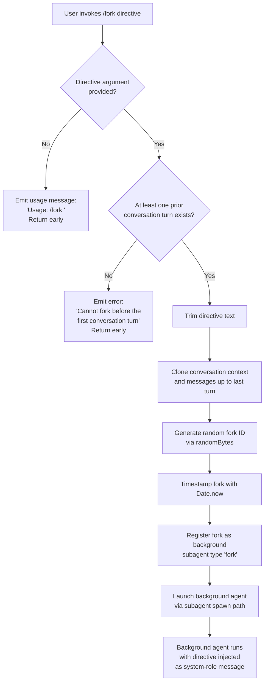

# `/fork`

> Analysis basis: CC v2.1.154 bundle.js (AST extraction + Claude interpretation)
> Minimum version: v2.1.154

---

## Overview

`/fork` spawns a background agent that inherits the full current conversation history and is given an additional directive supplied by the user. The agent runs asynchronously in a separate context (identified as type `"fork"`), allowing the parent session to continue independently while the background agent pursues the directive.

---

## Registration

| Field | Value |
|---|---|
| type | `local-jsx` |
| name | `fork` |
| description | Spawn a background agent that inherits the full conversation |
| argumentHint | `<directive>` |
| module_id | `yHK` |
| load_inline | `true` |
| loc_byte | `12771737` |
| loc_byte_end | `12771933` |
| loc_line | `9998` |
| arbor_handler.name | `Ww5` |
| arbor_handler.fqn | `claude-2.1.154::Ww5` |
| arbor_handler.kind | `AsyncFunction` |
| arbor_handler.resolution_path | `module_id` |
| arbor_handler.n_hits | `0` |

Analysis basis: CC v2.1.154 bundle.js:+12771737

---

## Input Branching

Three distinct branches exist based on whether a directive argument is provided and whether any prior conversation turns exist.



Analysis basis: CC v2.1.154 bundle.js:+12771341, +12771365, +12771405, +12771433, +12771474

---

## Behavioral Spec

### Handler Entry Point — `forkCommandHandler` (`Ww5`)

```
async function forkCommandHandler(args, context):
    directive = args.trim()
    if directive is empty:
        emit("Usage: /fork <directive>")
        return

    conversationMessages = getConversationContext(context)
    if no prior turns exist:
        emit("Cannot fork before the first conversation turn")
        return

    forkId = generateRandomHexId(8 bytes)   // via randomBytes → hex
    timestamp = Date.now()

    forkConfig = buildForkConfig(context, directive, forkId, timestamp)
    launchSubagent(forkConfig)
```

Analysis basis: CC v2.1.154 bundle.js:+12771341 (directive trim), +12771363 (random ID generation), +12771433 (subagent launch via `Zr_`), +12771474 (pre-fork guard literal)

---

### Conversation Context Snapshot — `buildSubagentContext` (`Zr_`)

The handler delegates context preparation to the subagent context builder (`Zr_`), which:

1. Retrieves the current application state via `getAppState`.
2. Calls the REPL context accessor (`getReplContexts`) to get conversation history.
3. Slices messages — the last 50 characters (byte offset constant `50` / `49`) of the conversation ID are used for the fork identifier prefix (Analysis basis: CC v2.1.154 bundle.js:+10692563, +10692576).
4. Generates a random hex session ID (`Kh` → `Gk9.randomBytes`, 8 bytes, hex encoding) for the forked agent.
5. Records `Date.now()` as the fork timestamp.
6. Assigns the launch type string `"fork"` to the subagent registration (Analysis basis: CC v2.1.154 bundle.js:+10692378).
7. Sets the resume mode string `"resume"` (Analysis basis: CC v2.1.154 bundle.js:+10692497).
8. Signals launch type `"subagent_launch"` and validates that a directive is present, otherwise fires `"subagent_fork_prompt_missing"` (Analysis basis: CC v2.1.154 bundle.js:+10692311, +10692329).

```
function buildSubagentContext(parentContext, directive):
    appState = getAppState()
    replContexts = getReplContexts()
    messages = prepareMessages(replContexts)   // truncate / filter via bE1

    forkSessionId = randomBytes(8).toString("hex")
    forkTimestamp = Date.now()

    if directive is missing or empty:
        logEvent("subagent_fork_prompt_missing")
        return null

    logEvent("subagent_launch")
    subagentRecord = {
        type: "fork",
        sessionId: forkSessionId,
        timestamp: forkTimestamp,
        mode: "resume",
        directive: directive,
        messages: messages
    }
    return subagentRecord
```

Analysis basis: CC v2.1.154 bundle.js:+10692291 (`_lL`), +10692308 (`uH`), +10692418 (`getReplContexts`), +10692513 (`p08`), +10692545 (`bE1`), +10692566 (slice), +10692593 (`Kh`), +10692620 (`Date.now`), +10692633 (`peH`)

---

### System Prompt Assembly for Forked Agent — `buildSystemPrompt` (`kT`)

The system prompt builder is the most complex sub-function. It assembles the complete system prompt for the background agent by aggregating multiple components in order:

```
function buildSystemPrompt(config):
    parts = []

    // Core role description
    parts.push(roleText)   // "You are an interactive agent that helps users..."

    // Code style guidance
    parts.push("Write code that reads like the surrounding code...")

    // Environment info (static block)
    envBlock = buildEnvInfoStatic(config)   // JX5
    parts.push(envBlock)

    // Environment info (simple block, e.g. git worktree notice)
    simpleEnv = buildEnvInfoSimple(config)  // jX5
    parts.push(simpleEnv)

    // Language / output style directives
    parts.push(languageDirective)           // "language" key
    parts.push(outputStyleDirective)        // "output_style" key

    // Background-session marker
    parts.push("bg-session")               // marks this as background

    // Scratchpad, context management, brief mode
    if briefEnabled(config):               // TX5 → oJ5.isBriefEnabled
        parts.push(briefSection)

    // Reproduce/verify workflow
    parts.push(reproduceVerifySection)     // "reproduce_verify_workflow"

    // Memory / CLAUDE.md sections
    memoryPrompt = buildCombinedMemoryPrompt(config)   // az6 → WK7
    parts.push(memoryPrompt)

    // Tool permission context
    toolContext = buildToolContext(config)              // $X5
    parts.push(toolContext)

    // MCP / plugin tool list
    mcpTools = buildMcpToolList(config)                // IG8

    // Env and feature flags (growthbook)
    parts.push(envFeatureFlags)            // "env" / "growthbook" keys

    return joinParts(parts)
```

Key sub-components:

- **`buildEnvInfoStatic` (`JX5`)**: Includes a static environment description block. Contains the literal string `"Claude Code is available as a CLI in the terminal, desktop app (Mac/Windows), web app (claude.ai/code), and IDE extensions (VS Code, JetBrains)."` and fast-mode description. Ends with `"# Environment"` heading. Analysis basis: CC v2.1.154 bundle.js:+13084676, +13087501, +13087910, +13088064, +13088269
- **`buildEnvInfoSimple` (`jX5`)**: Emits a git-worktree notice (`"This is a git worktree — an isolated copy of the repository..."`) when applicable, and `"Additional working directories:"` if relevant. Analysis basis: CC v2.1.154 bundle.js:+13084713, +13086477, +13086675
- **`buildWorktreeSection` (`PX5`)**: Handles worktree path joining (`Y_K.join`), emitting `"worktree"` / `"tmp"` labels. Analysis basis: CC v2.1.154 bundle.js:+13084811, +13091003, +13091338, +13092263
- **`buildMemorySection` (`az6`)**: Reads memory from disk, checks team memory enablement (`QEH.isTeamMemoryEnabled`, `QEH.getTeamMemPath`), and calls `WK7.buildCombinedMemoryPrompt`. Fires telemetry events `tengu_moth_copse`, `tengu_memdir_disabled`, `tengu_herring_clock`, `tengu_team_memdir_disabled`. Analysis basis: CC v2.1.154 bundle.js:+3298463, +3298489, +3299093
- **`buildToolPermissionSection` (`$X5`)**: Assembles tool permission guidance. References `"schedule"` and `"routines"` sections (Analysis basis: CC v2.1.154 bundle.js:+13079494, +13079518), `"# Session-specific guidance"` heading (Analysis basis: CC v2.1.154 bundle.js:+13082322), and `"Only use emojis if the user explicitly requests it."` (Analysis basis: CC v2.1.154 bundle.js:+13082394).
- **Model reference**: The default model string `"claude-opus-4-7"` appears in the context path (`iqA`) for the background agent. Analysis basis: CC v2.1.154 bundle.js:+13093468

---

### Background Agent Launch — `launchSubagent` (`peH`)

After context preparation, the handler launches the background agent via the subagent execution path:

```
async function launchSubagent(subagentRecord):
    // Create session directories
    mkdir(subagentDir)             // WqA → Bs.mkdir
    createSymlink(subagentDir)     // Bs.symlink, error-handling EEXIST
    openTranscriptFile(subagentDir) // utH → Bs.open

    // Set up abort controller
    abortController = new AbortController()  // ny → C1

    // Register the agent in the local agent registry
    registry.register(subagentRecord)   // K.register

    // Initialize agent execution context (ME, EM, J2)
    // Spawn the agent process
    spawnAgent(subagentRecord, abortController)

    return subagentRecord.id
```

Analysis basis: CC v2.1.154 bundle.js:+10240387 (`ahH`), +10240393 (`ME`), +10240412 (`ny`), +10240429 (`J2`), +10240745 (`K.register`)

Error codes handled during directory creation: `"EEXIST"`, `"ENOSPC"`, `"EDQUOT"` (Analysis basis: CC v2.1.154 bundle.js:+12948181, +12948276, +12948290)

---

### Message Filtering for Fork (`p08` and helpers)

Before copying conversation history to the forked agent, messages are filtered through a pipeline:

```
function filterMessagesForFork(messages):
    result = []
    for message in messages:
        if message.role == "assistant":
            // include assistant turns — AIL filter
        if message.role == "user":
            // include user turns
        if message.type == "tool_use":
            // include tool use blocks
        if message.type == "tool_result":
            // include completed tool results
            // skip if status == "err"
        result.push(filtered)
    return result
```

Analysis basis: CC v2.1.154 bundle.js:+9390279 (`p08`), +9389697 (`"tool_use"`), +9389856 (`"tool_result"`), +9389901 (`"err"`), +9390367 (`"assistant"`), +9390389 (`"user"`)

---

### Subagent Lifecycle Management (`krH`)

Once spawned, the background agent is tracked through a lifecycle state machine:

```
states: "pending" → "running" → "completed" | "failed" | "cancelled"

function manageSubagentLifecycle(agent):
    agent.status = "pending"
    startWatchdog(timeout=600000ms, checkInterval=10)  // 10 min stall timeout
    agent.status = "running"

    on completion:
        logEvent("subagent_complete")
        updateStatus("completed")

    on stall timeout:
        logEvent("subagent_stall_timeout")  // tengu_async_agent_stall_timeout

    on user kill:
        logEvent("user_kill_async")
        agent.status = "cancelled"

    on error:
        logEvent("subagent_async_errored")
        agent.status = "failed"
```

Analysis basis: CC v2.1.154 bundle.js:+6731967 (interval=10), +6731972 (timeout=600000), +6733100 (`"subagent_complete"`), +6733120 (`"subagent_stall_timeout"`), +6734767 (`"cancelled"`), +6735232 (`"subagent_async_errored"`)

The watchdog fires `tengu_async_agent_stall_timeout` when no progress is detected within the timeout window. Analysis basis: CC v2.1.154 bundle.js:+6732863

---

### Safety Classifier Check (`O38` / `mP6`)

Before the forked agent's output is surfaced to the parent, an auto-mode safety classifier runs:

```
function runSafetyClassifier(agentOutput):
    result = classifyOutput(agentOutput)  // mP6

    if classifier unavailable:
        logEvent("tengu_auto_mode_decision")
        warn user: "Note: The safety classifier was unavailable..."
        return "allow_with_warning"

    switch result.decision:
        case "success":   return "allow"
        case "blocked":   return "block"
        case "interrupted": return "cancelled"
        case "transcript_too_long": return "block"
```

Key literals: `"Handoff classifier unavailable, allowing sub-agent output with warning"` (Analysis basis: CC v2.1.154 bundle.js:+6731038), `"Note: The safety classifier was unavailable when reviewing this sub-agent's work..."` (Analysis basis: CC v2.1.154 bundle.js:+6731127).

Analysis basis: CC v2.1.154 bundle.js:+6730231 (`O38`), +6730264 (`mP6`), +6730605 (`tengu_auto_mode_decision`)

---

## State & Side Effects

| Item | Detail |
|---|---|
| Telemetry — launch guard | `tengu_slate_harrier` (CC v2.1.154 bundle.js:+13093676) |
| Telemetry — subagent launch | `"subagent_launch"` literal string (CC v2.1.154 bundle.js:+10692311) |
| Telemetry — missing directive | `"subagent_fork_prompt_missing"` literal (CC v2.1.154 bundle.js:+10692329) |
| Telemetry — stall timeout | `tengu_async_agent_stall_timeout` (CC v2.1.154 bundle.js:+6732863) |
| Telemetry — agent summary skipped | `tengu_agent_summary_skipped` (CC v2.1.154 bundle.js:+9297006) |
| Telemetry — tool completed | `tengu_agent_tool_completed` (CC v2.1.154 bundle.js:+6728962) |
| Telemetry — tool terminated | `tengu_agent_tool_terminated` (CC v2.1.154 bundle.js:+6734791) |
| Telemetry — auto mode decision | `tengu_auto_mode_decision` (CC v2.1.154 bundle.js:+6730605) |
| Telemetry — default turns exceeded | `tengu_forked_agent_default_turns_exceeded` (CC v2.1.154 bundle.js:+10668214) |
| Telemetry — cache eviction | `tengu_cache_eviction_hint` (CC v2.1.154 bundle.js:+6729505) |
| Telemetry — subagent completed | `"subagent_completed"` literal (CC v2.1.154 bundle.js:+6729243) |
| Telemetry — memory prompt | `tengu_moth_copse`, `tengu_memdir_disabled`, `tengu_herring_clock`, `tengu_team_memdir_disabled` |
| Telemetry — system prompt variants | `tengu_orchid_mantis_v2`, `tengu_orchid_mantis`, `tengu_heron_brook`, `tengu_sparrow_ledger`, `tengu_verified_vs_assumed` |
| Telemetry — slim subagent claudemd | `tengu_slim_subagent_claudemd` (CC v2.1.154 bundle.js:+9286925) |
| Filesystem | Creates subagent session directory via `Bs.mkdir`; creates symlink via `Bs.symlink`; opens transcript file via `Bs.open`; writes `.meta.json` and `.jsonl` files |
| appState changes | Registers forked agent in local agent registry (`K.register`); updates agent status through `"pending"` → `"running"` → terminal state |
| Background process | Spawns a `local_agent` typed background process; registers with `"general-purpose"` designation |
| AbortController | Creates a new `AbortController` for the forked session; registers abort listener |
| Watchdog timer | Sets `setTimeout` with 600,000 ms (10 min) stall detection; clears on normal completion |
| Tracing | Creates OpenTelemetry span `"claude_code.subagent.spawn"` via `"subagent.spawn"` span type |
| Sound | None observed in depth-2 traversal |

---

## Version History

| Version | Change |
|---|---|
| v2.1.154 | Initial analysis |

---

## Common Mistakes

1. **Invoking `/fork` before any conversation turn** — The guard at CC v2.1.154 bundle.js:+12771474 returns the error `"Cannot fork before the first conversation turn"`. Always issue at least one message exchange before forking.
2. **Omitting the directive argument** — Without a `<directive>` argument the command emits `"Usage: /fork <directive>"` and exits immediately (CC v2.1.154 bundle.js:+12771365). The directive is mandatory.
3. **Expecting synchronous output** — The forked agent runs as a background `local_agent`. Its results are not immediately visible; they arrive asynchronously and may be subject to the safety classifier review before surfacing.
4. **Ignoring the safety-classifier caveat** — When the classifier is unavailable, the forked agent's output is still surfaced but with a warning. Do not dismiss this warning without manually reviewing the agent's actions.
5. **Assuming the fork inherits live tool permissions** — The tool permission context (`$X5`) is rebuilt from scratch for the forked agent using snapshot state; any tool permissions granted interactively after the fork point are not automatically inherited.
6. **Long-running forks hitting the stall timeout** — The watchdog fires after 600,000 ms (10 minutes) of detected stall. Ensure the directive does not result in an agent that blocks indefinitely waiting for external input.

---

## Appendix — Identifier Mapping

> For bundle debugging only. Identifiers change across versions.

| Identifier | Role |
|---|---|
| `Ww5` | Main fork command async handler (entry point) |
| `Zr_` | Build subagent context / conversation snapshot |
| `_lL` | Inner subagent context resolver |
| `Z_` | App state accessor for conversation history |
| `jE8` | Allowed-tools settings reader |
| `JE8` | Disallowed-tools settings reader |
| `kT` | System prompt builder (aggregates all sections) |
| `dqA` | Role text selector |
| `C6` | Configuration helper |
| `IG8` | MCP/plugin tool list builder |
| `i_` | Tool permission injector |
| `aJ5` | Code-style guidance builder |
| `sJ5` | Code-style alternate guidance builder |
| `iqA` | Model configuration resolver (references `"claude-opus-4-7"`) |
| `vX5` | Model config wrapper |
| `$X5` | Tool permission section builder |
| `az6` | Memory / CLAUDE.md section builder |
| `JX5` | Static environment info block builder |
| `jX5` | Simple environment info block builder (worktree notices) |
| `PX5` | Worktree path section builder |
| `WX5` | Additional working directories section builder |
| `TX5` | Brief-mode section controller |
| `VX5` | Focus/context section builder |
| `YX5` | Env feature flag section builder |
| `eJ5` | Tone/style guidance builder |
| `cV9` | Computed context value resolver |
| `qX5` | System section builder |
| `KX5` | Task guidance section builder |
| `LX5` | Tool-listing section (delegates to `iqA`) |
| `fX5` | Tool usage guidance section builder |
| `OX5` | Reproduce/verify workflow section builder |
| `BFq` | Memory prompt post-processor |
| `GzH` | Provider/party type classifier |
| `su` | Main-thread agent runner setup |
| `Kh` | Random bytes generator (fork session ID) |
| `peH` | Background agent launcher |
| `ahH` | Subagent directory and symlink creator |
| `Qy8` | Active subagent set tracker (add/delete) |
| `WqA` | Subagent directory mkdir helper |
| `N3` | Subagent transcript path resolver |
| `utH` | Subagent file opener (transcript) |
| `ME` | Agent process environment builder |
| `ny` | Abort controller factory |
| `J2` | Subagent timestamp / path recorder |
| `krH` | Subagent lifecycle state machine / watchdog |
| `gP6` | Per-turn agent execution controller |
| `u0` | Turn execution inner loop |
| `Z8` | UUID generator for turns |
| `Ff1` | App state updater for agent |
| `FP6` | Agent progress updater |
| `i7H` | Agent state notification handler |
| `NrH` | Message filter helper |
| `DK` | Message text-content filter |
| `RkH` | Tool-cache resolver |
| `WK` | Recursive tool cache lookup |
| `VjH` | Tool completion notifier |
| `NSH` | Tool result classifier (search/read) |
| `dP6` | Agent state discard updater |
| `r7H` | Progress query handler |
| `$38` | Combined progress updater |
| `GrH` | Task progress telemetry emitter |
| `f38` | Main per-turn subagent runner |
| `fE` | Last-assistant-message finder |
| `O38` | Safety classifier orchestrator |
| `mP6` | Safety classifier core logic |
| `Eh` | Full REPL session runner (subagent main loop) |
| `E6` | Tool/event emission router |
| `QM8` | Token/timing measurement helper |
| `cN9` | Cache-state getter/setter |
| `dN9` | Timing delta calculator |
| `Fn7` | Timing push tracker |
| `p08` | Message filtering pipeline for fork |
| `AIL` | Assistant-turn message filter |
| `qIL` | User-turn message filter |
| `_IL` | Code-block message filter |
| `KIL` | Tool-result message filter |
| `bE1` | Message trimmer |
| `io` | Model resolution / routing dispatcher |
| `VZ` | Model type mapper |
| `e9` | Model alias resolver |
| `Di6` | ARN model ID parser |
| `Hw` | Provider type detector |
| `FN9` | Model capability checker |
| `BN9` | Model routing resolver |
| `gp` | Combined model+provider resolver |
| `vcL` | Core agent query loop (calls model) |
| `au` | Subagent execution entry / tear-down |
| `if8` | Subagent exit state cleaner |
| `C7H` | MCP monitor task builder |
| `Y5H` | Subagent prompt assembler |
| `gX` | Full agent execution orchestrator |
| `aZ6` | Agent session bootstrapper |
| `D7` | Agent model config loader |
| `Mg_` | Context reference builder (`"fork-context-ref"`) |
| `U4` | Conversation snapshot serializer |
| `HAH` | Context hydration helper |
| `JSH` | Conversation filter for hydration |
| `oZ6` | Agent metadata file writer (`.meta.json`, `.jsonl`) |
| `A6` | Bridge/REPL connection manager |
| `fH` | Transport message handler |
| `L1A` | Bridge transport layer (CCR v2) |
| `iH` | Transport connect/data/close handler |
| `M6` | Bridge session scheduler |
| `jk9` | OpenTelemetry span initializer for subagent |
| `XjH` | Tracing context setter |
| `Uk_` | Tool-filter applicator (for auto-mode) |
| `ao` | Auto-mode tool decision runner |
| `y0` | CLI/remote origin classifier |
| `Kg_` | Tool-set membership manager |
| `Q` | File read/unlink queue for transcripts |
| `DN6` | Transcript file reader |
| `rI1` | Transcript file unlinker |
| `yH` | Shared context emitter |
| `uH` | Context state accessor |
| `xH` | String coercion utility |
| `ZH` | String converter |
| `hH` | Error push/log helper |
| `N` | Message text builder / formatter |
| `RH` | JSON stringify wrapper |
| `Eq` | UUID generator |
| `Kh` | `crypto.randomBytes` wrapper |
| `SX` | Text render helper |
| `OL` | Output line formatter |
| `E6` | Event router |
| `ov` | Config option reader |
| `tw` | Hook type checker |
| `mKH` | Hook set membership checker |
| `pN9` | MCP tool name set builder |
| `cK` | Config key reader (`ov`-based) |
| `IJ` | Tool lookup by name |
| `ghH` | Tool list sorter |
| `lNL` | Prompt command resolver |
| `beH` | Prompt command base resolver |
| `K9` | String index/slice helper |
| `QNL` | Full session initialization (MCP, flags, hooks) |
| `S7H` | Tool-search decision maker |
| `Jk` | Standard tool-search enabler |
| `I7H` | Vertex AI tool-search disabler |
| `ehH` | Tool-search some-checker |
| `_d_` | Deferred tool pool manager |
| `K08` | New subagent app-state factory |
| `q08` | MCP and tool context assembler |
| `QE_` | Tool token budget calculator |
| `tNH` | Retry backoff calculator |
| `uG` | Model+origin pair resolver |
| `yD1` | MCP version gate cache |
| `Uf1` | State field reader |
| `QX` | State key extractor |
| `kSH` | State key resolver |
| `fg_` | Hook-event dispatcher |
| `dNL` | Dynamic notification listener |
| `xj6` | Subagent tracing context injector |
| `iwH` | Subagent context inheritance helper |
| `ZkH` | MCP connection update timer |
| `Wk` | MCP connection state key resolver |
| `mN9` | MCP monitor status object builder |

---

Note: index built via Arbor fallback; some signals (telemetry, literals) may be missing — see arbor-fallback.js.