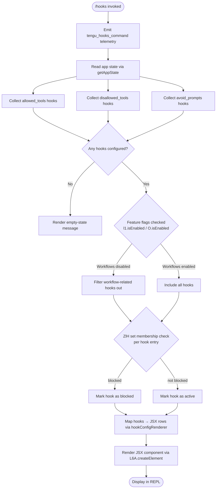

# `/hooks`

> Analysis basis: CC v2.1.154 bundle.js (AST extraction + Claude interpretation)
> Minimum version: v2.1.154

---

## Overview

The `/hooks` command displays the current hook configurations that govern how Claude Code responds to tool lifecycle events (pre-tool, post-tool, notification, etc.). It reads the active app state, classifies each configured hook by its policy category (`allowed_tools`, `disallowed_tools`, `avoid_prompts`), and renders the results as a JSX component inline in the REPL — making hook configuration immediately inspectable without leaving the session.

---

## Registration

| Field | Value |
|---|---|
| type | `local-jsx` |
| name | `hooks` |
| description | `View hook configurations for tool events` |
| immediate | `true` |
| module_id | `id1` |
| load_inline | `true` |
| loc_byte | `12182374` |
| loc_byte_end | `12182524` |
| loc_line | `9093` |
| arbor_handler.name | `ML5` |
| arbor_handler.fqn | `claude-2.1.154::ML5` |
| arbor_handler.kind | `AsyncFunction` |
| arbor_handler.resolution_path | `module_id` |
| arbor_handler.n_hits | `0` |

Analysis basis: CC v2.1.154 bundle.js:+12182374

---

## Input Branching

The command evaluates several independent conditions before rendering, producing more than three distinct execution paths. A Mermaid flowchart is used.



---

## Behavioral Spec

### 1. Command Entry & Telemetry

When the user types `/hooks`, the async handler `ML5` is invoked immediately (registration field `immediate: true`). The very first action is emitting the `tengu_hooks_command` event so all downstream analytics are attributed to this interaction.

```
async function hooksCommandHandler(context):
    emitTelemetry("tengu_hooks_command")          // bundle.js:+12182174
    appState = readAppState()                      // via getAppState
    hookSections = collectHookSections(appState)
    rendered = buildJSXView(hookSections, context)
    return rendered
```

Analysis basis: CC v2.1.154 bundle.js:+12182172–12182244

---

### 2. App-State Read (`readAppState`)

The handler calls the shared app-state accessor (resolved through `Z_` → `H.getAppState`). This is a synchronous read of the in-memory global state; no disk I/O is performed at this step.

```
function readAppState():
    return globalAppState.getAppState()           // bundle.js:+10669336
```

Analysis basis: CC v2.1.154 bundle.js:+12182206

---

### 3. Hook Section Collection (`collectHookSections`)

Three named hook-policy buckets are extracted from app state. Each bucket is keyed by a string literal constant present in the bundle:

- `"allowed_tools"` (bundle.js:+10669444)
- `"disallowed_tools"` (bundle.js:+10669499)
- `"avoid_prompts"` (bundle.js:+10669560)

Additionally, two metadata fields are read: `"effort"` (bundle.js:+10669662) and `"model"` (bundle.js:+10669675), which may influence display annotations.

```
function collectHookSections(appState):
    sections = {
        allowedTools:    appState["allowed_tools"],    // +10669444
        disallowedTools: appState["disallowed_tools"], // +10669499
        avoidPrompts:    appState["avoid_prompts"],    // +10669560
        effort:          appState["effort"],           // +10669662
        model:           appState["model"]             // +10669675
    }
    return sections
```

Analysis basis: CC v2.1.154 bundle.js:+10669444–10669675

---

### 4. Hook View Builder (`buildJSXView` / `Pv`)

`Pv` is the primary rendering function called by `ML5`. It orchestrates multiple sub-steps:

1. Calls the string-formatting helper (`xH`) to build header text.
2. Calls `y0` to resolve the display context (`"cli"` vs `"remote"`, bundle.js:+4704724–4704735).
3. Calls `AAH` to filter the hook list, removing hooks whose names appear in the blocked set.
4. Calls `XQ_` and `q4` to resolve platform-specific display logic (Windows path handling is gated on `"windows"`, bundle.js:+4806343).
5. Calls `ta` for the hook-table layout component.
6. Checks feature-flag membership via `l1.isEnabled` (bundle.js:+9607699) and `O.isEnabled` (bundle.js:+9607829).
7. Filters hooks further with `K.filter` and `K.map` (bundle.js:+9607775, +9607818).
8. Checks `ZlH.has` (bundle.js:+9607790) to determine if individual hooks are in a blocked/suppressed set.
9. Assembles child elements with `z.push` and calls `L6A.createElement` to produce the final JSX tree.

```
function buildJSXView(sections, context):
    headerText   = formatString(sections)               // xH, +9607281
    displayCtx   = resolveDisplayContext(context)       // y0, +9607320
    // "cli" or "remote"

    hookList     = filterBlockedHooks(sections.hooks)   // AAH, +9607443
    hookList     = applyPlatformFilter(hookList)        // XQ_ + q4, +9607458
    tableLayout  = buildHookTable(hookList)             // ta, +9607630

    workflowsOn  = featureFlag("l1").isEnabled()        // +9607699
    if not workflowsOn:
        hookList = hookList.filter(not workflowRelated) // K.filter, +9607775

    rows = []
    for hook in hookList:                               // K.map, +9607818
        enabled = featureFlag("O").isEnabled()          // +9607829
        blocked = blockedSet.has(hook.id)               // ZlH.has, +9607790
        rows.push(renderHookRow(hook, enabled, blocked))

    children = [headerText, tableLayout, ...rows]       // z.push, +9607530
    return createElement(HooksViewComponent, children)  // L6A.createElement, +12182244
```

Analysis basis: CC v2.1.154 bundle.js:+9607281–9607871

---

### 5. Hook Filtering (`filterBlockedHooks` / `AAH`)

`AAH` uses `H.filter` over the hook entries and delegates each membership test to `ZE6`. The `ZE6` function calls `y5H` (which uses `CZ8.flatMap`, bundle.js:+10382730) to enumerate all known hook names, and `Qn_` to classify each entry. The classification strings `"deny"` (bundle.js:+10382807), `"cliArg"` (bundle.js:+10383393), and `"toolsNarrowing"` (bundle.js:+10383414) represent distinct permission categories.

```
function filterBlockedHooks(hooks):
    allKnownHooks = flatMapHookRegistry()          // y5H via CZ8.flatMap, +10382730
    return hooks.filter(hook =>
        classifyHook(hook, allKnownHooks) != "blocked"  // +9606696
    )
```

Analysis basis: CC v2.1.154 bundle.js:+9606635–9606696

---

### 6. Hook Table Renderer (`buildHookTable` / `ta`)

`ta` is a substantial sub-component that:

- Calls `q4` (platform path resolver, bundle.js:+9606011).
- Uses `SX` for string-width computation (bundle.js:+9606027), with SDK-type strings `"sdk-ts"`, `"sdk-py"`, `"sdk-cli"`, `"local-agent"` (bundle.js:+5234420–5234463) used as display-type labels.
- Uses `zw` for value serialization (bundle.js:+9606148).
- Calls `xH` for formatted output lines (bundle.js:+9606241).
- Calls `aeH` for additional annotation (bundle.js:+9606312).
- Invokes `JQ_` for hook-source attribution (bundle.js:+9606331).
- Calls `S9` to handle `--agent-teams` flag-related display (bundle.js:+9606372; literal `"--agent-teams"` at +5362359).
- Calls `KhL` and `LhL` for two distinct hook-category subtable renderers (bundle.js:+9606378, +9606384).
- Calls `XQ_` again for final output wrapping (bundle.js:+9606523).
- Calls `Jk` for capability-check display annotations (bundle.js:+9606591), which internally handles provider strings `"bedrock"`, `"foundry"`, `"anthropicAws"`, `"mantle"`, `"vertex"` (bundle.js:+2044343–2044551).

```
function buildHookTable(hookList):
    platformPaths = resolvePlatformPaths()          // q4, +9606011
    for hook in hookList:
        label    = computeStringWidth(hook.name)    // SX, +9606027
        value    = serializeValue(hook.config)      // zw, +9606148
        line     = formatOutputLine(label, value)   // xH, +9606241
        annotate(line)                              // aeH, +9606312
        source   = attributeHookSource(hook)        // JQ_, +9606331
        if hook.agentTeams:
            renderAgentTeamsFlag(hook)              // S9, +9606372
        allowedSubtable    = renderAllowedSection(hook)    // KhL, +9606378
        disallowedSubtable = renderDisallowedSection(hook) // LhL, +9606384
    wrappedOutput = wrapOutput(lines)               // XQ_, +9606523
    capabilities  = renderCapabilityAnnotations()   // Jk, +9606591
    return assembleTable(wrappedOutput, capabilities)
```

Analysis basis: CC v2.1.154 bundle.js:+9606011–9606591

---

### 7. Daemon Status Integration (`hookConfigRenderer` / `E2H`)

`E2H` reads daemon status file `"daemon.status.json"` (bundle.js:+12434505) via the path-join helper `MI6`. It handles `ENOENT` (bundle.js:+12618851) gracefully — if no status file exists the view still renders. The supervisor label `"supervisor"` (bundle.js:+15492299) and column-padding width of `40` characters (bundle.js:+15504339) are used in the display grid.

```
function hookConfigRenderer(daemonStatusPath):
    try:
        raw = readFile(join(daemonStatusPath, "daemon.status.json"))  // +12434505
        status = parseJSON(raw)
    catch ENOENT:                                                      // +12618851
        status = null
    grid = buildConfigGrid(status, padWidth=40)                        // +15504339
    labelCol = "supervisor"                                            // +15492299
    return renderGrid(grid, labelCol)
```

Analysis basis: CC v2.1.154 bundle.js:+12618818–12619152

---

### 8. JSX Element Creation

The final step in `ML5` calls `L6A.createElement` with the assembled children array to produce a React/Ink-compatible JSX element that the REPL renders inline.

```
function hooksCommandHandler(context):
    // ... (steps 1–7 above)
    return L6A.createElement(HooksViewComponent, props, ...children)
    // bundle.js:+12182244
```

Analysis basis: CC v2.1.154 bundle.js:+12182244

---

## State & Side Effects

| Item | Detail |
|---|---|
| Telemetry | `tengu_hooks_command` (+12182174) — fired on every invocation of `/hooks` |
| Telemetry (indirect) | `tengu_slate_harbor` (+4704754) — fired during display-context resolution (`y0`) |
| Telemetry (indirect) | `tengu_workflows_enabled` (+4106475) — fired during workflow feature-flag check |
| Telemetry (indirect) | `tengu_cobalt_ridge` (+4806437) — fired during platform-filter path (`nR`) |
| Telemetry (indirect) | `tengu_feature_ok` (+965176) — fired when a feature check passes (`yH`) |
| Telemetry (indirect) | `tengu_feature_bad` (+965234) — fired when a feature check fails (`uH`) |
| Telemetry (indirect) | `tengu_daemon_control` (+15514441) — fired during daemon-state rendering (`vy`) |
| Telemetry (indirect) | `tengu_daemon_config_reload` (+15493092) — fired if daemon config is reloaded as a side-effect (`Y`) |
| Telemetry (indirect) | `tengu_amber_flint` (+5362471) — fired during agent-teams capability check (`S9`) |
| appState changes | Read-only; `/hooks` does not mutate app state |
| Daemon status file | Reads `daemon.status.json` from the status path (no write) |
| Hook registration | None; `/hooks` only reads hook config, does not register new hooks |
| Sound | None observed in depth-2 traversal |
| JSX output | Inline REPL render via `L6A.createElement` (+12182244) |

---

## Version History

| Version | Change |
|---|---|
| v2.1.154 | Initial analysis |

---

## Common Mistakes

1. **Expecting editable output**: `/hooks` is a read-only viewer. It renders the current hook configuration but provides no interactive editing. To change hooks, edit the relevant config file and re-run.
2. **Assuming all hooks are shown when workflows are off**: When the `l1` feature flag reports workflows as disabled, workflow-related hooks are silently filtered out of the view. The rendered list may appear shorter than the raw config.
3. **Confusing "blocked" with "disallowed_tools"**: The `blocked` status (determined by `ZlH.has`) is a runtime suppression flag distinct from the `disallowed_tools` configuration bucket. A hook can be in `allowed_tools` yet still appear blocked at runtime.
4. **Expecting daemon hooks without a running daemon**: If `daemon.status.json` is absent (`ENOENT`), that section of the view renders gracefully as empty — not as an error. This is expected behavior when the background daemon is not running.
5. **Invoking `/hooks` from a non-CLI context**: The command resolves display context as either `"cli"` or `"remote"`. In remote or SDK-driven sessions (`"sdk-ts"`, `"sdk-py"`, `"sdk-cli"`, `"local-agent"`), some formatting paths may differ or certain hook categories may not be displayed.

---

## Appendix — Identifier Mapping

> For bundle debugging only. Identifiers change across versions.

| Identifier | Role |
|---|---|
| `ML5` | Main async handler for `/hooks` command (arbor_handler) |
| `c` | Shared telemetry emit helper |
| `Z_` | App-state reader wrapper |
| `H` | Global app-state / event-emitter object |
| `jE8` | `allowed_tools` hook-section extractor |
| `aA` | Hook-entry base constructor / normalizer |
| `JE8` | `disallowed_tools` hook-section extractor |
| `Pv` | Primary JSX view builder for hooks display |
| `xH` | String formatting / text-line helper |
| `y0` | Display-context resolver (`"cli"` / `"remote"`) |
| `gQ` | Context-type constant provider |
| `v1` | String coercion / value-to-string utility |
| `E6` | Hook-registry lookup and registration helper |
| `hz6` | Hook registry store initializer |
| `Sz6` | Secondary registry initializer |
| `Mx` | Hook-entry formatter |
| `y88` | Deduplication / seen-set manager for hook entries |
| `b6` | Hook-entry timestamp and metadata builder |
| `Y` | Daemon config manager / supervisor state handler |
| `E2H` | Daemon-status file reader and grid renderer |
| `o9` | Async-storage (AsyncLocalStorage) accessor |
| `J8` | Error-code constant provider (`ENOENT` handler) |
| `S_A` | Daemon status path helper |
| `ZH` | String coercion utility (daemon context) |
| `K` | Hook-column layout / map-pad helper |
| `q` | File writer / unlink helper |
| `Lt1` | Column-width calculator (`Math.max` based) |
| `f` | File handle manager (open/close/get/set) |
| `A` | File-name lower-case normalizer |
| `L` | Async file-operation queue (add/delete/finally) |
| `T` | Stop-signal / interrupt handler |
| `b` | Event with `preventDefault` (keyboard/signal event) |
| `Z0` | User-settings writer |
| `E` | Watcher/monitor with start/stop/updateConfig |
| `QEK` | Heartbeat scheduler |
| `hHH` | Heartbeat tick handler |
| `V` | Secondary watcher start helper |
| `JQ_` | Hook-source attribution renderer |
| `G_` | Module-export binder / `__esModule` setter |
| `MR6` | Module method binder |
| `k0` | Feature-flag compound evaluator |
| `$18` | Feature-flag string formatter |
| `gE` | Feature-flag store accessor |
| `A89` | Workflow-feature flag evaluator |
| `v9` | `allow_product_feedback` flag checker |
| `fP_` | `allow_workflows` flag evaluator |
| `gX7` | Workflow-flag detail renderer |
| `FX7` | Feature-flag fallback handler |
| `AAH` | Hook list filter (removes blocked entries) |
| `ZE6` | Hook-classification dispatcher |
| `y5H` | Hook-registry flat-mapper |
| `Qn_` | Individual hook classifier (`deny`/`cliArg`/`toolsNarrowing`) |
| `c01` | Hook-classification result builder |
| `XQ_` | Platform-aware output wrapper |
| `nR` | Windows-platform path resolver |
| `q4` | Platform-path resolver (cross-platform) |
| `z` | JSX children accumulator array |
| `yH` | Feature-ok path emitter |
| `uH` | Feature-bad path emitter |
| `vy` | Daemon-control event emitter |
| `fx` | Hook runner / event dispatcher |
| `yEH` | Hook event-type resolver |
| `Mz_` | Hook instance creator (UUID-based) |
| `km` | Graceful-shutdown orchestrator (`Promise.race`) |
| `nQ` | IKH shutdown caller |
| `aQ` | Timeout-clear helper |
| `Q8` | Abort/timeout-with-error helper |
| `ta` | Hook table layout component |
| `SX` | String-width / display-width calculator |
| `zw` | Value serializer for table cells |
| `aeH` | Row annotation helper |
| `S9` | `--agent-teams` flag display handler |
| `Qu7` | Agent-teams value formatter |
| `KhL` | Allowed-hooks subtable renderer |
| `LhL` | Disallowed-hooks subtable renderer |
| `Jk` | Capability-check annotation renderer |
| `Tc_` | Thinking-mode / standard-mode selector |
| `N` | Provider-type display router |
| `GA` | Provider-label formatter |
| `R5` | Remaining-capacity indicator |
| `y4` | Boolean-flag display helper |
| `O` | Secondary feature-flag checker (`.isEnabled`) |
| `k8` | Feature-flag registry store |
| `$` | Includes-check wrapper for hook suppression |
| `bo1` | Daemon status JSON reader |
| `Si` | Status timestamp formatter |
| `MI6` | `daemon.status.json` path joiner |
| `RH` | JSON-stringify wrapper |

---

Note: index built via Arbor fallback; some signals (telemetry, literals) may be missing — see arbor-fallback.js.