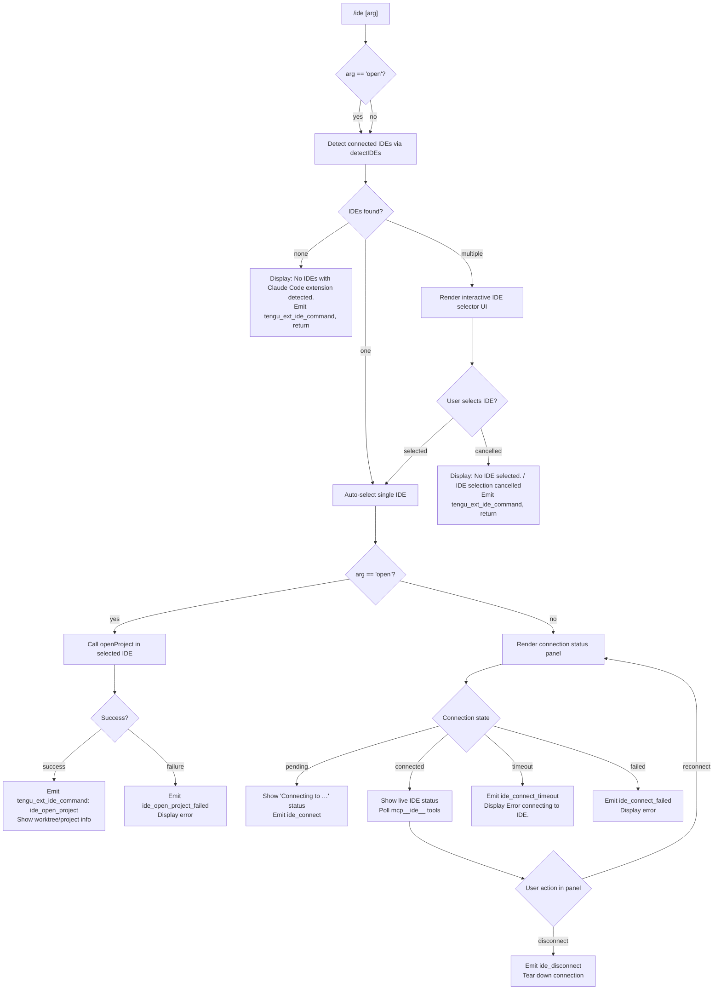

# `/ide`

> Analysis basis: CC v2.1.154 bundle.js (AST extraction + Claude interpretation)
> Minimum version: v2.1.154

---

## Overview

The `/ide` command manages IDE integrations for Claude Code, allowing users to detect connected IDE instances (VS Code, Cursor, Windsurf, JetBrains family), select a target IDE, open the current project in it, and monitor connection status. It renders a JSX-based interactive UI component (`local-jsx` type) that reflects the live connection state and exposes an optional `open` sub-command argument to trigger project-opening directly.

---

## Registration

| Field | Value |
|---|---|
| type | `local-jsx` |
| name | `ide` |
| description | `Manage IDE integrations and show status` |
| argumentHint | `[open]` |
| module_id | `Uh1` |
| load_inline | `true` |
| loc_byte | `11300054` |
| loc_byte_end | `11300210` |
| loc_line | `7846` |
| arbor_handler.name | `qeL` |
| arbor_handler.fqn | `claude-2.1.154::qeL` |
| arbor_handler.kind | `AsyncFunction` |
| arbor_handler.resolution_path | `module_id` |
| arbor_handler.n_hits | `0` |

Analysis basis: CC v2.1.154 bundle.js:+11300054

---

## Input Branching

The command exhibits 4+ distinct branches based on the argument value, IDE detection state, connection outcome, and user selection, so a Mermaid flowchart is used.



Analysis basis: CC v2.1.154 bundle.js:+11296168 (handler entry `qeL`), +11296276 (`"open"` literal), +11296385 (no-IDE message), +11296523 (no-selection message), +11298273 (`ide_connect`), +11298966 (`ide_disconnect`)

---

## Behavioral Spec

### Top-Level Handler (`qeL`)

The Arbor-resolved handler `qeL` (AsyncFunction, resolved via `module_id → Uh1`) is the command's main entry point.

```
async function ideCommandHandler(args, appState):
    emit telemetry("tengu_ext_ide_command", {phase: "enter"})

    // Parse argument
    subCommand = args[0]   // "open" or undefined

    // IDE detection
    detectedIDEs = await detectIDEs(appState)   // calls wiH / detectIDEsWithStatus

    if detectedIDEs is empty:
        display("No IDEs with Claude Code extension detected.")
        emit telemetry("tengu_ext_ide_command")
        return

    // IDE selection
    if detectedIDEs.length == 1:
        selectedIDE = detectedIDEs[0]
    else:
        selectedIDE = await promptIDESelector(detectedIDEs)
        if selectedIDE is null:
            display("No IDE selected.")
            return

    if subCommand == "open":
        await openProjectInIDE(selectedIDE, appState)
    else:
        renderIDEStatusPanel(selectedIDE, appState)
```

Analysis basis: CC v2.1.154 bundle.js:+11296168 (`qeL` entry), +11296276 (`"open"` literal check), +11296383 (IDE list consumption), +11296314 (`C6` — appState access)

---

### IDE Detection (`wiH` / `detectIDEsWithStatus`)

Detects running IDE processes and their Claude Code extension status across platforms.

```
async function detectIDEsWithStatus(appState):
    emit telemetry("ide_detect")

    // Platform-specific process enumeration
    if platform == "linux":
        processList = shell("ps aux | grep -E 'code|cursor|windsurf|idea|pycharm|...' | grep -v grep")
    else:
        processList = enumerateProcessesNatively()

    candidates = []
    for each process in processList:
        ideType = classifyIDE(process)   // "vscode", "cursor", "windsurf", "jetbrains", etc.
        if ideType is known:
            candidates.push({process, ideType})

    // Resolve actual extension sockets (sse-ide / ws-ide endpoints)
    results = await Promise.all(candidates.map(c => probeExtensionSocket(c)))

    validIDEs = results.filter(r => r.connected)

    if validIDEs is empty:
        emit telemetry("ide_detect_failed")

    return validIDEs
```

Analysis basis: CC v2.1.154 bundle.js:+5299601 (`wiH` entry, `parseInt`), +5300944 (`"ide_detect"` literal), +5301008 (`"ide_detect_failed"` literal), +5304477 (Linux `ps aux` grep command literal), +11294155 (`"sse-ide"` literal), +11294175 (`"ws-ide"` literal)

---

### IDE Classification (`RX` / `classifyIDE`)

Normalises process names to canonical IDE type strings.

```
function classifyIDE(processEntry):
    nameLower = processEntry.name.toLowerCase()
    baseName  = path.basename(processEntry.execPath)

    if nameLower includes "cursor"    → return "cursor"
    if nameLower includes "windsurf"  → return "windsurf"
    if nameLower includes "code"      → return "vscode"
    if nameLower matches jetbrainsPattern → return "jetbrains"
    if nameLower includes "appcode"   → return "jetbrains"

    return null   // unrecognised
```

Analysis basis: CC v2.1.154 bundle.js:+5305352 (`RX` entry, `toLowerCase`), +5305396 (`K9` — indexOf/slice helpers), +5305410 (`jk.basename`), +11296583 (`"vscode"`), +11296624 (`"cursor"`), +11296665 (`"windsurf"`), +5296051 (`"jetbrains"`), +5304851 (`"appcode"`)

---

### Extension Socket Probe (`nx7` / `probeExtensionSocket`)

Attempts to contact an IDE's Claude Code extension over its local socket.

```
async function probeExtensionSocket(candidate):
    socketPath = resolveSocketPath(candidate)   // sse-ide or ws-ide path

    try:
        conn = await connectWithTimeout(socketPath, timeoutMs)
        // on success: record as "connected"
        return { ...candidate, status: "connected", conn }
    catch ECONNREFUSED:
        return { ...candidate, status: "not_connected" }
    catch timeout:
        return { ...candidate, status: "timeout" }
```

Analysis basis: CC v2.1.154 bundle.js:+5299690 (`nx7`), +5295858 (`e9_` — shell-exec helper), +2194741 (3000 ms timeout literal), +11294155/+11294175 (socket-type literals)

---

### Open Project Sub-command (`qeL` → openProject branch)

When `arg == "open"` is present, the handler instructs the selected IDE to open the current working tree.

```
async function openProjectInIDE(selectedIDE, appState):
    // Determine context type
    contextType = appState.isWorktree ? "worktree" : "project"

    emit telemetry("ide_open_project", {ide: selectedIDE.type, contextType})

    try:
        result = await selectedIDE.sendCommand("openProject", {path: cwd})
        display(bold(selectedIDE.displayName) + " opened " + contextType)
    catch err:
        emit telemetry("ide_open_project_failed", {error: err.message})
        display("Exited without opening IDE")
        logError(err)
```

Analysis basis: CC v2.1.154 bundle.js:+11296723 (`"ide_open_project"` literal), +11296757 (`"worktree"` literal), +11296768 (`"project"` literal), +11296830 (`"ide_open_project_failed"` literal), +11297120 (`"Exited without opening IDE"` literal), +11296784 (`j6.bold` — bold formatting call)

---

### JSX Status Panel (`ph1` / `IDEStatusPanel`)

The React/Ink JSX component rendered when `/ide` is invoked without `open`.

```
function IDEStatusPanel(props):
    [status, setStatus] = useState("pending")   // "pending" | "connected" | "failed" | "timeout"
    appState            = useAppState()
    ideConnectionRef    = useRef(null)
    mcpToolsMap         = useSyncExternalStore(...)

    useEffect(() => {
        setStatus("pending")
        display("Connecting to " + selectedIDE.displayName)

        connectWithTimeout(selectedIDE)
            .then(conn => {
                emit telemetry("ide_connect", {ide: selectedIDE.type})
                ideConnectionRef.current = conn
                setStatus("connected")
            })
            .catch(err => {
                if err.type == "timeout":
                    emit telemetry("ide_connect_timeout")
                else:
                    emit telemetry("ide_connect_failed")
                setStatus("failed")
                display("Error connecting to IDE.")
            })

        return () => {
            if ideConnectionRef.current:
                ideConnectionRef.current.disconnect()
                emit telemetry("ide_disconnect")
        }
    }, [selectedIDE])

    // Filter active mcp__ide__ tools for display
    activeMCPTools = mcpToolsMap
        .filter(t => t.name.startsWith("mcp__ide__"))

    // Render columns of IDE name, status, active tools
    return renderColumns(selectedIDE, status, activeMCPTools)
```

Analysis basis: CC v2.1.154 bundle.js:+11298056 (`ph1` entry, `useState`), +11298148 (`useEffect`), +11298229 (`"pending"` literal), +11298273 (`"ide_connect"`), +11298360 (`"ide_connect_failed"`), +11298467 (`"ide_connect_timeout"`), +11298585 (`"Error connecting to IDE."` literal), +11298863 (`"mcp__ide__"` prefix literal), +11298966 (`"ide_disconnect"`), +11299303 (`"Connecting to "` literal)

---

### IDE Selection Prompt (`OV_` / `selectIDEPrompt`)

Interactive selection UI presented when multiple IDEs are detected.

```
async function selectIDEPrompt(ideList, appState):
    // Build option list from detected IDEs
    options = ideList.map(ide => buildOptionEntry(ide))   // _u7 helper

    selectedIndex = await renderInteractiveList(options)

    if selectedIndex == null or user pressed Escape:
        display("IDE selection cancelled")
        return null

    return ideList[selectedIndex]
```

Analysis basis: CC v2.1.154 bundle.js:+11297253 (`OV_`), +5304989 (`_u7` — option-builder), +11299436 (`"IDE selection cancelled"` literal)

---

### Worktree / Path Normalisation (`oa_` / `normaliseWorktreePaths`)

Used when building the list of candidate IDE working directories for matching against the active session.

```
function normaliseWorktreePaths(rawPaths, activeConnections):
    // Take first 100 candidates (literal: 100)
    sample = rawPaths.slice(0, 100)

    normedActive = activeConnections
        .map(c => path.normalize(c.rootPath, "NFC"))   // Unicode NFC normalisation

    normedSample = sample.map(p => path.normalize(p))

    // Filter to paths that start with an active connection root
    matching = normedSample.filter(p => p.startsWith(normedActive[0]))

    head = matching.slice(0, 3)   // display at most 3 (literal: 3)

    suffix = matching.length > 3 ? ", …" : ", "
    return head.join(", ") + suffix
```

Analysis basis: CC v2.1.154 bundle.js:+11299512 (literal `100`), +11299548 (`C6` — appState), +11299555 (`H.slice`), +11299616 (`Math.floor`), +11299641 (`A.normalize`), +11299653 (`"NFC"` literal), +11299662 (`q.map`), +11299702 (`w.startsWith`), +11299728 (`w.slice`), +11299810 (`", "` literal), +11299824 (`", …"` literal), +11299585 (literal `3`)

---

## State & Side Effects

| Item | Detail |
|---|---|
| Telemetry — `tengu_ext_ide_command` | Fired at handler entry and on key outcomes (detect, open, cancel) — bundle.js:+11296170 |
| Telemetry — `ide_detect` / `ide_detect_failed` | Fired by IDE detection pass — bundle.js:+5300944, +5301008 |
| Telemetry — `ide_open_project` / `ide_open_project_failed` | Fired on open-project attempt result — bundle.js:+11296723, +11296830 |
| Telemetry — `ide_connect` / `ide_connect_failed` / `ide_connect_timeout` | Fired by JSX panel on connection outcome — bundle.js:+11298273, +11298360, +11298467 |
| Telemetry — `ide_disconnect` | Fired when panel unmounts or user disconnects — bundle.js:+11298966 |
| Telemetry — `tengu_config_parse_error` | Fired by config subsystem if IDE config file is malformed — bundle.js:+3210789 |
| Telemetry — `tengu_bg_*` family | Background daemon telemetry reachable through the daemon call graph — bundle.js:+15477937 onward |
| appState changes | Reads IDE connection map via `C6` / `useAppState`; sets active IDE reference in `ideConnectionRef` — bundle.js:+11296314, +11298134 |
| Hook registration | `useEffect` registers and tears down IDE socket connection on mount/unmount — bundle.js:+11298148 |
| MCP tool subscription | Subscribes to `mcp__ide__`-prefixed tool map via `useSyncExternalStore` — bundle.js:+11298863 |
| File I/O | Extension-socket probing reads PID files and status JSON (`daemon.status.json`) — bundle.js:+12434505 |
| Sound | None detected in depth-2 traversal |
| Process management | Daemon background spare pool may be activated indirectly via `P5A` / `W5A` — bundle.js:+15457753, +15459170 |

---

## Version History

| Version | Change |
|---|---|
| v2.1.154 | Initial analysis |

---

## Common Mistakes

1. **Invoking `/ide open` without an active project directory** — the command matches IDE connections against the current working directory. Running it from a path not open in any IDE will report no matching IDEs even if an IDE with the extension is running.
2. **Expecting instant connection** — the panel enters a `"pending"` state and polls the extension socket; in slow environments the connection may time out and show `"Error connecting to IDE."` before the extension is fully initialised. Re-running `/ide` after the extension has loaded resolves this.
3. **Multiple IDEs of the same type** — if two VS Code windows both have the extension enabled, the selector shows both. Choosing the wrong entry will open the project in the unintended window.
4. **Missing extension** — the detection pass requires the Claude Code IDE extension to be installed and active; a bare IDE process without the extension will not appear in the list, producing the "No IDEs with Claude Code extension detected." message.
5. **WSL path mismatch** — on WSL hosts the normalisation logic resolves Windows paths under `/mnt/c/Users`; symlinked or remapped workspace roots may not match the active connection's normalised path and will be excluded from the display list.

---

## Appendix — Identifier Mapping

> For bundle debugging only. Identifiers change across versions.

| Identifier | Role |
|---|---|
| `qeL` | Main async handler for `/ide` (Arbor-resolved, AsyncFunction) |
| `oa_` | Worktree path normalisation / IDE list display helper |
| `C6` | AppState accessor (reads IDE connection map) |
| `YB6` | AsyncLocalStorage store reader for app context |
| `kn` | Fallback/default context value helper |
| `$_` | State-subscription helper (used by appState) |
| `ov` | Internal observer/subscription primitive |
| `wiH` | IDE detection with status (`detectIDEsWithStatus`) |
| `N58` | Parallel IDE candidate resolver (Promise.all over candidates) |
| `rx7` | Per-candidate IDE socket probe / directory resolver |
| `nx7` | Shell-exec wrapper for process enumeration |
| `e9_` | Shell command runner (sh -c, 3000 ms timeout) |
| `W_` | Process-spawn / child-process utility |
| `Gj9` | Process-name regex matcher |
| `RX` | IDE type classifier (`classifyIDE`) |
| `K9` | String indexOf+slice utility |
| `bj9` | Process-kill utility (process.kill) |
| `OV_` | IDE selection prompt orchestrator |
| `_u7` | Option-entry builder for IDE selector list |
| `DP` | Platform/environment descriptor |
| `ZGH` | Low-level environment/platform probe |
| `ph1` | JSX IDE status panel component (`IDEStatusPanel`) |
| `w6` | AppState hook (useAppState / useSyncExternalStore) |
| `ej_` | AppState context accessor (useContext) |
| `fA` | AppState secondary context hook |
| `C5` | Ink/React context hook bundle |
| `ok` | MCP tool-hash / cache helper |
| `dH6` | MCP descriptor builder |
| `OrH` | MCP hash computation (sha256) |
| `O` | Terminal/PTY output primitive |
| `k8` | Low-level write helper |
| `sM` | Argument-parsing / slice helper |
| `V8` | IDE-info renderer sub-component |
| `po` | "Restart your IDE" hint display |
| `stL` | Status-line layout helper |
| `D` | Background daemon supervisor / session manager |
| `E6` | Extension registration / IPC socket manager |
| `hz6` | Extension socket normaliser helper 1 |
| `Sz6` | Extension socket normaliser helper 2 |
| `Mx` | Socket path resolver |
| `xH` | String-to-path converter |
| `fx` | File-system path formatter |
| `y88` | Extension-connection dedup/cache |
| `$z_` | Extension IPC initiator (emits `growthbook_experiment`) |
| `wz_` | Extension watch / notification setup |
| `b6` | Config file watcher orchestrator |
| `bzH` | Config file reader (readFileSync, statSync, mkdirSync) |
| `Y17` | File-watch / unwatchFile lifecycle manager |
| `$` | Socket dispose helper |
| `bo1` | Daemon status writer (`daemon.status.json`) |
| `Si` | Status serialisation helper |
| `o9` | AsyncLocalStorage getter (Fj7 store) |
| `MI6` | Status-file path builder |
| `RH` | JSON.stringify wrapper |
| `eI8` | macOS low-memory threshold check |
| `P5A` | Background spare PTY spawner (`daemon_bg_spare_refill`) |
| `j1` | Platform feature flag reader |
| `yH` | Feature-flag "yes/on" checker (tengu_feature_ok) |
| `uH` | Feature-flag negative checker (tengu_feature_bad) |
| `Ky1` | Spare socket path builder |
| `pl` | Base socket path resolver |
| `Ly1` | Alternate spare path builder |
| `UU5` | Spawn-argument validator |
| `g3` | Array.isArray guard |
| `xU5` | Post-spawn session state updater (Object.assign) |
| `lh` | PTY-pid file path builder |
| `PRH` | PID-roster path helper |
| `Wz` | Daemon error formatter |
| `N` | Log/message writer (stdout, includes, trim) |
| `URK` | Log-level router |
| `$$A` | ANSI colour helper (UyK/ByK) |
| `v4` | Log-line formatter (REDACTED sanitiser) |
| `FzA` | Formatter map builder |
| `HuH` | Write-stream flusher |
| `yzA` | Raw stream writer |
| `gRK` | Structured log writer (file append, rotate) |
| `kxH` | Log-queue/batch flusher (setTimeout/setImmediate) |
| `cMH` | Log-file path composer |
| `B16` | JSON-safe serialiser |
| `rzA` | Log-rotation path resolver |
| `izA` | Log-file rename/unlink helper |
| `FRK` | Log-append with rotation |
| `_9` | Signal/process-exit handler registrar |
| `J8` | Error classification helper |
| `hH` | Structured error handler / queue pusher |
| `F_` | Error+String converter |
| `q1` | Error-message normaliser |
| `zEA` | xH-backed error stringifier |
| `D84` | Error-queue shift/push manager |
| `w` | IDE session manager (main connection-loop object) |
| `R` | Supervisor-side session driver |
| `lEK` | Real-path + stat verifier |
| `P8` | Error-code inspector (J8 wrapper) |
| `$B5` | Worker-identity verifier |
| `AW8` | Claude version-path builder |
| `z` | PTY write / IPC framer |
| `vy` | IPC push helper (lQ, yEH, Mz_) |
| `km` | Graceful shutdown sequencer (Promise.race/all, process.exit) |
| `FD6` | Job pins reader (pins.json) |
| `lX_` | Pins file path builder |
| `AT` | Jobs directory path builder |
| `m6` | JSON.parse wrapper |
| `yX7` | Job-directory enumerator (readdir + readFile) |
| `K` | Column-padding formatter (padEnd, "  " literal) |
| `d69` | Job-directory initialiser (mkdir, write) |
| `B` | Session lifecycle manager (retireIfSettled) |
| `pH` | Session filter / collapse-expand handler |
| `_3` | Session state helper |
| `F6` | Session list filter |
| `LH` | Session-state set (has/e/wH/E/k) |
| `M8` | Terminal key code handler (47/60/33 literals) |
| `cH` | Orphaned-permission tracker |
| `E` | Permission-state object |
| `W5A` | Daemon attach / claim orchestrator |
| `L9A` | Auth-file writer (YqH.writeFile, JSON.stringify) |
| `PN6` | Auth socket path builder |
| `Ea_` | Auth directory path builder |
| `ZH` | String coercion helper |
| `mU5` | Claim sender with timeout (5000 ms) |
| `pU5` | Low-level socket connector (bb8.connect) |
| `Q8` | Timeout-promise helper (setTimeout/clearTimeout) |
| `uU5` | Claim frame builder (CF.buildClaimFrame) |
| `bM` | Error-response builder (J8) |
| `AF` | Binary frame encoder (Buffer, writeUInt32BE, writeUInt8) |
| `N5A` | Session dispatch / job lifecycle manager |
| `mK` | Job working-directory path builder |
| `a9` | Job-stat reader (QP.stat, CYH cache) |
| `Lj` | Active-state resolver (yV/tVH) |
| `yV` | State value extractor |
| `Af` | Atomic file writer (gO + dP.join) |
| `gO` | Atomic write via temp-rename (h1_.randomBytes, Fe.writeFile) |
| `qj` | Cache-invalidation helper (CYH.delete) |
| `Q66` | Roster file updater (Oy1.then, Date.now) |
| `zF` | Roster file reader/parser |
| `xsL` | Roster directory + atomic-write helper |
| `d5H` | PTY-pid path builder |
| `OF` | PTY socket path builder |
| `Ga_` | PTY roster path resolver |
| `F66` | PTY base directory path builder |
| `Y` | Active-job map manager (get/set/delete, E2H, QEK) |
| `E2H` | Job-state reader (J8, S_A, ZH) |
| `Lt1` | Job-column formatter (Object.keys, Math.max) |
| `T` | Remote-control startup handler |
| `QEK` | Heartbeat scheduler |
| `V` | Timer / interval handle |
| `S` | Supervisor state object |
| `sM` | Argument slicer (used by `qeL` for arg parsing) |
| `t6` | Feature-flag "sad" state emitter (tengu_feature_sad) |
| `W_` | Platform shell executor |
| `OL` | toUpperCase platform-name helper |
| `X` | IPC socket framer / message decoder |
| `J` | Socket data-buffer manager |
| `xf` | Socket end/reply writer |
| `lU5` | Full IPC session protocol handler |
| `nU5` | IPC sub-command dispatcher |
| `M` | Session-map reader (vSH, JGK, L.get) |
| `QO` | Background-service status object (SzH) |
| `Z5A` | Session-phase tracker |
| `EEK` | Retry-backoff timer (Date.now, Math.min, 30000 ms) |
| `P` | Repaint orchestrator (Vb8, mh, ou, Promise.all) |
| `$0` | omH path joiner / MN-Zz helper |
| `F3` | Real-path normaliser (Jp.realpath) |
| `b3H` | Conversation-log reader (readline interface) |
| `dU5` | Attach-stall detector (E6, Math.max) |
| `p` | Write-flush helper (clearTimeout, $.write) |
| `b` | Stall-flag holder |
| `hAH` | Attachment heartbeat helper |
| `cU5` | Worker-kill / cleanup handler |
| `k` | Away-summary throttle guard |
| `o` | Voice-toggle silence-timeout handler |
| `x` | Idle-exit timer (setTimeout, z.write, Math.round) |
| `a` | Voice-focus silence-timeout handler |
| `g` | B+$ composite helper |
| `l` | HH filter helper |
| `r` | Passthrough stream wrapper (w+d) |
| `d` | gh8 data forwarder |
| `vS6` | Socket destroy/write helper |
| `G` | nV6+Vb8 composite renderer |
| `stL` | Status-line renderer |
| `j` | Active-session values iterator / kill dispatcher |
| `y` | Session write+kill helper |