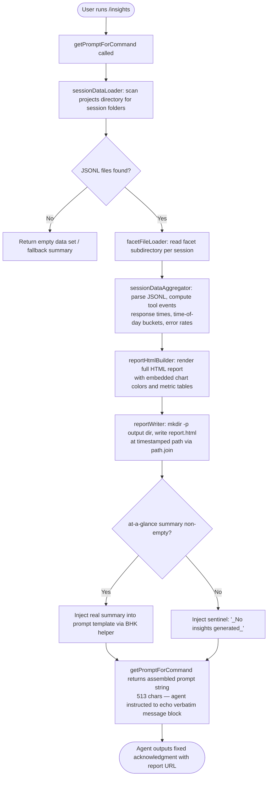

# `/insights`

> Analysis basis: CC v2.1.154 bundle.js (AST extraction + Claude interpretation)
> Minimum version: v2.1.154

---

## Overview

The `/insights` command generates a self-contained HTML usage-analytics report by scanning Claude Code's session JSONL files and facet data, computing behavioral statistics, writing the report to disk, and then instructing the agent to deliver a fixed acknowledgment message with a link to the file. The command is a `prompt`-type handler — its entire visible output is a verbatim `<message>` block that the agent repeats without modification.

---

## Registration

| Field | Value |
|---|---|
| type | `prompt` |
| name | `insights` |
| description | Generate a report analyzing your Claude Code sessions |
| loc_byte | `12846294` |
| loc_byte_end | `12847598` |
| loc_line | `10896` |
| handler_method | `getPromptForCommand` |
| handler_method_start | `12846468` |
| handler_method_end | `12847597` |
| prompt_body.length | 513 characters |
| prompt_body.trace | `call→BHK(...) (1 literals)` |
| arbor_handler.name | `getPromptForCommand` |
| arbor_handler.fqn | `claude-2.1.154::getPromptForCommand` |
| arbor_handler.kind | Method |
| arbor_handler.resolution_path | `direct` |
| arbor_handler.n_hits | 1 |

Analysis basis: CC v2.1.154 bundle.js:+12846294

---

## Input Branching

The command follows a largely linear pipeline (session discovery → data loading → analysis → HTML render → prompt assembly), with three meaningful branch points: whether a prior report HTML file exists to re-use, whether session JSONL files pass the `.jsonl` filter, and whether the at-a-glance summary produces content or falls back to the sentinel string `"_No insights generated_"`. A flowchart best captures this shape.



Analysis basis: CC v2.1.154 bundle.js:+12846474 (handler entry), +12847500 (BHK prompt builder call), +12847365 (sentinel literal)

---

## Behavioral Spec

### Session Discovery (`sessionDataLoader`)

```
function sessionDataLoader(dataRootDir):
    projectsDir = path.join(dataRootDir, "projects")   // literal "projects" +6499753
    entries = fs.readdir(projectsDir)
    subdirs = entries.filter(entry => entry.isDirectory())  // +12833032
    // concurrency window: up to 10 items at a time, batch size 9   // +12833214, +12833219
    // after each batch: setImmediate yield                           // +12833244
    results = []
    for batch in chunked(subdirs, batchSize=9):
        settled = await Promise.allSettled(batch.map(loadProjectSessions))
        results.push(...settled)
    results.sort(/* by session timestamp */)                          // +12833268
    return results
```

Analysis basis: CC v2.1.154 bundle.js:+12833337 (`lw5`), +12832945 (`Gc`), +12832964

### Facet File Loader (`facetFileLoader` / `p_6`)

```
function facetFileLoader(sessionDir):
    entries = fs.readdir(sessionDir)
    jsonlFiles = entries
        .filter(e => e.isFile())                         // +12916995
        .filter(e => fileExtensionTest(e, ".jsonl"))     // literal ".jsonl" +12917024
    fileMetas = await Promise.all(
        jsonlFiles.map(name => ({
            name: path.basename(name),                   // +12917052
            fullPath: path.join(sessionDir, name),       // +12917126
            stat: fs.stat(fullPath)                      // +12917227
        }))
    )
    // enrich each entry with parsed metadata via metadataEnricher(N) // +12917326
    return fileMetas
```

Analysis basis: CC v2.1.154 bundle.js:+12916918 (`p_6`)

### Session Data Aggregator (`sessionDataAggregator` / `UHK`)

```
function sessionDataAggregator(sessions):
    // Limit to most-recent slice of sessions                         // +12833410
    recent = sessions.slice(/* configurable window */)
    perSession = await Promise.all(recent.map(session =>
        loadAndParseSession(session)                                  // +12833445
    ))

    toolEvents  = []
    messageRecs = []

    for result in perSession:
        raw = readSessionFile(result)                                 // bw5 +12833490
        parsed = jsonParse(raw)                                       // m6 +12778441
        eventRecords = analyzeSessionEvents(parsed)                   // xHK +12772823
        toolEvents.push(...eventRecords.tools)                        // +12833552
        messageRecs.push(...eventRecords.messages)                    // +12833581

    // Produce facet summary records                                  // pHK +12835257
    facetSummary = computeFacetSummary(toolEvents, messageRecs)

    // Build at-a-glance summary object                               // pw5 +12835305
    atAGlance = buildAtAGlanceSummary(facetSummary)                  // literal "at_a_glance" +12786534

    // Write output directory and report file                         // xw5 +12834178
    outputDir = path.join(outputRoot, timestampedSubdir())
    fs.mkdir(outputDir, { recursive: true })                          // +12835335
    reportPath = path.join(outputDir, "report.html")                 // literal +12835594
    fs.writeFile(reportPath, htmlContent)                             // +12835622

    return { atAGlance, reportUrl, htmlFilePath, facetsDir }
```

Analysis basis: CC v2.1.154 bundle.js:+12833410 (`UHK`), +12834178 (`xw5`), +12835594

### Event Analysis (`analyzeSessionEvents` / `xHK`)

The event analyzer walks each session's message array and classifies tool calls into outcome categories:

```
function analyzeSessionEvents(parsedSession):
    tools = []
    for event in parsedSession:
        if isWebSearch(event): classify(event, "WebSearch")          // +12772982
        if isWebFetch(event):  classify(event, "WebFetch")           // +12773006
        if isEdit(event):      classify(event, "Edit")               // +12773113
        if isWrite(event):     classify(event, "Write")              // +12773125

        outcome = deriveOutcome(event):
            // "Command Failed" on non-zero exit code                 // +12774000
            // "User Rejected"  on rejection signal                   // +12774078
            // "Edit Failed"    on string-not-found / no-changes      // +12774172
            // "File Changed"   on modified-since-read                // +12774230
            // "File Too Large" on size-exceeded                      // +12774310
            // "File Not Found" on ENOENT                             // +12774396

        // Time-of-day bucket for hour-of-day histogram
        hour = event.timestamp.getHours()                            // +12773672
        bucket = classifyHour(hour):
            // "Morning (6-12)"    hours [7,8,9,10,11]               // +12790355
            // "Afternoon (12-18)" hours [12,13,14,15,16,17]         // +12790402
            // "Evening (18-24)"   hours [18,19,20,21,22,23]         // +12790456
            // "Night (0-6)"       hours [0,1,2,3,4,5]               // +12790508

        tools.push({ event, outcome, bucket })
    return { tools, messages: parsedSession }
```

Analysis basis: CC v2.1.154 bundle.js:+12772823 (`xHK`), +12773369, +12773401

### HTML Report Builder (`reportHtmlBuilder` / `dw5`)

```
function reportHtmlBuilder(facetSummary):
    html = baseTemplate()
    // Escape special chars: &amp; &lt; &gt; &quot; &apos;           // +4702057–4702180
    // Bold markdown: replace **text** → <strong>$1</strong>         // +12791213
    // List bullets: prefix items with "• "                           // +12791256
    // Line breaks:  newlines → <br>                                  // +12791286

    // Response-time histogram buckets (seconds):
    //   "2-10s", "10-30s", "30s-1m", "1-2m",
    //   "2-5m",  "5-15m",  ">15m"                                   // +12789507–12789567
    // Threshold: sessions longer than 900 s flagged separately       // +12789809
    // Max HTML content token budget: 8192                            // +12788676

    // Chart color palette:
    //   primary   #2563eb                                            // +12827172
    //   teal      #0891b2                                            // +12827310
    //   green     #10b981                                            // +12827482
    //   purple    #8b5cf6                                            // +12827625
    //   error-red #dc2626                                            // +12830888
    //   ok-green  #16a34a                                            // +12831137
    //   warn-gold #eab308                                            // +12831630

    // Empty-state guards:
    if noToolErrors:    emit "<p class=\"empty\">No tool errors</p>"  // +12830899
    if noResponseTime:  emit "<p class=\"empty\">No response time data</p>" // +12789455
    if noTimeData:      emit "<p class=\"empty\">No time data</p>"    // +12790305
    if noData:          emit "<p class=\"empty\">No data</p>"         // +12788998

    // "Add to CLAUDE.md" suggestion links present in report          // +12794851
    return html
```

Analysis basis: CC v2.1.154 bundle.js:+12791141 (`dw5`), +12827150 (`IfH`), +12827842 (`Fw5`)

### Prompt Assembly (`getPromptForCommand`)

```
function getPromptForCommand(context):
    // Run full pipeline synchronously before returning
    { atAGlance, reportUrl, htmlFilePath, facetsDir } =
        await sessionDataAggregator(sessions)

    summaryText = atAGlance ?? "_No insights generated_"             // +12847365

    // BHK interpolates runtime values into 513-char template         // +12847500
    promptText = BHK(
        atAGlanceSummary = summaryText,
        reportUrl        = reportUrl,
        htmlFile         = htmlFilePath,
        facetsDir        = facetsDir
    )

    // RH serializes the prompt payload                               // +12847518
    // Jy8 resolves the output base path                              // +12847564

    // The assembled prompt instructs the agent to:
    //   1. Accept the full insights data and at-a-glance summary
    //   2. Output ONLY the verbatim text between <message> tags
    //   3. End with "Want to dig into any section or try one of the suggestions?"
    return promptText
```

Analysis basis: CC v2.1.154 bundle.js:+12846474 (handler start), +12847500 (`BHK`), +12847518 (`RH`)

### Facet Summary Computation (`computeFacetSummary` / `pHK`)

```
function computeFacetSummary(toolEvents, messageRecs):
    // Compute per-project statistics
    for each projectGroup in Object.entries(groupByProject(toolEvents)):
        stats = {
            toolCallCount:   count(events),
            successRate:     ratio(successful, total),
            medianResponseMs: percentile(responseTimes, 0.5),        // Math.floor +12784127
            p95ResponseMs:   percentile(responseTimes, 0.95),
            errorBreakdown:  groupByOutcome(events)
        }
        // Histogram builder (mHK) uses Number.isFinite guard         // +12780570
        // Splits category strings for multi-label axes               // +12781161
        // Max token budget for facet JSON: 4096                      // +12780238
        // Cache TTL for reuse: 1800000 ms (30 min)                   // +12780762
    return aggregatedFacets
```

Analysis basis: CC v2.1.154 bundle.js:+12782125 (`pHK`), +12784127, +12780570 (`mHK`)

### Report Writer (`reportWriter` / `xw5`)

```
function reportWriter(outputDir, htmlContent, facetJson):
    fs.mkdir(outputDir, { recursive: true })                          // +12778937
    reportPath = path.join(outputDir, "report.html")                 // +12835594

    // Facet JSON stored in separate file alongside HTML              // +12778974
    // Max facet JSON size: 384 bytes compressed per session          // +12779069
    // Encoding: utf-8                                                // +12778420

    fs.writeFile(reportPath, htmlContent, "utf-8")                   // +12779018
    // On error: hH error logger fires                                // +12779084
    return { reportUrl: "file://" + reportPath, htmlFilePath: reportPath }
```

Analysis basis: CC v2.1.154 bundle.js:+12778937 (`xw5`), +12778974, +12779018

---

## State & Side Effects

| Item | Detail |
|---|---|
| Telemetry | No `tengu_insights_*` events found in depth-2 traversal. Reachable daemon/MCP telemetry events are indirect (see Appendix). <!-- TODO: not found in depth-2 traversal; needs --depth 4 --> |
| File writes | Creates `report.html` in a timestamped output directory under the Claude Code data root (`xw5`, +12778937, +12779018) |
| Directory creation | `fs.mkdir` with `{ recursive: true }` before writing (`UHK`, +12835335) |
| Facet cache | Facet data cached with 30-minute TTL (1 800 000 ms, +12780762); file-level `.jsonl` extension filter applied (+12917024) |
| JSON parse | Session files decoded as UTF-8 JSONL via `m6` → `JSON.parse` (+12778420, +183900) |
| No appState mutation | Command is read-only with respect to conversation state; produces a static HTML file |
| No hook registration | None observed in call graph |
| No sound | None observed in call graph |
| Agent output constraint | Prompt instructs agent to echo only the `<message>` block verbatim; no free-form elaboration unless the user follows up |

---

## Version History

| Version | Change |
|---|---|
| v2.1.154 | Initial analysis |

---

## Common Mistakes

1. **Running `/insights` in a workspace with no prior sessions** — the command will complete silently and the at-a-glance summary will fall back to `"_No insights generated_"` (+12847365); no error is surfaced to the user.
2. **Expecting interactive input** — `/insights` takes no arguments; it scans the data root automatically. Passing text after the command has no effect.
3. **Looking for output in the current directory** — the HTML report is written to a timestamped subdirectory inside the Claude Code data root, not the working directory; the agent's response message contains the actual file path.
4. **Treating the agent reply as dynamic analysis** — the agent is constrained to repeat the verbatim `<message>` block from the prompt; it does not independently interpret the data. Follow-up questions are required to get deeper analysis.
5. **Assuming real-time updates** — facet data is cached for up to 30 minutes (+12780762); a second `/insights` run within that window may reuse stale cached facets rather than re-reading disk.
6. **Confusing the report URL with a web URL** — the report is a local `file://` HTML document, not a hosted page. Sharing requires copying the file manually.

---

## Appendix — Identifier Mapping

> For bundle debugging only. Identifiers change across versions.

| Identifier | Role |
|---|---|
| `UHK` | Session data aggregator — top-level coordinator that orchestrates data loading, analysis, report writing, and prompt data assembly |
| `lw5` | Session discovery — scans `projects/` directory, filters subdirectories, batches async loads |
| `Gc` | Projects-directory path builder — joins data root with `"projects"` |
| `p_6` | Facet file loader — reads JSONL files from a session's facet subdirectory |
| `ro` | JSONL extension tester — applies `.jsonl` regex filter |
| `bw5` | Raw session file reader — reads session file as UTF-8 and invokes JSON parser |
| `RAA` | Session-meta path resolver — joins paths for `session-meta` subdirectory |
| `rI6` | Usage-data path resolver — joins paths for `usage-data` subdirectory |
| `uHK` | Session file path builder used inside raw reader |
| `m6` | JSON parser wrapper — calls `JSON.parse` on buffer |
| `vSH` | MCP connection manager — not insights-specific; reached transitively |
| `M` | MCP server map manager — reached transitively |
| `JGK` | MCP connection result applicator — reached transitively |
| `Gm5` | MCP server reconciler — reached transitively |
| `d_H` | Transcript/conversation state manager — large map-based state machine reached transitively |
| `xHK` | Event analyzer — classifies tool events into outcome categories and time-of-day buckets |
| `bAA` | Session event batch aggregator — rounds and trims per-session statistics |
| `Xy8` | Conversation chain reader — extracts per-message metadata from internal maps |
| `sLH` | Chain loader — validates chain consistency, logs `tengu_chain_*` events |
| `vj5` | Chain ordering resolver — sorts messages by timestamp, deduplicates parallel turns |
| `Zj5` | Chain shift handler — manages queue of pending transcript entries |
| `Vj5` | Chain validity checker — uses `Number.isNaN` to gate processing |
| `S6K` | Chain segment getter — retrieves segments from internal map keyed by session |
| `ltH` | Transcript entry mapper — maps raw entries to display objects |
| `HqA` | HTML entity replacer — applies `replaceAll` passes for `&amp;`, `&lt;`, `&gt;` etc. |
| `kk6` | Inline markup processor — handles list bullets, `<br>` injection, regex-based formatting |
| `AqA` | Attachment type checker — validates image/document attachment shapes |
| `Nj5` | Content trim validator — trims whitespace, checks array types |
| `kj5` | Array type checker — checks `.some` predicates on content arrays |
| `ky8` | Per-key metric accumulator — pushes into metric map |
| `Iy8` | Map-to-array converter — `Array.from(map.values())` |
| `Nw5` | NaN guard — `Number.isNaN` check on numeric session counts |
| `xw5` | Report writer — `fs.mkdir` + `fs.writeFile` for `report.html` |
| `Rw5` | Prior-report reader — reads existing report file if present, deletes stale copy |
| `Jy8` | Output base-path resolver — joins data root with `"facets"` subdirectory path |
| `FHK` | File unlink helper — removes stale report files |
| `uw5` | Full pipeline runner — coordinates `Sw5` → `yXH` → `bHK` → `DK` chain |
| `Sw5` | Session slice processor — batches sessions with `Promise.all`, max 30 000 ms timeout per batch (+12777609) |
| `Iw5` | Per-session event extractor — calls `bAA`, limits to 500 events per session (+12776832) |
| `yXH` | Report data transformer — calls `GK`, `vT8`, `Z8`, `aRH`, `sG` |
| `vT8` | SHA-1 hash builder and file writer for per-session facet cache |
| `Z8` | UUID generator helper — wraps `crypto.randomUUID` |
| `aRH` | Assistant message extractor — raises error `"No assistant message found"` on missing data |
| `bHK` | Report kind resolver — sets `"insights"` report type (+12780129) |
| `EZ` | Environment type resolver — classifies as `"firstParty"` or `"default"` |
| `DK` | Tool-event filter — post-processes event list |
| `pHK` | Facet summary computer — per-project stats, percentile response times, error breakdown |
| `mHK` | Histogram builder — validates with `Number.isFinite`, splits category labels |
| `pw5` | At-a-glance summary builder — produces `"at_a_glance"` key object |
| `CHK` | Per-session HTML chunk builder — calls `yXH`, `GK`, `DK`, `m6`, `F_` |
| `Tw5` | Environment helper used inside chunk builder |
| `dw5` | HTML report builder — full template, chart colors, bucket labels, empty-state guards |
| `x5` | HTML entity escaper — normalises `&`, `<`, `>`, `"`, `'` |
| `J5` | `replaceAll`-based string replacer helper |
| `jy8` | Secondary text processor — calls `x5` on sub-fields |
| `Qw5` | JSON serialiser for report payload — calls `RH` (JSON.stringify) |
| `IfH` | Tool-error chart builder — bar chart with `#dc2626` palette, empty guard |
| `Fw5` | Time-distribution chart builder — uses `Object.values`/`Object.entries` |
| `gw5` | Hour-of-day histogram builder — maps hour buckets with `Math.max` normalisation |
| `BHK` | Prompt template interpolator — injects runtime values into 513-char prompt string |
| `RH` | JSON serializer — thin wrapper around `JSON.stringify` |
| `nw5` | Object-key enumerator — `Object.keys` over facet map |
| `m_6` | Entry enumerator — `Object.entries` over nested stat object |
| `K9` | String slicer — `indexOf` + `slice` helper |
| `CAA` | <!-- TODO: not found in depth-2 traversal; needs --depth 4 --> |
| `iI6` | <!-- TODO: not found in depth-2 traversal; needs --depth 4 --> |
| `vw5` | File-extension checker — `path.extname` comparison |
| `bwH` | Diff helper — calls `HJ9.diff` for change detection |
| `a4` | Index-of helper — `Array.indexOf` wrapper |
| `hH` | Error logger — emits to `QmH` queue and calls `Li.logError` |
| `dL` | MCP error logger — emits to `QmH` queue and calls `Li.logMCPError` |
| `ZH` | String coercer — wraps `String(...)` |
| `F_` | Error factory — constructs `new Error(String(...))` |
| `GK` | <!-- TODO: not found in depth-2 traversal; needs --depth 4 --> |
| `sG` | <!-- TODO: not found in depth-2 traversal; needs --depth 4 --> |
| `__handler_insights` | Synthetic BFS entry point representing the `getPromptForCommand` inline method on the registration object |