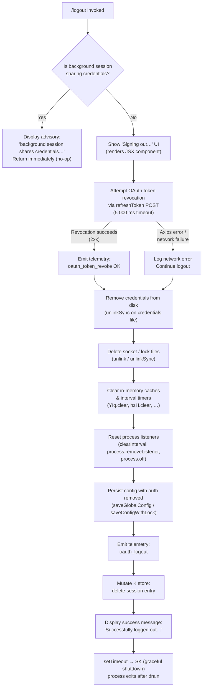

# `/logout`

> Analysis basis: CC v2.1.154 bundle.js (AST extraction + Claude interpretation)
> Minimum version: v2.1.154

---

## Overview

The `/logout` command signs the user out of their Anthropic account by revoking the OAuth token on the server, removing stored credentials from disk and system keychain, clearing in-memory session state, and then terminating the CLI process. If invoked from a background session that shares credentials with a parent terminal, the command is a no-op and displays an advisory message instead.

---

## Registration

| Field | Value |
|---|---|
| type | `local-jsx` |
| name | `logout` |
| description | Sign out from your Anthropic account |
| loc_byte | `11335536` |
| loc_byte_end | `11335833` |
| loc_line | `8330` |
| module_id | `mC_` |
| load_inline | `true` |
| arbor_handler.name | `f3L` |
| arbor_handler.fqn | `claude-2.1.154::f3L` |
| arbor_handler.kind | `AsyncFunction` |
| arbor_handler.resolution_path | `module_id` |
| arbor_handler.n_hits | `0` |

Analysis basis: CC v2.1.154 bundle.js:+11335536

---

## Input Branching

The command has four distinct branches based on session context, token-revocation outcome, and process type. A Mermaid flowchart is used.



---

## Behavioral Spec

### Handler entry point — `f3L` (AsyncFunction)

The Arbor symbol graph resolves the handler as `f3L` (FQN: `claude-2.1.154::f3L`, reached via `module_id` → `mC_`).

```
async function logoutHandler(context):
    sessionKind = getSessionKind()                 // checks "bg", "daemon", "daemon-worker"
    if sessionKind is background/shared:
        displayMessage(
            "This background session shares credentials …"
            + " Run /logout from your main terminal to sign out."
        )
        return                                      // loc_byte:+7714787

    renderSigningOutUI("Signing out…")             // loc_byte:+7715140

    // Step 1 — revoke OAuth token server-side
    performOAuthTokenRevocation()                  // calls bA_ → loc_byte:+7713751

    // Step 2 — remove local credential artifacts
    removeCredentialFile()                          // q → PEK.unlinkSync loc_byte:+7713542
    deleteSocketAndLockFiles()                      // Jh9, fI_ → loc_byte:+7714631,+7714643

    // Step 3 — wipe in-memory state
    clearCachesAndTimers()                          // D06 → loc_byte:+7713609

    // Step 4 — rebuild/persist sanitised config
    saveConfigWithAuthRemoved()                     // t3_ → loc_byte:+7713846

    // Step 5 — emit telemetry and update store
    emitTelemetry("oauth_logout")                  // loc_byte:+7714458
    storeDelete(sessionKey)                        // K.delete loc_byte:+7714048
    storeRead(configPath)                          // L.readAsync loc_byte:+7713696

    // Step 6 — display result and exit
    displaySuccess(
        "Successfully logged out from your Anthropic account."
    )                                              // loc_byte:+7714986
    setTimeout(() => initiateShutdown(), 200)      // loc_byte:+7715049, value 200 loc_byte:+7715081
```

Analysis basis: CC v2.1.154 bundle.js:+7714677

---

### OAuth token revocation — `bA_` (tokenRevoker)

```
async function revokeOAuthToken(credentials):
    payload = { grant_type: "refresh_token", token: credentials.refreshToken }
    headers = { "Content-Type": "application/json" }    // loc_byte:+2055670
    timeout = 5000                                       // loc_byte:+2055713

    try:
        response = await httpClient.post(revokeEndpoint, payload, { headers, timeout })
        emitTelemetry("oauth_token_revoke")             // loc_byte:+2055723
        recordFeatureOutcome("ok")                      // tengu_feature_ok
    catch err:
        if httpClient.isAxiosError(err):
            logNetworkError("network", err)             // loc_byte:+2055847
        else:
            logGenericError(err)
        // logout continues regardless
```

Analysis basis: CC v2.1.154 bundle.js:+7713751

---

### Credential file removal — `q` (credentialFileRemover)

```
function removeCredentialFile(credentialPath):
    fs.unlinkSync(credentialPath)                        // PEK.unlinkSync loc_byte:+15456916
    // ENOENT is tolerated (file may already be absent)
```

Analysis basis: CC v2.1.154 bundle.js:+7713542

---

### Socket and lock file cleanup — `Jh9` / `fI_` (socketCleaner / lockFileCleaner)

```
async function deleteSocketFiles(socketDir):
    socketPath = buildSocketPath(socketDir)             // iL6 → loc_byte:+6813991
    await fs.unlink(socketPath)                         // QkH.unlink loc_byte:+6814003

async function deleteLockFiles(lockDir):
    lockEntry = resolveLockEntry(lockDir)               // KI_ → loc_byte:+6769866
    clearTimeout(lockTimer)                             // loc_byte:+6769919
    await fs.unlink(lockFilePath)                       // H26.unlink loc_byte:+6774137
    buildLockPath(lockDir)                              // VcH → loc_byte:+6774148
```

Analysis basis: CC v2.1.154 bundle.js:+7714631, +7714643

---

### In-memory state teardown — `D06` (stateTeardown)

```
function clearInMemoryState():
    clearConfigCache()                                   // L26 loc_byte:+7714535
    clearAuthCache()                                     // VgH loc_byte:+7714541
    clearTimerCache()                                    // TH8 → YIq.clear loc_byte:+2938815
    clearEventListeners()                                // VzH loc_byte:+7714553
    shutdownEventEmitter()                               // IHH → loc_byte:+7714578
        // IHH internals:
        //   emits shutdown event on fQH                 // fQH.emit loc_byte:+3188378
        //   clears hzH, k88, Iz6, Oz_, $U maps         // loc_bytes:+3188625–+3188673
        //   calls clearInterval on tracked timers       // Jz_ → loc_byte:+3189163
        //   process.removeListener("beforeExit",…)     // loc_byte:+3189221
        //   process.off("exit",…)                      // $QH → process.off loc_byte:+3188506
    resetLogQueue()                                      // Jh9 reuse path
    flushPendingWrites()                                 // fI_ reuse path
```

Analysis basis: CC v2.1.154 bundle.js:+7713609

---

### Config save with auth removed — `t3_` (configSaver)

```
async function saveConfigWithAuthRemoved():
    acquireLock()                                       // ZIq → G1q → loc_byte:+2956180
    if lockAcquisition > threshold:
        emitTelemetry("tengu_config_lock_contention")  // loc_byte:+3208214
        warn("Lock acquisition took longer than expected …")

    currentConfig = readConfigFile()                    // bzH → q.readFileSync loc_byte:+3210214
    if cachedConfig.hasAuth and currentConfig.lacksAuth:
        // Safety guard — refuse write that would wipe existing auth
        emitTelemetry("tengu_config_auth_loss_prevented")  // loc_byte:+3208693
        log("saveConfigWithLock: re-read config is missing auth …")
        return

    sanitisedConfig = removeAuthFields(currentConfig)
    atomicWrite(sanitisedConfig)                        // $L6 → pM.writeFileSync loc_byte:+1011812
    backupOldConfig()                                   // Sz_ / bzH path, keeps ≤5 backups loc_byte:+3209144
    releaseLock()
```

Analysis basis: CC v2.1.154 bundle.js:+7713846

---

### Background-session guard — `V9` / `VOH` (sessionKindGuard)

```
function isBackgroundSession():
    kind = getProcessKind()                             // V9 → VOH loc_byte:+2199145
    return kind in ["bg", "daemon", "daemon-worker"]   // loc_bytes:+2199068,+2199078,+2199092
```

When the guard returns `true`, the handler renders a system message and returns without performing any destructive action.
Analysis basis: CC v2.1.154 bundle.js:+7713572, +7713597

---

### Graceful shutdown — `SK` / `tq` (shutdownOrchestrator)

```
function initiateShutdown():
    // called inside setTimeout(fn, 200) loc_byte:+7715049
    unmountInkUI()                                      // rNH → H.unmount loc_byte:+5327529
    flushStdout()                                       // VV_ → uwH.writeSync loc_byte:+5327921
    drainWriteQueue()                                   // IxH → f$A.drain loc_byte:+58493
    emitTelemetry("session_end")                        // loc_byte:+5330065
    process.exit(0)                                     // vV_ → process.exit loc_byte:+5328129
    // Fallback: process.kill(pid, "SIGKILL") if exit stalls  loc_byte:+5328154,+5328179
```

Analysis basis: CC v2.1.154 bundle.js:+7715065

---

### Keychain / secure-storage interaction — `oK` / `AOq` (credentialStore)

When removing credentials the handler also interacts with the OS secure-storage layer:

```
async function removeFromSecureStorage(key):
    record = await secureStore.read(key)                // AOq → H.read loc_byte:+2227400
    if record found:
        emitTelemetry("secure_storage_credentials_write")  // loc_byte:+2227777
        await secureStore.delete(key)                   // AOq → _.delete loc_byte:+2227756
    else if fallbackStore.has(key):
        emitTelemetry("plaintext_fallback_used")        // loc_byte:+2228024
        await fallbackStore.delete(key)
    if both fail:
        emitTelemetry("primary_and_fallback_failed")    // loc_byte:+2228127
```

Analysis basis: CC v2.1.154 bundle.js:+7713656

---

### Subscription-switch telemetry tag — literal `"subscription-switch"`

The literal `"subscription-switch"` (loc_byte:+7714303) appears in the logout flow, indicating that a subscription plan change can trigger logout as a side-effect. The `oauth_logout` telemetry event (loc_byte:+7714458) fires regardless of whether logout was user-initiated or subscription-triggered.

---

## State & Side Effects

| Item | Detail |
|---|---|
| Telemetry — oauth_token_revoke | Fired when the server-side token revocation POST succeeds (loc_byte:+2055723) |
| Telemetry — oauth_logout | Fired after credentials are removed from disk (loc_byte:+7714458) |
| Telemetry — tengu_feature_ok | Fired on successful secure-storage read (loc_byte:+965176) |
| Telemetry — tengu_feature_sad | Fired on transient secure-storage failure (loc_byte:+965311) |
| Telemetry — tengu_feature_bad | Fired on hard secure-storage failure (loc_byte:+965234) |
| Telemetry — tengu_config_lock_contention | Fired when config-lock acquisition is slow (loc_byte:+3208214) |
| Telemetry — tengu_config_stale_write | Fired when a stale config write is detected (loc_byte:+3208350) |
| Telemetry — tengu_config_parse_error | Fired when config JSON cannot be parsed (loc_byte:+3210789) |
| Telemetry — tengu_config_auth_loss_prevented | Fired when a write that would erase auth is blocked (loc_byte:+3208693) |
| Telemetry — tengu_daemon_config_reload | Fired when daemon reloads config post-logout (loc_byte:+15493092) |
| Telemetry — tengu_startup_perf | Fired during shutdown path via perf reporter (loc_byte:+214276) |
| Telemetry — tengu_scroll_summary | Fired during UI teardown (loc_byte:+5328997) |
| Telemetry — tengu_pewter_brook | Fired by display-mode detection during shutdown (loc_byte:+3378236) |
| Telemetry — tengu_cache_eviction_hint | Fired during session-end cache sweep (loc_byte:+5330030) |
| Credential file | Removed via `fs.unlinkSync` (loc_byte:+15456916) |
| Socket file | Removed via async `fs.unlink` (loc_byte:+6814003) |
| Lock file | Removed via async `fs.unlink` after `clearTimeout` (loc_byte:+6774137) |
| In-memory caches | `YIq`, `hzH`, `k88`, `Iz6`, `Oz_`, `$U` all cleared (loc_bytes:+2938815–+3188673) |
| Process event listeners | `beforeExit` and `exit` listeners removed (loc_bytes:+3189221, +3188506) |
| Interval timers | All tracked `setInterval` handles cleared (loc_byte:+3189163) |
| Config file | Rewritten atomically without auth fields; up to 5 backups retained (loc_byte:+3209144) |
| Session store (`K`) | Session entry deleted via `K.delete` (loc_byte:+7714048) |
| UI | Ink component unmounted; stdout flushed (loc_byte:+5327529) |
| Process exit | `process.exit(0)` after 200 ms delay; SIGKILL fallback (loc_bytes:+5328129, +5328154) |
| Sound | None detected in depth-2 traversal |

---

## Version History

| Version | Change |
|---|---|
| v2.1.154 | Initial analysis |

---

## Common Mistakes

1. **Running `/logout` from a background/daemon terminal.** The command detects `"bg"`, `"daemon"`, and `"daemon-worker"` session kinds and displays an advisory message without performing any logout. You must run `/logout` from the primary interactive terminal.
2. **Expecting an immediate shell return.** The command schedules a 200 ms delay before `process.exit`, so the terminal will close; it is not safe to pipe the exit code from a wrapper script.
3. **Assuming the token is always revoked server-side.** If the network is unavailable the revocation POST fails silently and logout continues locally. The OAuth token may remain valid on the server until it expires naturally.
4. **Re-using stale config after logout.** The config file is atomically rewritten without auth fields. Any process holding an in-memory copy of the old config will have a stale view and must re-read from disk.
5. **Missing keychain removal on headless systems.** On systems where the OS secure-storage backend is unavailable the plaintext fallback is used; the telemetry event `"plaintext_fallback_used"` is emitted but the caller receives no error.

---

## Appendix — Identifier Mapping

> For bundle debugging only. Identifiers change across versions.

| Identifier | Role |
|---|---|
| `f3L` | Main logout async handler (Arbor-resolved; FQN `claude-2.1.154::f3L`) |
| `yaH` | Core logout execution function (orchestrates all logout sub-steps) |
| `M3L` | Logout JSX component renderer (renders "Signing out…" / success UI) |
| `q` | Credential file remover (calls `PEK.unlinkSync`) |
| `V9` | Session kind reader |
| `VOH` | Session kind resolver (returns "bg", "daemon", etc.) |
| `D06` | In-memory state teardown orchestrator |
| `L26` | Config cache clearer |
| `VgH` | Auth cache clearer |
| `TH8` | Timer cache clearer (calls `YIq.clear`) |
| `VzH` | Event-listener clearer |
| `IHH` | Event-emitter shutdown (clears multiple maps, removes process listeners) |
| `Mx` | Logger flush helper |
| `xH` | String coercion utility |
| `fx` | Write-queue flush helper |
| `$QH` | Process listener and cache map cleanup |
| `Jz_` | Interval and process-listener removal |
| `hH` | Log-queue flusher |
| `F_` | Error constructor wrapper |
| `q1` | Essential-traffic queue manager |
| `D84` | Log-buffer ring manager |
| `Jh9` | Socket file deleter |
| `Ph9` | Socket path helper |
| `RI_` | Socket directory resolver |
| `LyA` | Socket path builder |
| `i9H` | Path join utility |
| `iL6` | Socket path composer |
| `fI_` | Lock file cleaner |
| `KI_` | Lock entry resolver |
| `MI_` | Lock metadata reader |
| `I4H` | Lock state checker |
| `VcH` | Lock path builder |
| `GA` | Provider-type detector (checks "bedrock", "vertex", etc.) |
| `oK` | Secure-credential-store accessor |
| `AOq` | Credential store read/write/delete router |
| `pTH` | Credential store primary (OS keychain) handler |
| `Qu4` | Secure-storage write context manager |
| `yH` | Storage helper (reads feature flags) |
| `t6` | Storage helper (writes feature flags) |
| `uH` | Storage helper (deletes entries) |
| `bA_` | OAuth token revocation HTTP caller |
| `Sq` | OAuth endpoint URL builder |
| `AZA` | OAuth environment resolver |
| `q64` | OAuth client-ID resolver |
| `N` | Logging facade |
| `URK` | Log transport router |
| `$$A` | Log sink selector |
| `RH` | JSON-stringify log formatter |
| `v4` | Log-line builder |
| `FzA` | Log colour mapper |
| `HuH` | Log file writer |
| `yzA` | Buffered stdout writer |
| `gRK` | Log-file rotation manager |
| `kxH` | Batching write scheduler |
| `cMH` | Log-file path composer |
| `B6` | `fs.existsSync` wrapper |
| `B16` | File-error classifier (EISDIR check) |
| `rzA` | Log file path resolver |
| `izA` | Atomic file rename helper |
| `FRK` | Log file append + rotate executor |
| `_9` | Crash-reporter registration helper |
| `Zt` | <!-- TODO: not found in depth-2 traversal; needs --depth 4 --> |
| `t3_` | Config save-with-auth-removed orchestrator |
| `ZIq` | Config lock acquisition manager |
| `G1q` | Config lock entry builder |
| `IN` | Config key hash builder (SHA-256, NFC normalise) |
| `DP` | Config default merger |
| `MV` | User-info resolver |
| `ZH` | String coercion utility |
| `O8` | Global config save (fallback path) |
| `hz_` | Atomic config write with backup rotation |
| `o$q` | Storage context builder |
| `bzH` | Config file reader with parse-error telemetry |
| `uz6` | Config migration helper |
| `Sz_` | Config backup path builder |
| `$L6` | Atomic file write utility (temp + rename + fchmod) |
| `jQH` | Config entry enumerator |
| `pBq` | Config entries iterator |
| `JQH` | Config timestamp updater |
| `yz_` | Config path atomic writer |
| `ko6` | Post-save hook runner |
| `K` | Session/conversation store |
| `nWH` | Notification/banner display helper |
| `KNH` | OTEL metrics attribute builder |
| `H0` | Attribute value coercer |
| `Y4` | Metrics event emitter |
| `iu8` | Metrics batch flusher |
| `qNH` | Metrics session initialiser |
| `KU` | Session ID generator |
| `k6` | Path utility wrapper |
| `C78` | Metrics attribute coercion helper |
| `Z3H` | Metrics deduplication set checker |
| `b7` | Metrics transport selector |
| `ff9` | Metrics field validator |
| `R78` | Frozen metrics descriptor builder |
| `Q96` | Metrics subscription-switch tag applier |
| `SK` | Shutdown orchestrator entry |
| `tq` | Shutdown pipeline (unmount → drain → exit) |
| `rNH` | Ink UI unmount + stdout writer |
| `GR` | Terminal restore helper |
| `Yq8` | Terminal escape sequence writer |
| `VV_` | Final stdout flush + dim |
| `fZ` | Stdout stream accessor |
| `Mb` | Stderr stream accessor |
| `BX6` | Shell path verifier |
| `V3` | Shell command builder |
| `ZJ9` | Path escape helper |
| `vV_` | Process-exit enforcer (exit / SIGKILL fallback) |
| `IxH` | Write-queue drain invoker |
| `Y` | Ink renderer / supervisor loop |
| `E2H` | Render diff engine |
| `Lt1` | Layout measurement helper |
| `T` | Input event handler |
| `QEK` | Heartbeat emitter |
| `AK6` | Startup performance reporter |
| `rU8` | Performance mark aggregator |
| `zYA` | Performance log writer |
| `u58` | Scroll summary collector |
| `TJ9` | Scroll state reader |
| `GJ9` | Scroll metrics calculator |
| `fq` | Display-mode detector (fullscreen / tmux / ConPTY) |
| `X96` | Cache eviction hint emitter |
| `m58` | Session-end event publisher |
| `Q8` | Timeout-guarded promise wrapper |