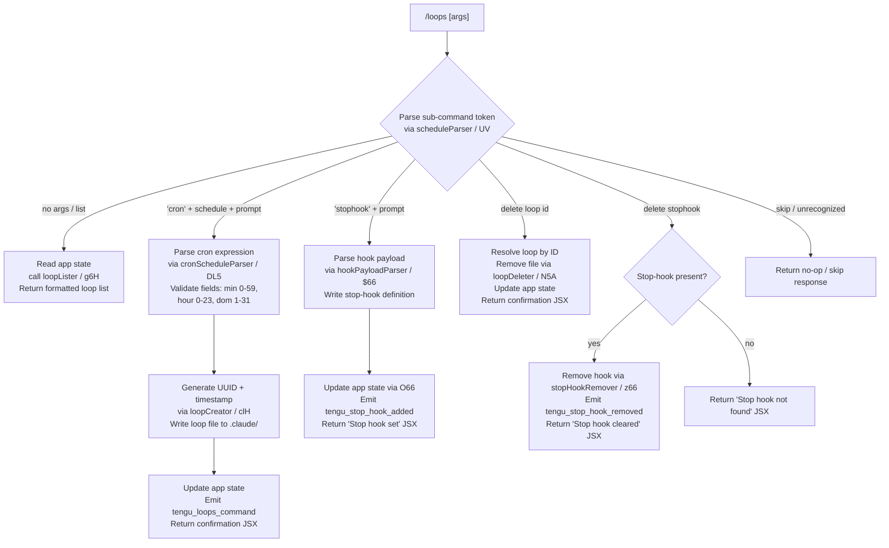

# `/loops`

> Analysis basis: CC v2.1.154 bundle.js (AST extraction + Claude interpretation)
> Minimum version: v2.1.154

---

## Overview

The `/loops` command provides a unified interactive interface for managing recurring background automation: listing active cron-based loops, creating new loops with a schedule and prompt, and deleting existing loops or stop-hooks. It is implemented as an async handler (`wL5`) that reads the current application state, parses user sub-commands, performs file-system side-effects (writing or removing loop definitions under `.claude/`), updates app state, and renders a JSX response directly in the CLI.

---

## Registration

| Field | Value |
|---|---|
| type | `local-jsx` |
| name | `loops` |
| description | `List, create, and delete recurring loops and stop-hooks` |
| loc_byte | `12191897` |
| loc_byte_end | `12192079` |
| loc_line | `9093` |
| immediate | `true` |
| module_id | `_c1` |
| load_inline | `true` |
| arbor_handler.name | `wL5` |
| arbor_handler.fqn | `claude-2.1.154::wL5` |
| arbor_handler.kind | `AsyncFunction` |
| arbor_handler.resolution_path | `module_id` |
| arbor_handler.n_hits | `0` |

Analysis basis: CC v2.1.154 bundle.js:+12191897

---

## Input Branching

The command input is parsed into at least five distinct branches based on the sub-command token and presence of arguments: list (default/no args), create-cron loop, create stop-hook, delete loop, and delete stop-hook. A Mermaid flowchart is used.



Analysis basis: CC v2.1.154 bundle.js:+12190900, +12190950, +12191036, +12191278, +12191404, +12191502, +12191590

---

## Behavioral Spec

### Top-level Handler

```
async function loopsCommandHandler(context):
    emit telemetry("tengu_loops_command")         // +12190854
    loopFiles = await readLoopFiles(context)       // ivH via Q6H
    appState  = context.getAppState()             // +12190904
    stopHooks = appState.stopHooks                // filtered as "stophook" type
    cronLoops = appState.loops                    // filtered as "cron" type  +12190950

    subCommand = parseSubCommand(context.args)    // token dispatch

    switch subCommand.type:
        case LIST:
            return renderLoopList(loopFiles, stopHooks, cronLoops)  // g6H +12191139
        case CREATE_CRON:
            return await createCronLoop(subCommand, context)        // clH +12191502
        case CREATE_STOPHOOK:
            return await createStopHook(subCommand, context)        // O66 +12191590
        case DELETE_LOOP:
            return await deleteLoop(subCommand, context)            // UV  +12190983
        case DELETE_STOPHOOK:
            return await deleteStopHook(subCommand, context)        // z66 +12191278
        case SKIP:
            return skipResponse()                                   // +12191763
```

Analysis basis: CC v2.1.154 bundle.js:+12190892, +12190900, +12190904

---

### Loop File Reader

```
async function readLoopFiles(context):
    // ivH, called via Q6H +4786359
    basePath = path.join(configDir, ".claude")    // n48.join +4784302
    configKey = resolveConfigKey(basePath)        // cK +4784314
    raw = await fs.readFile(configPath, "utf-8")  // _.readFile +4784371, literal "utf-8" +4784399
    parsed = parseLoopEntries(raw)                // r4H +4784382
    validated = validateSchema(parsed)            // A9 +4784421
    if not Array.isArray(validated):
        return []
    return validated.map(entry => normalizeEntry(entry))  // Array.isArray +4784515
```

Analysis basis: CC v2.1.154 bundle.js:+4784352, +4784371, +4784382

---

### Cron Schedule Parser

```
function parseCronSchedule(scheduleString):
    // DL5 +12190440
    parts = scheduleString.match(cronPattern)    // H.match +12190440
    minute = parseInt(parts.minute)              // parseInt +12190477
    // Validation bounds from literals:
    // minute: 0-59   (+12190619 value:59)
    // hour:   0-23   (+12190690 value:23)
    // dom:    1-31   (+12190743 value:31)
    // max granularity guard
    adjusted = Math.max(0, Math.ceil(minute))   // +12190562, +12190573
    rounded  = Math.round(adjusted)             // +12190646
    // Week-day range: 1-5 (Monday–Friday literal "1-5" +4783187)
    return { minute, hour, dom, dow, label }
```

Analysis basis: CC v2.1.154 bundle.js:+12190440, +12190562, +12190585 (value: 60), +12190619 (value: 59)

---

### Human-Readable Schedule Formatter

```
function formatScheduleLabel(cronParts):
    // UV +4782143
    trimmed = scheduleString.trim()              // H.trim +4782143
    if matchesEveryMinutePattern(trimmed):
        return "Every minute"                    // literal +4782263
    minuteVal = parseInt(trimmed.match(...))     // K.match +4782284, parseInt +4782319
    if matchesEveryHourPattern(trimmed):
        return "Every hour"                      // literal +4782480
    // Day-of-week calculations
    date = new Date()
    date.setUTCDate(...)                         // J.setUTCDate +4783039
    date.getUTCDay()                             // J.getUTCDay +4783020
    date.setUTCHours(...)                        // J.setUTCHours +4783070
    date.getDay()                                // J.getDay +4783099
    return formattedString
```

Analysis basis: CC v2.1.154 bundle.js:+4782143, +4782263, +4782480

---

### Loop Creator

```
async function createCronLoop(subCommand, context):
    // clH +4785699
    id        = crypto.randomUUID()              // S79.randomUUID +4785699
    timestamp = Date.now()                       // +4785761
    loopDef   = buildLoopDefinition(id, timestamp, subCommand.schedule, subCommand.prompt)
                                                 // rWH +4785807
    loopFiles = await readLoopFiles(context)     // ivH +4785851
    loopFiles.push(loopDef)                      // M.push +4785864

    // Write to .claude/ directory
    await fs.mkdir(configDir, { recursive: true })   // l48.mkdir +4785519
    filePath = path.join(configDir, ".claude", id)   // n48.join +4785529, literal ".claude" +4785540
    await fs.writeFile(filePath, serialized)         // l48.writeFile +4785616

    normalizeEntry(loopDef)                          // r4H +4785630
    updateAppState(context)                          // k6 +4785896

    registerMCPServerIfNeeded(context)               // Si +4785945
    finalizeWrite(loopFiles)                         // dlH +4785958

    return confirmationJSX("Loop created")
```

Analysis basis: CC v2.1.154 bundle.js:+4785699, +4785761, +4785807

---

### Loop Lister

```
function listLoops(loopFiles, appState):
    // g6H +4786029
    hasEntry = stateMap.has(key)                 // Vt +4786029, _.has +51371
    allLoops = readLoopFiles(context)            // ivH +4786078
    filtered = allLoops.filter(isActive)         // q.filter +4786087
    if not stateSet.has(loopId):                 // A.has +4786102
        return emptyListJSX()
    tableRows = buildTableRows(filtered)         // dlH +4786151
    return renderLoopTable(tableRows)
```

Analysis basis: CC v2.1.154 bundle.js:+4786029, +4786078, +4786087

---

### Stop-Hook Creator

```
async function createStopHook(subCommand, context):
    // O66 +10531514
    policy   = resolvePolicy(context)            // Ci_ +10531514
    trustGate = checkTrustGate(policy)           // "trust_gate" literal +10531464
    hooksGate = checkHooksGate(policy)           // "hooks_gate" literal +10531410
    goalStatus = subCommand.goalStatus           // "goal_status" literal +10532427

    appState = context.getAppState()             // _.getAppState +10531599
    timestamp = Date.now()                       // +10531763
    hookPayload = buildHookPayload(subCommand)   // $66 via O66 +10531595
    // type = "prompt", literal +10531329
    // Message operation = "append", literal +10532234
    // attachment type = "attachment", literal +10532340

    context.setAppState(updatedState)            // _.setAppState +10531801
    context.applyMessageOp("append", hookMsg)    // _.applyMessageOp +10531843
    newMsgId = generateUUID()                    // kT1 +10531885, VT1.randomUUID +10532358
    emit telemetry("tengu_stop_hook_added")      // +10531900

    return successJSX("Stop hook set")           // literal +12191614
```

Analysis basis: CC v2.1.154 bundle.js:+10531514, +10531801, +10531843, +10531900

---

### Stop-Hook Deleter / Loop Deleter

```
async function deleteStopHook(subCommand, context):
    // z66 +10532002
    appState = context.getAppState()             // H.getAppState +10532013
    if not appState.stopHook:
        return errorJSX("Stop hook not found")   // literal +12191296
    context.setAppState(removeStopHook(appState))// H.setAppState +10532142
    context.applyMessageOp(...)                  // H.applyMessageOp +10532211
    emit telemetry("tengu_stop_hook_removed")    // +10532268 (via z66)
    return successJSX("Stop hook cleared")       // literal +12191318

async function deleteLoop(subCommand, context):
    // UV + N5A path
    loopId   = parseLoopId(subCommand.args)      // UV +4782319
    worker   = workerMap.get(loopId)             // w +4782517
    if worker:
        worker.kill("SIGKILL")                   // R.kill +15478645, "SIGKILL" +15478652
        setTimeout(cleanup, 30_000)              // w.setTimeout +15478663, value 30 +15478559
    removeEntry(loopId)                          // N5A +15483950
    await pY.rm(loopPath)                        // pY.rm +15483891
    await pY.unlink(pidFile)                     // pY.unlink +15484954
    deleteFromStateMap(loopId)                   // Y.delete +15485355, H.delete +15485410
    return confirmationJSX()
```

Analysis basis: CC v2.1.154 bundle.js:+12191278, +12191296, +12191318, +10532268

---

### Hook Payload Builder

```
function buildHookPayload(args):
    // $66 +10531214
    payloadMap = new Map()
    payloadMap.set(key, value)                   // K.set +8756556
    rows = formatRows(args)                      // L91 +8756564, H.map +8756325
    result.push(formattedPayload)                // A.push +10531338
    return result
```

Analysis basis: CC v2.1.154 bundle.js:+10531214, +8756556

---

### Worker Lifecycle (Loop Execution Engine)

The loop execution infrastructure (`w` / workerController) manages the full lifecycle of background loop workers. Key constants observed:

- SIGKILL escalation timeout: **30 seconds** (literal `30` at bundle.js:+15478559)
- SIGTERM initial grace: **15 seconds** (literal `15` at bundle.js:+15478570)
- Worker restart delay: **2000 ms** (literal `2000` at bundle.js:+15478230)
- Long-running idle timeout: **300 000 ms / 5 minutes** (literal `300000` at bundle.js:+15485368)
- Spawn argument `--bg-pty-host` with PTY dimensions `200`×`50` (literals at bundle.js:+15458049, +15458067, +15458073)

Worker states observed in literals: `"spare"`, `"exec"`, `"done"`, `"killed"`, `"stopped"`, `"failed"`, `"active"`, `"crashed"`, `"blocked"`, `"working"`, `"bg"`, `"daemon"`, `"idle"`, `"resuming"`.

```
function workerController(loopId, config):
    // w +15478486
    entry = workerMap.get(loopId)
    if not entry:
        spawnSpareWorker()                // P5A +15478138
    entry.kill("SIGKILL")                 // R.kill, literal "SIGKILL" +15478652
    setTimeout(escalate, 30_000)
    memFree = os.freemem()                // k5A.freemem +15479013
    if memFree < threshold:
        emit("tengu_bg_dispatch_low_mem") // +15479183
    sparePool = getSparePool()            // W5A +15479932
    workerMap.set(loopId, newWorker)      // A.set +15479961
    trackExecution(newWorker)             // N5A +15479978
    emit("tengu_bg_spare_claim")          // +15479999
```

Analysis basis: CC v2.1.154 bundle.js:+15478486, +15478559, +15478652, +15479013

---

## State & Side Effects

| Item | Detail |
|---|---|
| Telemetry: `tengu_loops_command` | Emitted at entry of handler `wL5` (+12190854) |
| Telemetry: `tengu_stop_hook_added` | Emitted after successful stop-hook creation (+10531900) |
| Telemetry: `tengu_stop_hook_removed` | Emitted after stop-hook deletion (+10532268) |
| Telemetry: `tengu_bg_dispatch_sigkill_escalate` | Emitted when SIGKILL escalation fires for a loop worker (+15478604) |
| Telemetry: `tengu_daemon_control` | Emitted on daemon control operations (+15514441) |
| Telemetry: `tengu_feature_ok` / `tengu_feature_bad` / `tengu_feature_sad` | Emitted by feature-flag gate for loop feature availability (+965176, +965234, +965311) |
| Telemetry: `tengu_bg_low_mem_mb` | Emitted when memory drops below threshold during loop dispatch (+12714331) |
| Telemetry: `tengu_bg_dispatch_low_mem` | Emitted when a loop worker dispatch is skipped due to low memory (+15479183) |
| Telemetry: `tengu_bg_spare_enable` | Emitted when spare-worker pool is enabled (+15479878) |
| Telemetry: `tengu_bg_spare_claim` | Emitted when a spare worker is claimed for loop execution (+15479999) |
| Telemetry: `tengu_bg_spare_spawn` | Emitted when a new spare worker process is spawned (+15478297) |
| Telemetry: `tengu_bg_spare_claim_fail` | Emitted when spare claim fails (+15480262) |
| Telemetry: `tengu_bg_sendclaim_failed` | Emitted when send-claim IPC to daemon times out (+15459326, timeout 5000 ms at +15459747) |
| Telemetry: `tengu_daemon_yield` | Emitted when daemon yields to a foreground session (+15497286) |
| Telemetry: `tengu_daemon_config_reload` | Emitted when daemon reloads loop configuration (+15493092) |
| Telemetry: `tengu_bg_session_create` (literal) | Event name present in worker bootstrap path (+15478914) |
| File system writes | Loop definition files written to `.claude/<uuid>` via `l48.writeFile` |
| File system deletes | Loop files removed via `pY.rm` and `pY.unlink`; PID sockets via `PEK.unlinkSync` |
| appState changes | `getAppState` / `setAppState` / `applyMessageOp` called for both loop and stop-hook mutations |
| Stop-hook message op | `"append"` operation type with `"attachment"` message shape |
| Worker process spawning | Uses `Bun.spawn` with `--bg-pty-host` flag, PTY 200×50, `--bg-spare` arg (+15458031) |
| IPC socket | Daemon connection via `bb8.connect` with binary framing (`AF`: `Buffer.allocUnsafe`, `writeUInt32BE`, `writeUInt8`) |
| UUID generation | `S79.randomUUID` for loop IDs; `VT1.randomUUID` for message IDs |
| Error codes handled | `ENOENT`, `EACCES`, `EPERM`, `ENOTDIR`, `ELOOP`, `EROFS`, `ECONNREFUSED` |
| Sound | <!-- TODO: not found in depth-2 traversal; needs --depth 4 --> |

---

## Version History

| Version | Change |
|---|---|
| v2.1.154 | Initial analysis |

---

## Common Mistakes

1. **Omitting the schedule when creating a cron loop.** The cron parser (`DL5`) expects a well-formed expression with minute (0–59), hour (0–23), and day-of-month (1–31) fields. Providing only a prompt without a schedule string causes a parse failure before any file is written.
2. **Attempting to delete a stop-hook that was never set.** When no stop-hook exists in app state, the delete path returns the literal message `"Stop hook not found"` and performs no file-system operation. Retrying will not help.
3. **Confusing loop IDs with loop display names.** The delete sub-command requires the UUID generated at creation time (stored in the `.claude/` directory), not a human-readable label. Use `/loops` with no arguments first to list IDs.
4. **Expecting synchronous deletion.** Loop worker termination follows a two-phase sequence: SIGTERM with a 15-second grace period, then SIGKILL escalation after 30 seconds. The loop entry may remain in a `"stopping"` state briefly after the delete command returns.
5. **Creating stop-hooks without understanding the trust/hooks gate.** The `"hooks_gate"` and `"trust_gate"` policy checks run before the stop-hook is written. In restricted policy environments these gates may block creation silently.

---

## Appendix — Identifier Mapping

> For bundle debugging only. Identifiers change across versions.

| Identifier | Role |
|---|---|
| `wL5` | Top-level async loops command handler (main entry point) |
| `Q6H` | Loop-file read coordinator (calls `ivH` and `GG`) |
| `ivH` | Core loop-file reader / parser (reads config, validates schema) |
| `r4H` | Loop entry normalizer (joins config path, calls `cK`) |
| `cK` | Config key resolver (calls `ov`) |
| `A9` | Loop schema validator (calls `J8`) |
| `hH` | Error handler / traffic filter for loop I/O (calls `F_`, `xH`, `q1`, `D84`) |
| `F_` | Error code extractor (`Error`, `String`) |
| `xH` | String error normalizer |
| `q1` | Traffic classifier (resolves `"essential-traffic"`) |
| `D84` | Queue shift/push manager (`LB6.shift`, `LB6.push`) |
| `GG` | Secondary loop-state resolver (calls `ov`) |
| `$66` | Hook payload builder (calls `eJH`, appends to result array) |
| `eJH` | Payload map setter (calls `K.set`, `L91`) |
| `L91` | Row formatter for hook payload (`H.map`) |
| `k6` | App-state update helper (calls `ov`) |
| `UV` | Schedule/loop-delete argument parser (trim, match, parseInt, date UTC math) |
| `w` | Worker controller / loop execution engine (map get, kill, setTimeout) |
| `R` | Worker process wrapper (calls `lEK`, `Wz`, `N`, `hH`, `$B5`, `z.write`) |
| `lEK` | Worker path resolver (`pb8.realpath`, `pb8.stat`, `P8`) |
| `$B5` | Worker launch helper (`AW8`) |
| `z` | Daemon write channel (`yH`, `uH`, `vy`, `km`) |
| `uH` | Worker bad-state reporter (calls `c`, emits `tengu_feature_bad`) |
| `yH` | Worker ok-state reporter (calls `c`, emits `tengu_feature_ok`) |
| `eI8` | Memory threshold checker (`n6`, `E6`) |
| `E6` | Memory/feature-gate evaluator (`hz6`, `Sz6`, `Mx`, `hzH.has`, `y88`, `Iz6.add`) |
| `FD6` | Pins / loop config file loader (`QP.readFile`, `lX_`, `m6`, `yX7`) |
| `lX_` | Config path builder (`dP.join`, `AT`; resolves `"pins.json"`) |
| `m6` | JSON.parse wrapper |
| `yX7` | Directory loop-file scanner (`QP.readdir`, `Promise.all`, filter, `d69`) |
| `B` | Background-session retired-worker reaper (`pH.filter`, `cH.has`) |
| `pH` | Filter predicate for settled background sessions |
| `cH` | Orphaned-permission checker (emits `"orphaned-permission"`) |
| `W5A` | Spare-worker claim sender (`CF.claim`, `L9A`, `mU5`, `uU5`, `bb8.connect`) |
| `L9A` | Daemon workspace initializer (`YqH.mkdir`, `YqH.writeFile`, `JSON.stringify`) |
| `mU5` | Claim send-timeout manager (`Date.now`, `pU5`, `J8`, `Q8`; 5000 ms timeout) |
| `uU5` | Claim frame builder (`CF.buildClaimFrame`) |
| `bM` | Claim error formatter (`J8`) |
| `ZH` | String-wrapping utility (`String`) |
| `AF` | Binary IPC frame encoder (`Buffer.from`, `Buffer.allocUnsafe`, `writeUInt32BE`, `writeUInt8`) |
| `N5A` | Loop-execution tracker / deletion executor (`pY.rm`, `pY.unlink`, `hH`, `a9`, `Lj`, `Af`, `Q66`) |
| `mK` | Loop config path builder (`dP.join`, `AT`) |
| `a9` | Loop-stat and cache manager (`QP.stat`, `CYH.delete/get/set/clear`) |
| `Lj` | Loop lifecycle state resolver (calls `yV`; resolves `"active"`) |
| `Af` | Loop file hash/content builder (`gO`, `RH`, `qj`) |
| `Q66` | Loop run scheduler / next-tick dispatcher (`Oy1.then`, `zF`, `Date.now`, `xsL`) |
| `d5H` | Loop PID file path builder (`N$.join`, `PRH`) |
| `lh` | Loop log-path builder and splitter (`n6`, `N$.join`, `PRH`, `H.split`) |
| `OF` | Loop output-file path resolver (`n6`, `Ga_`, `N$.join`, `F66`) |
| `PN6` | Loop directory provisioner (`N$.join`, `Ea_`) |
| `Y` | Loop run-state machine (start/stop/updateConfig, `QEK`, `Lt1`) |
| `D` | Worker daemon restart loop (`E6`, `$.dispose`, `eI8`, `k5A.freemem`, `P5A`) |
| `P5A` | Spare-worker spawner (`Bun.spawn`, `--bg-pty-host`, `--bg-spare`, `XEK.randomBytes`) |
| `S` | Worker session disposer |
| `j` | Worker kill enumerator (`A.values`, `y.kill`) |
| `y` | Worker yield handler (`z.write`, emits `tengu_daemon_yield`) |
| `J` | Date wrapper around `w` (UTC day/date/hours helpers) |
| `g6H` | Loop list renderer (calls `Vt`, `ivH`, filter, `dlH`) |
| `Vt` | State-map presence checker (`_.has`) |
| `dlH` | Loop table row / file-write builder (`cK`, `l48.mkdir`, `n48.join`, `l48.writeFile`, `r4H`, `RH`) |
| `z66` | Stop-hook delete handler (`k6`, `$66`, `H.getAppState/setAppState/applyMessageOp`, `kT1`) |
| `kT1` | Message UUID generator (`VT1.randomUUID`) |
| `DL5` | Cron schedule parser (match, parseInt, Math.max/ceil/round, calls `fk`) |
| `clH` | Cron loop creator (`S79.randomUUID`, `Date.now`, `rWH`, `ivH`, `M.push`, `k6`, `Si`, `dlH`) |
| `rWH` | Loop definition object builder |
| `M` | MCP/loop server manager (`vSH`, `JGK`, `L.get`, `N`, `Gm5`) |
| `vSH` | MCP connection slot orchestrator (large: `v8H`, `Pk`, `BpL`, `pc_`, `Uc_`, `mc_`, `Ak_`) |
| `v8H` | MCP slot config diffuser (`hP6`, `U7H`, `YjH`, `vc`, `hM8`, `K0`) |
| `Pk` | MCP slot type dispatcher (`GO`, `Mk_`) |
| `H_` | MCP slot helper (`_`) |
| `nV6` | MCP connection slot validator |
| `BpL` | MCP connection batch processor (`pl_`, `kM8`, `Date.now`) |
| `IM8` | MCP slot state initializer (`kM8`, `CX`) |
| `NM8` | MCP slot options normalizer (`oK`) |
| `L8` | MCP debug logger (`QmH.push`, `Li.logMCPDebug`; key `"mcpDebug"`) |
| `pc_` | MCP OAuth auth-tool handler (`yuL`, `lg`, `NuL`, `jAH`, `Promise.race`) |
| `Uc_` | MCP OAuth callback handler (`kuL`, `yH6`, `SH6`) |
| `j21` | MCP slot reconnect scheduler (`zZ8.then`, `pl_`, `o9`, `DZ8`) |
| `mc_` | MCP error logger (`CX`, `oK`, `L8`, `ZH`) |
| `Ak_` | MCP capability inclusion checker (`O8`, `A.includes`) |
| `dL` | MCP error reporter (`QmH.push`, `Li.logMCPError`; key `"mcpError"`) |
| `O21` | MCP slot state snapshot (`zo`) |
| `iV6` | MCP timeout parser (parseInt) |
| `Ul_` | MCP retry-limit parser (parseInt) |
| `JGK` | MCP connection-result applier (`H.applyMcpUpdate`, `wZ8`, `L8`, `ok`, `ZJ`) |
| `wZ8` | MCP update event emitter (`OrH`) |
| `ok` | MCP orphan cleanup handler (`dH6`, `K.cleanup`) |
| `Gm5` | MCP server roster reconciler (`Object.entries/fromEntries`, `vSH`, `JGK`, `SM8`, `Q8`) |
| `SM8` | MCP server-name collision checker (`vn7.has`, `Nn7.has`) |
| `Q8` | Async retry-with-timeout utility (`setTimeout`, `clearTimeout`, `L.unref`) |
| `dH6` | MCP disconnection handler (`OrH`) |
| `Si` | Policy/settings initializer for loop hooks (`C1H`) |
| `C1H` | Settings reader (`st`, `_.trim`) |
| `st` | Settings string slicer (`H.slice`, `TNA`, `C6`) |
| `O66` | Stop-hook create handler (`Ci_`, `t6`, `k6`, `$66`, `_.getAppState/setAppState/applyMessageOp`, `kT1`, `Fw`) |
| `Ci_` | Policy gate checker for stop-hooks (`zU`, `MD`, `S_`, `IL`) |
| `zU` | Policy settings reader (`h8`) |
| `h8` | Raw policy accessor (`iF6`, `ig`) |
| `MD` | Policy mode resolver (`h8`, `JA`) |
| `S_` | Hooks-gate policy string evaluator |
| `IL` | Trust-gate policy resolver (`M17`) |
| `M17` | Permission path walker (`xH`, `ZxH`, `V9`, `b6`, `PQH`, `Fg`, `C6`, `fD.resolve`) |
| `t6` | Goal-set status emitter (calls `c`, emits `"goal_set"`) |
| `Fw` | App-state output-token updater (`zxH`, `Object.values`) |
| `fk` | Stop-hook payload tokenizer (`H.trim`, `fv7`, `A.push`) |
| `fv7` | Cron-field range expander (`H.split`, `L.match`, `parseInt`, `K.add`, `Array.from`) |
| `N` | HTTP/API request dispatcher (`o16`, `URK`, `H.includes`, `RH`, `v4`, `HuH`, `gRK`) |
| `URK` | API request builder (`mI`, `pRK`, `$$A`) |
| `RH` | JSON.stringify wrapper |
| `v4` | URL builder (`FzA`, `H.replace`, `q.at`, `A.lastIndexOf`, `A.slice`) |
| `HuH` | Request header builder (`yzA`) |
| `gRK` | HTTP fetch executor (`kxH`, `cMH`, `X0H.dirname`, `mI`, `B6`, `B16`, `rzA`, `izA`, `Buffer.byteLength`, `azA`, `mb6.then`, `FRK.bind`) |
| `B6` | HTTP base URL resolver |
| `J8` | Structured error constructor |
| `P8` | Error type classifier (`J8`; handles `ENOENT`, `EACCES`, etc.) |
| `ov` | Core state-map accessor |