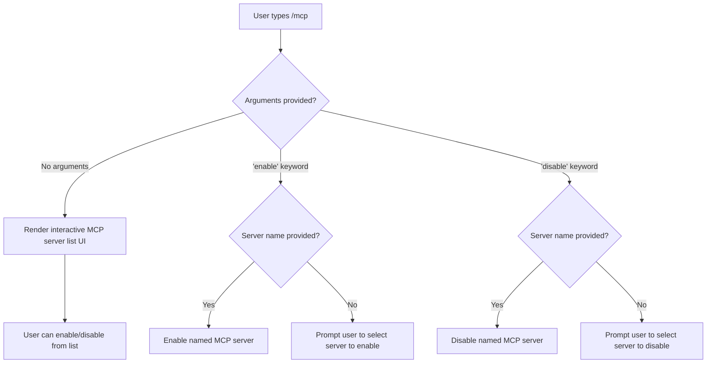

# `/mcp`

> Analysis basis: CC v2.1.144 bundle.js (AST extraction + Claude interpretation)
> Minimum version: v2.1.144

---

## Overview

The `/mcp` command provides in-session management of Model Context Protocol (MCP) servers registered with Claude Code. It allows users to list, enable, or disable individual MCP servers interactively without restarting the CLI. The command renders a JSX-based UI component (`type: local-jsx`) and executes immediately upon entry (`immediate: true`), meaning no additional confirmation step is required before the interface is displayed.

---

## Registration

| Field | Value |
|---|---|
| type | `local-jsx` |
| name | `mcp` |
| description | `Manage MCP servers` |
| argumentHint | `[enable\|disable [server-name]]` |
| immediate | `true` |
| module\_id | `rOq` |

Analysis basis: CC v2.1.144 bundle.js:+10991180

---

## Input Branching

The `argumentHint` field (`[enable|disable [server-name]]`) documents the accepted argument shape. Based on registration data, the command supports at least three input forms:



> **Note:** The exact runtime branching logic for the `rOq` module could not be confirmed at depth ≤ 2 traversal. The flowchart above is derived strictly from the `argumentHint` literal in the registration object.

Analysis basis: CC v2.1.144 bundle.js:+10991180

---

## Behavioral Spec

### Immediate Execution

Because the registration field `immediate` is set to `true`, the command's rendering function is invoked as soon as the slash command is recognized — the user does not need to press Enter a second time or confirm input before the UI renders.

```
function handleMcpCommand(rawInput):
    args = parseArguments(rawInput)

    if args is empty:
        renderInteractiveMcpServerList()
        return

    action = args[0]  // expected: "enable" or "disable"
    serverName = args[1]  // optional

    if action == "enable":
        if serverName is provided:
            enableMcpServer(serverName)
        else:
            renderServerSelectionPrompt(action = "enable")

    else if action == "disable":
        if serverName is provided:
            disableMcpServer(serverName)
        else:
            renderServerSelectionPrompt(action = "disable")

    else:
        renderUnknownActionError(action)
```

> **Note:** The above pseudocode is inferred from the `argumentHint` registration field only. No entry functions or call edges were found for module `rOq` within depth-2 traversal. See the note at the end of this document.

Analysis basis: CC v2.1.144 bundle.js:+10991180

### JSX Rendering (`local-jsx` type)

Commands of type `local-jsx` render a React component inline within the Claude Code terminal UI rather than printing plain text. This means the MCP management interface is interactive (scrollable list, keyboard navigation, etc.) rather than a static printout.

```
function renderMcpComponent(props):
    // Mount a JSX component into the CLI rendering surface
    // Component receives the current list of registered MCP servers
    // and exposes enable/disable actions per server entry
    return <McpManagerComponent servers={getRegisteredServers()} />
```

<!-- TODO: not found in depth-2 traversal; needs --depth 4 -->

---

## State & Side Effects

| Item | Detail |
|---|---|
| Telemetry | None detected at depth ≤ 2 (`telemetry: []`) |
| Hook registration | <!-- TODO: not found in depth-2 traversal; needs --depth 4 --> |
| appState changes | Likely mutates MCP server enabled/disabled state; exact keys <!-- TODO: not found in depth-2 traversal; needs --depth 4 --> |
| Sound | <!-- TODO: not found in depth-2 traversal; needs --depth 4 --> |
| Immediate flag effect | UI renders without a secondary Enter confirmation (registration `immediate: true`) |

Analysis basis: CC v2.1.144 bundle.js:+10991180

---

## Version History

| Version | Change |
|---|---|
| v2.1.144 | Initial analysis; registration confirmed at bundle.js:+10991180, module `rOq` |

---

## Common Mistakes

1. **Forgetting the server name after `enable`/`disable`**: The argument hint `[enable|disable [server-name]]` shows `server-name` as optional, but omitting it when scripting non-interactively will cause the command to fall into an interactive selection prompt rather than acting immediately.
2. **Expecting plain-text output**: Because the command is type `local-jsx`, its output is a rendered UI component. Piping or redirecting STDOUT may not capture the MCP list in a parseable form.
3. **Assuming deferred execution**: The `immediate: true` flag means the command fires on recognition. Do not expect a confirmation step before the UI appears.
4. **Case sensitivity of action keywords**: Based on the argument hint, `enable` and `disable` are lowercase. Passing `Enable` or `DISABLE` may not be recognized depending on the argument parser's case handling.
5. **Expecting telemetry-gated behavior**: No telemetry events were detected in this command's implementation at the analyzed depth. Behavior is therefore not conditionally gated on any telemetry flag observable at this traversal level.

---

## Appendix — Identifier Mapping

> For bundle debugging only. Identifiers change across versions.

| Identifier | Role |
|---|---|
| `rOq` | Module ID for the `/mcp` command implementation (not an obfuscated function name; listed for traceability) |

> No obfuscated function identifiers (`identifiers: []`) were returned by the depth-2 AST traversal for this command. The entry point for module `rOq` was not resolved; a deeper traversal (`--depth 4` or greater) is required to populate this table with runtime function mappings.