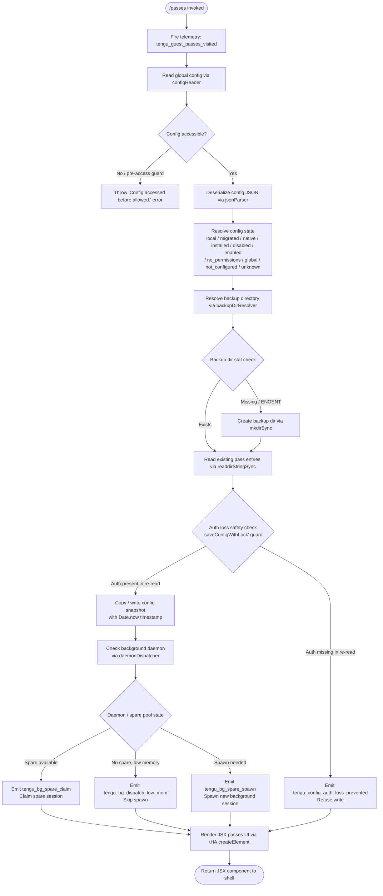

# `/passes`

> Analysis basis: CC v2.1.154 bundle.js (AST extraction + Claude interpretation)
> Minimum version: v2.1.154

---

## Overview

The `/passes` command allows a Claude Code user to share a free week of Claude Code access with friends via a guest-pass mechanism. It is implemented as a `local-jsx` command whose handler (`l75`) is loaded from module `Jd1` inline. On invocation it fires a telemetry visit event, reads/writes config, interacts with the background daemon infrastructure, and renders a JSX component presenting the pass-sharing UI.

---

## Registration

| Field | Value |
|---|---|
| type | `local-jsx` |
| name | `passes` |
| description | `Share a free week of Claude Code with friends` |
| loc_byte | `12140446` |
| loc_byte_end | `12140768` |
| loc_line | `8995` |
| isHidden | `null` (not hidden) |
| module_id | `Jd1` |
| load_inline | `true` |
| arbor_handler.name | `l75` |
| arbor_handler.fqn | `claude-2.1.154::l75` |
| arbor_handler.kind | `AsyncFunction` |
| arbor_handler.resolution_path | `module_id` |
| arbor_handler.n_hits | `2` |

Analysis basis: CC v2.1.154 bundle.js:+12140446

---

## Input Branching

The command exhibits multiple distinct execution branches within the handler and its callees (config state variants, background daemon availability, JSX rendering path). A Mermaid flowchart is used.



---

## Behavioral Spec

### Top-Level Handler (`l75`)

```
async function passesCommandHandler(context):
    fire telemetry event "tengu_guest_passes_visited"   // bundle.js:+12140269
    configData   = await readGlobalConfig()              // calls configFileReader (O8)
    daemonInfo   = await queryDaemonState()              // calls daemonDispatcher (XN8)
    element      = createElement(PassesUI, {             // bundle.js:+12140318
                       config: configData,
                       daemon: daemonInfo,
                       context: context
                   })
    return element
```

Analysis basis: CC v2.1.154 bundle.js:+12140129, +12140163, +12140169, +12140267, +12140318

---

### Config File Reader (`O8` → `hz_`)

```
async function readGlobalConfig():
    ensure directory exists via mkdirSync               // bundle.js:+3207941
    record timestamp = Date.now()                       // bundle.js:+3207986
    acquire file lock via lockAcquirer (o$q)
    if lock contention detected:
        emit telemetry "tengu_config_lock_contention"   // bundle.js:+3208214
        log warning "Lock acquisition took longer..."   // bundle.js:+3208125
    stat config file (L.statSync)                       // bundle.js:+3208290
    raw = readFileSync(configPath, "utf-8")             // bundle.js:+3210241
    data = jsonParser(raw)                              // JSON.parse via m6
    state = classifyConfigState(data)                   // resolves to one of:
                // "unknown" | "local" | "migrated" | "native" | "installed"
                // "disabled" | "enabled" | "no_permissions"
                // "global" | "not_configured"              // bundle.js:+3205789–3206016
    backups = resolveBackupDir(configPath)              // calls backupDirResolver (bzH/UBq)
    if backups needed:
        copy file with timestamp-stamped name           // bundle.js:+3209118, +3211297
        prune old backups keeping newest 5              // literal 5 at bundle.js:+3209144
        rotate .backup. files by Date.now              // literal ".backup." at bundle.js:+3209011
    if stale-write guard triggers:
        emit telemetry "tengu_config_stale_write"       // bundle.js:+3208350
    if auth-loss guard triggers:
        emit telemetry "tengu_config_auth_loss_prevented" // bundle.js:+3208693
        log "saveConfigWithLock: re-read config..."     // fragment: "re-read config is missing"
        abort write
    return data
```

Analysis basis: CC v2.1.154 bundle.js:+3205150, +3205331, +3208503, +3208525

---

### Config State Classification

```
function classifyConfigState(data):
    check initial numeric sentinel (value 0)            // bundle.js:+3205789
    evaluate fields in order:
        if unrecognized structure → return "unknown"    // bundle.js:+3205810
        if local-only markers     → return "local"      // bundle.js:+3205885
        if migrated markers       → return "migrated"   // bundle.js:+3205872
        if native markers         → return "native"     // bundle.js:+3205917
        if installed markers      → return "installed"  // bundle.js:+3205903
        if disabled flag (0)      → return "disabled"   // bundle.js:+3205936
        if enabled flag (1)       → return "enabled"    // bundle.js:+3205962
        if permission denied      → return "no_permissions" // bundle.js:+3205976
        if global scope           → return "global"     // bundle.js:+3206016
        default                   → return "not_configured" // bundle.js:+3205997
```

Analysis basis: CC v2.1.154 bundle.js:+3205789–3206016

---

### Backup Directory Resolver (`bzH` / `UBq`)

```
function resolveBackupDir(configPath):
    guardAccessTiming()                                 // "Config accessed before allowed."
                                                        // bundle.js:+3210152, +3210158
    baseName = path.basename(configPath)                // bundle.js:+3210941, +3209766
    backupDir = buildBackupPath(baseName, "backups")    // literal "backups" bundle.js:+3209726
    if not exists:
        mkdirSync(backupDir)                            // bundle.js:+3210968
    if mkdirSync throws EEXIST:                         // bundle.js:+3211003
        ignore (race-safe)
    entries = readdirStringSync(backupDir)              // bundle.js:+3211026, +3209799
    filter entries starting with baseName prefix        // bundle.js:+3211061, +3209834
    stat each entry                                     // bundle.js:+3210749, +3210075
    if error code == "error":                           // bundle.js:+3210709
        emit telemetry "tengu_config_parse_error"       // bundle.js:+3210789
    return { dir: backupDir, entries: filteredEntries }
```

Analysis basis: CC v2.1.154 bundle.js:+3210152, +3210261, +3210264, +3210404

---

### Daemon / Background Session Query (`XN8` → `b7` / `b6`)

```
async function queryDaemonState():
    sessionInfo = await sessionFactory(b7)              // bundle.js:+11767231
    configSnapshot = await configReader(b6)             // bundle.js:+11767279, +2962578
    watchConfig for changes via fileWatcher (Y17)       // bundle.js:+3207183
        watchFile triggers kb (prefixStripper)          // bundle.js:+3206715
        on change: re-read and emit update
        on stop: unwatchFile                            // bundle.js:+3206876
    dispatch = await daemonDispatcher(b6, w)            // bundle.js:+3187758, +3205331
    return dispatch
```

Analysis basis: CC v2.1.154 bundle.js:+12140163, +11767231, +11767279

---

### Daemon Dispatcher / Spare-Pool Logic (`w` + `E6` + `W5A`)

```
async function daemonDispatcher(config, session):
    freeMem = os.freemem()                              // bundle.js:+15479013
    if freeMem below low-memory threshold (macOS):
        emit telemetry "tengu_bg_dispatch_low_mem"      // bundle.js:+15479183
        emit platform metric "tengu_bg_low_mem_mb"      // bundle.js:+12714331
        skip spawn; return reduced capacity info

    sessionMap = getSessionMap()                        // A.values() bundle.js:+15479304
    for each session in sessionMap:
        retireIfSettled(session)                        // bundle.js:+15479315

    spareSlot = findSpareSlot()                         // "spare" literal bundle.js:+15479374
    if spareSlot exists:
        emit telemetry "tengu_bg_spare_enable"          // bundle.js:+15479878
        claimed = claimSpare(spareSlot, W5A)            // bundle.js:+15479932
        emit telemetry "tengu_bg_spare_claim"           // bundle.js:+15479999
        if claim fails:
            emit telemetry "tengu_bg_spare_claim_fail"  // bundle.js:+15480262
            if error code "enoent" or "ECONNREFUSED"/"econnrefused":
                                                        // bundle.js:+15480180, +15480193, +15480208
                mark slot as unavailable
    else:
        spawnNewSession(config)                         // CF.spawn bundle.js:+15480321
        emit telemetry "tengu_bg_spare_spawn"           // bundle.js:+15478297

    trackSession via sessionRegistry (N5A)              // bundle.js:+15479978
    return sessionHandle
```

Process supervision constants (bundle.js:+15478559, +15478570):
- SIGKILL escalation threshold: 30 seconds
- Secondary escalation threshold: 15 seconds
- Emit `tengu_bg_dispatch_sigkill_escalate` on SIGKILL escalation (bundle.js:+15478604)

Session lifecycle states tracked (bundle.js:+15483801–15484310):
`done` | `killed` | `stopped` | `failed` | `crashed` | `blocked` | `working` | `active` | `bg`

Session idle timeout: 300 000 ms (5 minutes) (bundle.js:+15485368)
Daemon reconnect retry timeout: 2 000 ms (bundle.js:+15478230)

Analysis basis: CC v2.1.154 bundle.js:+15479013, +15479183, +15479874, +15479999, +15480262

---

### Config Lock Acquisition (`o$q` → `k1_`)

```
function acquireConfigLock(path):
    lockObj = buildLockRecord(k1_)                      // bundle.js:+2226375, +2226233
    merged  = Object.assign({}, lockObj, overrides)     // bundle.js:+2226402
    return merged
```

Analysis basis: CC v2.1.154 bundle.js:+3207999

---

### Atomic Config Write (`$L6` — safe-write helper)

```
function safeWriteFile(targetPath, content, mode):
    // Symlink-aware atomic write
    stat lstat to detect symlink                        // bundle.js:+1011144
    if symlink:
        resolve real target (readlinkSync + resolve)    // bundle.js:+1010747, +1010786
    tmpPath = targetPath + "." + randomBytes(6).toString("hex") // literal 6, "hex" bundle.js:+1011392,+1011404
    open tmpPath (openSync)                             // bundle.js:+1010906
    writeFileSync(tmpPath, content)                     // bundle.js:+1011812
    fchmodSync(tmpPath, mode)                           // bundle.js:+1011870; default mode 384 (0o600) bundle.js:+3209426
    log "Applied original permissions to temp file"     // bundle.js:+1011891
    fsyncSync(tmpPath)                                  // bundle.js:+1011936
    renameSync(tmpPath, targetPath)                     // bundle.js:+1012064
    on ELOOP / ENOTDIR:                                 // bundle.js:+1011033, +1011046
        unlinkSync(tmpPath) then rethrow
```

Analysis basis: CC v2.1.154 bundle.js:+1010660, +1011376, +1011812

---

### Feature Flag Check (`hH` — feature gate)

```
function checkFeatureFlag(flagName):
    features = loadFeatureFlags(FD6)                    // reads flag file bundle.js:+4088207
    parsed   = jsonParser(raw)                          // m6 / JSON.parse bundle.js:+4088236
    if Array.isArray(parsed):
        filter to active flags                          // bundle.js:+4088293
    result = evaluate flag via featureEvaluator
    if flag valid:
        emit telemetry "tengu_feature_ok"               // bundle.js:+965176
        return enabled
    else:
        emit telemetry "tengu_feature_bad"              // bundle.js:+965234
        return disabled
```

Analysis basis: CC v2.1.154 bundle.js:+970514, +970527, +970773

---

### Session Auth Resolution (`u$` → `bP`)

```
async function resolveSessionAuth(profile):
    if profile == "profile-implicit":                   // bundle.js:+2942699
        check ANTHROPIC_API_KEY env var                 // bundle.js:+2945727
    if auth == "user_oauth":                            // bundle.js:+2942772
        use OAuth token path
    if apiKeyHelper set:                                // bundle.js:+2945821
        delegate to helper
    if auth mode == "none":                             // bundle.js:+2945860
        throw Error("ANTHROPIC_API_KEY, CLAUDE_CODE_OAUTH_TOKEN, or WIF env vars ... required")
                                                        // bundle.js:+2946149, +2946155
    return resolvedCredentials
```

Analysis basis: CC v2.1.154 bundle.js:+2945640, +2946138, +2946149

---

## State & Side Effects

| Item | Detail |
|---|---|
| Telemetry — visit | `tengu_guest_passes_visited` (bundle.js:+12140269) — fired on every invocation |
| Telemetry — config lock | `tengu_config_lock_contention` (bundle.js:+3208214) |
| Telemetry — stale write | `tengu_config_stale_write` (bundle.js:+3208350) |
| Telemetry — auth loss | `tengu_config_auth_loss_prevented` (bundle.js:+3208693) |
| Telemetry — config parse | `tengu_config_parse_error` (bundle.js:+3210789) |
| Telemetry — bg low mem | `tengu_bg_dispatch_low_mem` (bundle.js:+15479183), `tengu_bg_low_mem_mb` (bundle.js:+12714331) |
| Telemetry — spare pool | `tengu_bg_spare_enable` (bundle.js:+15479878), `tengu_bg_spare_claim` (bundle.js:+15479999), `tengu_bg_spare_spawn` (bundle.js:+15478297), `tengu_bg_spare_claim_fail` (bundle.js:+15480262) |
| Telemetry — SIGKILL | `tengu_bg_dispatch_sigkill_escalate` (bundle.js:+15478604) |
| Telemetry — feature gate | `tengu_feature_ok` (bundle.js:+965176), `tengu_feature_bad` (bundle.js:+965234) |
| Telemetry — bg session | `tengu_bg_sendclaim_failed` (bundle.js:+15459326), `daemon_bg_session_create` (literal, bundle.js:+15478914), `dup_retry_exhausted` (literal, bundle.js:+15478941) |
| Config file | Reads `~/.claude.json` with locking; may write timestamped backup copies under a `backups/` subdirectory; retains at most 5 backup files |
| File permissions | Written config files get mode `0o600` (octal 384) (bundle.js:+3209426) |
| Backup rotation | Uses `".backup."` infix with `Date.now()` timestamp (bundle.js:+3209011, +3211279) |
| Background daemon | May spawn or claim a spare background session; registers session in the active session registry |
| File watcher | Registers a `watchFile` listener on the config path via `B88.watchFile`; deregistered with `B88.unwatchFile` on teardown (bundle.js:+3206546, +3206876) |
| JSX render | Returns a React element via `tHA.createElement` (bundle.js:+12140318) — rendered by the shell |
| Lock file | Acquires a per-config-path lock via `lockAcquirer`; emits `tengu_config_lock_contention` if slow |
| Atomic temp file | Writes to a `.{6-byte-hex}` temp path, then `renameSync` to final destination (bundle.js:+1011376, +1012064) |

---

## Version History

| Version | Change |
|---|---|
| v2.1.154 | Initial analysis — `local-jsx` command registered at bundle.js:+12140446; handler `l75` resolved via module `Jd1` |

---

## Common Mistakes

1. **Invoking `/passes` without authentication** — the handler's auth resolution path (`u$`) will throw if neither `ANTHROPIC_API_KEY`, `CLAUDE_CODE_OAUTH_TOKEN`, nor WIF environment variables are set (bundle.js:+2946155). Ensure credentials are configured before use.
2. **Expecting immediate pass delivery** — the command renders a JSX UI component; it does not directly send passes. The user must interact with the rendered UI to complete the sharing flow.
3. **Running in a low-memory environment** — on macOS, the daemon dispatcher checks `os.freemem()` before spawning background sessions (bundle.js:+15479013). In constrained environments the background session may not be established, potentially degrading the command's responsiveness.
4. **Concurrent Claude Code instances** — simultaneous invocations may trigger `tengu_config_lock_contention` telemetry (bundle.js:+3208214) and slow down config access. The warning "Lock acquisition took longer than expected" (bundle.js:+3208125) indicates this condition.
5. **Misinterpreting the config-state values** — the eleven possible config-state strings (`unknown`, `local`, `migrated`, `native`, `installed`, `disabled`, `enabled`, `no_permissions`, `global`, `not_configured`) affect which UI options are presented; `disabled` and `no_permissions` will show limited or no sharing options.

---

## Appendix — Identifier Mapping

> For bundle debugging only. Identifiers change across versions.

| Identifier | Role |
|---|---|
| `l75` | Top-level async handler for `/passes` command (AsyncFunction, module `Jd1`) |
| `b6` | Config read/watch dispatcher — reads config and sets up file-watch |
| `B6` | Config path builder / base-path resolver |
| `vz_` | Config validation helper |
| `bzH` | Backup directory manager — creates backups dir, copies and rotates config snapshots |
| `q` | Filesystem utility namespace (readFileSync, statSync, mkdirSync, readdirStringSync, copyFileSync, etc.) |
| `m6` | JSON parser wrapper |
| `kb` | Prefix stripper — strips a leading prefix from config keys (startsWith / slice) |
| `H` | Async retry / randomised delay helper (Math.random + setTimeout) |
| `_` | Extended filesystem namespace (readdirStringSync, statSync, toUpperCase) |
| `J8` | Internal event emitter / signal bus |
| `UBq` | Backup entry lister — reads and filters backup directory entries |
| `Sz_` | Backup path builder (joins base dir with "backups" literal) |
| `M` | MCP session map accessor (vSH, JGK, L.get/values) |
| `$` | Project-root resolver / startsWith guard |
| `N` | HTTP/API request builder — constructs and dispatches outbound requests |
| `URK` | HTTP transport layer (mI, pRK, $$A) |
| `RH` | JSON serialiser wrapper (JSON.stringify) |
| `v4` | URL/path normaliser (FzA, H.replace, lastIndexOf, slice) |
| `HuH` | Response body decoder (yzA) |
| `gRK` | Multipart / streaming request handler (Buffer.byteLength, then-chain) |
| `c` | React/UI context or shared state object |
| `w` | Background daemon process manager — kill, spawn, memory checks, session registry |
| `A` | Session map (get, set, values; keyed by session ID) |
| `R` | Supervisor process controller (lEK, Wz, N, hH, $B5, z.write) |
| `uH` | Background session creation success callback |
| `yH` | Background session creation failure callback |
| `eI8` | macOS platform memory check (n6, E6) |
| `FD6` | Feature-flag file reader (QP.readFile, JSON parse, filter) |
| `hH` | Feature flag evaluator (F_, xH, q1, D84, logError) |
| `B` | Settled-session reaper (pH.filter, cH.has) |
| `E6` | Daemon-session lookup and registration (hzH, y88, Iz6, $U) |
| `W5A` | Spare-session claimer — connects to spare slot via Unix socket (CF.claim, bb8.connect) |
| `N5A` | Session lifecycle tracker — tracks active set, handles done/killed/crashed/idle states |
| `L` | Session set operator (q.add, f.finally, q.delete) — shared with N5A |
| `D` | Daemon reconnect loop (E6, $.dispose, eI8, Date.now, Wz) |
| `S` | Disposable resource holder (.dispose) |
| `Y17` | Config file watcher — watchFile / unwatchFile around config path |
| `Mr` | Config-change merge helper |
| `_9` | Hook registrar (f$A.register) |
| `XN8` | Daemon state querier — orchestrates b7 + b6 calls |
| `b7` | Session factory (TY + b6) |
| `TY` | Session constructor (lK, bP, PO, JA, oJ, u$, CO6, kgH) |
| `lK` | Session initialiser (xH) |
| `bP` | Auth profile resolver (Ii6, lK, kgH, ki, pN, jQ, Uq, HR, TTH, PH7, WH7) |
| `PO` | First-party auth gate (GA) |
| `oJ` | OAuth token refresher |
| `u$` | Full auth resolution (ANTHROPIC_API_KEY, apiKeyHelper, WIF, OAuth) |
| `CO6` | Profile-implicit auth path (kgH) |
| `kgH` | Auth credential builder (xH, E3H) |
| `O8` | Global config reader — stat, lock, read, classify, backup orchestrator |
| `hz_` | Config read-and-rotate implementation (mkdirSync, statSync, backup copy, prune) |
| `o$q` | Lock record factory (k1_, Object.assign) |
| `k1_` | Lock primitive constructor (r$q) |
| `uz6` | Config write-with-lock helper |
| `V` | Config entry iterator / startsWith filter |
| `P` | MCP connection pool (Vb8, mh, ou, Promise.all, GAH, ld, hH, F_) |
| `Vb8` | MCP transport factory |
| `F_` | Error wrapping utility (Error, String) |
| `E` | Backup entries slice helper |
| `$L6` | Atomic safe-write utility (symlink-aware rename, fchmod, fsync) |
| `O` | Symlink stat result (isSymbolicLink, k8) |
| `P8` | Temp-file path builder (J8) |
| `f` | Socket / file handle wrapper (on, once, write, end, toString, close) |
| `jQH` | Pass-sharing API request builder |
| `pBq` | Object-entries iterator for pass metadata |
| `JQH` | Pass expiry timestamp calculator (Date.now) |
| `yz_` | Config write path resolver (dirname, B6, K0, RH, $L6) |

---

Note: index built via Arbor fallback; some signals (telemetry, literals) may be missing — see arbor-fallback.js.