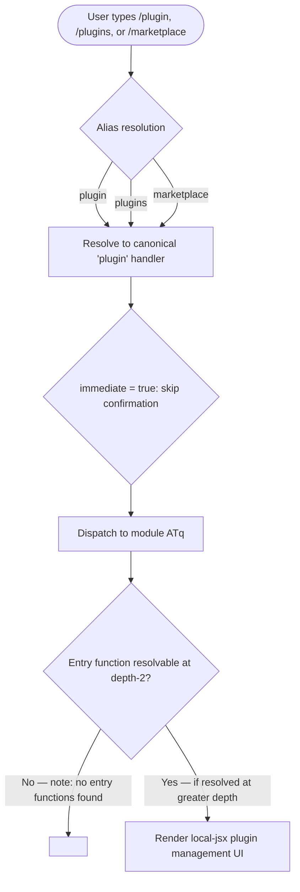

# `/plugin`

> Analysis basis: CC v2.1.144 bundle.js (AST extraction + Claude interpretation)
> Minimum version: v2.1.144

---

## Overview

The `/plugin` command provides a management interface for Claude Code plugins, allowing users to discover, install, and administer plugins from within the CLI. It is registered as a `local-jsx` command, meaning its output is rendered as a JSX component directly in the terminal UI rather than as plain text. The command is aliased as both `/plugins` and `/marketplace`, suggesting it serves as the entry point to a plugin discovery and management surface.

---

## Registration

| Field | Value |
|---|---|
| type | `local-jsx` |
| name | `plugin` |
| description | `Manage Claude Code plugins` |
| aliases | `plugins`, `marketplace` |
| immediate | `true` |
| module_id | `ATq` |

Analysis basis: CC v2.1.144 bundle.js:+11591484

---

## Input Branching

The `immediate: true` flag indicates this command executes without requiring additional user confirmation or argument parsing at the slash-command dispatch layer. Because the AST traversal found no exported entry functions in module `ATq` at depth ≤ 2, the internal branching logic of the rendered JSX component cannot be described from extracted data alone.



---

## Behavioral Spec

### Alias Resolution

All three invocation forms (`/plugin`, `/plugins`, `/marketplace`) resolve to the same command handler via the `aliases` field in the registration object.

```
function resolvePluginCommand(userInput):
    canonicalName = "plugin"
    knownAliases  = ["plugins", "marketplace"]

    if userInput matches canonicalName or any entry in knownAliases:
        return dispatchCommand(canonicalName)
    else:
        return noMatch
```

Analysis basis: CC v2.1.144 bundle.js:+11591484

### Immediate Dispatch

Because `immediate` is set to `true`, the slash-command router does not pause for a secondary confirmation step before invoking the plugin management UI.

```
function dispatchPluginCommand(command):
    if command.immediate == true:
        invokeImmediately(command.handler)
    else:
        awaitUserConfirmation()
        invokeAfterConfirmation(command.handler)
```

Analysis basis: CC v2.1.144 bundle.js:+11591484

### JSX Rendering

The `type: local-jsx` registration type instructs the CLI rendering pipeline to mount the command's output as a React/JSX component inside the terminal UI rather than emitting raw text. The actual component tree rendered by module `ATq` is not recoverable from the depth-2 traversal.

```
function renderPluginCommand(command):
    if command.type == "local-jsx":
        component = loadJSXModule(command.module_id)   // module ATq
        mountInTerminalUI(component)
    else:
        renderAsPlainText(command.output)
```

Analysis basis: CC v2.1.144 bundle.js:+11591484

### Plugin Management Logic (internal)

<!-- TODO: not found in depth-2 traversal; needs --depth 4 -->

The internal sub-features of module `ATq` — such as plugin listing, installation, removal, enabling/disabling, or marketplace API calls — were not reachable by the AST extractor at the configured traversal depth. A re-extraction with `--depth 4` or greater is required to document these behaviors.

---

## State & Side Effects

| Item | Detail |
|---|---|
| Telemetry | None detected at depth ≤ 2 — <!-- TODO: not found in depth-2 traversal; needs --depth 4 --> |
| Hook registration | <!-- TODO: not found in depth-2 traversal; needs --depth 4 --> |
| appState changes | <!-- TODO: not found in depth-2 traversal; needs --depth 4 --> |
| Sound | <!-- TODO: not found in depth-2 traversal; needs --depth 4 --> |
| Alias side effects | None; `/plugins` and `/marketplace` are pure aliases that resolve to the same handler without independent state |

---

## Version History

| Version | Change |
|---|---|
| v2.1.144 | Initial analysis; command registered with aliases `plugins` and `marketplace`; internal module `ATq` entry functions not resolved at depth-2 |

---

## Common Mistakes

1. **Assuming `/marketplace` has different behavior from `/plugin`** — all three invocation forms (`/plugin`, `/plugins`, `/marketplace`) are strict aliases and dispatch to the identical handler with no behavioral distinction.
2. **Expecting a confirmation prompt** — because `immediate: true` is set, the command fires without any secondary prompt; users should not expect a "are you sure?" step before the plugin UI mounts.
3. **Treating the command output as plain text** — the `local-jsx` type means the output is a mounted UI component; tools or tests that scrape raw text from stdout may receive no output or partial ANSI framing rather than structured content.
4. **Concluding the command is a no-op because no entry functions were found** — the absence of resolved entry functions is an artifact of the depth-2 traversal limit on module `ATq`, not evidence that the command lacks implementation.

---

## Appendix — Identifier Mapping

> For bundle debugging only. Identifiers change across versions.

| Identifier | Role |
|---|---|
| `ATq` | Module ID for the plugin command's JSX implementation; used internally by the CLI module loader to resolve the command handler |

> No additional obfuscated function-level identifiers were emitted by the depth-2 AST traversal for this command. Re-run extraction with `--depth 4` to populate this table.