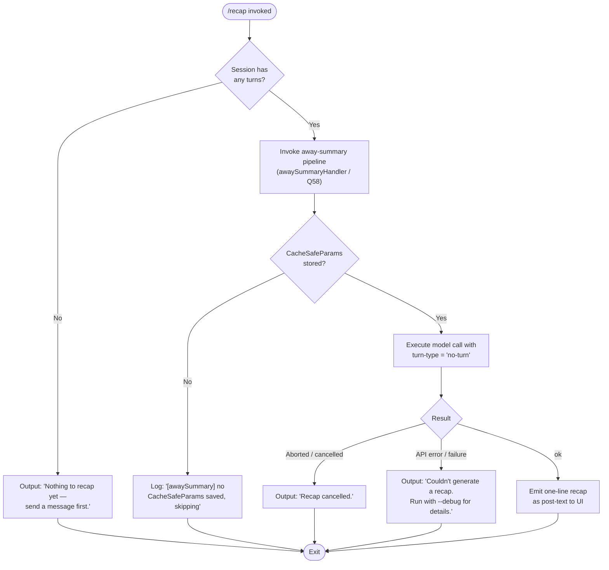

# `/recap`

> Analysis basis: CC v2.1.154 bundle.js (AST extraction + Claude interpretation)
> Minimum version: v2.1.154

---

## Overview

The `/recap` command triggers an immediate, on-demand generation of a one-line summary of the current session. It invokes the same underlying "away summary" pipeline used for automatic session recaps, routing the result as post-text output. The command is non-interactive and cannot be used in thin-client non-interactive mode.

---

## Registration

| Field | Value |
|---|---|
| type | `local` |
| name | `recap` |
| description | `Generate a one-line session recap now` |
| loc_byte | `12660906` |
| loc_byte_end | `12661122` |
| loc_line | `9777` |
| supportsNonInteractive | `false` |
| thinClientDispatch | `post-text` |
| load_inline | `true` |
| load_ident | `zY5` |
| arbor_handler.name | `zY5` |
| arbor_handler.fqn | `claude-2.1.154::zY5` |
| arbor_handler.kind | `AsyncFunction` |
| arbor_handler.resolution_path | `load_ident` |
| arbor_handler.n_hits | `0` |

Analysis basis: CC v2.1.154 bundle.js:+12660906

The handler is registered via an inline `load: () => Promise.resolve({ call: zY5 })` shape — no separate module ID is used. The Arbor symbol graph resolved the handler as `zY5` via the `load_ident` path.

---

## Input Branching

The command follows four distinct outcome branches based on session state and the result of the away-summary call, so a Mermaid flowchart is used.



Analysis basis: CC v2.1.154 bundle.js:+12660514, +12660656, +12660748, +12660806, +5361002, +5361060

---

## Behavioral Spec

### 1. Handler Entry (awaySummaryEntryPoint / `zY5`)

```
async function awaySummaryEntryPoint(context):
    result = await awaySummaryOrchestrator(context)
    return result
```

The handler is an `AsyncFunction` resolved by Arbor as `zY5`. It delegates immediately to the orchestrator (`Q58`).

Analysis basis: CC v2.1.154 bundle.js:+12660514

---

### 2. Pre-flight Check — Session Turn Existence

Before submitting any model request, the orchestrator checks whether the current session has at least one user turn recorded.

```
function checkSessionHasTurns(sessionState):
    if sessionState.turns is empty or null:
        return { status: "empty", message: "Nothing to recap yet — send a message first." }
    return { status: "ready" }
```

If no turns exist, the message `"Nothing to recap yet — send a message first."` is returned directly to the UI without contacting the model.

Analysis basis: CC v2.1.154 bundle.js:+12660656

---

### 3. CacheSafeParams Availability Check

The orchestrator checks for stored `CacheSafeParams` before calling the model. These parameters are needed to safely replay the session context.

```
function checkCacheSafeParams(state):
    if state.cacheSafeParams is null or undefined:
        log.debug("[awaySummary] no CacheSafeParams saved, skipping")
        return { status: "no-params" }
    return { status: "ok", params: state.cacheSafeParams }
```

If absent, the pipeline is skipped silently (only a debug-level log is emitted). The literal `"[awaySummary] no CacheSafeParams saved, skipping"` appears at bundle offset +5361002.

Analysis basis: CC v2.1.154 bundle.js:+5361000, +5361002

---

### 4. Away-Summary Model Call (`awaySummaryOrchestrator` / `Q58`)

The orchestrator sets the turn type to `"no-turn"` (a special mode that does not create a new conversation turn) and attaches an abort-event listener so the summary can be cancelled.

```
async function awaySummaryOrchestrator(context):
    preflightResult = checkSessionHasTurns(context.session)
    if preflightResult.status == "empty":
        return preflightResult

    paramsResult = checkCacheSafeParams(context.state)
    if paramsResult.status == "no-params":
        return paramsResult

    abortController = new AbortController()
    context.signal.addEventListener("abort", () => abortController.abort())

    summaryResult = await runAwaySummaryQuery({
        params:    paramsResult.params,
        turnType:  "no-turn",
        signal:    abortController.signal,
        context:   context,
    })

    return interpretSummaryResult(summaryResult)
```

Key constants:
- Turn type string: `"no-turn"` (bundle.js:+5361060)
- Abort event name: `"abort"` (bundle.js:+5361116)

Analysis basis: CC v2.1.154 bundle.js:+5361060, +5361097, +5361116, +5361128

---

### 5. Result Interpretation

After the model call completes, the result is classified into one of several terminal states:

```
function interpretSummaryResult(result):
    switch result.status:
        case "aborted":
            return { text: "Recap cancelled.", kind: "cancelled" }
        case "api-error":
            return { text: "Couldn't generate a recap. Run with --debug for details.", kind: "error" }
        case "deny":
            log("Away summary cannot use tools")
            return { kind: "denied" }
        case "ok":
            return { text: result.summaryLine, kind: "post-text" }
        default:
            return { kind: "other" }
```

Literals and their byte offsets:
- `"Recap cancelled."` → bundle.js:+12660748
- `"Couldn't generate a recap. Run with --debug for details."` → bundle.js:+12660806
- `"Away summary cannot use tools"` → bundle.js:+5361308 (tool use is explicitly disallowed in this query path)
- `"aborted"` → bundle.js:+5361520
- `"api-error"` → bundle.js:+5361609
- `"ok"` → bundle.js:+5361670
- `"deny"` → bundle.js:+5361293
- `"other"` → bundle.js:+5361361
- Telemetry event label `"away_summary"` → bundle.js:+5361376

Analysis basis: CC v2.1.154 bundle.js:+5361293, +5361308, +5361361, +5361376, +5361520, +5361609, +5361670, +12660748, +12660806

---

### 6. Session-Summary Write-Back (`sessionSummaryWriter` / `gRK`)

If the summary is successfully generated, it is persisted via the session-summary write path. This sub-system:

1. Resolves the target file path via a path-join helper (`rzA`).
2. Stats the existing file, handling `.txt` suffix variants (literal `".txt"` at bundle.js:+202676).
3. Rotates or renames the file if a size threshold is exceeded (uses `Buffer.byteLength` at bundle.js:+203426).
4. Appends the new summary via `uI.appendFile` (bundle.js:+203031).
5. Registers a cleanup hook via `f$A.register` through the hook registrar (`_9`) (bundle.js:+58450).
6. Resets a debounce timer using `clearTimeout` / `setTimeout` (bundle.js:+57864, +58028).

```
async function sessionSummaryWriter(summaryText, sessionDir):
    targetPath  = resolveSummaryPath(sessionDir)       // rzA
    currentSize = Buffer.byteLength(summaryText)
    existingStat = await statFile(targetPath)           // izA

    if existingStat exists and rotation needed:
        await rotateFile(targetPath)                    // izA rename logic

    await ensureDirectoryExists(targetPath.parent)      // FRK → uI.mkdir
    await appendToFile(targetPath, summaryText)         // FRK → uI.appendFile

    scheduleCleanupHook()                               // _9 → f$A.register
    resetDebounceTimer()                                // kxH
```

Analysis basis: CC v2.1.154 bundle.js:+203218, +203243, +203251, +203281, +203371, +203388, +203420, +203426, +203459, +203476, +203485, +203581

---

### 7. Query Pipeline Internals (shared with main agent loop)

`/recap` reuses the main query engine (`vcL`) for the model call but constrains it to a single non-interactive turn (`"no-turn"` turn type). The pipeline emits a series of internal lifecycle labels (see **State & Side Effects** below). Tool use is denied at the permission layer for this invocation path.

Analysis basis: CC v2.1.154 bundle.js:+10624797, +5361293, +5361308

---

## State & Side Effects

| Item | Detail |
|---|---|
| Telemetry — query engine | `tengu_auto_compact_rapid_refill_breaker`, `tengu_auto_compact_succeeded`, `tengu_ptl_surfaced_to_user`, `tengu_refusal_fallback_triggered`, `tengu_orphaned_messages_tombstoned`, `tengu_model_fallback_triggered`, `tengu_query_error`, `tengu_model_response_keyword_detected`, `tengu_malformed_tool_use_response`, `tengu_stop_hook_block_count`, `tengu_loop_dynamic_wakeup_ends_turn`, `tengu_post_autocompact_turn`, `tengu_query_before_attachments`, `tengu_query_after_attachments`, `tengu_mcp_tools_refreshed_mid_turn` |
| Telemetry — background daemon | `tengu_bg_spare_enable`, `tengu_bg_low_mem_mb`, `tengu_bg_spare_spawn`, `tengu_bg_dispatch_sigkill_escalate`, `tengu_bg_dispatch_low_mem`, `tengu_bg_spare_claim`, `tengu_bg_spare_claim_fail`, `tengu_bg_proto_mismatch`, `tengu_bg_dispatch_stale_drop`, `tengu_bg_attach_legacy_autorespawn`, `tengu_bg_attach`, `tengu_bg_attach_stall_gave_up`, `tengu_bg_attach_stall_respawn`, `tengu_bg_attach_kick` |
| Telemetry — feature flags | `tengu_feature_ok`, `tengu_feature_bad` |
| Telemetry — forked agent | `tengu_forked_agent_default_turns_exceeded`, `tengu_fork_agent_query` |
| Hook registration | Cleanup hook registered via `f$A.register` (through `_9`) upon successful summary write (bundle.js:+58450) |
| File system | Summary appended to a session-specific file under the session directory; file may be rotated when size threshold is reached; `.txt` suffix checked during stat |
| appState changes | `getAppState` / `setAppState` called inside the query engine (`K08`); state is mutated during model call and restored on completion (bundle.js:+10664193, +10664973) |
| Tool use | Explicitly blocked for this invocation — tool requests are denied with `"Away summary cannot use tools"` (bundle.js:+5361308) |
| Turn type | `"no-turn"` — no new conversation turn is persisted (bundle.js:+5361060) |
| Non-interactive support | `supportsNonInteractive: false` — command is unavailable in non-interactive pipelines |
| thinClientDispatch | `post-text` — output is delivered as trailing text after the current prompt |
| Sound | <!-- TODO: not found in depth-2 traversal; needs --depth 4 --> |
| Abort handling | AbortController attached to the parent signal; cancelled recap emits `"Recap cancelled."` (bundle.js:+12660748) |

---

## Version History

| Version | Change |
|---|---|
| v2.1.154 | Initial analysis |

---

## Common Mistakes

1. **Running `/recap` before sending any messages** — The command returns `"Nothing to recap yet — send a message first."` and does nothing. At least one user turn must exist in the session before a recap can be generated.
2. **Expecting tool output in the recap** — The away-summary pipeline explicitly denies all tool use. Any attempt by the model to call a tool will be rejected with a `"deny"` result, and no recap will be produced.
3. **Using `/recap` in non-interactive / headless mode** — `supportsNonInteractive` is `false`. Invoking the command in a script or CI pipeline where there is no interactive terminal will not work.
4. **Expecting a detailed multi-line recap** — The command is specifically designed to produce a *one-line* summary. Longer recaps are a product of the main auto-compact path, not this command.
5. **Relying on the recap file location without checking rotation** — The session-summary file is subject to size-based rotation. Tooling that reads the summary file should account for the possibility that the current content has been moved and a new file started.

---

## Appendix — Identifier Mapping

> For bundle debugging only. Identifiers change across versions.

| Identifier | Role |
|---|---|
| `zY5` | Main handler (`AsyncFunction`); away-summary entry point loaded via `load_ident` |
| `Q58` | Away-summary orchestrator; performs pre-flight checks and calls the model |
| `J8H` | Internal helper called by `Q58` at the start of orchestration |
| `N` | Session-state / turn-context accessor used throughout the query pipeline |
| `URK` | Turn-type resolver / query parameter builder |
| `$$A` | Sub-helper invoked by `URK` for parameter assembly |
| `H` | General-purpose context/state object (accessed for random, setTimeout, write, etc.) |
| `RH` | JSON serialisation helper (`JSON.stringify`) |
| `_` | String/array utility (accessed for `toUpperCase`) |
| `v4` | Path or identifier formatter (uses `replace`, `lastIndexOf`, `slice`) |
| `FzA` | Array mapper used inside the path formatter |
| `q` | File-system utility (accesses `unlinkSync`) |
| `A` | File / string utility (accessed for `toLowerCase`, `lastIndexOf`, `slice`) |
| `HuH` | File-write wrapper (delegates to `yzA`) |
| `yzA` | Low-level write helper (`H.write`) |
| `gRK` | Session-summary writer; appends recap to disk |
| `kxH` | Debounce timer manager (`clearTimeout` / `setTimeout` / `setImmediate`) |
| `cMH` | Summary content assembler; joins content lines |
| `B6` | Utility called by session-summary writer (role unclear at depth 2) |
| `B16` | Helper shared between session-summary writer and file append path |
| `rzA` | Summary file path resolver (`path.join`) |
| `izA` | File stat / rotate helper (`uI.stat`, `uI.rename`, `uI.unlink`) |
| `FRK` | Directory-create and file-append worker (`uI.mkdir`, `uI.appendFile`) |
| `_9` | Cleanup hook registrar (`f$A.register`) |
| `u0` | Top-level query runner; wraps the main agent loop |
| `K08` | Core agent-loop implementation; manages `getAppState` / `setAppState` |
| `ny` | Agent initialiser (sets up abort and event bindings) |
| `e4H` | State dump/load helper |
| `mYH` | Mid-loop state mutation helper |
| `R59` | Response-processing helper inside the agent loop |
| `f` | Session-close / cleanup handler |
| `RZ8` | Internal loop utility (role unclear at depth 2) |
| `Kh` | Random-bytes generator (`Gk9.randomBytes`) |
| `L08` | Post-query cleanup step |
| `HAH` | Attachment / hint handler invoked after the model call |
| `U4` | Sub-helper used by the attachment handler |
| `JSH` | Message filter for attachment processing |
| `au` | Per-turn query dispatcher; calls `vcL` and `if8` |
| `vcL` | Main query-engine function (model call, streaming, tool loop) |
| `if8` | Subagent/turn cleanup and exit handler |
| `yH` | Turn-result normaliser |
| `uH` | Alternative turn-result normaliser |
| `$v6` | State-type membership checker (`JgL.has`) |
| `NAH` | Post-query notification helper |
| `XE8` | Additional post-query step (role unclear at depth 2) |
| `jG1` | Delegates to `$v6` for state checking |
| `D` | Push-based message queue / dispatcher |
| `E6` | Event routing / observable helper |
| `$` | Disposable resource manager |
| `eI8` | Secondary event dispatcher |
| `P5A` | Background PTY spawn helper (`Bun.spawn`) |
| `c` | Core utility / primitive helper (used in many contexts) |
| `Wz` | Utility called by the message queue |
| `J8` | Shared helper used by session-summary writer and message queue |
| `hH` | Error logger (`Li.logError`) |
| `C7H` | Concurrent-request filter / deduplicator |
| `Wj` | Sub-helper used by `C7H` |
| `Xl7` | Array find helper used by `C7H` |
| `L` | Promise-tracking set (add / finally / delete) |
| `ucL` | Fork-agent query wrapper |
| `Z8` | Session ID generator (`Zv.randomUUID`) |
| `X` | IPC/stream frame reader (`Buffer.concat`, `indexOf`) |
| `J` | Byte-array utility used by frame reader |
| `w` | Background session lifecycle manager (kill, spawn, etc.) |
| `xf` | Stream-end helper |
| `lU5` | PTY / IPC multiplexer (handles ping, reply, resize, attach, etc.) |
| `ZH` | String conversion helper (`String`) |
| `nJ9` | Message flat-mapper used in the away-summary result path |