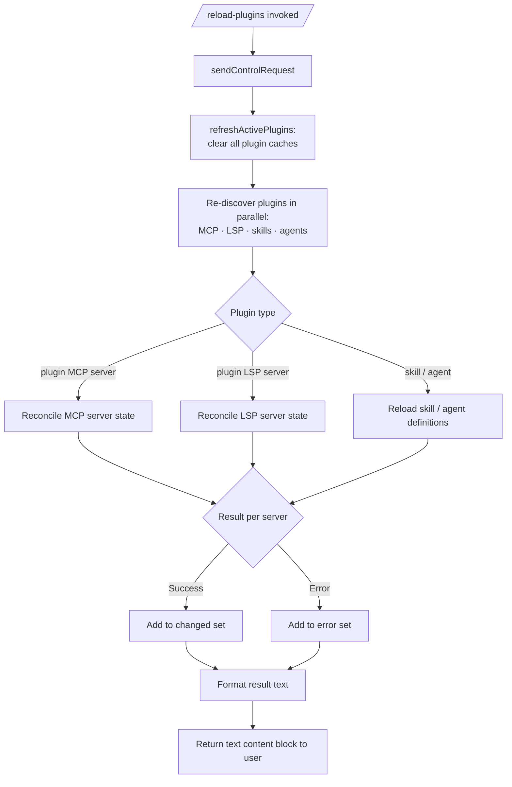

# `/reload-plugins`

> Analysis basis: CC v2.1.154 bundle.js (AST extraction + Claude interpretation)
> Minimum version: v2.1.154

---

## Overview

`/reload-plugins` activates pending plugin changes in the current Claude Code session without requiring a full restart. It clears all plugin caches, re-discovers installed plugins (including MCP servers, LSP servers, skills, and agents), reconciles running server state, and emits a summary of what changed. The command dispatches a `control-request` over the thin-client transport, making it a session-scoped administrative operation.

---

## Registration

| Field | Value |
|---|---|
| type | `local` |
| name | `reload-plugins` |
| description | `Activate pending plugin changes in the current session` |
| loc_byte | `12282256` |
| loc_byte_end | `12282475` |
| loc_line | `9208` |
| supportsNonInteractive | `false` |
| thinClientDispatch | `control-request` |
| module_id | `ll1` |
| load_inline | `true` |
| arbor_handler.name | `h55` |
| arbor_handler.fqn | `claude-2.1.154::h55` |
| arbor_handler.kind | `AsyncFunction` |
| arbor_handler.resolution_path | `module_id` |
| arbor_handler.n_hits | `0` |

Analysis basis: CC v2.1.154 bundle.js:+12282256

---

## Input Branching

The handler is a linear async pipeline with no user-input branching (the command accepts no arguments). The only branching occurs internally within the plugin refresh sub-routine based on plugin type and reload outcome.

```
1. Receive /reload-plugins invocation (no arguments).
2. Send control-request via thin-client transport.
3. Invoke plugin cache clearing (refreshActivePlugins).
4. Re-discover all plugin types in parallel.
5. Reconcile running server states.
6. Collect results: changed / error sets.
7. Emit formatted result text to user.
```

For the internal refresh sub-routine, 3+ branches exist based on plugin type outcome:



---

## Behavioral Spec

### 1. Handler Entry — `reloadPluginsHandler` (bundle ident: `h55`)

```
async function reloadPluginsHandler(context):
    sendControlRequest(context, "ccr")          // literal "ccr" at +12281296
    pluginList = await discoverInstalledPlugins()
    refreshResult = await refreshActivePlugins(pluginList)
    resultText = formatPluginReloadResult(refreshResult)
    return { type: "text", content: resultText }  // literal "text" at +12281658
```

Analysis basis: CC v2.1.154 bundle.js:+12281278

### 2. Control-Request Dispatch

Before any plugin work begins, the handler sends a control-request through the thin-client transport layer (function `sendControlRequest`, bundle ident `A.sendControlRequest`). The string constant `"ccr"` identifies this as a plugin-reload control message.

Analysis basis: CC v2.1.154 bundle.js:+12281315

### 3. Plugin Cache Clearing — `refreshActivePlugins` (bundle ident: `w2H`)

```
async function refreshActivePlugins(pluginList):
    log("refreshActivePlugins: clearing all plugin caches")
    // literal at +12279164

    clearInstalledPluginsCache()     // Ow1 → N path
    clearSkillIndexCache()           // E3 → Xu → H.clearSkillIndexCache
    clearMcpServerCache()            // go → VG8.clear
    clearEk9Cache()                  // ek9
    clearFs9Cache()                  // Fs9

    [mcpServers, lspServers, skills, agents] = await Promise.all([
        loadMcpPlugins(),
        loadLspPlugins(),
        loadSkillPlugins(),
        loadAgentPlugins()
    ])

    changedSet  = computeChangedPlugins(mcpServers, lspServers, skills, agents)
    errorSet    = computeErrorPlugins(changedSet)

    emit(Wc, changedSet)             // Wc.emit at +12280251
    return { changed: changedSet, errors: errorSet }
```

The log message `"refreshActivePlugins: clearing all plugin caches"` is emitted at the start of every invocation.

Analysis basis: CC v2.1.154 bundle.js:+12279162

### 4. Skill Index Cache Clear — `clearSkillIndexCache` (bundle ident: `$C` → `Xu`)

```
function clearSkillIndexCache(state):
    if state is already resolved:
        return Promise.resolve()
    invoke qs_()                    // internal cache purge
    state.clearSkillIndexCache()    // H.clearSkillIndexCache at +12851265
    notifyObservers(SG8, QD1, YSH)
```

Analysis basis: CC v2.1.154 bundle.js:+12851265

### 5. Installed Plugins Discovery — `loadInstalledPlugins` (bundle ident: `lo`)

```
async function loadInstalledPlugins(scope):
    roots = getPluginRoots(scope)           // uses "pluginRoot" key at +6495191
    for each root in roots:
        files = scanDirectory(root)
        for each file in files:
            if file.endsWith(".mcpb") or file.endsWith(".dxt"):
                plugin = await loadMcpbPlugin(file)
            elif file.endsWith(".mcp.json"):
                plugin = await loadMcpJsonPlugin(file)
            else:
                plugin = await loadLocalPlugin(file)
            pluginList.push(plugin)
    return pluginList
```

File extension constants: `".mcpb"` (+5149116), `".dxt"` (+5149137), `".mcp.json"` (+6566629).

Analysis basis: CC v2.1.154 bundle.js:+6566078

### 6. Plugin Reload Type Routing — `reloadPluginState` (bundle ident: `i5H`)

```
async function reloadPluginState(pluginEntry, runningState):
    pluginType = getPluginType(pluginEntry)

    switch pluginType:
        case "plugin":          // literal at +12281410
            reloadMcpServer(pluginEntry)
        case "skill":           // literal at +12281441
            reloadSkillDefinition(pluginEntry)
        case "agent":           // literal at +12281469
            reloadAgentDefinition(pluginEntry)
        case "plugin MCP server":   // literal at +12281501
            reconnectMcpServer(pluginEntry)
        case "plugin LSP server":   // literal at +12281994
            reconnectLspServer(pluginEntry)

    if error occurred:
        classify error as:
            "dependency-unsatisfied"   // +11451988
            "not-found"                // +11452025
            "generic-error"            // +12280813
            "lsp-manager"              // +12280666
        errorSet.add(pluginEntry)
    else:
        changedSet.add(pluginEntry)
```

The separator `" · "` (literal at +12281528) is used when formatting multi-item status lines.

Analysis basis: CC v2.1.154 bundle.js:+11452052

### 7. Installed Plugins Cache Clear — `clearInstalledPluginsCache` (via `Ow1` → `N`)

```
function clearInstalledPluginsCache():
    log("Cleared installed plugins cache")   // literal at +9766241
    invalidate all cached plugin directory reads
```

Analysis basis: CC v2.1.154 bundle.js:+9766239

### 8. Reload Result Formatting

```
function formatPluginReloadResult(result):
    lines = []
    for each changed plugin:
        lines.push(plugin.name + " · " + statusLabel)
    for each errored plugin:
        lines.push(plugin.name + " · error")   // "error" literal at +12281583
    return { type: "text", text: lines.join("\n") }
```

Analysis basis: CC v2.1.154 bundle.js:+12281658

### 9. LSP Plugin Configuration Loading — `loadLspConfig` (bundle ident: `EyH`)

```
async function loadLspConfig(pluginRoot):
    configPath = join(pluginRoot, ".lsp.json")   // literal at +8151576
    raw = await readFile(configPath)
    parsed = parseJson(raw)                      // m6 → JSON.parse
    if parse fails:
        logError("lsp-config-invalid")           // literal at +8151846
        return null
    validate(parsed, schema: I.record + I.string)
    return parsed
```

Analysis basis: CC v2.1.154 bundle.js:+8151560

### 10. Plugin State Emission

After reconciliation, results are broadcast via `Wc.emit` so that the UI layer can update plugin status indicators without a full session reload.

Analysis basis: CC v2.1.154 bundle.js:+12280251

---

## State & Side Effects

| Item | Detail |
|---|---|
| Telemetry | `tengu_feature_ok` (+965176), `tengu_feature_bad` (+965234), `tengu_feature_sad` (+965311), `tengu_daemon_control` (+15514441), `tengu_daemon_config_reload` (+15493092) |
| Telemetry (background) | `tengu_bg_dispatch_sigkill_escalate` (+15478604), `tengu_bg_dispatch_low_mem` (+15479183), `tengu_bg_spare_enable` (+15479878), `tengu_bg_spare_claim` (+15479999), `tengu_bg_spare_claim_fail` (+15480262), `tengu_daemon_idle_exit` (+15498279) |
| Telemetry (voice, indirect) | `tengu_voice_circuit_breaker_tripped` (+13983124), `tengu_voice_recording_started` (+13984676), `tengu_voice_stream_early_retry` (+13986116) — reached via deep call-graph traversal into shared modules; not directly triggered by `/reload-plugins` |
| Plugin cache invalidation | All installed-plugin caches are fully cleared on every invocation (`VG8.clear`, `clearSkillIndexCache`, installed-plugins cache, `ek9`, `Fs9`) |
| MCP server reconnect | Running MCP servers are stopped, reconfigured, and restarted if their configuration changed |
| LSP server reconnect | LSP servers listed under `.lsp.json` are re-registered if the configuration changed |
| Skill/agent rediscovery | Skill index is rebuilt from disk |
| Event emission | `Wc.emit` broadcasts the changed-plugin set to registered observers (UI refresh) |
| Hook registration | `f$A.register` is called during plugin reload (`_9` call edge at +203581); hooks are re-registered for updated plugins |
| appState changes | Plugin registry map (`zH`, `jH` maps) updated with new server entries; `G.set` and `b.set` updated |
| Sound | None observed |
| supportsNonInteractive | `false` — command cannot run in non-interactive / headless mode |

---

## Version History

| Version | Change |
|---|---|
| v2.1.154 | Initial analysis |

---

## Common Mistakes

1. **Running in non-interactive mode** — `/reload-plugins` has `supportsNonInteractive: false`. Invoking it from a script or `--print` pipeline will be rejected or silently skipped.
2. **Expecting immediate MCP tool availability** — the command clears caches and reconnects servers, but MCP server startup is asynchronous. Tools from a freshly loaded server may not be available in the very next message.
3. **Confusing `/reload-plugins` with a full restart** — this command reloads plugin state within the current session; it does not restart the Claude Code process or the daemon.
4. **Modifying plugin files while `/reload-plugins` is running** — the discovery phase reads plugin directories at a point-in-time snapshot; changes written concurrently may or may not be picked up.
5. **Assuming LSP servers are always reloaded** — LSP config is only re-applied when a `.lsp.json` file is present and parses correctly; an invalid JSON file causes the LSP plugin to be silently skipped with an `lsp-config-invalid` log entry.

---

## Appendix — Identifier Mapping

> For bundle debugging only. Identifiers change across versions.

| Identifier | Role |
|---|---|
| `h55` | Main handler for `/reload-plugins` (AsyncFunction, resolved via module_id `ll1`) |
| `W3` | Control-request send helper |
| `aWH` | Underlying transport send implementation |
| `ll` | Module loader helper for `ll1` |
| `k8` | Module export accessor |
| `w2H` | `refreshActivePlugins` — clears caches and re-discovers all plugin types |
| `N` | General async/network request dispatcher |
| `URK` | Network request builder |
| `$$A` | Request header assembler |
| `H` | Generic async operation / retry scheduler |
| `RH` | JSON serialiser helper |
| `v4` | URL/path formatter |
| `FzA` | Path-segment mapper |
| `HuH` | Write-stream helper |
| `yzA` | Low-level stream write |
| `gRK` | Incremental file-write / log-rotation manager |
| `kxH` | Debounce/timer helper |
| `cMH` | Chunk-assembly / join helper |
| `B6` | Base config path resolver |
| `B16` | Log-file rotation helper |
| `rzA` | Log-file path resolver |
| `izA` | Log-file rename/rotate executor |
| `FRK` | Log-file append worker |
| `_9` | Hook registrar (`f$A.register`) |
| `Ow1` | Installed-plugins cache invalidator |
| `E3` | Skill / agent reloader orchestrator |
| `_RL` | Plugin reload pipeline |
| `AE` | Plugin-load network helper |
| `SG8` | Observer notification helper A |
| `z58` | Observer notification helper B |
| `uf8` | Observer notification helper C |
| `MN_` | Plugin-root map builder |
| `hH` | Error logger (`Li.logError`) |
| `rL8` | Reload state tracker A |
| `$d_` | Reload state tracker B |
| `rD1` | Reload state tracker C |
| `$C` | Skill-index cache orchestrator |
| `Xu` | Skill-index cache clear executor |
| `QD1` | Post-clear observer A |
| `YSH` | Post-clear observer B |
| `PX6` | Secondary observer notification |
| `lE_` | Tertiary observer notification |
| `go` | MCP server cache clearer (`VG8.clear`) |
| `ek9` | Plugin cache slot A |
| `Fs9` | Plugin cache slot B |
| `$_` | Shared utility dispatcher |
| `ov` | Core utility function |
| `K` | Column-formatter (pad-end helper) |
| `lo` | Installed plugin loader / directory scanner |
| `j78` | Plugin directory walker |
| `rU` | File-extension checker (`.mcpb`, `.dxt`) |
| `Bg` | Plugin directory base resolver |
| `FN_` | `.mcp.json` file parser |
| `P8` | Error classifier |
| `m6` | JSON parse wrapper |
| `kv9` | Plugin status builder |
| `qX6` | MCPB archive installer |
| `ZH` | String coercion helper |
| `EyH` | LSP config loader |
| `ijL` | LSP config path validator |
| `njL` | LSP path relative resolver |
| `$` | Daemon-status helper |
| `bo1` | Daemon status file writer |
| `Si` | Daemon status model |
| `o9` | Async store accessor |
| `MI6` | Daemon status path builder |
| `O` | Background-session accessor |
| `I55` | Changed-plugin set computer (added/updated) |
| `cl1` | Changed-plugin membership test |
| `y55` | Error-plugin set computer |
| `i5H` | Plugin reload type router |
| `_u` | Known-marketplaces loader |
| `yf` | Known-marketplaces JSON reader |
| `uG8` | Marketplaces file path builder |
| `MNH` | Plugin metadata entry builder |
| `h8` | Plugin entry constructor |
| `iF6` | Plugin field extractor A |
| `ig` | Plugin schema validator |
| `HE` | Plugin validation error thrower |
| `BA` | Plugin scope checker |
| `eP` | Plugin dependency validator |
| `HJ6` | Dependency host-pattern checker |
| `P78` | Policy-settings reader |
| `Z59` | Host-pattern matcher |
| `E59` | Path-pattern matcher |
| `Nk7` | Dependency URL validator |
| `s6H` | Plugin source scope reader |
| `v59` | Dependency path validator |
| `T59` | Dependency type validator |
| `j7H` | `.claude-plugin` / marketplace JSON reader |
| `iE6` | Plugin marketplace path builder |
| `Yd_` | Marketplace JSON parser/validator |
| `J8` | Error code constant accessor |
| `YT` | Plugin install state loader |
| `hE_` | Plugin install entry reader |
| `seL` | Plugin installed-set membership checker |
| `zX6` | Full plugin-state reconciler (large function) |
| `OT` | Plugin type extractor |
| `_58` | Plugin scope/permission checker |
| `BL6` | Local-source path prefix checker (`./`) |
| `z` | MCP server manager map |
| `yH` | MCP server stop helper |
| `uH` | MCP server start helper |
| `vy` | First-party MCP server starter |
| `km` | Process exit / race resolver |
| `C6` | Context store accessor |
| `YB6` | Store-bound context getter |
| `_E` | Plugin settings file reader |
| `wd_` | Settings file sync reader |
| `jd_` | Settings entries iterator |
| `J` | Plugin server add-set |
| `w` | Background session / process manager |
| `G` | Plugin registry map (set side) |
| `nV6` | Registry map helper A |
| `Vb8` | Registry map helper B |
| `lV` | Plugin version range resolver |
| `$k` | Version range sub-helper |
| `p78` | Semver validity checker |
| `T` | UI event emitter / key handler |
| `b` | UI event base |
| `Z0` | User settings accessor |
| `Y` | Supervisor / MCP server lifecycle manager |
| `Pf9` | Plugin dependency graph builder |
| `M` | MCP server set |
| `tE` | Feature-flag set accessor |
| `x96` | Feature-flag key builder |
| `P` | MCP server connection manager |
| `F_` | Error message formatter |
| `C` | Plugin result collector |
| `R` | MCP server write helper |
| `p` | Write timeout manager |
| `dD9` | Plugin dependency order resolver |
| `S` | MCP server instance store |
| `x` | MCP server idle timer |
| `c` | Core context object |
| `U_` | Plugin installation executor |
| `wO` | Plugin install pre-check |
| `Uo8` | Plugin archive extractor |
| `zP` | Settings merge helper |
| `mr8` | Install timestamp recorder |
| `mGH` | Plugin post-install metadata writer |
| `$L6` | Atomic file write helper |
| `Xz` | Cache-clear broadcaster |
| `tB6` | Settings file writer |
| `hb` | Claude settings path resolver |
| `t6` | Context supplier |
| `vp` | Plugin load telemetry emitter |
| `$X6` | Plugin source path validator |
| `l` | MCP server filter set |
| `HH` | Voice recording manager (shared module) |
| `MH` | Key-input handler (shared module) |
| `bCH` | Key binding helper A |
| `by6` | Key binding helper B |
| `OH` | Input stream handler |
| `_H` | Silence-timeout handler |
| `tH` | MCP tool list (shared) |
| `e` | Notification adder |
| `wH` | Queue enqueuer |
| `mH` | MCP tool metadata builder |
| `xy6` | Tool binding helper |
| `AH` | MCP tool reconciler |
| `wqH` | Tool update notifier |
| `wA6` | Tool remove notifier |
| `uy6` | Tool remove executor |
| `jH` | Plugin server map (jH.get/set) |
| `UH` | Timer/include list |
| `W` | Output line collector |
| `o` | Silence-timeout trigger |
| `LH` | Lifecycle event emitter |
| `zH` | Plugin server state map |
| `wJ6` | Version-range conflict checker |
| `XT_` | Version-range pre-validator |
| `sL8` | Dependency conflict scanner |
| `bD9` | Conflict accumulator |
| `tL8` | Git tag version resolver |
| `$b7` | Git remote helper |
| `V8` | Git command executor |
| `j` | Process kill helper |
| `OX6` | Plugin archive installer (enH orchestrator) |
| `enH` | Full plugin install / extract pipeline |
| `q58` | Plugin registry writer |
| `lD9` | Post-install validator |
| `M8H` | Plugin content hasher |
| `Yk` | Hash/path helper |
| `X` | Binary stream reader |
| `g78` | Plugin directory reader |
| `oU` | Plugin extract error handler |
| `EwH` | Yk-based extract helper |
| `H58` | Temp-file cleanup helper |
| `EE_` | Plugin state update applier |
| `Q` | Daemon status reader |
| `DN6` | Daemon status file reader |
| `rI1` | Daemon status file deleter |
| `FH` | Plugin server push-set |
| `ap_` | RH-based serialiser |
| `WH` | Plugin boolean/has checker |
| `qF` | Plugin queue flusher |
| `k6` | Core render/update trigger |
| `r` | Allow/deny policy checker |
| `VH` | Plugin server has-set checker |
| `$l` | Plugin sort/concat helper |
| `oRH` | Plugin sort comparator |
| `ES` | Core observer |
| `DH` | Voice state machine (shared, overlaps HH) |
| `ao` | Plugin dependency graph walker |
| `s` | UI input stream handler |
| `y4` | Plugin graph node |
| `WC6` | Plugin graph edge helper |
| `ElH` | Plugin cache entry accessor |
| `vH` | Plugin server concat list |
| `V` | Plugin server base list |
| `jb7` | Plugin batch resolver |
| `d` | Plugin process push-set |
| `gh8` | Process set helper |
| `a` | Focus-timeout trigger |
| `oy` | Plugin name lowercase checker |
| `j3` | String normaliser |
| `xH` | String coercion (String()) |
| `Y4` | OTEL metrics emitter |
| `iu8` | OTEL attribute builder |
| `qNH` | OTEL metric recorder |
| `Q96` | OTEL event sequencer |
| `qH` | Focus-gain handler |
| `e6H` | Dependency display formatter (max 5 items, literal at +4962362) |

---

Note: index built via Arbor fallback; some signals (telemetry, literals) may be missing — see arbor-fallback.js.