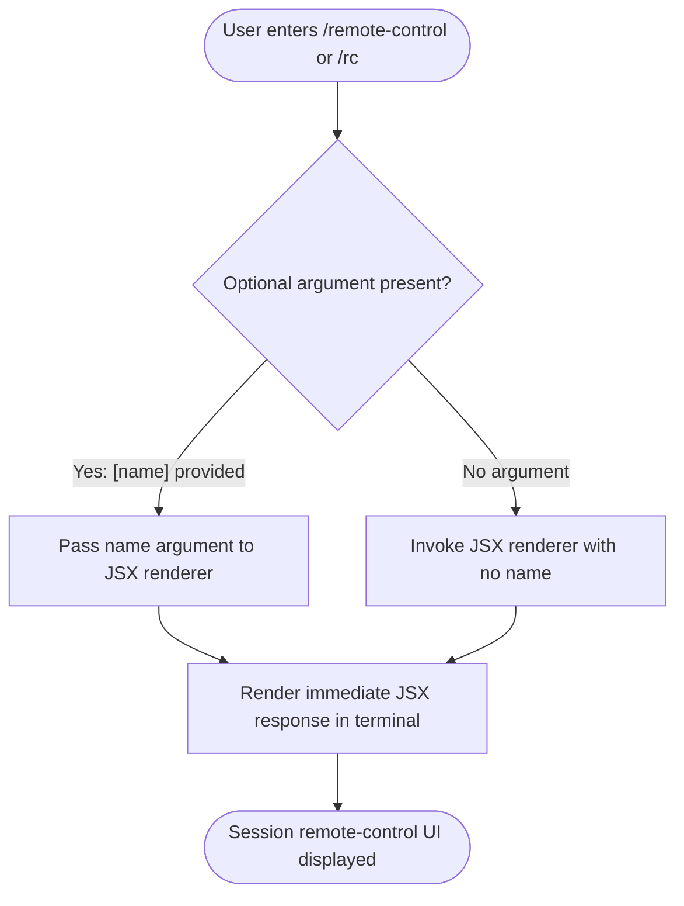

# `/remote-control`

> Analysis basis: CC v2.1.144 bundle.js (AST extraction + Claude interpretation)
> Minimum version: v2.1.144

---

## Overview

The `/remote-control` command (alias `/rc`) enables a user to link and control the current Claude Code CLI session from an external device — such as a mobile phone — or from the `claude.ai/code` web interface. It is registered as a `local-jsx` command with the `immediate` flag set, meaning it renders a JSX response immediately upon invocation without waiting for further input processing. The `[name]` argument hint suggests it optionally accepts a session name or identifier parameter.

---

## Registration

| Field | Value |
|---|---|
| type | `local-jsx` |
| name | `remote-control` |
| description | `Control this session from your phone or claude.ai/code` |
| argumentHint | `[name]` |
| immediate | `true` |
| aliases | `["rc"]` |
| module\_id | `EVq` |

Analysis basis: CC v2.1.144 bundle.js:+11729851

---

## Input Branching

The AST traversal returned an empty call graph for module `EVq`. The branching logic below is therefore derived strictly from the registration fields and cannot be further decomposed at depth ≤ 2.



> **Note:** Internal branching logic inside module `EVq` could not be traced. The `immediate: true` flag guarantees the JSX component is mounted synchronously on command entry.
> <!-- TODO: not found in depth-2 traversal; needs --depth 4 -->

---

## Behavioral Spec

### Command Dispatch

Because `immediate` is `true`, the CLI framework does not defer rendering to a later event loop tick. The command handler is invoked as soon as the slash command is matched.

```
function dispatchRemoteControl(rawInput):
    parsedName = extractOptionalArgument(rawInput)  // may be null
    jsxElement  = renderRemoteControlComponent(parsedName)
    mountImmediately(jsxElement)
    return
```

Analysis basis: CC v2.1.144 bundle.js:+11729851 (`immediate: true` field)

### Argument Handling

The `argumentHint` value `[name]` indicates a single, optional positional argument. Square brackets in CC argument-hint convention denote optional parameters.

```
function extractOptionalArgument(rawInput):
    tokens = split(rawInput, whitespace)
    if length(tokens) > 1:
        return tokens[1]   // first token after the command name
    else:
        return null
```

<!-- TODO: not found in depth-2 traversal; needs --depth 4 -->

### Alias Resolution

The alias `rc` is registered alongside the canonical name `remote-control`. The CLI resolver treats both identically before dispatch.

```
CANONICAL_NAME = "remote-control"
ALIASES        = ["rc"]

function resolveCommandName(inputToken):
    if inputToken == CANONICAL_NAME or inputToken in ALIASES:
        return CANONICAL_NAME
    return null
```

Analysis basis: CC v2.1.144 bundle.js:+11729851 (`aliases` field)

### JSX Rendering

The command type `local-jsx` means the handler returns a React/JSX element that the CLI's terminal renderer displays inline. The rendered component is expected to present connection information (such as a QR code, pairing code, or URL) enabling the remote session link.

```
function renderRemoteControlComponent(sessionName):
    props = {
        sessionName: sessionName   // null if not provided
    }
    return createElement(RemoteControlComponent, props)
```

<!-- TODO: internal component structure not found in depth-2 traversal; needs --depth 4 -->

---

## State & Side Effects

| Item | Detail |
|---|---|
| Telemetry | None detected at depth ≤ 2 traversal (`telemetry: []`) |
| Hook registration | <!-- TODO: not found in depth-2 traversal; needs --depth 4 --> |
| appState changes | <!-- TODO: not found in depth-2 traversal; needs --depth 4 --> |
| Sound | <!-- TODO: not found in depth-2 traversal; needs --depth 4 --> |
| Immediate render | JSX component is mounted synchronously (`immediate: true`) |
| Alias | `/rc` resolves identically to `/remote-control` |

Analysis basis: CC v2.1.144 bundle.js:+11729851

---

## Version History

| Version | Change |
|---|---|
| v2.1.144 | Initial analysis — registration confirmed; internal logic opaque at depth ≤ 2 |

---

## Common Mistakes

1. **Assuming `/rc` behaves differently from `/remote-control`** — Both identifiers are registered to the same handler with no distinction in behavior.
2. **Treating `[name]` as required** — The square-bracket convention in CC argument hints marks the parameter as optional. Invoking `/remote-control` without an argument is valid.
3. **Expecting deferred rendering** — Because `immediate: true` is set, the JSX component renders synchronously. Any assumption that output appears after a processing delay is incorrect.
4. **Attempting to retrieve internal implementation details at depth ≤ 2** — Module `EVq` returned no entry functions at the traversal depth used for this analysis. Deeper inspection (`--depth 4` or higher) is required for full behavioral coverage.

---

## Appendix — Identifier Mapping

> For bundle debugging only. Identifiers change across versions.

| Identifier | Role |
|---|---|
| `EVq` | Module ID for the `/remote-control` command implementation |

> **Note:** The `identifiers` array returned by the AST extraction was empty (`[]`). No additional obfuscated identifiers were resolved at depth ≤ 2. The module ID `EVq` is the only short non-English token present in the registration data.
> Analysis basis: CC v2.1.144 bundle.js:+11729851