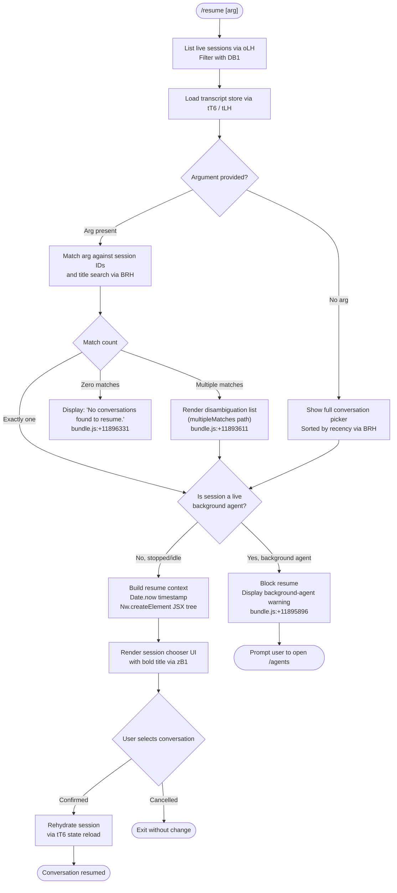

# `/resume`

> Analysis basis: CC v2.1.154 bundle.js (AST extraction + Claude interpretation)
> Minimum version: v2.1.154

---

## Overview

`/resume` (alias: `/continue`) allows the user to pick up a previously saved conversation by supplying an optional conversation ID or search term. The command queries the live-session registry and the on-disk transcript store, presents a filterable list of past conversations, and — after the user selects one — rehydrates the full session context so the existing thread continues seamlessly. If the target session is currently running as a background agent the command blocks the resume and directs the user to `/agents` instead.

---

## Registration

| Field | Value |
|---|---|
| type | `local-jsx` |
| name | `resume` |
| description | `Resume a previous conversation` |
| argumentHint | `[conversation id or search term]` |
| aliases | `["continue"]` |
| module_id | `wB1` |
| load_inline | `true` |
| loc_byte | `11897294` |
| loc_byte_end | `11897491` |
| loc_line | `8681` |
| arbor_handler.name | `F15` |
| arbor_handler.fqn | `claude-2.1.154::F15` |
| arbor_handler.kind | `AsyncFunction` |
| arbor_handler.resolution_path | `module_id` |
| arbor_handler.n_hits | `0` |

Analysis basis: CC v2.1.154 bundle.js:+11897294

---

## Input Branching

Six or more distinct behavioral paths exist depending on session state, search results, and whether the matched session is actively running. A Mermaid flowchart is used below.



---

## Behavioral Spec

### Handler Entry Point (`F15`)

`F15` is the `AsyncFunction` resolved by Arbor via `module_id → wB1`. It is the primary handler for `/resume`.

Analysis basis: CC v2.1.154 bundle.js:+11895886

```
async function resumeCommandHandler(args, appContext):

    # 1. Collect live sessions
    liveSessions = await listLiveSessions()          # oLH → A.listAllLiveSessions
    filtered     = filterSessionList(liveSessions)   # DB1 → H.filter

    # 2. Load persisted transcript index
    transcriptIndex = await loadTranscriptStore()    # tT6 → x6K → d_H

    # 3. Determine candidate sessions
    if args is empty:
        candidates = allSessions(transcriptIndex)
    else:
        candidates = matchSessions(transcriptIndex, args)   # BRH search

    # 4. Handle zero results
    if candidates is empty:
        display("No conversations found to resume.")        # bundle.js:+11896331
        return

    # 5. Check background-agent guard
    for each candidate in candidates:
        if isLiveBackgroundSession(candidate, liveSessions):
            display(BACKGROUND_AGENT_WARNING)               # bundle.js:+11895896
            return

    # 6. Render picker UI
    timestamp = Date.now()                                  # bundle.js:+11896208
    element   = createElement(SessionPickerComponent, ...)  # bundle.js:+11896182
    renderJSX(element)

    # 7. User selection → session rehydration
    selectedId = await awaitUserSelection()
    if selectedId is null:
        return   # cancelled

    reloadSession(selectedId, transcriptIndex)              # tT6 state reload
```

### Session List Retrieval (`oLH`)

Calls `A.listAllLiveSessions` (bundle.js:+8787691) and resolves via `Promise.resolve` to collect the current daemon-managed sessions. Sessions marked `"interactive"` (bundle.js:+8787782) are treated as live foreground sessions.

Analysis basis: CC v2.1.154 bundle.js:+8787639

```
async function listLiveSessionsForResume():
    resolved = await Promise.resolve()
    sessions = A.listAllLiveSessions()
    return sessions
```

### Background-Agent Guard

When a candidate session is found in the live-session registry with status `"background session"` (bundle.js:+15514318) or state `"resuming"` (bundle.js:+15485582), the handler emits a hard-stop message:

> "That session is still running as a background agent. Open `claude agents` to attach to it, or stop it there first to resume here."

Analysis basis: CC v2.1.154 bundle.js:+11895896

### Worktree Detection (`BRH`)

`BRH` enriches each session record with git-worktree metadata by running `git worktree list --porcelain` (literals `"worktree"`, `"list"`, `"--porcelain"` at bundle.js:+11892907 / +11892914). The NFC-normalized worktree path (bundle.js:+11893159) is compared against the current working directory to determine the active worktree. Results are locale-sorted (`$.localeCompare`, bundle.js:+11893333) so the most-relevant conversation appears first.

Analysis basis: CC v2.1.154 bundle.js:+11892852

```
function enrichWithWorktreeInfo(sessions):
    result = exec("git", ["worktree", "list", "--porcelain"])
    lines  = result.split("\n")
    for line in lines:
        if line.startsWith("worktree "):               # bundle.js:+11893115
            path = line.slice(9).normalize("NFC")      # bundle.js:+11893146,+11893159
    return sessions
        .find(match by startsWith)                     # bundle.js:+11893273
        .filter(activeWorktree)                        # bundle.js:+11893300
        .sort(localeCompare)                           # bundle.js:+11893333
```

Telemetry: `tengu_worktree_detection` (bundle.js:+11892996)

### Transcript Store Loader (`tT6` / `x6K` / `d_H`)

`tT6` is the top-level transcript-store accessor. It delegates to `x6K` which initialises the store via `d_H` (the main store-initialiser). `d_H` deserialises transcript segments keyed by message type (`"assistant"`, `"user"`, `"system"`, `"attachment"`, `"progress"`, `"summary"`, `"last-prompt"`, etc.) from on-disk JSONL files via `_7.readFile`, `uj5` (binary JSONL parser), and `mj5` (sync-read helper).

Analysis basis: CC v2.1.154 bundle.js:+11896637

```
function loadTranscriptStore(sessionId):
    raw    = fs.readFile(transcriptPath(sessionId))    # _7.readFile
    parsed = parseBinaryJSONL(raw)                     # uj5
    store  = buildStoreObject(parsed)                  # d_H, keyed maps
    return store
```

### Session Search / Matching (`BRH` search path)

When an argument is provided, `BRH` is invoked as a search function. It:

1. Splits the argument string (`A.split`, bundle.js:+11893077).
2. Attempts a direct UUID prefix match (`H.startsWith`, bundle.js:+11893273).
3. Falls back to a case-insensitive title search (`H.toLowerCase`, via `Sl`, bundle.js:+12898138).
4. If zero results: displays `"No conversations found to resume."` (bundle.js:+11896331).
5. If multiple results: triggers the `"multipleMatches"` disambiguation path (bundle.js:+11893611).
6. If session not found by any route: emits the `"sessionNotFound"` signal (bundle.js:+11893540).

Analysis basis: CC v2.1.154 bundle.js:+11893254

### Title Rendering (`zB1`)

The selected session title is rendered in bold using `j6.bold` (bundle.js:+11893575) within the JSX picker component.

Analysis basis: CC v2.1.154 bundle.js:+11896866

### Away-Summary Integration (`k` / `h`)

When a session is resumed after a period of inactivity, the away-summary subsystem (`k`, bundle.js:+14922444) evaluates whether a background catch-up summary should be generated. The subsystem skips generation when:

- Cache age is unknown: `"[awaySummary] skipped: cache age unknown"` (bundle.js:+14922446)
- Cache is stale (staleness threshold: 0.9, bundle.js:+14922515)
- Rate-limit proximity detected: `"[awaySummary] skipped: at or near rate limit"` (bundle.js:+14922610)
- A draft input is present: `"[awaySummary] skipped: draft input present"` (bundle.js:+14922693)

When generation proceeds, telemetry event `away_summary_generate` is emitted (bundle.js:+14922924). Failures are recorded as `generate_failed` (bundle.js:+14922948) with a retry cap of 3 (bundle.js:+14922999).

The "blurred" vs "focused" window state (bundle.js:+14923236, +14923386) determines the inactivity window: a 3 600 000 ms (1-hour) cap is applied (bundle.js:+14923297) with an 80% utilisation threshold (bundle.js:+14923353).

Analysis basis: CC v2.1.154 bundle.js:+14922444

---

## State & Side Effects

| Item | Detail |
|---|---|
| Telemetry | `tengu_worktree_detection` (bundle.js:+11892996) — git worktree detection on session list build |
| Telemetry | `tengu_bg_spare_enable`, `tengu_bg_spare_spawn`, `tengu_bg_spare_claim`, `tengu_bg_spare_claim_fail` — background daemon spare-pool events touched indirectly |
| Telemetry | `tengu_transcript_phantom_parent` (bundle.js:+12902836) — orphaned parent link in transcript |
| Telemetry | `tengu_transcript_parent_cycle` (bundle.js:+12906415) — cycle detected in transcript chain |
| Telemetry | `tengu_chain_parent_cycle` (bundle.js:+12884313), `tengu_chain_timestamp_fallback` (bundle.js:+12884462), `tengu_chain_parallel_tr_recovered` (bundle.js:+12886328) — chain ordering anomalies |
| Telemetry | `tengu_relink_walk_broken` (bundle.js:+12883823) — broken relink walk during store build |
| Telemetry | `away_summary_generate`, `away_summary` (bundle.js:+14922924, +14921555) — resumption summary generation |
| Telemetry | `tengu_daemon_control` (bundle.js:+15514441) — daemon lifecycle events |
| appState changes | Active session ID updated to the chosen conversation; full transcript map loaded into in-memory store via `d_H` |
| Hook registration | JSX component rendered into the CLI render tree via `Nw.createElement` (bundle.js:+11896182) |
| Side effects | Reads on-disk JSONL transcript files; may exec `git worktree list --porcelain` |
| Sound | None detected in depth-2 traversal |
| Slash-command telemetry literals | `"slash_command_session_id"` (bundle.js:+11896592), `"slash_command_title"` (bundle.js:+11896816) — emitted on successful selection |

---

## Version History

| Version | Change |
|---|---|
| v2.1.154 | Initial analysis |

---

## Common Mistakes

1. **Trying to resume a running background session** — `/resume` will refuse with the background-agent warning (bundle.js:+11895896). Use `/agents` to attach or stop the session first.
2. **Providing a partial search term that matches multiple sessions** — the command enters a disambiguation list (`multipleMatches`, bundle.js:+11893611). Provide a more specific term or the full UUID prefix to avoid this.
3. **Expecting the alias `/continue` to differ in behaviour** — it is a pure alias; the registration's `aliases` array (`["continue"]`) maps directly to the same handler `F15`.
4. **Assuming away-summary always runs on resume** — the away-summary subsystem applies multiple skip conditions (stale cache, rate-limit proximity, draft input present); a summary is not guaranteed.
5. **Running `/resume` outside a git repository** — worktree detection (`BRH`) calls `git worktree list`; in non-git directories this subprocess will fail silently, falling back to the unfiltered session list.

---

## Appendix — Identifier Mapping

> For bundle debugging only. Identifiers change across versions.

| Identifier | Role |
|---|---|
| `DB1` | Session list pre-filter (filter live sessions before display) |
| `F15` | Main handler `AsyncFunction` for `/resume` (Arbor-resolved entry point) |
| `oLH` | Live-session fetcher; calls `A.listAllLiveSessions` |
| `hH` | Error/warning logger utility |
| `F_` | Error constructor wrapper |
| `xH` | String coercion utility |
| `q1` | Telemetry-mode resolver |
| `zEA` | Telemetry string helper (calls `xH`) |
| `D84` | Telemetry queue manager (shift/push) |
| `ZH` | String-to-display formatter |
| `BRH` | Worktree-detection and session-search enricher |
| `W_` | Daemon/process spawner orchestrator |
| `ZGH` | Child-process manager factory |
| `WNA` | Process argument builder (win32 / .exe / cmd handling) |
| `li8` | Process stdio setup helper |
| `ni8` | Process stdio binder |
| `ri8` | Process pipe configurator |
| `kvA` | Numeric-finite validator |
| `zL6` | Async process runner with timeout |
| `ci8` | Reflect.apply / defineProperty wrapper |
| `ANA` | Event-emitter hook registrar (on "exit") |
| `NvA` | Timeout-race promise helper |
| `IvA` | Kill-signal sender |
| `VvA` | stdout/stderr data handler |
| `vvA` | SIGKILL escalation handler |
| `HNA` | Parallel-process awaiter |
| `jL6` | Process result collector |
| `tvA` | Pipe configurator (A.pipe) |
| `evA` | Abort-signal adder |
| `RvA` | Output stream binder |
| `D` | Session dispatch / daemon manager |
| `E6` | Daemon registration / feature-flag checker |
| `$` | Disposable resource wrapper |
| `eI8` | macOS memory monitor |
| `P5A` | Background PTY host spawner |
| `c` | Generic async continuation / callback |
| `Wz` | Warning logger |
| `N` | Platform/OS string classifier |
| `J8` | JSON serialiser/logger |
| `gA4` | String-padding utility (padEnd 10) |
| `$_` | Working-directory resolver |
| `ov` | CWD getter |
| `dN8` | Project-path builder |
| `Ly6` | File-list builder (joins paths, calls u6K) |
| `u6K` | Recursive directory walker / file collector |
| `Gc` | Projects-directory path joiner |
| `W` | OL-based string replacer |
| `K` | Column-width formatter (padEnd 40) |
| `aA` | Async file accumulator |
| `k2H` | Transcript-slice collector |
| `lAA` | Directory reader for transcript files |
| `sI6` | Index get/set/values utility |
| `Zz` | Path-segment slicer/normaliser |
| `T` | Input-event dispatcher (keyboard/remote-control) |
| `Y` | Supervisor session writer/updater |
| `E` | Session store map |
| `j` | Active-session registry (values/kill) |
| `X` | IPC socket reader (Buffer concat/subarray) |
| `P` | MCP connection handler |
| `J` | Stream wrapper |
| `G` | MCP tool-result collector |
| `PCH` | Transcript binary record writer (Buffer.alloc) |
| `lj5` | Transcript record assembler |
| `ro` | Regex-test utility (`cn7.test`) |
| `ma` | Message-array builder |
| `tLH` | Transcript-state reader (gets maps for all slot types) |
| `d_H` | Transcript store initialiser / main state-map builder |
| `Oj5` | Transcript slot constructor |
| `p` | Write-queue with clearTimeout |
| `VC` | Validity checker |
| `bzA` | JSONL entry array normaliser |
| `RzA` | JSONL regex tester |
| `CzA` | JSONL string replacer |
| `Wj` | Walk-index updater |
| `M` | MCP server manager (vSH + JGK) |
| `vSH` | MCP server connection configurator |
| `JGK` | MCP connection-result applier |
| `Gm5` | MCP server reconciler (Object.entries + filter) |
| `O` | k8-keyed output handler |
| `z` | Daemon state controller (yH/uH/vy/km) |
| `yH` | Daemon "stopped" state handler |
| `uH` | Daemon "background session" state handler |
| `vy` | Daemon "firstParty" push helper |
| `km` | Daemon shutdown race (Promise.race / process.exit 500 ms) |
| `w` | Daemon worker main loop |
| `R` | Daemon I/O writer (lEK / z.write) |
| `FD6` | Config-file reader (QP.readFile / JSON parse) |
| `B` | Retired-session filter (pH.filter / cH.has) |
| `W5A` | Background-session claim/connect helper |
| `N5A` | Background-session lifecycle manager (spawn/kill/cleanup) |
| `S` | Session-state snapshot |
| `V` | Versioned-state slot |
| `Q` | Persistent-file read/unlink queue (DN6 / rI1) |
| `DN6` | File-read with EPH parse |
| `rI1` | File-unlink with EPH parse |
| `k` | Away-summary controller |
| `VW8` | Away-summary cache-state getter |
| `aC5` | Away-summary m7A invoker |
| `zJK` | Away-summary job key |
| `Q58` | Away-summary API call orchestrator |
| `_` | Generic utility (identity / slot) |
| `oG1` | UUID generator (Zv.randomUUID) |
| `g` | B/$ composite object |
| `h` | Away-summary inactivity window manager |
| `_d` | Blurred/focused state setter |
| `uj5` | Binary JSONL parser (Buffer-level reader) |
| `o` | setTimeout-based ref holder |
| `b6K` | Buffer.at byte accessor |
| `wH` | Stream-chunk enqueuer |
| `m6` | JSON.parse wrapper |
| `C` | Seen-UUID set |
| `y` | z.write / clearable writer |
| `bj5` | Buffer comparator |
| `l` | HH.filter wrapper |
| `_H` | Ref/timeout holder (T.current) |
| `a` | G.current ref holder |
| `e` | Notification adder (H.addNotification) |
| `LH` | Multi-stream listener combiner |
| `HH` | Voice-session controller (recording/WebSocket) |
| `mj5` | Sync JSONL file reader (KS.openSync/readSync) |
| `x` | Timed writer with Math.round / b.unref |
| `b` | Unref-able timer handle |
| `w6K` | Walk-index map manager |
| `Tj5` | Walk-index entry builder |
| `H_` | Generic underscore identity |
| `xj5` | JSONL index writer (Buffer encode) |
| `hGH` | NDJSON stream parser (kq4/Iq4/hq4/yq4) |
| `kq4` | NDJSON BOM detector |
| `Iq4` | NDJSON line splitter |
| `hq4` | NDJSON JSON.parse per line |
| `yq4` | NDJSON toString/push |
| `A9` | J8-based action dispatcher |
| `d` | gh8-keyed permission holder |
| `gh8` | Permission gate |
| `r` | w/d composite (allow/deny) |
| `Ny8` | Date.parse timestamp extractor |
| `sLH` | Session-chain builder (sorts by timestamp) |
| `Vj5` | Number.isNaN / H.values validator |
| `vj5` | Session-slot map builder |
| `Zj5` | Sorted-session list builder |
| `S6K` | Session-slot value accumulator |
| `ltH` | H.map transcript mapper |
| `HqA` | replaceAll / slice title normaliser |
| `kk6` | Markdown-block token parser |
| `i1` | Regex-exec text parser (IS / H.trim) |
| `AqA` | Nj5/kj5 content-type checker |
| `Nj5` | Content array `.some` validator |
| `kj5` | Array.isArray / .some type-guard |
| `ky8` | H.get / q.get / q.set / A.push slot accessor |
| `Iy8` | Array.from / H.values collector |
| `tT6` | Transcript-store top-level accessor |
| `x6K` | Transcript-store factory (pj5 + d_H + Object.assign) |
| `pj5` | Project-path stat checker |
| `WS` | ov-based working-directory snapshot |
| `YZ` | Readdir recursive walker |
| `dAA` | H.at / HqA / ltH / AqA message decorator |
| `KfH` | Session-key formatter |
| `Sl` | Composite session searcher (BRH + u6K + PCH + filter) |
| `zB1` | Bold-title renderer (j6.bold) |