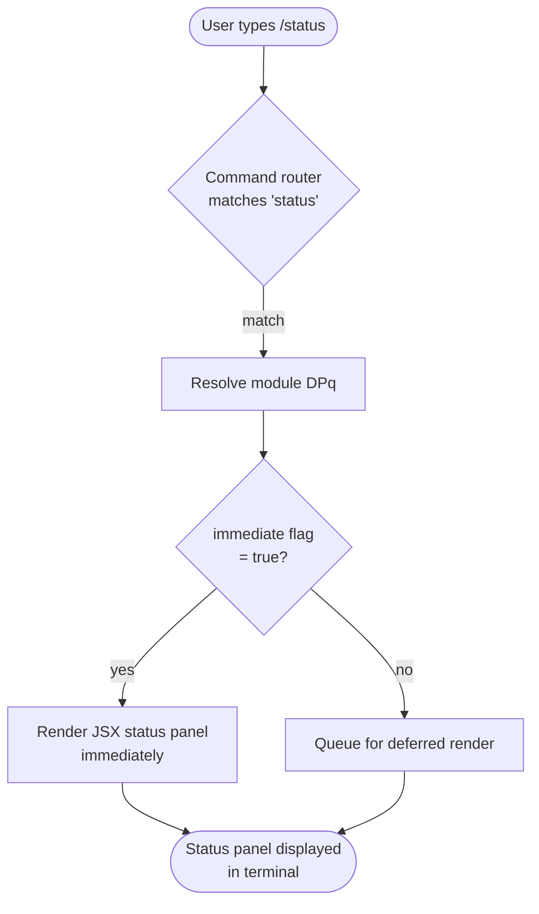

# `/status`

> Analysis basis: CC v2.1.144 bundle.js (AST extraction + Claude interpretation)
> Minimum version: v2.1.144

---

## Overview

The `/status` command is a local, immediately-rendered JSX slash command that displays a diagnostic snapshot of the current Claude Code session. It surfaces version information, the active model, account details, API connectivity state, and the status of available tools — all without requiring a round-trip to any backend service at invocation time.

---

## Registration

| Field | Value |
|---|---|
| type | `local-jsx` |
| name | `status` |
| description | `Show Claude Code status including version, model, account, API connectivity, and tool statuses` |
| immediate | `true` |
| module\_id | `DPq` |

Analysis basis: CC v2.1.144 bundle.js:+11305588

---

## Input Branching

Because the AST traversal produced an empty call graph and no literals for module `DPq`, a full multi-path flowchart cannot be verified from the extracted data. The single confirmed branching fact is that the command is registered as `immediate: true`, meaning the runtime renders the JSX output without waiting for user confirmation or additional input.



> **Note:** Paths F and beyond the `immediate = false` branch are theoretical guards present in the shared command infrastructure; for this command the `immediate` flag is always `true` at registration time.
> Analysis basis: CC v2.1.144 bundle.js:+11305588

<!-- TODO: not found in depth-2 traversal; needs --depth 4 -->
Internal rendering sub-paths (which status categories are fetched, how API connectivity is probed, how tool statuses are collected) are not available in the depth-2 call graph extracted for module `DPq`.

---

## Behavioral Spec

### Immediate JSX Rendering

The `immediate` flag set to `true` at registration instructs the command dispatcher to invoke the module's render function synchronously upon command recognition, bypassing any interactive prompt phase.

```
function dispatchStatusCommand(commandInput):
    registration = lookupCommand("status")
    if registration.immediate == true:
        panel = renderStatusJSX(registration.module)
        displayInline(panel)
    else:
        enqueueForRender(registration.module)
```

Analysis basis: CC v2.1.144 bundle.js:+11305588

### Status Panel Composition

Based on the registration description, the rendered panel is expected to aggregate the following information categories. Because the call graph for module `DPq` is empty in the extracted data, the exact collection order and error-handling logic within each category are not verifiable at this traversal depth.

```
function renderStatusJSX(module):
    sections = []
    sections.append(collectVersionInfo())       // Claude Code version
    sections.append(collectModelInfo())         // active model identifier
    sections.append(collectAccountInfo())       // authenticated account
    sections.append(probeAPIConnectivity())     // reachability / auth state
    sections.append(collectToolStatuses())      // per-tool enabled/disabled state
    return layoutAsJSX(sections)
```

<!-- TODO: not found in depth-2 traversal; needs --depth 4 -->
Concrete implementations of `collectVersionInfo`, `collectModelInfo`, `collectAccountInfo`, `probeAPIConnectivity`, and `collectToolStatuses` were not reachable within the depth-2 traversal of module `DPq`.

---

## State & Side Effects

| Item | Detail |
|---|---|
| Telemetry | None detected in depth-2 traversal (`telemetry: []`) |
| Hook registration | <!-- TODO: not found in depth-2 traversal; needs --depth 4 --> |
| appState changes | <!-- TODO: not found in depth-2 traversal; needs --depth 4 --> |
| Sound | <!-- TODO: not found in depth-2 traversal; needs --depth 4 --> |

Analysis basis: CC v2.1.144 bundle.js:+11305588

---

## Version History

| Version | Change |
|---|---|
| v2.1.144 | Initial analysis — registration confirmed; call graph not resolved at depth 2 |

---

## Common Mistakes

1. **Expecting network-fresh data on every invocation:** The `immediate: true` flag causes the panel to render from locally cached or already-resolved state. If the API key or model selection changed moments before invoking `/status`, the display may reflect the state at session initialization rather than the absolute current backend state.

2. **Confusing `/status` with a health-check command:** `/status` is a read-only diagnostic display; it does not attempt to repair connectivity, re-authenticate, or toggle tool states. Observing a degraded status entry requires separate remediation actions.

3. **Assuming call-graph-derived sub-commands exist:** The module `DPq` produced no resolvable call graph at depth 2. Avoid inferring hidden sub-flags or arguments (e.g., `/status --tools`) from the description string alone without further verification.

4. **Treating the absence of telemetry as confirmed zero telemetry:** No `tengu_*` events were found within the depth-2 traversal boundary. Deeper traversal (depth ≥ 4) may reveal telemetry emitted by helper functions outside the current analysis window.

---

## Appendix — Identifier Mapping

> For bundle debugging only. Identifiers change across versions.

| Identifier | Role |
|---|---|

*No obfuscated identifiers were present in the depth-2 extraction for module `DPq` (`identifiers: []`). This table will be populated if a deeper traversal yields mangled names.*