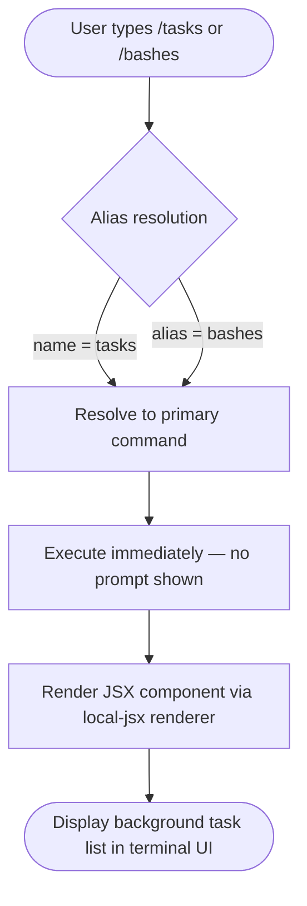

# `/tasks`

> Analysis basis: CC v2.1.144 bundle.js (AST extraction + Claude interpretation)
> Minimum version: v2.1.144

---

## Overview

The `/tasks` command (also accessible via the alias `/bashes`) lists and manages background tasks running within the Claude Code session. It is registered as a `local-jsx` command, meaning its output is rendered as a JSX component directly in the terminal UI rather than as plain text. The command executes immediately upon invocation (`immediate: true`) without requiring additional user input.

---

## Registration

| Field | Value |
|---|---|
| type | `local-jsx` |
| name | `tasks` |
| description | `List and manage background tasks` |
| aliases | `["bashes"]` |
| immediate | `true` |
| module\_id | `aPq` |

Analysis basis: CC v2.1.144 bundle.js:+11368252

---

## Input Branching

Because the command is registered with `immediate: true` and the depth-2 AST traversal returned an empty call graph, no argument-driven branching has been confirmed at this analysis depth.



> **Note:** The `immediate` flag suppresses the argument-input prompt; the command fires as soon as the name or alias is matched.

---

## Behavioral Spec

### Command Dispatch and Alias Resolution

```
function resolveTasksCommand(userInput):
    normalized = normalize(userInput)          // strip leading "/" and whitespace
    if normalized == "tasks" OR normalized == "bashes":
        return commandRegistry.get("tasks")
    else:
        return null
```

Analysis basis: CC v2.1.144 bundle.js:+11368252

### Immediate Execution

```
function executeTasksCommand(command, context):
    if command.immediate == true:
        // Skip argument collection phase entirely
        renderOutput = invokeLocalJsxHandler(command.module_id, context)
        return renderOutput
    else:
        promptForArguments(command, context)
```

Analysis basis: CC v2.1.144 bundle.js:+11368252

### JSX Rendering

```
function invokeLocalJsxHandler(module_id, context):
    // module_id = "aPq"
    jsxComponent = loadModule(module_id)
    backgroundTasks = context.appState.getBackgroundTasks()
    return jsxComponent.render(backgroundTasks)
```

> The rendering path is confirmed as `local-jsx` type, meaning the output is a React/Ink JSX tree painted into the terminal UI, not a plain-text string.

Analysis basis: CC v2.1.144 bundle.js:+11368252

### Background Task Display

<!-- TODO: not found in depth-2 traversal; needs --depth 4 -->

The internal structure of the JSX component (task fields displayed, sort order, interactive controls) could not be confirmed from the depth-2 call graph because no entry functions were resolved for module `aPq`. A deeper traversal is required to document the rendered columns and any task management actions (e.g., cancel, inspect).

---

## State & Side Effects

| Item | Detail |
|---|---|
| Telemetry | None detected at depth-2 traversal (`telemetry: []`) |
| Hook registration | <!-- TODO: not found in depth-2 traversal; needs --depth 4 --> |
| appState changes | <!-- TODO: not found in depth-2 traversal; needs --depth 4 --> |
| Sound | <!-- TODO: not found in depth-2 traversal; needs --depth 4 --> |

---

## Version History

| Version | Change |
|---|---|
| v2.1.144 | Initial analysis — registration confirmed; call graph not resolved (empty module entry point) |

---

## Common Mistakes

1. **Using `/bashes` and expecting different behavior** — `/bashes` is a registered alias for `/tasks` and produces identical output. The two names are interchangeable.
2. **Passing arguments** — Because `immediate: true`, the command fires before any argument can be entered. Any text typed after `/tasks` may be ignored or cause unexpected behavior depending on the CLI argument parser.
3. **Expecting plain-text output** — The command type is `local-jsx`, so its output is rendered as a terminal UI component, not a copyable text block. Piping or redirecting `/tasks` output programmatically is not supported via this command path.
4. **Assuming real-time updates** — Without confirmed call-graph evidence of a subscription or polling loop inside module `aPq`, do not assume the task list auto-refreshes; re-invoke the command to get a current snapshot.

---

## Appendix — Identifier Mapping

> For bundle debugging only. Identifiers change across versions.

| Identifier | Role |
|---|---|
| `aPq` | Module ID for the `/tasks` local-jsx command component (not an obfuscated function name, but an obfuscated module key used by the bundle's module registry) |

> No obfuscated function-level identifiers were returned by the depth-2 traversal (`identifiers: []`). If a deeper traversal surfaces mangled names from module `aPq`, they should be added to this table.