# `/team-onboarding`

> Analysis basis: CC v2.1.154 bundle.js (AST extraction + Claude interpretation)
> Minimum version: v2.1.154

---

## Overview

`/team-onboarding` is a `prompt`-type slash command that analyzes the invoking user's local Claude Code session transcripts from the past year, classifies their work into standard task categories, and co-authors a shareable `ONBOARDING.md` guide that new teammates can paste into Claude Code for an interactive walkthrough. The command operates as a two-turn collaborative flow: it generates a concrete draft guide immediately, then asks three targeted review questions before finalizing the file.

---

## Registration

| Field | Value |
|---|---|
| type | `prompt` |
| name | `team-onboarding` |
| description | Help teammates ramp on Claude Code with a guide from your usage |
| isHidden | `false` |
| loc_byte | `12694363` |
| loc_byte_end | `12695412` |
| handler_method | `getPromptForCommand` |
| handler_method_start | `12694701` |
| handler_method_end | `12695411` |
| prompt_body.length | `4539` characters |
| prompt_body.trace | `identifier→$ (local→1 ext vars)` |
| arbor_handler.name | `getPromptForCommand` |
| arbor_handler.kind | `Method` |
| arbor_handler.fqn | `claude-2.1.154::getPromptForCommand` |
| arbor_handler.resolution_path | `direct` |
| arbor_handler.n_hits | `2` |

Analysis basis: CC v2.1.154 bundle.js:+12694363

---

## Input Branching

The handler has more than three distinct paths (transcript scan outcome, MCP config presence, session count edge cases, and guide-template substitution), so a Mermaid flowchart is used.

```mermaid
flowchart TD
    A(["/team-onboarding invoked"]) --> B[Emit tengu_team_onboarding_invoked telemetry]
    B --> C[Compute WINDOW_DAYS\nMath.min / Math.max / Math.floor\non Date.now delta ÷ 365-day constant]
    C --> D[Call usage-data collector\n_D5 / je1]
    D --> E{Transcript files found\n.jsonl scan via I_6.readdir}
    E -- "~0 sessions" --> F[Set session breakdown\nto TODO placeholder]
    E -- "Sessions present" --> G[Parse JSONL lines\nextract sessionDescriptors,\nprNumbers, tool/MCP counts]
    G --> H[Classify sessions into\ntask-type taxonomy\ntop 3-5 with percentages]
    F --> I[Read MCP config\nHD5: .mcp.json via\nXe1.readFile + iI8.join]
    H --> I
    I --> J{.mcp.json present\n& mcpServers key found?}
    J -- "Yes" --> K[Enumerate MCP servers\ninfer purpose from name\nand urlOrigin]
    J -- "No" --> L[Omit MCP section]
    K --> M[Resolve currentRepo\nand sibling repos\nNGH: git config user.name\nW_: git remote get-url origin]
    L --> M
    M --> N[Interpolate prompt template\n_.replaceAll on\nWINDOW_DAYS / USAGE_DATA /\nGUIDE_TEMPLATE placeholders]
    N --> O[Emit tengu_team_onboarding_generated\ntelemetry]
    O --> P[Dispatch prompt to agent\nvia HH6 → RZ → Uq]
    P --> Q[Agent: emit acknowledgment line\nimmediately as first visible text]
    Q --> R[Agent: write draft ONBOARDING.md\nwith ASCII bar charts\nand real usage numbers]
    R --> S[Agent: render guide in code block\nthen add Review heading\nwith 3 numbered questions]
    S --> T{User provides\nreview answers?}
    T -- "Yes" --> U[Agent: patch ONBOARDING.md\nwith team name / tips /\nstarter task, then emit\nclosing confirmation line]
    T -- "No further input" --> V([Session ends])
    U --> V
```



---

## Behavioral Spec

### Handler Entry: `getPromptForCommand`

The Arbor-resolved handler is `getPromptForCommand` (FQN `claude-2.1.154::getPromptForCommand`, resolved via `direct` path, n_hits=2). The synthetic BFS entry `__handler_team-onboarding` is bookkeeping only; all behavioral claims reference `getPromptForCommand`.

Analysis basis: CC v2.1.154 bundle.js:+12694707

### Sub-feature 1 — Window Calculation

```
function computeWindowDays(nowMs):
    # Uses Math.min, Math.max, Math.floor (bundle.js:+12694904–12694922)
    rawDays = Math.floor((nowMs - epochAnchorMs) / MS_PER_DAY)
    clampedDays = Math.min(Math.max(rawDays, 1), 365)
    return clampedDays
```

The constant `365` appears at `bundle.js:+12694950`. The result is bound to `WINDOW_DAYS` and later substituted into the prompt template via `_.replaceAll` (bundle.js:+12695148) on the literal `"{{WINDOW_DAYS}}"` (bundle.js:+12695161).

Analysis basis: CC v2.1.154 bundle.js:+12694904

### Sub-feature 2 — Usage-Data Collection (`usageDataCollector` / `_D5`)

```
async function usageDataCollector(projectDir):
    transcriptDir = buildTranscriptPath(projectDir)   # $_ / $0 / MN
    files = await I_6.readdir(transcriptDir)
    jsonlFiles = files.filter(f => nI8.extname(f) === ".jsonl")  # literal ".jsonl" bundle.js:+12683314

    cutoffMs = Date.now() - (WINDOW_DAYS * 24 * 60 * 1000)
    # constants: 24 @ +12683199, 60 @ +12683202, 1000 @ +12683208

    results = await Promise.all(jsonlFiles.map(async file =>
        stat = await I_6.stat(nI8.join(transcriptDir, file))
        if not stat.isFile(): return null
        raw = await I_6.readFile(path, "utf-8")
        lines = raw.split("\n")                        # literal "\n" implied
        return parseSessionDescriptors(lines)
    ))
    return aggregateResults(results)
```

Lines are scanned for MCP tool invocations via the pattern `"\"name\":\"mcp__"` (bundle.js:+12683893) and for content arrays via `"\"content\":["` (bundle.js:+12684243).

Analysis basis: CC v2.1.154 bundle.js:+12685726 (entry `_D5`), +12683227 (`je1`)

### Sub-feature 3 — Session Descriptor Parsing (`transcriptParser` / `je1`)

```
function parseSessionDescriptors(lines):
    sessions = []
    for line in lines:
        # oY5.exec  — extracts session title      (+12684034)
        # aY5.exec  — extracts PR numbers         (+12684090)
        # sY5.exec  — extracts first user message (+12684265)
        title    = oY5.exec(line)?.[group]
        prNums   = aY5.exec(line)?.[group]
        firstMsg = sY5.exec(line)?.[group]

        if line.startsWith(MCP_NAME_PREFIX):          # +12684350, prefix literal +12683893
            mcpCount++
        sessions.push({ title, prNums, firstMsg, mcpCount, toolCount })

    # Trim to at most 10 most-recent sessions
    return sessions.slice(-10)                        # constant 10 @ +12683710
```

The integer `3` at bundle.js:+12684346 marks the capture-group index used when extracting structured fields from matched lines.

Analysis basis: CC v2.1.154 bundle.js:+12683186

### Sub-feature 4 — MCP Config Reader (`mcpConfigReader` / `HD5`)

```
async function mcpConfigReader(workspaceRoot):
    configPath = iI8.join(workspaceRoot, ".mcp.json")   # literal ".mcp.json" +12685425
    try:
        raw = await Xe1.readFile(configPath, "utf8")    # encoding "utf8" +12685438
        parsed = JSON.parse(raw)                        # m6 → JSON.parse
        servers = parsed["mcpServers"] ?? {}            # literal "mcpServers" +12685481
        return servers
    except (ENOENT / parse error):
        return {}
```

Analysis basis: CC v2.1.154 bundle.js:+12685401

### Sub-feature 5 — Git Context Resolver (`gitContextResolver` / `W_` + `NGH`)

```
function resolveGitContext(cwd):
    userName = runGit(["config", "user.name"], cwd)     # literals +12686055,+12686064
    remoteUrl = runGit(["remote", "get-url", "origin"], cwd)
                                                        # literals +12686120,+12686129,+12686139
    repoName  = extractRepoName(remoteUrl)              # NGH: trim, match, slice
    siblingDirs = discoverSiblingRepos(cwd)             # UBq: readdirStringSync, statSync
    return { userName, remoteUrl, repoName, siblingDirs }
```

`NGH` normalises the remote URL: it trims whitespace, matches against a `git/` prefix pattern (literal `"git/"` at bundle.js:+1065622), strips the prefix via slice, and lower-cases the result.

Analysis basis: CC v2.1.154 bundle.js:+12686045 (`W_`), +1065359 (`NGH`)

### Sub-feature 6 — Prompt Assembly and Dispatch

```
function assemblePrompt(windowDays, usageData, guideTemplate):
    body = PROMPT_TEMPLATE                              # 4539-char constant bound via $
    body = body.replaceAll("{{WINDOW_DAYS}}", String(windowDays))
                                                        # literal +12695161, String() +12695179
    body = body.replaceAll("{{USAGE_DATA}}",  JSON.stringify(usageData))
                                                        # literal +12695236
    body = body.replaceAll("{{GUIDE_TEMPLATE}}", guideTemplate)
                                                        # literal +12695201
    return body

function dispatchPrompt(assembledBody):
    emit(tengu_team_onboarding_generated)               # +12695280
    HH6(q1, RZ, E6, assembledBody)                     # +12695257; output type "text" +12695395
```

The literal `"text"` at bundle.js:+12695395 identifies the content-block type returned to the agent runner.

Analysis basis: CC v2.1.154 bundle.js:+12695148

### Sub-feature 7 — Agent-Side Guide Generation (Prompt Instruction Summary)

The 4539-character prompt instructs the agent to perform the following steps in strict order. **Note:** the behavioral obligations below are derived from the prompt body content, not quoted verbatim.

```
procedure agentGenerateOnboardingGuide(context):

    # Step 1 — mandatory first output (no tool calls, no thinking before this)
    print acknowledgment line referencing WINDOW_DAYS and Claude Code

    # Step 2 — classify sessions
    for session in context.sessionDescriptors:
        taskType = classifyInto([
            "build_feature", "debug_fix", "improve_quality",
            "analyze_data", "plan_design", "prototype", "write_docs"
        ])
    select top3to5 = topN(taskTypes, 3..5) with rough percentages
    # display as title-case with spaces in rendered guide

    # Step 3 — gather remaining pieces
    repos    = [currentRepo] + discoverSiblingRepos()
    mcpInfo  = inferMcpAccess(context.mcpServers)
    # Team Tips and Get Started sections remain as TODO placeholders

    # Step 4 — write ONBOARDING.md from template
    guide = fillTemplate(
        taskBreakdown    = top3to5,
        repos            = repos,
        mcpInfo          = mcpInfo,
        generatedBy      = context.userName ?? omit,
        asciiBarCharts   = renderBars(top3to5, width=20, filled="█", empty="░")
    )
    writeFile("ONBOARDING.md", guide)

    # Step 5 — render guide in code block, then Review section
    renderCodeBlock(guide)
    print "---"
    print "**Review**"
    print numberedQuestions([teamNameQuestion, starterTaskQuestion, teamTipsQuestion])

    # After user answers Review questions:
    patch("ONBOARDING.md", teamName, tips, starterTask)
    print closingConfirmationLine   # exact wording fixed in prompt
```

Classification rule for review sessions: code review → `improve_quality`; doc review → `write_docs`; design review → `plan_design`. If `sessionDescriptors` is empty, the breakdown is left as a TODO.

Analysis basis: CC v2.1.154 bundle.js:+12694701 (prompt body via `getPromptForCommand`)

---

## State & Side Effects

| Item | Detail |
|---|---|
| Telemetry — invocation | `tengu_team_onboarding_invoked` emitted at +12694961 immediately after window computation |
| Telemetry — generation | `tengu_team_onboarding_generated` emitted at +12695280 after prompt assembly |
| Telemetry — harbor prompt | `tengu_flint_harbor_prompt` emitted at +12694738 (shared prompt-dispatch path via `E6`) |
| Telemetry — harbor share | `tengu_flint_harbor_share` emitted at +9532172 (via `HH6 → RZ`) |
| Telemetry — config errors | `tengu_config_parse_error` (+3210789), `tengu_config_lock_contention` (+3208214), `tengu_config_stale_write` (+3208350), `tengu_config_auth_loss_prevented` (+3208693) from config-read path |
| Telemetry — feature flags | `tengu_feature_ok` (+965176), `tengu_feature_bad` (+965234) from flag-check path |
| Telemetry — background daemon | `tengu_bg_dispatch_sigkill_escalate`, `tengu_bg_dispatch_low_mem`, `tengu_bg_spare_enable`, `tengu_bg_spare_claim`, `tengu_bg_spare_claim_fail`, `tengu_bg_spare_spawn`, `tengu_bg_low_mem_mb`, `tengu_daemon_control`, `tengu_bg_dispatch_sigkill_escalate` — indirect, from daemon dispatch path reached via `E6` → `w` |
| File writes | `ONBOARDING.md` written (and patched after review) in working directory |
| File reads | `JSONL` transcript files under project transcript directory; `.mcp.json` in workspace root |
| Config reads | Global and project config via `bzH` / `hz_` (lock-guarded, backup-rotated, max 5 backups at +3209144) |
| appState changes | None observed at depth-2 traversal |
| Sound | None observed at depth-2 traversal |
| Hook registration | `_9 → f$A.register` at +58450 (file-watcher hook, indirect via `Y17`) |
| File-watcher | `Y17`: `B88.watchFile` / `B88.unwatchFile` on config path |
| Backup rotation | Config backup files prefixed `".backup."` (+3209011); up to 5 retained (+3209144) |
| Random bytes | `KU → BBq.randomBytes` (32 bytes, hex-encoded) used in experiment-variant path; `Di8.randomBytes` in atomic-write path |
| UUID generation | `$z_ → Lz_.randomUUID` for Growthbook experiment events |

---

## Version History

| Version | Change |
|---|---|
| v2.1.154 | Initial analysis |

---

## Common Mistakes

1. **Running the command outside a project directory** — the usage-data collector (`je1`) looks for JSONL transcripts relative to the project path. Invoking `/team-onboarding` from an unrelated directory yields an empty session list and a guide with a TODO breakdown section.

2. **Expecting the agent to ask questions before drafting** — the prompt explicitly forbids this. The agent must output the acknowledgment line and a complete draft before asking any review questions. If the agent appears to stall, the prompt body has not been delivered correctly.

3. **Assuming all seven task categories will always appear** — the agent selects only the top 3–5 categories by frequency; less-common types are omitted from the rendered guide.

4. **Editing `ONBOARDING.md` before answering the Review questions** — the file is re-written by the agent after the review turn. Manual edits made between draft and review will be overwritten unless the user explicitly includes them in the review answers.

5. **Misreading the `{{WINDOW_DAYS}}` scope** — the window is clamped to a maximum of 365 days (bundle.js:+12694950) regardless of how long the user has had Claude Code installed. Transcripts older than the clamped window are not included in the usage data.

6. **MCP server entries without a `urlOrigin`** — when `.mcp.json` entries lack a `urlOrigin` field, the agent infers access instructions from the `name` field alone; results may be less precise.

---

## Appendix — Identifier Mapping

> For bundle debugging only. Identifiers change across versions.

| Identifier | Role |
|---|---|
| `__handler_team-onboarding` | Synthetic BFS entry point for the command handler (bookkeeping only; real handler is `getPromptForCommand`) |
| `E6` | Prompt-dispatch / feature-gate coordinator |
| `hz6` | Prompt-dispatch sub-helper A |
| `Sz6` | Prompt-dispatch sub-helper B |
| `Mx` | Template string builder |
| `xH` | String coercion utility |
| `fx` | Feature-flag reader |
| `wR` | Flag-store accessor |
| `y88` | Deduplication / seen-set gate |
| `$z_` | Growthbook experiment event emitter |
| `yEH` | Variant selector |
| `KU` | Experiment-ID generator (random bytes) |
| `RH` | JSON serialiser wrapper |
| `m97` | Experiment metadata formatter |
| `wz_` | Seen-set writer |
| `mIq` | Background-task metadata helper |
| `i_` | Promise resolver utility |
| `vBq` | Variant-payload builder |
| `Z3H` | Known-set membership checker |
| `b6` | Config file accessor (top-level) |
| `B6` | Config-path resolver |
| `vz_` | Config-key normaliser |
| `bzH` | Config file reader / backup rotator |
| `q` | Synchronous filesystem façade |
| `m6` | JSON.parse wrapper |
| `kb` | Key-prefix stripper |
| `_` | Generic filesystem / string utility |
| `J8` | Structured error constructor |
| `UBq` | Directory scanner for sibling repos |
| `N` | Log / notify dispatcher |
| `c` | Console / output sink |
| `Sz_` | Backup-path constructor |
| `w` | Background-session daemon dispatcher |
| `Y17` | Config file-watcher registrar |
| `Mr` | Watcher callback |
| `_9` | Hook registration shim |
| `O8` | Usage-data orchestrator (top-level collector) |
| `hz_` | Config lock-and-read-write routine |
| `L` | Async resource tracker |
| `f` | Resource handle / stream |
| `o$q` | Session-metadata assembler |
| `k1_` | Session-record builder |
| `uz6` | Config-state classifier (unknown / local / migrated / native / installed / disabled / enabled / no_permissions / global / not_configured) |
| `A` | Case-normaliser / map |
| `V` | Path-membership checker |
| `P` | MCP-connection manager |
| `Vb8` | MCP transport factory |
| `hH` | MCP server connection handler |
| `F_` | Error coercion utility |
| `E` | Slice-window helper |
| `$L6` | Atomic file-write utility |
| `O` | Stat / symlink checker |
| `P8` | Error-code normaliser |
| `H` | Random-delay / jitter utility (also used as generic handle) |
| `jQH` | Config read-lock contention reporter |
| `pBq` | Config entries enumerator |
| `JQH` | Timestamp recorder |
| `yz_` | Global-config write path |
| `_D5` | Usage-data collector orchestrator |
| `$_` | Home-directory resolver |
| `ov` | OS home utility |
| `$0` | Project-path builder |
| `MN` | Projects-directory path constructor |
| `Zz` | Project-ID hasher |
| `o84` | Absolute-value helper for hash |
| `je1` | JSONL transcript parser / session-descriptor extractor |
| `A9` | Error-category classifier |
| `K` | Array map+pad utility |
| `$` | Transcript-line tokeniser |
| `bo1` | Line-parse sub-routine |
| `z` | Daemon-session handle |
| `yH` | Daemon stop handler |
| `uH` | Daemon stop-failed handler |
| `vy` | Active-session tracker |
| `km` | Daemon lifecycle race |
| `D` | Background-session manager |
| `eI8` | Platform (macOS) detector |
| `P5A` | Bun-based spare-session spawner |
| `Wz` | Warning emitter |
| `HD5` | MCP config reader (`.mcp.json`) |
| `eY5` | Guide-template constant holder |
| `W_` | Git subprocess runner |
| `ZGH` | Child-process spawner (full) |
| `WNA` | Windows executable resolver |
| `li8` | Stdio-stream creator A |
| `ni8` | Stdio-stream creator B |
| `ri8` | Stream merger |
| `kvA` | Timeout validator |
| `zL6` | Process-exit waiter |
| `ci8` | Reflect-apply subprocess shim |
| `ANA` | Exit-event listener |
| `NvA` | Promise-race timeout wrapper |
| `IvA` | Kill-and-wait helper |
| `VvA` | stdout line handler |
| `vvA` | SIGTERM kill helper |
| `HNA` | Drain-and-close helper |
| `jL6` | Stderr collector |
| `tvA` | Pipe setup helper |
| `evA` | Stream-add helper |
| `RvA` | stdout-bind helper |
| `gA4` | String coercion for spawn args |
| `NGH` | Git remote-URL / repo-name normaliser |
| `Xq4` | Host extractor from URL |
| `K9` | Substring slicer (indexOf + slice) |
| `HH6` | Prompt output packager |
| `q1` | Network-profile selector |
| `zEA` | Essential-traffic classifier |
| `RZ` | Prompt delivery dispatcher |