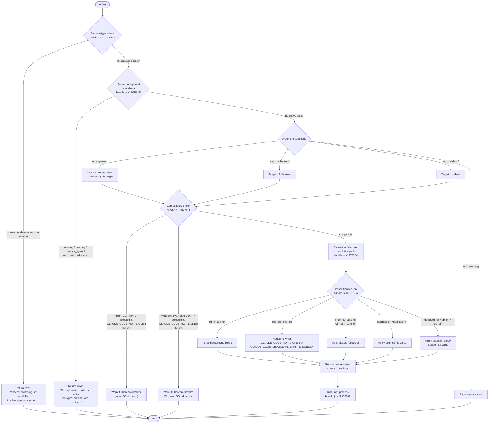

# `/tui`

> Analysis basis: CC v2.1.154 bundle.js (AST extraction + Claude interpretation)
> Minimum version: v2.1.154

---

## Overview

The `/tui` command switches the terminal UI renderer between `default` and `fullscreen` modes at runtime. It validates environment compatibility before applying the change, refusing to switch when background tasks are active or when the session is a background/daemon session. On success it relaunches the Claude Code process under the new renderer.

---

## Registration

| Field | Value |
|---|---|
| type | `local-jsx` |
| name | `tui` |
| description | `Set the terminal UI renderer (default \| fullscreen)` |
| argumentHint | `[default\|fullscreen]` |
| module_id | `VQ1` |
| load_inline | `true` |
| loc_byte | `12099880` |
| loc_byte_end | `12100062` |
| loc_line | `8993` |
| arbor_handler.name | `z75` |
| arbor_handler.fqn | `claude-2.1.154::z75` |
| arbor_handler.kind | `AsyncFunction` |
| arbor_handler.resolution_path | `module_id` |
| arbor_handler.n_hits | `0` |

Analysis basis: CC v2.1.154 bundle.js:+12099880

---

## Input Branching

The command has more than three distinct decision paths (background-session guard, active-task guard, argument validation, compatibility detection, and renderer application), so a flowchart is used.



---

## Behavioral Spec

### 1. Entry point — handler `z75`

The Arbor-resolved handler is `z75` (AsyncFunction, resolution path: `module_id → VQ1`).

```
async function tuiCommandHandler(args, context):
    rawArg = args.trim()                          // bundle.js:+12097810

    settings = await loadSettingsFromDisk()       // bundle.js:+12097835
    renderConfig = await getRendererConfig()      // bundle.js:+12097846

    sessionMode = context.getAppState("session")  // bundle.js:+12098102
    if sessionMode in ["daemon", "daemon-worker"]:
        return errorJSX(
            "Renderer switching isn't available in a background " +
            "session — press ← to detach and run /tui from a " +
            "foreground session."
        )                                         // bundle.js:+12098132

    activeTasks = getActiveTaskList()             // bundle.js:+12098098
    for task in activeTasks:
        if task.status in ["running","pending","remote_agent","mcp_task"]:
            emit telemetry("tengu_tui_refused")   // bundle.js:+12098585
            return errorJSX(
                "Cannot switch renderers while background tasks are " +
                "running — wait for them to finish (or stop them via " +
                "/tasks), then run /tui again."
            )                                     // bundle.js:+12098626

    targetMode = resolveTargetMode(rawArg)        // branch on "fullscreen"/"default"/empty

    compatResult = checkFullscreenCompatibility() // bundle.js:+12098797
    if compatResult.blocked:
        return warnJSX(compatResult.message)

    fullscreenDecision = resolveFullscreenDecision(compatResult)
    persistRendererSetting(targetMode, fullscreenDecision)

    emit telemetry("tengu_tui_command")           // bundle.js:+12099057

    uptime = Math.round(process.uptime())         // bundle.js:+12099147
    await relaunchProcess()                       // bundle.js:+12099495

    return statusJSX(targetMode)
```

Analysis basis: CC v2.1.154 bundle.js:+12097810

---

### 2. Renderer configuration loader (`fq`)

This function loads and normalises the renderer configuration before the argument is evaluated.

```
async function loadRendererConfig():
    agentType = getLocalAgentType()               // checks "local-agent" / "bg" strings
                                                  // bundle.js:+3377592

    colorSupportLevel = detectColorSupport()      // evaluates "yes"/"on"/"no"/"off"
                                                  // bundle.js:+3377682

    terminalInfo = detectTerminalEnvironment()    // bundle.js:+3377700

    if terminal is tmux in control mode (-CC):
        // Checks for iTerm.app, screen, tmux strings
        // Spawns: tmux display-message -p "#{client_control_mode}"
        // timeout: 2000 ms
        // bundle.js:+3377065, 3377139
        if not env("CLAUDE_CODE_NO_FLICKER"):
            return {
                fullscreenAllowed: false,
                reason: "tmux_cc_auto_off",
                message: "fullscreen disabled: tmux -CC (iTerm2 " +
                         "integration mode) detected …"
            }                                     // bundle.js:+3377811

    if platform is "windows" and session is over SSH:
        if not env("CLAUDE_CODE_NO_FLICKER"):
            return {
                fullscreenAllowed: false,
                reason: "win_ssh_auto_off",
                message: "fullscreen disabled: Windows over SSH " +
                         "(ConPTY re-rendering) detected …"
            }                                     // bundle.js:+3377997

    mode = arg in ["fullscreen","default"] ? arg : currentSetting
                                                  // bundle.js:+3378145, 3378171

    return buildRendererObject(mode, terminalInfo)
```

Analysis basis: CC v2.1.154 bundle.js:+3377592

---

### 3. Fullscreen resolution decision (`gzH`)

Determines *why* a renderer mode is active/inactive, for telemetry and display.

```
function resolveFullscreenDecision(config):
    if config.bgForcedOn:
        return { reason: "bg_forced_on" }         // bundle.js:+3378564

    if env("CLAUDE_CODE_DISABLE_ALTERNATE_SCREEN") == "off" or
       env("CLAUDE_CODE_NO_FLICKER"):
        return { reason: "env_off" }              // bundle.js:+3378594

    if env("CLAUDE_CODE_NO_FLICKER") == "on" or
       env("CLAUDE_CODE_FORCE_FULLSCREEN_UPSELL"):
        return { reason: "env_on" }               // bundle.js:+3378652

    if config.tmuxCCDetected:
        return { reason: "tmux_cc_auto_off" }     // bundle.js:+3378676

    if config.windowsSSHDetected:
        return { reason: "win_ssh_auto_off" }     // bundle.js:+3378710

    if settings.hasExplicitFullscreen == true:
        return { reason: "settings_on" }          // bundle.js:+3378769

    if settings.hasExplicitFullscreen == false:
        return { reason: "settings_off" }         // bundle.js:+3378803

    if featureFlag.downsell:
        return { reason: "downsell_on" }          // bundle.js:+3378876

    if gradualRollout.enabled:
        return { reason: "gb_on" }                // bundle.js:+3378941
    else:
        return { reason: "gb_off" }               // bundle.js:+3378949
```

Analysis basis: CC v2.1.154 bundle.js:+3378564

---

### 4. Terminal environment detection (`gN`)

Queries the host environment to determine rendering capabilities.

```
function detectTerminalEnvironment():
    termProgram = env("TERM_PROGRAM")             // checked in jHH.includes
                                                  // bundle.js:+3449786
    isJetBrains = XY6.isJetBrainsIdeTerminal()   // bundle.js:+3449815

    // IDE-embedded terminal detection
    if termProgram includes "cursor" or "vscode": // bundle.js:+3450492, 3450541
        return { kind: "ide_embedded" }

    // xterm.js version detection for JetBrains
    if isJetBrains:
        xtermVersion = parseFloat(env("XTERM_VERSION"))
        if not NaN and within [1092000, 1105000]: // bundle.js:+3450617, 3450628
            return { kind: "jetbrains_xterm", version: xtermVersion }

    // Platform-specific path
    platform = process.platform                   // "darwin" / "win32"
                                                  // bundle.js:+3450025, 3450072
    if platform == "win32":
        return detectWindowsTerminal()

    columns = Math.min(detectedColumns, 20)       // cap: 20 bundle.js:+3450999
    return { kind: "standard", columns }
```

Analysis basis: CC v2.1.154 bundle.js:+3449746

---

### 5. Active-task guard (`Gk8`)

Gathers the list of tasks that would block a renderer switch.

```
function getActiveTaskList():
    all = Array.from(taskRegistry)                // bundle.js:+12094895
    blocking = []

    for task in all:
        if task.status in ["running","pending"]:
            blocking.push(task)                   // bundle.js:+12095092
        if task.kind in ["remote_agent","mcp_task"]:
            blocking.push(task)                   // bundle.js:+12095228

    flags = task.flatMap(buildFlagArgs)           // bundle.js:+12095343
    return blocking
```

Analysis basis: CC v2.1.154 bundle.js:+12094895

---

### 6. Process relaunch (`EQ1` → `A2H`)

After a successful renderer change the process relaunches itself, preserving the session.

```
async function relaunchProcess():
    await flushPendingWrites()                    // 30 000 ms flush timeout
                                                  // bundle.js:+12093613
    await drainOutputQueue()                      // cleanup timeout
                                                  // bundle.js:+12093675
    await flushAnalytics()                        // analytics flush timeout
                                                  // bundle.js:+12093731

    process.removeAllListeners()                  // bundle.js:+12094115
    process.on("SIGINT", noop)
    process.on("SIGTERM", noop)
    process.on("SIGHUP", noop)                    // bundle.js:+12094086-12094105

    newArgv = buildArgvForRelaunch(
        currentArgv,
        { "--resume": true },                     // bundle.js:+12093546
        passedFlags
    )

    // On macOS: execve via bun:ffi → /usr/lib/libSystem.B.dylib
    // On Linux: execve via bun:ffi → libc.so.6
    //                                bundle.js:+12092694, 12092723
    execve(process.execPath, newArgv, process.env)

    // Fallback if execve fails:
    writeRelaunchErrorFile()                      // bundle.js:+12094397
    process.exit(128)                             // bundle.js:+12094534
```

Analysis basis: CC v2.1.154 bundle.js:+12093592

---

## State & Side Effects

| Item | Detail |
|---|---|
| Telemetry: `tengu_tui_command` | Fired on every successful `/tui` invocation (bundle.js:+12099057) |
| Telemetry: `tengu_tui_refused` | Fired when the switch is blocked by active background tasks (bundle.js:+12098585) |
| Telemetry: `tengu_amber_creek` | Fired inside renderer resolution logic `E6` (bundle.js:+3378328) |
| Telemetry: `tengu_pewter_brook` | Fired inside renderer resolution logic `E6` (bundle.js:+3378236) |
| Telemetry: `tengu_feature_ok` | Feature-flag evaluation success (bundle.js:+965176) |
| Telemetry: `tengu_feature_sad` | Feature-flag evaluation soft failure (bundle.js:+965311) |
| Telemetry: `tengu_feature_bad` | Feature-flag evaluation hard failure (bundle.js:+965234) |
| Telemetry: `tengu_scroll_summary` | Fired during scroll/render teardown before relaunch (bundle.js:+5328997) |
| Telemetry: `tengu_bg_dispatch_sigkill_escalate` | Background dispatcher SIGKILL escalation (bundle.js:+15478604) |
| Telemetry: `tengu_bg_dispatch_low_mem` | Background dispatcher low-memory event (bundle.js:+15479183) |
| Telemetry: `tengu_bg_spare_enable` | Background spare-slot enabled (bundle.js:+15479878) |
| Telemetry: `tengu_bg_spare_claim` | Background spare-slot claimed (bundle.js:+15479999) |
| Telemetry: `tengu_bg_spare_claim_fail` | Background spare-slot claim failed (bundle.js:+15480262) |
| Telemetry: `tengu_daemon_control` | Daemon lifecycle control event (bundle.js:+15514441) |
| Settings write | Renderer preference persisted to `~/.claude/settings.json` or `settings.local.json` (bundle.js:+1218089, 1218151) |
| Process relaunch | Current process is replaced via `execve` (macOS: `libSystem.B.dylib`; Linux: `libc.so.6`) with `--resume` flag (bundle.js:+12092694, 12092723, 12093546) |
| Signal handlers | All existing process listeners are removed and SIGINT/SIGTERM/SIGHUP are suppressed before relaunch (bundle.js:+12094086) |
| appState read | `session` key checked to detect `daemon`/`daemon-worker` sessions (bundle.js:+12098102) |
| Environment variables consulted | `CLAUDE_CODE_NO_FLICKER`, `CLAUDE_CODE_DISABLE_ALTERNATE_SCREEN`, `CLAUDE_CODE_FORCE_FULLSCREEN_UPSELL` (bundle.js:+12095599, 12095624, 12095663) |
| tmux probe | `tmux display-message -p "#{client_control_mode}"` spawned synchronously with a 2 000 ms timeout (bundle.js:+3377065, 3377139) |

---

## Version History

| Version | Change |
|---|---|
| v2.1.154 | Initial analysis |

---

## Common Mistakes

1. **Running `/tui` inside a background or daemon session** — the command returns an error immediately; detach to a foreground session first (bundle.js:+12098132).
2. **Running `/tui` while background tasks are active** — tasks with status `running`, `pending`, `remote_agent`, or `mcp_task` block the switch; use `/tasks` to stop them first (bundle.js:+12098626).
3. **Expecting fullscreen in tmux -CC (iTerm2 integration) mode** — fullscreen is automatically disabled in this configuration unless `CLAUDE_CODE_NO_FLICKER=1` is set in the environment (bundle.js:+3377811).
4. **Expecting fullscreen over Windows SSH (ConPTY)** — same automatic disable applies; override with `CLAUDE_CODE_NO_FLICKER=1` (bundle.js:+3377997).
5. **Assuming the command is instantaneous** — `/tui` triggers a full process relaunch (`execve`) with analytics flush and output drain, which takes up to 30 seconds in the worst case (bundle.js:+12093613).
6. **Passing an unrecognised argument** — only `default` and `fullscreen` are valid tokens (bundle.js:+3378145, 3378171); any other value falls back to the current setting rather than erroring loudly.

---

## Appendix — Identifier Mapping

> For bundle debugging only. Identifiers change across versions.

| Identifier | Role |
|---|---|
| `z75` | Main `/tui` command handler (AsyncFunction) |
| `fq` | Renderer configuration loader |
| `gzH` | Fullscreen resolution decision builder |
| `gN` | Terminal environment detector |
| `Gk8` | Active-task list collector |
| `EQ1` | Relaunch orchestrator entry point |
| `A2H` | Process relaunch implementation |
| `Z_` | AppState reader (allowed/disallowed tools) |
| `v3` | AppState reader (session mode) |
| `V9` | Daemon/daemon-worker mode resolver |
| `vp` | Settings-from-disk load pipeline |
| `gE` | Settings load start marker |
| `T9` | Performance mark emitter |
| `Kp` | `perf_hooks` require wrapper |
| `Bo8` | Settings load event logger |
| `I8` | Log append-file helper |
| `iR6` | Settings load intermediate step |
| `oL6` | Flag/policy settings merger |
| `zyA` | Settings object key aggregator |
| `K$H` | User/project/local settings file path builder |
| `ng` | Settings normaliser |
| `MyA` | SDK inline-settings injector |
| `ig` | Settings registry initialiser |
| `$_` | Observable/signal primitive |
| `x96` | Settings field: unknown |
| `Dm8` | Settings field: unknown |
| `S96` | Settings field: unknown |
| `QWH` | Settings field: unknown |
| `dWH` | Settings field: unknown |
| `u96` | Settings field: unknown |
| `H$H` | Settings field: unknown |
| `_$H` | Settings field: unknown |
| `Ro8` | Settings field: unknown |
| `lIA` | Settings field: unknown |
| `Di` | Settings field: unknown |
| `aL6` | WSL-specific settings reader |
| `nR6` | Settings post-load hook |
| `Z3H` | Renderer config cache-hit checker |
| `oY_` | Color-support boolean resolver |
| `v1` | "no"/"off" string normaliser |
| `xH` | "yes"/"on" string normaliser |
| `Tr` | Terminal type detector (iTerm / screen / tmux) |
| `r47` | tmux control-mode probe |
| `i47` | iTerm.app string matcher |
| `N` | Telemetry / log writer |
| `URK` | Telemetry event dispatcher |
| `$$A` | Telemetry payload formatter |
| `H` | Random/timer utility |
| `RH` | JSON serialiser wrapper |
| `v4` | Log-line path builder |
| `FzA` | CRK map helper |
| `HuH` | Output write helper |
| `yzA` | Raw write wrapper |
| `gRK` | Log file rotation manager |
| `kxH` | Buffered output writer |
| `cMH` | Log directory path helper |
| `B6` | Base error/logging utility |
| `B16` | Journal entry helper |
| `rzA` | Log file path joiner |
| `izA` | Log file stat/rename helper |
| `FRK` | Log file append + rotate writer |
| `_9` | Signal/hook registration helper |
| `rY_` | Boolean-coercion renderer helper |
| `o47` | Renderer component builder |
| `E6` | Renderer state machine / feature evaluator |
| `hz6` | Renderer sub-component A |
| `Sz6` | Renderer sub-component B |
| `Mx` | Renderer string converter |
| `y88` | Renderer dedup/cache layer |
| `b6` | Renderer timestamp recorder |
| `U_` | Settings persistence writer |
| `wO` | Settings write path composer |
| `Uo8` | Settings aggregated-write helper |
| `zP` | Settings file reader |
| `Mi` | File read with encoding detection |
| `m3` | File lstat / realpath helper |
| `DB6` | Base file error handler |
| `wB6` | File encoding fallback |
| `P8` | ENOENT/EISDIR error classifier |
| `J8` | Error code normaliser |
| `mr8` | LRU cache timestamp updater |
| `mGH` | Settings-write path resolver |
| `nF6` | Settings directory path resolver |
| `$L6` | Atomic file write helper |
| `O` | Symbolic-link checker |
| `k8` | File type utility |
| `Xz` | Cache clear helper |
| `tB6` | gitignore / git-check-ignore wrapper |
| `C6` | Async-store context getter |
| `YB6` | zoneStorage getter |
| `Tr8` | Text transform helper |
| `sB6` | git check-ignore executor |
| `W_` | git command runner |
| `Pq4` | Home-dir path expander |
| `oNA` | ls-files git checker |
| `aNA` | Unknown git helper |
| `hb` | `.claude/settings.json` path builder |
| `yH` | Feature-ok telemetry emitter |
| `t6` | Feature-sad telemetry emitter |
| `uH` | Feature-bad telemetry emitter |
| `hH` | Output-queue flusher |
| `F_` | Error stringifier |
| `q1` | Ink render helper |
| `zEA` | xH-based string coercer |
| `D84` | Output buffer rotator |
| `gN` | Terminal capability detector |
| `IY6` | Terminal info struct builder |
| `xD` | Terminal width/height reader |
| `dD_` | IDE terminal sub-detector |
| `if7` | IDE version parser |
| `PX` | Platform terminal sub-detector |
| `rf7` | Column-count capper |
| `cD_` | Column detection helper |
| `fx` | React/Ink renderer factory |
| `wR` | Ink instance manager |
| `Qq7` | Ink string render helper |
| `PO` | Ink provider wrapper |
| `C$` | Ink render scheduler |
| `_L6` | zEA-based string helper |
| `v9` | Telemetry consent / product-feedback checker |
| `H89` | Consent config reader |
| `iD6` | Consent resolution logic |
| `CR` | Consent state machine |
| `nD6` | Consent file reader |
| `I4H` | Consent feature-flag tester |
| `VKH` | xH-based consent string helper |
| `EQ1` | Relaunch orchestrator |
| `A2H` | Core relaunch implementation |
| `bh` | Claude binary path resolver |
| `AW8` | Version directory builder |
| `W_H` | `.local/bin` path builder |
| `g3` | Array-check utility |
| `ak` | Argument array builder |
| `k6` | JSX helper (`ov`-based) |
| `ov` | React createElement wrapper |
| `UX6` | Interval clearer |
| `hV_` | clearInterval wrapper |
| `rNH` | Ink unmount + cursor-restore helper |
| `GR` | Terminal cleanup helper |
| `Yq8` | Alternate-screen exit (ESC-7/ESC-8) writer |
| `u58` | Scroll-summary + relaunch trigger |
| `fZ` | Scroll state reader |
| `TJ9` | Scroll position helper |
| `GJ9` | Scroll timing calculator |
| `nL` | Promise.race timeout helper |
| `RT` | Relaunch hook runner |
| `U4` | Hook pipeline executor |
| `IxH` | Output-queue drain caller |
| `m58` | Analytics flush orchestrator |
| `Q8` | Timeout-guarded promise helper |
| `gHA` | Post-relaunch argument patcher |
| `cK` | JSX helper (`ov`-based, variant) |
| `JQ1` | execve wrapper (bun:ffi) |
| `$` | Task/process registry |
| `w` | Background worker dispatcher |
| `M` | Daemon session manager |
| `z` | Session type utility |
| `ZH` | String coercion wrapper |
| `ij` | Relaunch error file writer |
| `fi` | Unknown settings helper |
| `K` | Column-padding map helper |