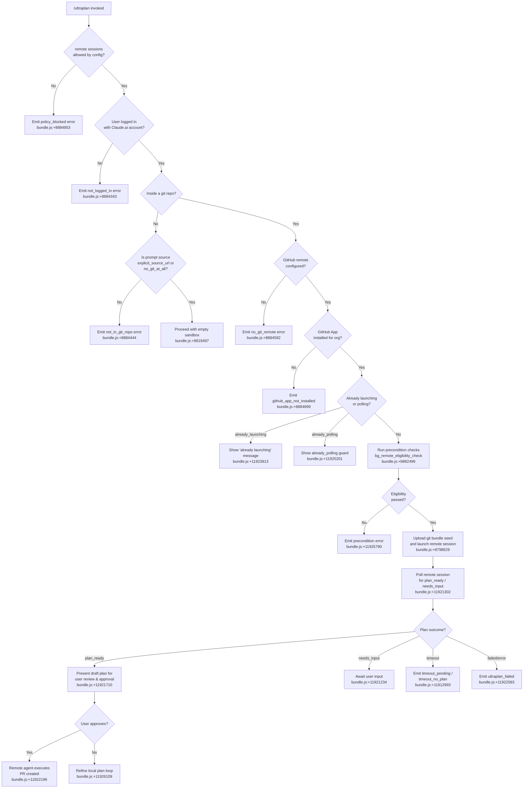

# `/ultraplan`

> Analysis basis: CC v2.1.154 bundle.js (AST extraction + Claude interpretation)
> Minimum version: v2.1.154

---

## Overview

`/ultraplan` launches a remote "background" planning session on Claude.ai web infrastructure: it packages the local git repository into a bundle, teleports it to a cloud environment, runs a remote agent to draft a structured plan, then streams that plan back to the local CLI for user review and approval. The command enforces several prerequisites (login, git repository, GitHub remote, GitHub App installation, organisation policy) before initiating the remote workflow.

---

## Registration

| Field | Value |
|---|---|
| type | `local-jsx` |
| name | `ultraplan` |
| description | `… · Claude Code on the web drafts a plan you can edit and approve. See …` |
| argumentHint | `<prompt>` |
| load_inline | `true` |
| load_ident | `zK5` |
| loc_byte | `11929542` |
| loc_byte_end | `11929786` |
| loc_line | `8772` |
| arbor_handler.name | `zK5` |
| arbor_handler.fqn | `claude-2.1.154::zK5` |
| arbor_handler.kind | `AsyncFunction` |
| arbor_handler.resolution_path | `load_ident` |
| arbor_handler.n_hits | `1` |

Analysis basis: CC v2.1.154 bundle.js:+11929542

The handler is inlined via `load: () => Promise.resolve({ call: zK5 })`. Arbor resolved it through the `load_ident` path with exactly one symbol hit.

---

## Input Branching

The command has more than three distinct initial branches based on precondition checks and invocation-source detection.



---

## Behavioral Spec

### 1. Top-level handler (`zK5`)

```
async function ultraplanHandler(context):
    // Check whether remote sessions are permitted
    settings = getAppState(context)                     // bundle.js:+11928021
    if settings["allow_remote_sessions"] is false:
        exit with policy_blocked
    
    // Check authentication
    authResult = checkAuthentication(context)           // v9, bundle.js:+11927704
    if not authResult.loggedIn:
        exit with not_logged_in
    
    // Detect invocation source (slash / system / etc.)
    source = detectSource(context)                      // bundle.js:+11927832
    
    // Run main session launcher
    result = launchUltraplanSession(context, source)    // Sk6, bundle.js:+11927814
    
    // Sync app state after completion
    setAppState(context, result)                        // bundle.js:+11928239
```

Analysis basis: CC v2.1.154 bundle.js:+11927686

---

### 2. Authentication and eligibility check (`v9`)

```
function checkAuthAndEligibility(context):
    // Verify user has a Claude.ai (non-API-key) session
    hasToken = tokenStore.has(context)                  // BX7.has, bundle.js:+4105078
    
    accountType = resolveAccountType(context)           // CR, bundle.js:+4105091
    // Account types checked: "firstParty", "enterprise", "team"
    //   bundle.js:+4104560, +4104833, +4104868
    
    // Check allow_product_feedback setting              bundle.js:+4105109
    
    // Read config file (utf-8)                         nD6, bundle.js:+4105398
    
    // Validate inclusion list                          I4H, bundle.js:+4105416
    
    return eligibilityRecord
```

Analysis basis: CC v2.1.154 bundle.js:+4105062

---

### 3. Guard against concurrent launches (`Sk6`)

```
function sessionLaunchGuard(context, source):
    // Re-check auth eligibility
    eligibility = checkAuthAndEligibility(context)     // v9, bundle.js:+11924949
    
    // Guard: already polling?
    if state == "already_polling":                     // bundle.js:+11925201
        return early
    
    // Guard: already launching?
    if state == "already_launching":                   // bundle.js:+11925219
        display "ultraplan: already launching. Please wait…"
        // bundle.js:+11923813
        return early
    
    // Validate prompt is present; show usage hint if not
    // Usage: /ultraplan <prompt>, or include "ultraplan" anywhere in your prompt
    // bundle.js:+11925265, +11925331
    
    // Register task notification listener             cB1, bundle.js:+11925241
    // "task-notification" channel                     bundle.js:+11925966
    
    // Start polling loop                              rN8, bundle.js:+11925354
    
    // Launch remote session orchestrator              OK5, bundle.js:+11925468
    
    // On error: emit tengu_ultraplan_create_failed    bundle.js:+11924986
    
    // Cleanup state                                   fK5, bundle.js:+11925575
```

Analysis basis: CC v2.1.154 bundle.js:+11924949

---

### 4. Remote session orchestrator (`OK5`)

```
async function remoteSessionOrchestrator(context):
    // Build context string for remote agent
    contextString = buildContextString(context)        // fXH→W11, bundle.js:+8884218
    // Eligibility check: "bg_remote_eligibility_check"  bundle.js:+8882499
    // Requires github.com remote                       bundle.js:+8883090
    // Handles byoc (Bring Your Own Cloud) flag         bundle.js:+8882802
    
    // Obtain session-link token                        iN8, bundle.js:+11926021
    
    // Assemble plan prefix
    planPrefix = assemblePlanPrefix(context)           // KK5, bundle.js:+11926029
    // Prepends "Here is a draft plan to refine:"      bundle.js:+11920931
    
    // Create remote session via teleport layer         Ml, bundle.js:+11926054
    // See §5 for Ml detail
    
    // Initialise observer/notifier                    Ow, bundle.js:+11926523
    // URL selection: localhost:4000 / staging / prod  bundle.js:+4769813–4769897
    
    // Register abort signal                           L, bundle.js:+11926577
    
    // Set permission mode: "set_permission_mode"      MK5, bundle.js:+11926646
    
    // Open browser window for plan editing            MhH, bundle.js:+11926754
    // Label: "Ultraplan"                              bundle.js:+11926812
    // Remote agent type: "remote_agent"               bundle.js:+8889256
    
    // Start plan-ready polling loop                   LK5, bundle.js:+11926919
    
    // Register atexit handler                         _9, bundle.js:+11926939
    
    // Emit tengu_ultraplan_launched                   bundle.js:+11926656
    
    on success:
        collect results, invoke hH (log), ZH (stringify), N (normalise)
    on error "unexpected_error":
        display "Ultraplan hit an unexpected error during launch…"
        // bundle.js:+11927223
        emit tengu event for unexpected_error            bundle.js:+11927065
    on orphan session:
        attempt to archive → log if failure             bundle.js:+11927371
```

Analysis basis: CC v2.1.154 bundle.js:+11925468

---

### 5. Teleport / remote session creation layer (`Ml`)

```
async function teleportToRemote(context):
    // Policy check: remote sessions disabled by org   bundle.js:+8812816
    // Token check: no access token                    bundle.js:+8812924
    
    // Determine bundle mode (tengu_teleport_bundle_mode)  bundle.js:+8813983
    // Possible values: "too_large", "bundle",
    //   "explicit_env_bundle", "git_repository"       bundle.js:+8813909–8814135
    
    // Git bundle seed upload                          yU_, bundle.js:+8813723
    //   Operations include: git stash create, git rev-parse HEAD,
    //   bundle file ccr-seed*.bundle, _source_seed.bundle
    //   Emit tengu_ccr_bundle_upload                  bundle.js:+8798629
    //   Possible upload outcomes: "head", "fallback_head",
    //     "squashed", "fallback_squashed", "failed"   bundle.js:+8800285–8800402
    
    // Get org UUID                                    bundle.js:+8813234
    
    // Set anthropic-beta header: "ccr-byoc-2025-07-29"  bundle.js:+8813573
    // Set x-organization-uuid header                  bundle.js:+8813595
    
    // POST session creation request via Axios         c_.post, bundle.js:+8814815
    // Expected success: HTTP 201                      bundle.js:+8814907
    // Error codes handled: 401, 403, 429             bundle.js:+8814975–8814983
    // Error: github_repo_access_denied               bundle.js:+8815025
    // Error: malformed session response (no session id)  bundle.js:+8815332
    // Error: HTTP 500                                 bundle.js:+8814871
    
    // List available teleport environments            ua, bundle.js:+8815475
    // API endpoint: teleport_environments_list        bundle.js:+8766290
    // Auth requirement error string:
    //   "Claude Code web sessions require authentication with
    //    a Claude.ai account…"                        bundle.js:+8766374
    // Request timeout: 15000 ms                       bundle.js:+8766805
    
    // Auto-create default cloud environment if none   QtH, bundle.js:+8815510
    // Name: "Default"                                 bundle.js:+8767065
    // API: teleport_default_environment_create        bundle.js:+8767090
    // Default env spec: python 3.11, node 20          bundle.js:+8767553–8767599
    // Emit log: "[teleportToRemote] Auto-created default cloud env"
    //   bundle.js:+8815529
    // Fallback warning URL:
    //   https://claude.ai/code/onboarding?magic=env-setup
    //   bundle.js:+8815687
    
    // Source decision telemetry: tengu_teleport_source_decision
    //   Values: "explicit_source_url", "no_git_at_all",
    //     "no_changes", "empty", "git_error"          bundle.js:+8817404–8818814
    
    // GitHub preflight check                          oyH, bundle.js:+8817717
    // Outcomes: "github_preflight_ok",
    //   "github_preflight_failed", "ghes_optimistic"  bundle.js:+8817743–8817803
    
    // Source repository config check                  bundle.js:+8820493
    
    return sessionRecord
```

Analysis basis: CC v2.1.154 bundle.js:+8812755

---

### 6. Plan-ready polling loop (`LK5`)

```
async function planReadyPollingLoop(sessionId, context):
    startTime = Date.now()                             // bundle.js:+11921068
    timeout = 5400 seconds                             // bundle.js:+11920624
    pollInterval = variable (Math.random + setTimeout) // bundle.js:+13408200,+13408237
    
    loop:
        status = pollSessionStatus(sessionId)          // mB1, bundle.js:+11921154
        
        emit tengu_ultraplan_timeout_seconds           // bundle.js:+11920590
        
        switch status:
            case "plan_ready":
                emit tengu_ultraplan_plan_ready        // bundle.js:+11921302
                emit tengu_ultraplan_awaiting_input    // bundle.js:+11921234
                present plan to user for edit/approval
                
            case "approved":
                emit tengu_ultraplan_approved          // bundle.js:+11921710
                display "Results will land as a pull request…"
                // bundle.js:+11922196
                break loop
                
            case "needs_input":
                emit tengu_ultraplan_awaiting_input
                pause and wait for user action
                
            case "requires_action":
                handle action request                  // bundle.js:+11912588
                
            case "terminated" | "failed":
                emit tengu_ultraplan_failed            // bundle.js:+11922583
                display "Remote Ultraplan session failed…"
                // bundle.js:+11922990
                break loop
                
            case "timeout_pending":
                handle timeout                         // bundle.js:+11912993
                break loop
                
            case "timeout_no_plan":
                handle no-plan timeout                 // bundle.js:+11913011
                break loop
                
            case network error (network_or_unknown):
                log "Lost connection to remote session…"
                // bundle.js:+11911948
                retry with back-off
                if retries exhausted: break loop
    
    // Cleanup: MZ6 (unlink temp bundle files)        bundle.js:+11921873
    // Temp file patterns: rAA, _7.unlink             bundle.js:+12863554
```

Analysis basis: CC v2.1.154 bundle.js:+11921058

---

### 7. Session title generation (`iGL`)

```
function generateSessionTitle(prompt):
    // Truncate prompt to 75 chars                    bundle.js:+8801624
    // Path pattern: "claude/task"                    bundle.js:+8801630
    // Template: "{description}"                      bundle.js:+8801666
    // Schema type: json_schema with "title" and "branch" fields
    //   bundle.js:+8801854, +8801862
    // API call: teleport_generate_title              bundle.js:+8801928
    // Replace non-alphanumeric chars via regex:
    //   replacement pattern "$1$2"                   bundle.js:+9676703
    //   max slug component length: 5                 bundle.js:+9676726
    //   regex flags: "gi"                            bundle.js:+9676025
    // Emit tengu_ultraplan_prompt_identifier         bundle.js:+11920757
    return titleSlug
```

Analysis basis: CC v2.1.154 bundle.js:+8801619

---

### 8. Prompt identifier extraction (`FQ_` / `PG8` / `XG8`)

```
function extractPromptIdentifier(rawPrompt):
    // Check prompt starts with expected prefix       H.startsWith, bundle.js:+9675627
    // If starts at index 0                           bundle.js:+9675672
    // Match all occurrences (matchAll "gi")          bundle.js:+9676025
    // Look for string literal "ultraplan"             bundle.js:+9676377
    // Verify with q.some check                       bundle.js:+9676125
    // Collect matches into M (push)                  bundle.js:+9676305
    // Slice identifier portion                       H.slice, bundle.js:+9676606
    // Normalise: replace pattern "$1$2"              A.replace, bundle.js:+9676677
    //   pad to width 40 chars                        bundle.js:+15504339
    return identifier
```

Analysis basis: CC v2.1.154 bundle.js:+9675627

---

### 9. GitHub App installation check (`oyH`)

```
async function checkGithubAppInstalled(context):
    // Guard: no access token → assume not installed
    // Log: "checkGithubAppInstalled: No access token found, …"
    //   bundle.js:+8768384
    
    // Guard: no org UUID → assume not installed
    // Log: "checkGithubAppInstalled: No org UUID found, …"
    //   bundle.js:+8768497
    
    // GET request via Axios                          c_.get, bundle.js:+8768754
    // Interpret response:
    //   "is" or "is not" installed                  bundle.js:+8768895, +8768900
    // Handle HTTP 400                               bundle.js:+8769155
    // Handle Axios errors: c_.isAxiosError          bundle.js:+8769101
    // Stringify response: ZH                        bundle.js:+8769303
    
    return installationStatus
```

Analysis basis: CC v2.1.154 bundle.js:+8768351

---

### 10. Plan post-approval submission (`lu`)

```
async function submitApprovedPlan(planContent, context):
    // Build auth headers via bU_                    bundle.js:+8821954
    // Validate endpoint via Sq                      bundle.js:+8821982
    // POST plan                                     c_.post, bundle.js:+8822048
    // Handle HTTP 409 (conflict)                    bundle.js:+8822144
    // Request timeout: 10000 ms                     bundle.js:+8821943
    // Normalise response N                          bundle.js:+8822148
    // Stringify result RH                           bundle.js:+8822248
    // Convert with ZH                               bundle.js:+8822312
    return submissionResult
```

Analysis basis: CC v2.1.154 bundle.js:+8821954

---

## State & Side Effects

| Item | Detail |
|---|---|
| Telemetry — ultraplan lifecycle | `tengu_ultraplan_create_failed`, `tengu_ultraplan_launched`, `tengu_ultraplan_prompt_identifier`, `tengu_ultraplan_timeout_seconds`, `tengu_ultraplan_awaiting_input`, `tengu_ultraplan_plan_ready`, `tengu_ultraplan_approved`, `tengu_ultraplan_failed` |
| Telemetry — teleport/CCR | `tengu_ccr_bundle_seed_enabled`, `tengu_ccr_bundle_upload`, `tengu_teleport_bundle_mode`, `tengu_ccr_session_link`, `tengu_teleport_source_decision` |
| Telemetry — background daemon | `tengu_bg_dispatch_sigkill_escalate`, `tengu_bg_low_mem_mb`, `tengu_bg_dispatch_low_mem`, `tengu_bg_spare_enable`, `tengu_bg_sendclaim_failed`, `tengu_bg_spare_claim`, `tengu_bg_spare_spawn`, `tengu_bg_spare_claim_fail` |
| Telemetry — config/feature | `tengu_config_parse_error`, `tengu_feature_bad`, `tengu_feature_ok` |
| appState reads | `allow_remote_sessions` (bundle.js:+11927707), `allow_product_feedback` (bundle.js:+4105109) |
| appState writes | `_.setAppState` called at end of handler (bundle.js:+11928239) |
| Hook registration | `_9` registers an atexit handler via `f$A.register` (bundle.js:+58450) to clean up orphaned sessions |
| Task notification | Subscribes to `"task-notification"` channel (bundle.js:+11925966) via `cB1` |
| File system | Creates/uploads git bundle seed files `ccr-seed*.bundle` and `_source_seed.bundle`; temp files cleaned up by `MZ6` (`_7.unlink`); config backed up under `backups/` directory |
| Browser | Opens a browser window (via `utH` → `Bs.open`) for the plan editing UI (bundle.js:+12947970) |
| Network | HTTP POST to Anthropic API with `anthropic-beta: ccr-byoc-2025-07-29` header; API version `2023-06-01`; Axios used for all HTTP calls |
| Concurrency guard | Sets `already_launching` / `already_polling` state flags to prevent concurrent invocations (bundle.js:+11925201, +11925219) |
| Timeout | Session polling hard-limit: **5400 seconds** (bundle.js:+11920624); environment-list request timeout: **15000 ms** (bundle.js:+8766805); plan submission timeout: **10000 ms** (bundle.js:+8821943) |
| Remote session poll interval | Randomised: base multiplier 2, offset 1 via `Math.random` + `setTimeout` (bundle.js:+13408198, +13408214, +13408237) |
| Remote session max running time | **1 800 000 ms** (30 minutes); exceeded → error "remote session exceeded 30 minutes" (bundle.js:+8890941, +8893583) |
| Sound | Not found in depth-2 traversal |

---

## Version History

| Version | Change |
|---|---|
| v2.1.154 | Initial analysis |

---

## Common Mistakes

1. **Running `/ultraplan` without a Claude.ai login**: The command specifically requires a Claude.ai account session (not an API key). Error: "Claude Code web sessions require authentication with a Claude.ai account…" (bundle.js:+8766374). Use `/login` first.
2. **Running outside a git repository with no `--source-url` override**: The command aborts with `not_in_git_repo` unless an explicit source URL or no-git mode is configured (bundle.js:+8884444).
3. **Missing GitHub remote**: A `git remote add origin <REPO_URL>` is required. The error message is explicit (bundle.js:+8884604).
4. **GitHub App not installed for the organisation**: The command checks app installation via the Anthropic API and fails silently-but-early with `github_app_not_installed` (bundle.js:+8884699).
5. **Organisation policy blocking remote sessions**: Admins can disable remote sessions. Affected users see "Remote sessions are disabled by your organization's policy…" (bundle.js:+8884876). Only an org admin can re-enable.
6. **Invoking `/ultraplan` while a session is already launching or polling**: The command displays "ultraplan: already launching. Please wait for the session to start." and exits early (bundle.js:+11923813).
7. **Repository with no commits**: The remote bundle upload will fail. Commit at least one change first: `git add . && git commit -m "initial"` (bundle.js:+8818565).
8. **Expecting immediate output**: The command is asynchronous and may poll for up to 5400 seconds. The plan arrives via the browser UI, not inline in the terminal.

---

## Appendix — Identifier Mapping

> For bundle debugging only. Identifiers change across versions.

| Identifier | Role |
|---|---|
| `zK5` | Top-level `/ultraplan` async handler (entry point via `load_ident`) |
| `PG8` | Prompt identifier normaliser (calls `XG8`) |
| `XG8` | Prompt parsing helper (calls `FQ_`) |
| `FQ_` | Core prompt tokeniser / slug extractor |
| `v9` | Authentication and account-type eligibility checker |
| `H89` | Auth sub-checker (calls `iD6`) |
| `iD6` | Config reader and inclusion-list resolver |
| `CR` | Account-type resolver (firstParty / enterprise / team) |
| `nD6` | Config file reader (readFileSync, utf-8) |
| `I4H` | Inclusion-list validator |
| `q1` | Telemetry channel selector |
| `zEA` | Telemetry payload builder |
| `xH` | String coercion utility |
| `VKH` | String normalisation wrapper |
| `_5H` | State/context accessor |
| `Sk6` | Concurrent-launch guard and session initiation orchestrator |
| `cB1` | Task-notification channel subscriber |
| `rN8` | Session polling initiator |
| `iN8` | Session-link token resolver (calls `E6`) |
| `E6` | Event-bus / subscription manager |
| `_K5` | Session-link token accessor |
| `OK5` | Remote session orchestrator (main launch logic) |
| `fXH` | Remote context string builder (calls `W11`) |
| `W11` | Background eligibility context assembler |
| `KK5` | Plan prefix assembler ("Here is a draft plan to refine:") |
| `qK5` | Plan prefix formatter (calls `HK5`) |
| `Ml` | Teleport-to-remote session creation (full lifecycle) |
| `C6` | Environment/config context accessor |
| `WO` | OAuth URL resolver (calls `m3_`) |
| `bU_` | Auth header builder |
| `hH` | Structured logger / error reporter |
| `pb` | Token/credential accessor |
| `Sq` | Endpoint validator (local / staging / prod) |
| `jX` | Axios HTTP client wrapper (calls `p2`) |
| `yU_` | Git bundle seed upload handler |
| `k6` | OS-level utility (calls `ov`) |
| `N` | String normaliser / case converter |
| `BS` | Git remote URL resolver (`git config --get remote.origin.url`) |
| `B91` | Remote task record builder (randomUUID) |
| `RH` | JSON serialiser (JSON.stringify) |
| `U91` | Session context updater |
| `ua` | Teleport environments lister |
| `QtH` | Default cloud environment auto-creator |
| `ZH` | Value-to-string converter (String()) |
| `iGL` | Session title / branch slug generator |
| `ky` | Feature-flag / subscription checker |
| `oyH` | GitHub App installation checker |
| `ON` | Default-branch resolver (`git symbolic-ref`) |
| `J9` | Plan diff/review presenter |
| `d` | Dependency / tool availability checker |
| `et` | URL scheme validator (https / http) |
| `F_` | Error string extractor |
| `LP` | Cancel-error classifier |
| `OY` | Abort-signal handler |
| `Ow` | Observer/notifier initialiser (URL selector) |
| `G_` | Module loader / event-bus bootstrap |
| `o0_` | Environment URL selector (localhost / staging / prod) |
| `MK5` | Permission-mode setter |
| `MhH` | Browser window opener for plan UI (remote_agent session) |
| `Sk` | Random-bytes token generator |
| `utH` | Browser open utility (Bs.open) |
| `J2` | Session pending-status monitor |
| `kTL` | Session runtime formatter |
| `E11` | Remote session event streamer / poll driver |
| `ph` | Task event subscriber (task_started / task_updated) |
| `QhL` | Task-started event handler |
| `FhL` | Task-updated event handler |
| `xQ_` | Polling back-off scheduler |
| `dhL` | Local-workflow task poller |
| `chL` | Object-key-based task event dispatcher |
| `KAH` | User-typed / active state handler |
| `LK5` | Plan-ready polling loop |
| `mB1` | Single poll iteration executor |
| `e15` | Event-bus accessor for polling loop |
| `$K5` | Plan-ready state extractor |
| `MZ6` | Temporary bundle file cleanup (unlink) |
| `K` | String padEnd / column formatter |
| `lu` | Approved-plan submission (POST) |
| `_9` | Atexit / cleanup handler registrar |
| `fK5` | Post-session state cleanup |
| `b6` | Config file loader with backup/watcher |
| `B6` | Config base-path resolver |
| `vz_` | Config schema validator |
| `bzH` | Config file parser (readFileSync + JSON parse + backup) |
| `m6` | JSON parser wrapper |
| `kb` | Config key prefix stripper |
| `J8` | File-not-found error handler |
| `UBq` | Config backup directory scanner |
| `Sz_` | Backup path builder (fD.join) |
| `w` | Background session daemon watchdog |
| `R` | Supervisor process manager (kill / write) |
| `uH` | Feature-ok telemetry emitter |
| `yH` | Feature-bad telemetry emitter |
| `eI8` | Memory pressure checker (macOS freemem) |
| `FD6` | Daemon config file reader (readFile async) |
| `B` | MCP tool-use session filter |
| `W5A` | Background session claim/connect handler |
| `N5A` | Background session lifecycle manager (spawn/retire) |
| `D` | Session disposal / garbage collector |
| `Y17` | Config file watcher (fs.watchFile / unwatchFile) |
| `Mr` | Default branch fallback resolver |
| `u86` | Parallel prerequisite check runner (Promise.all) |

---

Note: index built via Arbor fallback; some signals (telemetry, literals) may be missing — see arbor-fallback.js.