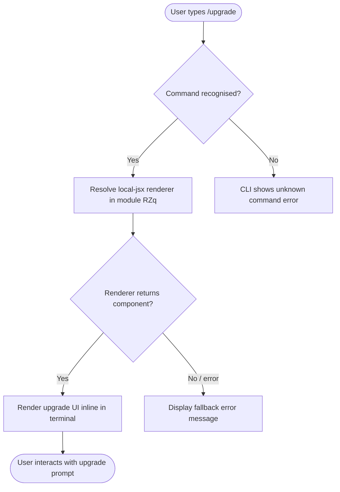

# `/upgrade`

> Analysis basis: CC v2.1.144 bundle.js (AST extraction + Claude interpretation)
> Minimum version: v2.1.144

---

## Overview

The `/upgrade` slash command presents the user with a path to upgrade their Anthropic subscription to the Max plan, which offers higher API rate limits and increased access to the Opus model family. It is a local, UI-rendering command (type `local-jsx`) registered directly in the Claude Code CLI, meaning it renders an interactive component inline rather than dispatching a remote API call.

---

## Registration

| Field | Value |
|---|---|
| type | `local-jsx` |
| name | `upgrade` |
| description | `Upgrade to Max for higher rate limits and more Opus` |
| module\_id | `RZq` |

Analysis basis: CC v2.1.144 bundle.js:+11697400

---

## Input Branching

The AST traversal at depth ≤ 2 from module `RZq` did not surface any entry-point functions, call edges, or literal constants.

<!-- TODO: not found in depth-2 traversal; needs --depth 4 -->

Because the command type is `local-jsx`, the expected top-level branching is:



> Detailed internal branching inside module `RZq` (e.g., whether the user is already on Max, authentication state checks, URL generation) cannot be confirmed from the depth-2 traversal.
> <!-- TODO: not found in depth-2 traversal; needs --depth 4 -->

---

## Behavioral Spec

### Command Dispatch

Because the `type` field is `local-jsx`, the CLI command registry resolves the command locally and delegates rendering to the JSX component exported from module `RZq`. No network request is initiated by the command dispatcher itself.

```
function dispatchUpgradeCommand(userInput):
    command = resolveLocalCommand("upgrade")
    if command is null:
        displayError("Unknown command: /upgrade")
        return

    component = loadLocalJsxModule(command.moduleId)   // module RZq
    if component is null:
        displayError("Failed to load upgrade component")
        return

    renderInlineComponent(component, userInput)
```

Analysis basis: CC v2.1.144 bundle.js:+11697400

### JSX Component Rendering

The rendered component is expected to surface upgrade information (Max plan benefits: higher rate limits, increased Opus access) and a call-to-action directing the user to Anthropic's subscription management surface. Exact UI strings, URLs, and conditional logic within the component are:

<!-- TODO: not found in depth-2 traversal; needs --depth 4 -->

---

## State & Side Effects

| Item | Detail |
|---|---|
| Telemetry | None detected at depth ≤ 2 (`telemetry: []`) |
| Hook registration | <!-- TODO: not found in depth-2 traversal; needs --depth 4 --> |
| appState changes | <!-- TODO: not found in depth-2 traversal; needs --depth 4 --> |
| Sound | <!-- TODO: not found in depth-2 traversal; needs --depth 4 --> |
| Network | No network call initiated by the dispatcher; any outbound URL is opened by the rendered JSX component |

> The absence of telemetry events in the depth-2 traversal means either the command emits no telemetry, or telemetry calls reside deeper in the render tree.

---

## Version History

| Version | Change |
|---|---|
| v2.1.144 | Initial analysis — command registered as `local-jsx` in module `RZq`; description targets Max plan upsell |

---

## Common Mistakes

1. **Expecting a remote API call.** Because the type is `local-jsx`, `/upgrade` does not proxy through any Anthropic API endpoint. It renders a local UI component; any navigation to Anthropic's website happens via the component, not the command dispatcher.
2. **Assuming telemetry is absent entirely.** The depth-2 traversal found no `tengu_*` events, but telemetry may be emitted deeper inside the JSX render tree. Do not rely on the absence of telemetry at this analysis depth for compliance or auditing purposes.
3. **Treating the description as the full feature contract.** The registered description (`"Upgrade to Max for higher rate limits and more Opus"`) is the CLI help string only; actual UI copy, URLs, and plan details are controlled by the JSX component in module `RZq` and may differ across patch releases without changing the registration record.
4. **Running `/upgrade` expecting an automated account change.** The command surfaces information and a prompt; it does not automatically modify the user's Anthropic account or subscription state from within the CLI.

---

## Appendix — Identifier Mapping

> For bundle debugging only. Identifiers change across versions.

| Identifier | Role |
|---|---|
| `RZq` | Module ID for the `/upgrade` command's `local-jsx` renderer (not an obfuscated function name, but an obfuscated module identifier) |

> No obfuscated function identifiers (`identifiers: []`) were surfaced during the depth-2 AST traversal of module `RZq`. Additional identifiers may be present at greater traversal depth.
> <!-- TODO: not found in depth-2 traversal; needs --depth 4 -->