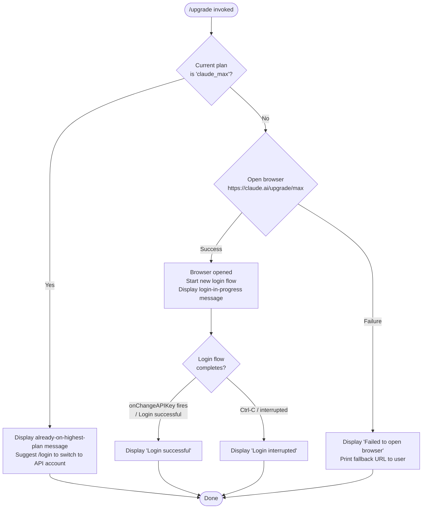

# `/upgrade`

> Analysis basis: CC v2.1.154 bundle.js (AST extraction + Claude interpretation)
> Minimum version: v2.1.154

---

## Overview

The `/upgrade` command guides the user from their current Claude subscription to the **Claude Max** plan by opening the upgrade URL in the system browser and, optionally, running a fresh login flow to acquire a new OAuth token. If the user is already on the highest Max tier, the command short-circuits with an informational message instead of launching the browser.

---

## Registration

| Field | Value |
|---|---|
| type | `local-jsx` |
| name | `upgrade` |
| description | `Upgrade to Max for higher rate limits and more Opus` |
| loc_byte | `12392741` |
| loc_byte_end | `12393001` |
| loc_line | `9244` |
| module_id | `G8A` |
| load_inline | `true` |
| arbor_handler.name | `ek6` |
| arbor_handler.fqn | `claude-2.1.154::ek6` |
| arbor_handler.kind | `AsyncFunction` |
| arbor_handler.resolution_path | `module_id` |
| arbor_handler.n_hits | `0` |

Analysis basis: CC v2.1.154 bundle.js:+12392741

---

## Input Branching

Four distinct paths exist in the handler, so a Mermaid flowchart is used.



Analysis basis: CC v2.1.154 bundle.js:+12392102 (setTimeout / login flow), +12392267 (browser-open call), +12392117 (already-on-max message), +12392534 (browser-open failure message)

---

## Behavioral Spec

### 1 · Entry Point — Upgrade Handler (`ek6`)

The handler is an `AsyncFunction` resolved via `module_id → G8A` (Arbor path: `module_id`).

```
async function upgradeHandler(context):

    # Step 1 — Inspect current auth context
    authProfile = getAuthProfile(context)          # EA → HR, Uq

    # Step 2 — Check whether the user is already on the top Max tier
    if authProfile.planType == "claude_max"
       AND authProfile.tier == "default_claude_max_20x":
        displayMessage(
          "You are already on the highest Max subscription plan. " +
          "For additional usage, run /login to switch to an API usage-billed account."
        )
        return

    # Step 3 — Open upgrade URL in system browser
    upgradeURL = "https://claude.ai/upgrade/max"
    browserOpened = openInSystemBrowser(upgradeURL)   # wK → V8 → W_ → ZGH

    if NOT browserOpened:
        displayMessage(
          "Failed to open browser. " +
          "Please visit https://claude.ai/upgrade/max to upgrade."
        )
        return

    # Step 4 — Trigger a fresh login flow
    displayMessage(
      "Starting new login following /upgrade. " +
      "Exit with Ctrl-C to use existing account."
    )

    # Step 5 — Run OAuth / login sequence with timeout
    setTimeout(loginTimeoutHandler, ...)              # loc_byte 12392102
    loginResult = await runLoginFlow(context)         # Ne → Sq, yH, t6, N, hH

    # Step 6 — Render JSX result component
    resultElement = createElement(UpgradeResultComponent, ...)   # W8A.createElement

    # Step 7 — Respond to API key change event
    on context.onChangeAPIKey:
        if loginResult succeeded:
            displayMessage("Login successful")
        else:
            displayMessage("Login interrupted")

    logErrors(...)                                    # hH → Li.logError
```

Analysis basis: CC v2.1.154 bundle.js:+12391787 (`ek6→EA`), +12391873 (plan literal `"max"`), +12391898 (tier literal `"default_claude_max_20x"`), +12392016 (`"claude_max"`), +12392102 (setTimeout), +12392267 (browser-open), +12392303 (createElement), +12392438 (onChangeAPIKey), +12392457, +12392461, +12392480, +12392513, +12392534

---

### 2 · Auth-Profile Inspection (`EA`)

```
function getAuthProfile(context):
    flagSettings = readFlagSettings(context)          # HR, Uq
    authType = flagSettings["flagSettings"]

    # Detect profile type
    if authType includes "profile-implicit":
        profile = buildImplicitProfile()

    if authType == "user_oauth":
        profile = buildOAuthProfile()
        profile.tokenSource = "CLAUDE_CODE_OAUTH_TOKEN_FILE_DESCRIPTOR"

    return profile
```

Analysis basis: CC v2.1.154 bundle.js:+2962120 (`EA→TY`), +2942699 (`"profile-implicit"`), +2942733 (`EA→HR`), +2942738 (`"flagSettings"`), +2942772 (`"user_oauth"`), +2065692 (env var literal)

---

### 3 · Provider / Platform Guard (`PO → GA`)

Before the upgrade URL is opened, the auth-profile builder checks the active API provider. If the provider is any of the cloud-forwarding backends, the upgrade path may be suppressed or adapted.

```
function checkProviderAllowsUpgrade(providerString):
    CLOUD_PROVIDERS = ["bedrock", "foundry", "anthropicAws", "mantle", "vertex", "firstParty"]
    if providerString in CLOUD_PROVIDERS:
        return false   # upgrade not applicable for enterprise/cloud providers
    return true
```

Analysis basis: CC v2.1.154 bundle.js:+2044343–2044560 (provider string literals), +2044620 (`PO→GA`)

---

### 4 · OAuth / Login Flow (`Ne`)

```
async function runLoginFlow(context):
    # Build OAuth endpoint URL
    oauthURL = buildOAuthURL(environment)             # Sq → AZA, q64

    # Fetch current profile from OAuth server
    profileResponse = httpGet(
        oauthURL,
        headers={"Content-Type": "application/json"},
        timeout=10000                                  # loc_byte 2051190
    )

    emit telemetry "oauth_profile_fetch"               # loc_byte 2051206

    if profileResponse.status in [401, 403, 429]:
        emit telemetry "oauth_profile_token_failed"    # loc_byte 2051273
        logError("error", ...)

    # Persist tokens (API key or OAuth token)
    if "CLAUDE_CODE_API_KEY_FILE_DESCRIPTOR" in env:
        storeToken("API key", ...)
    else if "CLAUDE_CODE_OAUTH_TOKEN_FILE_DESCRIPTOR" in env:
        storeToken("OAuth token", ...)
    else:
        raise Error(
          "ANTHROPIC_API_KEY, CLAUDE_CODE_OAUTH_TOKEN, or WIF env vars " +
          "(ANTHROPIC_FEDERATION_RULE_ID + ANTHROPIC_ORGANIZATION_ID) required"
        )

    # Log to rolling buffer (max last 20 entries)
    appendToLogBuffer(logEntry, maxEntries=20)         # loc_byte 2067501

    return loginResult
```

Analysis basis: CC v2.1.154 bundle.js:+2051046 (`Ne→Sq`), +2051100 (`Ne→c_.get`), +2051147–2051190 (headers/timeout), +2051206 (`oauth_profile_fetch`), +2051273 (`oauth_profile_token_failed`), +2051303, +2051388 (`Ne→hH`), +2065692, +2065835, +2065897, +2946155 (error message), +2067501 (20-entry limit)

---

### 5 · System Browser Launch (`wK → V8 → W_ → ZGH`)

```
function openInSystemBrowser(url):
    # Validate URL scheme
    if url.protocol NOT IN ["http:", "https:"]:
        raise Error("Invalid URL scheme")              # loc_byte 6590543

    platform = process.platform
    if platform == "darwin":
        exec("open", url)
    else if platform == "win32":
        exec("rundll32", "url,OpenURL", url)
    else:
        exec("xdg-open", url)                         # Linux fallback

    # Retry / timeout logic
    MAX_RETRY_ATTEMPTS = 10                            # loc_byte 1048709
    RETRY_DELAY_MS     = 1000000                       # loc_byte 1049231

    return openResult
```

Analysis basis: CC v2.1.154 bundle.js:+6590593 (`"http:"`), +6590615 (`"https:"`), +6590830 (`wK→Yn7`), +6590843 (`wK→xD`), +6590902 (`"darwin"`), +6590918 (`"win32"`), +6591002 (`"rundll32"`), +6591014 (`"url,OpenURL"`), +6591076 (`"open"`), +6591083 (`"xdg-open"`), +1048709, +1049231

---

### 6 · OAuth URL Construction (`Sq`)

```
function buildOAuthURL(environment):
    ENV_URLS = {
        "prod":    <production endpoint>,
        "local":   "http://localhost:8000",   # also :4000, :3000
        "staging": <staging endpoint>
    }

    if CLAUDE_CODE_CUSTOM_OAUTH_URL is set:
        approved = checkApprovedEndpoints(CLAUDE_CODE_CUSTOM_OAUTH_URL)
        if NOT approved:
            raise Error("CLAUDE_CODE_CUSTOM_OAUTH_URL is not an approved endpoint.")

    baseURL = ENV_URLS[environment] ?? ENV_URLS["prod"]
    return baseURL + "/v1/toolbox/shttp/mcp/{server_id}"
```

Analysis basis: CC v2.1.154 bundle.js:+950285 (`Sq→AZA`), +949142 (`"prod"`), +949416 (`"http://localhost:8000"`), +949503 (`"http://localhost:4000"`), +949593 (`"http://localhost:3000"`), +950215 (`"/v1/toolbox/shttp/mcp/{server_id}"`), +950296 (`"local"`), +950321 (`"staging"`), +950481 (custom URL error message)

---

## State & Side Effects

| Item | Detail |
|---|---|
| Telemetry — `tengu_feature_ok` | Fired on successful feature gate check (bundle.js:+965176) |
| Telemetry — `tengu_feature_sad` | Fired on failed feature gate check (bundle.js:+965311) |
| Telemetry — `tengu_bg_spare_enable` | Fired when background spare process is enabled (bundle.js:+15477937) |
| Telemetry — `tengu_bg_spare_spawn` | Fired when background spare process is spawned (bundle.js:+15478297) |
| OAuth profile fetch | HTTP GET to Anthropic OAuth profile endpoint; timeout 10 000 ms; emits `oauth_profile_fetch` or `oauth_profile_token_failed` |
| Browser launch | Platform-appropriate command (`open` / `rundll32` / `xdg-open`) is executed as a child process |
| appState / auth | On success, `onChangeAPIKey` callback is invoked, updating the stored API key or OAuth token |
| Log buffer | Rolling entry buffer capped at 20 items (`_R → H.slice`, loc_byte +2067501) |
| File system | Login helper may write token files via `uI.appendFile`, `uI.rename`, `uI.unlink`; log directory created with `uI.mkdir` |
| Sound | None detected |
| Hook registration | `_9 → f$A.register` — a cleanup / shutdown hook is registered during the login flow (bundle.js:+58450) |

---

## Version History

| Version | Change |
|---|---|
| v2.1.154 | Initial analysis |

---

## Common Mistakes

1. **Already on Max** — Running `/upgrade` when already subscribed to the `default_claude_max_20x` tier produces only an informational message; no browser is opened. Use `/login` instead if you need to switch billing mode.
2. **Enterprise / cloud providers** — Users authenticated via Bedrock, Vertex, Foundry, Mantle, or AWS Anthropic endpoints will find the upgrade path inapplicable; the provider guard (`PO → GA`) detects these and the command exits early.
3. **Browser not available** — In headless or SSH environments the system browser command will fail; the command surfaces the fallback URL (`https://claude.ai/upgrade/max`) for manual navigation.
4. **Custom OAuth URL** — Setting `CLAUDE_CODE_CUSTOM_OAUTH_URL` to an unapproved endpoint causes the login flow to throw immediately with an explicit error rather than silently failing.
5. **Ctrl-C during login** — Interrupting the login flow after the browser has opened produces a "Login interrupted" status; the existing session/account is preserved unchanged.

---

## Appendix — Identifier Mapping

> For bundle debugging only. Identifiers change across versions.

| Identifier | Role |
|---|---|
| `ek6` | Main upgrade command handler (AsyncFunction, arbor_handler) |
| `EA` | Auth-profile reader; inspects flag settings and plan type |
| `TY` | Auth-context builder; orchestrates profile assembly sub-calls |
| `lK` | Low-level string / token formatter |
| `xH` | Generic string utility (called by multiple sites) |
| `bP` | Profile builder; routes `profile-implicit` vs `user_oauth` |
| `Ii6` | OAuth token sub-handler |
| `kgH` | String helper used in profile and context construction |
| `ki` | Token-file descriptor resolver (SR4, J1q) |
| `pN` | Secondary profile normaliser; calls lK, h8, JA |
| `HR` | Flag-settings reader; checks `Array.isArray`, `H.includes` |
| `PO` | Provider-type dispatcher |
| `GA` | Provider string classifier (bedrock / foundry / vertex / etc.) |
| `oJ` | Context accessor utility |
| `u$` | Auth-credential resolver; handles API key env var, apiKeyHelper, WIF |
| `SO6` | Supplementary auth-source helper |
| `GxH` | IDE-context detector (claude-vscode check via `S_`) |
| `lf6` | File-descriptor-based token loader |
| `b6` | Token storage writer; timestamps entries with `Date.now` |
| `_R` | Log-buffer slicer (keeps last 20 entries) |
| `CO6` | Context-override compositor |
| `Ne` | OAuth login flow orchestrator |
| `Sq` | OAuth URL builder; validates custom endpoint |
| `AZA` | Base URL resolver for OAuth environments |
| `q64` | OAuth environment selector |
| `yH` | Profile fetch HTTP caller; emits `oauth_profile_fetch` |
| `t6` | Profile fetch error handler; emits `oauth_profile_token_failed` |
| `OY` | Response parser utility |
| `N` | Telemetry / logging dispatcher; uses JSON.stringify, `v4`, `HuH`, `gRK` |
| `URK` | Telemetry event sender; calls `mI`, `pRK`, `$$A` |
| `$$A` | Platform-specific telemetry batcher |
| `H` | Shared utility array / namespace (Math.random, setTimeout) |
| `RH` | JSON stringifier wrapper |
| `v4` | Path / filename builder (FzA, H.replace, q.at, A.lastIndexOf, A.slice) |
| `FzA` | CRK map transformer for path building |
| `q` | File-system cleanup helper (PEK.unlinkSync) |
| `A` | File-path lowercaser |
| `HuH` | Log write dispatcher |
| `yzA` | Raw log writer (H.write) |
| `gRK` | Rotating-log file manager (stat, rename, unlink, mkdir, appendFile) |
| `kxH` | Write-queue / batched-write scheduler (setTimeout, setImmediate) |
| `cMH` | Log-line formatter (czA, X0H.join, l8, k6) |
| `B6` | File-system base-path resolver |
| `B16` | Directory-existence checker (J8) |
| `rzA` | Log-file path joiner |
| `izA` | Log-file rotator (stat, endsWith, slice, rename, unlink) |
| `FRK` | Log-append worker (mkdir, appendFile, rotate) |
| `_9` | Shutdown-hook registrar (f$A.register) |
| `hH` | Error logger / reporter; pushes to QmH buffer, calls Li.logError |
| `F_` | Error coercer (Error, String) |
| `q1` | Log-context builder |
| `zEA` | Context string formatter |
| `D84` | Circular log-buffer manager (LB6.shift, LB6.push) |
| `wK` | System browser launcher; dispatches to V8/xD |
| `Yn7` | URL scheme validator |
| `xD` | Browser process executor |
| `V8` | Browser-open orchestrator; delegates to W_, C6 |
| `W_` | Browser-open retry/timeout wrapper; calls ZGH, D, gA4, Wz, N, J8, hH |
| `ZGH` | Platform-dispatch browser opener (darwin/win32/linux); manages promise lifecycle |
| `D` | Background spare-process monitor (freemem, Date.now, tengu_bg_spare_* telemetry) |
| `gA4` | String coercer for browser-open results |
| `Wz` | Shared wait/delay utility |
| `J8` | Directory-check utility |
| `C6` | Async-storage context reader (YB6, $_) |
| `YB6` | AsyncLocalStorage `.getStore()` wrapper |
| `$_` | Fallback context provider (ov) |