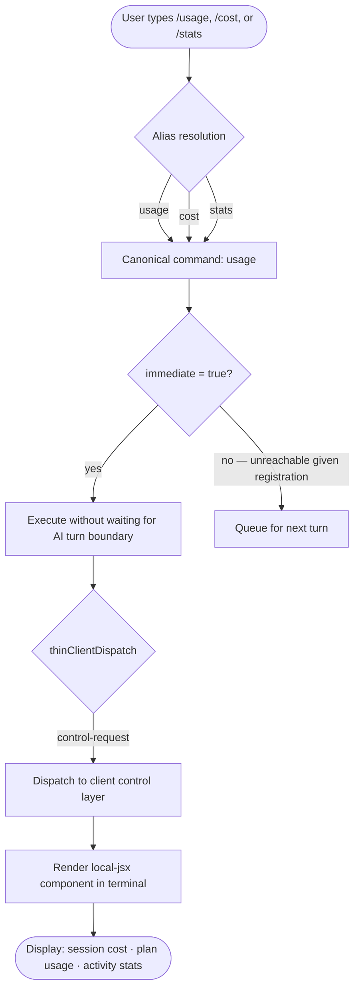

# `/usage`

> Analysis basis: CC v2.1.144 bundle.js (AST extraction + Claude interpretation)
> Minimum version: v2.1.144

---

## Overview

The `/usage` command displays a summary of the current session's token cost, subscription plan usage, and activity statistics directly within the Claude Code CLI. It is registered as a `local-jsx` command, meaning its output is rendered as a React JSX component in-terminal rather than being processed through the standard text pipeline. The command dispatches via the `control-request` channel, indicating it communicates directly with the client control layer rather than the AI inference backend.

---

## Registration

| Field | Value |
|---|---|
| type | `local-jsx` |
| name | `usage` |
| description | `Show session cost, plan usage, and activity stats` |
| immediate | `true` |
| thinClientDispatch | `control-request` |
| aliases | `cost`, `stats` |
| module_id | `E2q` |

Analysis basis: CC v2.1.144 bundle.js:+11391024

---

## Input Branching

Because the AST traversal reached zero call-graph edges for module `E2q` at depth ≤ 2, the internal branching logic of the command handler cannot be reconstructed from the extracted data alone.

The following flowchart captures only the **dispatch-level** branching that is deterministically known from the registration fields:



> **Note:** Internal branching within the JSX render function (e.g., conditional display of plan tiers, zero-cost states, or error paths) is <!-- TODO: not found in depth-2 traversal; needs --depth 4 -->

---

## Behavioral Spec

### Alias Resolution

All three invocation tokens (`/usage`, `/cost`, `/stats`) resolve to the same canonical handler before dispatch.

```
function resolveUsageAlias(inputToken):
    canonicalAliases = ["usage", "cost", "stats"]
    if inputToken in canonicalAliases:
        return commandRegistry.lookup("usage")
    else:
        return NOT_FOUND
```

Analysis basis: CC v2.1.144 bundle.js:+11391024 (`aliases` field in registration object)

---

### Immediate Execution

The `immediate: true` flag instructs the CLI runtime to execute this command synchronously upon recognition, without waiting for an ongoing AI response stream to complete or for a new conversation turn to begin.

```
function dispatchCommand(command, context):
    if command.immediate == true:
        executeNow(command, context)          // does not enqueue
    else:
        enqueueForNextTurn(command, context)
```

Analysis basis: CC v2.1.144 bundle.js:+11391024 (`immediate` field in registration object)

---

### Control-Request Dispatch

Unlike commands that forward user input to the Anthropic inference API, `/usage` routes its execution through the `control-request` channel. This channel is reserved for commands that read and display local client-side state (e.g., token counters, billing metadata, session timers) without generating an AI completion.

```
function handleControlRequest(command, appState):
    if command.thinClientDispatch == "control-request":
        payload = gatherUsagePayload(appState)
        return renderLocalJSX(command.module_id, payload)
    else:
        forwardToInferenceAPI(command)

function gatherUsagePayload(appState):
    // Exact fields gathered are:
    // <!-- TODO: not found in depth-2 traversal; needs --depth 4 -->
    return {
        sessionCost:   appState.sessionCost,    // inferred from description
        planUsage:     appState.planUsage,       // inferred from description
        activityStats: appState.activityStats    // inferred from description
    }
```

Analysis basis: CC v2.1.144 bundle.js:+11391024 (`thinClientDispatch` field in registration object)

---

### Local JSX Rendering

The command type `local-jsx` means the CLI renders the response as a terminal-embedded React component rather than streaming plain text. The component is loaded from module `E2q`.

```
function renderLocalJSX(moduleId, payload):
    component = bundleModules.load(moduleId)   // moduleId = "E2q"
    terminalOutput = component.render(payload)
    writeToPTY(terminalOutput)
```

Analysis basis: CC v2.1.144 bundle.js:+11391024 (`type` and `module_id` fields in registration object)

---

### Display Content

Based on the registered description, the rendered output is expected to include three categories of information. The precise layout, formatting, field labels, and conditional visibility rules within module `E2q` are <!-- TODO: not found in depth-2 traversal; needs --depth 4 -->

| Category | Expected Content |
|---|---|
| Session cost | Token spend (input + output) accumulated in the current session |
| Plan usage | Consumption against the active subscription plan (e.g., quota remaining) |
| Activity stats | Counts of turns, tool calls, or other session activity metrics |

---

## State & Side Effects

| Item | Detail |
|---|---|
| Telemetry | None detected at depth ≤ 2. <!-- TODO: not found in depth-2 traversal; needs --depth 4 --> |
| Hook registration | <!-- TODO: not found in depth-2 traversal; needs --depth 4 --> |
| appState changes | Read-only at dispatch layer; no appState mutations observed at depth ≤ 2 |
| Sound | <!-- TODO: not found in depth-2 traversal; needs --depth 4 --> |
| Network I/O | None expected; `control-request` channel reads local client state only |
| AI inference | Not triggered; command does not route through the inference API |

---

## Version History

| Version | Change |
|---|---|
| v2.1.144 | Initial analysis. Command registered with aliases `cost` and `stats`, `immediate: true`, `thinClientDispatch: control-request`, module `E2q`. |

---

## Common Mistakes

1. **Expecting AI-generated output.** Because `/usage` uses `thinClientDispatch: "control-request"`, it never sends a prompt to the Anthropic API. The displayed data is read from local client state. Any apparent "summary" text is produced by the JSX component, not by model inference.

2. **Assuming `/cost` and `/stats` behave differently.** All three aliases (`/usage`, `/cost`, `/stats`) resolve to the identical handler and render the same component. There is no per-alias filtering of displayed data based on the registration data available.

3. **Invoking during a streaming response and expecting updated figures.** Although `immediate: true` allows the command to fire without waiting for a turn boundary, the cost counters it reads may not yet reflect tokens from an in-progress stream until that stream is finalized. The exact flush behavior is <!-- TODO: not found in depth-2 traversal; needs --depth 4 -->

4. **Conflating this command with server-side billing dashboards.** The data shown is session-scoped and sourced from the local CLI process state. It does not query the Anthropic billing API in real time (no network dispatch observed at depth ≤ 2).

5. **Expecting programmatic output for scripting.** As a `local-jsx` command, the output is rendered into a PTY as a formatted terminal component. It is not designed to emit machine-parseable JSON or plain-text suitable for shell piping.

---

## Appendix — Identifier Mapping

> For bundle debugging only. Identifiers change across versions.

| Identifier | Role |
|---|---|
| `E2q` | Module identifier for the `/usage` local-jsx command handler and render component |

> **Note:** The depth-2 AST traversal returned an empty `identifiers` array for module `E2q` (`"note": "no entry functions found for module 'E2q'"`). No additional obfuscated function-level identifiers were extractable at this traversal depth. A depth-4 re-traversal targeting module `E2q` directly is recommended to populate this table fully.