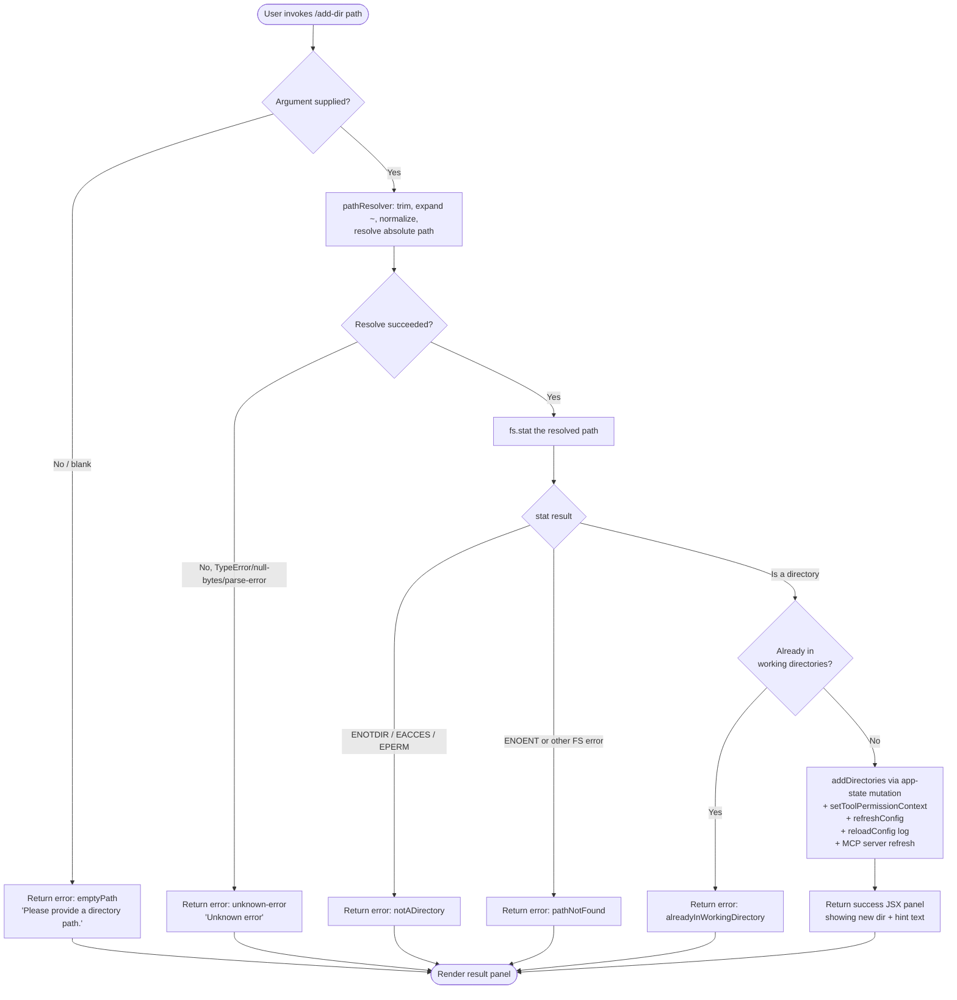

# `/add-dir`

> Analysis basis: CC v2.1.154 bundle.js (AST extraction + Claude interpretation)
> Minimum version: v2.1.154

---

## Overview

`/add-dir` adds a new working directory to the current Claude Code session, expanding the set of filesystem paths the agent is permitted to operate in. It resolves, validates, and stat-checks the provided path, then registers it with the session's app state and refreshes configuration so that subsequent tool-permission checks and MCP server routing reflect the new directory. The command surfaces an interactive JSX panel that guides the user through the result and lists follow-on slash commands.

---

## Registration

| Field | Value |
|---|---|
| type | `local-jsx` |
| name | `add-dir` |
| description | `Add a new working directory` |
| argumentHint | `<path>` |
| module_id | `YE1` |
| load_inline | `true` |
| loc_byte | `10671929` |
| loc_byte_end | `10672077` |
| loc_line | `7553` |
| arbor_handler.name | `pcL` |
| arbor_handler.fqn | `claude-2.1.154::pcL` |
| arbor_handler.kind | `AsyncFunction` |
| arbor_handler.resolution_path | `module_id` |
| arbor_handler.n_hits | `0` |

Analysis basis: CC v2.1.154 bundle.js:+10671929

---

## Input Branching

Six distinct outcome branches exist (empty path, path-resolve error, not-a-directory, path-not-found/permission-denied, already-in-working-directory, and success), so a Mermaid flowchart is used.



Analysis basis: CC v2.1.154 bundle.js:+10670710, +3776363, +3776461, +3776606, +3776717, +3776793

---

## Behavioral Spec

### 1. Entry Point — Handler (`pcL`)

The registered handler is the async function `pcL` (Arbor resolution path: `module_id → YE1 → pcL`).

```
async function addDirHandler(inputArg, sessionContext):
    appState      = getAppStateSnapshot(sessionContext)       // Z_ → H.getAppState
    toolCtxFilter = buildToolContextFilter(appState,          // Z_ → jE8, JE8
                        allowedTools   = "allowed_tools",
                        disallowedTools= "disallowed_tools",
                        avoidPrompts   = "avoid_prompts",
                        effort         = "effort",
                        model          = "model")
    
    // Update permission context for the new directory scope
    setToolPermissionContext(sessionContext, toolCtxFilter)   // _.setToolPermissionContext

    // Validate & apply directory addition
    result = await addDirectoriesToState(                     // nM  (loc +10670852)
                 appState,
                 inputArg,
                 key = "addDirectories",                      // literal +10670746
                 scope = "localSettings",                     // literal +10670793
                 sessionScope = "session")                    // literal +10670809

    // Read existing working directories list
    currentDirs = getWorkingDirectories(sessionContext)       // CI  (loc +10670867)

    // Check if CLI flag "--add-dir" was already applied at startup
    alreadyApplied = currentDirs.includes(inputArg)          // Y.includes +10670876

    // Persist config reload marker
    reloadConfig(sessionContext)                              // Xr_ (loc +10670923)

    // Refresh MCP server connections to account for new directory
    refreshMcpServers(sessionContext)                         // c69 (loc +10670930)

    // Rebuild tool-display state for the new working set
    rebuildToolDisplayState(sessionContext, result)           // m6H (loc +10670964)

    // Refresh global config (project + local settings)
    OA.refreshConfig()                                        // +10670904

    // Render JSX result panel (bold path, dim hint)
    return renderResultPanel(result,                          // QdH (loc +10671462)
                             ddH,                            // success/failure display +10671506
                             boldStyle  = j6.bold,           // +10670982
                             dimStyle   = j6.dim,            // +10671268
                             hintText   = "· /permissions to manage") // literal +10671275
```

Analysis basis: CC v2.1.154 bundle.js:+10670710, +10670820, +10670852, +10670867, +10670876, +10670904, +10670923, +10670930, +10670964, +10670982

---

### 2. Path Resolution (`pathResolver` / `Xq`)

```
function resolvePath(rawInput):
    trimmed = rawInput.trim()
    if trimmed contains null bytes:
        throw Error("Path contains null bytes")      // literal +1006931
    if trimmed is empty:
        return { kind: "emptyPath" }                 // literal +3776363

    normalized = path.normalize(trimmed)

    if normalized starts with "~/":                  // literal +1007085
        home = os.homedir()                          // VB6.homedir +1007038
        normalized = path.join(home, normalized.slice(2))

    // Windows drive-letter pattern match              // literal "windows" +1007167
    if platform is windows and path matches drive regex:
        normalized = handleWindowsDrivePath(normalized)

    if not path.isAbsolute(normalized):
        normalized = path.resolve(normalized)        // $N.resolve +1007291

    return normalized
```

Analysis basis: CC v2.1.154 bundle.js:+1006678, +1006965, +1006987, +1007038, +1007085, +1007291

---

### 3. Directory Validation (`QdH`)

```
async function validateAndAddDirectory(resolvedPath, appState):
    if resolvedPath is null or empty:
        return { status: "emptyPath",
                 message: "Please provide a directory path." }  // literal +3776878

    try:
        statResult = await fs.stat(resolvedPath)               // Xaq.stat +3776416
    catch err:
        if err.code == "ENOTDIR" or "EACCES" or "EPERM":      // literals +3776551/66/80
            return { status: "notADirectory" }                 // literal +3776461
        if err.code == "ENOENT":                               // (inferred from pathNotFound branch)
            return { status: "pathNotFound" }                  // literal +3776606

    if statResult is not a directory:
        return { status: "notADirectory" }

    if appState.workingDirectories.includes(resolvedPath):
        return { status: "alreadyInWorkingDirectory" }         // literal +3776717

    // Normalise symlinks / macOS /var → /tmp aliasing
    realPath = canonicalisePath(resolvedPath)                  // cN, zj, Q6K (loc +3776691)

    addToWorkingDirectories(appState, realPath)

    return { status: "success" }                               // literal +3776793
```

Analysis basis: CC v2.1.154 bundle.js:+3776416, +3776461, +3776524, +3776606, +3776717, +3776793, +3776878

---

### 4. App-State Mutation (`addDirectoriesToState` / `nM`)

```
function addDirectoriesToState(appState, path, options):
    // Serialize existing rule sets before mutation
    serializedRules = serializeRules(appState)                 // RH → JSON.stringify +4663880

    // Apply the new directory to the "addDirectories" key
    appState.set("addDirectories", [path, ...existing])        // A.set +4664641

    // Reconcile allow/deny/ask rule lists
    for each ruleSet in ["alwaysAllowRules",                   // literals +4663916/55/73
                          "alwaysDenyRules",
                          "alwaysAskRules"]:
        mergeRules(appState, ruleSet, options)

    // Prune directories that were explicitly removed
    appState.filter("removeDirectories",                       // literal +4665112
        dir => L.has(dir))                                     // L.has +4665053

    // Remove stale entries
    appState.delete(staleKey)                                  // A.delete +4665340
```

Analysis basis: CC v2.1.154 bundle.js:+4663880, +4664641, +4663916, +4665112, +4665340

---

### 5. Config Reload & Log Persistence (`reloadConfig` / `Xr_`)

```
async function reloadConfig(sessionContext):
    env = detectEnvironment()                 // v2H; "production"|"test" literals +12864100/97
    realPath = fs.realpath(configPath)        // _7.realpath +12864435
    normalised = path.normalize(realPath,     // NFC normalisation literal +12864461
                     form = "NFC")

    existing = await fs.readFile(configPath,  // _7.readFile +12864639
                    encoding = "utf8")        // literal +12864653

    await fs.mkdir(path.dirname(configPath),  // _7.mkdir +12864735
                   { recursive: true })

    await fs.appendFile(configPath, delta,    // _7.appendFile +12864816
                        mode: 0o700)          // octal 448 literal +12864777

    logError(configPath)                      // hH → Li.logError +970914
```

File-mode constants: `448` (0o700) at bundle.js:+12864777, `384` (0o600) at bundle.js:+12864844.

Analysis basis: CC v2.1.154 bundle.js:+12864401, +12864435, +12864461, +12864639, +12864735, +12864816

---

### 6. MCP Server Refresh (`refreshMcpServers` / `c69`)

```
async function refreshMcpServers(sessionContext):
    invalidateCache(sessionContext)           // qj → CYH.delete +4086882

    for each serverSlot in configuredServers:
        stat = await fs.stat(serverSlot)     // a9 → QP.stat +4087021
        if stat changed:
            cacheEntry = CYH.get(slot)       // +4087328
            raw = await QP.readFile(slot)    // +4087407
            parsed = JSON.parse(raw)         // m6 → JSON.parse +183900
            CYH.set(slot, parsed)            // +4087673

        if Number.isFinite(parsed.order):    // literal "order" +4086950
            applyOrder(parsed)
        if parsed.stateOrder:                // literal "stateOrder" +4086971
            applyStateOrder(parsed)

    atomicWrite(configPath, newContent,      // gO → Fe.writeFile/rename +2230631/84
                randomBytes = h1_.randomBytes("hex")) // literal "hex" +2230612
    CYH.clear()                              // +4087890
```

Analysis basis: CC v2.1.154 bundle.js:+4090087, +4090105, +4090270, +4090375, +4086882, +4087021, +4087890

---

### 7. Tool-Display Rebuild (`rebuildToolDisplayState` / `m6H`)

```
function rebuildToolDisplayState(sessionContext, addedDir):
    workingDirs = getWorkingDirsFromState(sessionContext)    // oW_ +4665579

    for each dir in workingDirs:
        // Resolve real path and check file type
        realPathInfo = resolvePathInfo(dir)                  // h8, iF6, ig
        if dir is already in display set:
            continue
        entry = buildDisplayEntry(dir, realPathInfo)         // GK9 → EE7, m3
        if m3 finds FIFO/socket/char/block device:
            skip entry                                       // m3.isFIFO/isSocket/... +184263..312
        normalEntry = normaliseDisplayEntry(entry)           // BO → G94, JZ, T94, W94

    filteredDirs = workingDirs.filter(
        d => !alreadyTracked(d))                             // A.includes +4666239

    // Update internal working-directory map
    updateDirMap(sessionContext, filteredDirs)               // U_ +4666287
```

Analysis basis: CC v2.1.154 bundle.js:+4665579, +4665658, +4665948, +4666152, +4666239, +4666287

---

### 8. Result Panel Rendering (`QdH` + `ddH`)

```
function renderResultPanel(validationResult, displayHelper):
    switch validationResult.status:
        case "emptyPath":
            show bold("Please provide a directory path.")
            return

        case "notADirectory":
            show bold("Did not add a working directory.")    // literal +10671411
            show dim("· /permissions to manage")            // literal +10671275
            return

        case "pathNotFound":
            show bold("Did not add a working directory.")
            return

        case "alreadyInWorkingDirectory":
            show bold path already listed
            return

        case "success":
            show bold(addedPath)                            // j6.bold +10670982
            show dim("· /permissions to manage")            // j6.dim  +10671268
            displayHelper.showDirname(addedPath)            // ddH → Iq8.dirname +3777014
```

Analysis basis: CC v2.1.154 bundle.js:+10671167, +10671268, +10671275, +10671411, +10671462, +10671506, +3776946, +3777014

---

## State & Side Effects

| Item | Detail |
|---|---|
| Telemetry | `tengu_daemon_config_reload` (bundle.js:+15493092) fired after successful config reload |
| appState changes | `addDirectories` key updated (bundle.js:+10670746); `localSettings` + `session` scopes written (bundle.js:+10670793, +10670809) |
| Tool permission context | `setToolPermissionContext` called with rebuilt filter including `allowed_tools`, `disallowed_tools`, `avoid_prompts`, `effort`, `model` (bundle.js:+10670820, +10669444–662) |
| Config refresh | `OA.refreshConfig()` called (bundle.js:+10670904); config file appended via `fs.appendFile` with mode 0o700 (bundle.js:+12864816, +12864777) |
| MCP server cache | `CYH` cache cleared and rebuilt; atomic write via `randomBytes` temp file (bundle.js:+4087890, +2230684) |
| `removeDirectories` reconciliation | Stale directory entries pruned from state (bundle.js:+4665112) |
| `bypassPermissions` guard | If `bypassPermissions` mode is unavailable, permission update is silently ignored with log message (bundle.js:+4663447) |
| Hook registration | `_9 → f$A.register` called during config write pipeline (bundle.js:+58450) |
| Sound | None detected in depth-2 traversal |

---

## Version History

| Version | Change |
|---|---|
| v2.1.154 | Initial analysis |

---

## Common Mistakes

1. **Omitting the argument entirely.** Running `/add-dir` with no path produces the `emptyPath` outcome and prints "Please provide a directory path." — the directory is never added.
2. **Supplying a file path instead of a directory.** If the path resolves to a regular file, the `ENOTDIR` branch fires and the command reports `notADirectory` without modifying state.
3. **Supplying a path that is already a working directory.** The command detects the duplicate via `alreadyInWorkingDirectory` and silently does not re-add it; no error is raised but no change occurs either.
4. **Expecting the path to be relative to CWD automatically.** The resolver only expands `~/` home-relative paths and Windows drive letters; bare relative paths are resolved against the process working directory, which may differ from the editor's open folder.
5. **Assuming instant MCP tool availability.** After `/add-dir` returns, the MCP server refresh (`c69`) runs asynchronously; new tool permissions from the added directory may not be immediately reflected in ongoing agent turns.
6. **Running in `bypassPermissions`-disabled sessions.** If the session was not launched with `bypassPermissions` mode, any permission-context update that attempts that mode is silently dropped (bundle.js:+4663447).

---

## Appendix — Identifier Mapping

> For bundle debugging only. Identifiers change across versions.

| Identifier | Role |
|---|---|
| `pcL` | Main async handler for `/add-dir` (Arbor-resolved entry point) |
| `Z_` | App-state snapshot helper; calls `H.getAppState` |
| `H` | Generic context/state object (overloaded; context-dependent) |
| `jE8` | Builds allowed-tools filter from app state |
| `JE8` | Builds disallowed-tools filter from app state |
| `aA` | Low-level filter accumulator shared by `jE8` / `JE8` |
| `nM` | `addDirectoriesToState` — mutates the `addDirectories` app-state key |
| `N` | Rule serialisation / config-key writer |
| `URK` | Config key dispatcher within `N` |
| `$$A` | Sub-dispatcher called by `URK` |
| `RH` | JSON serialiser wrapper (`JSON.stringify`) |
| `v4` | Path-segment helper (extension extraction, basename ops) |
| `FzA` | Character-map builder used by `v4` |
| `HuH` | File-write helper used during config persistence |
| `yzA` | Low-level write wrapper (`H.write`) |
| `gRK` | Config-file write orchestrator (mkdir, appendFile, rotate) |
| `kxH` | Debounce/flush queue for config writes |
| `cMH` | Config merge helper (joins path segments, calls `l8`, `k6`) |
| `B6` | General utility / boolean coercion helper |
| `B16` | Config-entry builder |
| `rzA` | Path-join helper using `X0H.join` |
| `izA` | File-stat/rename/unlink helper for atomic rotation |
| `FRK` | Atomic-write commit function (mkdir → appendFile → rotate) |
| `_9` | Hook registration caller (`f$A.register`) |
| `XM` | String escape / replaceAll wrapper (`P94`) |
| `P94` | Core replaceAll normaliser |
| `K` | Rule-list filter/map accumulator |
| `L` | Async file-watcher set manager |
| `f` | File-handle / watcher object |
| `CI` | Working-directory list reader |
| `Y` | Watcher/supervisor session manager |
| `E2H` | File-event handler for watcher updates |
| `o9` | AsyncLocalStorage store accessor (`Fj7.getStore`) |
| `J8` | Error-code classifier |
| `S_A` | Watcher state helper (`h_A`) |
| `ZH` | String coercion helper |
| `Lt1` | Column-width calculator for display |
| `T` | Supervisor process controller |
| `b` | Event object (preventDefault caller) |
| `Z0` | Config-reload trigger |
| `U_` | Full config loader/writer (reads policySettings, flagSettings, userSettings, projectSettings) |
| `E` | MCP client/server lifecycle manager |
| `QEK` | Heartbeat scheduler (`hHH`) |
| `hHH` | Heartbeat callback |
| `V` | Secondary timer/lifecycle object |
| `c` | Terminal/render callback |
| `g96` | Auxiliary state getter used after dir addition |
| `Xr_` | Config reload and log-append function |
| `v2H` | Environment detector (`production` / `test`) |
| `xH` | String builder / formatter |
| `v6K` | Version/channel selector |
| `Mb` | Metadata helper |
| `P8` | Error propagation / re-throw helper |
| `WS` | Observable/stream wrapper (`ov`) |
| `ov` | Core observable constructor |
| `$_` | Promise/stream adapter |
| `hH` | Log-error writer (calls `Li.logError`, manages queue via `D84`) |
| `F_` | Error-string formatter |
| `q1` | Log queue processor (`zEA`) |
| `zEA` | Log entry formatter |
| `D84` | Log-rotation helper (shift/push `LB6`) |
| `c69` | MCP server refresh orchestrator |
| `qj` | Cache-invalidation call (`CYH.delete`) |
| `a9` | Per-slot MCP config reader/writer |
| `m6` | JSON parse wrapper |
| `Af` | Atomic config-file writer (coordinates `gO`) |
| `gO` | Low-level atomic write (randomBytes temp file, rename) |
| `m6H` | Tool-display state rebuilder |
| `oW_` | Working-directory list extractor from state |
| `GK9` | Directory-entry builder (iterates dirs, calls `EE7`) |
| `ow6` | Path-info resolver |
| `h8` | File-identity helper (`iF6`, `ig`) |
| `EE7` | Single-entry builder (realpath, trim, type check) |
| `wO` | Path canonicaliser (`K$H`, `ig`) |
| `m3` | File-type checker (lstatSync, isFIFO, isSocket, isCharacterDevice, isBlockDevice, realpathSync) |
| `zP` | Path display formatter (`Mi`) |
| `NE7` | Display-name normaliser |
| `BO` | Entry formatter (G94, JZ, T94, W94, substring, replaceAll) |
| `G94` | Base-entry constructor |
| `JZ` | `Object.hasOwn` wrapper |
| `T94` | Entry-type tagger |
| `W94` | String sanitiser (`H.replaceAll`) |
| `M` | MCP server registry / connection manager |
| `vSH` | MCP connection slot processor |
| `JGK` | MCP connection result applier |
| `$` | MCP registry observable (`bo1`) |
| `Gm5` | MCP retry/recovery coordinator |
| `QdH` | Directory validation and result producer |
| `Xq` | Path resolver (expand `~/`, normalize, resolve absolute) |
| `C6` | Context store reader (`YB6`) |
| `YB6` | AsyncLocalStorage store accessor (`zB6.getStore`, `kn`) |
| `lr` | Result stream adapter (`$_`) |
| `cN` | Path canonicaliser (macOS `/var/` → `/tmp` substitution, `zj`, `Q6K`) |
| `zj` | Case-normaliser (`H.toLowerCase`) |
| `Q6K` | Platform path normaliser (`n6`, `n2`) |
| `Bg` | Platform-specific path finaliser |
| `ddH` | Success-panel display helper (bold path, dirname) |

---

Note: index built via Arbor fallback; some signals (telemetry, literals) may be missing — see arbor-fallback.js.