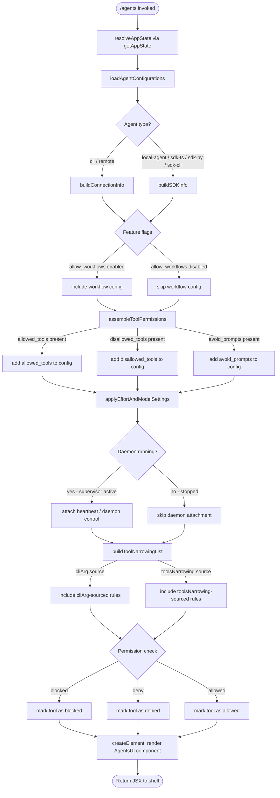

# `/agents`

> Analysis basis: CC v2.1.154 bundle.js (AST extraction + Claude interpretation)
> Minimum version: v2.1.154

---

## Overview

The `/agents` command provides a management interface for agent configurations within Claude Code. It surfaces a JSX-rendered UI that allows users to inspect, configure, and control agent instances — including their tool permissions, daemon lifecycle, and model/effort settings. The command delegates to an async handler that assembles configuration state and renders an interactive React component.

---

## Registration

| Field | Value |
|---|---|
| type | `local-jsx` |
| name | `agents` |
| description | `Manage agent configurations` |
| loc_byte | `12278202` |
| loc_byte_end | `12278327` |
| loc_line | `9206` |
| module_id | `xl1` |
| load_inline | `true` |
| arbor_handler.name | `T55` |
| arbor_handler.fqn | `claude-2.1.154::T55` |
| arbor_handler.kind | `AsyncFunction` |
| arbor_handler.resolution_path | `module_id` |
| arbor_handler.n_hits | `0` |

Analysis basis: CC v2.1.154 bundle.js:+12278202

---

## Input Branching

The handler exhibits more than three distinct logical paths depending on agent type, daemon state, tool permission state, and feature-flag checks. A Mermaid flowchart is used.



Analysis basis: CC v2.1.154 bundle.js:+12278053 (handler entry `T55`), +10669444 (`allowed_tools`), +10669499 (`disallowed_tools`), +10669560 (`avoid_prompts`), +15492299 (`supervisor`), +15514363 (daemon status), +10383393 (`cliArg`), +10383414 (`toolsNarrowing`), +9606696 (`blocked`)

---

## Behavioral Spec

### 1. Command Entry — async handler

Analysis basis: CC v2.1.154 bundle.js:+12278053

```
async function agentsCommandHandler(context):
    appState = resolveAppState(context)           // via getAppState
    configPanel = buildConfigPanel(appState)      // via Pv
    element   = createElement(AgentsUIComponent, configPanel)
    return element
```

The handler (`T55`) is an `AsyncFunction`. It calls `resolveAppState` (mapped to `Z_`) to obtain current application state, then delegates to `buildConfigPanel` (`Pv`) which composes all sub-features listed below. Finally it calls `createElement` to produce the JSX tree returned to the shell renderer.

Analysis basis: CC v2.1.154 bundle.js:+12278061 (`Pv`), +12278074 (`createElement`)

---

### 2. App-State Resolution

Analysis basis: CC v2.1.154 bundle.js:+10669336

```
function resolveAppState(context):
    state = H.getAppState()
    allowedTools   = state["allowed_tools"]      // string key
    disallowedTools = state["disallowed_tools"]  // string key
    return { allowedTools, disallowedTools, ...state }
```

`Z_` reads `allowed_tools` and `disallowed_tools` fields from `appState`. These values feed directly into tool-permission display logic.

String constants confirmed: `"allowed_tools"` (bundle.js:+10669444), `"disallowed_tools"` (bundle.js:+10669499), `"avoid_prompts"` (bundle.js:+10669560), `"effort"` (bundle.js:+10669662), `"model"` (bundle.js:+10669675).

---

### 3. Boolean / Feature-Flag Normalization

Analysis basis: CC v2.1.154 bundle.js:+26899 (`xH`), +27049 (`v1`)

```
function normalizeBooleanFlag(value):
    if value in ["yes", "on"]:   return true
    if value in ["no",  "off"]:  return false
    return null
```

Truthy string tokens: `"yes"` (bundle.js:+26948), `"on"` (bundle.js:+26954).
Falsy string tokens: `"no"` (bundle.js:+27099), `"off"` (bundle.js:+27104).

---

### 4. Configuration Panel Assembly

Analysis basis: CC v2.1.154 bundle.js:+9607281 (`Pv`)

```
function buildConfigPanel(appState):
    connectionInfo  = buildConnectionInfo(appState)   // xH + y0
    agentList       = []
    agentList.push(buildAgentEntries(appState))       // Y.push
    toolList        = []
    toolList.push(buildToolItems(appState))            // z.push

    narrowingRules = computeToolNarrowing(appState)   // XQ_ + q4
    featureFlags   = resolveFeatureFlags(appState)     // k0
    permissionsMap = buildPermissionsMap(agentList)    // AAH
    daemonConfig   = buildDaemonConfig(appState)       // ta
    agentTeams     = resolveAgentTeams(appState)       // Jk

    if A.has(context):
        // agent already registered; update existing entry
        pass
    if K.some(predicate):
        // at least one agent matches condition
        pass

    enabledFlag = l1.isEnabled()
    if enabledFlag:
        filteredList = K.filter(pred)
        if not ZlH.has(key):
            mappedList = K.map(transform)
            if O.isEnabled():
                include backgroundSession = "background session"

    clientType = SX(appState)   // resolves sdk-ts / sdk-py / sdk-cli / local-agent
    if $.includes(clientType):
        attachDaemonStatus(appState)   // bo1
    return assembledPanel
```

Agent connection type literals observed: `"sdk-ts"` (bundle.js:+5234434), `"sdk-py"` (bundle.js:+5234448), `"sdk-cli"` (bundle.js:+5234448), `"local-agent"` (bundle.js:+5234463), `"cli"` (bundle.js:+4704724), `"remote"` (bundle.js:+4704735).

---

### 5. Tool-Permission Narrowing

Analysis basis: CC v2.1.154 bundle.js:+10383393, +10383414

```
function computeToolNarrowing(appState):
    allTools = flatMap(getAllConnectedTools())      // y5H via CZ8.flatMap
    rules    = []
    for tool in allTools:
        source = tool.source   // "cliArg" | "toolsNarrowing"
        if tool.effect == "deny":
            rules.append({ tool, effect: "deny" })
    narrowed = applyNarrowing(rules)               // Qn_ -> $o8, dL6, dS
    return narrowed
```

Effect tokens: `"deny"` (bundle.js:+10382807), `"blocked"` (bundle.js:+9606696).
Source tokens: `"cliArg"` (bundle.js:+10383393), `"toolsNarrowing"` (bundle.js:+10383414).

---

### 6. Daemon Lifecycle Management

Analysis basis: CC v2.1.154 bundle.js:+15514363 (daemon stop), +15492299 (supervisor)

```
function buildDaemonConfig(appState):
    agentType = resolveAgentType(appState)         // q4 -> n6, p9H
    sdkClient = resolveSdkClient(appState)         // SX

    if agentType == "supervisor":
        attachHeartbeat()                           // QEK -> hHH  (literal: "heartbeat")
        startLifecycleLoop(sdkClient)               // Y.start / E.start

    daemonItems = []
    daemonItems.push({ event: "daemon_stop" })      // yH literal
    daemonItems.push({ event: "daemon_stop_failed" })  // uH literal
    daemonItems.push({ event: "daemon_control" })   // vy -> Mz_

    shutdownSequence = buildShutdownSequence()      // km
    return { daemonItems, shutdownSequence }
```

Key literals: `"supervisor"` (bundle.js:+15492299), `"daemon_stop"` (bundle.js:+15514366), `"daemon_stop_failed"` (bundle.js:+15514403), `"heartbeat"` (bundle.js:+15491520), `"stopped"` (bundle.js:+15514275), `"background session"` (bundle.js:+15514318).

The shutdown sequence (`km`) uses `Promise.race` and `Promise.all` (bundle.js:+15509537, +15509551), and may call `process.exit` (bundle.js:+15509618) with a 500 ms timeout (bundle.js:+15509579).

---

### 7. Agent-Teams Resolution

Analysis basis: CC v2.1.154 bundle.js:+9606591 (`Jk`), +9977874 (`Tc_`)

```
function resolveAgentTeams(appState):
    config = buildTeamConfig(appState)     // Tc_: reads effort model config
        // effort modes: "standard" | "tst" | "tst-auto"
        // tst percentage threshold: 100
    locale = normalizeLocale(N)            // upper-cases, trims
    provider = detectProvider(GA)          // "bedrock" | "foundry" | "anthropicAws"
                                           // | "mantle" | "vertex"
                                           // | "api.anthropic.com"
    if provider == "vertex":
        log("[ToolSearch:optimistic] disabled: Vertex AI …")
        // literal at bundle.js:+9978410
    agentTeamsFlag = "--agent-teams"       // bundle.js:+5362359
    return { config, locale, provider, agentTeamsFlag }
```

Effort/mode literals: `"standard"` (bundle.js:+9977396), `"tst"` (bundle.js:+9977475), `"tst-auto"` (bundle.js:+9977525), threshold `100` (bundle.js:+9977488).

Provider literals: `"bedrock"` (bundle.js:+2044343), `"foundry"` (bundle.js:+2044393), `"anthropicAws"` (bundle.js:+2044449), `"mantle"` (bundle.js:+2044503), `"vertex"` (bundle.js:+2044551), `"api.anthropic.com"` (bundle.js:+2045234).

---

### 8. Feature-Flag Checks

Analysis basis: CC v2.1.154 bundle.js:+4106018 (`k0`), +4106037 (`A89`), +4106081 (`fP_`)

```
function resolveFeatureFlags(appState):
    feedbackAllowed  = checkFlag("allow_product_feedback")  // v9 -> BX7.has
    workflowsAllowed = checkFlag("allow_workflows")          // gX7 -> E6
    if workflowsAllowed:
        tier = "pro"           // gX7 -> K1; literal "pro" at bundle.js:+4106720
        emit telemetry("tengu_workflows_enabled")
    return { feedbackAllowed, workflowsAllowed, tier }
```

Flag keys: `"allow_product_feedback"` (bundle.js:+4105109), `"allow_workflows"` (bundle.js:+4106274), `"pro"` (bundle.js:+4106720).

---

### 9. Daemon Status File

Analysis basis: CC v2.1.154 bundle.js:+12434505

```
function readDaemonStatus():
    path = join(Co1, "daemon.status.json")   // MI6 -> Co1.join + l8
    data = JSON.parse(readFile(path))
    timestamp = Date.now()
    asyncStore = Fj7.getStore()              // o9
    if error.code == "ENOENT":
        return null
    return data
```

Status file name: `"daemon.status.json"` (bundle.js:+12434505). Error code checked: `"ENOENT"` (bundle.js:+12618851).

---

### 10. Connection-Info Normalization

Analysis basis: CC v2.1.154 bundle.js:+4806336 (`nR`)

```
function buildConnectionInfo(appState):
    platform = process.platform
    if platform == "windows":
        adjustPaths()     // literal "windows" at bundle.js:+4806343
    normalizedUrl = xH(rawUrl)
    versionStr    = v1(rawVersion)
    enriched      = E6(normalizedUrl, versionStr)
    return enriched
```

Platform check literal: `"windows"` (bundle.js:+4806343).

---

## State & Side Effects

| Item | Detail |
|---|---|
| Telemetry: `tengu_slate_harbor` | Fired during connection/config enrichment (bundle.js:+4704754) |
| Telemetry: `tengu_daemon_config_reload` | Fired when daemon configuration is reloaded (bundle.js:+15493092) |
| Telemetry: `tengu_workflows_enabled` | Fired when `allow_workflows` feature flag is active (bundle.js:+4106475) |
| Telemetry: `tengu_cobalt_ridge` | Fired during connection-info normalization path (bundle.js:+4806437) |
| Telemetry: `tengu_feature_ok` | Fired on successful feature-flag check (bundle.js:+965176) |
| Telemetry: `tengu_feature_bad` | Fired on failed feature-flag check (bundle.js:+965234) |
| Telemetry: `tengu_daemon_control` | Fired during daemon start/stop/control operations (bundle.js:+15514441) |
| Telemetry: `tengu_amber_flint` | Fired during agent-teams configuration path (bundle.js:+5362471) |
| appState changes | Reads `allowed_tools`, `disallowed_tools`, `avoid_prompts`, `effort`, `model` from app state; writes back updated agent configurations via `E.updateConfig` (bundle.js:+15492696) |
| Daemon lifecycle | May call `E.start` (bundle.js:+15492714), `E.stop` (bundle.js:+15492687), `T.stop`, daemon shutdown via `process.exit` after 500 ms timeout |
| File I/O | Reads `daemon.status.json`; may call `PEK.unlinkSync` (bundle.js:+15456916) to remove stale lock files; uses `q.write` for status writes |
| Heartbeat | Registers heartbeat timer when supervisor agent type detected (bundle.js:+15491520) |
| UUID generation | `Lz_.randomUUID` called during daemon-control event emission (bundle.js:+3180549) |
| Remote-control flag | Reads `remoteControlAtStartup` from `userSettings` (bundle.js:+13591415, +3365706) |
| Random jitter | `Math.random` used in retry/jitter logic (bundle.js:+13408200); values scaled by `2` and `1` constants |
| Hook registration | `AfA.set` registers a cleanup/effect hook during component initialization (bundle.js:+1692) |
| Session type | Distinguishes `"background session"` instances from foreground (bundle.js:+15514318) |

---

## Version History

| Version | Change |
|---|---|
| v2.1.154 | Initial analysis |

---

## Common Mistakes

1. **Confusing `/agents` with `/mcp`** — `/agents` manages agent configurations (tool permissions, daemon lifecycle, effort/model settings). MCP server management is a separate command class.
2. **Expecting synchronous output** — the handler is an `AsyncFunction` (`T55`); it awaits state resolution before rendering. Scripting callers must await the returned Promise.
3. **Providing boolean flags as bare values** — the command's internal flag normalizer only recognizes `"yes"` / `"on"` (truthy) and `"no"` / `"off"` (falsy). Other strings are treated as `null`, not `true`.
4. **Assuming Vertex AI supports tool-search** — the handler explicitly disables the tool-search beta header for Vertex AI providers and logs a warning; setting `ENABLE_TOOL_SEARCH=true` is required to override.
5. **Ignoring daemon status file absence** — if `daemon.status.json` is missing, the handler returns `null` for daemon status rather than throwing; callers should handle a null daemon-status gracefully.
6. **Mixing `cliArg` and `toolsNarrowing` rule sources** — tool-narrowing rules from CLI arguments and from settings are tracked separately; merging them manually can produce duplicate or conflicting permission entries.

---

## Appendix — Identifier Mapping

> For bundle debugging only. Identifiers change across versions.

| Identifier | Role |
|---|---|
| `T55` | Main async handler for `/agents` command (arbor_handler) |
| `Z_` | App-state resolver (`getAppState` wrapper) |
| `H` | App-state object / event emitter; also provides `Math.random`-based jitter |
| `jE8` | Reads `allowed_tools` from state |
| `JE8` | Reads `disallowed_tools` from state |
| `aA` | Tool-permission accessor (shared by `jE8` and `JE8`) |
| `Pv` | Config panel assembly — top-level builder |
| `xH` | URL / string normalizer |
| `y0` | Connection-info builder (cli/remote) |
| `gQ` | Sub-helper in connection-info path |
| `v1` | Version string normalizer |
| `E6` | Config enrichment / validation helper |
| `hz6` | Sub-step in config enrichment |
| `Sz6` | Sub-step in config enrichment |
| `Mx` | String-normalization helper within enrichment |
| `y88` | Set-based deduplication helper |
| `b6` | Enrichment finalization with `Date.now` |
| `Y` | Agent-entry list / session manager |
| `E2H` | Agent-entry builder (reads `ENOENT`, `Object.keys`) |
| `o9` | Async-store accessor (`Fj7.getStore`) |
| `J8` | Sub-helper in agent-entry builder |
| `S_A` | Sub-helper referencing `h_A` |
| `ZH` | String conversion helper |
| `K` | Agent map / filtered agent collection |
| `q` | Writer / file-output handle |
| `Lt1` | Column-width calculator (`Math.max`, `Object.keys`) |
| `f` | Agent-entry map (`f.get`, `f.set`, `f.delete`) |
| `A` | Agent close/lifecycle helper |
| `L` | Lifecycle queue manager (`q.add`, `q.delete`) |
| `T` | Stop-event handler (captures `remoteControlAtStartup`) |
| `b` | Event object (provides `b.preventDefault`) |
| `Z0` | Settings accessor (`userSettings`) |
| `E` | Agent process/daemon object (`start`, `stop`, `updateConfig`) |
| `QEK` | Heartbeat registration helper |
| `hHH` | Heartbeat implementation |
| `V` | Secondary agent process (`.start`) |
| `c` | Config-reload emitter (`tengu_daemon_config_reload`) |
| `JQ_` | Operator/observer setup helper |
| `G_` | ES-module binding helper (`__esModule`, `AfA.set`) |
| `MR6` | Bound method helper inside `G_` |
| `k0` | Feature-flag resolver |
| `$18` | Feature-flag pre-check helper |
| `gE` | Feature-gate evaluator |
| `A89` | Feature-flag sub-resolver |
| `v9` | `allow_product_feedback` flag checker |
| `fP_` | `allow_workflows` flag resolver |
| `gX7` | Workflow-config builder (emits `tengu_workflows_enabled`) |
| `FX7` | Workflow-config finalizer |
| `AAH` | Permissions-map builder |
| `ZE6` | Tool-narrowing orchestrator |
| `y5H` | Flat-maps all connected tools |
| `Qn_` | Applies narrowing rules (`$o8`, `dL6`, `dS`) |
| `c01` | Narrowing finalization helper |
| `XQ_` | Connection-info normalizer (calls `nR`, `etH`, `G_`) |
| `nR` | Platform-aware URL builder (`windows` check) |
| `q4` | Agent-type resolver (`n6`, `p9H`) |
| `z` | Tool-item list |
| `yH` | Daemon-stop event item builder |
| `uH` | Daemon-stop-failed event item builder |
| `vy` | Daemon-control item builder (emits `tengu_daemon_control`) |
| `fx` | Low-level daemon communication helper |
| `yEH` | Daemon event helper (`Vy`) |
| `Mz_` | Daemon control emitter (`randomUUID`, `H.emit`) |
| `km` | Shutdown sequence orchestrator (`Promise.race`, `process.exit`) |
| `nQ` | Shutdown sub-step (`IKH.shutdown`) |
| `aQ` | Timeout-cancel helper (`clearTimeout`, `uz_`) |
| `Q8` | Timed-abort helper (`setTimeout`, `Error`, 500 ms) |
| `ta` | Daemon-config builder (aggregates `q4`, `SX`, `XQ_`, `Jk`, etc.) |
| `SX` | SDK-client-type resolver (`sdk-ts`, `sdk-py`, `sdk-cli`, `local-agent`) |
| `zw` | Sub-helper in daemon config (uses `v1`) |
| `aeH` | Auxiliary daemon-config helper |
| `S9` | Agent-teams argument resolver (`--agent-teams`, `E6`) |
| `Qu7` | Sub-helper in agent-teams arg path |
| `KhL` | Lifecycle hook helper A (`dO1`, `G_`) |
| `LhL` | Lifecycle hook helper B (`oO1`, `G_`) |
| `Jk` | Agent-teams main resolver |
| `Tc_` | Team-config builder (effort/model, `standard`/`tst`/`tst-auto`) |
| `N` | Locale/provider normalizer (trims, uppercases) |
| `GA` | Provider detector (`bedrock`, `vertex`, etc.) |
| `R5` | Supplementary helper in agent-teams path |
| `y4` | Auxiliary predicate in config panel |
| `O` | Background-session feature flag object |
| `k8` | Background-session enablement check |
| `$` | Client-type inclusion checker |
| `bo1` | Daemon-status reader (`daemon.status.json`, `Date.now`) |
| `Si` | Status-parse helper |
| `MI6` | Status-file path builder (`Co1.join`, `l8`) |
| `RH` | JSON serialization helper (`JSON.stringify`) |

---

Note: index built via Arbor fallback; some signals (telemetry, literals) may be missing — see arbor-fallback.js.