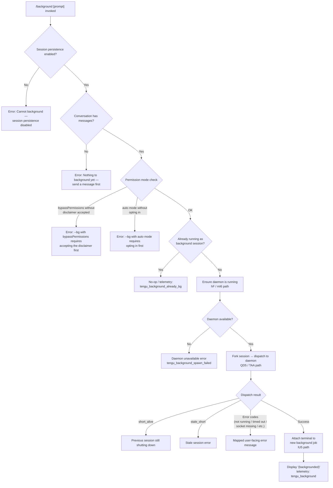

# `/background`

> Analysis basis: CC v2.1.156 bundle.js (AST extraction + Claude interpretation)
> Minimum version: v2.1.156

---

## Overview

The `/background` command (alias: `/bg`) sends the current interactive Claude Code session to the background, freeing the terminal for other use. It accomplishes this by forking the session into the Claude daemon as a new background job, then either detaching immediately or attaching the terminal to the running background session. Subsequent access to that job is available via the daemon's job-management infrastructure.

---

## Registration

| Field | Value |
|---|---|
| type | `local-jsx` |
| name | `background` |
| description | `Send this session to the background and free the terminal` |
| aliases | `["bg"]` |
| argumentHint | `[prompt]` |
| immediate | `null` |
| module_id | `GHK` |
| load_inline | `true` |
| loc_byte | `12769960` |
| loc_byte_end | `12770200` |
| loc_line | `9998` |
| arbor_handler.name | `_w5` |
| arbor_handler.fqn | `claude-2.1.156::_w5` |
| arbor_handler.kind | `AsyncFunction` |
| arbor_handler.resolution_path | `module_id` |
| arbor_handler.n_hits | `0` |

Analysis basis: CC v2.1.156 bundle.js:+12769960

---

## Input Branching

The command has 4+ distinct branches based on pre-flight guard checks and execution paths.



Analysis basis: CC v2.1.156 bundle.js:+12769301, +12769382, +12769558, +12762796, +12762958, +12766271, +12750029

---

## Behavioral Spec

### Top-level Handler (`_w5`)

The Arbor-resolved handler is the `AsyncFunction` identified as `_w5` (fqn: `claude-2.1.156::_w5`), reached via `module_id` resolution.

```
async function backgroundCommandHandler(args, appState):
    // Pre-flight: session persistence
    if not sessionPersistenceEnabled(appState):
        return renderError("Cannot background — session persistence is disabled…")
    // Pre-flight: conversation must have messages
    if conversationIsEmpty(appState):
        return renderError("Nothing to background yet — send a message first.")
    // Permission mode guards (see below)
    checkPermissionModeGuards(appState)
    // Already a background session?
    if isAlreadyBackgroundSession(appState):
        emit telemetry("tengu_background_already_bg")
        return /* no-op */
    // Ensure daemon, fork, attach
    daemon = await ensureDaemonRunning(appState)       // hF / mI6
    jobId  = await forkAndDispatch(args, appState)     // QD5 / TAA
    await attachTerminalToJob(jobId, appState)         // lU5
    emit telemetry("tengu_background")
    renderUI("(backgrounded)")
```

Analysis basis: CC v2.1.156 bundle.js:+12769301, +12769349, +12769519, +12769628

---

### Permission-Mode Pre-Flight Guards (`tD5`)

Before dispatching, two CLI-flag conditions are checked:

```
function checkPermissionModeGuards(appState):
    args = getProcessArgs()
    // Guard 1: dangerously-skip-permissions without prior interactive acceptance
    if args contains "--permission-mode bypassPermissions"
       or args contains "--dangerously-skip-permissions"
       or args contains "--allow-dangerously-skip-permissions":
        if not disclaimerAccepted(appState):
            throw "--bg with bypassPermissions requires accepting the disclaimer first. " +
                  "Run `claude --dangerously-skip-permissions` once interactively."
    // Guard 2: auto permission mode without prior opt-in
    if currentPermissionMode(appState) == "auto":
        if not autoModeOptedIn(appState):
            throw "--bg with auto mode requires opting in first. " +
                  "Run `claude --permission-mode auto` once interactively."
```

Analysis basis: CC v2.1.156 bundle.js:+12762553, +12762796, +12762938, +12762958

---

### Daemon Ensure-Running (`hF` / `mI6`)

Before a session can be forked, the local daemon must be reachable. This sub-system performs a multi-step probe-and-spawn sequence.

```
async function ensureDaemonRunning(appState):
    status = probeDaemon()                     // checks socket reachability
    if status == "up":
        return daemonHandle
    // Stale service binary?
    if daemonExecPathIsStale():
        emit telemetry("tengu_bg_daemon_service_stale_exec")
        warn("daemon service exec path is stale — falling back to transient spawn")
    platform = detectPlatform()               // "macos" | "linux"
    if daemonServiceInstalled():
        if not daemonReachable():
            emit telemetry("tengu_bg_daemon_service_poll_fallthrough")
    else:
        // Ask user to install as a persistent service
        response = promptUser("Install as a service now? [y/N/never, or 'once' just for now] ")
        emit telemetry("tengu_bg_daemon_cold_start_ask")
        recordAnswer(response)                // tengu_bg_daemon_cold_start_ask_answer
        if response in ["yes", "once"]:
            installDaemonService()
            emit telemetry("tengu_bg_daemon_install")
            waitUpTo(5000ms)                  // 5 s probe window
            if not reachable after 5 s:
                warn("service installed but daemon did not become reachable within 5s")
        elif response == "never":
            // Fall through to transient spawn
            pass
    if still not reachable:
        // Transient spawn path
        spawnTransient(args: ["run", "--origin", "transient", "--spawned-by", ...])
        waitUpTo(30000ms, then 60000ms)
        if unreachable:
            emit telemetry("tengu_bg_daemon_spawn_failed")
            throw "No background daemon is running. Run 'claude daemon install'…"
```

Analysis basis: CC v2.1.156 bundle.js:+12706035, +12706083, +12706098, +12706216, +12706462, +12707063, +12707186, +12713187, +12713718, +12707786, +12707808

---

### Session Fork and Dispatch (`tl` / `QD5` / `TAA`)

Once the daemon is up, the current session is forked and dispatched as a background job.

```
async function forkAndDispatch(args, appState):
    jobId = generateUUID()                     // zHK.randomUUID
    tmpDir = path.join(jobsDir, "tmp")         // LqH.mkdir
    // Build child argv from current process argv
    // Propagate: --agent, --name / -n, --resume / -r, --fork-session,
    //            --session-id, -c / --continue, --allowed-tools,
    //            --disallowed-tools, --model, --effort, --add-dir,
    //            --reply-on-resume, environment variables:
    //            CLAUDE_CONFIG_DIR, CLAUDE_INTERNAL_FC_OVERRIDES,
    //            AWS_REGION, AWS_DEFAULT_REGION, AWS_PROFILE,
    //            GOOGLE_APPLICATION_CREDENTIALS, GOOGLE_CLOUD_PROJECT,
    //            GCLOUD_PROJECT
    childArgv = buildChildArgv(appState)

    // Write dispatch file (atomic write via gO)
    dispatchFile = writeDispatchFile(jobId, childArgv, tmpDir)

    // Connect to daemon control socket (bO / CV8)
    socket = await connectControlSocket(daemonSocketPath)
    await sendDispatch(socket, {type: "cli-bg-dispatch", jobId, dispatchFile})

    // Await acknowledgement with 6000 ms timeout
    ack = await Promise.race([
        awaitAck(socket),
        timeout(6000)              // "no ack" error
    ])

    // Interpret ack code
    if ack.code == "EALIVE":
        return jobId               // success
    elif ack.code == "ESTALE":
        throw staleSessionError()
    elif ack.code == "ESTARTING":
        throw serviceStartingError()
    // Additional error codes: daemon-unreachable, ack-timeout,
    //   dispatch-write, enoconn, estarting, stale-short,
    //   short-alive, respawn
    emit telemetry("tengu_bg_dispatch")
    return jobId
```

Analysis basis: CC v2.1.156 bundle.js:+12745677, +12745737, +12745747, +12741381, +12741466, +12741622, +12741724, +12741854, +12742277, +12742373, +12743235

---

### Spare-Worker Pool (`P5A`)

The daemon maintains a pool of pre-warmed ("spare") background workers to accelerate job startup.

```
async function spawnSpareWorker(daemonState):
    emit telemetry("tengu_bg_spare_spawn")
    // Generate unique socket path via randomBytes
    socketPath = generateSpareSocketPath()      // XEK.randomBytes
    // Spawn child process: Bun.spawn with --bg-pty-host, --bg-spare flags
    // PTY dimensions: 200 cols × 50 rows (literals at +15458328, +15458334)
    proc = Bun.spawn([claudeBin, "--bg-pty-host", "200", "50", "--bg-spare", ...], {
        stdio: "ignore",
        env: inheritedEnv
    })
    proc.unref()                               // non-blocking
    trackSpawnTime(Date.now())
    // Monitor for SIGTERM / SIGKILL
    // On low memory: emit tengu_bg_dispatch_low_mem
    // On SIGKILL escalation: emit tengu_bg_dispatch_sigkill_escalate
```

Maximum SIGKILL escalation wait: 30 seconds (literal at +15478820), fallback after 15 seconds (literal at +15478831).

Analysis basis: CC v2.1.156 bundle.js:+15458053, +15458094, +15458153, +15458292, +15458451, +15478820, +15478831, +15478865

---

### Terminal Attach (`lU5`)

After a successful dispatch, the CLI attaches the current terminal to the newly spawned background job's PTY.

```
async function attachTerminalToJob(jobId, appState):
    emit telemetry("tengu_bg_attach")
    phase = getJobPhase(jobId)
    // Wait for job to leave "starting" / "resuming" / "adopted" states
    // Display: "Session is starting — it will appear once ready. Ctrl+Z to detach"
    // If stall detected (tengu_bg_attach_stall_ms):
    //   If gave up: tengu_bg_attach_stall_gave_up
    //   If respawned: tengu_bg_attach_stall_respawn
    //     Display: "Session not responding — restarting it…"

    // Wire PTY streams: attach stdin/stdout to job PTY socket
    // Handle resize events: X.resize / X.resizeForRepaint
    // Handle kick (session stolen): EKICKED display
    // Handle done / killed / stopped states
    // Away-summary generation on resume: tengu_away_summary_generate path (k / Q58)
    awaitJobSettled(jobId)
```

Stall detection timeout steps: 6 retries × 500 ms intervals (literals at +15471039, +15471117).

Analysis basis: CC v2.1.156 bundle.js:+15470924, +15471407, +15471424, +15471441, +15471467, +15471540, +15471841, +15472110, +15472155, +15473167

---

### Dispatch Result Error Mapping (`cD5` / `SHH`)

```
function mapDispatchResultToUserMessage(code):
    switch code:
        "not running"         -> "Daemon not running"
        "timed out"           -> "Timed out waiting for daemon"
        "couldn't write dispatch file" -> "Could not write dispatch file"
        "socket missing"      -> "Socket missing"
        "service still starting" -> "Service still starting"
        "id collision with a prior job" -> "ID collision with a prior job"
        "short_alive"         -> "Previous session is still shutting down — try again in a moment"
        "stale_short"         -> "Stale session (short-lived process)"
        "daemon_unavailable"  -> tengu_bg_dispatch_fallback path
        default               -> raw code string
```

Analysis basis: CC v2.1.156 bundle.js:+12750029, +12750107, +12750172, +12750189, +12750244, +12752380, +12752418, +12752457, +12752508, +12752547, +12752596

---

## State & Side Effects

| Item | Detail |
|---|---|
| Telemetry: core dispatch | `tengu_background` (success), `tengu_background_spawn_failed` (failure), `tengu_background_already_bg` (no-op) |
| Telemetry: daemon lifecycle | `tengu_bg_daemon_cold_start_ask`, `tengu_bg_daemon_cold_start_ask_answer`, `tengu_bg_daemon_install`, `tengu_bg_daemon_service_stale_exec`, `tengu_bg_daemon_service_poll_fallthrough`, `tengu_bg_daemon_spawn_failed` |
| Telemetry: dispatch protocol | `tengu_bg_dispatch`, `tengu_bg_dispatch_fallback`, `tengu_bg_dispatch_rescued`, `tengu_bg_dispatch_sigkill_escalate`, `tengu_bg_dispatch_low_mem`, `tengu_bg_dispatch_stale_drop` |
| Telemetry: spare pool | `tengu_bg_spare_spawn`, `tengu_bg_spare_enable`, `tengu_bg_spare_claim`, `tengu_bg_spare_claim_fail`, `tengu_bg_spare_refill` (literal) |
| Telemetry: attach | `tengu_bg_attach`, `tengu_bg_attach_stall_ms`, `tengu_bg_attach_stall_gave_up`, `tengu_bg_attach_stall_respawn`, `tengu_bg_attach_kick`, `tengu_bg_attach_legacy_autorespawn` |
| Telemetry: daemon control | `tengu_daemon_config_reload`, `tengu_daemon_control`, `tengu_daemon_idle_exit`, `tengu_bg_low_mem_mb`, `tengu_bg_proto_mismatch` |
| Filesystem side effects | Writes dispatch file in `<jobs-dir>/tmp`; creates job directory; deletes tmp file after dispatch; reads/writes `daemon.status.json` |
| Socket connections | Opens Unix control socket to daemon; sends `cli-bg-dispatch` message; attaches PTY over socket |
| Process spawn | May spawn a transient daemon process with `--origin transient --spawned-by <pid>` |
| Spare pool spawn | Pre-warmed workers spawned via `Bun.spawn` with `--bg-pty-host 200 50 --bg-spare` |
| appState changes | Session is marked as backgrounded; terminal is attached to remote PTY; UI renders `(backgrounded)` |
| Hook registration | `_9` / `f$A.register` path — registers daemon service hook |
| Sound | None detected |
| Flush timeout | 2000 ms flush timeout before backgrounding (literal `"flush timeout"` at +12765597) |
| Background session display timeout | 120 seconds maximum attach wait (literal at +12766790) |

---

## Version History

| Version | Change |
|---|---|
| v2.1.156 | Initial analysis |

---

## Common Mistakes

1. **Running `/background` before sending any message** — the command requires at least one message in the conversation; otherwise it exits with "Nothing to background yet — send a message first." Always start a task before trying to background it.

2. **Using `--dangerously-skip-permissions` without prior interactive acceptance** — the command will refuse to background with bypass-permissions mode active unless the user has already accepted the disclaimer by running `claude --dangerously-skip-permissions` once in an interactive session.

3. **Using `--permission-mode auto` without prior opt-in** — same gate applies: the user must have run `claude --permission-mode auto` interactively at least once before `/background` will accept it.

4. **No daemon installed and answering "never" to the install prompt** — if the daemon cannot be started (no service, no transient spawn), the command will fail. Run `claude daemon install` to set up a persistent background service.

5. **Retrying immediately after a `short_alive` error** — the error "Previous session is still shutting down" means a prior background job is in mid-teardown. Wait a moment before retrying.

6. **Expecting the command to work when session persistence is disabled** — if the CLI was launched with persistence disabled, `/background` is a hard no-op with an error; there is no workaround without restarting Claude Code with persistence enabled.

---

## Appendix — Identifier Mapping

> For bundle debugging only. Identifiers change across versions.

| Identifier | Role |
|---|---|
| `_w5` | Top-level background command async handler (Arbor-resolved) |
| `Yy8` | Background command UI/render wrapper (local-jsx component) |
| `Dy8` | Sub-component rendering backgrounded state / argument rendering |
| `tl` | Session fork initializer — generates job ID, sets up tmp dir, builds child argv |
| `tD5` | Permission-mode pre-flight guard checker |
| `QD5` | Core dispatch orchestrator — builds dispatch payload, connects socket, handles result codes |
| `TAA` | Daemon dispatch transport — writes dispatch file, sends via control socket, awaits ack |
| `hF` | Daemon ensure-running top-level function |
| `mI6` | Daemon cold-start interactive installer / service prompt |
| `lU5` | Terminal attach-to-background-job handler |
| `P5A` | Spare worker pool manager — spawns pre-warmed background processes |
| `cD5` | Dispatch error result mapper |
| `SHH` / `SKH` | Status/error code display helpers |
| `bo1` | Daemon status file writer (`daemon.status.json`) |
| `MI6` | Status file path builder (`Co1.join` + `l8`) |
| `bO` | Control socket connect + request writer |
| `CV8` | Control socket listener / event handler |
| `XRH` | Dispatch file path builder (`N$.join` + `JRH`) |
| `LHK` | Dispatch timeout / ack-wait loop |
| `WAA` | Dispatch file content serializer / log sanitizer |
| `gD5` | Platform shell builder (cmd.exe / /bin/sh detection) |
| `PB6` | Windows shell detection helper |
| `el` | Argument filter helper |
| `jHK` | Resume flag argument parser (`--resume=`, `-r=`, `--resume`, `-r`) |
| `Hw5` | Allowed-tools argument parser |
| `aD5` | Session-ID argument parser (`--session-id=`, `--session-id`) |
| `JHK` | Flag-set membership checker |
| `qHK` | Argv formatter (joins with `", "`) |
| `sD5` | Prompt-flag argument slicer |
| `a9` | Job state file reader (reads job order/state, uses `CYH` cache) |
| `Af` | Job state file writer (atomic via `gO`) |
| `gO` | Atomic file writer (randomBytes temp file, rename) |
| `qj` | Job cache invalidator (`CYH.delete`) |
| `D6H` | Working-directory/active-state resolver |
| `v4` | Path normalizer / redactor (`[REDACTED]` sentinel) |
| `b6` | Config file watcher + reader |
| `bzH` | Config file loader (reads, parses, backs up config files) |
| `Y17` | Config file watcher registration (`B88.watchFile`) |
| `Np` | Settings merger (userSettings / localSettings / flagSettings / policySettings) |
| `h8` | Settings access wrapper |
| `nL` | Flush-with-timeout helper (`Promise.race` + `setTimeout` 2000 ms) |
| `RT` | Registration hook caller (`U4`) |
| `hAA` | App-state hook registrar |
| `_9` | Service/hook register (`f$A.register`) |
| `sM` | Session values collector (`Array.from(K.values(...))`) |
| `av` | Session array initializer (index 0 literal) |
| `E6` | Background session spawner / event emitter |
| `D` | Daemon worker supervisor loop |
| `w` | Worker process manager (kill, spawn, memory check) |
| `X` | PTY stream multiplexer |
| `lU5` | (see above — PTY attach) |
| `xf` | PTY stream end/flush helper |
| `vS6` | PTY write helper |
| `EEK` | PTY timeout/backpressure manager |
| `dU5` | PTY stall detector (`Math.max`) |
| `cU5` | PTY lifecycle coordinator (phase check, kill, cleanup) |
| `hH` | Error formatter / logger |
| `F_` | Error string converter |
| `q1` | Error chain walker |
| `zEA` | Error message extractor |
| `D84` | Log ring-buffer manager |
| `k` | Away-summary scheduler |
| `Q58` | Away-summary generator |
| `oG1` | UUID generator for away-summary |
| `HH` | Voice/input event handler (session-level) |
| `Z86` | Session rename / name-generation subsystem |
| `ZA5` | Session rename dispatcher |
| `dy` | Full session fork for rename |
| `n_K` | Main agent query loop |
| `aRH` | Agent response handler |
| `Vc_` | Tool result assembler |
| `kP` | API client builder |
| `vT8` | Tool schema builder |
| `jT` | Message normalizer |
| `M` | MCP server manager |
| `vSH` | MCP connection establisher |
| `JGK` | MCP connection result applier |
| `Gm5` | MCP client reconciler |
| `P` | SDK/dynamic MCP repaint trigger |
| `B` | MCP tool permission checker |
| `pH` | MCP tool filter |
| `cH` | Orphaned-permission tracker |
| `l` | Session filter / history trimmer |
| `u0` | Agent turn executor |
| `K08` | App-state setter for agent turns |
| `au` | Subagent exit handler |
| `C7H` | Tool-use filter / dedup |
| `Z8` | Request ID generator |
| `ZA5` | (see above) |
| `i$` | Compact-boundary marker |
| `FZ8` | Compact boundary set accessor (`Wj`) |
| `xYH` | Config + job persistence coordinator |
| `V3` / `qF` / `k6` | UI state readers / React-style store accessors |
| `v2H` | Environment/mode detector (`production`/`test`) |
| `m5H` | Daemon worker self-identification (Mo6, Av1, Ds) |
| `V9` | Daemon-worker mode initializer |
| `Ds` | Daemon-worker detach-request writer (`Ys.write`) |
| `Av1` | Daemon-worker task/PTY host initializer |
| `Mo6` | Daemon-worker mode flag |
| `GS` | Background-session UI label renderer |
| `mX6` | Background UI metadata accessor |
| `lNH` | Background session list renderer |
| `T96` | Reply-on-resume flag accessor |
| `Yg` | Job list fetcher |
| `QO` / `SzH` | Background-service status display |
| `SHH` / `SKH` | Status/error display helpers |
| `bM` / `J8` | JSON serializer helpers |
| `ZH` | String coercion utility |
| `RH` | JSON stringify wrapper |
| `N` | Log / error reporter |
| `m6` | JSON parse wrapper |
| `P8` | Logger (J8-based) |
| `C6` / `YB6` / `$_` | Store accessor chain |
| `ov` | Base store getter |

---

Note: index built via Arbor fallback; some signals (telemetry, literals) may be missing — see arbor-fallback.js.