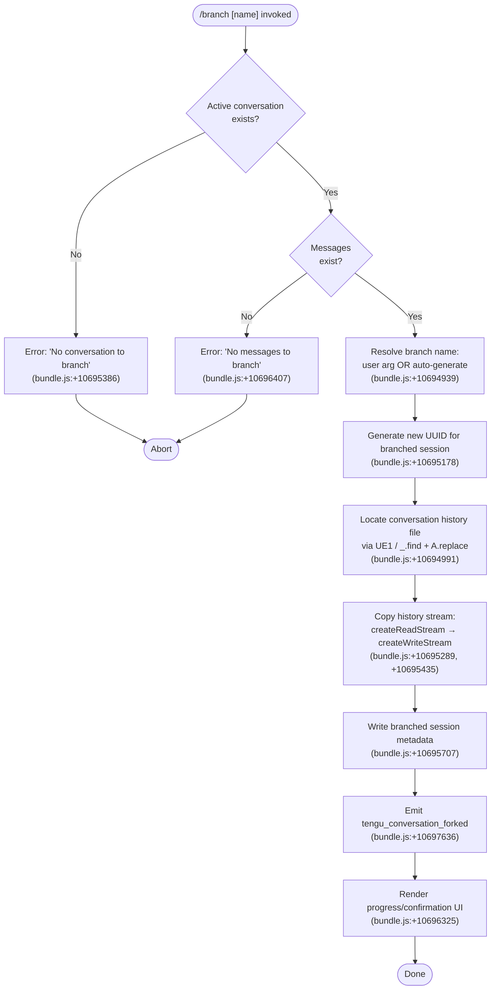

# `/branch`

> Analysis basis: CC v2.1.156 bundle.js (AST extraction + Claude interpretation)
> Minimum version: v2.1.156

---

## Overview

The `/branch` command (also accessible as `/fork`) creates a divergent copy of the current conversation up to the invocation point, optionally labeling it with a user-supplied name. It copies the conversation history file into a new session, wires up the branched session's metadata, and emits a telemetry event confirming the fork. The command is of type `local-jsx`, meaning it renders UI feedback inline via JSX rather than dispatching a prompt to the model.

---

## Registration

| Field | Value |
|---|---|
| type | `local-jsx` |
| name | `branch` |
| description | `Create a branch of the current conversation at this point` |
| argumentHint | `[name]` |
| aliases | `["fork"]` |
| module_id | `vr_` |
| load_inline | `true` |
| loc_byte | `12192382` |
| loc_byte_end | `12192576` |
| loc_line | `9093` |
| arbor_handler.name | `qlL` |
| arbor_handler.fqn | `claude-2.1.156::qlL` |
| arbor_handler.kind | `AsyncFunction` |
| arbor_handler.resolution_path | `module_id` |
| arbor_handler.n_hits | `0` |

Analysis basis: CC v2.1.156 bundle.js:+12192382

---

## Input Branching

Four distinct execution paths exist based on precondition checks and input state, so a Mermaid flowchart is used.



---

## Behavioral Spec

### Top-level handler: `qlL` (AsyncFunction)

The Arbor symbol graph resolves the handler as `qlL` (FQN: `claude-2.1.156::qlL`, via `module_id` resolution path). It delegates immediately to `FE1`, the main branching orchestrator.

Analysis basis: CC v2.1.156 bundle.js:+10698421

```
async function branchCommandHandler(args, appContext):
    return await branchOrchestrator(args, appContext)
```

---

### Branch Orchestrator (`FE1`)

`FE1` is the primary function implementing the branch/fork flow.

Analysis basis: CC v2.1.156 bundle.js:+10697332

```
async function branchOrchestrator(args, appContext):

    // 1. Resolve a display name for the branch
    branchTitle = args.name OR "Branched conversation"   // literal: bundle.js:+10694939
    messageType = "text"                                  // literal: bundle.js:+10695012

    // 2. Locate the current conversation history file
    historyEntry = findHistoryEntry(appContext.messages)  // UE1 → _.find (bundle.js:+10694991)
    historyPath  = normalizeHistoryPath(historyEntry)     // A.replace (bundle.js:+10695069)

    // 3. Guard: no active conversation
    if historyPath is absent:
        throw Error("No conversation to branch")          // literal: bundle.js:+10695386

    // 4. Guard: no messages to copy
    messageList = collectMessages(appContext)              // FE1 → $.find (bundle.js:+10697503)
    if messageList is empty:
        showError("No messages to branch")                // literal: bundle.js:+10696407
        return

    // 5. Generate new session identity
    newSessionId  = crypto.randomUUID()                   // BE1 → uE1.randomUUID (bundle.js:+10695178)
    conversationPaths = buildConversationPaths(newSessionId) // k6, vO, $_ (bundle.js:+10695197–10695207)

    // 6. Create destination directory
    fs.mkdirSync(conversationPaths.dir, { recursive: true }) // TE8.mkdir (bundle.js:+10695240)

    // 7. Copy history stream (448-byte read buffer)
    readStream  = fs.createReadStream(historyPath,
                      { highWaterMark: 448 })             // literal: bundle.js:+10695271
                      // encoding: "utf8"                 // literal: bundle.js:+10695322
    writeStream = fs.createWriteStream(conversationPaths.historyFile)
                                                          // bundle.js:+10695435

    // Wait for stream "open" event before piping
    await once(readStream, "open")                        // Vr_.once, literal "open": bundle.js:+10695337,+10695348

    // 8. Parse and process each JSONL line in parallel (up to 100 concurrency)
    lineReader  = readline.createInterface(readStream)    // mE1.createInterface (bundle.js:+10695529)
    outputLines = await processLines(lineReader,
                      concurrency: 100)                   // literal: bundle.js:+10695106

    // 9. Write filtered/transformed content to destination
    writeStream.write(serializedLines)                    // O.write (bundle.js:+10695718)

    // Content-replacement marker applied to output               // literal "content-replacement": bundle.js:+10695866
    // Drain event wired to resume flow                           // literal "drain": bundle.js:+10695746

    // 10. Parse written content for final message list
    parsedContent = JSON.parse(writtenOutput)             // m6 → JSON.parse (bundle.js:+10695833)

    // 11. Accumulate branch message list
    branchMessages.push(parsedContent)                    // j.push (bundle.js:+10695906)

    // 12. Register the branched session in session roster
    sessionEntry = buildSessionEntry(
        id:    newSessionId,
        title: branchTitle,
        messages: branchMessages
    )
    registerSession(sessionEntry)                         // VC (bundle.js:+10695945)

    // 13. Close streams and finalize
    writeStream.close()                                   // Y.close (bundle.js:+10696043)
    readStream.destroy()                                  // $.destroy (bundle.js:+10696053)
    await streamFinished(writeStream)                     // pE1.finished (bundle.js:+10696817)

    // 14. Emit telemetry
    emitTelemetry("tengu_conversation_forked")            // bundle.js:+10697636

    // 15. Show progress / confirmation UI
    renderProgress("progress")                            // literal: bundle.js:+10696325

    // 16. Optionally set title on the fork event
    forkLabel = "fork"                                    // literal: bundle.js:+10698157

    return branchedSessionId
```

---

### Name Sanitisation (`UE1`)

Responsible for locating the matching history record and normalising the file path.

Analysis basis: CC v2.1.156 bundle.js:+10694991

```
function findAndNormaliseHistoryPath(messages):
    entry = messages.find(predicate)           // _.find (bundle.js:+10694991)
    path  = entry.path.replace(pattern, sub)  // A.replace (bundle.js:+10695069)
    return path
```

---

### Conversation File Copy (`BE1`)

Handles the low-level async stream copy with line-by-line parsing.

Analysis basis: CC v2.1.156 bundle.js:+10695178

```
async function copyConversationFile(sourcePath, destPath, options):
    // Random UUID for new session
    newId = crypto.randomUUID()                       // uE1.randomUUID

    // Build path objects
    paths = buildPaths(newId)                         // k6, vO, $_

    // Ensure directory exists
    await fs.mkdir(paths.dir, { recursive: true })    // TE8.mkdir

    // Open read stream with 448-byte buffer           // literal: +10695271
    rs = fs.createReadStream(sourcePath,
            { highWaterMark: 448,
              encoding: "utf8" })                     // literals: +10695271, +10695322

    await once(rs, "open")                            // Vr_.once, "open": +10695348

    // On stream error: throw "No conversation to branch"
    rs.on("error", () => throw new Error(...))        // bundle.js:+10695380

    ws = fs.createWriteStream(destPath)               // GE8.createWriteStream

    // Parse output lines with m6 (JSON.parse wrapper)
    lines = processLinesByInterface(rs)               // mE1.createInterface

    // Write transformed lines (content-replacement mode)
    ws.write(lines)

    // Parallel delay jitter for line emission         // H.map, Math.random, setTimeout
    await scatterWrite(lines, concurrency: 100)

    ws.end()
    await streamFinished(ws)                          // pE1.finished
    return newId
```

---

### Session Registration and Roster Update (`FE1` orchestration via `AlL`, `dh`, `b5H`)

After copying, the branch is wired into the session roster with its new title and fork metadata.

Analysis basis: CC v2.1.156 bundle.js:+10697572, +10697603, +10697621

```
function registerBranchedSession(sessionId, title, messages, appContext):

    // Sanitise session title
    safeTitle = sanitiseTitle(title)                   // AlL → IS → H.replace (bundle.js:+10697110)

    // Deduplicate title (integer suffix if collision)
    if titleSet.has(safeTitle):
        safeTitle = safeTitle + parseInt(counter)      // AlL → parseInt (bundle.js:+10697210)
    titleSet.add(safeTitle)                            // K.add (bundle.js:+10697204)

    // Persist the custom title
    saveCustomTitle(sessionId, safeTitle)              // dh → Vv, yfH (bundle.js:+10697603)
    emitSessionRenamed()                               // dh → qy6.emit (bundle.js:+10697636 area)

    // Set agent-name metadata on the forked session
    saveAgentName(sessionId, appContext.agentName)     // b5H → Vv, yfH (bundle.js:+10697621)
    emitAgentNameSet()                                 // b5H → LqA.emit

    // Emit fork telemetry
    emitTelemetry("tengu_conversation_forked", {
        sessionId: sessionId,
        messageCount: messages.length
    })                                                 // bundle.js:+10697636
```

---

### Worktree Detection (`Sl` → `BRH`)

Probes git worktree state to associate the branch with the correct working directory.

Analysis basis: CC v2.1.156 bundle.js:+12898339

```
function detectWorktrees(cwd):
    output = runGit(["worktree", "--porcelain"], cwd)  // literals: +11893157, +11893175
    worktrees = parseWorktreeOutput(output)            // BRH → A.split, $.startsWith
    // Filter entries beginning with "worktree "       // literal: +11893376 (9-char prefix)
    relevant = worktrees.filter(w => w.startsWith("worktree "))
    ranked   = relevant.sort(localeCompare)
    emitTelemetry("tengu_worktree_detection")          // bundle.js:+11893257
    return ranked
```

---

### Error Path: Missing Conversation

Analysis basis: CC v2.1.156 bundle.js:+10695386

```
if not activeConversationFound:
    throw new Error("No conversation to branch")   // literal: +10695386
```

Error code cross-reference: `ENOENT` (bundle.js:+173733) is handled by the stream-error callback inside `BE1`.

---

### Error Path: Empty Message List

Analysis basis: CC v2.1.156 bundle.js:+10696407

```
if branchMessages.length === 0:
    displayError("No messages to branch")          // literal: +10696407
    return early
```

---

## State & Side Effects

| Item | Detail |
|---|---|
| Telemetry: `tengu_conversation_forked` | Fired on successful fork; carries session ID and message count (bundle.js:+10697636) |
| Telemetry: `tengu_session_renamed` | Fired when the custom title is persisted on the new branch (bundle.js:+12891925) |
| Telemetry: `tengu_agent_name_set` | Fired when agent-name metadata is written to the branched session (bundle.js:+12894954) |
| Telemetry: `tengu_worktree_detection` | Fired during git worktree probe (bundle.js:+11893257) |
| Telemetry: `tengu_feature_ok` / `tengu_feature_bad` | Generic feature success/failure signals reachable via `yH`/`uH` paths (bundle.js:+965176, +965234) |
| Filesystem: history copy | `fs.createReadStream` → `fs.createWriteStream`; 448-byte high-water mark, UTF-8 encoding; destination directory created with `mkdir` recursive (bundle.js:+10695240, +10695271, +10695322) |
| Filesystem: metadata write | Custom title and agent-name written via `yfH` → `appendFileSync` / `mkdirSync` (bundle.js:+12890880, +12890919) |
| Session roster | New session entry added to the in-memory roster map via `VC` (bundle.js:+10695945) |
| Stream cleanup | Read stream destroyed, write stream closed and awaited via `stream.finished` (bundle.js:+10696043, +10696053, +10696817) |
| UI | `"progress"` render event emitted during copy (bundle.js:+10696325); `"content-replacement"` marker applied to output (bundle.js:+10695866) |
| Sound | <!-- TODO: not found in depth-2 traversal; needs --depth 4 --> |
| appState changes | New session ID stored via `w.set` (bundle.js:+10695991); previous session lookup via `w.get` (bundle.js:+10696114) |
| Hook registration | <!-- TODO: not found in depth-2 traversal; needs --depth 4 --> |

---

## Version History

| Version | Change |
|---|---|
| v2.1.156 | Initial analysis |

---

## Common Mistakes

1. **Invoking `/branch` before any messages exist** — the command aborts with "No messages to branch" (bundle.js:+10696407). Ensure at least one exchange has occurred before branching.
2. **Invoking `/branch` with no active conversation context** — triggers "No conversation to branch" (bundle.js:+10695386). The command requires an open conversation history file on disk.
3. **Expecting the branch to inherit live tool permissions** — the branch copies the serialised message history only; active permission grants and MCP connections are not transferred to the new session.
4. **Using `/branch` and `/fork` interchangeably in scripts** — both map to the same handler, so they are fully equivalent. Prefer `/branch` for clarity in documentation.
5. **Supplying a name that collides with an existing session title** — the command appends an integer suffix automatically (bundle.js:+10697210), which may produce unexpected names; supply a unique name explicitly via the `[name]` argument to avoid this.

---

## Appendix — Identifier Mapping

> For bundle debugging only. Identifiers change across versions.

| Identifier | Role |
|---|---|
| `qlL` | Top-level async handler for `/branch`; resolved by Arbor via `module_id` |
| `FE1` | Main branching orchestrator; drives the full fork workflow |
| `BE1` | Low-level stream copy function; handles read/write streams and line parsing |
| `UE1` | History-path finder; uses `_.find` + `A.replace` to locate conversation file |
| `AlL` | Title sanitisation and deduplication logic |
| `Sl` | Git worktree enumeration and sorting |
| `BRH` | Git `worktree --porcelain` output parser |
| `u6K` | File-completion / path resolver used during worktree and directory walks |
| `dh` | Custom-title persistence; calls `yfH` and emits `qy6` rename event |
| `b5H` | Agent-name persistence; calls `yfH` and emits `LqA` name-set event |
| `yfH` | Low-level append-file writer with `mkdirSync` fallback |
| `Vv` | Path builder for conversation store directories |
| `rf` | Auxiliary path constructor using `WS`, `vO`, `$_` |
| `k6` | Core path-segment utility |
| `vO` | Secondary path-segment utility |
| `$_` | Tertiary path-segment / join utility |
| `ov` | Base directory resolver |
| `WS` | Working-directory resolver used by `rf` |
| `VC` | Session roster registration function |
| `K9` | String slice utility (indexOf + slice) |
| `IS` | Title character-replacement sanitiser |
| `m6` | Safe JSON-parse wrapper |
| `P8` | Promise error-code classifier |
| `J8` | Promise/callback adapter |
| `hH` | Structured error builder and logger |
| `F_` | Error type factory (wraps native Error + String) |
| `xH` | String coercion helper |
| `q1` | Telemetry queue processor |
| `zEA` | Telemetry batch emitter |
| `D84` | Telemetry ring-buffer manager (shift/push) |
| `RH` | JSON.stringify wrapper |
| `ZH` | String coercion wrapper |
| `bM` | Callback-to-promise bridge |
| `OL` | Output-line formatter used by `W.push` |
| `lU5` | PTY/daemon attach loop (reached transitively; not directly invoked by `/branch`) |
| `N5A` | Daemon session lifecycle manager (reached transitively) |
| `W5A` | Background-session claim/spawn controller (reached transitively) |
| `E6` | Memory-pressure sampler |
| `eI8` | macOS free-memory probe |
| `FD6` | Pinned-file manifest reader |
| `yX7` | Directory walker for pinned content |
| `mK` | Conversation-store path joiner |
| `a9` | Session-state file reader with caching |
| `Lj` | Session activity tracker |
| `Af` | Git-object path builder |
| `Q66` | Background task scheduler with date-stamp |
| `d5H` | Session path joiner using `N$` |
| `lh` | Session log-file path resolver |
| `OF` | Session roster-entry builder |
| `PN6` | Session metadata writer |
| `L9A` | Conversation directory initialiser |
| `mU5` | Send-claim timeout manager |
| `uU5` | Claim-frame builder |
| `P5A` | Background PTY process spawner |
| `V3` | Session-type resolver |
| `U4` | Module-export loader |
| `_9` | Module registry registrar |
| `PCH` | Buffer allocation and chunk assembler |
| `_3` | Message-role classifier |
| `gh8` | Voice-stream connector (reached transitively) |
| `vSH` | MCP tool-list builder |
| `JGK` | MCP connection-result applier |
| `Gm5` | MCP server reconciliation loop |
| `QO` | Background-service selector |
| `SzH` | Background-service state checker |
| `lX_` | Pins-file path builder |
| `HH` | Voice-session input handler (reached transitively) |
| `k` | Away-summary scheduler (reached transitively) |
| `Q58` | CacheSafeParams-gated away-summary invoker |
| `oG1` | Random UUID generator for messages |
| `VW8` | App-state snapshot reader |
| `aC5` | Away-summary metrics collector |
| `zJK` | Away-summary retry gate |
| `B6` | Log-file base-path resolver |
| `ZQ` | Conversation-file metadata read/write manager |
| `kM6` | JSONL file reader/writer with locking |