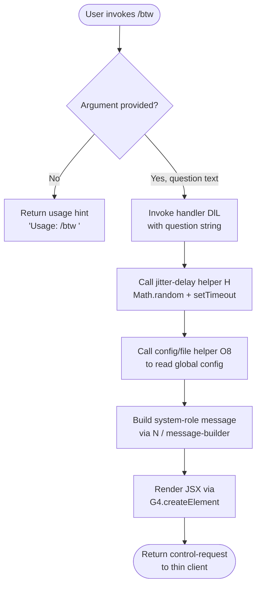

# `/btw`

> Analysis basis: CC v2.1.156 bundle.js (AST extraction + Claude interpretation)
> Minimum version: v2.1.156

---

## Overview

`/btw` ("by the way") lets the user ask a quick side question and have it handled immediately without displacing or interrupting the main conversation thread. It dispatches a `control-request` to the thin-client layer so the side question is processed out-of-band, and it renders its result inline via a JSX component. The command accepts a single free-text argument (`<question>`) and returns immediately upon invocation (`immediate: true`).

---

## Registration

| Field | Value |
|---|---|
| type | `local-jsx` |
| name | `btw` |
| description | Ask a quick side question without interrupting the main conversation |
| argumentHint | `<question>` |
| immediate | `true` |
| thinClientDispatch | `control-request` |
| module_id | `dE1` |
| load_inline | `true` |
| loc_byte | `10704217` |
| loc_byte_end | `10704456` |
| loc_line | `7589` |
| arbor_handler.name | `DlL` |
| arbor_handler.fqn | `claude-2.1.156::DlL` |
| arbor_handler.kind | `AsyncFunction` |
| arbor_handler.resolution_path | `module_id` |
| arbor_handler.n_hits | `0` |

Analysis basis: CC v2.1.156 bundle.js:+10704217

---

## Input Branching

The handler has three distinct paths: no argument supplied (usage hint), a valid question argument (dispatches control-request), and a JSX render phase (component tree construction). A Mermaid flowchart is used.



Analysis basis: CC v2.1.156 bundle.js:+10703812, +10703814, +10703853, +10703922

---

## Behavioral Spec

### 1. Argument Validation

When the command is invoked without any argument text, the handler short-circuits and surfaces a usage string to the user.

```
function handleBtw(args):
    if args.question is empty:
        return usageHint  // "Usage: /btw <your question>"
    else:
        proceed to dispatch(args.question)
```

Usage string constant: `"Usage: /btw <your question>"` (bundle.js:+10703814)

---

### 2. Jitter-Delay Helper (jitterDelay)

Before dispatching the side question, the handler calls a small utility (identifier `H`) that introduces a randomised delay. This prevents thundering-herd behaviour when multiple `/btw` invocations or background sessions fire simultaneously.

```
async function jitterDelay():
    base   = 1          // constant (bundle.js:+13408475)
    spread = 2          // constant (bundle.js:+13408459)
    delay  = base + Math.random() * spread   // fractional seconds
    await setTimeout(delay * 1000)
```

Analysis basis: CC v2.1.156 bundle.js:+13408461, +13408498

---

### 3. Global Config Access (configReader / O8)

After the delay, handler `DlL` calls `O8` (configReader), which in turn calls the file-based config subsystem (`hz_`). This reads the global `~/.claude.json` config under a file-system lock, handles ENOENT gracefully, and returns the parsed config object.

```
async function configReader(context):
    rg   = resolvePaths(context)       // rG
    hint = getSessionHint(context)     // H
    meta = buildMetadata()             // jQH / pBq
    cfg  = await readGlobalConfig()    // bzH -> hz_
    if cfg is null or missing:
        return defaultConfig
    return cfg
```

The underlying `hz_` (globalConfigReadWrite) path performs:

```
function globalConfigReadWrite(options):
    dir = fD.dirname(configPath)
    L.mkdirSync(dir, {recursive: true})
    lockToken = acquireLock()          // B6
    try:
        timestamp = Date.now()
        data = readAndMergeConfig()    // o$q -> k1_
        msg  = buildSystemMessage(data)  // N
        writeBackup(data)              // bzH
        return data
    finally:
        releaseLock(lockToken)
```

Key literals encountered in this path:
- Lock-contention warning: `"Lock acquisition took longer than expected - another Claude instance may be running"` (bundle.js:+3208125)
- Guard message: `"Config accessed before allowed."` (bundle.js:+3210158)
- Encoding: `"utf-8"` (bundle.js:+3210241)
- Backup directory name: `"backups"` (bundle.js:+3209726)
- ENOENT handled silently (bundle.js:+3208480)
- Auth-loss guard: refuses to overwrite `~/.claude.json` if cached auth would be erased (bundle.js:+3208541)
- Maximum backup retention: 5 copies (bundle.js:+3209144)
- Maximum lock wait: 60 000 ms (bundle.js:+3208895)

Analysis basis: CC v2.1.156 bundle.js:+10703876, +3205150, +3207914

---

### 4. System Message Construction (messageBuilder / N)

Handler `N` (messageBuilder) builds the message that will be sent as the side question. It:
1. Selects message role `"system"` (bundle.js:+10703853).
2. Appends a `"debug"` metadata tag when debug mode is active (bundle.js:+203706).
3. Generates a UUID via `v4` (uuidGenerator) — sensitive fields are replaced with `"[REDACTED]"` in logs (bundle.js:+195831).
4. Serialises the payload via `RH` (jsonStringifier → `JSON.stringify`) (bundle.js:+183160).
5. Enforces retry/backoff limits: max 1000 ms initial wait, 100 ms minimum interval (bundle.js:+203537, +203556).

```
function buildSystemMessage(question, config):
    role    = "system"
    msgId   = uuidGenerator()          // v4
    payload = {role, content: question, id: msgId}
    if debugMode:
        payload.tag = "debug"
    serialised = jsonStringifier(payload)  // RH
    return serialised
```

Analysis basis: CC v2.1.156 bundle.js:+203730, +203748, +203852

---

### 5. JSX Render Phase

The final step in `DlL` calls `G4.createElement` (bundle.js:+10703922) to produce the inline React/JSX component that the `local-jsx` type renderer will mount. The component receives the resolved answer from the control-request response and presents it in the CLI UI without altering the primary conversation scroll buffer.

```
function renderBtwResult(answer):
    return G4.createElement(BtwResultComponent, {answer})
```

Analysis basis: CC v2.1.156 bundle.js:+10703922

---

### 6. Background-Session / Spare-Pool Interaction

The deep call graph reaches the background session manager (`w`, bgSessionManager) which maintains a pool of spare Claude sub-processes. The `/btw` control-request may claim a spare session for fast response.

Key behaviours observed in the call graph:
- Spare sessions are pre-warmed and labelled `"spare"` (bundle.js:+15479635).
- If memory is critically low (`tengu_bg_dispatch_low_mem`), the spare claim is skipped (bundle.js:+15479444).
- SIGKILL escalation fires if a session does not terminate within 30 s (grace) + 15 s (hard) window (bundle.js:+15478820, +15478831, +15478913).
- Session lifecycle events `daemon_bg_session_create` and `dup_retry_exhausted` are logged (bundle.js:+15479175, +15479202).

```
async function claimSpareSession(request):
    if freemem() < LOW_MEM_THRESHOLD:     // k5A.freemem
        emit tengu_bg_dispatch_low_mem
        return null
    session = sparePool.claim()            // A.get / A.set
    if session is null:
        emit tengu_bg_spare_claim_fail
        return spawnNewSession()           // CF.spawn
    emit tengu_bg_spare_claim
    return session
```

Analysis basis: CC v2.1.156 bundle.js:+15479444, +15479500, +15480193, +15480239

---

## State & Side Effects

| Item | Detail |
|---|---|
| Telemetry: `tengu_config_lock_contention` | Fired when the file lock for `~/.claude.json` is held longer than expected (bundle.js:+3208214) |
| Telemetry: `tengu_config_stale_write` | Fired when a stale config write is detected and discarded (bundle.js:+3208350) |
| Telemetry: `tengu_config_parse_error` | Fired when `~/.claude.json` fails JSON parsing (bundle.js:+3210789) |
| Telemetry: `tengu_config_auth_loss_prevented` | Fired when a write is blocked to prevent losing cached auth (bundle.js:+3208693) |
| Telemetry: `tengu_bg_dispatch_sigkill_escalate` | Fired when a background session requires SIGKILL (bundle.js:+15478865) |
| Telemetry: `tengu_bg_dispatch_low_mem` | Fired when spare-session claim is skipped due to low memory (bundle.js:+15479444) |
| Telemetry: `tengu_bg_spare_enable` | Fired when spare-pool warming is enabled (bundle.js:+15480139) |
| Telemetry: `tengu_bg_spare_claim` | Fired on successful spare-session claim (bundle.js:+15480260) |
| Telemetry: `tengu_bg_spare_claim_fail` | Fired when no spare session is available (bundle.js:+15480523) |
| thinClientDispatch | Sends a `control-request` message to the thin-client layer; does not enqueue into the main conversation |
| appState changes | None directly — side-question result is rendered in an isolated JSX component |
| File system | Acquires a temporary write-lock on `~/.claude.json`; creates backup copies under the `backups/` subdirectory; max 5 backups retained |
| Background session pool | May claim or spawn a spare sub-process; spare pool state (`A` Map) is mutated |
| Sound | <!-- TODO: not found in depth-2 traversal; needs --depth 4 --> |

---

## Version History

| Version | Change |
|---|---|
| v2.1.156 | Initial analysis |

---

## Common Mistakes

1. **Omitting the argument** — invoking `/btw` with no text produces only the usage hint `"Usage: /btw <your question>"` and performs no API call. Always supply the question inline, e.g. `/btw what is the default timeout?`.
2. **Expecting a conversation-context reply** — `/btw` dispatches a `control-request` out-of-band. The answer appears as an isolated inline component, not as a new assistant turn in the main thread. Do not rely on the response being visible in conversation history.
3. **Confusing `immediate: true` semantics** — the `immediate` flag means the command fires without waiting for any pending assistant response to complete. If a long-running task is in progress, `/btw` will still execute, but its spare-session claim may fail under low-memory conditions.
4. **Assuming synchronous execution** — the handler is an `AsyncFunction` (Arbor: `arbor_handler.kind = "AsyncFunction"`). Tooling that wraps `/btw` in a synchronous context will miss the resolved JSX output.
5. **Concurrent config writes** — the global-config path uses a file lock. If another Claude instance is running simultaneously, `/btw` may log a lock-contention warning and the `tengu_config_lock_contention` telemetry event will fire; the command will still complete once the lock is released.

---

## Appendix — Identifier Mapping

> For bundle debugging only. Identifiers change across versions.

| Identifier | Role |
|---|---|
| `DlL` | Main async handler for `/btw` (arbor_handler; AsyncFunction resolved via module_id `dE1`) |
| `H` | Jitter-delay helper (Math.random + setTimeout) |
| `O8` | Config reader / context builder (top-level call from DlL) |
| `hz_` | Global config read-write worker (acquires file lock, reads/writes `~/.claude.json`) |
| `_` | Low-level filesystem abstraction (readdirStringSync, statSync, etc.) |
| `B6` | File-lock acquisition utility |
| `L` | Filesystem module wrapper (mkdirSync, statSync, unlinkSync, readdirStringSync) |
| `q` | Secondary filesystem wrapper (readFileSync, mkdirSync, statSync, copyFileSync, unlinkSync) |
| `f` | Promise/stream finaliser (close, finally cleanup) |
| `o$q` | Config merge helper (calls k1_, Object.assign) |
| `k1_` | Config key resolver / normaliser (calls r$q) |
| `N` | System message builder (role assignment, UUID injection, serialisation) |
| `URK` | Message type discriminator (calls mI, pRK, $$A) |
| `RH` | JSON stringifier wrapper (JSON.stringify) |
| `v4` | UUID generator (calls FzA, H.replace, q.at, A.lastIndexOf, A.slice) |
| `HuH` | Header/hint formatter (calls yzA) |
| `gRK` | File write pipeline (digest, buffer sizing, atomic write via temp file) |
| `d` | Debug / diagnostic logger |
| `J8` | Error classifier / re-throw helper |
| `bzH` | Config file read + backup manager (readFileSync, copyFileSync, mkdirSync) |
| `m6` | Safe JSON parser (JSON.parse wrapper) |
| `kb` | String prefix stripper (startsWith + slice) |
| `UBq` | Backup directory scanner (readdirStringSync, startsWith, fD.join) |
| `Sz_` | Backup path builder (fD.join, l8) |
| `w` | Background session manager / spare-pool controller |
| `uz6` | Config cache accessor |
| `A` | Spare-session pool Map (get/set/values) |
| `V` | Version / capability string checker (startsWith) |
| `P` | MCP/SDK connection manager (Vb8, mh, ou, Promise.all, GAH, ld, hH, F_) |
| `Vb8` | SDK transport initialiser |
| `hH` | Connection health checker (F_, xH, q1, D84, Li.logError) |
| `F_` | Error constructor wrapper (Error, String) |
| `E` | Byte-slice / buffer helper (E.slice) |
| `$L6` | Atomic file writer (randomBytes temp name, writeFileSync, fchmodSync, fsyncSync, renameSync) |
| `O` | Symbolic-link / stat wrapper (isSymbolicLink, k8) |
| `P8` | Error categoriser (calls J8) |
| `jQH` | Request metadata builder |
| `pBq` | Request entry enumerator (Object.entries) |
| `JQH` | Timestamp stamper (Date.now) |
| `yz_` | Config path resolver (fD.dirname, B6, K0, RH, $L6) |

---

Note: index built via Arbor fallback; some signals (telemetry, literals) may be missing — see arbor-fallback.js.