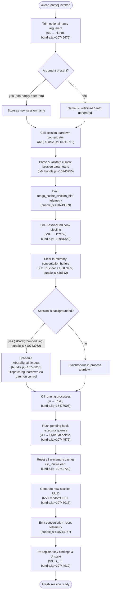

# `/clear`

> Analysis basis: CC v2.1.156 bundle.js (AST extraction + Claude interpretation)
> Minimum version: v2.1.156

---

## Overview

The `/clear` command starts a completely fresh conversation session with an empty context window, discarding all messages in the current in-memory conversation. The previous session's data is preserved on disk and remains resumable via `/resume`. The command is also reachable under the aliases `/reset` and `/new`.

---

## Registration

| Field | Value |
|---|---|
| type | `local` |
| name | `clear` |
| description | `Start a new session with empty context; previous session stays on disk (resumable with /resume)` |
| aliases | `["reset", "new"]` |
| argumentHint | `[name]` |
| supportsNonInteractive | `true` |
| thinClientDispatch | `post-text` |
| module_id | `yV1` |
| load_inline | `true` |
| loc_byte | `10745850` |
| loc_byte_end | `10746141` |
| arbor_handler.name | `alL` |
| arbor_handler.fqn | `claude-2.1.156::alL` |
| arbor_handler.kind | `AsyncFunction` |
| arbor_handler.resolution_path | `module_id` |
| arbor_handler.n_hits | `0` |

Analysis basis: CC v2.1.156 bundle.js:+10745850

---

## Input Branching

The handler accepts an optional `[name]` argument and branches through several distinct state transitions: argument presence/absence, backgrounding detection, and the full session teardown/rebuild pipeline. Five or more distinct control paths exist, so a Mermaid flowchart is used.



---

## Behavioral Spec

### Handler Entry Point (`alL`)

```
async function clearCommandHandler(userInput, appContext):
    rawName = userInput.trim()           // H.trim, bundle.js:+10745676
    name    = rawName if rawName else undefined

    await runSessionTeardownAndRebuild(appContext, name)
```

Analysis basis: CC v2.1.156 bundle.js:+10745676

---

### Session Teardown Orchestrator (`dv6`)

```
async function sessionTeardownAndRebuild(context, newName):
    sessionParams = parseAndValidateSession(context)     // lv6
    emit_telemetry("tengu_cache_eviction_hint")          // bundle.js:+10743859

    await fireSessionEndHooks(context)                   // sSH
    clearConversationBuffers()                           // Xz → lR6.clear + Hu8.clear

    if context.flags["isBackgrounded"]:                  // bundle.js:+10743962
        signal = AbortSignal.timeout(...)                // bundle.js:+10743815
        await backgroundedTeardown(signal, context)      // w, R.kill
    else:
        await inProcessTeardown(context)

    flushHookExecutorQueues()                            // kO
    bulkClearAllCaches()                                 // sr_

    newSessionId = crypto.randomUUID()                   // NV1.randomUUID, bundle.js:+10745016
    emit_telemetry("conversation_reset", newSessionId)   // bundle.js:+10744977

    re_register_ui_and_bindings(context)                 // V3, G_, T
```

Analysis basis: CC v2.1.156 bundle.js:+10743755

---

### Session Parameter Validation (`lv6`)

```
function parseAndValidateSession(context):
    raw     = parseInt(context.token, 10)                // bundle.js:+12990689
    if not Number.isFinite(raw):
        raise validation error
    clamped = Math.max(0, Math.min(raw, 1000))           // bundle.js:+12990876 / +12990907 / +12990920
    applySettings(clamped)                               // MD, sm, YU
    return clamped
```

Analysis basis: CC v2.1.156 bundle.js:+12990689

Numeric limits observed in literals:
- Minimum clamp value: `0` (bundle.js:+10745691)
- Token parse radix: `10` (bundle.js:+12990700)
- Maximum clamp value: `1000` (bundle.js:+12990876)

---

### Session End Hook Pipeline (`sSH` → `dW`)

The hook orchestration layer fires a `SessionEnd` lifecycle event (literal `"SessionEnd"`, bundle.js:+12981349) through the full hook executor (`dW`). The hook executor (`dW`) coordinates:

```
async function fireSessionEndHooks(context):
    hookType = "SessionEnd"                              // bundle.js:+12981349
    buildHookEnvironment(context)                        // D7, Vv, C6
    dispatch_to_executor(hookType, context)              // dW

    // Inside dW (hook executor):
    //   resolveToolEnvironment()                        // xH, zU, N
    //   loadHookDefinitions()                           // hfH → S_, IL
    //   buildCommandContext()                           // SqA
    //   filterHookMatches()                             // O.filter
    //   assignNewConversationId()                       // GCH.randomUUID, bundle.js:+13030408
    //   executeEachHook():                              // Kh8
    //     - spawn process hooks                         // _h8.spawn, bundle.js:+13003082
    //     - run http hooks                              // hP.post, bundle.js:+12973670
    //     - run mcp_tool hooks                          // vqA
    //     - run callback hooks                          // J.callback
    //   collectResults()
    //   emit tengu_run_hook                             // bundle.js:+13030042
```

Analysis basis: CC v2.1.156 bundle.js:+12981322

---

### Conversation Buffer Clear (`Xz`)

```
function clearConversationBuffers():
    lR6.clear()    // primary message store, bundle.js:+26612
    Hu8.clear()    // secondary message/context store, bundle.js:+26624
```

Analysis basis: CC v2.1.156 bundle.js:+26612

---

### Background Session Teardown (`w` / `R`)

When the `isBackgrounded` flag is set (bundle.js:+10743962), the teardown delegates to the daemon control layer:

```
async function backgroundedTeardown(abortSignal, context):
    for process in activeProcesses.values():
        process.kill("SIGKILL")                          // R.kill, bundle.js:+15478906
        await setTimeout(100)                            // bundle.js:+15478937
    dispatch_to_daemon_control(context)                  // W5A → CF.spawn
    emit_telemetry("tengu_daemon_control")               // bundle.js:+15514702
```

Analysis basis: CC v2.1.156 bundle.js:+10743815

---

### Bulk Cache Invalidation (`sr_`)

```
function bulkClearAllCaches():
    clearSkillIndex()            // $C → Xu → H.clearSkillIndexCache
    clearPermissionCache()       // NV9 → qB.clear
    resetYkH()                   // YkH
    clearPluginCaches()          // co → sf8 → R01.clear, Hv9 → DP6.clear + WN_.clear
    clearSearchCaches()          // go → VG8.clear
    clearAgentStatusCaches()     // G91 → tyH.clear + JU_.clear
    clearCompactCaches()         // Ea9 → ksH.clear + ZG6.clear
    clearMiscCaches()            // Jr8 → MpH.clear, OV9 → vf8.clear, qr8 → fpH.clear
    clearRulesCache()            // Dt9 → ka.clear + RJH.clear
    flushHookQueues()            // Bp_, n08, sO, CNH
```

Analysis basis: CC v2.1.156 bundle.js:+10742720

---

### New Session Initialization

After teardown, a new session UUID is issued and UI state is re-registered:

```
function initializeNewSession(newName):
    sessionId = crypto.randomUUID()                // NV1.randomUUID, bundle.js:+10745016
    emit_event("conversation_reset", sessionId)    // literal "conversation_reset", bundle.js:+10744977
    if newName:
        apply_custom_title(newName)                // dh → yfH, "custom-title", bundle.js:+12891833
    emit_event("session_renamed")                  // tengu_session_renamed, bundle.js:+12891925
    re_register_key_bindings()                     // V3 → U4 → _9
    re_register_ui_handlers()                      // G_, T
    reload_coordinator_state()                     // W (OL), literal "coordinator", bundle.js:+10745369
```

Analysis basis: CC v2.1.156 bundle.js:+10745016

---

## State & Side Effects

| Item | Detail |
|---|---|
| Telemetry: `tengu_cache_eviction_hint` | Emitted before teardown begins (bundle.js:+10743859) |
| Telemetry: `tengu_run_hook` | Emitted per hook execution inside `dW` (bundle.js:+13030042) |
| Telemetry: `tengu_feature_ok` | Emitted on successful feature path (bundle.js:+965176) |
| Telemetry: `tengu_feature_bad` | Emitted on failed feature path (bundle.js:+965234) |
| Telemetry: `tengu_hook_plugin_metrics` | Plugin hook timing metrics (bundle.js:+13008470) |
| Telemetry: `tengu_repl_hook_finished` | Per-hook completion event (bundle.js:+13013919) |
| Telemetry: `tengu_hook_plugin_injected` | Plugin hook injection event (bundle.js:+13028382) |
| Telemetry: `tengu_session_renamed` | Emitted when a new session name/title is applied (bundle.js:+12891925) |
| Telemetry: `tengu_daemon_control` | Emitted when daemon teardown is invoked for backgrounded sessions (bundle.js:+15514702) |
| Telemetry: `tengu_bg_dispatch_sigkill_escalate` | Emitted if SIGKILL escalation occurs during teardown (bundle.js:+15478865) |
| Telemetry: `tengu_bg_spare_claim` | Spare background process claim attempt (bundle.js:+15480260) |
| Telemetry: `tengu_bg_spare_claim_fail` | Spare claim failure (bundle.js:+15480523) |
| Telemetry: `tengu_shell_set_cwd` | CWD reset telemetry (bundle.js:+8137230) |
| Conversation buffers cleared | `lR6.clear()` + `Hu8.clear()` (bundle.js:+26612 / +26624) |
| Hook lifecycle event | `SessionEnd` hook type fired before buffers are cleared (bundle.js:+12981349) |
| Session UUID | New UUID generated via `NV1.randomUUID` (bundle.js:+10745016) |
| `conversation_reset` event | Internal event broadcast with new session ID (bundle.js:+10744977) |
| Bulk cache clear | ~15 internal caches reset via `sr_` (bundle.js:+10742720) |
| Hook executor queues | Flushed via `kO` → `Fy8.delete` (bundle.js:+10744576) |
| Sound | Not found in depth-2 traversal |
| Previous session on disk | Preserved; not deleted |
| appState changes | `isBackgrounded` flag checked; coordinator mode (`"coordinator"` / `"normal"`) re-established (bundle.js:+10745369) |

---

## Version History

| Version | Change |
|---|---|
| v2.1.156 | Initial analysis |

---

## Common Mistakes

1. **Expecting previous context to still be available** — `/clear` discards all in-memory messages immediately. Use `/resume` to return to the previous session from disk.
2. **Confusing `/clear` with `/compact`** — `/compact` summarizes and compresses context; `/clear` resets to an empty state entirely.
3. **Assuming the session name argument is required** — `[name]` is optional. When omitted, the runtime generates an internal identifier automatically.
4. **Using `/clear` when backgrounded and expecting instant teardown** — Backgrounded sessions go through a daemon control pathway involving SIGKILL escalation and timeout logic, which may take slightly longer than interactive teardown.
5. **Expecting hooks not to run** — The `SessionEnd` hook lifecycle fires before the conversation buffers are cleared, so any configured `SessionEnd` hooks will execute even on `/clear`.

---

## Appendix — Identifier Mapping

> For bundle debugging only. Identifiers change across versions.

| Identifier | Role |
|---|---|
| `alL` | Main async handler for `/clear` (Arbor-resolved entry point) |
| `dv6` | Session teardown and rebuild orchestrator |
| `lv6` | Session parameter parser and validator |
| `MD` | Settings applicator (policy settings layer) |
| `h8` | Policy settings reader |
| `sm` | Secondary settings application helper |
| `YU` | Cache/settings update coordinator |
| `lz_` | Settings cache read/write (jFq Map) |
| `Xz` | Conversation buffer clearer (lR6 + Hu8) |
| `nz_` | Post-clear notification dispatcher |
| `sSH` | SessionEnd hook pipeline entry |
| `D7` | Hook environment builder |
| `k6` | Shared utility (state accessor) |
| `ES` | Secondary state accessor |
| `$W` | Model-specific effort resolver |
| `hV` | Effort-level evaluator |
| `Vv` | Context-path builder |
| `C6` | Context-string formatter |
| `dW` | Hook executor (full lifecycle) |
| `xH` | String coercion helper |
| `zU` | Session state reader |
| `N` | Log-level / debug utility |
| `hfH` | Hook definition loader |
| `SqA` | Hook command context builder |
| `O` | Generic collection/filter utility |
| `a8K` | Hook argument builder |
| `hqA` | Third-party hook filter |
| `t8K` | Hook timeout resolver |
| `d` | Generic async utility / deferred |
| `RH` | JSON serializer wrapper |
| `hH` | Error logger |
| `uH` | Generic state reader |
| `MGH` | Output token accumulator |
| `_v` | AbortController manager |
| `J` | Callback registry |
| `zqH` | Hook progress emitter |
| `mv` | Message builder |
| `Hh8` | Hook result handler |
| `NqA` | MCP tool hook executor |
| `qh8` | Hook output JSON parser |
| `MAH` | Plugin metrics aggregator |
| `vqA` | HTTP hook executor |
| `o8K` | HTTP hook response parser |
| `zfH` | Hook type classifier |
| `Kh8` | Subprocess hook spawner |
| `WyH` | Post-hook state reconciler |
| `yH` | Session write helper |
| `nyH` | Non-interactive output emitter |
| `X96` | Background dispatch signal resolver |
| `L` | Async task queue manager |
| `q` | File-backed process tracker |
| `f` | Async resource handle |
| `A` | Process/map abstraction |
| `w` | Background process dispatcher |
| `R` | Daemon session record |
| `lEK` | Filesystem realpath/stat helper |
| `Wz` | Logging wrapper |
| `$B5` | Build context helper |
| `z` | IPC write stream |
| `eI8` | Memory pressure checker |
| `E6` | Background session state tracker |
| `FD6` | Pinned-file loader |
| `lX_` | Path joiner for pins.json |
| `m6` | JSON parser wrapper |
| `_` | Generic value/array reference |
| `P8` | ENOENT-safe wrapper |
| `yX7` | Directory-based skill loader |
| `B` | Background session collection manager |
| `pH` | Session state filter |
| `cH` | Orphaned-permission checker |
| `W5A` | Daemon claim sender |
| `L9A` | Session metadata file writer |
| `mU5` | Claim timeout manager |
| `uU5` | Claim frame builder |
| `bM` | Claim response validator |
| `ZH` | String coercion utility |
| `AF` | Binary protocol frame encoder |
| `N5A` | Background session lifecycle manager |
| `K` | Session slot formatter |
| `mK` | Session directory path builder |
| `a9` | Session state file reader/writer |
| `Lj` | Session state activator |
| `Af` | Session roster entry writer |
| `Q66` | Background session health checker |
| `d5H` | Session data path builder |
| `lh` | Session log reader |
| `OF` | Session output file builder |
| `PN6` | Session persist helper |
| `Y` | Active session map manager |
| `D` | Daemon main loop |
| `$` | Disposable resource wrapper |
| `P5A` | Spare background process spawner |
| `J8` | ENOENT/errno classifier |
| `S` | Spare pool handle |
| `QX` | Running-state marker |
| `Pj` | Abort/cancel propagator |
| `sr_` | Bulk cache invalidation coordinator |
| `nr_` | Sub-invalidation step |
| `$C` | Skill index cache invalidator |
| `Xu` | Skill index clear dispatcher |
| `SG8` | Secondary skill cache clear |
| `QD1` | Tertiary skill cache clear |
| `YSH` | Quaternary skill cache clear |
| `NV9` | Permission cache clearer (qB) |
| `YkH` | Permission index rebuilder |
| `F96` | Fourth-level cache invalidation step |
| `co` | Plugin and compact cache resetter |
| `nvH` | Main-thread hook resetter |
| `if8` | Subagent exit cleanup |
| `oj6` | Session-start event emitter |
| `W8H` | Compact state resetter |
| `sf8` | Rule cache clearer (R01) |
| `Hv9` | Diff/patch cache clearer (DP6 + WN_) |
| `aV9` | Autonomous loop delivered flag resetter |
| `HjH` | Hook state resetter |
| `Fw` | Output-token accumulator resetter |
| `xN_` | Extended cache clearer |
| `go` | Search/vector cache clearer (VG6) |
| `G91` | Agent status cache clearer (tyH + JU_) |
| `Ea9` | Compact artifact cache clearer (ksH + ZG6) |
| `Jr8` | Misc cache clearer (MpH) |
| `G_9` | Additional cache step |
| `OV9` | Version cache clearer (vf8) |
| `cm8` | Feature-flag cache checker |
| `qr8` | Fingerprint cache clearer (fpH) |
| `Fj1` | Extra invalidation step |
| `Dt9` | Rules/validation cache clearer (ka + RJH) |
| `Ww` | Working-directory setter |
| `B6` | Path resolver utility |
| `Ki8` | CWD normalizer |
| `eqH` | Path normalization helper |
| `$_` | State accessor/shortcut |
| `HvH` | Hook-variable expander |
| `Wk` | Key-binding registrar |
| `kO` | Hook executor queue flusher |
| `Qy8` | Pending-hook set manager |
| `NiH` | CLI registry step |
| `KX9` | CLI registration handler |
| `IV1` | In-memory state resetter (yMH) |
| `yMH` | Internal state map resetter |
| `V3` | Key-binding re-registration driver |
| `U4` | Binding table updater |
| `_9` | f$A.register wrapper |
| `ak` | Additional binding step |
| `rf` | Route/command path builder |
| `WS` | Shared state accessor |
| `cv6` | Secondary binding registration |
| `Lu8` | Session event emitter (tR6) |
| `Rl` | Supplementary binding handler |
| `dh` | Session rename/title handler |
| `yfH` | File-based title writer |
| `ahH` | Worktree symlink manager |
| `WqA` | Worktree directory creator |
| `msH` | Worktree path builder |
| `N3` | Worktree target path resolver |
| `utH` | Worktree file opener |
| `ME` | Subagent registry updater |
| `EM` | Extended mode setter |
| `G_` | Module system initializer |
| `MR6` | Module bind helper |
| `W` | Remote-control / OL dispatcher |
| `OL` | Remote-control handler |
| `T` | Key-event re-registrar |
| `b` | Browser/input event source |
| `Z0` | Input event dispatcher |
| `U_` | Settings loader and applier |
| `sM` | Secondary mode setter |
| `_m` | Session metadata emitter |
| `IAH` | Isolation latch writer |
| `C6K` | Isolation latch file appender |
| `KB` | Plugin hook loader and executor |
| `lK` | Bare-mode checker |
| `mEH` | Plugin policy accumulator |
| `LpH` | Plugin hook logger |
| `I8` | File-based hook logger |
| `$P6` | Full agentic pipeline runner |
| `kX` | Secondary pipeline step |
| `gX` | Main agent execution loop |
| `M` | MCP session manager |
| `vSH` | MCP tool resolver |
| `JGK` | MCP connection result applier |
| `Gm5` | MCP client update orchestrator |
| `Eq` | Event emitter with UUID (DD1.randomUUID) |

---

Note: index built via Arbor fallback; some signals (telemetry, literals) may be missing — see arbor-fallback.js.