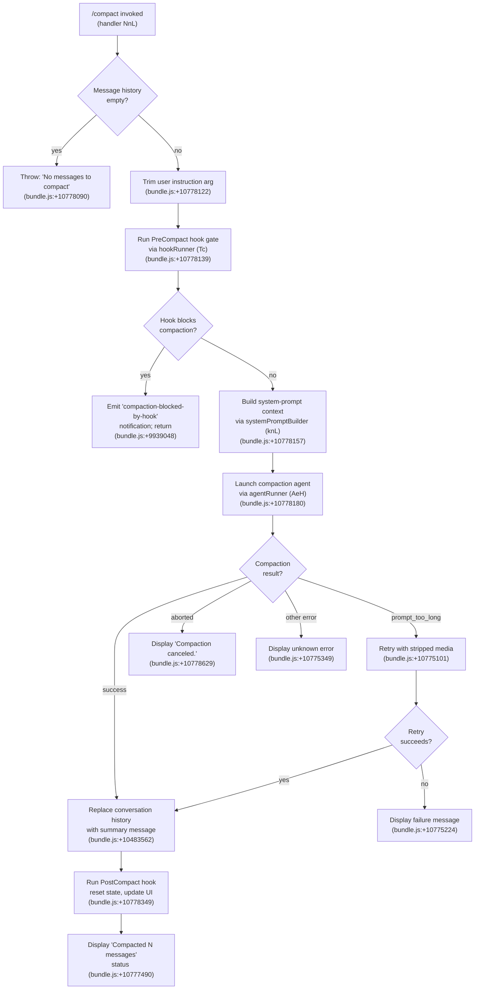

# `/compact`

> Analysis basis: CC v2.1.156 bundle.js (AST extraction + Claude interpretation)
> Minimum version: v2.1.156

---

## Overview

`/compact` reduces context window consumption by generating a structured summary of the current conversation and replacing the full message history with that summary. It supports an optional argument for custom summarization instructions, and can also be triggered automatically by the runtime when context usage approaches limits. The command is dispatched via the `post-text` thin-client path and is safe to run in non-interactive (headless) mode.

---

## Registration

| Field | Value |
|---|---|
| type | `local` |
| name | `compact` |
| description | `Free up context by summarizing the conversation so far` |
| argumentHint | `<optional custom summarization instructions>` |
| supportsNonInteractive | `true` |
| thinClientDispatch | `post-text` |
| module_id | `Vv1` |
| load_inline | `true` |
| loc_byte | `10779028` |
| loc_byte_end | `10779341` |
| arbor_handler.name | `NnL` |
| arbor_handler.fqn | `claude-2.1.156::NnL` |
| arbor_handler.kind | `AsyncFunction` |
| arbor_handler.resolution_path | `module_id` |
| arbor_handler.n_hits | `0` |

Analysis basis: CC v2.1.156 bundle.js:+10779028

---

## Input Branching

The command has 4+ distinct branches depending on pre-conditions (empty history, `PreCompact` hook gate, cancellation, error types). A Mermaid flowchart is used.



---

## Behavioral Spec

### 1. Entry Guard — Empty History Check

Before any summarization work begins, the handler verifies the conversation has at least one message.

```
function compactHandler(userInstruction, appContext):
    messageHistory = getConversationMessages(appContext)
    if messageHistory is empty:
        throw Error("No messages to compact")   // bundle.js:+10778090
    instruction = userInstruction.trim()         // bundle.js:+10778122
    ...
```

Analysis basis: CC v2.1.156 bundle.js:+10778084, +10778090, +10778122

---

### 2. PreCompact Hook Gate

Before invoking the summarization agent, the handler runs registered `PreCompact` hooks via the hook runner (`Tc`). If any hook blocks the operation, a `"compaction-blocked-by-hook"` warning notification is emitted and the command exits without modifying history.

```
function runPreCompactHook(hookRunner, context):
    result = hookRunner.run("PreCompact", context)   // bundle.js:+10778139
    if result.blocked:
        emitNotification("compaction-blocked-by-hook",
                         "compaction blocked by PreCompact hook",
                         severity="warning")          // bundle.js:+9939048
        return BLOCKED
    return ALLOWED
```

Analysis basis: CC v2.1.156 bundle.js:+10778139, +9939048

---

### 3. System-Prompt Context Assembly (`knL`)

The system-prompt builder (`knL`) assembles the full context package passed to the compaction agent. Its sub-steps include:

1. **Record start timestamp** via `performance.now()` (bundle.js:+10774139).
2. **Build message context** via context builder (`eZ`/`QxL`/`Ic_`) — filters, normalizes, and serializes conversation messages (bundle.js:+10774161).
3. **Collect MCP server state** via MCP aggregator (`Zc`) — enumerates active MCP connections and tool listings (bundle.js:+10774203).
4. **Collect app state** via state collector (`Ev1`) — reads current app state, active tools, memory, and system prompt (bundle.js:+10774278).
5. **Emit progress marker** `"compact_progress"` with phase `"hooks_start"` then `"pre_compact"` then `"sdk_status"/"compacting"` (bundle.js:+10774002, +10774033, +10774056, +10774098, +10774118).
6. **Emit notification** type `"notification"` (bundle.js:+10774323).
7. **Record** stream-mode metadata (`"stream_mode"/"requesting"`, `"response_length"/"reset"`) and emit `"compact_start"` marker (bundle.js:+10774418, +10774437, +10774475, +10774496, +10774562).

```
async function buildCompactionContext(state, mcpState, options):
    t0 = performance.now()
    messageCtx  = await buildMessageContext(state)    // eZ / QxL / Ic_
    mcpCtx      = await collectMcpState()             // Zc / D7 / dW
    appCtx      = await collectAppState(state)        // Ev1 / kT
    emitProgress("compact_progress", {phase: "compacting"})
    return {messageCtx, mcpCtx, appCtx, t0}
```

Analysis basis: CC v2.1.156 bundle.js:+10774139, +10774161, +10774203, +10774278

---

### 4. Compact Boundary Marker in History (`i$` / `FZ8`)

Before dispatching the API call, the runtime inserts a special `"compact_boundary"` sentinel message at position `[1, 0]` in the history array. This sentinel is typed as `"system"` and marks the compaction boundary for later slice operations.

```
function insertCompactionBoundary(history):
    boundaryMsg = {type: "system", subtype: "compact_boundary",
                   index: [1, 0]}                     // bundle.js:+10483984, +10484006
    return [boundaryMsg, ...history]
```

Literal values: `"system"` (bundle.js:+10483984), `"compact_boundary"` (bundle.js:+10484006), index `[1, 0]` (bundle.js:+10484060, +10484065).

Analysis basis: CC v2.1.156 bundle.js:+10778059, +10484060

---

### 5. Compaction Agent Execution (`AeH`)

The compaction agent runner (`AeH`) sends the assembled context to the model using the system prompt:

> "You are a helpful AI assistant tasked with summarizing conversations." (bundle.js:+9952912)

The agent enforces that tool use is blocked during compaction — any tool-use response is rejected with `"deny"` and the message `"Tool use is not allowed during compaction"` (bundle.js:+9950593). Only a text summary is accepted.

Key sub-behaviors:

- **Custom instruction injection**: if the user passed a non-empty instruction string, it is appended to the summarization prompt.
- **Cache-prefix sharing**: the agent attempts to reuse existing cache prefixes for efficiency; success/failure is tracked via `tengu_compact_cache_sharing_success` / `tengu_compact_cache_sharing_fallback` (bundle.js:+9951470, +9952100).
- **Progress tracking**: emits `"compact_auto"` or `"compact_manual"` label based on trigger type (bundle.js:+9939836, +9939851).
- **Missing summary guard**: if the model response contains no valid text content, emits error `"compact_no_summary"` and message `"Failed to generate conversation summary - response did not contain valid text content"` (bundle.js:+9941488, +9941516).

```
async function runCompactionAgent(context, instruction):
    systemPrompt = "You are a helpful AI assistant tasked with summarizing conversations."
    if instruction is not empty:
        systemPrompt += instruction
    response = await callModel(systemPrompt, context,
                               toolPolicy="deny")      // bundle.js:+9950578
    if response has no text:
        emitTelemetry("tengu_compact", {result: "no_summary"})
        throw CompactionError("compact_no_summary")
    return response.text
```

Analysis basis: CC v2.1.156 bundle.js:+9940082, +9952912, +9950593, +9941516

---

### 6. History Replacement and `PostCompact` Hook

After a successful summary text is produced:

1. The full conversation history prior to the `compact_boundary` sentinel is sliced away.
2. A single new message typed `"compaction"` containing the summary text is prepended, tagged with `"Conversation compacted"` (bundle.js:+10483562).
3. The `PostCompact` hook is fired via the hook runner (`co`) (bundle.js:+10778349).
4. App state is reset: `jkH` clears relevant state flags (bundle.js:+10778324, +10775511).
5. The session transcript toggle (`"app:toggleTranscript"`) keybinding is registered with shortcut `ctrl+o` under scope `"Global"` (bundle.js:+10777351, +10777374, +10777383).
6. A dim status line `"Compacted N messages"` (bundle.js:+10777490) is displayed, followed by a tip that the transcript can be reviewed.

```
function applyCompactionResult(summaryText, history, appState):
    boundaryIdx = findBoundaryIndex(history, "compact_boundary")
    trimmedHistory = history.slice(boundaryIdx)
    compactedMsg = {type: "compaction", text: summaryText,
                    label: "Conversation compacted"}   // bundle.js:+10483562
    newHistory = [compactedMsg, ...trimmedHistory]
    writeHistory(appState, newHistory)
    runPostCompactHook()                               // bundle.js:+10778349
    resetAppState(appState)                            // bundle.js:+10778324
    displayStatus("Compacted " + count + " messages") // bundle.js:+10777490
```

Analysis basis: CC v2.1.156 bundle.js:+10483562, +10778324, +10778349, +10777490

---

### 7. Error Handling Matrix

| Error Condition | Telemetry Event | User Message |
|---|---|---|
| Context too long (retry) | `tengu_compact_ptl_retry` | "Compaction failed · conversation could not be reduced below the context limit" (bundle.js:+10775101) |
| Media too large (retry exhausted) | `tengu_compact_failed` | "Compaction failed · attached media exceeds size limits" (bundle.js:+10775224) |
| No summary text in response | `tengu_compact` (result: no_summary) | "Failed to generate conversation summary…" (bundle.js:+9941516) |
| API error during compaction | `tengu_compact` (result: compact_api_error) | Generic API error path (bundle.js:+9941758) |
| User aborted | — | "Compaction canceled." (bundle.js:+10778629) |
| Hook blocked | — | Warning notification "compaction blocked by PreCompact hook" (bundle.js:+9939082) |

Analysis basis: CC v2.1.156 bundle.js:+10775101, +10775224, +10778629, +9939082

---

### 8. Reactive (Automatic) Compaction (`mN_` / `gf8`)

The runtime also triggers compaction automatically when context fills. This path (`mN_`) runs the same core compaction logic (`ef8` / `gf8`) but:

- Groups conversation turns, requires at least 2 groups to proceed; bails with `"too_few_groups"` if fewer exist (bundle.js:+6518226, +6518316).
- Requires at least one assistant message in the summarize set; bails with `"Reactive compact: no assistant messages in summarize set, bailing"` (bundle.js:+6518788).
- Strips media and retries on media-size errors (bundle.js:+6519672).
- Emits `tengu_reactive_compact_attempt` at start and `tengu_reactive_compact_succeeded` / `tengu_reactive_compact_failed` at end.
- Uses the 80th-percentile target fill ratio (literal `80` at bundle.js:+6553148).
- Records trigger type as `"compact_reactive"` (bundle.js:+6555380).

```
async function reactiveCompact(history, appState):
    groups = groupConversationTurns(history)
    if groups.length < 2:
        logDebug("Reactive compact: fewer than 2 groups, nothing to compact")
        return {result: "too_few_groups"}              // bundle.js:+6518316
    assistantMsgs = filterAssistantMessages(groups)
    if assistantMsgs.length == 0:
        logDebug("no assistant messages in summarize set")
        return {result: "exhausted"}                   // bundle.js:+6518890
    emitTelemetry("tengu_reactive_compact_attempt")
    summary = await runCompactionCore(groups, targetFillPct=80)
    if success:
        emitTelemetry("tengu_reactive_compact_succeeded")
    else:
        emitTelemetry("tengu_reactive_compact_failed")
```

Analysis basis: CC v2.1.156 bundle.js:+10774730, +6518226, +6518316, +6518788, +6553148

---

## State & Side Effects

| Item | Detail |
|---|---|
| Telemetry | `tengu_compact` (main compaction result), `tengu_compact_cache_prefix`, `tengu_compact_cache_sharing_success`, `tengu_compact_cache_sharing_fallback`, `tengu_compact_failed`, `tengu_compact_ptl_retry`, `tengu_reactive_compact_attempt`, `tengu_reactive_compact_succeeded`, `tengu_reactive_compact_failed`, `tengu_precomputed_compact_consumed`, `tengu_precomputed_compact_discarded`, `tengu_post_compact_file_restore_success`, `tengu_post_compact_file_restore_error`, `tengu_sepia_moth`, `tengu_amber_redwood3`, `tengu_run_hook` |
| Hook registration | Fires `PreCompact` hook before compaction; fires `PostCompact` hook after successful history replacement |
| appState changes | Conversation history is truncated and replaced with summary message; app state flags are reset via `jkH` (bundle.js:+10775511); keybinding `ctrl+o` → `app:toggleTranscript` registered globally (bundle.js:+10777351) |
| History sentinel | `"compact_boundary"` system message inserted at `[1, 0]` before API call (bundle.js:+10484006) |
| Sound | <!-- TODO: not found in depth-2 traversal; needs --depth 4 --> |
| Transcript action | After compaction, a dim status line shows `"Compacted N messages"` and the transcript can be toggled via `ctrl+o` |

---

## Version History

| Version | Change |
|---|---|
| v2.1.156 | Initial analysis |

---

## Common Mistakes

1. **Running `/compact` on an empty session**: The command immediately throws `"No messages to compact"` — there must be at least one message in history before compaction is useful.
2. **Expecting tool use inside the compaction agent**: Tool calls are explicitly blocked during summarization; only a plain text summary is accepted from the model.
3. **Assuming custom instructions override the summarization goal**: The user-supplied argument is appended to the agent system prompt but does not replace it — the agent still produces a conversation summary as its primary output.
4. **Not accounting for `PreCompact` hook veto**: If a `PreCompact` hook returns a block decision, compaction silently aborts with a warning notification and history is not modified.
5. **Expecting immediate history reduction on huge media**: If the compacted prompt still exceeds context limits due to large media attachments, the command retries with stripped media and may ultimately fail with the media-size error message.

---

## Appendix — Identifier Mapping

> For bundle debugging only. Identifiers change across versions.

| Identifier | Role |
|---|---|
| `NnL` | Main compact command handler (AsyncFunction, Arbor-resolved) |
| `i$` | Conversation history accessor / boundary injector |
| `FZ8` | Compact-boundary message builder |
| `Wj` | Message serialization helper |
| `Tc` | Hook runner (executes PreCompact / PostCompact hooks) |
| `S_` | Hook state accessor |
| `E6` | Hook event emitter / dispatcher |
| `hz6` | Hook event type resolver |
| `Sz6` | Hook event data formatter |
| `Mx` | Message context transformer |
| `xH` | String encoding / text normalization utility |
| `fx` | Feature flag / experiment evaluator |
| `y88` | Hook deduplication / set manager |
| `$z_` | Growthbook experiment event emitter |
| `wz_` | Hook lifecycle manager |
| `b6` | Config file reader / watcher initializer |
| `B6` | Config path resolver |
| `bzH` | Config file sync reader with backup |
| `Y17` | File watcher registration helper |
| `knL` | System-prompt / compaction context builder |
| `eZ` | Message context aggregator |
| `QxL` | Message list normalizer |
| `kDH` | Token counter helper |
| `Ic_` | Message serializer for API payload |
| `Zc` | MCP state collector |
| `D7` | MCP connection enumerator |
| `dW` | Hook dispatcher / executor |
| `N` | Log / debug emitter |
| `hfH` | Hook state loader |
| `SqA` | Hook configuration parser |
| `hqA` | Hook filter utility |
| `RH` | JSON serialization wrapper |
| `hH` | Error logger |
| `uH` | App-state dependency helper |
| `MGH` | Output token aggregator |
| `_v` | Abort controller / timeout manager |
| `Hh8` | Hook output parser |
| `NqA` | MCP tool hook handler |
| `qh8` | Hook stdout JSON parser |
| `MAH` | Hook metadata assembler |
| `vqA` | HTTP hook executor |
| `o8K` | Hook HTTP response parser |
| `Kh8` | Shell hook spawner |
| `Ev1` | App-state snapshot collector for compaction |
| `kT` | Full system-prompt builder |
| `dqA` | String encoder used in prompt building |
| `IG8` | Tool listing aggregator |
| `i_` | Async tool resolver |
| `iqA` | Context injection helper |
| `vX5` | Context injection wrapper |
| `$X5` | Scheduled routines / session guidance builder |
| `az6` | Memory-file loader and prompt injector |
| `JX5` | Environment info (complex) builder |
| `jX5` | Environment info (simple) builder |
| `PX5` | Background-session prompt builder |
| `WX5` | Worktree context prompt builder |
| `TX5` | Brief-mode detector |
| `VX5` | Focus context injector |
| `YX5` | Growthbook experiment context injector |
| `eJ5` | File-context (CLAUDE.md) loader |
| `cV9` | Computed cache helper |
| `qX5` | Task-reminder builder |
| `KX5` | Context efficiency block builder |
| `LX5` | Context injection wrapper (list) |
| `fX5` | Tool permission context builder |
| `OX5` | Tone-and-style block builder |
| `BFq` | Memory-dir prompt helper |
| `GzH` | AWS / Anthropic environment selector |
| `Z_` | Session state snapshot reader |
| `jE8` | Allowed-tools filter |
| `JE8` | Disallowed-tools filter |
| `su` | Main-thread system-prompt assembler |
| `GK` | Compaction label selector (`compact_auto` / `compact_manual`) |
| `rR` | API client creator |
| `G_` | Module initializer / ESM shim |
| `InL` | Streaming compaction API caller |
| `VN_` | Pending-request tracker |
| `aiH` | Precomputed compact consumer |
| `cf8` | Compact session initializer |
| `VY` | Token-usage recorder |
| `vN_` | History slice finder |
| `nf8` | Progress metrics recorder |
| `ef8` | Core compaction executor |
| `nvH` | Agent-type prefix checker |
| `F6H` | Agent-type prefix validator |
| `Dj` | Agent-context builder |
| `o6H` | Hook-agent checker |
| `ij6` | Message entry converter |
| `HvH` | History sanitizer |
| `Pc` | Prompt-cache prefix builder |
| `qP6` | Cache-key writer |
| `YkH` | Cache directory initializer |
| `_rH` | Away-summary checker |
| `U4` | Away-summary scheduler |
| `XP6` | UUID generator wrapper |
| `G8H` | Tool-result message builder |
| `bxL` | Array type checker |
| `CxL` | Tool listing serializer |
| `Jl7` | Full compaction pipeline runner |
| `_M8` | Tool-state snapshot collector |
| `LM8` | App-state tool loader |
| `AM8` | Plan-file loader |
| `KM8` | Plan-state collector |
| `qM8` | Tool-value aggregator |
| `S7H` | MCP server enumerator |
| `PkH` | Pro-feature gate checker |
| `WkH` | MCP server listing builder |
| `KB` | Session-start hook runner |
| `LjH` | Hook-output join builder |
| `pN_` | History filter for compaction window |
| `JSH` | Message source tagger |
| `hf8` | Token percentage calculator |
| `yf8` | Per-message token counter |
| `jT` | Message content normalizer for API |
| `Vf` | Token rounding utility |
| `pc7` | Token-map cache accessor |
| `qT` | Model-capability checker |
| `v3` | App-state reader (streaming) |
| `mN_` | Reactive compaction trigger |
| `gf8` | Reactive compaction core |
| `niH` | Message push helper |
| `QV9` | Group size calculator |
| `ic7` | Single-group summarization caller |
| `rc7` | Gap-fill calculator |
| `Lu` | Path sanitizer / redactor |
| `Gu7` | URL redactor |
| `Pu7` | IP address redactor |
| `wu7` | Email redactor |
| `Yu7` | Home-dir path shortener |
| `Zu7` | UNC path redactor |
| `Tu7` | URL scheme redactor |
| `ZH` | String coercion wrapper |
| `co` | Post-compact cleanup runner |
| `if8` | Precomputed-compact state cleaner |
| `oj6` | Transition-zone cleaner |
| `W8H` | Queue/state reset helper |
| `sf8` | Cache clear on compact |
| `Hv9` | Pending-state clear on compact |
| `HjH` | Hook state reset |
| `Fw` | Output-token tracker reset |
| `jkH` | App-state flag setter (post-compact) |
| `Zv1` | Transcript keybinding registrar |
| `RrH` | Context transcript action builder |
| `ZX` | Keybinding registration helper |
| `iDH` | OTEL metrics emitter |
| `Y4` | Metrics event builder |
| `qNH` | OTEL span builder |
| `AeH` | Compaction agent runner |
| `bP6` | Tracing span initializer |
| `Hv` | Tracing span helper |
| `qh` | Active-span accessor |
| `Ff8` | Summary text trimmer |
| `Z8` | Streaming session creator |
| `lU5` | PTY/daemon session protocol handler |
| `jJ1` | Compaction result processor |
| `EY1` | Agent state initializer |
| `AG8` | Growthbook flag reader |
| `ZY1` | Agent state updater |
| `u0` | Turn executor / agentic loop |
| `K08` | App-state writer for turn |
| `Kh` | Random-bytes generator |
| `HAH` | History serializer for agent |
| `au` | Command lifecycle tracker |
| `$v6` | Tombstone / summary flag checker |
| `NAH` | Notification assembler |
| `C7H` | Tool-use filter during compaction |
| `XN_` | Context-window limit resolver |
| `h7H` | Max-output-token resolver |
| `PzH` | Per-model token-limit table |
| `r6H` | `CLAUDE_CODE_MAX_OUTPUT_TOKENS` env parser |
| `fE` | Last-message finder |
| `Bf8` | Summary sentinel wrapper |
| `Uf8` | `<summary>` tag finder |
| `H_` | Message role checker |
| `k` | Away-summary manager |
| `VW8` | State-store accessor |
| `Q58` | No-turn away-summary caller |
| `DV6` | Tool-search mode decision maker |
| `I7H` | Model capability resolver |
| `ehH` | Tool-availability checker |
| `Tc_` | Tool-search mode evaluator |
| `xxL` | TST (tool-search-tool) mode resolver |
| `JN_` | Message list flattener |
| `_xL` | Content block type tester |
| `AxL` | Assistant-message filter |
| `qxL` | Message content normalizer |
| `Ac_` | Content-block recursive normalizer |
| `OJ1` | Surrogate-pair aware char slicer |
| `ceH` | Main query executor |
| `Vc_` | Pre-query state validator |
| `n_K` | Full API query pipeline |
| `wc_` | Post-compact state writer |
| `vkH` | Status-bar updater |
| `Eq` | UUID event tagger |

Note: index built via Arbor fallback; some signals (telemetry, literals) may be missing — see arbor-fallback.js.