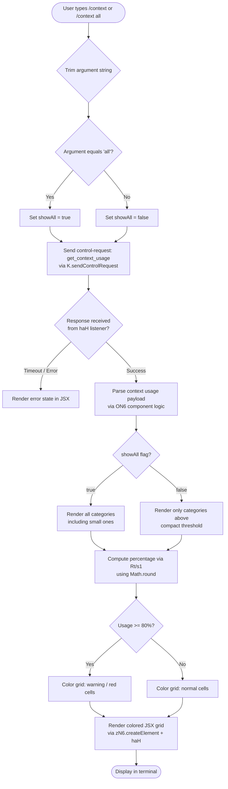

# `/context`

> Analysis basis: CC v2.1.156 bundle.js (AST extraction + Claude interpretation)
> Minimum version: v2.1.156

---

## Overview

The `/context` command renders a visual representation of the current context window's token usage as a colored grid, broken down by category (system prompt, tools, memory files, messages, etc.). It dispatches a `control-request` of type `get_context_usage` to the running agent and then renders the response as a JSX component in the terminal UI. This is a diagnostic/observability command intended to help users understand how their context budget is being consumed.

---

## Registration

| Field | Value |
|---|---|
| type | `local-jsx` |
| name | `context` |
| description | `Visualize current context usage as a colored grid` |
| argumentHint | `[all]` |
| thinClientDispatch | `control-request` |
| module_id | `LI1` |
| load_inline | `true` |
| loc_byte | `11179555` |
| loc_byte_end | `11179781` |
| loc_line | `7791` |
| arbor_handler.name | `yaL` |
| arbor_handler.fqn | `claude-2.1.156::yaL` |
| arbor_handler.kind | `AsyncFunction` |
| arbor_handler.resolution_path | `module_id` |
| arbor_handler.n_hits | `0` |

Analysis basis: CC v2.1.156 bundle.js:+11179555

---

## Input Branching

The command has 4+ distinct branches depending on argument parsing, control-request result, and rendering mode, so a flowchart is used.



Analysis basis: CC v2.1.156 bundle.js:+11178249 (handler entry `yaL`), +11178280 (`"all"` literal), +11178691 (`80` threshold literal), +11178315 (`sendControlRequest` call)

---

## Behavioral Spec

### Handler Entry: contextCommandHandler (`yaL`)

```
async function contextCommandHandler(args, appContext):
    trimmedArg = args.trim()                        // +11178255
    showAll = (trimmedArg === "all")                // +11178280

    // Send a control-request to the running agent process
    requestPayload = buildGetContextUsageRequest(appContext)  // W3/aWH +11178288
    response = await appContext.sendControlRequest(           // +11178315
        "get_context_usage"
    )

    // Attach a listener for the data event on the response stream
    usageData = await listenForContextResponse(response)     // haH +11178375

    // Build JSX element tree
    grid = buildContextGrid(usageData, showAll)              // ON6 +11178485
    percentDisplay = formatPercentage(usageData.used,        // ZH +11178569
                                      usageData.total)
    compactBoundaryMarker = getCompactBoundary(usageData)    // IaL/i$ +11178658

    // Apply 80% threshold coloring
    if usageData.percentUsed >= 80:                          // +11178691
        applyWarningColor(grid)

    return createElement(grid, percentDisplay, compactBoundaryMarker)
                                                             // zN6.createElement +11178379
```

Analysis basis: CC v2.1.156 bundle.js:+11178249

---

### Control Request Dispatch: buildGetContextUsageRequest (`W3`)

```
function buildGetContextUsageRequest(appContext):
    // Constructs the control-request envelope that the thin client
    // will route to the local-agent bridge
    return {
        type: "control-request",         // thinClientDispatch field
        action: "get_context_usage",     // literal +11178345
        sessionId: appContext.sessionId
    }
```

Analysis basis: CC v2.1.156 bundle.js:+11178288 (`W3` call), +11178345 (`"get_context_usage"` literal)

---

### Context Response Listener: listenForContextResponse (`haH`)

```
function listenForContextResponse(responseStream):
    // Register a one-shot "data" event listener on the response object
    responseStream.on("data", handler)         // K.on +7722048, "data" literal +7722053
    rawBytes = handler.toString(...)           // f.toString +7722085

    // Render the raw data through the visual component
    visualOutput = renderContextWidget(rawBytes)  // vU +7722112
    return createElement(visualOutput)            // P_H.createElement +7722115
```

Analysis basis: CC v2.1.156 bundle.js:+7722048

---

### Grid Computation: buildContextGrid (`ON6`)

The component iterates the categories present in the usage payload and renders a row for each. Categories observed in the literals include:

| Category Label | Internal Key | Color Hint |
|---|---|---|
| System prompt | `system` | `promptBorder` |
| System tools | (built-in tools) | `inactive` |
| MCP tools | `mcp` | `cyan_FOR_SUBAGENTS_ONLY` |
| MCP tools (deferred) | — | — |
| System tools (deferred) | — | — |
| Custom agents | — | `permission` |
| Memory files | `claude` | — |
| Skills | — | `warning` |
| Messages | — | `purple_FOR_SUBAGENTS_ONLY` |
| Free space | `Free space` | — |
| Autocompact buffer | `Autocompact buffer` | — |

```
function buildContextGrid(usageData, showAll):
    // s1 retrieves the locale formatter (en-US, compact) +211539,+211557
    formatter = getNumberFormatter("en-US", "compact")

    allCategories = usageData.filter(...)        // A.filter +11176353
    if not showAll:
        categories = allCategories.filter(
            c => c.tokenCount > COMPACT_THRESHOLD
        )
    else:
        categories = allCategories

    // Find the autocompact boundary marker
    compactEntry = categories.find(              // A.find +11176671
        c => c.key === "compact_boundary"        // +10484006
    )

    for each category in categories:
        label = String(category.label)           // String +11177589
        percentCell = computePercentageDisplay(  // JpH +11178008
            category.tokenCount, usageData.total
        )
        appendRow(grid, label, percentCell)

    return grid
```

Analysis basis: CC v2.1.156 bundle.js:+11176312

---

### Percentage Formatter (`Rt` / `s1`)

```
function formatPercentage(used, total):
    raw = used / total * 100
    rounded = Math.round(raw)                    // Math.round +209589
    // Append ".0" suffix for display if value is whole number
    display = String(rounded) + ".0"             // ".0" literal +209531
    if rounded < 20:                             // threshold 20 +209560
        display = "< 20"                         // literal +209569
    return display
```

Analysis basis: CC v2.1.156 bundle.js:+209586

---

### Compact Boundary Detection (`IaL` / `i$`)

```
function getCompactBoundary(usageData):
    // Looks up the "compact_boundary" sentinel entry in the usage array
    entry = FZ8.lookup("compact_boundary")       // FZ8 +10484136, literal +10484006
    if entry exists:
        return entry.slice(...)                  // H.slice +10484159
    return null
```

Analysis basis: CC v2.1.156 bundle.js:+11178211

---

### Full Context Snapshot Builder (`XT8` → `kT`)

`XT8` is the large system-prompt assembly function invoked from other contexts (e.g., when a new agent session is created) but its sub-functions are directly referenced in the call graph from the `/context` command's display logic. Key sub-functions categorize tokens:

```
function assembleSystemPrompt(sessionConfig):
    sections = []

    // Environment info (static)
    sections.push(buildStaticEnvInfo())      // jX5 +13084974
    // Language / output style
    sections.push(getLanguageSection())      // _X5 +13085044
    // Memory files
    sections.push(loadMemoryFiles())         // az6 +13084873
    // MCP tool definitions
    sections.push(getMcpToolDefs())          // BFq +13085431
    // Context management settings
    sections.push(getContextMgmt())          // WX5 +13085099
    // Brief mode
    sections.push(getBriefSection())         // TX5 +13085160
    // Scratchpad
    sections.push(getScratchpad())           // PX5 +13085072

    // Token counting per section feeds into /context display
    return Promise.all(sections)
```

Analysis basis: CC v2.1.156 bundle.js:+9971331

---

## State & Side Effects

| Item | Detail |
|---|---|
| Telemetry | `tengu_pewter_brook` (+3378236), `tengu_amber_creek` (+3378328), `tengu_marlin_porch` (+3744880), `tengu_sparrow_ledger` (+13084296), `tengu_heron_brook` (+13066904), `tengu_moth_copse` (+3298321), `tengu_memdir_loaded` (+3294085), `tengu_memdir_disabled` (+3299257), `tengu_herring_clock` (+3299453), `tengu_team_memdir_disabled` (+3299481), `tengu_billiard_aviary` (+3199475), `tengu_amber_redwood2` (+9958657), `tengu_slate_harrier` (+13093937), `tengu_orchid_mantis_v2` (+13079828) |
| Control request | Dispatches `"get_context_usage"` (+11178345) over `thinClientDispatch: "control-request"` to the local-agent bridge |
| Event listener | Registers a `"data"` listener on the control-response stream (`K.on` +7722048); listener is one-shot |
| appState changes | None — read-only diagnostic view; no persistent state mutations observed |
| Sound | None observed |
| JSX rendering | Returns a `local-jsx` component; rendered inline in terminal via `zN6.createElement` (+11178379) and `P_H.createElement` (+7722115) |
| 80% warning threshold | When context usage is ≥ 80%, warning coloring is applied to grid cells (literal `80` +11178691) |

---

## Version History

| Version | Change |
|---|---|
| v2.1.156 | Initial analysis |

---

## Common Mistakes

1. **Expecting a text response**: `/context` returns a JSX grid widget rendered inline, not plain text. Piping or scripting the output will not yield structured data.
2. **Omitting `all`**: Without the `all` argument, small categories below the compact threshold are hidden. Use `/context all` to see every token category including minor ones.
3. **Interpreting the compact boundary as a hard limit**: The `compact_boundary` marker shows where autocompaction would trim the conversation, not the absolute context window ceiling.
4. **Running in non-interactive / thin-client mode without a bridge**: The command requires a live local-agent bridge supporting the `get_context_usage` control-request. In fully headless or SDK-only contexts the request may be unsupported (error message: `"get_context_usage is not supported in this context"`, +12366381).
5. **Assuming the percentage display is exact below 20%**: Values below 20% are displayed as the literal string `"< 20"` (+209569) rather than the true rounded number.

---

## Appendix — Identifier Mapping

> For bundle debugging only. Identifiers change across versions.

| Identifier | Role |
|---|---|
| `yaL` | Main async handler for `/context` command (arbor_handler) |
| `fq` | Context usage data fetcher / orchestrator |
| `Z3H` | Local-agent type check helper (uses `baK.has`) |
| `oY_` | Terminal color capability probe |
| `v1` | Color string normalizer (wraps `String`) |
| `xH` | Color/style token emitter |
| `Tr` | Fullscreen / terminal environment check |
| `r47` | Terminal multiplexer detector (tmux/screen/iTerm) |
| `i47` | iTerm detection sub-check (`H.startsWith`) |
| `N` | Logger / debug output helper |
| `URK` | Settings loader entry point |
| `$$A` | Settings merge helper |
| `H` | Random / timer utility (Math.random, setTimeout) |
| `RH` | JSON serializer wrapper (JSON.stringify) |
| `v4` | Model name normalizer / extractor |
| `FzA` | Model list mapper (`CRK.map`) |
| `gRK` | Conversation log writer / file persistence manager |
| `kxH` | Debounced write scheduler (clearTimeout, setTimeout, setImmediate) |
| `cMH` | Log chunk assembler |
| `B16` | Log file rotation helper |
| `rzA` | Log file path builder |
| `izA` | Log file stat/rename/unlink helper |
| `FRK` | Log file append-and-rotate writer |
| `_9` | Hook registrar (`f$A.register`) |
| `rY_` | Windows-over-SSH detection helper |
| `i_` | Settings/config reader |
| `vp` | Settings load orchestrator |
| `T9` | Deduplication set manager for settings loading |
| `Bo8` | Settings fetch async worker |
| `ig` | Settings object builder (merges multiple setting layers) |
| `o47` | Context telemetry/event emitter |
| `E6` | Event bus / subscriber |
| `Mx` | Event payload builder |
| `y88` | Event deduplication tracker |
| `b6` | Event dispatch with timestamp |
| `W3` | Control-request builder for `get_context_usage` |
| `aWH` | Control-request envelope constructor |
| `K` | Control-request channel / IPC transport |
| `haH` | Data-event listener / response handler for control channel |
| `vU` | Context grid widget renderer |
| `oj_` | JSX element factory (Yaq.createElement wrapper) |
| `M4H` | Terminal color-aware grid renderer |
| `CdH` | Grid cell formatter |
| `ON6` | Context category grid component |
| `s1` | Locale number formatter (en-US compact) |
| `YK` | Number formatting helper |
| `cRK` | Compact number format config |
| `JpH` | Per-category percentage cell builder |
| `Rt` | Percentage calculator (Math.round) |
| `ZH` | String-to-display converter |
| `IaL` | Compact boundary locator |
| `i$` | Compact boundary entry lookup |
| `FZ8` | Compact boundary data accessor |
| `Wj` | Compact boundary sentinel resolver |
| `XT8` | Full system-prompt assembler (large orchestrator) |
| `VZ` | System-prompt section composer |
| `Ce` | Core system-prompt builder |
| `av` | Base agent identity section |
| `_9H` | Agent capability section |
| `WQ` | Model-aware prompt section selector |
| `EZ` | Model tier resolver |
| `Bf` | First-party model check |
| `M5` | Model feature gate resolver |
| `GA` | Color/style applicator |
| `hN` | Fallback model section builder |
| `JT` | Autocompact configuration reader |
| `g4` | Legacy global config checker |
| `tE` | Tool deduplication set manager |
| `h8` | Instrument/trace hook for settings |
| `Wl` | Autocompact window resolver |
| `O9` | Model name pattern matcher |
| `_w` | Model name normalizer (toLowerCase, includes, replace) |
| `Hp8` | Model family classifier |
| `NP` | Model name replacer |
| `DV` | Context limit resolver per model |
| `j0` | Base context window size resolver |
| `gp` | Extended context window resolver |
| `be` | Standard context window resolver |
| `DH8` | Context window validator (parseInt, Number.isFinite) |
| `sW` | Auto-compact mode string resolver |
| `r6H` | Env-var integer parser for autocompact window |
| `EJ1` | Autocompact configuration object builder |
| `S_` | Configuration key accessor |
| `Oc_` | Token count string parser (parseFloat, parseInt, Math.round) |
| `kT` | System-prompt section orchestrator (Promise.all over all sections) |
| `dqA` | Color/theme token resolver |
| `C6` | Async store accessor (`zB6.getStore`) |
| `YB6` | Store context getter |
| `$_` | Shared state reader (`ov`) |
| `IG8` | MCP tool definition formatter |
| `Xk` | Tool definition combiner |
| `aJ5` | Code-style instruction section builder |
| `sJ5` | Doing-tasks instruction section builder |
| `iqA` | Instruction block assembler |
| `vX5` | Extended instruction assembler |
| `$X5` | Tool listing / SDK tool section builder |
| `zg` | Tool availability checker |
| `SX` | SDK tool type resolver |
| `MX5` | Tool schema normalizer |
| `mE_` | Tool schema validator |
| `sZ` | Tool disabled flag checker |
| `OL` | Tool output limiter |
| `ZF` | Feature flag resolver for tools |
| `tB` | Tool content block array flattener |
| `az6` | Memory file loader and prompt builder |
| `z4` | Memory directory stat helper |
| `dKH` | Memory directory creator |
| `Yr` | Memory file type checker (isFile, isDirectory) |
| `yH` | File existence helper |
| `Lw` | Memory prompt event emitter |
| `SFq` | Team memory path joiner |
| `hFq` | Memory file reader (UEH) |
| `yFq` | Memory file content loader |
| `LY_` | Memory file list builder |
| `d` | File stat / read utility |
| `JX5` | Environment info (static) section builder |
| `_D` | Environment string formatter |
| `cqA` | Environment detail assembler |
| `jX5` | Simple environment info section builder |
| `nqA` | OS info collector (os.version, os.release, os.type) |
| `sM` | Shell/OS section string builder |
| `lqA` | Language/locale section builder |
| `HX5` | Language preference section |
| `_X5` | Output style section |
| `PX5` | Scratchpad / working-directory section |
| `hu_` | Git worktree detector |
| `WX5` | Context management section builder |
| `OqH` | Context management event emitter |
| `y2H` | Scratchpad path builder |
| `TX5` | Brief mode section builder |
| `VX5` | Focus / context management config reader |
| `YX5` | GrowthBook experiment section builder |
| `eJ5` | Heron-brook section builder |
| `cV9` | MCP status/tools section builder |
| `SMH` | MCP connection state accessor |
| `im8` | MCP tool formatter |
| `zX5` | Reproduce-verify-workflow section |
| `AX5` | Additional context section |
| `qX5` | System section assembler |
| `tJ5` | System section header builder |
| `KX5` | Verified-vs-assumed tool section |
| `LX5` | Instruction block from iqA |
| `fX5` | CLI/remote context section builder |
| `y0` | Environment context type resolver |
| `OX5` | Output-style tool block builder |
| `BFq` | Memory-load prompt orchestrator |
| `UFq` | Memory-load prompt builder |
| `GzH` | Grammar/style section builder |
| `SZ` | Style section formatter |
| `R5` | Section concatenator |
| `su` | System-prompt final assembler with MCP integration |
| `GK` | Agent memory loader |
| `rR` | Remote agent connector |
| `fZ` | Feature flag async resolver |
| `d_` | Directory resolver |
| `G_` | Module initializer |
| `MR6` | Module bind helper |
| `M` | MCP server manager |
| `vSH` | MCP server connector |
| `JGK` | MCP update applier |
| `$` | MCP server set iterator |
| `Gm5` | MCP server reconciler |
| `XD` | Extra tool definitions loader |
| `JxL` | System-prompt injection processor |
| `jxL` | Injection entry parser (match, split, trim, slice) |
| `WT8` | Per-server system-prompt section builder |
| `XX5` | Per-server section assembler |
| `FFq` | Full memory-prompt builder for a server |
| `z_K` | Section prefix extractor |
| `NH6` | Token counting and formatting for a section |
| `PSH` | Token count requester via API |
| `hH` | Token count logger |
| `NJ1` | Token count formatter with model cap |
| `XxL` | Auto-memory section builder |
| `aj6` | Auto-memory filter |
| `PxL` | Built-in tool section builder |
| `QXH` | Built-in tool token counter |
| `GT8` | Per-tool token counter and cache |
| `z` | Background session daemon launcher |
| `uH` | Daemon IPC helper |
| `vy` | Daemon event emitter |
| `km` | Daemon lifecycle manager (Promise.race, process.exit) |
| `G` | Plugin/marketplace state holder |
| `nV6` | Plugin slot notifier |
| `Vb8` | Plugin version checker |
| `X` | IPC socket message handler |
| `J` | IPC socket write queue |
| `w` | Background session process manager |
| `xf` | IPC socket writer |
| `lU5` | IPC protocol message dispatcher |
| `TxL` | MCP tool section builder with token counting |
| `Vf` | Token rounding helper (Math.round) |
| `O` | Background session list holder |
| `k8` | Session list initializer |
| `D` | Background session lifecycle controller |
| `eI8` | Memory usage monitor |
| `P5A` | Spare session spawner (Bun.spawn) |
| `Wz` | Session reconnect helper |
| `J8` | Structured logger |
| `ZxL` | MCP deferred tool section builder |
| `WxL` | Custom agent section builder |
| `dE_` | Agent filter helper |
| `Y8H` | Agent availability checker |
| `vJ1` | Agent config resolver |
| `WK` | Agent capability cache (eBq, HFq maps) |
| `NxL` | Message history section builder / token counter |
| `ExL` | Message token count formatter (RH, Vf) |
| `VxL` | Tool-use message token counter |
| `vxL` | Tool-result message token counter |
| `jT` | Message normalization and history assembler |
| `EgL` | Message content block builder |
| `$i_` | Message metadata extractor |
| `ygL` | Message role classifier |
| `IgL` | Content block type dispatcher (document, image, text) |
| `hgL` | Thinking block filter |
| `h` | Rate-limit / focus state tracker |
| `mZ8` | Thinking-block detector |
| `ggL` | UUID generator (Zv.randomUUID) |
| `Z8` | Message ID generator |
| `ST` | Message state tracker |
| `Ag_` | Agent message annotator |
| `pZ8` | Message progress block builder |
| `Jk` | Tool-search gate checker |
| `wi_` | Tool-reference filter |
| `VgL` | Tool availability validator |
| `E` | Event emitter base |
| `V` | Session config holder |
| `vgL` | Media rejection filter |
| `FgL` | MCP tool name prefixer |
| `y4` | Message cache key builder |
| `KT1` | Message cache invalidator |
| `RgL` | System reminder injector |
| `BG1` | File attachment appender |
| `Ic_` | Full message assembly with diagnostics, plan-mode, etc. |
| `QgL` | Citation builder |
| `T` | Key-event handler |
| `SgL` | Progress message builder |
| `sT6` | Orphaned thinking block filter |
| `agL` | Trailing content filter |
| `aT6` | Empty assistant content fixer |
| `sgL` | Whitespace-only assistant filter |
| `CgL` | Content block slice/push assembler |
| `UG1` | Tool-use message reorderer |
| `FG1` | Message push helper |
| `kgL` | Message batch filter |
| `GxL` | MCP prompt injection section builder |
| `cE_` | MCP prompt filter |
| `uG` | Model-aware prompt selector (e9 dispatches to model variant) |
| `e9` | Per-model prompt normalizer |
| `MV6` | Token count display formatter (Vf, nd_) |
| `nd_` | Token count rounding helper |
| `F_` | Error string converter |
| `fAH` | Token limit enforcement for context display |
| `h7H` | Max-output-token resolver |
| `PzH` | Per-model output token limit (O9, Math.min) |
| `_H` | Voice recording ref array |
| `Q` | Voice / notification scheduler |
| `DN6` | Notification file reader |
| `rI1` | Notification file unlinker |
| `r` | Worker IPC channel |
| `c` | Worker IPC handler |
| `O78` | Tool usage tracker |
| `o6H` | Tool usage set checker |
| `Tc` | Token count section finalizer |
| `iH` | Bridge REPL v2 transport handler |
| `fH` | MCP server connection handler |
| `KH` | MCP connection abort controller |
| `L8` | MCP debug logger |
| `NV6` | MCP notification handler |
| `GZK` | MCP elicitation queue |
| `kV6` | MCP elicitation resolver |
| `ac` | Native notification dispatcher |
| `y` | Transient stream writer |
| `k6` | Shared state writer (`ov`) |
| `I8` | File-based structured logger (appendFileSync) |
| `cA4` | Log formatter |
| `B` | Permission-filter helper |
| `pH` | Permission rule set |
| `cH` | Orphaned-permission tracker |
| `h6` | MCP server reconnect/refresh handler |
| `v8H` | MCP transport factory (stdio, sse, http, ws-ide) |
| `mH` | MCP server config merger |
| `AH` | MCP server capability updater |
| `$6` | Plugin/MCP session reconciler |
| `w2H` | Plugin refresh orchestrator |
| `wCH` | Plugin cache clearer |
| `pX` | Plugin install queue manager |
| `DH` | Voice stream connection manager |
| `ci1` | Bridge REPL message ingress handler |
| `tk8` | Message type router |
| `m6` | JSON.parse wrapper |
| `fM5` | Control-response handler |
| `MM5` | Control-request handler |
| `K8A` | UUID tracker for control messages |
| `BH` | Message write-ahead buffer (Math.min, slice) |
| `x` | Write throttle (clearTimeout, setTimeout, z.write) |
| `vH` | Message write dispatcher |
| `li1` | Bridge REPL message egress handler |
| `Y` | MCP config live-update manager |
| `j` | Background session killer |
| `k` | Rate-limit / away-summary scheduler |
| `y6` | Plugin:// and server:// URI dispatcher |
| `xq` | Plugin URI handler |
| `J4` | Server URI handler |
| `c9` | Plugin server list holder |
| `vq` | Plugin host list holder |
| `UA` | Fatal CLI error reporter (console.error, process.exit) |
| `OH` | Terminal PTY list |
| `PH` | Permission event emitter |
| `K6` | MCP reconnect / plugin install executor |
| `LpH` | Structured log entry builder |
| `c38` | Plugin cache checker |
| `OZK` | Headless plugin installer / MCP reconciler |
| `oU` | Color style token applicator |
| `mG8` | Marketplace plugin sync |
| `bXH` | Plugin cache clearer (`xG8.clear`) |
| `AE` | Plugin activation helper |
| `UD9` | Plugin zip-cache error (fX6, Error, ty.join) |
| `BD9` | Plugin install error builder |
| `qm` | Plugin diff calculator |
| `rC8` | Plugin reconcile executor |
| `QD9` | Plugin reconcile result handler |
| `MZK` | Plugin slot mapper |
| `Rh8` | Plugin install/update executor |
| `wI` | Performance timer (Math.round) |
| `FH` | Frame/section cache map |
| `ap_` | Frame cache serializer (RH) |

---

Note: index built via Arbor fallback; some signals (telemetry, literals) may be missing — see arbor-fallback.js.